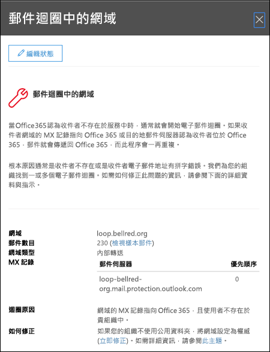

# 郵件迴圈洞察力

郵件迴圈錯誤是因為是它會浪費系統資源、 消耗組織的郵件磁碟區配額，並傳送給原始寄件者混淆未傳遞回報 （也稱為 Ndr 或彈跳訊息）。此洞察力報告時郵件迴圈中有找到您的組織中迴圈，並從前一天已迴圈中的訊息數目相關的電子郵件網域。

您可以按一下 [**檢視詳細資料]** 以查看彈出式窗格中的詳細資料。我們也會找出最常見的循環案例並修正迴圈提供建議的動作 （如果有的話）。

