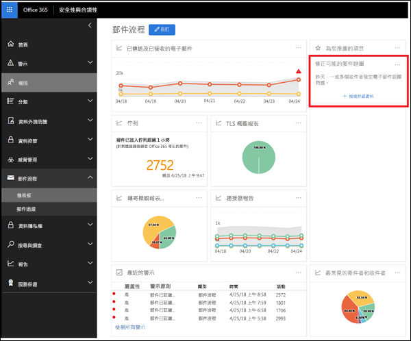

# 郵件迴圈深入解析Mail loop insight

郵件迴圈是不正確的因為它會浪費系統資源、 耗用貴組織的郵件磁碟區配額，並傳送給原始寄件者混淆未傳遞回報 （也稱為 Ndr 或退回的郵件）。A mail loop is bad because it wastes system resources, consumes your organization's mail volume quota, and sends confusing non-delivery reports (also known as NDRs or bounce messages) to the original senders. 此深入了解報告時郵件循環中找到您的組織中迴圈，並從前一天已在迴圈中的訊息數目相關的電子郵件網域。This insight reports when a mail loop is found in your organization, the email domains that are involved in the loop, and the number of messages from the previous day that were in the loop.

您可以按一下 [**檢視詳細資料]** 以查看彈出式視窗窗格中的詳細資料。You can click **View details** to see the details in a flyout pane. 我們也找出最常見的迴圈案例，並修正在迴圈提供建議的動作 （如果有的話）。We also identify the most common loop scenarios and provide the recommended actions (if available) to fix the loop.

![彈出式視窗窗格中按一下 [檢視詳細資料]，在 [郵件流程儀表板中郵件迴圈深入解析後](media/f7e21300-c62f-41ec-853f-4a2775cd8aa7.png)
