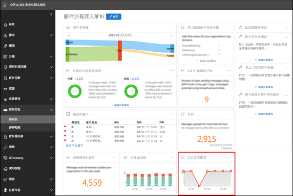
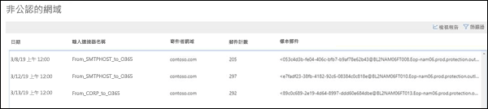
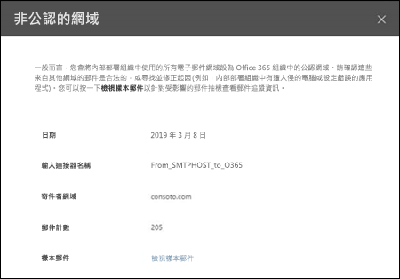

# 非公認的網域報告Non-accepted domain report

與**寄件者網域**深入解析類似，**非公認的網域**深入解析辨別來自內部電子郵件組織的訊息，但寄件者網域未設定為 Office 365 組織中的公認的網域。Similar to the **Sender domain** insight, the **Non-accepted domain** insight identifies messages from your on-premises email organization, but the sender's domain isn't configured as an accepted domain in your Office 365 organization.

如果我們有資料證明這些訊息的意圖是惡意的，Office 365 可能會限制這些訊息。Office 365 might throttle these messages if we have data to prove that the intent of these messages is malicious. 因此，了解正在發生的事情並解決問題非常重要。Therefore, it's important for you to understand what's happening and to fix the issue.

當您按一下小工具時，您會移至完整報表。When you click on the widget, you're taken to the full report. 在完整報告中，您可以按一下**檢視詳細資料**，以檢視表格中的資訊，如下圖所示：In the full report, where you can click **View details** to view the information in a table as shown in the following diagram:

當您選取表格中的一列時，飛出視窗會顯示更多詳細資料。When you select a row in the table, a flyout will show you more details. 您可以按一下**檢視樣本郵件**來看看識別出的郵件。You can click **view sample messages** to see some of the identified messages.

## 請參閱See also

如需有關郵件流程儀表板中的其他郵件流程深入解析，請參閱[安全性與合規性中心內的郵件流程深入解析](mail-flow-insights-v2.md)。For more information about other mail flow insights in the mail flow dashboard, see [Mail flow insights in the Security & Compliance Center](mail-flow-insights-v2.md).
