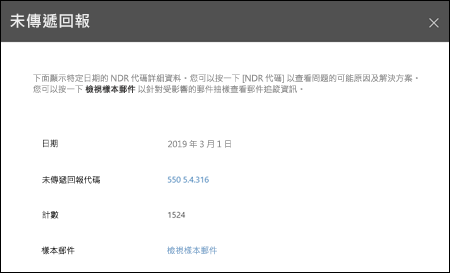

# 未傳遞回報Non-delivery report

**未傳遞回報**會顯示您組織使用者的未傳遞回報 (也稱為 NDR 或退回的郵件) 中最常發生的錯誤代碼。The **Non-delivery report** shows the most-encountered error codes in non-delivery reports (also known as NDRs or bounce messages) for users in your organization. 這份報告旨在顯示 NDR 的詳細資料，因此您可以針對問題進行疑難排解。This report is intended to show the details of NDRs, so you can troubleshoot problems.

您可以顯示所有 NDR 代碼的資訊，或按一下 [顯示資料範圍]\*\*\*\* 顯示特定代碼的資訊。You can show information for all NDR codes or a specific code by clicking **Show data for**. 您也可以按一下 [檢視詳細資料表格]\*\*\*\* 查看更詳細的檢視，如下圖所示：You can also click **View details table** to see a more detailed view as shown in the following diagram:

當您選取表格中的一列檢視特定 NDR 的詳細資料時，您可以使用詳細資料以進行疑難排解並採取必要動作。When you select a row in the table to view the details of the specific NDR, you can use the detailed information to troubleshoot and take the necessary actions.

## 另請參閱See also

如需有關郵件流程儀表板中的其他郵件流程深入解析，請參閱[安全性與合規性中心內的郵件流程深入解析](mail-flow-insights-v2.md)。For more information about other mail flow insights in the mail flow dashboard, see [Mail flow insights in the Security & Compliance Center](mail-flow-insights-v2.md).
