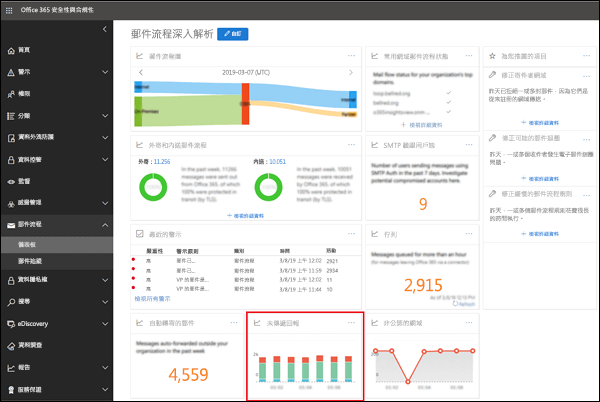
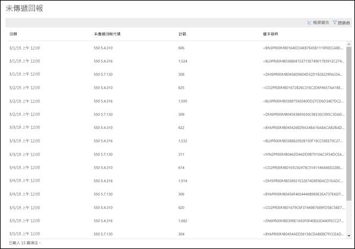

# 未傳遞報告

> [!NOTE]
> 本主題所述的功能尚未已部署至所有 Office 365 組織，並受限於變更。

**未傳遞報告**顯示您組織中的使用者在未傳遞回報 （也稱為 Ndr 或退回的郵件） 中的大部分遇到錯誤代碼。 這份報告被要顯示的 Ndr，詳細資料，因此您可以疑難排解問題。

您可以藉由按一下**顯示的資料**會顯示所有的 NDR 代碼或特定的程式碼的資訊。 您也可以按一下 [**檢視詳細資料] 表格**中查看詳細的檢視下圖所示：

當您要檢視特定的 NDR 的詳細資料表格中選取一列時，您可以使用的詳細的資訊，來疑難排解及必要的動作。

![未傳遞報告中的 [明細] 資料表中選取一列](media/non-delivery-report-details-table-select-row.png)

## 請參閱

如需郵件流程儀表板中其他郵件流程深入解析的詳細資訊，請參閱 <<c0>安全性 &amp; 合規性中心中的郵件流程深入解析。
