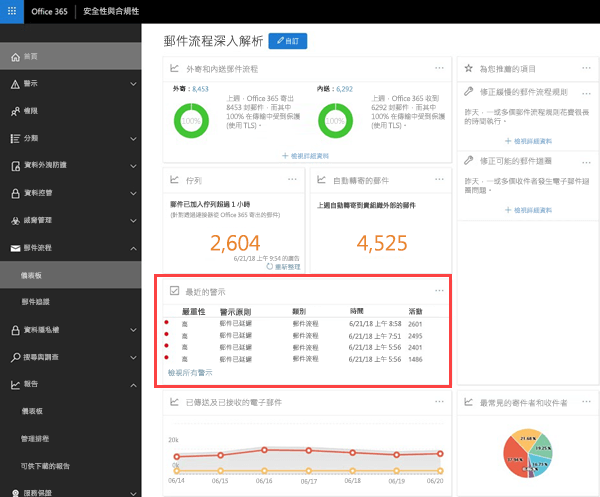
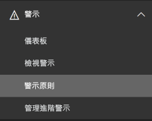
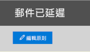
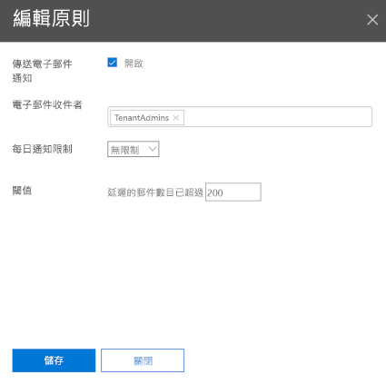
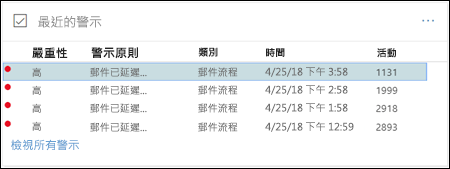
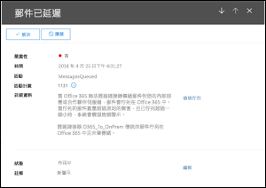
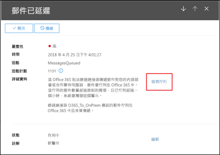
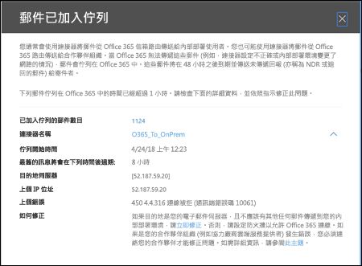
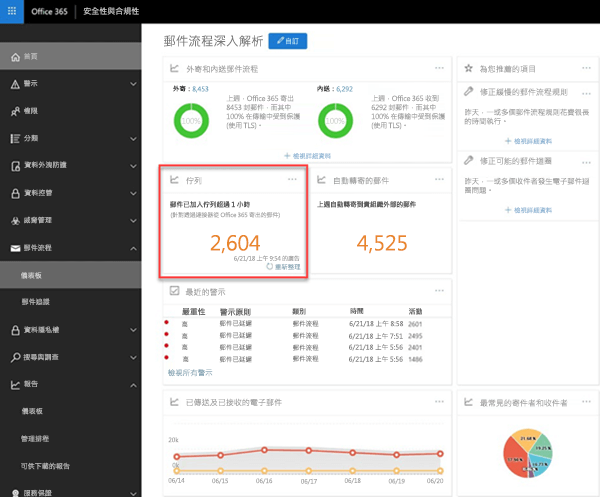

# 佇列警示和佇列Queue alerts and Queues

## 佇列警示Queue alerts and Queues

當無法使用連接器將郵件從 Office 365 組織發送到內部部署或合作夥伴電子郵件伺服器時，郵件將在 Office 365 中佇列。When messages can't be sent from your Office 365 organization to your on-premises or partner email servers using connectors, the messages are queued in Office 365. 造成這種情況的常見範例如下：Common examples that cause this condition are:

- 連接器的設定不正確。The connector is incorrectly configured.

- 您的內部部署環境中有已變更的網路或防火牆。There have been networking or firewall changes in your on-premises environment.

Office 365 會在 48 小時內持續嘗試傳送。Office 365 will continue to retry to delivery for 48 hours. 48 小時之後，郵件將會過期，且將會以未傳遞回報形式回傳至寄送者（也稱為 NDR 或退回的郵件）。After 48 hours, the messages will expire and will be returned to the senders in non-delivery reports (also known as a NDRs or bounce messages).

若佇列電子郵件量以超過預先定義的門檻（預設值為 2000封郵件），將在郵件流程儀表板中提供**最近的警示**，系統管理員將收到電子郵件通知（至其備用電子郵件地址）。If the queued email volume exceeds the pre-defined threshold (the default value is 2000 messages), the alerts will be available in the mail flow dashboard at **Recent alerts**, and admins will receive an email notification (to their alternative email address). 若要設定警示門檻，每日通知限制，及/或警示的收件者，請參閱下方**自訂佇列警示**一節。To configure the alert threshold, daily notification limit, and/or recipients of the alert, see the **Customize queue alerts** section below.

## 自訂佇列警示Customize queue alerts

郵件流程深入解析在警告  警示原則中建立名為延遲郵件（下方範例螢幕擷取畫面中的\*\*傳送電子郵件通知核取方塊）的警示原則 。Mail flow insights create an alert policy named **Messages have been delayed** (the **Send email notifications** check box in the example screen shot below) found in **Alerts** \> **Alert Policies**. 您可以透過點選原則修改門檻和警示收件者。You can modify the threshold and alert recipients by clicking on the policy.

您會看到新的原則資訊刀鋒視窗，然後便可按一下**編輯原則**。You'll see a new policy information blade, you can now click **Edit Policy**.

資訊刀鋒視窗會變成**編輯原則**。The information blade will change to the **Edit Policy**. 現在，您可以變更警示電子郵件的收件者，每日傳送通知的上限和觸發警示的最小門檻值（200 或以上）。You can now change the recipients for the alert email, the limit on the number of notifications sent per day, and the minimum threshold to trigger the alert (200 or more).

## 佇列警示詳細資料Queue alert details

當您按一下警示時，會出現警示詳細資料飛出視窗。When you click the alert, the alert details appear in a flyout pane.

您可以按一下佇列詳細資料的**檢視佇列**，查看全新飛出視窗中的佇列詳細資料、問題和修正連結。You can click **View queue** in the alert details to see the queue details, problems, and links to the available fixes in a new flyout pane.

## 佇列Queues

即使佇列郵件量尚未超過門檻，您仍然可以使用郵件流程儀表板中的**佇列**，查看已佇列超過一小時的郵件。Even if the queued message volume hasn't exceeded the threshold, you can still use the **Queues** area of the mail flow dashboard to see messages that have been queued for more than one hour. 您可以使用**佇列**區域來監視佇列郵件數（值為 0 表示郵件流程沒問題），並在佇列郵件數變太大前採取行動。You can use the **Queues** area to monitor the number of queued messages (the value 0 indicates mail flow is OK) and take action before the number of queued messages becomes too large.

當您按一下佇列中的佇列郵件數，將會出現佇列詳細資訊和問題修正方法的飛出視窗（與您在點按佇列警示詳細資訊的\*\*檢視佇列後出現之飛出視窗相同）。When you click the number of queued messages in **Queues**, the queue details and guidance for how to fix the issue will appear in a flyout pane (the same flyout that appears after you click **View queue** in the details of a queue alert).

## 請參閱See also

如需其他郵件流量儀表板中的郵件流程深入解析之詳細資訊，請參閱[安全性與合規性中心中郵件流程深入解析](mail-flow-insights.md)。For more information about other mail flow insights in the mail flow dashboard, see [Mail flow insights in the Security & Compliance Center](mail-flow-insights.md).
