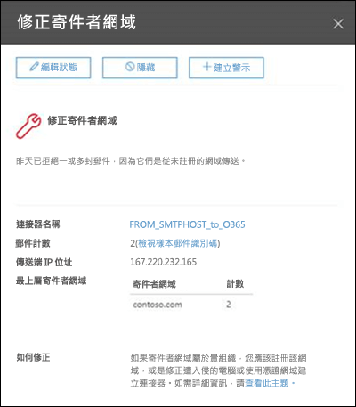

# 修正寄件者網域深入解析Fix sender domain insight

Office 365 要求從內部部署電子郵件環境發送到 Office 365 的郵件符合某些安全標準：Office 365 requires messages sending from internal on-premises email environments to Office 365 to meet certain security criteria:

- 您已在 Office 365 中建立了輸入連接器，以使用來源 IP 位址或憑證對來自內部部署電子郵件伺服器的 SMTP 連接進行驗證。You've created an inbound connector in Office 365 to authenticate SMTP connections from your on-premises email server by using the source IP address or a certificate.

- 您已將內部部署電子郵件伺服器配置為透過 Office 365 將電子郵件中繼到外部世界。You've configured your on-premises email server to relay email via Office 365 to external world.

- 在您的設定中，下列句子之一成立：In your configuration, one of the following statements is true:

  - 寄件者的電子郵件網域已在 Office 365 組織中註冊。The sender's email domain is registered in your Office 365 organization. 如需詳細資訊，請參閱在 Office 365 中新增帳戶。For more information, see Add or edit custom DNS records in Office 365.

  - 您的內部部署電子郵件伺服器配置為使用憑證向 Office 365 發送電子郵件，該憑證包含或完全符合您在 Office 365 中註冊的域名，並且您已用該網域在 Office 365 中建立了基於憑證的連接器。Your on-premises email server is configured to use a certificate to send email to Office 365, the certificate contains or exactly matches a domain name that you've registered in Office 365, and you've created a certificate based connector in Office 365 with that domain. 

不符合條件的郵件將不屬於公司，且可能會被拒絕。Messages that don't meet the criteria will not be attributed to the organization and could be rejected.

**修正寄件者網域**深入解析會顯示您不符合條件之內部部署環境的電子郵件，可幫助您找出您內部部署電子郵件環境中可能遭入侵的電腦以及使用者帳戶，協助您採取補救措施。The **Fix sender domain** insight shows you email from your on-premises environment that doesn't meet the criteria, helps you to identify potentially compromised machines and user accounts in your on-premises email environment, and helps you to take remediation actions.

當您按下**檢視詳細資料**，您會被帶到另一個小工具中，並獲得更多詳細資料，如下圖所示：When you click **View details**, you are taken to another widget with more details as shown in the following diagram:

您會看到用來將郵件傳送到 Office 365 的輸入連接器。You'll see the inbound connector that was used to deliver the messages to Office 365. 您也可以按一下**檢視樣本郵件識別碼**，查看從您內部部署電子郵件環境中傳送之郵件的詳細資料。You can also click **view sample message IDs** to see details for the messages that were sent from your on-premises email environment. 因為 Office 365 拒絕這些郵件，您無法使用郵件追蹤，但您可以使用的範例郵件識別碼內部電子郵件環境中追蹤的訊息。Because these messages were rejected by Office 365, you can't use message trace, but you can use the sample message ids to track the messages in your on-premises email environment.

## 請參閱See also

如需其他郵件流量儀表板中的郵件流程深入解析之詳細資訊，請參閱[安全性與合規性中心中郵件流程深入解析](mail-flow-insights-v2.md)。For more information about other mail flow insights in the mail flow dashboard, see [Mail flow insights in the Security & Compliance Center](mail-flow-insights-v2.md).
