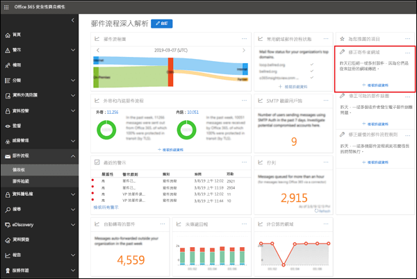

# 修正寄件者網域深入解析

Office 365 需要從內部電子郵件環境到 Office 365 傳送到符合特定安全性條件的郵件：

- 您已在使用來源 IP 位址或憑證驗證從您的內部部署電子郵件伺服器的 SMTP 連線的 Office 365 中建立的輸入的連接器。

- 您已設定內部部署電子郵件伺服器轉送外部世界透過 Office 365 電子郵件。

- 在您的組態，其中一個下列陳述式為真：

  - 寄件者的電子郵件網域註冊 Office 365 組織中。 如需詳細資訊，請參閱 < Office 365 中的 [新增網域。

  - 內部部署電子郵件伺服器設定為使用憑證來傳送電子郵件給 Office 365 憑證包含或完全符合您已在 Office 365 中註冊的網域名稱，您已在 Office 365 中建立憑證型連接器程式網域。 

不符合準則的郵件不歸因於組織，可能會遭到拒絕。

**修正寄件者網域**深入了解顯示您的電子郵件從內部部署環境不符合準則，可協助您識別可能入侵的機器和使用者帳戶在內部部署電子郵件環境中，可協助您採取修復動作。

當您按一下 [**檢視詳細資料**時，您將被帶往另一個小工具以更多的詳細資訊，如下圖所示：

![[詳細資料] 小工具在修正寄件者網域深入解析](media/sender-domain-view-details.png)

您會看到已用來將郵件傳遞到 Office 365 的輸入的連接器。 您也可以按一下**檢視範例郵件識別碼**，以查看從內部部署電子郵件環境傳送郵件的詳細資訊。 因為這些郵件所拒絕的 Office 365，您無法使用郵件追蹤，但您可以使用範例郵件識別碼在內部部署電子郵件環境中追蹤郵件。

## 另請參閱

如需郵件流程儀表板中其他郵件流程深入解析的詳細資訊，請參閱 <<c0>安全性 &amp; 合規性中心中的郵件流程深入解析。
