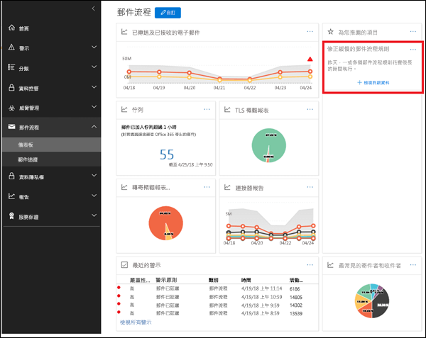
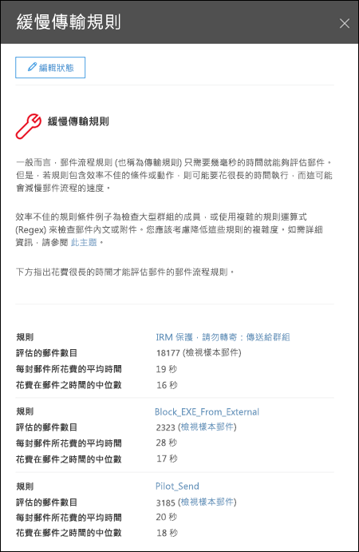

# 慢速郵件流程規則洞察力

無效率的郵件流程規則 （也稱為傳輸規則） 可能會導致為您組織的郵件流程延遲。此洞察力報告郵件流程規則所影響您的組織郵件流程。這些類型的規則範例是：

- 使用大型的群組**成員**的條件。

- 使用複雜的規則運算式 (regex) 模式比對的條件。

- 使用中的附件內容檢查的條件。

洞察力可協助您識別及微調郵件流程規則來協助減少郵件流程延遲。

當您按一下 [**檢視詳細資料**時] 彈出式] 窗格會顯示您可以在其中檢閱規則。在彈出式] 窗格中，也可以按一下 [**檢視範例郵件**以查看郵件何種影響規則。

