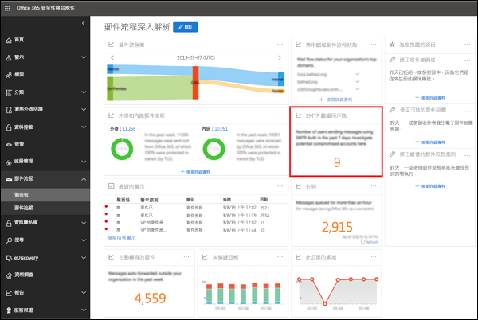
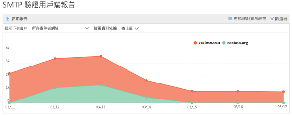
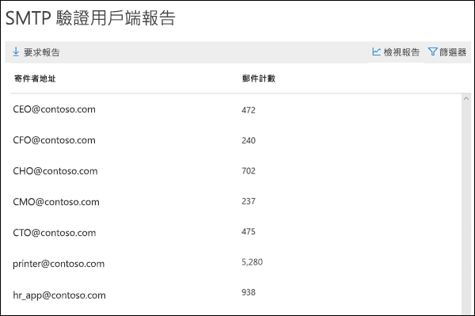
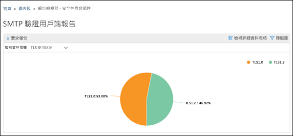
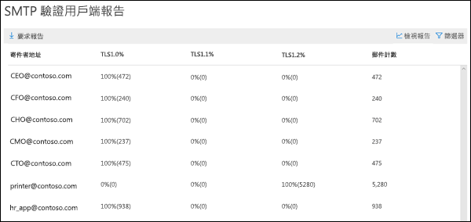

# SMTP 驗證用戶端報告

**SMTP 驗證用戶端**報告會醒目提示您組織中的使用者或系統帳戶對 SMTP 驗證用戶端提交通訊協定的使用。 此舊通訊協定（使用端點 smtp.office365.com）僅提供基本身份驗證，並且易受帳戶洩漏使用以發送電子郵件。  這份報告可讓您檢查是否有異常活動。 它也顯示使用 SMTP 驗證的客戶端或裝置的 TLS 使用量資料。

郵件流程儀表板中顯示的小工具表示前 7 天內使用 SMTP 驗證通訊協定的使用者或服務帳戶的數量。

按一下小工具中會開啟一個飛出示窗，提供上週 TLS 的使用情況與用量的彙總檢視。

當您按一下**SMTP 驗證用戶端報告**的連結，您會看到兩個主要資料樞紐與兩個資料檢視。 資料樞紐是**寄出量**與 **TLS 使用方式**。 資料檢視是圖表和詳細資料表格。

**寄出量**檢視會顯示在指定時間範圍內使用 SMTP 驗證所傳送的訊息數量。 您可以按一下**篩選條件**來調整範圍。 圖表會依寄件者的網域來排列。 您可以透過選取**顯示資料**下拉式清單中的網域看到不同網域的資料。

您可以透過點選**檢視詳細資料表格**來檢視寄件者與訊息數的詳細資訊。 若要返回圖表，請按一下**檢視報告**。

**TLS 使用方式**樞紐是很重要，因為 Office 365 TLS1.0 和 TLS1.1 即將面臨淘汰。 如果許多舊裝置和應用程式僅能夠使用帶有 SMTP 驗證的TLS1.0，則將無法發送電子郵件。透過此樞紐，您可以識別仍在使用舊版 TLS 的用戶和系統帳戶，並對其執行操作。

您可以透過點選**檢視詳細資料表格**來檢視寄件者，寄件者使用 SMTP 驗證的 TLS 版本，與訊息數的詳細資訊。 若要返回圖表，請按一下**檢視報告**。

您也可以透過點按要求報告，下載更詳細的報告版本。

## 請參閱

如需有關郵件流程儀表板中的其他郵件流程深入解析，請參閱[安全性與合規性中心內的郵件流程深入解析](mail-flow-insights-v2.md)。
