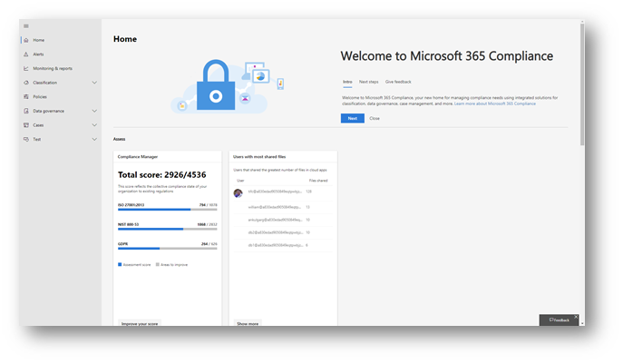
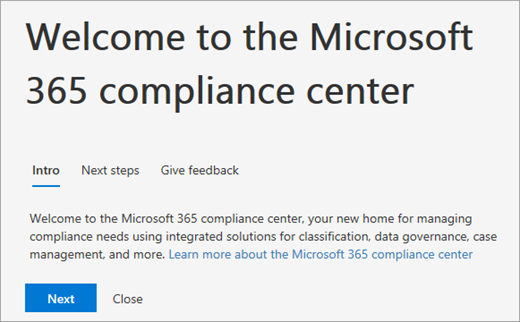
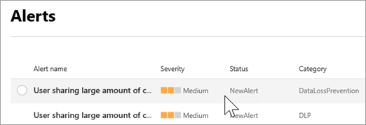

# 歡迎使用所有新的 Microsoft 365 合規性中心

## 概觀

如果您有興趣貴組織的合規性狀態，則要告訴新的[Microsoft 365 合規性中心](https://compliance.microsoft.com)。 Microsoft 365 合規性中心 」 提供讓您輕鬆存取的資料和管理貴組織的合規性所需的工具需求。 

閱讀本篇文章以了解 Microsoft 365 合規性中心、[如何取得它](#how-do-i-get-this)、[常見問題集](#frequently-asked-questions)，請與您的[下一個步驟](#next-steps)。

## 歡迎使用 Microsoft 365 合規性

當您第一次移至您 Microsoft 365 合規性中心時，您將氣急敗壞下列歡迎訊息：

歡迎橫幅提供一些建議如何快速入門下, 一個步驟，為您提供的意見反應邀請。

## [評估] 區段

**評估**] 區段上首頁] 頁面上顯示您一覽相對於[資料保護和合規性](protect-access-to-data-and-services.md)貴組織所做的動作。

![評估] 區段中的 Microsoft 365 合規性中心](media/m365-compliance-center-assess.png)

從這裡開始，您可以移至 [Microsoft 合規性分數] 卡片，引導您[合規性管理員中](meet-data-protection-and-regulatory-reqs-using-microsoft-cloud.md)，您可以用它來檢閱或編輯您的組態，並可能提升整體合規性分數。

您會看到其他卡片，例如一個顯示貴組織的雲端應用程式相容性和另一個顯示資料的使用者有關使用共用檔案時，連結至[Cloud App Security](https://docs.microsoft.com/cloud-app-security/)或其他工具，您可以在其中探索資料。

## [保護] 區段

在 [首頁] 頁面上的 [**保護**] 區段包含卡，提供您的[標籤](labels.md)、[資料外洩防護 (DLP)](data-loss-prevention-policies.md)]，在使用中，協力廠商應用程式的高階資訊共用的檔案、 陰影 IT 應用程式] 中，依此類推。 

每個卡有其中您可以了解更多報告或其他資訊的連結。

## [回應] 區段

**回應**] 區段的 [首頁] 頁面上呈現[的警示](alerts.md)和[擱置的配置](disposition-reviews.md)，您會想要檢閱，而且可能作。

![回應] 區段中的 Microsoft 365 合規性中心](media/m365-compliance-center-respond.png)

卡，例如 [[作用中警示](alerts.md)] 卡片，包括您可以在其中檢視更多詳細的資訊，例如重要性、 狀態、 類別及多個頁面的連結。

 

## 輕鬆瀏覽至更多的法規遵循特性和功能

除了卡在 [首頁] 頁面中的連結，您會發現窗格可讓您輕鬆存取您的[提醒](alerts.md)、[報告](reports-in-security-and-compliance.md)、[原則](alert-policies.md)、 合規性解決方案，以及更多與螢幕左側。 

|  |  |
|---------|---------|
|  |   移至**提醒**，以檢視及解析[提醒](alerts.md)  請造訪**監視 & 報告**以檢視有關[標籤使用量和保留](sensitivity-labels.md)、 [DLP 原則比對，並覆寫](view-the-dlp-reports.md)、[共用的檔案](https://docs.microsoft.com/cloud-app-security/file-filters)、[使用中的協力廠商應用程式](https://docs.microsoft.com/cloud-app-security/discovered-apps)，等等。  依序展開 [**分類**] 區段中，以存取您的[標籤](labels.md)、[標籤原則](sensitivity-labels.md#what-label-policies-can-do)、[敏感資訊類型](what-the-sensitive-information-types-look-for.md)和[標籤分析](view-label-activity-for-documents.md)。  移至**原則**來檢視[提醒](alerts.md)，以及存取您的[DLP](data-loss-prevention-policies.md)和[保留](retention-policies.md)原則。   使用 [**解決方案**] 區段中的連結，即可存取貴組織的合規性解決方案。 這些包括：  [資料控管 > 配置](disposition-reviews.md) [eDiscovery （預覽）](compliance20/overview-ediscovery-20.md) [監督](supervision-policies.md) [資料調查](datainvestigations/overview-data-investigations.md) [資料主體要求](manage-gdpr-data-subject-requests-with-the-dsr-case-tool.md)        |

## 如何取得這？

- 如果您已具有新的 Microsoft 365 合規性中心，您必須它推出。 在[新的 Microsoft 365 合規性中心](microsoft-security-and-compliance.md#microsoft-365-compliance-center)會現在可使用。

- 以全域管理員或合規性管理員，請造訪 Microsoft 365 規範中心] 內，移至[https://compliance.microsoft.com](https://compliance.microsoft.com)並登入。 

- 若要深入了解關於需求的詳細資訊，請參閱[所需授權和權限](microsoft-security-and-compliance.md#required-licenses-and-permissions)。

## 常見問題集

### 為何我我採取至 Office 365 安全性 & 合規性中心來執行一些工作，例如定義特定原則？

我們仍在開發 Microsoft 365 規範中心] 內，我們將持續加入更多的功能和解決方案接下來個月。 同時，有一些必須執行安全性 & 合規性中心中的工作。 在這些情況下，您就會進入自動其中您可以執行工作的例如建立或編輯監督原則的位置。

### 為什麼我看新的 Microsoft 365 合規性中心尚未？

首先，請確定您具備適當[授權和權限](microsoft-security-and-compliance.md#required-licenses-and-permissions)。 然後，在登入[https://compliance.microsoft.com](https://compliance.microsoft.com)。 如果您沒有看到新的合規性中心，您會有非常推出。

## 後續步驟

- **檢閱您的 Microsoft 合規性分數**，並使用合規性管理員來改善您的分數。 若要深入了解，請參閱 <<c0>使用合規性管理員來符合資料保護和法規需求時使用 Microsoft 雲端服務。

- **檢閱您的組織資料外洩防護原則**並讓請視需要調整。 若要深入了解，請參閱 <<c0>資料外洩防護原則概觀。 

- **取得熟悉，並設定 Microsoft Cloud App Security**。 請參閱[快速入門： 開始使用 Microsoft Cloud App Security](https://docs.microsoft.com/cloud-app-security/getting-started-with-cloud-app-security)。  

- **瀏覽您 Microsoft 365 合規性中心通常**，並請務必先檢閱任何提醒或可能引發的潛在風險。 移至 [[https://compliance.microsoft.com](https://compliance.microsoft.com)並登入。