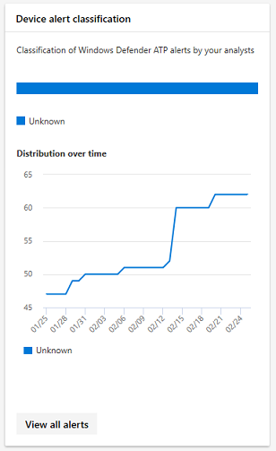

# 在 Microsoft 365 安全性中監視裝置

在 Microsoft 365 安全中心保留裝置安全且最新狀態及特別色的潛在威脅。

## 檢視裝置提醒

從 Windows Defender ATP （隨附於 E5 授權），在您的裝置上取得相關資料外洩活動] 和 [其他威脅的最新提醒。 Microsoft 365 安全性中心有幾個卡，可讓您有效地監視這些警示概括來說，根據您偏好的工作流程。

### 監視影響力高且警示

每個 Windows Defender ATP 警示有相對應的嚴重性 — 高、 中、 低，或資訊性 — 表示其潛在影響到您的網路若留自動。  

使用 [**裝置警示嚴重性**] 卡片，以專注特別的是更嚴重，且可能需要即時回應警訊上。 從這個卡，您可以檢視 Windows defender 資訊安全中心入口網站的詳細資訊。

### 了解來源的提醒

Windows Defender ATP 會運用廣泛的安全性感應器和智慧來源]，以產生警示中的資料。 例如，它可以使用 Windows Defender 防毒軟體和協力廠商反惡意程式碼，以及透過 web 服務 API 提供自己自訂威脅情報偵測資訊。

**裝置警示偵測**來源卡片顯示由來源警示的通訊。 此卡可協助您追蹤活動相關的特定來源，尤其是您自訂的來源。 您也可以使用這讓您專注於來自感應器未設定為自動封鎖惡意活動或元件的提醒。

從這個卡，您可以檢視 Windows defender 資訊安全中心入口網站的詳細資訊。

### 了解觸發警示的威脅的類型

Windows Defender ATP 排序每個提醒到類別，代表特定階段的攻擊鏈結] 或 [威脅元件的類型。 例如，偵測到威脅活動可能分類為 「 側面移動 」 以指出活動牽涉到嘗試連線到網路上的其他裝置，且可能發生之後攻擊者獲得了初始據點。 當偵測到，威脅元件可能可以歸類廣泛作為 「 惡意軟體 」 或更明確地說 「 勒索軟體 」、 「 認證竊取 」 或其他類型的惡意或不必要的軟體。

**裝置威脅類別**卡片顯示提醒的散佈，分為下列類別。 您可以使用這項資訊來識別威脅活動，例如認證竊取，可以有多大的影響例如相較於社交，嘗試的嘗試。 您也可以使用這要監視之可能破壞性的威脅，如勒索軟體。

### 監視作用中警示

**裝置警示狀態**卡片會指出未解決，可能需要加以留意的提醒數目。 從這個卡，您可以檢視 Windows defender 資訊安全中心入口網站的詳細資訊。

### 解決的警示的監視器分類

時，解決視窗 Defender ATP 警示，您的安全性人員可以指定警示是否已經驗證為：

* 識別實際資料外洩活動或威脅元件，則為 true 警示
* 不正確地偵測到一般活動，則為 false 提醒

**裝置警示分類**卡片顯示是否有已解決的警示歸類為 true 或 false 的提醒。 從這個卡，您可以檢視 Windows defender 資訊安全中心入口網站的詳細資訊。

附註： 在某些情況下，分類資訊則無法使用某些警示。

### 監視判定的解析提醒

除了來分類是否警示，則為 true 或 false 解析期間，您的安全性人員可以提供決定，指出找不到驗證警示時的一般或惡意活動的類型。

**裝置警示判斷**卡片顯示特別是在每個警示所提供的決定：

* **APT** – 進階持續性威脅，指出偵測到的活動或威脅元件設計用來取得在受影響的網路據點複雜資料外洩的一部分  
* **惡意程式碼**– 惡意檔案或程式碼
* **安全性人員**– 安全性人員所執行的一般活動
* **安全性測試**– 活動或元件為了模擬實際威脅及預期會觸發安全性感應器並產生警示
* **不必要的軟體**– 應用程式和其他軟體，不會視為惡意，但否則違反原則或可接受的使用標準
* **其他人**– 未落在提供的類型] 下的任何其他判斷

從這個卡，您可以在 [Windows defender 資訊安全中心檢視的詳細資訊。

### 了解哪些裝置面臨的風險

**裝置保護**顯示裝置的風險層級。 風險層級依據因素影響，例如類型和裝置上有警示的嚴重性。

## 監視和報告 Intune 管理的裝置狀態

下列監視和報告包含在 Intune 中註冊裝置的資料。 從 unenrolled 裝置資料並不包含在內。 只有全域系統管理員可以檢視這些卡片。

Intune 中註冊的裝置資料，包括：

* 裝置合規性
* 使用作用中的惡意程式碼的裝置
* 類型的裝置上的惡意程式碼
* 在裝置上的惡意程式碼
* 裝置與惡意程式碼偵測
* 使用者與惡意程式碼偵測

### 監視裝置相容性

**裝置合規性**顯示多少部裝置，在 Intune 中註冊遵守設定原則。

### 探索裝置與惡意程式碼偵測

**裝置惡意程式碼偵測**提供與惡意程式碼尚未到期，以擱置動作完整解析的 Intune 註冊裝置的數目 — 重新啟動、 完整掃描或手動使用者動作，或如果未成功完成的補救動作。

### 了解偵測到的惡意程式碼的類型

**類型的裝置上的惡意程式碼**會顯示不同種類的惡意程式碼，已偵測到在 Intune 中註冊的裝置上。 您可以檢查 Microsoft 365 安全性中心中的每個類型。

![在 [裝置] 卡片上的惡意程式碼的類型](./media/security-docs/types-of-malware-on-devices.png)

### 了解您的裝置上偵測到的特定惡意程式碼

**在裝置上的惡意程式碼**提供特定的惡意程式碼偵測到您的裝置上的清單。

![在 [裝置] 卡片上的惡意程式碼](./media/security-docs/malware-on-devices.png)

### 了解哪些裝置有最多惡意程式碼

**惡意程式碼偵測裝置**顯示哪些裝置具有最多惡意程式碼偵測的資訊。 在 Microsoft 365 安全性管理中心中，您可以調查惡意程式碼是否為作用中，使用 Intune 中的裝置，以及其管理狀態的人員。

### 了解哪些使用者必須具有最多惡意程式碼的裝置

**使用惡意程式碼偵測使用者**顯示的使用者與有大部分的惡意程式碼偵測的裝置。 在 Microsoft 365 安全中心，您可以看到多少部裝置會指派給每位使用者及每個裝置和惡意程式碼的類型的詳細資訊。

## 監控及管理 ASR 規則部署與偵測

[攻擊面縮減 (ASR) 規則](https://docs.microsoft.com/en-us/windows/security/threat-protection/windows-defender-exploit-guard/attack-surface-reduction-exploit-guard)協助防止動作和通常由惡意探索搜尋惡意程式碼用來感染機器的應用程式。 這些規則會控制何時和如何執行可執行檔。 例如，您可以防止 JavaScript 或 VBScript 啟動已下載的可執行檔，封鎖來自 Office 巨集、 Win32 API 呼叫或封鎖程序的執行從 USB 磁碟機。

**攻擊縮減規則**卡在裝置提供的規則部署的概觀。

卡片上的上方列顯示下列部署模式中的裝置總數：

* **封鎖模式**– 與至少一個規則設定為封鎖偵測到活動的裝置
* **稽核模式**– 具有任何規則的裝置設定為偵測到的封鎖活動，但有至少一個規則設定為偵測到的稽核活動  
* **關閉**– 裝置已關閉的所有 ASR 規則

這個介面卡的下半部會顯示在裝置規則的設定。 每一列會指出設定為 [封鎖] 或 [稽核偵測或已完全關閉規則的裝置的數目。

### 檢視 ASR 偵測

若要檢視您的網路 ASR 規則偵測的詳細的資訊，請**攻擊縮減規則**卡上選取 [**檢視偵測的資訊**。 在 [詳細資料報告] 頁面的 [**偵測的資訊**] 索引標籤會隨即開啟。

![偵測的資訊] 索引標籤](./media/security-docs/detections-tab.png)

在頁面頂端的圖表顯示偵測透過時間堆疊偵測已封鎖或稽核。 在底部表列出最近偵測的資訊。 若要了解性質的偵測，在資料表上使用下列資訊：

* **偵測到檔案**– 檔案、 通常指令碼或文件，其內容觸發疑似的攻擊活動
* **規則**– 描述規則設計來攔截攻擊活動名稱。 了解現有 ASR 規則
* **來源應用程式**– 之應用程式的已載入或執行觸發疑似的攻擊活動的內容。 這可能是合法的應用程式，例如網頁瀏覽器、 Office 應用程式或像是 PowerShell 系統工具
* **Publisher** – 發行來源應用程式的廠商

### 檢閱裝置 ASR 規則設定

在 [**攻擊縮減規則**報告] 頁面上，移至 [檢閱規則設定為個別的裝置**組態**] 索引標籤。 選取裝置以取得每個規則是否處於封鎖模式、 稽核模式，或完全關閉的詳細的資訊。

![組態] 索引標籤](./media/security-docs/configuration-tab.png)

Microsoft Intune 提供 ASR 規則的管理功能。 如果您想要更新您的設定，選取 [**設定裝置**] 下的 [**快速入門**中開啟在 Intune 裝置管理] 索引標籤。

### 從 ASR 規則排除檔案

藉由從偵測排除檔案，您可以防止不必要的則為 false 正數偵測及更多充滿部署攻擊縮減規則以封鎖模式。

雖然攻擊縮減規則的檔案排除在 Microsoft Intune 管理，Microsoft 365 安全性中心 」 會提供分析工具來協助您了解的檔案，會觸發偵測的資訊。 它也可協助收集您可能想要排除檔案的名稱。

若要開始分析偵測並收集排除的檔案，移至 [**攻擊縮減規則**報告] 頁面上的 [**新增排除項目**] 索引標籤。

![新增排除項目] 索引標籤](./media/security-docs/add-exclusions-tab.png)

資料表會列出您攻擊縮減規則所偵測到的所有檔案名稱。 一旦您選取的檔案或多個檔案，您可以檢閱將這些檔案新增至您的例外狀況的影響：

* 偵測總數減少
* 偵測所影響的裝置總數減少

若要排除選取其完整路徑與檔案的清單，請選取 [**取得排除的路徑**。

如需排除的詳細資訊及如何將它們新增的詳細的指示，請閱讀[疑難排解攻擊縮減規則](https://docs.microsoft.com/en-us/windows/security/threat-protection/windows-defender-exploit-guard/troubleshoot-asr)。
