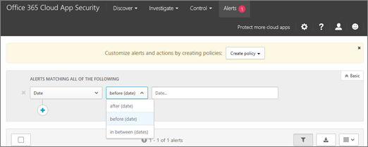

# Office 365 雲端應用程式的安全性更新期間 2017Office 365 Cloud App Security updates during 2017
    
## Office 365 雲端應用程式安全性版本 112Office 365 Cloud App Security release 112

*發行 2017 年 12 月 24、**Released December 24, 2017* 
  
在**下列[版本 112 Microsoft 雲端應用程式安全性](https://docs.microsoft.com/cloud-app-security/release-notes#cloud-app-security-release-112)**：**Following [Microsoft Cloud App Security release 112](https://docs.microsoft.com/cloud-app-security/release-notes#cloud-app-security-release-112)**: 
  
- **相關的獨到抽屜**。活動記錄檔中您現在已可存取相關的獨到抽屜按一下使用者名稱或 IP 位址。**Relevant insight drawer**. In the Activity log, you can now access the relevant insight drawer by clicking on a user name or IP address. 
    
    
  
- **能夠檢視按一下多項活動**。在相關的獨到抽屜中，您可以按一下以檢視在所選活動的 48 小時內執行的所有活動的時鐘圖示。**Ability to view more activities with a click**. In the relevant insight drawer, you can click the clock icon to view all activities performed within 48 hours of a selected activity. 
    
    
  
- **Juniper SRX 記錄剖析器增強功能**。改良功能已對 Juniper SRX 雲端探索記錄剖析器。**Log parser improvements for Juniper SRX**. Improvements were made to the Cloud Discovery log parser for Juniper SRX. 
    
## Office 365 雲端應用程式安全性版本 111Office 365 Cloud App Security release 111

*發行 2017 年 12 月 10，**Released December 10, 2017* 
  
在**下列[版本 111 Microsoft 雲端應用程式安全性](https://docs.microsoft.com/cloud-app-security/release-notes#cloud-app-security-release-111)**：**Following [Microsoft Cloud App Security release 111](https://docs.microsoft.com/cloud-app-security/release-notes#cloud-app-security-release-111)**: 
  
- **時間篩選器增強功能**。時間篩選現在容易使用。若要存取時間篩選，檢視，例如活動記錄檔、 原則、 提醒、 使用 [進階] 檢視中的選擇 [篩選器的清單中的**日期**。然後選擇一個選項，例如之前、 之後，或在之間套用時間篩選。**Time filter improvements**. Time filters are now easier to use. To access a time filter, in a view, such as Activity log, Policies, Alerts, using the Advanced view, choose **Date** in the list of filters. Then choose an option, such as before, after, or in between to apply the time filter. 
    
    
  
## Office 365 雲端應用程式安全性版本 110Office 365 Cloud App Security release 110

*發行 2017 年 11 月 26**Released November 26, 2017* 
  
在**下列[版本 110 Microsoft 雲端應用程式安全性](https://docs.microsoft.com/cloud-app-security/release-notes#cloud-app-security-release-110)**：**Following [Microsoft Cloud App Security release 110](https://docs.microsoft.com/cloud-app-security/release-notes#cloud-app-security-release-110)**: 
  
- **現在通常可用的 SIEM 伺服器整合**。您的 SIEM 伺服器連線至 Office 365 雲端應用程式安全性。您可以立即傳送提醒與活動自動選擇的 SIEM 伺服器 SIEM 代理程式進行設定。請參閱[整合您 SIEM 的伺服器與 Office 365 雲端應用程式安全性](integrate-your-siem-server-with-office-365-cas.md)。**SIEM server integration now generally available**. Connect your SIEM server to Office 365 Cloud App Security. You can now send alerts and activities automatically to your SIEM server of choice by configuring SIEM Agents. See [Integrate your SIEM server with Office 365 Cloud App Security](integrate-your-siem-server-with-office-365-cas.md).
    
- **更輕鬆地說明內容的存取**權。使用新的問號的右上角中，您現在已可存取 Office 365 雲端應用程式安全性入口網站的頁面中的 [從的說明內容。每個連結是即時線上、 採取了您所需要的資訊、 根據你所在的頁面。**Easier access to help content**. Using the new question mark in the upper right corner, you can now access the help content from within the pages of the Office 365 Cloud App Security portal. Each link is context-sensitive, taking you to the information you need, based on the page you're on. 
    
- **傳送意見反應**。使用笑臉中的右上角，可以從 Office 365 雲端應用程式安全性入口網站的每一頁立即傳送意見反應。這可讓您回報錯誤、 要求的新功能並直接與 Office 365 雲端應用程式安全性小組共用您的功能。**Send us feedback**. Using the smiley face in the upper right corner, you can now send feedback from every page of the Office 365 Cloud App Security portal. This enables you to report bugs, request new features and share your experience directly with the Office 365 Cloud App Security team. 
    
## Office 365 雲端應用程式安全性版本 102Office 365 Cloud App Security release 102

*發行 2017 年 8 月 13、**Released August 13, 2017* 
  
在**下列[版本 102 Microsoft 雲端應用程式安全性](https://docs.microsoft.com/cloud-app-security/release-notes#cloud-app-security-release-102)**：**Following [Microsoft Cloud App Security release 102](https://docs.microsoft.com/cloud-app-security/release-notes#cloud-app-security-release-102)**: 
  
- **新的使用者將正在調查動作**啟用的向下鑽研新增層級至使用者調查。調查] 索引標籤上您可以將滑鼠指標移入活動、 user 或帳戶並將其套用做為篩選條件，並從該處，您可以檢視相關的活動或事件。**New user investigation actions** enable an added level of drill-down to user investigations. On an Investigate page, you can hover on an activity, user, or account and apply it as a filter, and from there, you can view related activities or events. 
    
## Office 365 雲端應用程式安全性版本 100Office 365 Cloud App Security release 100

*發行 2017 年 7 月 17**Released July 17, 2017* 
  
在**下列[版本 100 Microsoft 雲端應用程式安全性](https://docs.microsoft.com/cloud-app-security/release-notes#cloud-app-security-release-100)**：**Following [Microsoft Cloud App Security release 100](https://docs.microsoft.com/cloud-app-security/release-notes#cloud-app-security-release-100)**: 
  
- **安全性副檔名**為新的儀表板其中您可以集中管理所有安全性延伸模組的 Office 365 雲端應用程式安全性，包括 API 權杖和 SIEM 代理程式。若要檢視安全性 extensions 儀表板，請遵循下列步驟：**Security extensions** is a new dashboard where you can centrally manage all your security extensions for Office 365 Cloud App Security, including API tokens and SIEM agents. To view the Security extensions dashboard, follow these steps: 
    
1. 移至 [[https://protection.office.com](https://protection.office.com)及使用 Office 365 工作或學校帳戶登入。(這會引導您安全性&amp;規範中心。)Go to [https://protection.office.com](https://protection.office.com) and sign in using your work or school account for Office 365. (This takes you to the Security &amp; Compliance Center.) 
    
2. 移至 [**提醒** \> **管理進階提醒**。Go to **Alerts** \> **Manage advanced alerts**.
    
3. 選擇 [**移至 Office 365 的雲端應用程式安全性**]。Choose **Go to Office 365 Cloud App Security**.
  
4. 選擇 [**設定** \> **安全性延伸模組**。Choose **Settings** \> **Security extensions**.
    
    
  
- **剖析的改善**。剖析機制雲端探索記錄檔中所做的改良。內部錯誤是大幅可能發生的。**Improved parsing**. Improvements were made in the Cloud Discovery log parsing mechanism. Internal errors are significantly less likely to occur. 
    
- **預期記錄格式**。雲端探索記錄檔的預期的記錄檔格式現在提供範例 Syslog 格式和 FTP 格式。**Expected log formats**. The expected log format for Cloud Discovery logs now provides examples for both Syslog format and FTP format. 
    
## 相關主題Related topics

[Office 365 雲端應用程式安全性說明內容Office 365 Cloud App Security help content](office-365-cas-help.md)

[Office 365 雲端應用程式安全性的新功能What is new in Office 365 Cloud App Security](new-in-office-365-cas.md)
  
[推出 Office 365 雲端 App 安全性後的使用活動Utilization activities after rolling out Office 365 Cloud App Security](utilization-activities-for-ocas.md)

