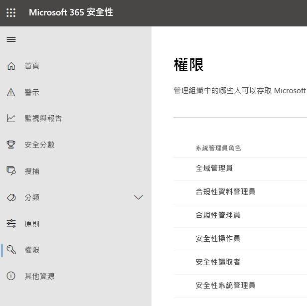
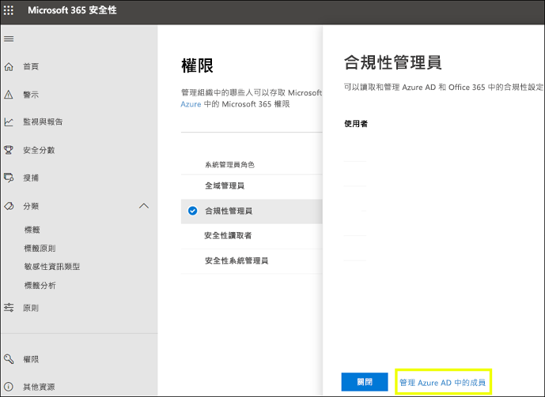
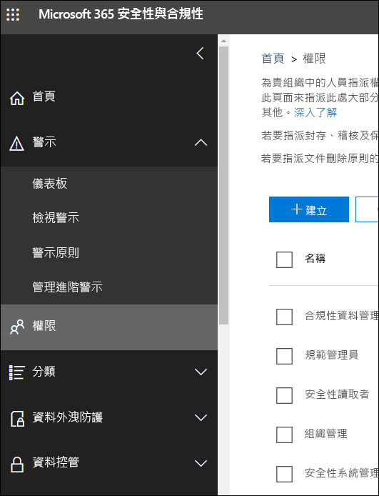

# Microsoft 365 合規性中心和 Microsoft 365 安全性中心中的權限Permissions in the Microsoft 365 compliance center and Microsoft 365 security center

您的組織需要管理跨所有 Microsoft 365 服務的安全性與合規性案例。Your organization needs to manage security and compliance scenarios that span all the Microsoft 365 services. 您需要靈活地為組織 IT 群組中的合適人員提供正確的管理員權限。And you need the flexibility to give the right admin permissions to the right people in your organization's IT group. 透過使用 Microsoft 365 安全性中心或 Microsoft 365 合規性中心，您可以集中管理與安全性或合規性相關的所有工作權限。By using the Microsoft 365 security center or Microsoft 365 compliance center, you can manage permissions centrally for all tasks related to security or compliance.

在全域管理員指派這些系統管理員角色後，系統管理員就可以存取 Microsoft 365 中所有服務的功能和資料，例如 Microsoft 365 安全性中心、Microsoft 365 合規性中心、Azure、Office 365和 Enterprise Mobility + Security。After the global administrator assigns these admin roles, the admins have access to features and data that span all services in Microsoft 365, such as the Microsoft 365 security center, Microsoft 365 compliance center, Azure, Office 365, and Enterprise Mobility + Security.

## 什麼是 Microsoft 365 角色What the Microsoft 365 roles are

Microsoft 365 合規性中心和Microsoft 365 安全性中心中出現的角色是 Azure Active Directory 角色。The roles that appear in the Microsoft 365 compliance center and Microsoft 365 security center are Azure Active Directory roles. 這些角色的設計符合組織 IT 群組中的各個職位，進而能輕鬆地為人員提供完成工作所需的所有權限。These roles are designed to align with job functions in your organization's IT group, making it easy to give a person all the permissions necessary to get their job done.

|**角色****Role**|**描述****Description**|
|:-----|:-----|
|**全域管理員****Global administrator**|具有此角色的使用者可以存取所有 Microsoft 365 服務中的所有系統管理功能。Users with this role have access to all administrative features in all Microsoft 365 services. 只有全域管理員才能指派其他系統管理員角色。Only global administrators can assign other administrator roles.|
|**合規性資料管理員****Compliance data administrator**|具有此角色的使用者可以追蹤 Microsoft 365 中的組織資料，確保其受到保護，並深入了解任何問題以協助降低風險。Users with this role can keep track of your organization's data across Microsoft 365, make sure it's protected, and get insights into any issues to help mitigate risks.|
|**合規性管理員****Compliance administrator**|具有此角色的使用者可幫助您的組織遵守任何法規要求、管理電子文件探索案例，並維護Microsoft 365 各個位置、身分和應用程式的資料監管原則。Users with this role can help your organization stay compliant with any regulatory requirements, manage eDiscovery cases, and maintain data governance policies across Microsoft 365 locations, identities, and apps.|
|**安全性操作員****Security operator**|具有此角色的使用者可檢視、調查和回應 Microsoft 365 使用者、裝置和內容所受的主動威脅。Users with this role can view, investigate, and respond to active threats to your Microsoft 365 users, devices, and content.|
|**安全性讀取者****Security reader**|具有此角色的使用者可檢視和調查 Microsoft 365 使用者、裝置和內容所受的主動威脅，但是 (與安全性操作員不同) 他們沒有透過採取行動而回應的權限。Users with this role can view and investigate active threats to your Microsoft 365 users, devices, and content, but (unlike the Security operator) they do not have permissions to respond by taking action.|
|**安全性系統管理員****Security administrator**|具有此角色的使用者可透過管理安全性原則、檢視 Microsoft 365各項產品的安全性分析和報告以及在威脅環境中保持最新速度來控制組織的整體安全性。Users with this role can control your organization's overall security by managing security policies, reviewing security analytics and reports across Microsoft 365 products, and staying up-to-speed on the threat landscape.|

## Microsoft 365 角色擁有哪些權限What the Microsoft 365 roles have access to

以下是可用的角色以及獲派角色的人員可執行的工作。Here are the available roles and what people assigned to them can do.

### 全域管理員Global administrator

具有此角色的使用者可以存取 Azure Active Directory 中所有的系統管理功能，以及使用 Azure Active Directory 身分識別的服務，例如 Microsoft 365 資訊安全中心、Microsoft 365 合規性中心、Exchange Online、SharePoint Online 和商務用 Skype Online。Users with this role have access to all administrative features in Azure Active Directory, as well as services that use Azure Active Directory identities like Microsoft 365 security center, Microsoft 365 compliance center, Exchange Online, SharePoint Online, and Skype for Business Online. 註冊 Azure Active Directory 租用戶的人員會變成全域管理員。The person who signs up for the Azure Active Directory tenant becomes a global administrator. 只有全域管理員才能指派其他系統管理員角色。Only global administrators can assign other administrator roles. 您的公司可以有多位全域管理員。There can be more than one global administrator at your company. 全域管理員可以為任何使用者和所有其他系統管理員重設密碼。Global admins can reset the password for any user and all other administrators.

### 合規性管理員Compliance administrator

具有此角色的使用者有權限管理 Microsoft 365 合規性中心、Microsoft 365 系統管理中心、Azure 和 Office 365 安全性與合規性中心中的合規性相關功能。Users with this role have permissions to manage compliance-related features in the Microsoft 365 compliance center, Microsoft 365 admin center, Azure, and Office 365 Security & Compliance Center. 使用者也可以管理 Exchange 系統管理中心、Teams 和商務用 Skype 系統管理中心內的所有功能，並建立適用於 Azure 和 Microsoft 365 的支援票證。Users can also manage all features within the Exchange admin center and Teams & Skype for Business admin center and create support tickets for Azure and Microsoft 365.

|**在此服務中...****In this service...**|**合規性系統管理員可以...****The compliance administrator can...**|
|:-----|:-----|
|[**Microsoft 365 合規性中心****Microsoft 365 compliance center**](https://compliance.microsoft.com/)|保護和管理組織在所有 Microsoft 365 服務中的資料。Protect and manage your organization's data across Microsoft 365 services.    管理合規性警示。Manage compliance alerts.|
|[**合規性管理員****Compliance Manager**](https://docs.microsoft.com/office365/securitycompliance/meet-data-protection-and-regulatory-reqs-using-microsoft-cloud)|追蹤、指派和確認組織的法規合規性活動。Track, assign, and verify your organization's regulatory compliance activities.|
|[**Office 365 安全性與合規性中心****Office 365 Security & Compliance Center**](https://support.office.com/article/About-Office-365-admin-roles-da585eea-f576-4f55-a1e0-87090b6aaa9d)|管理資料控管。Manage data governance    執行法律和資料調查。Perform legal and data investigation.    管理資料主體要求。Manage Data Subject Request.|
|[**Intune****Intune**](https://docs.microsoft.com/intune/role-based-access-control)|檢視所有 Intune 稽核資料。View all Intune audit data.|
|[**雲端 App 安全性****Cloud App Security**](https://docs.microsoft.com/cloud-app-security/manage-admins)|具有唯讀權限，並可管理警示。Has read-only permissions and can manage alerts.    可建立和修改檔案原則，並允許檔案控管動作。Can create and modify file policies and allow file governance actions.    可檢視 [資料管理] 下的所有內建報告。Can view all the built-in reports under Data Management.|

### 合規性資料管理員Compliance data administrator

具有此角色的使用者有權限保護和追蹤 Microsoft 365 合規性中心、Microsoft 365 系統管理中心和 Azure 中的資料。Users with this role have permissions to protect and track data in the Microsoft 365 compliance center, Microsoft 365 admin center, and Azure. 使用者也可以管理 Exchange 系統管理中心、合規性管理員、Teams 和商務用 Skype 系統管理中心內的所有功能，並建立適用於 Azure 和 Microsoft 365 的支援票證。Users can also manage all features within the Exchange admin center, Compliance Manager, and Teams & Skype for Business admin center and create support tickets for Azure and Microsoft 365.

|**在此服務中...****In this service...**|**合規性系統管理員可以...****The compliance administrator can...**|
|:-----|:-----|
|[**Microsoft 365 合規性中心****Microsoft 365 compliance center**](https://compliance.microsoft.com/)|保護和管理組織在所有 Microsoft 365 服務中的資料。Protect and manage your organization's data across Microsoft 365 services.    管理合規性警示。Manage compliance alerts.    管理敏感度標籤Manage sensitivity labels|
|[**合規性管理員****Compliance Manager**](https://docs.microsoft.com/office365/securitycompliance/meet-data-protection-and-regulatory-reqs-using-microsoft-cloud)|追蹤、指派和確認組織的法規合規性活動。Track, assign, and verify your organization's regulatory compliance activities.|
|[**Office 365 安全性與合規性中心****Office 365 Security & Compliance Center**](https://support.office.com/article/About-Office-365-admin-roles-da585eea-f576-4f55-a1e0-87090b6aaa9d)|管理資料控管。Manage data governance    執行法律和資料調查。Perform legal and data investigation.    管理資料主體要求。Manage Data Subject Request.    管理敏感度標籤Manage sensitivity labels|
|[**Intune**](https://docs.microsoft.com/intune/role-based-access-control) (即將推出)[**Intune**](https://docs.microsoft.com/intune/role-based-access-control) (coming soon)|檢視所有 Intune 稽核資料。View all Intune audit data.|
|[**雲端 App 安全性****Cloud App Security**](https://docs.microsoft.com/cloud-app-security/manage-admins)|使用唯讀權限來檢視資訊。Use read-only permissions to view information.  管理警示。Manage Alerts    建立和修改檔案原則，並允許檔案控管動作。Create and modify file policies and allow file governance actions.    檢視 [資料管理] 下的所有內建報告。View all the built-in reports under Data Management.|

### 安全性系統管理員Security administrator

具有此角色的使用者有權限管理 Microsoft 365 安全性中心、Azure Active Directory Identity Protection、Azure 資訊保護和 Office 365 安全性與合規性中心中的安全性相關功能。Users with this role have permissions to manage security-related features in the Microsoft 365 security center, Azure Active Directory Identity Protection, Azure Information Protection, and Office 365 Security & Compliance Center.

|**在此服務中...****In this service...**|**合規性系統管理員可以...****The compliance administrator can...**|
|:-----|:-----|
|[**Microsoft 365 安全性中心****Microsoft 365 security center**](https://security.microsoft.com/)|監視所有 Microsoft 365 服務的安全性相關原則。Monitor security-related policies across Microsoft 365 services.     管理安全性威脅和警示。Manage security threats and alerts.    檢視報告。View reports    管理敏感度標籤。Manage sensitivity labels.|
|**身分識別保護中心****Identity Protection Center**|執行安全性讀取者角色可執行的所有動作，並執行所有身分識別保護中心的作業，除了重設密碼之外。Do everything the Security Reader role can, plus  perform all Identity Protection Center operations, except for reset passwords.|
|[**Privileged Identity Management****Privileged identity management**](https://docs.microsoft.com/azure/active-directory/privileged-identity-management/pim-configure)|執行安全性讀取者角色可執行的所有動作。Do everything the Security Reader role can.    「無法」\*\*\*\* 管理 Azure AD 角色指派或設定。**Cannot** manage Azure AD role assignments or settings.|
|[**Office 365 安全性與合規性中心****Office 365 Security & Compliance Center**](https://support.office.com/article/About-Office-365-admin-roles-da585eea-f576-4f55-a1e0-87090b6aaa9d)|管理安全性原則。Manage, configure, and apply security policies.    檢視、調查及回應安全性威脅View, investigate, and respond to security threats    檢視報告。View reports    管理敏感度標籤。Manage sensitivity labels.|
|**Azure 進階威脅防護**\*\*Advanced Threat Protection \*\*|監視與回應可疑的安全性活動。Monitor and respond to suspicious security activity.|
|**Windows Defender ATP 和 EDR****Windows Defender ATP and EDR**|指派角色。Assign admin roles    管理電腦群組。Manage machine groups.    設定端點威脅偵測和自動補救。Configure endpoint threat detection and automated remediation.    檢視、調查及回應警示。View, investigate, and respond to alerts.|
|[**Intune****Intune**](https://docs.microsoft.com/intune/role-based-access-control)|檢視使用者、裝置、註冊、設定及應用程式資訊。Views user, device, enrollment, configuration, and application information.    「無法」變更 Intune\*\*\*\*。**Cannot** make changes to Intune.|
|[**雲端 App 安全性****Cloud App Security**](https://docs.microsoft.com/cloud-app-security/manage-admins)|新增系統管理員、新增原則和設定、上傳記錄及執行控管動作。Add admins, add policies and settings, upload logs and perform governance actions.|
|[**Azure 安全性中心**](https://docs.microsoft.com/azure/role-based-access-control/built-in-roles) (即將推出)[**Azure Security Center**](https://docs.microsoft.com/azure/role-based-access-control/built-in-roles) (coming soon)|檢視安全性原則、檢視安全性狀態、編輯安全性原則、檢視警示和建議、關閉警示和建議。View security policies, view security states, edit security policies, view alerts and recommendations, dismiss alerts and recommendations.|
|[**Office 365 服務健康狀態****Office 365 service health**](https://docs.microsoft.com/office365/enterprise/view-service-health)|檢視 Office 365 服務的健康狀態。View the health of Office 365 services.|

### 安全性操作員Security operator

具備此角色的使用者可管理警示，並具有安全性相關功能的全域唯讀存取權 (含 Microsoft 365 安全性中心、Azure Active Directory、身分識別保護、Privileged Identity Management 中的所有資訊)，並能讀取 Azure Active Directory 登入報告與稽核記錄，且具有 Office 365 安全性與合規性中心的全域唯讀存取權。Users with this role can manage alerts and have global read-only access on security-related feature, including all information in Microsoft 365 security center, Azure Active Directory, Identity Protection, Privileged Identity Management, as well as the ability to read Azure Active Directory sign-in reports and audit logs, and in Office 365 Security & Compliance Center.

|**在此服務中...****In this service...**|**合規性系統管理員可以...****The compliance administrator can...**|
|:-----|:-----|
|[**Microsoft 365 安全性中心****Microsoft 365 security center**](https://security.microsoft.com/)|執行安全性讀取者角色可執行的所有動作。Do everything the Security Reader role can.    檢視、調查及回應安全性警示。View, investigate, and respond to security alerts.|
|**身分識別保護中心** (即將推出)**Identity Protection Center** (coming soon)|執行安全性讀取者角色可執行的所有動作。Do everything the Security Reader role can.|
|[**Privileged Identity Management****Privileged identity management**](https://docs.microsoft.com/azure/active-directory/privileged-identity-management/pim-configure)|執行安全性讀取者角色可執行的所有動作。Do everything the Security Reader role can.|
|[**Office 365 安全性與合規性中心****Office 365 Security & Compliance Center**](https://support.office.com/article/About-Office-365-admin-roles-da585eea-f576-4f55-a1e0-87090b6aaa9d)|執行安全性讀取者角色可執行的所有動作。Do everything the Security Reader role can.    檢視、調查及回應安全性威脅View, investigate, and respond to security threats|
|**Windows Defender ATP 和 EDR****Windows Defender ATP and EDR**|執行安全性讀取者角色可執行的所有動作。Do everything the Security Reader role can.    檢視、調查及回應警示。View, investigate, and respond to alerts.|
|[**Intune****Intune**](https://docs.microsoft.com/intune/role-based-access-control)|檢視使用者、裝置、註冊、設定及應用程式資訊。Views user, device, enrollment, configuration, and application information.    「無法」變更 Intune\*\*\*\*。**Cannot** make changes to Intune.|
|[**雲端 App 安全性****Cloud App Security**](https://docs.microsoft.com/cloud-app-security/manage-admins)|執行安全性讀取者角色可執行的所有動作，以及檢視核取消警示。Do everything the Security Reader role can, plus view and dismiss alerts.|
|[**Office 365 服務健康狀態****Office 365 service health**](https://docs.microsoft.com/office365/enterprise/view-service-health)|檢視 Office 365 服務的健康狀態。View the health of Office 365 services.|

### 安全性讀取者Security reader

具備此角色的使用者具有安全性相關功能的全域唯讀存取權 (含 Microsoft 365 資訊安全中心、Azure Active Directory、Identity Protection、Privileged Identity Management 中的所有資訊)，並能讀取 Azure Active Directory 登入報告與稽核記錄，且具有 Office 365 安全性與合規性中心的全域唯讀存取權。Users with this role have global read-only access on security-related feature, including all information in Microsoft 365 security center, Azure Active Directory, Identity Protection, Privileged Identity Management, as well as the ability to read Azure Active Directory sign-in reports and audit logs, and in Office 365 Security & Compliance Center.

|**在此服務中...****In this service...**|**合規性系統管理員可以...****The compliance administrator can...**|
|:-----|:-----|
|[**Microsoft 365 安全性中心****Microsoft 365 security center**](https://security.microsoft.com/)|檢視所有 Microsoft 365 服務的安全性相關原則。View security-related policies across Microsoft 365 services.    檢視安全性威脅和警示。View security threats and alerts.    檢視報告。View reports|
|**身分識別保護中心****Identity Protection Center**|讀取有關安全性功能的所有安全性報告和設定資訊：反垃圾郵件、加密、資料遺失防護 (DLP)、反惡意程式碼、進階威脅防護 (ATP)、反網路釣魚和郵件流程規則 (也稱為傳輸規則)。Read all security reports and settings information for security features: anti-spam, encryption, data loss prevention (DLP), anti-malware, Advanced Threat Protection (ATP), anti-phishing, and mail flow rules (also known as transport rules).|
|[**Privileged Identity Management****Privileged identity management**](https://docs.microsoft.com/azure/active-directory/privileged-identity-management/pim-configure)|以唯讀方式存取 Azure AD PIM 中所顯示的一切資訊︰Azure AD 角色指派的原則和報告、安全性檢閱，以及在未來還可透過讀取來存取 Azure AD 角色指派以外案例的原則資料和報告。Use read-only access to view all information surfaced in Azure AD PIM: Policies and reports for Azure AD role assignments, security reviews, and (in the future) policy data and reports for scenarios other than Azure AD role assignment.    「無法」\*\*\*\* 註冊 Azure AD PIM 或對它進行任何變更。**Cannot** sign up for Azure AD PIM or make any changes to it. 擔任此角色的人員可以在 PIM 的入口網站中或是透過 PowerShell，來啟用其他角色 (例如「全域管理員」或「特殊權限角色管理員」)，前提是該使用者必須有資格擔任該角色。In the PIM portal or via PowerShell, someone in this role can activate additional roles (for example, Global Admin or Privileged Role Administrator), if the user is a eligible for them.|
|[**Office 365 安全性與合規性中心****Office 365 Security & Compliance Center**](https://support.office.com/article/About-Office-365-admin-roles-da585eea-f576-4f55-a1e0-87090b6aaa9d)|檢視安全性原則。View security policies.    檢視及調查安全性威脅。View and investigate security threats.    檢視報告。View reports|
|**Windows Defender ATP 和 EDR****Windows Defender ATP and EDR**|檢視和調查警示。View and investigate alerts.|
|[**Intune****Intune**](https://docs.microsoft.com/intune/role-based-access-control)|檢視使用者、裝置、註冊、設定及應用程式資訊。Views user, device, enrollment, configuration, and application information.    「無法」變更 Intune\*\*\*\*。**Cannot** make changes to Intune.|
|[**雲端 App 安全性****Cloud App Security**](https://docs.microsoft.com/cloud-app-security/manage-admins)|使用唯讀權限來檢視資訊。Use read-only permissions to view information.    管理警示。Manage Alerts|
|[**Azure 安全性中心****Azure Security Center**](https://docs.microsoft.com/azure/role-based-access-control/built-in-roles)|檢視建議和警示。View recommendations and alerts.    檢視安全性原則。View security policies.    檢視安全性狀態、但無法進行變更。View security states, but cannot make changes.|
|[**Office 365 服務健康狀態****Office 365 service health**](https://docs.microsoft.com/office365/enterprise/view-service-health)|檢視 Office 365 服務的健康狀態。View the health of Office 365 services.|

## 全域管理員可在 Azure Active Directory 中管理角色Global administrators can manage roles in Azure Active Directory

在 Microsoft 365合規性中心和 Microsoft 365 安全性中心選取角色時，即可檢視其指派。In the Microsoft 365 compliance center and Microsoft 365 security center, when you select a role, you can view its assignments. 但若要管理這些指派，您需要移至 Azure Active Directory。But to manage those assignments, you need to go to the Azure Active Directory.

如需詳細資訊，請參閱[在 Azure Active Directory 中檢視和指派系統管理員角色](https://docs.microsoft.com/azure/active-directory/users-groups-roles/directory-manage-roles-portal) (機器翻譯)。For more information, see [View and assign administrator roles in Azure Active Directory](https://docs.microsoft.com/azure/active-directory/users-groups-roles/directory-manage-roles-portal).

## 在服務而非 Azure Active Directory 中管理角色Managing roles in a service instead of Azure Active Directory

在 Microsoft 365 合規性中心和Microsoft 365 安全性中心中出現的角色也會出現在這些角色有權限的服務中。The roles that appear in the Microsoft 365 compliance center and Microsoft 365 security center also appear in the services where they have permissions. 例如，您可以在 Office 365 安全性與合規性中心看到這些角色。For example, you can see these roles in the Office 365 Security & Compliance Center.

### 打破繼承Breaking inheritance

請務必了解，您在 Azure Active Directory 中管理這些角色時，您也是在為「所有」Microsoft 365 服務集中管理這些角色\*\*\*\*。It's important to understand that you when you manage these roles in Azure Active Directory, you're doing so centrally for **all** Microsoft 365 services. 但是，當您在特定服務中 (例如 Office 365 安全性與合規性中心) 中管理角色時，您只是管理「該特定服務」的角色\*\*\*\*。However, when you manage a role in a specific service, such as the Office 365 Security & Compliance Center, you're managing the role for **only** that specific service. 服務中角色的指派和權限會覆寫授予 Azure Active Directory 角色的任何權限。The assignments and permissions for a role in a service override any permissions granted to the Azure Active Directory role.

這可能很有用 - 例如，如果將某人指派為安全性系統管理員角色，則他們沒有管理事件的權限。This can be useful – for example, if a person is assigned to the Security administrator role, they don't have permissions to manage incidents. 但是，您可以使用 Windows Defender 進階威脅防護中的權限授與他們該服務中事件管理的特定權限。But you can use the permissions in Windows Defender Advanced Threat Protection to give them the specific permission for incident management in that service.

## 在哪裡可找到每個 Microsoft 365 服務的角色資訊Where to find role information for each Microsoft 365 service

透過將使用者指派為其中一個 Microsoft 365 合規性或安全性系統管理員角色，您可以授與該使用者授予一系列的 Microsoft 365 服務權限。By assigning a user to one of the Microsoft 365 compliance or security admin roles, you give that user permissions to a range of Microsoft 365 services. 使用以下連結來尋找每個服務中，角色特定權限的詳細資訊。Use the links below to find more information about the specific permissions for a role in each service.

|**Microsoft 365 服務****Microsoft 365 service**|**角色資訊****Role info**|
|:-----|:-----|
|Office 365 與 Microsoft 365 商務方案中的系統管理員角色Admin roles in Office 365 and Microsoft 365 business plans|[Office 365 系統管理員角色About Office 365 admin roles](https://docs.microsoft.com/office365/admin/add-users/about-admin-roles?view=o365-worldwide)|
|Azure Active Directory (Azure AD) 與 Azure AD Identity ProtectionAzure Active Directory (Azure AD) and Azure AD Identity Protection|[Azure AD 系統管理員角色Azure AD admin roles](https://docs.microsoft.com/azure/active-directory/users-groups-roles/directory-assign-admin-roles)|
|Azure 進階威脅防護Advanced Threat Protection |[Azure ATP 角色群組Azure ATP role groups](https://docs.microsoft.com/azure-advanced-threat-protection/atp-role-groups)|
|Azure 資訊保護Azure Information Protection|[Azure AD 系統管理員角色Azure AD admin roles](https://docs.microsoft.com/azure/active-directory/users-groups-roles/directory-assign-admin-roles)|
|合規性管理員Compliance Manager|[合規性管理員角色Compliance Manager roles](https://docs.microsoft.com/office365/securitycompliance/meet-data-protection-and-regulatory-reqs-using-microsoft-cloud#permissions-and-role-based-access-control)|
|Exchange OnlineExchange Online|[Exchange 角色型存取控制Exchange role-based access control](https://docs.microsoft.com/exchange/understanding-role-based-access-control-exchange-2013-help)|
|IntuneIntune|[Intune 角色型存取控制Intune role-based access control](https://docs.microsoft.com/intune/role-based-access-control)|
|受管理的電腦Managed Desktop|[Azure AD 系統管理員角色Azure AD admin roles](https://docs.microsoft.com/azure/active-directory/users-groups-roles/directory-assign-admin-roles)|
|Microsoft Cloud App SecurityMicrosoft Cloud App Security|[角色型存取控制Role-Based Access Control](https://docs.microsoft.com/cloud-app-security/manage-admins)|
|Office 365 安全性與合規性中心Office 365 Security & Compliance Center|[Office 365 系統管理員角色About Office 365 admin roles](https://docs.microsoft.com/office365/SecurityCompliance/permissions-in-the-security-and-compliance-center)|
|Privileged Identity ManagementPrivileged identity management|[Azure AD 系統管理員角色Azure AD admin roles](https://docs.microsoft.com/azure/active-directory/users-groups-roles/directory-assign-admin-roles)|
|安全分數Secure Score|[Azure AD 系統管理員角色Azure AD admin roles](https://docs.microsoft.com/azure/active-directory/users-groups-roles/directory-assign-admin-roles)|
|SharePoint OnlineSharePoint Online|[Azure AD 系統管理員角色Azure AD admin roles](https://docs.microsoft.com/azure/active-directory/users-groups-roles/directory-assign-admin-roles)    [關於 Office 365 中的 SharePoint 系統管理員角色About the SharePoint admin role in Office 365](https://docs.microsoft.com/sharepoint/sharepoint-admin-role)|
|Teams/商務用 SkypeTeams/Skype for Business|[Azure AD 系統管理員角色Azure AD admin roles](https://docs.microsoft.com/azure/active-directory/users-groups-roles/directory-assign-admin-roles)|
|Windows Defender 進階威脅防護Windows Defender Advanced Threat Protection|[Windows Defender ATP 角色型存取控制Windows Defender ATP role-based access control](https://docs.microsoft.com/windows/security/threat-protection/windows-defender-atp/rbac-windows-defender-advanced-threat-protection)|

## 即將推出的內容Content is coming soon.

我們仍在努力建立 Microsoft 365 合規性中心和 Microsoft 365 安全性中心中的權限。We're still working on permissions in the Microsoft 365 compliance center and Microsoft 365 security center. 例如，我們目前正努力支援以下功能：For example, we're currently working on support for the ability to:

- 在 Microsoft 365 合規性中心和Microsoft 365 安全性中心中管理角色，而不需移至 Azure Active Directory。Manage roles in the Microsoft 365 compliance center and Microsoft 365 security center, instead of going to Azure Active Directory.

- 透過新增或移除特定權限來自訂角色。Customize roles by adding or removing specific permissions.

- 使用您所選權限來建立自訂角色。Create custom roles with permissions that you choose.
