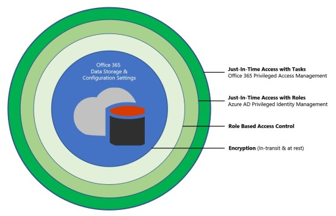
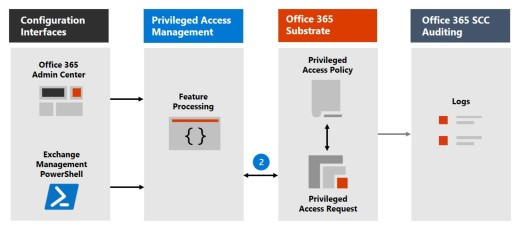

# 權限存取 Office 365 中的管理

> [!IMPORTANT]
> 本主題涵蓋功能僅在 Office 365 E5 和進階規範 Sku 中目前可用的部署和設定指導。

特殊存取權限管理 Office 365 中讓更精細的存取權限的管理工作的控制權。 它可協助保護您的組織中可以使用現有的權限的管理員帳戶具有出位置的存取權機密資料或重要的組態設定的存取權的缺口。啟用權限的存取管理、 之後使用者需要要求剛剛-時間存取完成核准工作流程高度範圍且時間繫結到提高權限與權限工作。這提供使用者剛-充份-存取可執行工作，反之，而不致洩露機密資料或重要的組態設定。啟用 Office 365 中的權限的存取管理可讓您的組織操作以零出位置的權限，並提供一層的防禦措施弱點引起因為這類出位置管理存取。 

## 保護層級

特殊存取權限管理補充 Office 365 的安全性架構內其他資料和存取功能保護設定。啟用整合式安全性方法的一部分的特殊權限的存取管理並保護您的組織，由分層的安全性模型可用來將機密資訊與 Office 365 組態設定的保護最大化。如下圖所示下方啟用權限存取管理可幫助是以原生 Office 365 資料的加密和 Office 365 服務的角色型存取控制安全性模型所提供的保護為基礎。時一起使用[Azure AD 權限的身分識別管理](https://docs.microsoft.com/azure/active-directory/active-directory-privileged-identity-management-configure)，這兩項功能提供在不同的範圍上的剛剛-時間存取權的存取控制。

特殊權限存取 Office 365 中的管理可定義及時 Azure AD 權限的身分識別管理適用於與能夠執行多個工作的保護層級的**角色**在**任務**層級設定範圍。 Azure AD 權限的身分識別管理主要是可讓管理 AD 角色和角色群組的存取，而有權限存取 Office 365 中的管理會套用只會在任務層級。

- **啟用權限存取 Office 365 中的管理已使用 Azure AD 權限的身分識別管理時：** 新增權限的存取管理 Office 365 中提供其他細微一層的權限存取 Office 365 的資料保護和稽核功能。

- **已經使用時啟用 Azure AD 權限的身分識別管理特殊權限存取管理 Office 365 中：** 新增至權限的 Azure AD 權限的身分識別管理存取管理 Office 365 中的可以擴充主要使用者的角色或身分識別所定義的 Office 365 外部資料的權限的存取。  

## 權限的存取管理架構和程序流程

每個以下的程序流程大綱少限制存取及如何與 Office 365 substrate、 Office 365 稽核，及 Exchange 管理 runspace 互動的架構。

### 步驟 1： 設定的權限的存取原則

設定時使用的 Office 365 系統管理中心或 Exchange Management PowerShell 將權限的存取原則，建立並定義原則及權限的存取功能程序中的 Office 365 substrate 和記錄檔的原則屬性Office 365 安全性和規範中心中的活動。原則現在已啟用並準備好要處理傳入要求核准。

### 步驟 2： 存取要求

使用 Office 365 系統管理中心或 Exchange Management PowerShell，使用者可以要求提高權限或權限工作的存取權。權限的存取功能將要求傳送至 Office 365 substrate 處理對已設定最低權限存取原則與 Office 365 安全性記錄 sctivity 及規範中心記錄檔。

### 步驟 3： 存取權核准

產生核准要求並核准群組通知電子郵件的擱置的要求。如果核准被授與、 特殊權限的存取要求處理核准為及工作已完成。如果要求遭到拒絕，工作會封鎖，並且沒有存取權授與 reqeustor。

### 步驟 4： 存取處理

已核准要求 Exchange Management runspace 會處理工作。核准會檢查權限的存取原則與 Office 365 substrate 處理。任務的所有活動會都記錄在 「 Office 365 安全性及規範中心 」。

## 常見問題集

### 我需要哪些 Sku 使用特殊權限的存取 Office 365？
特殊權限存取 Office 365 中的管理只有目前客戶 E5 和進階規範 Sku。

### 何時將權限的存取可供使用 Office 365 工作負載超過 Exchange？
我們想要推出提供這項功能的其他 Office 365 工作負載。當我們已經準備好要共用時間表時，它會提供透過 Office 365 藍圖。

### 是否需要是來管理 Office 365 中的權限的存取的全域系統管理員吗？
您需要有全域管理員能夠管理 Office 365 中的權限的存取的最低權限。包含在核准者群組的使用者不需要是檢閱和核准要求的全域系統管理員。 

### 如何為客戶 Lockbox 相關的 Office 365 中的權限的存取管理？
[客戶 Lockbox](https://support.office.com/article/Office-365-Customer-Lockbox-Requests-36f9cdd1-e64c-421b-a7e4-4a54d16440a2)允許存取控制組織依其服務提供者，例如 Microsoft 資料存取層級。特殊權限存取 Office 365 中的管理允許所有的特殊權限的 Office 365 工作的組織內的更精細的存取控制。