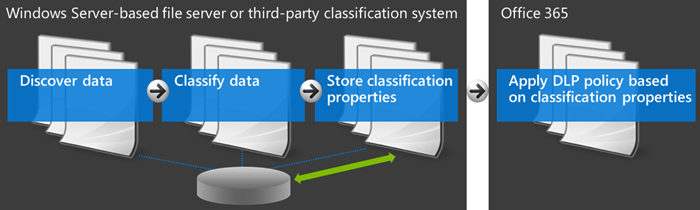

# <a name="create-a-dlp-policy-to-protect-documents-with-fci-or-other-properties"></a>建立 DLP 原則來保護具有 FCI 或其他屬性的文件

在 Office 365 中，您可以使用資料外洩防護 (DLP) 原則來識別、 監視和保護機密資訊。 許多組織都已識別及分類藉由分類屬性在 Windows Server 檔案分類基礎結構 (FCI)、 在 SharePoint 中，此文件內容或文件屬性中的敏感資訊的程序套用的協力廠商系統。 如果這描述您的組織，您可以建立 DLP 原則會辨識已經由 Windows Server FCI 或其他系統，套用至文件的屬性，以便 DLP 原則可以在具有特定的 FCI 或其他的 Office 文件上強制執行的 Office 365屬性的值。
  

  
例如，組織可能使用 Windows Server FCI 使用社會安全號碼，例如個人識別資訊 (PII) 來識別文件，然後藉由設定**個人識別資訊**分類文件類型為基礎的屬性以**高**、**中度**、 **Low**、**公用**或**不 PII**和文件中找到的 PII 的次數。 在 Office 365 中，您可以建立 DLP 原則識別該屬性設為特定值，例如 **[高**] 和 [**中等**的文件，然後採取的動作，例如封鎖存取這些檔案。 相同的原則可以有另一個採取不同的動作，如果屬性設為 [**低**，例如傳送電子郵件通知的規則。 如此一來，在 Office 365 中的 DLP 與 Windows Server FCI 整合，並可協助保護 Office 文件上傳或 Windows Server 為基礎的檔案伺服器從共用 Office 365。
  
DLP 原則只會尋找特定的屬性名稱/值組。 可以用任何文件屬性，只要屬性不會有對應的 managed 的屬性，SharePoint 搜尋。 例如，SharePoint 網站集合可能會使用名**行程報告**為與名為**客戶**的必要欄位的內容類型。 每當人員建立行程報表時，必須先輸入客戶名稱。 此屬性名稱/值組也可用於 DLP 原則 — 例如，如果您想要封鎖存取文件中的外部使用者的 [**客戶**] 欄位包含**Contoso**時的規則。
  
請注意，是否您想要將您的 DLP 原則套用至特定的 Office 365 標籤與內容，您應該不按照這裡的步驟。 相反地，了解如何[使用標籤作為 DLP 原則的條件](data-loss-prevention-policies.md#using-a-label-as-a-condition-in-a-dlp-policy)。
  
## <a name="before-you-create-the-dlp-policy"></a>建立 DLP 原則之前

您可以使用 Windows Server FCI 屬性或其他屬性中的 DLP 原則之前，您需要在 SharePoint 系統管理中心建立 managed 的屬性。 以下是原因。
  
在 SharePoint Online 和商務用 OneDrive，搜尋索引是藉由編目內容的網站 」 上建置。 編目程式挑選內容和中繼資料編目屬性的表單中的文件。 搜尋結構描述可協助編目程式要揀選決定哪些內容和中繼資料。 中繼資料的範例是作者和文件的標題。 不過，若要從文件中取得的內容和中繼資料至搜尋索引，編目的屬性必須對應至 managed 屬性。 只有 managed 的屬性會保留在索引中。 例如，作者相關的編目的屬性會對應至 managed 屬性與作者。
  
這是很重要，因為在 Office 365 中的 DLP 以識別並分類您的網站上的敏感資訊並再將該敏感資訊儲存在安全搜尋索引的一部分使用搜尋編目程式。 當您將文件上傳至 Office 365 時，SharePoint 會自動建立根據文件屬性的編目的屬性。 但是，若要使用 FCI 或其他屬性中的 DLP 原則，編目屬性，必須對應至 managed 屬性，以便使用該屬性的內容會保留在索引中。
  
如需有關搜尋和 managed 的屬性的詳細資訊，請參閱 <<c0>管理 SharePoint Online 的搜尋結構描述。
  
### <a name="step-1-upload-a-document-with-the-needed-property-to-office-365"></a>步驟 1： 將具有所需屬性的文件上傳至 Office 365

您首先要上傳文件與您想要參照在 DLP 原則中的屬性。 Office 365 會偵測屬性，並自動從其建立編目的屬性。 在下一個步驟中，您將建立的 managed 的屬性，並再將 managed 的屬性對應至這個編目屬性。
  
### <a name="step-2-create-a-managed-property"></a>步驟 2： 建立 managed 的屬性

1. 登入 Microsoft 365 系統管理中心。
    
2. 在左側導覽中，選擇 [**系統管理中心** \> **SharePoint**。 You're now in the SharePoint admin center.
    
3. 在左側導覽中，選擇 [**搜尋**\>在 [**搜尋管理**] 頁面上\>**管理搜尋結構描述**。
    
    
  
4. 在 [ **Managed 屬性**] 頁面上\>**新增 Managed 屬性**。
    
    
  
5. 輸入的名稱和描述屬性。 此名稱是什麼都會出現在 DLP 原則。
    
6. **類型**，請選擇 [**文字**]。 
    
7. 在 [**主要特性**] 下選取 [**可查詢**] 和 [**可擷取**]。
    
8. 在 [**對應至編目屬性**] 下\>**新增對應**。
    
9. 在**編目屬性選項**] 對話方塊\>尋找和選取編目的屬性對應至 Windows Server FCI 屬性或其他屬性，您將您的 DLP 原則中使用\> **[確定]**。
    
    
  
10. 在頁面底部\> **[確定]**。
    
## <a name="create-a-dlp-policy-that-uses-an-fci-property-or-other-property"></a>建立使用 FCI 屬性或其他屬性的 DLP 原則

在這個範例中，組織使用 FCI 其 Windows 伺服器型檔案伺服器上;具體而言，他們使用**個人識別資訊**向與名為的**高**、**中度**、 **Low**、**公用**和**不 PII**的可能值的 FCI 分類屬性。 現在，想要利用其現有的 FCI 分類其 Office 365 中的 DLP 原則中。
  
首先，他們可以依照上述步驟，以在 SharePoint Online 中，這會對應至編目屬性會自動建立從 FCI 屬性建立 managed 的屬性。
  
接下來，在建立 DLP 原則搭配兩者使用**文件屬性包含下列任一值**的條件的兩個規則：
  
- **FCI PII 內容-高、 中度**如果 FCI 分類屬性**個人識別資訊**值**高**] 或 [**中等**，且與組織外部人員共用文件的第一個規則限制存取文件。 
    
- **FCI PII 內容-低**第二個規則會傳送通知如果 FCI 分類屬性**個人識別資訊**值**低**及文件的文件擁有者與組織外部人員共用。 
    
### <a name="create-the-dlp-policy-by-using-powershell"></a>使用 PowerShell 建立 DLP 原則

請注意，**文件屬性包含下列任一值**的條件暫時無法提供 UI 的安全性&amp;合規性中心，但您仍然可以使用此條件可使用 PowerShell。 您可以使用`New\Set\Get-DlpCompliancePolicy`指令程式來使用 DLP 原則，並使用`New\Set\Get-DlpComplianceRule`具有 cmdlet`ContentPropertyContainsWords`參數，以新增**文件屬性包含下列任一值**的條件。
  
如需有關這些 cmdlet 的詳細資訊，請參閱[Office 365 安全性&amp;合規性中心 cmdlet](http://go.microsoft.com/fwlink/?LinkID=799772&amp;clcid=0x409)。
  
1. [使用遠端 PowerShell 連線到 Office 365 安全性與合規性中心](http://go.microsoft.com/fwlink/?LinkID=799771&amp;clcid=0x409)
    
2. 藉由建立原則`New-DlpCompliancePolicy`。
    
    以下是建立 DLP 原則套用至所有位置中的 PowerShell 範例。
    
      ```
      New-DlpCompliancePolicy -Name FCI_PII_policy -ExchangeLocation All -SharePointLocation All -OneDriveLocation All -Mode Enable
      ```

3. 建立使用上述這兩個規則`New-DlpComplianceRule`、 其中一個規則是**低**的值，而另一個規則是 [**高**] 和 [**中等**值。 
    
    以下是建立這兩個規則的 PowerShell 範例。 請注意，屬性名稱/值組會以引號括住，而且屬性名稱可以指定多個以逗號隔開沒有空格，例如的值`"<Property1>:<Value1>,<Value2>","<Property2>:<Value3>,<Value4>"....`
    
      ```
      New-DlpComplianceRule -Name FCI_PII_content-High,Moderate -Policy FCI_PII_policy -AccessScope NotInOrganization -BlockAccess $true -ContentPropertyContainsWords "Personally Identifiable Information:High,Moderate" -Disabled $falseNew-DlpComplianceRule -Name FCI_PII_content-Low -Policy FCI_PII_policy -AccessScope NotInOrganization -BlockAccess $false -ContentPropertyContainsWords "Personally Identifiable Information:Low" -Disabled $false -NotifyUser Owner
      ```

    請注意，Windows Server FCI 包含許多內建的屬性，包括在這個範例中所用的**個人識別資訊**。 每個屬性的可能值可以是不同的每個組織。 **高**、**中度**和這裡使用的**低**值是僅為範例。 為您的組織，您可以在 Windows Server 為基礎的檔案伺服器上的檔案伺服器資源管理員檢視其可能的值與 Windows Server FCI 分類屬性。 如需詳細資訊，請參閱 <<c0>建立分類屬性。
    
完成後，您的原則應該有兩個新的規則，同時使用的**文件屬性包含下列任一值**的條件。 請注意，這種情況將不會出現在 UI 中，雖然其他條件、 動作和設定將會出現。 
  
一個規則封鎖存取內容其中**個人識別資訊**屬性值為 [**高**] 或 [**中等**。 第二個規則，會將內容相關的通知傳送其中的**個人識別資訊**屬性等於**低**。
  

  
## <a name="after-you-create-the-dlp-policy"></a>建立 DLP 原則之後

執行以上各節中的步驟，將範本建立 DLP 原則，將會快速偵測內容與該屬性，但僅限內容的新上傳 （這樣的內容編製索引），或如果內容舊，但只要編輯 （這樣的內容重新編製索引）.
  
若要偵測寄件人該屬性的內容，您可能想要手動要求您的文件庫、 網站或網站集合重新編製索引，以便 DLP 原則所知的該屬性具有的所有內容。 在 SharePoint Online 中，會自動編目內容根據已定義的編目排程。 編目程式挑選自前次編目以來已變更及更新的索引的內容。 如果您需要您的 DLP 原則來保護內容下一個排程編目之前，您可以採取下列步驟。
  
> [!CAUTION]
> 重新編製索引的網站可能會造成大量負載搜尋系統上。 不要重新編製索引網站除非您的案例絕對需要它。 
  
如需詳細資訊，請參閱[手動要求編目和重新編製索引的網站、 文件庫或清單](http://go.microsoft.com/fwlink/p/?LinkID=627457)。
  
### <a name="re-index-a-site-optional"></a>重新編製索引的網站 （選用）

1. 在網站上，選擇 [**設定**（在右上方的齒輪圖示） \> **網站設定]**。
    
2. 選擇 [**搜尋**] 下的 [**搜尋與離線可用性** \> **網站重新編製索引**。
    
## <a name="more-information"></a>詳細資訊

- [資料外洩防護原則概觀](data-loss-prevention-policies.md)
    
- [從範本建立 DLP 原則](create-a-dlp-policy-from-a-template.md)
    
- [傳送通知並顯示原則提示的 DLP 原則](use-notifications-and-policy-tips.md)
    
- [DLP 原則範本包含哪些內容](what-the-dlp-policy-templates-include.md)
    
- [敏感資訊類型詳細目錄](what-the-sensitive-information-types-look-for.md)
    

