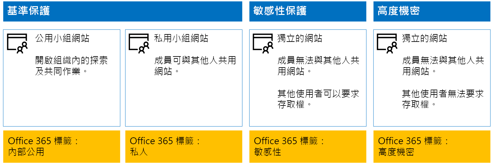
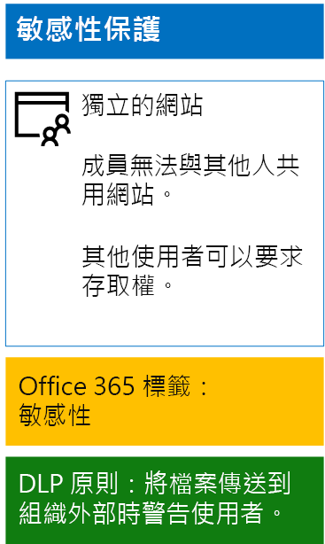
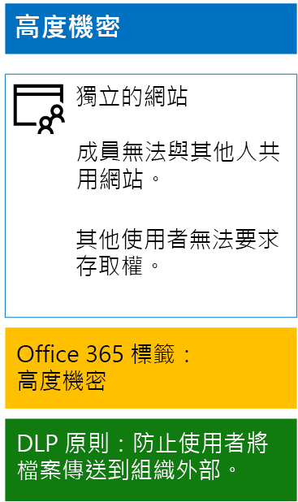

# <a name="protect-sharepoint-online-files-with-office-365-labels-and-dlp"></a>使用 Office 365 標籤與 DLP 來保護 SharePoint Online 檔案

 **摘要：** 使用各種資訊保護層級，對 SharePoint Online 小組網站套用 Office 365 標籤和資料外洩防護 (DLP) 原則。
  
您可以使用本文中的步驟，為基準、機密和高度機密 SharePoint Online 小組網站設計及部署 Office 365 標籤和資料外洩防護 (DLP) 原則。如需這三種保護層級的詳細資訊，請參閱[保護 SharePoint Online 網站與檔案](secure-sharepoint-online-sites-and-files.md)。
  
## <a name="how-this-works"></a>如何進行此作業
1. 建立所需標籤並加以發行。發行這些標籤可能長達 12 小時的時間。
2. 針對所需的 SharePoint 網站，請編輯文件庫設定，將標籤套用至文件庫中的項目。
3. 建立 DLP 原則，以根據標籤採取行動。

當使用者將文件新增至文件庫時，文件依預設會接收指派的標籤。使用者可以視需要變更標籤。當使用者在組織外部共用文件時，DLP 會檢查是否已指派標籤，且如果 DLP 原則符合標籤則採取行動。DLP 也會尋找其他原則相符項目，例如若設定這類原則，則使用信用卡號碼來保護檔案。 

## <a name="office-365-labels-for-your-sharepoint-online-sites"></a>適用於 SharePoint Online 網站的 Office 365 標籤

建立 Office 365 標籤並將其指派給 SharePoint Online 小組網站時的三個階段。
  
### <a name="phase-1-determine-the-office-365-label-names"></a>階段 1：決定 Office 365 標籤名稱

在此階段中，您會為套用至 SharePoint Online 小組網站的四種資訊保護層級，決定其 Office 365 標籤的名稱。 下表列出每種層級的建議名稱。
  
|**SharePoint Online 小組網站保護層級**|**標籤名稱**|
|:-----|:-----|
|基準-公用  <br/> |內部公用  <br/> |
|基準-私人  <br/> |Private  <br/> |
|敏感性  <br/> |敏感性  <br/> |
|高度機密  <br/> |高度機密  <br/> |
   
### <a name="phase-2-create-the-office-365-labels"></a>階段 2：建立 Office 365 標籤

在此階段中，您會為不同資訊保護層級建立所決定的標籤，然後將它發佈。
  
若要建立標籤，您可以使用 Office 365 系統管理中心或 Microsoft PowerShell。
  
### <a name="create-office-365-labels-with-the-office-365-admin-center"></a>使用 Office 365 系統管理中心建立 Office 365 標籤

1. 使用具有安全性系統管理員或公司系統管理員角色的帳戶登入 Office 365 入口網站。 如需說明，請參閱[在何處登入 Office 365](https://support.office.com/Article/Where-to-sign-in-to-Office-365-e9eb7d51-5430-4929-91ab-6157c5a050b4)。
    
2. 從 [Microsoft Office 的首頁]**** 索引標籤中，按一下 [管理]**** 磚。
    
3. 從瀏覽器的新 [Office 系統管理中心]**** 索引標籤中，按一下 [系統管理中心] > [安全性 &amp; 合規性]****。
    
4. 從瀏覽器的新 [首頁 - 安全性 &amp; 合規性]**** 索引標籤中，按一下 [分類] > [標籤]****。
    
5. 從 [首頁] > [標籤]**** 窗格中，按一下 [保留]**** 索引標籤，然後按一下 [建立標籤]****。
    
6. 在 [命名您的標籤]**** 窗格中，鍵入標籤名稱和系統管理員與使用者的描述，然後按一下 [下一步]****。

7. 在 [標籤設定]**** 窗格中，按一下 [下一步]****。
    
8. 在 [檢閱您的設定]**** 窗格中，按一下 [建立]****，然後按一下 [關閉]****。
    
9. 針對其他標籤重複步驟 5 至 8。
    
### <a name="create-office-365-labels-with-powershell"></a>使用 PowerShell 建立 Office 365 標籤

1. [使用遠端 PowerShell 連線到 Office 365 安全 &amp;規範中心，](http://go.microsoft.com/fwlink/?LinkID=799771&amp;clcid=0x409)並指定具有安全性系統管理員或公司系統管理員角色之帳戶的認證。
    
2. 填寫標籤名稱清單，然後在 PowerShell 命令提示字元中執行這些命令：
    
  ```
  $labelNames=@(<list of label names, each enclosed in quotes and separated by commas>)
ForEach ($element in $labelNames){ New-ComplianceTag -Name $element }
  ```

### <a name="publish-your-new-labels"></a>發佈新標籤

接下來，使用下列步驟來發佈新的 Office 365 標籤。
  
1. 從安全性 &amp; 合規性中心的 [首頁] > [標籤]**** 窗格中，按一下 [保留]**** 索引標籤，然後按一下 [發佈標籤]****。
    
2. 在 [選擇要發佈的標籤]**** 窗格中，按一下 [選擇要發佈的標籤]****。
    
3. 在 [Choose labels]\(選擇標籤)**** 窗格中，按一下 [新增]**** 並選取所有四個標籤。
    
4. 按一下 [完成]****。
    
5. 在 [選擇要發佈的標籤]**** 窗格上，按一下 [下一步]****。
    
6. 在 [選擇位置]**** 窗格中，按一下 [下一步]****。
    
7. 在 [命名您的原則]**** 窗格的 [名稱]**** 中，鍵入標籤集的名稱，然後按一下 [下一步]****。
    
8. 在 [檢閱您的設定]**** 窗格中，按一下 [發佈標籤]****，然後按一下 [關閉]****。

    
### <a name="phase-3-apply-the-office-365-labels-to-your-sharepoint-online-sites"></a>階段 3：將 Office 365 標籤套用至 SharePoint Online 網站

使用下列步驟，將 Office 365 標籤套用至 SharePoint Online 小組網站的文件資料夾。
  
1. 從 [Microsoft Office 的首頁]**** 瀏覽器索引標籤，按一下 [SharePoint]**** 磚。
    
2. 在新的 [SharePoint]**** 瀏覽器索引標籤中，按一下需要指派 Office 365 標籤的網站。
    
3. 在瀏覽器的新 [SharePoint 網站] 索引標籤中，按一下 [文件]****。
    
4. 按一下設定圖示，然後按一下 [文件庫設定]****。
    
5. 在 [權限與管理]**** 下，按一下 [Apply label to items in this library]\(將標籤套用至此文件庫中的項目)****。
    
6. 在 [設定] - [套用標籤]**** 中，選取適當的標籤，然後按一下 [儲存]****。
    
7. 關閉 SharePoint Online 網站的索引標籤。
    
8. 重複步驟 3-8，將 Office 365 標籤指派給其他 SharePoint Online 網站。
    
以下是您產生的組態。
  

  
## <a name="dlp-policies-for-your-sharepoint-online-sites"></a>適用於 SharePoint Online 網站的 DLP 原則

使用下列步驟來設定 DLP 原則，以在使用者共用組織外部 SharePoint Online 機密小組網站上的文件時通知使用者。

1. 從 [Microsoft Office 的首頁]**** 索引標籤中，按一下 [管理]**** 磚。
    
2. 從瀏覽器的新 [Office 系統管理中心]**** 索引標籤中，按一下 [系統管理中心] > [安全性 &amp; 合規性]****。
    
3. 在瀏覽器的新 [安全性 &amp; 合規性]**** 索引標籤上，按一下 [資料外洩防護] > [原則]****。
    
4. 在 [資料外洩防護]**** 窗格中，按一下 [+ 建立原則]****。
    
5. 在 [從範本開始或建立自訂原則]**** 窗格中，按一下 [自訂]****，然後按一下 [下一步]****。
    
5. 在 [命名您的原則]**** 窗格的 [名稱]**** 中，鍵入機密層級 DLP 原則的名稱，然後按一下 [下一步]****。
    
6. 在 [選擇位置]**** 窗格中，按一下 [讓我選擇特定位置]****，然後按一下 [下一步]****。
    
7. 在位置清單中，停用 [Exchange 電子郵件]**** 和 [OneDrive 帳戶]**** 位置，然後按一下 [下一步]****。
    
8. 在 [Customize the types of sensitive info you want to protect]\(自訂您要保護的機密資訊類型)**** 窗格中，按一下 [編輯]****。
    
9. 在 [選擇要保護的內容類型]**** 窗格中，從下拉式方塊按一下 [新增]****，然後按一下 [標籤]****。
    
10. 在 [標籤]**** 窗格中，按一下 [+ 新增]**** 並選取 [敏感性]**** 標籤，然後依序按一下 [新增]**** 和 [完成]****。
    
11. 在 [Choose the types of content to protect]\(選擇要保護的內容類型)**** 窗格中，按一下 [儲存]****。
    
12. 在 [Customize the types of sensitive info you want to protect]\(自訂您要保護的機密資訊類型)**** 窗格中，按一下 [下一步]****。

13. 在 [What do you want to do if we detect sensitive info?]\(如果偵測到機密資訊要如何處理?)**** 窗格中，按一下 [Customize the tip and email]\(自訂提示和電子郵件)****。
    
14. 在 [Customize policy tips and email notifications]\(自訂原則提示和電子郵件通知)**** 窗格中，按一下 [Customize the policy tip text]\(自訂原則提示文字)****。
    
15. 在文字方塊中，根據您是否實作 Azure 資訊保護來保護高度機密的檔案，以鍵入或貼上下列其中一個提示：
    
  - 若要與組織外部的使用者共用，請下載檔案，然後將它開啟。 依序按一下 [檔案]、[保護文件] 和 [以密碼加密]，然後指定強式密碼。 以個別電子郵件或其他通訊方式傳送密碼。
  - 高度機密的檔案會受加密保護。只有獲得您 IT 部門授與權限的外部使用者可以讀取它們。
    
    或者，鍵入或貼上您自己的原則提示，以指示使用者如何共用組織外部的檔案。
    
16. 按一下 [確定]****。
    
17. 在 [What do you want to do if we detect sensitive info?]\(如果偵測到機密資訊要如何處理?)**** 窗格中，按一下 [下一步]****。
    
18. 在 [要先開啟原則或測試內容嗎?]**** 窗格中，按一下 [是]**** 立即將它開啟，然後按一下 [下一步]****。
    
19. 在 [檢閱您的設定]**** 窗格中，按一下 [建立]****，然後按一下 [關閉]****。
    
以下是敏感性 SharePoint Online 小組網站的設定結果。
  

  
接下來，使用下列步驟來設定 DLP 原則，以在使用者共用組織外部 SharePoint Online 高度機密小組網站上的文件時封鎖使用者。
  
1. 從瀏覽器的 [Microsoft Office 的首頁]**** 索引標籤中，按一下 [安全性 &amp; 合規性]**** 磚。
    
2. 在瀏覽器的新 [安全性 &amp; 合規性]**** 索引標籤上，按一下 [資料外洩防護] > [原則]****。
    
3. 在 [資料外洩防護]**** 窗格中，按一下 [+ 建立原則]****。
    
4. 在 [從範本開始或建立自訂原則]**** 窗格中，按一下 [自訂]****，然後按一下 [下一步]****。
    
5. 在 [命名您的原則]**** 窗格的 [名稱]**** 中，鍵入高度機密層級 DLP 原則的名稱，然後按一下 [下一步]****。
    
6. 在 [選擇位置]**** 窗格中，按一下 [讓我選擇特定位置]****，然後按一下 [下一步]****。
    
7. 在位置清單中，停用 [Exchange 電子郵件]**** 和 [OneDrive 帳戶]**** 位置，然後按一下 [下一步]****。
    
8. 在 [Customize the types of sensitive info you want to protect]\(自訂您要保護的機密資訊類型)**** 窗格中，按一下 [編輯]****。
    
9. 在 [選擇要保護的內容類型]**** 窗格中，從下拉式方塊按一下 [新增]****，然後按一下 [標籤]****。
    
10. 在 [標籤]**** 窗格中，按一下 [+ 新增]****，並選取 [高度機密]**** 標籤，然後依序按一下 [新增]**** 和 [完成]****。
    
11. 在 [Choose the types of content to protect]\(選擇要保護的內容類型)**** 窗格中，按一下 [儲存]****。
    
12. 在 [Customize the types of sensitive info you want to protect]\(自訂您要保護的機密資訊類型)**** 窗格中，按一下 [下一步]****。
    
13. 在 [What do you want to do if we detect sensitive info?]\(如果偵測到機密資訊要如何處理?)**** 窗格中，按一下 [Customize the tip and email]\(自訂提示和電子郵件)****。
    
14. 在 [Customize policy tips and email notifications]\(自訂原則提示和電子郵件通知)**** 窗格中，按一下 [Customize the policy tip text]\(自訂原則提示文字)****。
    
15. 在文字方塊中，鍵入或貼上下列內容：
    
  - 若要與組織外部的使用者共用，請下載檔案，然後將它開啟。 依序按一下 [檔案]、[保護文件] 和 [以密碼加密]，然後指定強式密碼。 以個別電子郵件或其他通訊方式傳送密碼。
    
    或者，鍵入或貼上您自己的原則提示，以指示使用者如何共用組織外部的檔案。
    
16. 按一下 [確定]****。
    
17. 在 [What do you want to do if we detect sensitive info?]\(如果偵測到機密資訊要如何處理?)**** 窗格中，按一下 [下一步]****。
    
18. 在 [要先開啟原則或測試內容嗎?]**** 窗格中，按一下 [是]**** 立即將它開啟，然後按一下 [下一步]****。
    
19. 在 [檢閱您的設定]**** 窗格中，按一下 [建立]****，然後按一下 [關閉]****。
    
以下是高度機密 SharePoint Online 小組網站的設定結果。
  

  
## <a name="next-step"></a>下一步

[使用 Azure 資訊保護來保護 SharePoint Online 檔案](protect-sharepoint-online-files-with-azure-information-protection.md)
    
## <a name="see-also"></a>另請參閱

[保護 SharePoint Online 網站與檔案](secure-sharepoint-online-sites-and-files.md)
  
[在開發/測試環境中保護 SharePoint Online 網站](secure-sharepoint-online-sites-in-a-dev-test-environment.md)
  
[適用於政治活動、非營利組織和其他彈性組織的 Microsoft 安全性指南](microsoft-security-guidance-for-political-campaigns-nonprofits-and-other-agile-o.md)
  
[雲端採用和混合式解決方案](https://docs.microsoft.com/office365/enterprise/cloud-adoption-and-hybrid-solutions)


