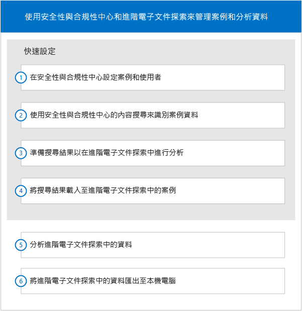

# 快速設定 Office 365 進階電子文件探索

此設定小節將為 Microsoft 365 安全性與合規性中心的電子文件探索管理員說明如何開始使用「進階電子文件探索」。 本文假設使用者具備這兩者的工作知識。
  
> [!NOTE]
> 進階電子文件探索需要具有進階合規性附加元件的 Office 365 E3，或適用於您組織的 E5 訂閱。如果您沒有該方案，且想要嘗試進階電子文件探索，您可以[註冊 Office 365 企業版 E5 試用版](https://go.microsoft.com/fwlink/p/?LinkID=698279)。 
  
## 存取進階電子文件探索中的案例

您可以從安全性與合規性中心存取進階電子文件探索。您必須是安全性與合規性中心的電子文件探索案例的成員，才能存取進階電子文件探索中的案例。如需指派電子文件探索案例權限，並將使用者新增至電子文件探索案例的相關指示，請參閱[管理 Office 365 中的電子文件探索案例](manage-ediscovery-cases.md)。 
  
若要移至進階電子文件探索中的案例： 
  
1. [移至 Office 365 安全性與合規性中心](go-to-the-securitycompliance-center.md)。 
    
2. 在安全性與合規性中心，按一下 [搜尋和調查]**** \> [電子文件探索]****，來顯示貴組織中的案例清單。 
    
3. 在 [電子文件探索]**** 頁面上，按一下進階電子文件探索中您要移至的案例旁邊的 [開啟]****。 
    
4. 在案例的 [首頁]**** 頁面上，按一下 [進階電子文件探索]****。
    
    即會顯示 [連線至進階電子文件探索]****。連線時，會在進階電子文件探索中開啟案例。 
    
## 工作流程

下圖說明常見的工作流程，用於管理和使用安全性與合規性中心以及進階電子文件探索中的電子文件探索案例。 
  

  
此設定一節說明工作流程中的前四個步驟。如需工作流程中其他步驟的說明，請參閱下列資訊。
  
## 分析

[分析案例資料](analyze-case-data-with-advanced-ediscovery.md) 透過各種參數識別並組織檔案、啟用佈景主題的使用，以及顯示結果。使用者可以自訂分析功能，以便實現增加的結果。 
  
## 相關性設定和相關性

[相關性設定](manage-relevance-setup-in-advanced-ediscovery.md)和[使用相關性模組](use-relevance-in-advanced-ediscovery.md) 根據隨機檔案範例啟用評估和相關性訓練，並使用它們將決策套用至預測性編碼程序。監視程序的統計有效性時，計算並顯示過渡結果。顯示結果以便於做出檢閱決策。 
  
## 匯出

[匯出案例資料](export-case-data-in-advanced-ediscovery.md) 可讓您匯出進階電子文件探索內容和結果，進行外部檢閱。 
  
## 報告

[執行報告](run-reports-in-advanced-ediscovery.md) 可讓您產生選取的報告，其與進階電子文件探索處理相關。 
  
## 另請參閱

[Office 365 進階電子文件探索](office-365-advanced-ediscovery.md)
  
[設定使用者和案例](set-up-users-and-cases-in-advanced-ediscovery.md)
  
[準備安裝](prepare-data-for-advanced-ediscovery.md)

