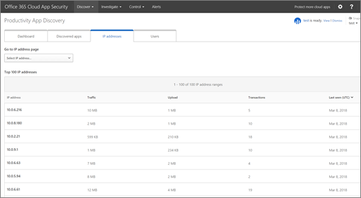

# 檢閱 Office 365 雲端 App 安全性中的 App 探索結果
  
|評估 * *\>**|規劃 * *\>**|部署 * *\>**|使用率 * * *|
|:-----|:-----|:-----|:-----|
|[啟動評估](office-365-cas-overview.md)   |[開始規劃](get-ready-for-office-365-cas.md)   |[開始部署](turn-on-office-365-cas.md)   |您在此處 ！    [後續步驟](#next-steps)   |
   
在雲端探索儀表板的運作方式與您的組織 web 流量記錄檔，以提供雲端應用程式使用狀況的詳細的資訊。 如果您是全域系統管理員、 安全性系統管理員或安全性讀取者，而且您的組織有[建立 Office 365 雲端 App 安全性中的應用程式探索報表](create-app-discovery-reports-in-ocas.md)，您可以使用雲端探索儀表板來掌握如何人員在您Office 365 和其他雲端應用程式所使用的組織。 （雲端探索儀表板也稱為是產能應用程式探索）。
  
 在雲端探索儀表板可讓您檢視您組織中的人員如何使用 Office 365 和其他應用程式的詳細的資訊。 
  

     
## 移至雲端探索儀表板

1. 移至 Cloud App Security 入口網站 ([https://portal.cloudappsecurity.com](https://portal.cloudappsecurity.com))，並登入。
    
2. 前往**探索** \> **雲端探索儀表板**。
    
## 請參閱您的主要使用者、 IP 位址、 應用程式] 和風險層級

在雲端探索儀表板提供與 Office 365 用於您的組織、 任何開啟的提醒、 最上層的使用者和風險層級中的應用程式在快速概觀。
  

  
1. 在 [**儀表板**] 索引標籤上查看貴組織的 [概觀] 區段中的整體雲端應用程式使用間的螢幕頂端。 
    
2. 請參閱**Office 365 類別**的組織內所使用的應用程式。 
    
3. 查看**Discovered 應用程式**] 小工具以查看 Office 365 和其他應用程式，在此檢視中的使用狀況。 
    
4. 看看**主要使用者**和**頂端 IP 位址**] 小工具以識別的使用者使用 Office 365 部署及雲端組織中最多的應用程式。 
    
5. 請參閱依地理位置的人員會使用這些應用程式可使用的**應用程式總部位置**對應其中。 
    
6. 上方地圖] 區域中，看看的**風險層級**概觀中所找到的應用程式的風險分數。 您可以查看由同一個群組及類別**Discovered 應用程式**區域中所用的風險。 例如，您可以看到每個群組多少流量是來自高、 中或低風險應用程式。 
    
## 深入分析資訊

您可以使用雲端探索才會探討應用程式、 子網域、 IP 位址和使用者。
  
1. 在雲端探索儀表板中，選擇 [ **Discovered 應用程式**] 索引標籤。 
    
2. 使用 [篩選] 區段中檢視應用程式的名稱、 類別、 使用量層級或上次看到的日期。
    
3. 在結果清單中，將游標依應用程式名稱，以顯示 [**檢視子網域**] 連結。   會顯示所選應用程式的詳細的資訊。
    
4. 若要檢視關於 IP 位址的詳細資訊，請選擇 [ **IP 位址**] 索引標籤。  在結果清單中，選取 [個別 IP 位址來檢視更詳細的資訊。
    
5. 若要檢視關於組織內的 Office 365 使用者的詳細資訊，請選擇 [**使用者**] 索引標籤。 
  
## 排除實體

您可以排除特定系統的使用者或 IP 位址，以專注於更特定的資訊。
  
1. 選擇 [**設定** \> **雲端探索設定**。
    
2. 選擇 [**排除項目**。
    
3. 選擇 [**排除的使用者**或**排除的 IP 位址**。
    
4. 指定使用者或 IP 位址，並在 [**註解**] 方塊中，輸入為什麼您會排除那些使用者或 IP 位址的相關資訊。 
    
5. 選擇 [新增]****。
    
## 後續步驟

- [檢閱並採取相應動作提醒](review-office-365-cas-alerts.md)
    
- [建立 app 探索報表](create-app-discovery-reports-in-ocas.md)
    
- 檢閱您[的 Office 365 雲端 App 安全性的使用率活動](utilization-activities-for-ocas.md)
    

