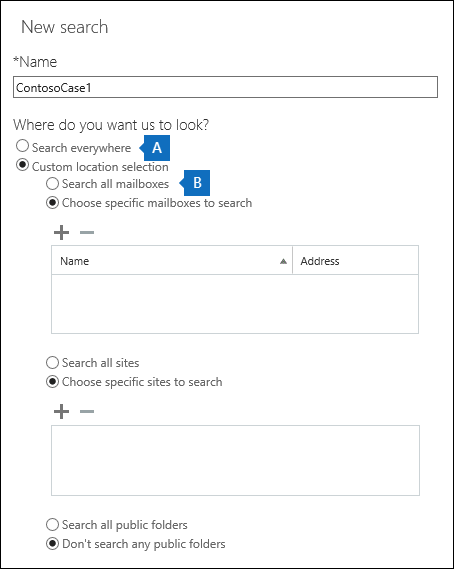

# <a name="run-a-content-search-in-the-office-365-security-amp-compliance-center"></a><span data-ttu-id="1cd2e-103">Office 365 安全性執行內容的搜尋&amp;規範中心</span><span class="sxs-lookup"><span data-stu-id="1cd2e-103">Run a Content Search in the Office 365 Security &amp; Compliance Center</span></span>

<span data-ttu-id="1cd2e-p101">您可以使用 「 內容搜尋 eDiscovery 工具在 Office 365 安全性&amp;搜尋的項目如電子郵件、 文件和立即訊息交談 Office 365 組織中的規範中心。使用此工具來搜尋這些 Office 365 服務中的項目：</span><span class="sxs-lookup"><span data-stu-id="1cd2e-p101">You can use the Content Search eDiscovery tool in the Office 365 Security &amp; Compliance Center to search for items such as email, documents, and instant messaging conversations in your Office 365 organization. Use this tool to search for items in these Office 365 services:</span></span>
  
- <span data-ttu-id="1cd2e-106">Exchange Online 信箱及公用資料夾</span><span class="sxs-lookup"><span data-stu-id="1cd2e-106">Exchange Online mailboxes and public folders</span></span>
    
- <span data-ttu-id="1cd2e-107">SharePoint Online 和 OneDrive for Business 的網站</span><span class="sxs-lookup"><span data-stu-id="1cd2e-107">SharePoint Online and OneDrive for Business sites</span></span>
    
- <span data-ttu-id="1cd2e-108">Skype 商務交談</span><span class="sxs-lookup"><span data-stu-id="1cd2e-108">Skype for Business conversations</span></span>
    
- <span data-ttu-id="1cd2e-109">Microsoft Teams</span><span class="sxs-lookup"><span data-stu-id="1cd2e-109">Microsoft Teams</span></span> 
    
- <span data-ttu-id="1cd2e-110">Office 365 群組</span><span class="sxs-lookup"><span data-stu-id="1cd2e-110">Office 365 Groups</span></span>
    
<span data-ttu-id="1cd2e-p102">內容搜尋是新的 eDiscovery 搜尋工具新增及改良的延展性與效能功能。使用內容搜尋執行非常大的 eDiscovery 搜尋。您可以搜尋所有信箱、 所有的 Exchange 公用資料夾中，所有 SharePoint Online 網站和 OneDrive 單一內容都搜尋中的商務帳戶。有無限制的可搜尋的內容位置數目而定。也有可以同時執行的搜尋數目沒有限制。之後執行內容搜尋] 的內容位置數目，並在**內容搜尋**] 頁面上的 [詳細資料] 窗格中顯示預估的搜尋結果數目。執行搜尋後您可以預覽結果、 取得關鍵字統計資料的一個或多個搜尋大量編輯內容的搜尋，並將結果匯出至本機電腦。</span><span class="sxs-lookup"><span data-stu-id="1cd2e-p102">Content Search is a new eDiscovery search tool with new and improved scaling and performance capabilities. Use Content Search to run very large eDiscovery searches. You can search all mailboxes, all Exchange public folders, and all SharePoint Online sites and OneDrive for Business accounts in a single Content Search. There are no limits on the number of content locations that you can search. There are also no limits on the number of searches that can run at the same time. After you run a Content Search, the number of content locations and an estimated number of search results are displayed in the details pane on the **Content search** page. After you run a search you can preview the results, get keyword statistics for one or more searches, bulk-edit content searches, and export the results to a local computer.</span></span> 
  
 <span data-ttu-id="1cd2e-118">**Contents**</span><span class="sxs-lookup"><span data-stu-id="1cd2e-118">**Contents**</span></span>
  
[<span data-ttu-id="1cd2e-119">建立搜尋</span><span class="sxs-lookup"><span data-stu-id="1cd2e-119">Create a search</span></span>](run-a-content-search-in-the-security-and-compliance-center.md#create)
  
[<span data-ttu-id="1cd2e-120">匯出搜尋結果</span><span class="sxs-lookup"><span data-stu-id="1cd2e-120">Export search results</span></span>](run-a-content-search-in-the-security-and-compliance-center.md#export)
  
[<span data-ttu-id="1cd2e-121">預覽搜尋結果</span><span class="sxs-lookup"><span data-stu-id="1cd2e-121">Preview search results</span></span>](run-a-content-search-in-the-security-and-compliance-center.md#preview)
  
[<span data-ttu-id="1cd2e-122">更新搜尋結果</span><span class="sxs-lookup"><span data-stu-id="1cd2e-122">Update search results</span></span>](run-a-content-search-in-the-security-and-compliance-center.md#restart)
  
[<span data-ttu-id="1cd2e-123">編輯搜尋</span><span class="sxs-lookup"><span data-stu-id="1cd2e-123">Edit a search</span></span>](run-a-content-search-in-the-security-and-compliance-center.md#edit)
  
[<span data-ttu-id="1cd2e-124">重試搜尋</span><span class="sxs-lookup"><span data-stu-id="1cd2e-124">Retry a search</span></span>](run-a-content-search-in-the-security-and-compliance-center.md#retry)
  

  
## <a name="before-you-begin"></a><span data-ttu-id="1cd2e-125">開始之前</span><span class="sxs-lookup"><span data-stu-id="1cd2e-125">Before you begin</span></span>

- <span data-ttu-id="1cd2e-p103">資訊和指導建立搜尋查詢並使用布林搜尋運算子，請參閱[關鍵字查詢和搜尋條件的內容搜尋](keyword-queries-and-search-conditions.md)。本文也包含敏感資訊類型的搜尋及搜尋與您組織內部和外部人員共用內容的相關資訊。</span><span class="sxs-lookup"><span data-stu-id="1cd2e-p103">For information and guidance about building search queries and using Boolean search operators, see [Keyword queries and search conditions for Content Search](keyword-queries-and-search-conditions.md). This article also contains information about searching for sensitive information types and searching for content that's shared with people inside and outside of your organization.</span></span>
    
- <span data-ttu-id="1cd2e-p104">若要有權限來執行搜尋和預覽和匯出搜尋結果的**內容搜尋**] 頁面上，系統管理員、 法務或 eDiscovery 管理員必須是安全性 eDiscovery 管理員角色群組的成員&amp;規範置中。您不需要額外的搜尋權限指派在 Exchange Online、 SharePoint Online、 或 for OneDrive Business 網站。如需詳細資訊，請參閱[指派 Office 365 安全性 eDiscovery 權限&amp;規範中心](assign-ediscovery-permissions.md)。</span><span class="sxs-lookup"><span data-stu-id="1cd2e-p104">To have access to the **Content search** page to perform searches and preview and export search results, an administrator, compliance officer, or eDiscovery manager must be a member of the eDiscovery Manager role group in the Security &amp; Compliance Center. You don't have to assign additional search permissions in Exchange Online, SharePoint Online, or for OneDrive for Business sites. For more information, see [Assign eDiscovery permissions in the Office‍ 365 Security &amp; Compliance Center](assign-ediscovery-permissions.md).</span></span>
    
- <span data-ttu-id="1cd2e-p105">有限制套用至內容搜尋維護的健康狀況和至 Office 365 組織提供服務的品質。在大多數情況下，您無法修改這些限制，但您應該要知道有這些，讓您可以考量這些限制時規劃、 執行及疑難排解搜尋。如需詳細資訊，請參閱[Limits for Search in Office 365 安全性&amp;規範中心](limits-for-content-search.md)。</span><span class="sxs-lookup"><span data-stu-id="1cd2e-p105">There are limits applied to Content Search to maintain the health and quality of services provided to Office 365 organizations. In most cases, you can't modify these limits, but you should be aware of them so that you can take these limits into consideration when planning, running, and troubleshooting searches. For more information, see [Limits for Search in the Office 365 Security &amp; Compliance Center](limits-for-content-search.md).</span></span>
    
- <span data-ttu-id="1cd2e-134">請參閱] 區段中的單一內容搜尋中搜尋的信箱數目為基礎的預估的搜尋時間。</span><span class="sxs-lookup"><span data-stu-id="1cd2e-134">See the  section for estimated search times based on the number of mailboxes that are searched in a single Content Search.</span></span> 
    
- <span data-ttu-id="1cd2e-p106">先前所述，您可以使用內容搜尋來搜尋 Office 365 群組與的 Microsoft 小組的內容。這表示您可以搜尋群組信箱、 共用的行事曆及與 Office 365 群組及 Microsoft 小組相關聯的 SharePoint 網站。此外，您可以搜尋通道交談中的 Microsoft 小組。如需 Office 365 群組及 Microsoft 小組資訊，請參閱：</span><span class="sxs-lookup"><span data-stu-id="1cd2e-p106">As previously stated, you can use Content Search to search for content in Office 365 Groups and Microsoft Teams. This means you can search the group mailbox, shared calendar, and SharePoint sites associated with an Office 365 Group and a Microsoft Team. Additionally, you can search the channel conversations in a Microsoft Team. For information about Office 365 Groups and Microsoft Teams, see:</span></span>
    
  - [<span data-ttu-id="1cd2e-139">了解 Office 365 群組</span><span class="sxs-lookup"><span data-stu-id="1cd2e-139">Learn about Office 365 groups</span></span>](https://support.office.com/article/b565caa1-5c40-40ef-9915-60fdb2d97fa2)
    
  - [<span data-ttu-id="1cd2e-140">Microsoft 小組說明</span><span class="sxs-lookup"><span data-stu-id="1cd2e-140">Microsoft Teams help</span></span>](https://support.office.com/article/23156c0c-2c6e-49dd-8b7b-7c564b76508c)
    
    <span data-ttu-id="1cd2e-141">請參閱 Office 365 群組與的 Microsoft 小組的內容搜尋的提示 ＞ 小節。</span><span class="sxs-lookup"><span data-stu-id="1cd2e-141">See the  section for tips on searching for content in Office 365 Groups and Microsoft Teams.</span></span> 
    
[<span data-ttu-id="1cd2e-142">回到頁首</span><span class="sxs-lookup"><span data-stu-id="1cd2e-142">Return to top</span></span>](run-a-content-search-in-the-security-and-compliance-center.md#top)
  
## <a name="create-a-search"></a><span data-ttu-id="1cd2e-143">建立搜尋</span><span class="sxs-lookup"><span data-stu-id="1cd2e-143">Create a search</span></span>
<span data-ttu-id="1cd2e-144"><a name="create"> </a></span><span class="sxs-lookup"><span data-stu-id="1cd2e-144"></span></span>

1. <span data-ttu-id="1cd2e-145">移至 [https://protection.office.com](https://protection.office.com)。</span><span class="sxs-lookup"><span data-stu-id="1cd2e-145">Go to [https://protection.office.com](https://protection.office.com).</span></span>
    
2. <span data-ttu-id="1cd2e-146">使用公司或學校帳戶登入 Office 365。</span><span class="sxs-lookup"><span data-stu-id="1cd2e-146">Sign in to Office 365 using your work or school account.</span></span>
    
3. <span data-ttu-id="1cd2e-147">在安全性與合規性中心的左窗格中，按一下 [搜尋與調查]\*\*\*\* \> [內容搜尋]\*\*\*\*。</span><span class="sxs-lookup"><span data-stu-id="1cd2e-147">In the left pane of the Security &amp; Compliance Center, click **Search &amp; investigation** \> **Content search**.</span></span>
    
4. <span data-ttu-id="1cd2e-148">按一下 [**新增**。</span><span class="sxs-lookup"><span data-stu-id="1cd2e-148">Click **New**.</span></span>
    
5. <span data-ttu-id="1cd2e-p107">在 [**新的搜尋**] 頁面上輸入內容搜尋的名稱。此名稱必須是唯一的組織中。</span><span class="sxs-lookup"><span data-stu-id="1cd2e-p107">On the **New search** page, type a name for the Content Search. This name has to be unique in your organization.</span></span> 
    
6. <span data-ttu-id="1cd2e-p108">選擇您要搜尋的內容位置。您可以在相同的搜尋中搜尋信箱、 網站及公用資料夾。</span><span class="sxs-lookup"><span data-stu-id="1cd2e-p108">Choose the content locations that you want to search. You can search mailboxes, sites, and public folders in the same search.</span></span>
    
    
  
1. <span data-ttu-id="1cd2e-p109">**寄件人搜尋**選取此選項可在組織中搜尋所有內容的位置。當您選取這個選項時，您可以選擇搜尋所有信箱 （包括非使用中信箱與信箱的所有 Office 365 群組與的 Microsoft 小組），所有 SharePoint 和 OneDrive for Business 的網站 (包括 Office 365 的所有群組的網站和Microsoft 小組） 及所有公用資料夾。</span><span class="sxs-lookup"><span data-stu-id="1cd2e-p109">**Search everywhere**Select this option to search all content locations in your organization. When you select this option, you can choose to search all mailboxes (including inactive mailboxes and the mailboxes for all Office 365 Groups and Microsoft Teams), all SharePoint and OneDrive for Business sites (which includes the sites for all Office 365 groups and Microsoft Teams), and all public folders.</span></span>
    
    
  
2. <span data-ttu-id="1cd2e-p110">**自訂位置選取項目**選取此選項可選取的信箱與您想要搜尋的網站。如果您選擇這個選項，您有彈性來搜尋特定的服務 （例如搜尋所有的 Exchange 信箱） 的所有內容的位置或可搜尋 Office 365 服務的特定內容的位置。</span><span class="sxs-lookup"><span data-stu-id="1cd2e-p110">**Custom location selection**Select this option to select the mailboxes and sites that you want to search. If you choose this option, you have flexibility to search all content locations for a specific service (such as searching all Exchange mailboxes) or you can search specific content locations for an Office 365 service.</span></span>
    
    <span data-ttu-id="1cd2e-159">新增要搜尋的內容位置時，請記住下列：</span><span class="sxs-lookup"><span data-stu-id="1cd2e-159">Keep the following in mind when adding content locations to search:</span></span>
    
    <span data-ttu-id="1cd2e-160">**信箱**</span><span class="sxs-lookup"><span data-stu-id="1cd2e-160">**Mailboxes**</span></span>
    
  - <span data-ttu-id="1cd2e-p111">當您按一下 [**新增**來指定要搜尋的信箱，會顯示信箱選擇是空的。這是由設計，以提升效能。若要新增至這份清單的收件者，在搜尋方塊中輸入的名稱 （至少要有 3 個字元） 並按一下 [**搜尋**]。</span><span class="sxs-lookup"><span data-stu-id="1cd2e-p111">When you click **Add** to specify mailboxes to search, the mailbox picker that's displayed is empty. This is by design to enhance performance. To add recipients to this list, type a name (a minimum of 3 characters) in the search box and click **Search**.</span></span>
    
  - <span data-ttu-id="1cd2e-p112">您可以將非使用中信箱和通訊群組新增至搜尋信箱清單。通訊群組、 要搜尋的群組成員的信箱。請注意動態通訊群組不受支援。</span><span class="sxs-lookup"><span data-stu-id="1cd2e-p112">You can add inactive mailboxes and distribution groups to the list of mailboxes to search. For distribution groups, the mailboxes of group members are searched. Note that dynamic distribution groups aren't supported.</span></span>
    
  - <span data-ttu-id="1cd2e-p113">若要取得組織中不在作用中信箱的清單，請執行命令`Get-Mailbox -InactiveMailboxOnly`在 Exchange Online PowerShell。或者，您可以移至**資料控管** \> **保留**安全性&amp;規範中心] 和 [**更多** \> **不在作用中的信箱**。</span><span class="sxs-lookup"><span data-stu-id="1cd2e-p113">To get a list of the inactive mailboxes in your organization, run the command  `Get-Mailbox -InactiveMailboxOnly` in Exchange Online PowerShell. Alternatively, you can go to **Data governance** \> **Retention** in the Security &amp; Compliance Center, and then click **More** \> **Inactive mailboxes**.</span></span>
    
  - <span data-ttu-id="1cd2e-p114">您也可以新增與 Office 365 群組或 Microsoft 小組關聯的信箱。在此例中，只有群組或小組信箱搜尋 ；群組或小組成員的信箱不搜尋。若要進行搜尋，您必須特別將它們新增至搜尋。</span><span class="sxs-lookup"><span data-stu-id="1cd2e-p114">You can also add the mailbox that's associated with an Office 365 Group or a Microsoft Team. In this case, only the group or team mailbox is searched; the mailboxes of the group or team members aren't searched. To search them, you have to specifically add them to the search.</span></span>
    
  - <span data-ttu-id="1cd2e-172">如果您不想要包含於搜尋所有信箱，選取 [**選擇特定信箱搜尋**，但不要將信箱新增至清單。</span><span class="sxs-lookup"><span data-stu-id="1cd2e-172">If you don't want to include any mailboxes to the search, select **Choose specific mailboxes to search**, but don't add a mailbox to the list.</span></span>
    
    <span data-ttu-id="1cd2e-173">**網站**</span><span class="sxs-lookup"><span data-stu-id="1cd2e-173">**Sites**</span></span>
    
  - <span data-ttu-id="1cd2e-p115">按一下 [**新增**網站新增至搜尋]。輸入您要搜尋的每個網站的 URL。內容搜尋工具會驗證 URL，並再將它新增至網站來搜尋的清單。</span><span class="sxs-lookup"><span data-stu-id="1cd2e-p115">Click **Add** to add sites to the search. Type the URL for each site that you want to search. The Content Search tool will validate the URL, and then add it to the list of sites to search.</span></span> 
    
  - <span data-ttu-id="1cd2e-p116">您可以新增 SharePoint 與 Office 365 群組或 Microsoft 小組相關聯。請參閱] 區段中的指導如何尋找群組或小組的 URL。</span><span class="sxs-lookup"><span data-stu-id="1cd2e-p116">You can add the SharePoint that's associated with an Office 365 Group or a Microsoft Team. See the  section for guidance about how to find the URL for group or team.</span></span> 
    
  - <span data-ttu-id="1cd2e-179">如果您不想要包含在搜尋中的任何網站中，選取 [**選擇要搜尋的特定網站**、 但不將網站新增至清單。</span><span class="sxs-lookup"><span data-stu-id="1cd2e-179">If you don't want to include any sites in a search, select **Choose specific sites to search**, but don't add a site to the list.</span></span>
    
    <span data-ttu-id="1cd2e-180">**公用資料夾**</span><span class="sxs-lookup"><span data-stu-id="1cd2e-180">**Public folders**</span></span>
    
    <span data-ttu-id="1cd2e-181">公用資料夾，您可以選擇在 Exchange Online 組織中搜尋所有的公用資料夾或搜尋任何公用資料夾。</span><span class="sxs-lookup"><span data-stu-id="1cd2e-181">For public folders, you can choose to search all public folders in your Exchange Online organization or not search any public folders.</span></span>
    
7. <span data-ttu-id="1cd2e-182">按 [下一步]\*\*\*\*。</span><span class="sxs-lookup"><span data-stu-id="1cd2e-182">Click **Next**.</span></span>
    
8. <span data-ttu-id="1cd2e-183">您可以在 [**新的搜尋**] 頁面上新增關鍵字和條件來建立搜尋查詢。</span><span class="sxs-lookup"><span data-stu-id="1cd2e-183">On the **New search** page, you can add keywords and conditions to create the search query.</span></span> 
    
    
  
1. <span data-ttu-id="1cd2e-p117">在下] 方塊中**您想什麼我們要尋找的？**、] 方塊中輸入搜尋查詢。您可以指定關鍵字，訊息屬性例如傳送及接收日期或文件內容，例如檔案名稱或上次變更文件的日期。您可以使用較複雜的查詢使用布林運算子，例如**AND**、**或**、**不**、 **NEAR**或**ONEAR**。您也可以搜尋文件或搜尋功能已從外部共用的文件中的機密資訊 （例如社會安全編號）。如果 [關鍵字] 方塊中保留空白，將會在搜尋結果中包含位於指定之內容的位置中的所有內容。</span><span class="sxs-lookup"><span data-stu-id="1cd2e-p117">In the box under **What do you want us to look for?**, type a search query in the box. You can specify keywords, message properties such as sent and received dates, or document properties such as file names or the date that a document was last changed. You can use a more complex queries that use a Boolean operator, such as **AND**, **OR**, **NOT**, **NEAR**, or **ONEAR**. You can also search for sensitive information (such as social security numbers) in documents, or search for documents that have been shared externally. If you leave the keyword box empty, all content located in the specified content locations will be included in the search results.</span></span> 
    
2. <span data-ttu-id="1cd2e-p118">您可以按一下 [**顯示關鍵字清單**] 核取方塊和類型中的每一列的關鍵字。如果您這樣做，在每一列的關鍵字連接**OR**運算子會建立搜尋查詢中所連接。</span><span class="sxs-lookup"><span data-stu-id="1cd2e-p118">You can click the **Show keyword list** checkbox and the type a keyword in each row. If you do this, the keywords on each row are connected by the **OR** operator in the search query that's created.</span></span> 
    
    ![您可以在 [關鍵字] 清單中的列中輸入關鍵字或關鍵字階段](media/aea1a361-639d-4a82-8c3c-48645ef3fc05.png)
  
    <span data-ttu-id="1cd2e-p119">為什麼要選擇使用 [關鍵字] 清單？您可以取得顯示多少個項目比對每個關鍵字的統計資料。這可協助您快速識別出哪些關鍵字是最 （且至少） 有效。您也可以使用 （以括弧括住） 的關鍵字文句] 列中。如需搜尋統計資料的詳細資訊，請參閱 ＜[檢視內容的搜尋結果的關鍵字統計資料](view-keyword-statistics-for-content-search.md)。</span><span class="sxs-lookup"><span data-stu-id="1cd2e-p119">Why use the keyword list? You can get statistics that show how many items match each keyword. This can help you quickly identify which keywords are the most (and least) effective. You can also use a keyword phrase (surrounded by parentheses) in a row. For more information about search statistics, see [View keyword statistics for Content Search results](view-keyword-statistics-for-content-search.md).</span></span>
    
    <span data-ttu-id="1cd2e-198">請參閱的指引上使用 [關鍵字] 清單。</span><span class="sxs-lookup"><span data-stu-id="1cd2e-198">See the  section for guidance on using the keyword list.</span></span> 
    
3. <span data-ttu-id="1cd2e-p120">按一下 [**檢查查詢錯字**檢查查詢不受支援的字元與可能未接的布林運算子。不支援的字元通常隱藏與通常搜尋的錯誤或傳回非預期的結果。如需會檢查有不支援字元的詳細資訊，請參閱[檢查錯誤的內容搜尋查詢](check-your-content-search-query-for-errors.md)。</span><span class="sxs-lookup"><span data-stu-id="1cd2e-p120">Click **Check query for typos** to check your query for unsupported characters and for Boolean operators that might not be capitalized. Unsupported characters are often hidden and typically cause a search error or return unintended results. For more information about the unsupported characters that are checked, see [Check your Content Search query for errors](check-your-content-search-query-for-errors.md).</span></span>
    
4. <span data-ttu-id="1cd2e-p121">在 [**條件**新增條件來縮小搜尋及傳回一組更精簡的結果在搜尋查詢。每個條件將子句新增至 KQL 搜尋查詢，建立及執行當您啟動搜尋。條件是以邏輯方式連線到 （在 [關鍵字] 方塊中指定） 的關鍵字查詢**和**運算子。這表示項目必須滿足的關鍵字查詢與結果中包含的條件。這是條件，縮減結果協助的方式。</span><span class="sxs-lookup"><span data-stu-id="1cd2e-p121">Under **Conditions**, add conditions to a search query to narrow a search and return a more refined set of results. Each condition adds a clause to the KQL search query that is created and run when you start the search. A condition is logically connected to the keyword query (specified in the keyword box) by the **AND** operator. That means that items have to satisfy both the keyword query and the condition to be included in the results. This is how conditions help to narrow your results.</span></span> 
    
||
|:-----|
|<span data-ttu-id="1cd2e-207">如需建立搜尋查詢和使用情況的詳細資訊，請參閱[關鍵字查詢和搜尋條件的內容搜尋](keyword-queries-and-search-conditions.md)。</span><span class="sxs-lookup"><span data-stu-id="1cd2e-207">For more information about creating a search query and using conditions, see [Keyword queries and search conditions for Content Search ](keyword-queries-and-search-conditions.md).</span></span> |
   
9. <span data-ttu-id="1cd2e-208">按一下 [**搜尋**] 以儲存搜尋設定並啟動搜尋。</span><span class="sxs-lookup"><span data-stu-id="1cd2e-208">Click **Search** to save the search settings and start the search.</span></span> 
    
    <span data-ttu-id="1cd2e-p122">啟動搜尋。搜尋完成時，下列資訊會顯示在 [詳細資料] 窗格中。</span><span class="sxs-lookup"><span data-stu-id="1cd2e-p122">The search is started. When the search is completed, the following information is displayed in the details pane.</span></span>
    
    
  
1. <span data-ttu-id="1cd2e-212">日期與時間的上次執行搜尋。</span><span class="sxs-lookup"><span data-stu-id="1cd2e-212">The date and time that the search was last run.</span></span>
    
2. <span data-ttu-id="1cd2e-p123">數字 （和總大小） 的項目所找到的比對搜尋查詢。項目類型的範例包括電子郵件、 行事曆項目和文件。如果項目包含多個執行個體的搜尋關鍵字，它會只計算一次中的項目總數。例如，如果您搜尋的單字"stock"或"訣竅 」 及電子郵件訊息包含三個執行個體的"stock"這個字，其是只計算一次**項目**] 欄位中。</span><span class="sxs-lookup"><span data-stu-id="1cd2e-p123">The number (and total size) of items that were found that matched the search query. Examples of item types include email messages, calendar items, and documents. If an item contains multiple instances of a keyword that is being searched for, it's only counted once in the total number of items. For example, if you're searching for words "stock" or "tip" and an email message contains three instances of the word "stock", it's only counted once in the **Items** field.</span></span> 
    
3. <span data-ttu-id="1cd2e-p124">數量及編製索引中的項目所搜尋的內容位置的總大小。編製索引不符合搜尋準則的項目數將包含在詳細資料窗格中顯示的搜尋統計資料。如果搜尋查詢 （因為其他訊息或文件屬性符合搜尋準則） 編製索引的項目相符，則不會包含在估計編製索引的項目數。不過，如果編製索引的項目會排除的搜尋準則，它將不會包含在評估編製索引的項目。</span><span class="sxs-lookup"><span data-stu-id="1cd2e-p124">The number and total size of unindexed items in the content locations that were searched. The number of unindexed items that don't meet the search criteria will be included in the search statistics displayed in the details pane. If an unindexed item matches the search query (because other message or document properties meet the search criteria), it won't be included in the estimated number of unindexed items. However, if an unindexed item is excluded by the search criteria, it won't be included in the estimate of unindexed items.</span></span>
    
4. <span data-ttu-id="1cd2e-p125">每種類型所搜尋的內容位置的編號。信箱，請注意所搜尋的信箱總數中所列的封存信箱。在上述範例中，所搜尋的四個使用者信箱並啟用每一個使用者的封存信箱。這就是為什麼八個信箱所引用中搜尋統計資料。</span><span class="sxs-lookup"><span data-stu-id="1cd2e-p125">The number of each type of content location that was searched. For mailboxes, note that archive mailboxes are included in the total number of mailboxes that were searched. In the previous example, four user mailboxes were searched and the archive mailbox for each of these users is enabled. That's why eight mailboxes are cited in the search statistics.</span></span>
    
5. <span data-ttu-id="1cd2e-225">連結至預覽搜尋結果或執行一次要更新的搜尋統計資料的搜尋。</span><span class="sxs-lookup"><span data-stu-id="1cd2e-225">Links to preview the search results or run the search again to update the search statistics.</span></span>
    
    <span data-ttu-id="1cd2e-226">若有必要，請按一下 [**重新整理**![重新整理] 圖示](media/O365-MDM-Policy-RefreshIcon.gif)更新所選搜尋的詳細資料窗格中的資訊。</span><span class="sxs-lookup"><span data-stu-id="1cd2e-226">If necessary, click **Refresh** to update the information in the details pane for the selected search.</span></span> 
    
[<span data-ttu-id="1cd2e-227">回到頁首</span><span class="sxs-lookup"><span data-stu-id="1cd2e-227">Return to top</span></span>](run-a-content-search-in-the-security-and-compliance-center.md#top)
  
## <a name="export-search-results"></a><span data-ttu-id="1cd2e-228">匯出搜尋結果</span><span class="sxs-lookup"><span data-stu-id="1cd2e-228">Export search results</span></span>
<span data-ttu-id="1cd2e-229"><a name="export"> </a></span><span class="sxs-lookup"><span data-stu-id="1cd2e-229"></span></span>

<span data-ttu-id="1cd2e-p126">成功執行搜尋之後，您可以將搜尋結果匯出到本機電腦。當您將電子郵件結果匯出時，他們正在為 PST 檔案下載到電腦。當您匯出 SharePoint 與內容 OneDrive for Business 的網站時，都要匯出的原生 Office 文件複本。也有其他文件和隨附匯出的搜尋結果的報告。如需詳細資訊，請參閱[匯出搜尋結果的 Office 365 安全性&amp;規範中心](export-search-results.md)。</span><span class="sxs-lookup"><span data-stu-id="1cd2e-p126">After a search is successfully run, you can export the search results to a local computer. When you export email results, they're downloaded to your computer as PST files. When you export content from SharePoint and OneDrive for Business sites, copies of native Office documents are exported. There are also additional documents and reports that are included with the exported search results. For more information, see [Export search results from the Office 365 Security &amp; Compliance Center](export-search-results.md).</span></span>
  
## <a name="preview-search-results"></a><span data-ttu-id="1cd2e-235">預覽搜尋結果</span><span class="sxs-lookup"><span data-stu-id="1cd2e-235">Preview search results</span></span>
<span data-ttu-id="1cd2e-236"><a name="preview"> </a></span><span class="sxs-lookup"><span data-stu-id="1cd2e-236"></span></span>

<span data-ttu-id="1cd2e-p127">搜尋已順利完成之後，您可預覽搜尋結果。有限制相關預覽內容搜尋結果數目。如需詳細資訊，請參閱[Limits for Search in Office 365 安全性&amp;規範中心](limits-for-content-search.md)。請注意編製索引的項目不適用於預覽。</span><span class="sxs-lookup"><span data-stu-id="1cd2e-p127">After a search is successfully completed, you can preview the search results. There are a number of limits related to previewing Content Search results. For more information, see [Limits for Search in the Office 365 Security &amp; Compliance Center](limits-for-content-search.md). Note that unindexed items aren't available for previewing.</span></span>
  
1. <span data-ttu-id="1cd2e-241">在 [**內容搜尋**] 頁面上選取 [搜尋。</span><span class="sxs-lookup"><span data-stu-id="1cd2e-241">On the **Content search** page, select a search.</span></span> 
    
2. <span data-ttu-id="1cd2e-p128">在 [詳細資料] 窗格中，[**結果**，請按一下 [**預覽搜尋結果**。**預覽搜尋結果**頁面會隨即開啟，並包含搜尋結果項目清單。</span><span class="sxs-lookup"><span data-stu-id="1cd2e-p128">In the details pane, under **Results**, click **Preview search results**. The **Preview search results** page opens, and contains a list of the search result items.</span></span> 
    
    <span data-ttu-id="1cd2e-244">您可以按一下欄標題來排序結果取決於主旨、 類型、 寄件者或項目已接收到的來源信箱中的日期。</span><span class="sxs-lookup"><span data-stu-id="1cd2e-244">You can click a column header to sort the results based on subject, type, sender, or the date an item was received in the source mailbox.</span></span>
    
3. <span data-ttu-id="1cd2e-245">按一下 [預覽項目。</span><span class="sxs-lookup"><span data-stu-id="1cd2e-245">Click an item to preview.</span></span>
    
    <span data-ttu-id="1cd2e-246">在 [預覽] 窗格中開啟項目。</span><span class="sxs-lookup"><span data-stu-id="1cd2e-246">The item is opened in the preview pane.</span></span>
    
4. <span data-ttu-id="1cd2e-p129">如果檔案類型不支援的預覽或下載文件的複本，您可以按一下 [**下載 [原始檔案**下載至您的本機電腦。針對.aspx 網頁，包含頁面的 URL 則但是您可能無法存取] 頁面上的權限。</span><span class="sxs-lookup"><span data-stu-id="1cd2e-p129">If a file type isn't supported for preview or to download a copy of a document, you can click **Download original file** to download it to your local computer. For .aspx Web pages, the URL for the page is included though you might not have permissions to access the page.</span></span> 
    
> [!NOTE]
> <span data-ttu-id="1cd2e-p130">如果您預覽搜尋結果的上次執行超過 7 天以上，系統會提示您更新的搜尋結果。搜尋會重新執行以取得最新符合搜尋查詢的結果。</span><span class="sxs-lookup"><span data-stu-id="1cd2e-p130">If you preview the search results for a search that was last run more than 7 days ago, you will be prompted to update the search results. The search is rerun to get the most current results that meet the search query.</span></span> 
  
### <a name="file-types-that-can-be-previewed"></a><span data-ttu-id="1cd2e-251">要預覽的檔案類型</span><span class="sxs-lookup"><span data-stu-id="1cd2e-251">File types that can be previewed</span></span>

<span data-ttu-id="1cd2e-p131">您可以預覽在 [預覽] 窗格中支援的檔案類型。如果不支援的檔案類型，您必須下載到您要檢視其的本機電腦的檔案。下列檔案類型支援與可以預覽**預覽搜尋結果**頁面上。</span><span class="sxs-lookup"><span data-stu-id="1cd2e-p131">You can preview supported file types in the preview pane. If a file type isn't supported, you'll have to download a copy of the file to your local computer to view it. The following file types are supported and can be previewed on the **Preview search results** page.</span></span> 
  
- <span data-ttu-id="1cd2e-255">.txt、.html、.mhtml</span><span class="sxs-lookup"><span data-stu-id="1cd2e-255">.txt, .html, .mhtml</span></span>
    
- <span data-ttu-id="1cd2e-256">.eml</span><span class="sxs-lookup"><span data-stu-id="1cd2e-256">.eml</span></span>
    
- <span data-ttu-id="1cd2e-257">.doc、.docx、.docm</span><span class="sxs-lookup"><span data-stu-id="1cd2e-257">.doc, .docx, .docm</span></span>
    
- <span data-ttu-id="1cd2e-258">.pptm、.pptx</span><span class="sxs-lookup"><span data-stu-id="1cd2e-258">.pptm, .pptx</span></span>
    
- <span data-ttu-id="1cd2e-259">.pdf</span><span class="sxs-lookup"><span data-stu-id="1cd2e-259">.pdf</span></span>
    
<span data-ttu-id="1cd2e-p132">此外，支援下列檔案容器類型。您可以在 [預覽] 窗格容器中檢視檔案的清單。</span><span class="sxs-lookup"><span data-stu-id="1cd2e-p132">Additionally, the following file container types are supported. You can view the list of files in the container in the preview pane.</span></span>
  
- <span data-ttu-id="1cd2e-262">.zip</span><span class="sxs-lookup"><span data-stu-id="1cd2e-262">.zip</span></span>
    
- <span data-ttu-id="1cd2e-263">.gzip</span><span class="sxs-lookup"><span data-stu-id="1cd2e-263">.gzip</span></span>
    
[<span data-ttu-id="1cd2e-264">回到頁首</span><span class="sxs-lookup"><span data-stu-id="1cd2e-264">Return to top</span></span>](run-a-content-search-in-the-security-and-compliance-center.md#top)
  
## <a name="update-search-results"></a><span data-ttu-id="1cd2e-265">更新搜尋結果</span><span class="sxs-lookup"><span data-stu-id="1cd2e-265">Update search results</span></span>
<span data-ttu-id="1cd2e-266"><a name="restart"> </a></span><span class="sxs-lookup"><span data-stu-id="1cd2e-266"></span></span>

<span data-ttu-id="1cd2e-p133">當您更新現有的內容搜尋結果時，搜尋查詢會重新執行所有指定的內容位置上。若要更新的搜尋結果明顯的原因是可以取得最新的資料。</span><span class="sxs-lookup"><span data-stu-id="1cd2e-p133">When you update the results of an existing Content Search, the search query is rerun on all specified content locations. The obvious reason to update search results is to get the most recent data.</span></span>
  
1. <span data-ttu-id="1cd2e-269">在**內容搜尋**頁面上，選取您想要更新結果的搜尋。</span><span class="sxs-lookup"><span data-stu-id="1cd2e-269">On the **Content search** page, select the search that you want to update the results for.</span></span> 
    
2. <span data-ttu-id="1cd2e-270">在 [詳細資料] 窗格中，[**結果**，請按一下 [**更新搜尋結果**。</span><span class="sxs-lookup"><span data-stu-id="1cd2e-270">In the details pane, under **Results**, click **Update search results**.</span></span>
    
    <span data-ttu-id="1cd2e-p134">表示正在擷取結果的顯示狀態訊息。搜尋完成時，會顯示已更新的資訊 [**結果**詳細資料窗格中。請注意**在搜尋**欄位中詳細資料窗格中的日期會更新為目前日期與時間。若要重新整理的內容搜尋] 清單中的資訊，請按一下 [**重新整理**![重新整理] 圖示](media/O365-MDM-Policy-RefreshIcon.gif)。</span><span class="sxs-lookup"><span data-stu-id="1cd2e-p134">A status messages is displayed saying that the results are being retrieved. When the search is finished, updated information is displayed under **Results** in the details pane. Note that the date in the **Searched on** field in the details pane is updated to the current date and time. To refresh the information in the list of Content Searches, click **Refresh**.</span></span>
    
[<span data-ttu-id="1cd2e-275">回到頁首</span><span class="sxs-lookup"><span data-stu-id="1cd2e-275">Return to top</span></span>](run-a-content-search-in-the-security-and-compliance-center.md#top)
  
## <a name="edit-a-search"></a><span data-ttu-id="1cd2e-276">編輯搜尋</span><span class="sxs-lookup"><span data-stu-id="1cd2e-276">Edit a search</span></span>
<span data-ttu-id="1cd2e-277"><a name="edit"> </a></span><span class="sxs-lookup"><span data-stu-id="1cd2e-277"></span></span>

<span data-ttu-id="1cd2e-278">您可以變更現有的內容搜尋的來源信箱和搜尋查詢。</span><span class="sxs-lookup"><span data-stu-id="1cd2e-278">You can change the source mailboxes and the search query for an existing Content Search.</span></span>
  
1. <span data-ttu-id="1cd2e-279">在 [**內容搜尋**] 頁面上選取 [搜尋。</span><span class="sxs-lookup"><span data-stu-id="1cd2e-279">On the **Content search** page, select a search.</span></span> 
    
2. <span data-ttu-id="1cd2e-280">在 [詳細資料] 窗格中 [**查詢**]，按一下 [**編輯搜尋**。</span><span class="sxs-lookup"><span data-stu-id="1cd2e-280">In the details pane, under **Query**, click **Edit search**.</span></span>
    
3. <span data-ttu-id="1cd2e-p135">在 [**位置**] 頁面中，您可以變更哪些信箱、 群組、 SharePoint 網站或 OneDrive for Business 的網站來搜尋。您也可以選取 （或未選取） 來搜尋 Exchange 中的所有公用資料夾。</span><span class="sxs-lookup"><span data-stu-id="1cd2e-p135">On the **Locations** page, you can change which mailboxes, groups, SharePoint sites, or OneDrive for Business sites to search. You can also select (or un-select) to search all public folders in Exchange.</span></span> 
    
4. <span data-ttu-id="1cd2e-283">在 [**查詢**] 頁面上，您可以編輯搜尋查詢。</span><span class="sxs-lookup"><span data-stu-id="1cd2e-283">On the **Query** page, you can edit the search query.</span></span> 
    
5. <span data-ttu-id="1cd2e-284">若要啟動的修訂的搜尋、 按一下 [**來源**] 或 [**位置**] 頁面上的 [**搜尋**]。</span><span class="sxs-lookup"><span data-stu-id="1cd2e-284">To start the revised search, click **Search** on either the **Sources** or **Locations** page.</span></span> 
    
    <span data-ttu-id="1cd2e-p136">便會啟動修訂的搜尋。搜尋完成時，修訂的搜尋的估計結果會顯示在詳細資料窗格中。</span><span class="sxs-lookup"><span data-stu-id="1cd2e-p136">The revised search is started. When the search is completed, the estimated results for the revised search are displayed in the details pane.</span></span>
    
## <a name="retry-a-search"></a><span data-ttu-id="1cd2e-287">重試搜尋</span><span class="sxs-lookup"><span data-stu-id="1cd2e-287">Retry a search</span></span>
<span data-ttu-id="1cd2e-288"><a name="retry"> </a></span><span class="sxs-lookup"><span data-stu-id="1cd2e-288"></span></span>

<span data-ttu-id="1cd2e-p137">如果搜尋結果未傳回任何錯誤，您不需要重新搜尋所有內容的位置。您可以重新執行搜尋以便只有內容位置無法再次可搜尋。若要重新搜尋所有內容的位置，您可以更新的搜尋結果。</span><span class="sxs-lookup"><span data-stu-id="1cd2e-p137">If a search returns any errors, you don't have to re-search all of the content locations. You can rerun the search so that only the content locations that failed are search again. To re-search all content locations, you can update the search results.</span></span>
  
1. <span data-ttu-id="1cd2e-292">在**內容搜尋**] 頁面上選取包含您想要重新搜尋的內容位置的搜尋。</span><span class="sxs-lookup"><span data-stu-id="1cd2e-292">On the **Content search** page, select the search that contains the content locations that you want to re-search.</span></span> 
    
2. <span data-ttu-id="1cd2e-293">在 [詳細資料] 窗格中的 [**錯誤**、 按一下 [**重試搜尋**。</span><span class="sxs-lookup"><span data-stu-id="1cd2e-293">In the details pane, under **Error**, click **Retry search**.</span></span>
    
    <span data-ttu-id="1cd2e-p138">表示正在擷取結果的顯示狀態訊息。搜尋完成時，會顯示已更新的資訊下**結果**詳細資料窗格中。請注意**在搜尋**欄位中詳細資料窗格中的日期會更新為目前日期與時間。若要重新整理搜尋的清單中的資訊，請按一下 [**重新整理**![重新整理] 圖示](media/O365-MDM-Policy-RefreshIcon.gif)。</span><span class="sxs-lookup"><span data-stu-id="1cd2e-p138">A status messages is displayed saying that the results are being retrieved. When the search is complete, updated information is displayed under **Results** in the details pane. Note that the date in the **Searched on** field in the details pane is updated to the current date and time. To refresh the information in the list of searches, click **Refresh**.</span></span>
    
[<span data-ttu-id="1cd2e-298">回到頁首</span><span class="sxs-lookup"><span data-stu-id="1cd2e-298">Return to top</span></span>](run-a-content-search-in-the-security-and-compliance-center.md#top)
  
## <a name="more-information"></a><span data-ttu-id="1cd2e-299">其他資訊</span><span class="sxs-lookup"><span data-stu-id="1cd2e-299">More information</span></span>
<span data-ttu-id="1cd2e-300"><a name="moreinfo"> </a></span><span class="sxs-lookup"><span data-stu-id="1cd2e-300"></span></span>

<span data-ttu-id="1cd2e-301">以下是內容搜尋的詳細資訊。</span><span class="sxs-lookup"><span data-stu-id="1cd2e-301">Here's more information about Content Searches.</span></span>
  
[<span data-ttu-id="1cd2e-302">限制與效能</span><span class="sxs-lookup"><span data-stu-id="1cd2e-302">Limits and performance</span></span>](run-a-content-search-in-the-security-and-compliance-center.md#limits)
  
[<span data-ttu-id="1cd2e-303">編製索引的項目</span><span class="sxs-lookup"><span data-stu-id="1cd2e-303">Unindexed items</span></span>](run-a-content-search-in-the-security-and-compliance-center.md#unindexeditems)
  
[<span data-ttu-id="1cd2e-304">Microsoft 小組與 Office 365 群組</span><span class="sxs-lookup"><span data-stu-id="1cd2e-304">Microsoft Teams and Office 365 Groups</span></span>](run-a-content-search-in-the-security-and-compliance-center.md#teams)
  
[<span data-ttu-id="1cd2e-305">商務用 OneDrive</span><span class="sxs-lookup"><span data-stu-id="1cd2e-305">OneDrive for Business</span></span>](run-a-content-search-in-the-security-and-compliance-center.md#onedrive)
  
[<span data-ttu-id="1cd2e-306">搜尋查詢</span><span class="sxs-lookup"><span data-stu-id="1cd2e-306">Search queries</span></span>](run-a-content-search-in-the-security-and-compliance-center.md#queries)
  
[<span data-ttu-id="1cd2e-307">搜尋非使用中信箱</span><span class="sxs-lookup"><span data-stu-id="1cd2e-307">Searching inactive mailboxes</span></span>](run-a-content-search-in-the-security-and-compliance-center.md#inactivemailboxes)
  
[<span data-ttu-id="1cd2e-308">其他</span><span class="sxs-lookup"><span data-stu-id="1cd2e-308">Miscellaneous</span></span>](run-a-content-search-in-the-security-and-compliance-center.md#misc)
  
[<span data-ttu-id="1cd2e-309">（回到前）</span><span class="sxs-lookup"><span data-stu-id="1cd2e-309">(Return to top)</span></span>](run-a-content-search-in-the-security-and-compliance-center.md#top)
  
 <span data-ttu-id="1cd2e-310">**限制與效能**</span><span class="sxs-lookup"><span data-stu-id="1cd2e-310">**Limits and performance**</span></span>
  
- <span data-ttu-id="1cd2e-311">會套用至內容的搜尋功能的限制的說明，請參閱[Limits for Search in Office 365 安全性&amp;規範中心](limits-for-content-search.md)。</span><span class="sxs-lookup"><span data-stu-id="1cd2e-311">For a description of the limits that are applied to the Content Search feature, see [Limits for Search in the Office 365 Security &amp; Compliance Center](limits-for-content-search.md).</span></span>
    
- <span data-ttu-id="1cd2e-p139">Microsoft 收集所有 Office 365 組織所執行的內容搜尋的效能資訊。雖然搜尋查詢的複雜性可能會影響搜尋時間，搜尋會影響搜尋讓有的信箱數目多長的最大因素。雖然 Microsoft 不會提供搜尋時間服務層級協議下, 表列出根據包含在搜尋中的信箱數目內容搜尋平均搜尋時間。</span><span class="sxs-lookup"><span data-stu-id="1cd2e-p139">Microsoft collects performance information for Content Searches run by all Office 365 organizations. While the complexity of the search query can impact search times, the biggest factor that affects how long searches take is the number of mailboxes searched. Although Microsoft doesn't provide a Service Level Agreement for search times, the following table lists average search times for a Content Search based on the number of mailboxes included in the search.</span></span>
    
|<span data-ttu-id="1cd2e-315">**信箱數量**</span><span class="sxs-lookup"><span data-stu-id="1cd2e-315">**Number of mailboxes**</span></span>|<span data-ttu-id="1cd2e-316">**平均搜尋時間**</span><span class="sxs-lookup"><span data-stu-id="1cd2e-316">**Average search time**</span></span>|
|:-----|:-----|
|<span data-ttu-id="1cd2e-317">100</span><span class="sxs-lookup"><span data-stu-id="1cd2e-317">100</span></span>  <br/> |<span data-ttu-id="1cd2e-318">30 秒</span><span class="sxs-lookup"><span data-stu-id="1cd2e-318">30 seconds</span></span>  <br/> |
|<span data-ttu-id="1cd2e-319">1,000</span><span class="sxs-lookup"><span data-stu-id="1cd2e-319">1,000</span></span>  <br/> |<span data-ttu-id="1cd2e-320">45 秒</span><span class="sxs-lookup"><span data-stu-id="1cd2e-320">45 seconds</span></span>  <br/> |
|<span data-ttu-id="1cd2e-321">10,000</span><span class="sxs-lookup"><span data-stu-id="1cd2e-321">10,000</span></span>  <br/> |<span data-ttu-id="1cd2e-322">4 分鐘</span><span class="sxs-lookup"><span data-stu-id="1cd2e-322">4 minutes</span></span>  <br/> |
|<span data-ttu-id="1cd2e-323">25000</span><span class="sxs-lookup"><span data-stu-id="1cd2e-323">25,000</span></span>  <br/> |<span data-ttu-id="1cd2e-324">10 分鐘</span><span class="sxs-lookup"><span data-stu-id="1cd2e-324">10 minutes</span></span>  <br/> |
|<span data-ttu-id="1cd2e-325">各 50000 個</span><span class="sxs-lookup"><span data-stu-id="1cd2e-325">50,000</span></span>  <br/> |<span data-ttu-id="1cd2e-326">20 分鐘</span><span class="sxs-lookup"><span data-stu-id="1cd2e-326">20 minutes</span></span>  <br/> |
|<span data-ttu-id="1cd2e-327">100,000</span><span class="sxs-lookup"><span data-stu-id="1cd2e-327">100,000</span></span>  <br/> |<span data-ttu-id="1cd2e-328">25 分鐘</span><span class="sxs-lookup"><span data-stu-id="1cd2e-328">25 minutes</span></span>  <br/> |
   

  
 <span data-ttu-id="1cd2e-329">**編製索引的項目**</span><span class="sxs-lookup"><span data-stu-id="1cd2e-329">**Unindexed items**</span></span>
  
- <span data-ttu-id="1cd2e-p140">為要搜尋的內容位置中先前所述、 編製索引的項目中會包含預估的搜尋結果。如果搜尋查詢 （因為其他訊息或文件屬性符合搜尋準則） 編製索引的項目相符，則不會包含在估計編製索引的項目數。如果編製索引的項目會排除的搜尋準則，它也不會包含在估計編製索引的項目數。如需詳細資訊，請參閱[在內容搜尋編製索引項目](https://go.microsoft.com/fwlink/p/?LinkId=780739)。</span><span class="sxs-lookup"><span data-stu-id="1cd2e-p140">As previously explained, unindexed items in content locations that are searched are included in the estimated search results. If an unindexed item matches the search query (because other message or document properties meet the search criteria), it won't be included in the estimated number of unindexed items. If an unindexed item is excluded by the search criteria, it also won't be included in the estimated number of unindexed items. For more information, see [Unindexed items in Content Search](https://go.microsoft.com/fwlink/p/?LinkId=780739).</span></span>
    

  
 <span data-ttu-id="1cd2e-334">**Microsoft 小組與 Office 365 群組**</span><span class="sxs-lookup"><span data-stu-id="1cd2e-334">**Microsoft Teams and Office 365 Groups**</span></span>
  
- <span data-ttu-id="1cd2e-p141">Office 365 群組之內建的 Microsoft 小組。因此，搜尋它們是非常類似。搜尋的 Microsoft 小組和 Office 365 群組中的內容時請記住下列事項。</span><span class="sxs-lookup"><span data-stu-id="1cd2e-p141">Microsoft Teams are built on Office 365 Groups. Therefore, searching them is very similar. Keep the following things in mind when searching for content in Microsoft Teams and Office 365 Groups.</span></span>
    
  - <span data-ttu-id="1cd2e-338">若要搜尋的內容中的 Microsoft 小組與 Office 365 群組，您必須指定的信箱和相關聯的團隊或群組的 SharePoint 網站。</span><span class="sxs-lookup"><span data-stu-id="1cd2e-338">To search for content located in Microsoft Teams and Office 365 Groups, you have to specify the mailbox and SharePoint site that are associated with a team or group.</span></span>
    
  - <span data-ttu-id="1cd2e-p142">執行**Get UnifiedGroup** cmdlet 在 Exchange Online 中的 Microsoft 小組或 Office 365 群組檢視屬性。這是一個好方法來取得與小組或群組具有相關聯的網站的 URL。例如，下列命令會顯示所選的屬性名為資深領導小組 Office 365 群組：</span><span class="sxs-lookup"><span data-stu-id="1cd2e-p142">Run the **Get-UnifiedGroup** cmdlet in Exchange Online to view properties for a Microsoft Team or an Office 365 Group. This is a good way to get the URL for the site that's associated with a team or a group. For example, the following command displays selected properties for an Office 365 Group named Senior Leadership Team:</span></span> 
    
  ```
  Get-UnifiedGroup "Senior Leadership Team" | FL DisplayName,Alias,PrimarySmtpAddress,SharePointSiteUrl
  DisplayName            : Senior Leadership Team
  Alias                  : seniorleadershipteam
  PrimarySmtpAddress     : seniorleadershipteam@contoso.onmicrosoft.com
  SharePointSiteUrl      : https://contoso.sharepoint.com/sites/seniorleadershipteam
  
  ```

    > [!NOTE]
    > <span data-ttu-id="1cd2e-342">若要執行**Get UnifiedGroup**指令程式，您必須指派 「 僅檢視收件者 」 角色在 Exchange Online 或角色群組的成員，已指派 「 僅檢視收件者 」 角色。</span><span class="sxs-lookup"><span data-stu-id="1cd2e-342">To run the **Get-UnifiedGroup** cmdlet, you have to be assigned the View-Only Recipients role in Exchange Online or be a member of a role group that's assigned the View-Only Recipients role.</span></span> 
  
  - <span data-ttu-id="1cd2e-p143">當使用者的信箱搜尋時，將不會搜尋所有的 Microsoft 小組或使用者為其成員的 Office 365 群組。同樣地，當您搜尋 Microsoft 小組或 Office 365 群組中，只有群組信箱和群組網站您指定搜尋 ；除非您明確地將其新增搜尋，不會搜尋信箱與 OneDrive for Business 的群組成員的帳戶。</span><span class="sxs-lookup"><span data-stu-id="1cd2e-p143">When a user's mailbox is searched, any Microsoft Team or Office 365 Group that the user is a member of won't be searched. Similarly, when you search a Microsoft Team or an Office 365 Group, only the group mailbox and group site that you specify is searched; the mailboxes and OneDrive for Business accounts of group members aren't searched unless you explicitly add them to the search.</span></span>
    
  - <span data-ttu-id="1cd2e-p144">若要取得的 Microsoft 小組或 Office 365 群組成員的清單，您可以檢視屬性**首頁\>群組**頁面上的 Office 365 系統管理中心。或者，您可以在 Exchange Online PowerShell 中執行下列命令：</span><span class="sxs-lookup"><span data-stu-id="1cd2e-p144">To get a list of the members of a Microsoft Team or an Office 365 Group, you can view the properties on the **Home \> Groups** page in the Office 365 admin center. Alternatively, you can run the following command in Exchange Online PowerShell:</span></span> 
    
  ```
  Get-UnifiedGroupLinks <group or team name> -LinkType Members | FL DisplayName,PrimarySmtpAddress 
  ```

    > [!NOTE]
    > <span data-ttu-id="1cd2e-347">若要執行**Get UnifiedGroupLinks**指令程式，您必須指派 「 僅檢視收件者 」 角色在 Exchange Online 或角色群組的成員，已指派 「 僅檢視收件者 」 角色。</span><span class="sxs-lookup"><span data-stu-id="1cd2e-347">To run the **Get-UnifiedGroupLinks** cmdlet, you have to be assigned the View-Only Recipients role in Exchange Online or be a member of a role group that's assigned the View-Only Recipients role.</span></span> 
  
  - <span data-ttu-id="1cd2e-p145">屬於 Microsoft 小組通道的交談會儲存在具有 Microsoft 小組與相關聯的信箱。同樣地，小組成員共用通道中的檔案都會儲存在團隊的 SharePoint 網站上。因此，您必須將 Microsoft 小組信箱和 SharePoint 網站新增為通道中搜尋交談和檔案的內容位置。</span><span class="sxs-lookup"><span data-stu-id="1cd2e-p145">Conversations that are part of a Microsoft Teams channel are stored in the mailbox that's associated with the Microsoft Team. Similarly, files that team members share in a channel are stored on the team's SharePoint site. Therefore, you have to add the Microsoft Team mailbox and SharePoint site as a content location to search conversations and files in a channel.</span></span>
    
  - 
    
    <span data-ttu-id="1cd2e-p146">或者，是 [聊天室] 清單中的 Microsoft 小組的一部分的交談會儲存在 Exchange Online 信箱的使用者參與交談。與使用者共用聊天交談中的檔案都會儲存在 OneDrive for Business 共用檔案的使用者帳戶。因此，您必須新增個別使用者信箱和 OneDrive for Business 帳戶做為在 [聊天室] 清單中搜尋交談和檔案的內容位置。</span><span class="sxs-lookup"><span data-stu-id="1cd2e-p146">Alternatively, conversations that are part of the Chat list in Microsoft Teams are stored in the Exchange Online mailbox of the users who participate in the chat. And files that a user shares in Chat conversations are stored in the OneDrive for Business account of the user who shares the file. Therefore, you have to add the individual user mailboxes and OneDrive for Business accounts as content locations to search conversations and files in the Chat list.</span></span>
    
    > [!NOTE]
    > <span data-ttu-id="1cd2e-p147">參與交談屬於 [聊天室] 清單中的 Microsoft 小組的使用者必須擁有為了讓您可以搜尋聊天室交談 Exchange Online （雲端型） 信箱。那是因為交談屬於 [聊天室] 清單會儲存在雲端架構信箱的交談參與者。如果交談參與者都不會有 Exchange Online 信箱，將不能夠搜尋交談的交談。例如，在 Exchange 混合部署，可能會能夠參與交談屬於 [聊天室] 清單中的 Microsoft 小組與內部部署信箱的使用者。但在此例中，這些交談的內容都可供搜尋因為使用者沒有雲端架構信箱。</span><span class="sxs-lookup"><span data-stu-id="1cd2e-p147">Users who participate in conversations that are part of the Chat list in Microsoft Teams must have an Exchange Online (cloud-based) mailbox in order for you to search chat conversations. That's because conversations that are part of the Chat list are stored in the cloud-based mailboxes of the chat participants. If a chat participant doesn't have an Exchange Online mailbox, you won't be able to search chat conversations. For example, in an Exchange hybrid deployment, users with an on-premises mailbox might be able to participate in conversations that are part of the Chat list in Microsoft Teams. However in this case, content from these conversation aren't searchable because the users don't have cloud-based mailboxes.</span></span> 
  
  - <span data-ttu-id="1cd2e-p148">每個 Microsoft 小組或小組通道包含 Wiki 筆記記錄與共同作業。Wiki 內容會自動儲存至含有.mht 格式的檔案。此檔案儲存在團隊的 SharePoint 網站上的小組 Wiki 資料文件庫。您可以使用 「 內容搜尋工具來搜尋 wiki （英文） 指定為要搜尋的內容位置的團隊的 SharePoint 網站。</span><span class="sxs-lookup"><span data-stu-id="1cd2e-p148">Every Microsoft Team or team channel contains a Wiki for note-taking and collaboration. The Wiki content is automatically saved to a file with a .mht format. This file is stored in the Teams Wiki Data document library on the team's SharePoint site. You can use the Content Search tool to search the Wiki by specifying the team's SharePoint site as the content location to search.</span></span> 
    
    > [!NOTE]
    > <span data-ttu-id="1cd2e-p149">搜尋 wiki （英文） 的 Microsoft 小組或通道 （如果您搜尋團隊的 SharePoint 網站） 的功能已於 2017 年 6 月 22 日發行。Wiki 頁面儲存或在更新的日期或之後可用來搜尋。上次儲存或更新的日期之前的 Wiki 頁面都可供搜尋。</span><span class="sxs-lookup"><span data-stu-id="1cd2e-p149">The capability to search the Wiki for a Microsoft Team or Channel (when you search the team's SharePoint site) was released on June 22, 2017. Wiki pages that were saved or updated on that date or after are available to be searched. Wiki pages last saved or updated before that date aren't available for search.</span></span> 
  

  
 <span data-ttu-id="1cd2e-366">\*\*商務用 OneDrive \*\*</span><span class="sxs-lookup"><span data-stu-id="1cd2e-366">\*\*OneDrive for Business \*\*</span></span>
  
- <span data-ttu-id="1cd2e-p150">Onedrive for Business 您組織中的網站收集的 Url 清單，請參閱[建立的組織中的所有 OneDrive 位置清單](https://support.office.com/article/8e200cb2-c768-49cb-88ec-53493e8ad80a)。本文中的指令碼會建立包含的所有 OneDrive for Business 的網站清單的文字檔案。若要執行此指令碼，您必須安裝及使用 SharePoint Online 管理命令介面。請務必附加至每個 OneDrive for Business 想要搜尋的網站的組織的我的網站網域的 URL。這是包含所有您 OneDrive for Business; 的網域例如， `https://contoso-my.sharepoint.com`。以下是使用者的 OneDrive for Business 網站的 URL 範例： `https://contoso-my.sharepoint.com/personal/sarad_contoso_onmicrosoft.com`。</span><span class="sxs-lookup"><span data-stu-id="1cd2e-p150">To collect a list of the URLs for the OneDrive for Business sites in your organization, see [Create a list of all OneDrive locations in your organization](https://support.office.com/article/8e200cb2-c768-49cb-88ec-53493e8ad80a). The script in this article creates a text file that contains a list of all OneDrive for Business sites. To run this script, you'll have to install and use the SharePoint Online Management Shell. Be sure to append the URL for your organization's MySite domain to each OneDrive for Business site that you want to search. This is the domain that contains all your OneDrive for Business; for example,  `https://contoso-my.sharepoint.com`. Here's an example of a URL for a user's OneDrive for Business site:  `https://contoso-my.sharepoint.com/personal/sarad_contoso_onmicrosoft.com`.</span></span>
    

  
 <span data-ttu-id="1cd2e-373">**搜尋查詢**</span><span class="sxs-lookup"><span data-stu-id="1cd2e-373">**Search queries**</span></span>
  
- <span data-ttu-id="1cd2e-374">使用 [關鍵字] 清單來建立搜尋查詢時保持記住下列事項。</span><span class="sxs-lookup"><span data-stu-id="1cd2e-374">Keeping the following things in mind when using the keyword list to create a search query.</span></span>
    
  - <span data-ttu-id="1cd2e-p151">您必須選取 [**顯示關鍵字清單**] 核取方塊，然後輸入來建立搜尋查詢的個別資料列中的 [每個關鍵字其中每一列中的關鍵字 （或關鍵字片語） 連接所連接的**OR**運算子。如果您只是在 [關鍵字] 方塊中貼上關鍵字的清單或按下**Enter**鍵後輸入關鍵字，他們將不會透過**OR**運算子連接。以下是不正確和正確範例新增關鍵字的清單。</span><span class="sxs-lookup"><span data-stu-id="1cd2e-p151">You have to select the **Show keyword list** checkbox and then type each keyword in a separate row to create a search query where the keywords (or keyword phrases) in each row are connected by the **OR** operator. If you just paste a list of keywords in the keyword box or press the **Enter** key after typing a keyword, they won't be connected by the **OR** operator. Here are incorrect and correct example of adding a list of keywords.</span></span> 
    
    <span data-ttu-id="1cd2e-378">**不正確**</span><span class="sxs-lookup"><span data-stu-id="1cd2e-378">**Incorrect**</span></span>
    
    ![不正確的方式來格式化關鍵字清單 （由貼入 [關鍵字] 方塊中的清單）](media/fb54e3df-232a-439a-b3d7-27a60ec76a4c.png)
  
    <span data-ttu-id="1cd2e-380">**更正**</span><span class="sxs-lookup"><span data-stu-id="1cd2e-380">**Correct**</span></span>
    
    
  
  - <span data-ttu-id="1cd2e-p152">您可以也準備的關鍵字或 Excel 檔案或純文字檔案中的關鍵字詞清單然後複製並貼上您在關鍵字清單的清單。為達成此目的，您必須選取 [**顯示關鍵字清單**] 核取方塊。然後按一下 [關鍵字] 清單中的第一列並貼上您的清單。Excel 或文字檔案中的每一行會貼上中以 [關鍵字] 清單中的列分隔開。</span><span class="sxs-lookup"><span data-stu-id="1cd2e-p152">You can also prepare a list of keywords or keyword phrases in an Excel file or a plain text file, and then copy and paste your list in to the keyword list. To do this, you have to select the **Show keyword list** check box. Then, click the first row in the keyword list and paste your list. Each line from the Excel or text file will be pasted in to separate row in the keyword list.</span></span> 
    
  - <span data-ttu-id="1cd2e-p153">建立查詢中使用 [關鍵字] 清單之後，根據確認搜尋查詢語法 （在所選搜尋的詳細資料窗格） 是以進行搜尋查詢是您對象。在詳細資料窗格中顯示 [**查詢**搜尋查詢，以文字 **(c:s)** 分隔的關鍵字。 這表示由**OR**運算子會連接到關鍵字。同樣地，如果您的搜尋查詢包含條件、 關鍵字及條件隔開文字 **（列）**。 這表示**AND**運算子將關鍵字連線至條件。以下是範例結果時使用 [關鍵字] 清單及條件的搜尋查詢 （顯示詳細資料窗格中）。</span><span class="sxs-lookup"><span data-stu-id="1cd2e-p153">After you create a query using the keyword list, it's a good idea to verify the search query syntax (in the details pane of the selected search) to make the search query is what you intended. In the search query that's displayed under **Query** in the details pane, the keywords are separated by the text **(c:s)**. This indicates that the keywords are connected by the **OR** operator. Similarly, if your search query includes conditions, the keywords and the conditions are separated by the text **(c:c)**. This indicates that the keywords are connected to the conditions by the **AND** operator. Here's an example of the search query (displayed in the Details pane) that results when using the keyword list and a condition.</span></span> 
    
    ![當使用關鍵字清單] 與 [條件時所建立的查詢的範例](media/b463750c-57fa-4602-9fed-0d5a420db3ad.png)
  
  - <span data-ttu-id="1cd2e-p154">如果您有包含非英文字元 （例如中文字元） 關鍵字搜尋查詢時，您可能必須使用**組 ComplianceSearch** cmdlet 可設定內容搜尋的 language 屬性。當您建立內容的搜尋安全性使用 GUI&amp;規範中心 」 的預設語言是中性。</span><span class="sxs-lookup"><span data-stu-id="1cd2e-p154">If you have a search query that contains keywords for non-English characters (such as Chinese characters), you might have to use the **Set-ComplianceSearch** cmdlet to configure the language property for the content search. When you create a content search using the GUI in the Security &amp; Compliance Center, the default language is neutral.</span></span> 
    
    <span data-ttu-id="1cd2e-p155">您可以分清是否您需要變更內容的搜尋的語言設定？如果您是特定的內容位置包含非英文字元搜尋，但搜尋未傳回任何結果的語言設定可能原因。</span><span class="sxs-lookup"><span data-stu-id="1cd2e-p155">How can you tell if you need to change the language setting for a content search? If you're certain content locations contain the non-English characters you're searching for, but the search returns no results, the language setting might be the cause.</span></span>
    
    <span data-ttu-id="1cd2e-397">若要變更現有的內容搜尋的語言設定，請執行下列命令安全性&amp;規範中心 PowerShell：</span><span class="sxs-lookup"><span data-stu-id="1cd2e-397">To change the language setting for an existing content search, run the following command in Security &amp; Compliance Center PowerShell:</span></span>
    
  ```
  Set-ComplianceSearch <name of content search> -Language <culture code value>
  ```

    <span data-ttu-id="1cd2e-p156">例如若要變更中文的語言設定，您可使用`zh-CN`的文化特性代碼值。變更語言設定之後，您必須重新執行搜尋。如需可行的文化特性代碼值的清單，請參閱[CultureInfo 類別](https://go.microsoft.com/fwlink/p/?LinkID=184859)。內容搜尋，我們建議您使用的語言設定 ； 值兩組件的文化特性代碼例如，`ja-JP`且未`ja`。</span><span class="sxs-lookup"><span data-stu-id="1cd2e-p156">For example, to change the language setting to Chinese, you would use  `zh-CN` for the culture code value. After you change the language setting, you'll have to re-run the search. For a list of possible culture code values, see [CultureInfo Class](https://go.microsoft.com/fwlink/p/?LinkID=184859). For content searches, we recommend that you use two-part culture codes for the value of the language setting; for example,  `ja-JP` and not  `ja`.</span></span>
    

  
 <span data-ttu-id="1cd2e-402">**搜尋非使用中信箱**</span><span class="sxs-lookup"><span data-stu-id="1cd2e-402">**Searching inactive mailboxes**</span></span>
  
<span data-ttu-id="1cd2e-p157">先前所述，您可以在內容搜尋中搜尋非使用中信箱。以下是搜尋非使用中信箱時請牢記的一些事項。</span><span class="sxs-lookup"><span data-stu-id="1cd2e-p157">As previously stated, you can search inactive mailboxes in a content search. Here are a few things to keep in mind when searching inactive mailboxes.</span></span>
  
- <span data-ttu-id="1cd2e-405">如果內容搜尋包含使用者信箱，該信箱再進行非使用中內容的搜尋會繼續搜尋不在作用中的信箱時變成非使用中之後重新執行搜尋。</span><span class="sxs-lookup"><span data-stu-id="1cd2e-405">If a content search includes a user mailbox and that mailbox is then made inactive, the content search will continue to search the inactive mailbox when you re-run the search after it becomes inactive.</span></span>
    
- <span data-ttu-id="1cd2e-p158">在某些情況下，使用者可能會有作用中的信箱，而非使用中的信箱具有相同的 SMTP 地址。在此例中，只選取作為內容的搜尋位置的特定信箱拼寫須符合。換句話說，如果您將使用者的信箱新增到搜尋，您不能假設其作用中且非使用中的信箱拼寫須符合;要搜尋的明確新增到搜尋的信箱。</span><span class="sxs-lookup"><span data-stu-id="1cd2e-p158">In some cases, a user may have an active mailbox and an inactive mailbox that have the same SMTP address. In this case, only the specific mailbox that you select as a location for a content search will be searched. In other words, if you add a user's mailbox to a search, you can't assume that both their active and inactive mailboxes will be searched; only the mailbox that you explicitly add to the search will be searched.</span></span>
    
- <span data-ttu-id="1cd2e-p159">我們強烈建議您避免擁有作用中信箱和非使用中的信箱使用相同的 SMTP 地址。如果您需要重複使用的目前指派給非使用中信箱的 SMTP 位址，我們建議您復原非使用中的信箱或非使用中信箱的內容還原至作用中的信箱 （或 [作用中信箱的封存），然後刪除非使用中的信箱。如需詳細資訊，請參閱下列主題：</span><span class="sxs-lookup"><span data-stu-id="1cd2e-p159">We strongly recommend that you avoid having an active mailbox and inactive mailbox with the same SMTP address. If you need to reuse the SMTP address that is currently assigned to an inactive mailbox, we recommend that you recover the inactive mailbox or restore the contents of an inactive mailbox to an active mailbox (or the archive of an active mailbox), and then delete the inactive mailbox. For more information, see one of the following topics:</span></span>
    
  - [<span data-ttu-id="1cd2e-412">復原 Office 365 中不在作用中信箱</span><span class="sxs-lookup"><span data-stu-id="1cd2e-412">Recover an inactive mailbox in Office 365</span></span>](recover-an-inactive-mailbox.md)
    
  - [<span data-ttu-id="1cd2e-413">還原 Office 365 中的非使用中信箱</span><span class="sxs-lookup"><span data-stu-id="1cd2e-413">Restore an inactive mailbox in Office 365</span></span>](restore-an-inactive-mailbox.md)
    
  - [<span data-ttu-id="1cd2e-414">刪除非作用中的信箱在 Office 365</span><span class="sxs-lookup"><span data-stu-id="1cd2e-414">Delete an inactive mailbox in Office 365</span></span>](delete-an-inactive-mailbox.md)
    

  
 <span data-ttu-id="1cd2e-415">**其他**</span><span class="sxs-lookup"><span data-stu-id="1cd2e-415">**Miscellaneous**</span></span>
  
- <span data-ttu-id="1cd2e-p160">內容建立安全性**內容搜尋**] 頁面上的搜尋&amp;規範中心不會在顯示**就地 eDiscovery&amp;保留**頁面上的 Exchange 系統管理中心。這是因為內容的搜尋架構與搜尋物件建立安全性&amp;規範中心會完全不同於 Exchange Online 中的就地 eDiscovery 功能。</span><span class="sxs-lookup"><span data-stu-id="1cd2e-p160">Content searches created on the **Content search** page in the Security &amp; Compliance Center aren't displayed on the **In-Place eDiscovery &amp; Hold** page in the Exchange admin center. This is because the Content Search architecture and the search objects created in the Security &amp; Compliance Center are completely different than the In-Place eDiscovery feature in Exchange Online.</span></span> 
    
    <span data-ttu-id="1cd2e-418">有相同的原因建立**內容的搜尋**頁面上的搜尋不會在顯示 [**搜尋**] 頁面上的 eDiscovery 案例安全性&amp;規範中心。</span><span class="sxs-lookup"><span data-stu-id="1cd2e-418">For the same reason, searches created on the **Content search** page aren't displayed on the **Searches** page of an eDiscovery case in the Security &amp; Compliance Center.</span></span> 
    
- <span data-ttu-id="1cd2e-p161">重新啟動和重試中搜尋之間的差異為何？當您重新啟動搜尋時，搜尋中指定的所有內容位置會在新的預覽搜尋再次搜尋。不過時再試一次搜尋，, 只失敗時上次執行搜尋的內容位置會再次搜尋。</span><span class="sxs-lookup"><span data-stu-id="1cd2e-p161">What is the difference between restarting and retrying a search? When you restart a search, all content locations that are specified in the search are searched again in a new preview search. However, when you retry a search, only the content locations that failed when the search was last run are searched again.</span></span>
   

