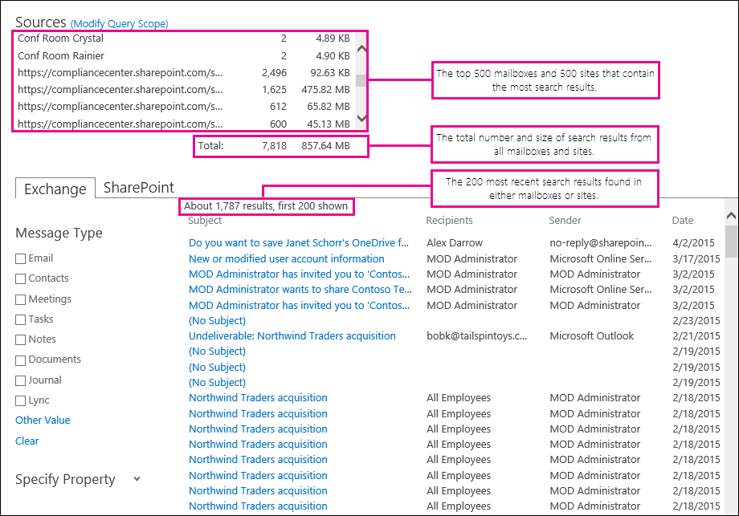

# 搜尋所有信箱及使用 eDiscovery Center 的網站Search all mailboxes and sites using the eDiscovery Center

在 Office 365 的 eDiscovery 中心，您可以搜尋所有的 Exchange Online 信箱、 SharePoint Online 網站及 OneDrive 單一 eDiscovery 搜尋中的商務網站。若要在組織中搜尋所有內容來源，eDiscovery 管理員必須具有每個內容來源的適當 eDiscovery 權限。In the eDiscovery Center in Office 365, you can search all Exchange Online mailboxes, SharePoint Online sites, and OneDrive for Business sites in a single eDiscovery search. To search all content sources in the organization, an eDiscovery manager must be assigned the appropriate eDiscovery permissions for each content source. 
  
## 開始之前Before you begin

- 必須指派適當的權限給 eDiscovery 管理員，才能搜尋內容來源。如需有關指派 eDiscovery 權限給信箱與網站的詳細資訊，請參閱下列內容：An eDiscovery manager must be assigned the appropriate permissions to search a content source. For more information about assigning eDiscovery permissions to mailboxes and sites, see the following: 
    
  - [Exchange 中指派 eDiscovery 權限Assign eDiscovery permissions in Exchange](https://go.microsoft.com/fwlink/p/?LinkId=526886)
    
  - [指派 SharePoint Online 中的 eDiscovery 權限Assign eDiscovery permissions in SharePoint Online](https://go.microsoft.com/fwlink/p/?LinkId=526885)
    
  - [將電子文件探索權限指派至商務用 OneDrive 網站Assign eDiscovery permissions to OneDrive for Business sites](assign-permissions-to-onedrive-for-business-sites.md)
    
- 您可以在單一 eDiscovery 搜尋查詢中搜尋最大值為 10000 個信箱和數目不受限制的 SharePoint Online 和 OneDrive for Business 的網站。不過，如果您指定要搜尋特定的網站，限制為 100 的網站。You can search a maximum of 10,000 mailboxes and an unlimited number of SharePoint Online and OneDrive for Business sites in a single eDiscovery search query. However, if you specify the specific sites to search, the limit is 100 sites.
    
- 搜尋所有信箱和網站時檢視結果時看到[的詳細資訊](search-all-mailboxes-and-sites-with-ediscovery.md#moreinfo)] 區段中的限制的描述。See the [More information](search-all-mailboxes-and-sites-with-ediscovery.md#moreinfo) section for a description of the limits when viewing the results when searching all mailboxes and sites. 
    
- 如需建立 eDiscovery Center 中的搜尋查詢的詳細資訊，請參閱[建立和執行的 eDiscovery 查詢](https://go.microsoft.com/fwlink/p/?LinkID=404032)。For more information about creating search queries in the eDiscovery Center, see [Create and run eDiscovery queries](https://go.microsoft.com/fwlink/p/?LinkID=404032).
    
## 搜尋所有位置Search all locations

1. 在 eDiscovery 中心，開啟您想要執行搜尋查詢的 eDiscovery 案例。In the eDiscovery Center, open the eDiscovery case that you want to run the search query for.
    
2. 在 [**搜尋及匯出**] 按一下 [現有的查詢或按一下 [**新增項目**建立新的搜尋查詢。Under **Search and Export**, click an existing query or click **New item** to create a new search query. 
    
3. 在 [搜尋查詢] 頁面的 [**來源**] 區段中，按一下 [**修改查詢範圍**。On the search query page, in the **Sources** section, click **Modify Query Scope**.
    
4. 在**修改查詢範圍**] 頁面上，按一下 [**搜尋所有項目**、 並選取要搜尋的內容位置。On the **Modify Query Scope** page, click **Search everything**, and select the content locations to search.
    
  - 選取 [ **Exchange**搜尋所有信箱。Select **Exchange** to search all mailboxes. 
    
  - 選取 [ **SharePoint**搜尋的所有 SharePoint Online 及 OneDrive for Business 的網站。Select **SharePoint** to search all SharePoint Online and OneDrive for Business sites. 
    
  - 選取 [ **Exchange**和**SharePoint**搜尋組織中的所有內容的位置。Select both **Exchange** and **SharePoint** to search all content locations in your organization. 
    

  
5. 按一下 **[確定]**，儲存變更。Click **OK** to save the changes. 
    
6. 完成或修改在搜尋查詢] 頁面上，例如關鍵字查詢、 日期範圍或縮小搜尋內容的特定類型的其他資訊。當您準備好執行查詢時，請按一下 [**搜尋**]。Complete or revise other information on the search query page, such as the keyword query, the date range, or narrowing the specific types of content to search for. When you're ready to run the query, click **Search**. 
    
## 其他資訊More information

- 前 500 個信箱和前 500 個網站與大部分的結果會列在底下**來源****查詢**] 頁面上。The top 500 mailboxes and the top 500 sites with the most results are listed under **Sources** on the **Query** page. 
    
- 所有內容來源中找到的項目數總計和其合併的總大小的顯示在 [**來源****查詢**] 頁面上。The total number of items found in all content sources and their combined total size are displayed under **Sources** on the **Query** page. 
    
- 您可以在 [查詢]**** 頁面上預覽位於 Exchange 信箱或 SharePoint 網站中的最近 200 筆搜尋結果。You can preview the 200 most recent search results located in Exchange mailboxes or SharePoint sites on the **Query** page. 
    
    下列螢幕擷取畫面顯示搜尋結果顯示在 [**查詢**] 頁面上所有信箱和網站中搜尋的範例。The following screenshot shows an example of the search results displayed on the **Query** page when you search all mailboxes and sites. 
    
    
  

