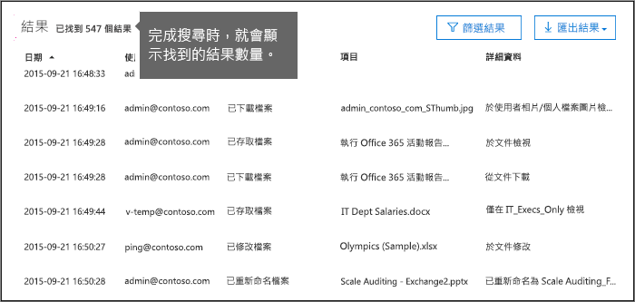
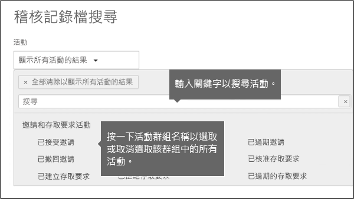
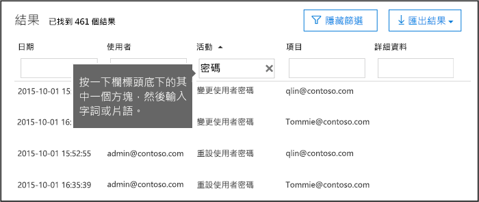
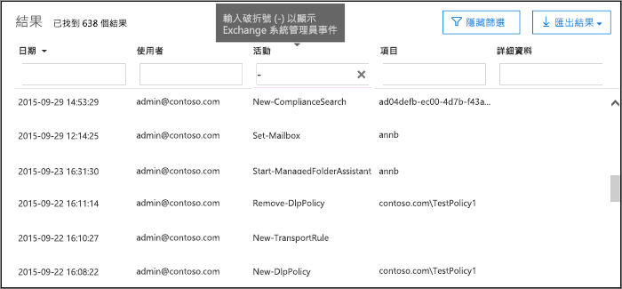

# <a name="search-the-audit-log-in-the-office-365-security--compliance-center"></a><span data-ttu-id="4eb7b-103">在 [Office 365 安全性及規範中心搜尋稽核記錄</span><span class="sxs-lookup"><span data-stu-id="4eb7b-103">Search the audit log in the Office 365 Security & Compliance Center</span></span>

<span data-ttu-id="4eb7b-p101">需要尋找是否使用者檢視特定文件或清除 [從他們的信箱項目吗？若如此，您可以使用 Office 365 安全性&amp;規範中心來搜尋整合的稽核記錄，以檢視您的 Office 365 組織中的使用者與管理員的活動。整合的稽核記錄的為何？因為您可以搜尋下列類型的使用者與系統管理 Office 365 中的活動：</span><span class="sxs-lookup"><span data-stu-id="4eb7b-p101">Need to find if a user viewed a specific document or purged an item from their mailbox? If so, you can use the Office 365 Security &amp; Compliance Center to search the unified audit log to view user and administrator activity in your Office 365 organization. Why a unified audit log? Because you can search for the following types of user and admin activity in Office 365:</span></span>
  
- <span data-ttu-id="4eb7b-108">SharePoint Online 和 OneDrive for Business 的使用者活動</span><span class="sxs-lookup"><span data-stu-id="4eb7b-108">User activity in SharePoint Online and OneDrive for Business</span></span>
    
- <span data-ttu-id="4eb7b-109">Exchange Online 中的使用者活動 （Exchange 信箱稽核記錄）</span><span class="sxs-lookup"><span data-stu-id="4eb7b-109">User activity in Exchange Online (Exchange mailbox audit logging)</span></span>
    
    > [!IMPORTANT]
    > <span data-ttu-id="4eb7b-p102">信箱稽核記錄必須開啟每個使用者信箱之前會記錄在 Exchange Online 中的使用者活動。如需詳細資訊，請參閱[啟用信箱稽核 Office 365 中](enable-mailbox-auditing.md)。</span><span class="sxs-lookup"><span data-stu-id="4eb7b-p102">Mailbox audit logging must be turned on for each user mailbox before user activity in Exchange Online will be logged. For more information, see [Enable mailbox auditing in Office 365](enable-mailbox-auditing.md).</span></span>
  
- <span data-ttu-id="4eb7b-112">在 SharePoint Online 中管理活動</span><span class="sxs-lookup"><span data-stu-id="4eb7b-112">Admin activity in SharePoint Online</span></span>
    
- <span data-ttu-id="4eb7b-113">管理 Azure Active Directory （Office 365 的目錄服務） 中的活動</span><span class="sxs-lookup"><span data-stu-id="4eb7b-113">Admin activity in Azure Active Directory (the directory service for Office 365)</span></span>
    
- <span data-ttu-id="4eb7b-114">Exchange Online 中的管理活動 （Exchange 管理員稽核記錄）</span><span class="sxs-lookup"><span data-stu-id="4eb7b-114">Admin activity in Exchange Online (Exchange admin audit logging)</span></span>
    
- <span data-ttu-id="4eb7b-115">Sway 中的使用者和系統活動</span><span class="sxs-lookup"><span data-stu-id="4eb7b-115">User and admin activity in Sway</span></span>
    
- <span data-ttu-id="4eb7b-116">在 [Office 365 安全性及規範中心中的 eDiscovery 活動</span><span class="sxs-lookup"><span data-stu-id="4eb7b-116">eDiscovery activities in the Office 365 Security & Compliance Center</span></span>
    
- <span data-ttu-id="4eb7b-117">使用者和系統活動 Power bi</span><span class="sxs-lookup"><span data-stu-id="4eb7b-117">User and admin activity in Power BI</span></span>
    
- <span data-ttu-id="4eb7b-118">使用者和系統中的 Microsoft 小組的活動</span><span class="sxs-lookup"><span data-stu-id="4eb7b-118">User and admin activity in Microsoft Teams</span></span>

- <span data-ttu-id="4eb7b-119">Dynamics 365 中的使用者和系統活動</span><span class="sxs-lookup"><span data-stu-id="4eb7b-119">User and admin activity in Dynamics 365</span></span>
    
- <span data-ttu-id="4eb7b-120">Yammer 中的使用者和系統活動</span><span class="sxs-lookup"><span data-stu-id="4eb7b-120">User and admin activity in Yammer</span></span>
 
- <span data-ttu-id="4eb7b-121">Microsoft 流程中的使用者和系統活動</span><span class="sxs-lookup"><span data-stu-id="4eb7b-121">User and admin activity in Microsoft Flow</span></span>
    
- <span data-ttu-id="4eb7b-122">Microsoft Stream 中的使用者和系統活動</span><span class="sxs-lookup"><span data-stu-id="4eb7b-122">User and admin activity in Microsoft Stream</span></span>
    
   
## <a name="before-you-begin"></a><span data-ttu-id="4eb7b-123">開始之前</span><span class="sxs-lookup"><span data-stu-id="4eb7b-123">Before you begin</span></span>

<span data-ttu-id="4eb7b-124">請務必先閱讀下列項目之前您啟動搜尋 Office 365 稽核記錄。</span><span class="sxs-lookup"><span data-stu-id="4eb7b-124">Be sure to read the following items before you start searching the Office 365 audit log.</span></span>
  
- <span data-ttu-id="4eb7b-p103">您 （或另一個系統管理員） 必須先開啟稽核記錄才能開始搜尋的 Office 365 稽核記錄。若要將它開啟，剛**開始錄製使用者和系統活動**頁面上按一下 [**稽核記錄搜尋**安全性&amp;規範中心。（如果您沒有看到此連結，稽核已經已開啟您的組織。）您開啟之後，會顯示訊息指出做準備的稽核記錄及您可在幾小時準備完成後執行搜尋。您只能有一次執行這項作業。</span><span class="sxs-lookup"><span data-stu-id="4eb7b-p103">You (or another admin) must first turn on audit logging before you can start searching the Office 365 audit log. To turn it on, just click **Start recording user and admin activity** on the **Audit log search** page in the Security &amp; Compliance Center. (If you don't see this link, auditing has already been turned on for your organization.) After you turn it on, a message is displayed that says the audit log is being prepared and that you can run a search in a couple of hours after the preparation is complete. You only have to do this once.</span></span> 
    
    > [!NOTE]
    > <span data-ttu-id="4eb7b-p104">我們已經程序開啟預設稽核。加上 then，直到您可以加以開啟為先前所述。</span><span class="sxs-lookup"><span data-stu-id="4eb7b-p104">We're in the process of turning on auditing by default. Until then, you can turn it on as previously described.</span></span> 
  
- <span data-ttu-id="4eb7b-p105">您必須指派 「 僅檢視稽核記錄 」 或 「 稽核記錄角色在 Exchange Online 搜尋 Office 365 稽核記錄。根據預設，這些角色被指派給 Exchange 系統管理中心的 [**權限**] 頁面上相符性管理] 和 [組織管理角色群組。若要讓使用者能夠搜尋 Office 365 稽核記錄的最低權限，您可以自訂角色群組 Exchange Online 中建立、 新增 「 僅檢視稽核記錄或稽核記錄 」 角色並再將使用者新增為新的角色群組的成員。如需詳細資訊，請參閱[管理角色群組在 Exchange Online](https://go.microsoft.com/fwlink/p/?LinkID=730688)。</span><span class="sxs-lookup"><span data-stu-id="4eb7b-p105">You have to be assigned the View-Only Audit Logs or Audit Logs role in Exchange Online to search the Office 365 audit log. By default, these roles are assigned to the Compliance Management and Organization Management role groups on the **Permissions** page in the Exchange admin center. To give a user the ability to search the Office 365 audit log with the minimum level of privileges, you can create a custom role group in Exchange Online, add the View-Only Audit Logs or Audit Logs role, and then add the user as a member of the new role group. For more information, see [Manage role groups in Exchange Online](https://go.microsoft.com/fwlink/p/?LinkID=730688).</span></span>
    
    > [!IMPORTANT]
    > <span data-ttu-id="4eb7b-p106">如果您在 [安全性]**權限**] 頁面上的僅檢視稽核記錄或稽核記錄角色指派使用者&amp;規範中心他們不能搜尋 Office 365 稽核記錄。您必須指派 Exchange Online 中的權限。這是因為基礎指令程式來搜尋稽核記錄是 Exchange Online 指令程式。</span><span class="sxs-lookup"><span data-stu-id="4eb7b-p106">If you assign a user the View-Only Audit Logs or Audit Logs role on the **Permissions** page in the Security &amp; Compliance Center, they won't be able to search the Office 365 audit log. You have to assign the permissions in Exchange Online. This is because the underlying cmdlet used to search the audit log is an Exchange Online cmdlet.</span></span> 
  
- <span data-ttu-id="4eb7b-p107">當稽核的活動由使用者或系統管理員執行時、 稽核記錄會產生並儲存在貴組織的 Office 365 稽核記錄。稽核記錄已保留 （及搜尋稽核記錄檔中） 的時間長度取決於您的 Office 365 訂閱以及明確指派給特定使用者的授權類型。</span><span class="sxs-lookup"><span data-stu-id="4eb7b-p107">When an audited activity is performed by a user or admin, an audit record is generated and stored in the Office 365 audit log for your organization. The length of time that an audit record is retained (and searchable in the audit log) depends on your Office 365 subscription, and specifically the type of the license that is assigned to a specific user.</span></span>

     - <span data-ttu-id="4eb7b-p108">**Office 365 E3** -稽核記錄的保留期為 90 天。這表示您可搜尋過去 90 天內所執行的活動的稽核記錄。</span><span class="sxs-lookup"><span data-stu-id="4eb7b-p108">**Office 365 E3** - Audit records are retained for 90 days. That means you can search the audit log for activities that were performed within the last 90 days.</span></span>

     - <span data-ttu-id="4eb7b-p109">**Office 365 E5** -稽核記錄會保留為 365 天 （一年以上）。這表示您可搜尋過去一年內所執行的活動的稽核記錄。保留一年的稽核記錄是也可用於指派 E3/Exchange Online 計劃 1 授權、 具備的 Office 365 進階規範的附加元件授權使用者。</span><span class="sxs-lookup"><span data-stu-id="4eb7b-p109">**Office 365 E5** - Audit records are retained for 365 days (one year). That means you can search the audit log for activities that were performed within the last year. Retaining audit records for one year is also available for users that are assigned an E3/Exchange Online Plan 1 license and have an Office 365 Advanced Compliance add-on license.</span></span>

        > [!NOTE]
        > <span data-ttu-id="4eb7b-p110">E5 組織 （或 E3 組織的進階規範的附加元件授權） 的 [稽核記錄的一年保留期間是目前可用做為私人預覽程式的一部分。若要在此預覽計畫中註冊，請檔案與[Microsoft 技術支援人員](https://docs.microsoft.com/en-us/office365/admin/contact-support-for-business-products?redirectSourcePath=%252fen-us%252farticle%252fcontact-support-for-business-products-admin-help-32a17ca7-6fa0-4870-8a8d-e25ba4ccfd4b&view=o365-worldwide&tabs=online)要求和如下所示為您需要協助的描述："長期 Office 365 稽核記錄檔私人 preview"。</span><span class="sxs-lookup"><span data-stu-id="4eb7b-p110">The one-year retention period for audit records for E5 organizations (or E3 organizations that have Advanced Compliance add-on licenses) is currently available only as part of a private preview program. To enroll in this preview program, please file a request with [Microsoft Support](https://docs.microsoft.com/en-us/office365/admin/contact-support-for-business-products?redirectSourcePath=%252fen-us%252farticle%252fcontact-support-for-business-products-admin-help-32a17ca7-6fa0-4870-8a8d-e25ba4ccfd4b&view=o365-worldwide&tabs=online) and include the following as the description of what you need help with: "Long-term Office 365 audit log private preview".</span></span>

- <span data-ttu-id="4eb7b-147">如果您想要關閉的 Office 365 組織的稽核記錄搜尋，您可以連線至 Exchange Online 組織的遠端 PowerShell 中執行下列命令：</span><span class="sxs-lookup"><span data-stu-id="4eb7b-147">If you want to turn off audit log search in Office 365 for your organization, you can run the following command in remote PowerShell connected to your Exchange Online organization:</span></span>
    
  ```
  Set-AdminAuditLogConfig -UnifiedAuditLogIngestionEnabled $false
  ```

    <span data-ttu-id="4eb7b-148">若要一次開啟稽核搜尋，您可以在 Exchange Online PowerShell 中執行下列命令：</span><span class="sxs-lookup"><span data-stu-id="4eb7b-148">To turn on audit search again, you can run the following command in Exchange Online PowerShell:</span></span>
    
  ```
  Set-AdminAuditLogConfig -UnifiedAuditLogIngestionEnabled $true
  ```

    <span data-ttu-id="4eb7b-149">如需詳細資訊，請參閱[關閉 Office 365 中的稽核記錄搜尋](turn-audit-log-search-on-or-off.md)。</span><span class="sxs-lookup"><span data-stu-id="4eb7b-149">For more information, see [Turn off audit log search in Office 365](turn-audit-log-search-on-or-off.md).</span></span>
    
- <span data-ttu-id="4eb7b-p111">先前所述，基礎指令程式來搜尋稽核記錄檔會是 Exchange Online 指令程式，這是**搜尋 UnifiedAuditLog**。這表示您可以使用此指令程式來搜尋而非使用中 [安全性] 的 [**稽核記錄檔**] 頁面上的 Office 365 稽核記錄&amp;規範中心。您必須在連線至 Exchange Online 組織的遠端 PowerShell 執行這個指令程式。如需詳細資訊，請參閱 ＜[搜尋 UnifiedAuditLog](https://go.microsoft.com/fwlink/p/?linkid=834776)。</span><span class="sxs-lookup"><span data-stu-id="4eb7b-p111">As previously stated, the underlying cmdlet used to search the audit log is an Exchange Online cmdlet, which is **Search-UnifiedAuditLog**. That means you can use this cmdlet to search the Office 365 audit log instead of using the **Audit log search** page in the Security &amp; Compliance Center. You have to run this cmdlet in remote PowerShell connected to your Exchange Online organization. For more information, see [Search-UnifiedAuditLog](https://go.microsoft.com/fwlink/p/?linkid=834776).</span></span>
    
- <span data-ttu-id="4eb7b-p112">如果您想要以程式設計方式從 Office 365 稽核記錄下載資料，我們建議您使用 Office 365 管理活動 API 而不是使用 PowerShell 指令碼。Office 365 管理活動 API 是您可以使用擬定作業、 安全性及規範的組織的監控解決方案的 REST web 服務。如需詳細資訊，請參閱[Office 365 管理活動 API 參考 （英文）](https://go.microsoft.com/fwlink/?linkid=852309)。</span><span class="sxs-lookup"><span data-stu-id="4eb7b-p112">If you want to programmatically download data from the Office 365 audit log, we recommend that you use the Office 365 Management Activity API instead of using a PowerShell script. The Office 365 Management Activity API is a REST web service that you can use to develop operations, security, and compliance monitoring solutions for your organization. For more information, see [Office 365 Management Activity API reference](https://go.microsoft.com/fwlink/?linkid=852309).</span></span>
    
- <span data-ttu-id="4eb7b-p113">它可以需要長達 30 分鐘或向上事件之後的 24 小時的週期定期發生相對應的稽核記錄項目顯示在搜尋結果中。下表顯示 Office 365 中的不同服務所花費的時間。</span><span class="sxs-lookup"><span data-stu-id="4eb7b-p113">It can take up to 30 minutes or up to 24 hours after an event occurs for the corresponding audit log entry to be displayed in the search results. The following table shows the time it takes for the different services in Office 365.</span></span>
    
    |<span data-ttu-id="4eb7b-159">**Office 365 服務**</span><span class="sxs-lookup"><span data-stu-id="4eb7b-159">**Office 365 service**</span></span>|<span data-ttu-id="4eb7b-160">**30 分鐘**</span><span class="sxs-lookup"><span data-stu-id="4eb7b-160">**30 minutes**</span></span>|<span data-ttu-id="4eb7b-161">**24 小時**</span><span class="sxs-lookup"><span data-stu-id="4eb7b-161">**24 hours**</span></span>|
    |:-----|:-----|:-----|
    |<span data-ttu-id="4eb7b-162">進階的威脅保護和威脅智慧</span><span class="sxs-lookup"><span data-stu-id="4eb7b-162">Advanced Threat Protection and Threat Intelligence</span></span>  <br/> || |
    |<span data-ttu-id="4eb7b-164">Azure Active Directory （使用者登入事件）</span><span class="sxs-lookup"><span data-stu-id="4eb7b-164">Azure Active Directory (user login events)</span></span>  <br/> ||           <br/> |
    |<span data-ttu-id="4eb7b-166">Azure Active Directory （系統事件）</span><span class="sxs-lookup"><span data-stu-id="4eb7b-166">Azure Active Directory (admin events)</span></span>  <br/> || |
    |<span data-ttu-id="4eb7b-168">Azure Active Directory （使用者登入事件）</span><span class="sxs-lookup"><span data-stu-id="4eb7b-168">Azure Active Directory (user login events)</span></span>  <br/> ||           <br/> |
    |<span data-ttu-id="4eb7b-170">資料遺失防護</span><span class="sxs-lookup"><span data-stu-id="4eb7b-170">Data Loss Prevention</span></span>  <br/> |           <br/>| |
    |<span data-ttu-id="4eb7b-172">Dynamics 365 CRM</span><span class="sxs-lookup"><span data-stu-id="4eb7b-172">Dynamics 365 CRM</span></span> <br/> |           <br/>| |
    |<span data-ttu-id="4eb7b-174">eDiscovery</span><span class="sxs-lookup"><span data-stu-id="4eb7b-174">eDiscovery</span></span>  <br/> |           <br/>| |
    |<span data-ttu-id="4eb7b-176">Exchange Online</span><span class="sxs-lookup"><span data-stu-id="4eb7b-176">Exchange Online</span></span>  <br/> |           <br/> ||
    |<span data-ttu-id="4eb7b-178">Microsoft Flow</span><span class="sxs-lookup"><span data-stu-id="4eb7b-178">Microsoft Flow</span></span>  <br/> |           <br/>| |
    |<span data-ttu-id="4eb7b-180">Microsoft Forms</span><span class="sxs-lookup"><span data-stu-id="4eb7b-180">Microsoft Forms</span></span>  <br/> |           <br/>| |
    |<span data-ttu-id="4eb7b-182">Microsoft Project</span><span class="sxs-lookup"><span data-stu-id="4eb7b-182">Microsoft Project</span></span>  <br/> |           <br/>| |
    |<span data-ttu-id="4eb7b-184">Microsoft Stream</span><span class="sxs-lookup"><span data-stu-id="4eb7b-184">Microsoft Stream</span></span>  <br/> |           <br/>| |
    |<span data-ttu-id="4eb7b-186">Microsoft Teams</span><span class="sxs-lookup"><span data-stu-id="4eb7b-186">Microsoft Teams</span></span>  <br/> |           <br/> ||
    |<span data-ttu-id="4eb7b-188">Power BI</span><span class="sxs-lookup"><span data-stu-id="4eb7b-188">Power BI</span></span>  <br/> |           <br/>| |
    |<span data-ttu-id="4eb7b-190">安全性&amp;規範中心</span><span class="sxs-lookup"><span data-stu-id="4eb7b-190">Security &amp; Compliance Center</span></span>  <br/> |           <br/> ||
    |<span data-ttu-id="4eb7b-192">SharePoint Online 和商務用 OneDrive</span><span class="sxs-lookup"><span data-stu-id="4eb7b-192">SharePoint Online and OneDrive for Business</span></span>  <br/> |           <br/> ||
    |<span data-ttu-id="4eb7b-194">Sway</span><span class="sxs-lookup"><span data-stu-id="4eb7b-194">Sway</span></span>  <br/> ||           <br/> |
    |<span data-ttu-id="4eb7b-196">Yammer</span><span class="sxs-lookup"><span data-stu-id="4eb7b-196">Yammer</span></span>  <br/> ||           <br/> |
   
- <span data-ttu-id="4eb7b-p114">Azure Active Directory (Azure AD) 是 Office 365 的目錄服務。整合的稽核記錄檔包含使用者、 群組、 應用程式、 網域和執行 Office 365 系統管理中心或在 Azure 中的目錄活動管理入口網站。Azure AD 事件的完整清單，請參閱[Azure Active Directory 稽核報告事件](https://go.microsoft.com/fwlink/p/?LinkID=616549)。</span><span class="sxs-lookup"><span data-stu-id="4eb7b-p114">Azure Active Directory (Azure AD) is the directory service for Office 365. The unified audit log contains user, group, application, domain, and directory activities performed in the Office 365 admin center or in the in Azure management portal. For a complete list of Azure AD events, see [Azure Active Directory Audit Report Events](https://go.microsoft.com/fwlink/p/?LinkID=616549).</span></span>
    
- <span data-ttu-id="4eb7b-p115">Exchange Online 稽核記錄檔包含兩種類型的事件： Exchange admin 事件 （系統管理員所採取的動作） 和信箱事件 （上信箱的使用者所採取的動作）。請注意預設未啟用信箱稽核。其必須之前信箱事件可以搜尋的 Office 365 稽核記錄中的每個使用者信箱啟用。如需信箱稽核及信箱稽核記錄的動作的詳細資訊，請參閱[啟用信箱稽核 Office 365 中](enable-mailbox-auditing.md)。</span><span class="sxs-lookup"><span data-stu-id="4eb7b-p115">Exchange Online audit logs consist of two types of events: Exchange admin events (actions taken by administrators) and mailbox events (actions taken by users on mailboxes). Note that mailbox auditing isn't enabled by default. It must be enable for each user mailbox before mailbox events can be searched for in the Office 365 audit log. For more information about mailbox auditing and the mailbox auditing actions that are logged, see [Enable mailbox auditing in Office 365](enable-mailbox-auditing.md).</span></span>
    
- <span data-ttu-id="4eb7b-p116">預設未啟用的 Power BI 稽核記錄。若要搜尋的 Office 365 稽核記錄中的 Power BI 活動，您必須啟用 [Power BI 系統入口網站中的稽核。指示，請參閱[Power BI 系統入口網站](https://docs.microsoft.com/power-bi/service-admin-portal#audit-logs)的 「 稽核記錄 」 一節。</span><span class="sxs-lookup"><span data-stu-id="4eb7b-p116">Audit logging for Power BI isn't enabled by default. To search for Power BI activities in the Office 365 audit log, you have to enable auditing in the Power BI admin portal. For instructions, see the "Audit logs" section in [Power BI admin portal](https://docs.microsoft.com/power-bi/service-admin-portal#audit-logs).</span></span>
    
    
## <a name="search-the-audit-log"></a><span data-ttu-id="4eb7b-208">搜尋稽核記錄</span><span class="sxs-lookup"><span data-stu-id="4eb7b-208">Search the audit log</span></span>

<span data-ttu-id="4eb7b-209">以下是在 Office 365 中搜尋稽核記錄的程序。</span><span class="sxs-lookup"><span data-stu-id="4eb7b-209">Here's the process for searching the audit log in Office 365.</span></span>
  
[<span data-ttu-id="4eb7b-210">步驟 1： 執行稽核記錄搜尋</span><span class="sxs-lookup"><span data-stu-id="4eb7b-210">Step 1: Run an audit log search</span></span>](#step-1-run-an-audit-log-search)
  
[<span data-ttu-id="4eb7b-211">步驟 2： 檢視搜尋結果</span><span class="sxs-lookup"><span data-stu-id="4eb7b-211">Step 2: View the search results</span></span>](#step-2-view-the-search-results)

[<span data-ttu-id="4eb7b-212">步驟 3： 篩選搜尋結果</span><span class="sxs-lookup"><span data-stu-id="4eb7b-212">Step 3: Filter the search results</span></span>](#step-3-filter-the-search-results)

[<span data-ttu-id="4eb7b-213">步驟 4： 將搜尋結果匯出至檔案</span><span class="sxs-lookup"><span data-stu-id="4eb7b-213">Step 4: Export the search results to a file</span></span>](#step-4-export-the-search-results-to-a-file)
  
### <a name="step-1-run-an-audit-log-search"></a><span data-ttu-id="4eb7b-214">步驟 1： 執行稽核記錄搜尋</span><span class="sxs-lookup"><span data-stu-id="4eb7b-214">Step 1: Run an audit log search</span></span>

1. <span data-ttu-id="4eb7b-215">請移至 [https://protection.office.com](https://protection.office.com)。</span><span class="sxs-lookup"><span data-stu-id="4eb7b-215">Go to [https://protection.office.com](https://protection.office.com).</span></span>
    
    > [!TIP]
    > <span data-ttu-id="4eb7b-p117">使用私用的瀏覽工作階段 （不正常工作階段） 來存取 Office 365 安全性&amp;規範中心因為如此將會防止您目前登入與從正在使用的認證。若要開啟 [InPrivate 瀏覽工作階段在 Internet Explorer 或 Microsoft Edge，只是按 CTRL + SHIFT + P。若要開啟私用的瀏覽工作階段中 Google Chrome （稱為 incognito 視窗），請按 CTRL + SHIFT + N。</span><span class="sxs-lookup"><span data-stu-id="4eb7b-p117">Use a private browsing session (not a regular session) to access the Office 365 Security &amp; Compliance Center because this will prevent the credential that you are currently logged on with from being used. To open an InPrivate Browsing session in Internet Explorer or Microsoft Edge, just press CTRL+SHIFT+P. To open a private browsing session in Google Chrome (called an incognito window), press CTRL+SHIFT+N.</span></span> 
  
2. <span data-ttu-id="4eb7b-219">使用公司或學校帳戶登入 Office 365。</span><span class="sxs-lookup"><span data-stu-id="4eb7b-219">Sign in to Office 365 using your work or school account.</span></span>
    
3. <span data-ttu-id="4eb7b-220">在 [安全性] 的左窗格中&amp;規範中心按一下**搜尋&amp;調查**，然後按一下 [**稽核記錄搜尋**。</span><span class="sxs-lookup"><span data-stu-id="4eb7b-220">In the left pane of the Security &amp; Compliance Center, click **Search &amp; investigation**, and then click **Audit log search**.</span></span>
    
    <span data-ttu-id="4eb7b-221">會顯示 [**稽核記錄搜尋**] 頁面。</span><span class="sxs-lookup"><span data-stu-id="4eb7b-221">The **Audit log search** page is displayed.</span></span> 
    
    ![設定準則，然後按一下 [搜尋] 執行報告](media/8639d09c-2843-44e4-8b4b-9f45974ff7f1.png)
  
    > [!NOTE]
    > <span data-ttu-id="4eb7b-p118">您必須在稽核記錄，才可執行的稽核記錄搜尋的第一個開啟。如果顯示 [**開始錄製使用者和系統活動**] 連結時，請按一下它便開啟稽核功能。如果您沒有看到此連結，稽核已經已開啟您的組織。</span><span class="sxs-lookup"><span data-stu-id="4eb7b-p118">You have to first turn on audit logging before you can run an audit log search. If the **Start recording user and admin activity** link is displayed, click it to turn on auditing. If you don't see this link, auditing has already been turned on for your organization.</span></span> 
  
4. <span data-ttu-id="4eb7b-226">設定下列搜尋準則：</span><span class="sxs-lookup"><span data-stu-id="4eb7b-226">Configure the following search criteria:</span></span>
    
    <span data-ttu-id="4eb7b-p119">a.**活動**按一下下拉式清單以顯示您可以搜尋的活動。使用者和系統活動編組成群組相關的活動。您可以選取特定的活動或您可以按一下 [選取群組中的所有活動的活動群組名稱。您也可以按一下 [清除選取項目所選的活動。執行搜尋之後，會顯示只選取活動的稽核記錄項目。選取 [**顯示所有的活動的結果**會顯示所選的使用者或使用者群組所執行的所有活動的結果。</span><span class="sxs-lookup"><span data-stu-id="4eb7b-p119">a. **Activities** Click the drop-down list to display the activities that you can search for. User and admin activities are organized in to groups of related activities. You can select specific activities or you can click the activity group name to select all activities in the group. You can also click a selected activity to clear the selection. After you run the search, only the audit log entries for the selected activities are displayed. Selecting **Show results for all activities** will display results for all activities performed by the selected user or group of users.</span></span> 
    
    <span data-ttu-id="4eb7b-p120">超過 100 的使用者和系統活動會記錄在 Office 365 稽核記錄檔。按一下 [在本篇文章以查看每個不同的 Office 365 服務中的每個活動的說明主題**Audited 活動**] 索引標籤。</span><span class="sxs-lookup"><span data-stu-id="4eb7b-p120">Over 100 user and admin activities are logged in the Office 365 audit log. Click the **Audited activities** tab at the topic of this article to see the descriptions of every activity in each of the different Office 365 services.</span></span> 
    
    <span data-ttu-id="4eb7b-p121">預設會選取 b**開始日期**] 及 [**結束日期**過去 7 天。選取以顯示該期間內發生之事件的日期和時間範圍。以國際標準時間 (UTC) 格式所呈現的日期和時間。您可以指定的最大的日期範圍為 90 天。如果選取的日期範圍大於 90 天會顯示錯誤。</span><span class="sxs-lookup"><span data-stu-id="4eb7b-p121">b. **Start date** and **End date** The last seven days are selected by default. Select a date and time range to display the events that occurred within that period. The date and time are presented in Coordinated Universal Time (UTC) format. The maximum date range that you can specify is 90 days. An error is displayed if the selected date range is greater than 90 days.</span></span> 
    
    > [!TIP]
    > <span data-ttu-id="4eb7b-p122">如果您使用 90 天的最大的日期範圍、 選取目前時間的**開始日期**。否則，您會收到的錯誤說明的開始日期早於結束日期。如果您已開啟稽核過去 90 天內，最大的日期範圍無法啟動之前已開啟稽核的日期。</span><span class="sxs-lookup"><span data-stu-id="4eb7b-p122">If you're using the maximum date range of 90 days, select the current time for the **Start date**. Otherwise, you'll receive an error saying that the start date is earlier than the end date. If you've turned on auditing within the last 90 days, the maximum date range can't start before the date that auditing was turned on.</span></span> 
  
    <span data-ttu-id="4eb7b-p123">c.個**使用者**按一下 [在這個方塊和再選取一或多個使用者顯示搜尋結果。選取您在此方塊中選取的使用者所執行的活動的稽核記錄項目所顯示的結果清單中。保留此方塊空白以傳回組織中的所有使用者 （及服務帳戶） 的項目。</span><span class="sxs-lookup"><span data-stu-id="4eb7b-p123">c. **Users** Click in this box and then select one or more users to display search results for. The audit log entries for the selected activity performed by the users you select in this box are displayed in the list of results. Leave this box blank to return entries for all users (and service accounts) in your organization.</span></span> 
    
    <span data-ttu-id="4eb7b-p124">d.**檔案、 資料夾或站台**輸入某些或所有搜尋資料夾包含指定之的關鍵字的檔案相關的活動的檔案或資料夾名稱。您也可以指定的檔案或資料夾的 URL。如果您使用的 URL，請確定此類型的完整的 URL 路徑或如果您只需要輸入 URL 部分不會包含任何特殊字元或空格。</span><span class="sxs-lookup"><span data-stu-id="4eb7b-p124">d. **File, folder, or site** Type some or all of a file or folder name to search for activity related to the file of folder that contains the specified keyword. You can also specify a URL of a file or folder. If you use a URL, be sure the type the full URL path or if you just type a portion of the URL, don't include any special characters or spaces.</span></span> 
    
    <span data-ttu-id="4eb7b-253">保留此方塊空白以傳回組織中的所有檔案及資料夾的項目。</span><span class="sxs-lookup"><span data-stu-id="4eb7b-253">Leave this box blank to return entries for all files and folders in your organization.</span></span>
    
5. <span data-ttu-id="4eb7b-254">按一下 [**搜尋**來執行使用搜尋準則的 [搜尋]。</span><span class="sxs-lookup"><span data-stu-id="4eb7b-254">Click **Search** to run the search using your search criteria.</span></span> 
    
    <span data-ttu-id="4eb7b-p125">會載入搜尋結果，並在幾分鐘之後他們的顯示在 [**結果**。搜尋完成時，會顯示找到的結果數目。請注意將會以遞增 150 事件 ； 中的 [**結果**] 窗格中顯示最大值為 5000 個事件如果超過 5000 筆事件符合搜尋準則，則會顯示最近的 5000 個事件。</span><span class="sxs-lookup"><span data-stu-id="4eb7b-p125">The search results are loaded, and after a few moments they are displayed under **Results**. When the search is finished, the number of results found is displayed. Note that a maximum of 5,000 events will be displayed in the **Results** pane in increments of 150 events; if more than 5,000 events meet the search criteria, the most recent 5,000 events are displayed.</span></span> 
    
    
  
  
#### <a name="tips-for-searching-the-audit-log"></a><span data-ttu-id="4eb7b-259">搜尋稽核記錄的秘訣</span><span class="sxs-lookup"><span data-stu-id="4eb7b-259">Tips for searching the audit log</span></span>

- <span data-ttu-id="4eb7b-p126">您可以選取活動名稱上按一下 [搜尋特定的活動。或您可搜尋的所有活動 （如**檔案及資料夾的活動**） 群組中按一下群組名稱。如果已選取 [活動，您可以按一下它取消選取項目。您也可以使用 [搜尋] 方塊中顯示含有您所輸入關鍵字的活動。</span><span class="sxs-lookup"><span data-stu-id="4eb7b-p126">You can select specific activities to search for by clicking on the activity name. Or you can search for all activities in a group (such as **File and folder activities**) by clicking on the group name. If an activity is selected, you can click it to cancel the selection. You can also use the search box to display the activities that contain the keyword that you type.</span></span>
    
    
  
- <span data-ttu-id="4eb7b-p127">您必須以顯示從 Exchange 管理員稽核記錄的事件**活動**清單中選取 [**顯示所有的活動的結果**。從這個稽核記錄的事件結果中的 [**活動**] 欄中顯示的指令程式名稱 （例如**Set-mailbox** ）。如需詳細資訊，本主題中的 [ **Audited 活動**] 索引標籤和 [ **Exchange 系統活動**。</span><span class="sxs-lookup"><span data-stu-id="4eb7b-p127">You have to select **Show results for all activities** in the **Activities** list to display events from the Exchange admin audit log. Events from this audit log display a cmdlet name (for example, **Set-Mailbox** ) in the **Activity** column in the results. For more information, click the **Audited activities** tab in this topic and then click **Exchange admin activities**.</span></span>
    
    <span data-ttu-id="4eb7b-p128">同樣地，有一些稽核活動**活動**清單中沒有對應的項目。如果您知道這些活動的作業的名稱，您可以搜尋所有的活動，然後輸入作業的名稱] 方塊中的 [**活動**] 欄來篩選結果。請參閱[步驟 3： 篩選搜尋結果](#step-3-filter-the-search-results)的篩選結果的詳細資訊。</span><span class="sxs-lookup"><span data-stu-id="4eb7b-p128">Similarly, there are some auditing activities that don't have a corresponding item in the **Activities** list. If you know the name of the operation for these activities, you can search for all activities, then filter the results by typing the name of the operation in the box for the **Activity** column. See [Step 3: Filter the search results](#step-3-filter-the-search-results) for more information about filtering the results.</span></span> 
    
- <span data-ttu-id="4eb7b-p129">按一下 [**清除**來清除目前的搜尋準則。日期範圍會傳回預設的過去 7 天。您也可以按一下 [取消所有選取的活動**清除所有以顯示所有的活動的結果**。</span><span class="sxs-lookup"><span data-stu-id="4eb7b-p129">Click **Clear** to clear the current search criteria. The date range returns to the default of the last seven days. You can also click **Clear all to show results for all activities** to cancel all selected activities.</span></span> 
    
- <span data-ttu-id="4eb7b-p130">如果找到 5000 筆結果可能可以假設有超過 5000 筆符合搜尋準則的事件。您可以調整的搜尋準則並重新執行搜尋以返回較少的結果，或將所有的搜尋結果匯出選取 [**匯出結果** \> **下載所有結果**。</span><span class="sxs-lookup"><span data-stu-id="4eb7b-p130">If 5,000 results are found, you can probably assume there are more than 5,000 events that met the search criteria. You can either refine the search criteria and rerun the search to return fewer results, or you can export all of the search results by selecting **Export results** \> **Download all results**.</span></span>

  
### <a name="step-2-view-the-search-results"></a><span data-ttu-id="4eb7b-276">步驟 2： 檢視搜尋結果</span><span class="sxs-lookup"><span data-stu-id="4eb7b-276">Step 2: View the search results</span></span>

<span data-ttu-id="4eb7b-p131">稽核記錄搜尋結果會顯示 [**結果**在**稽核記錄檔**] 頁面上。如先前所述以遞增 150 事件中顯示最大值為 5000 個 （最新） 的事件。若要顯示多個事件您可以使用捲軸列在 [**結果**] 窗格中或您可以按**Shift + End**顯示下一步] 150 事件。</span><span class="sxs-lookup"><span data-stu-id="4eb7b-p131">The results of an audit log search are displayed under **Results** on the **Audit log search** page. As previously stated a maximum of 5,000 (newest) events are displayed in increments of 150 events. To display more events you can use the scroll bar in the **Results** pane or you can press **Shift + End** to display the next 150 events.</span></span> 
  
<span data-ttu-id="4eb7b-280">結果包含下列搜尋傳回的每個事件的相關資訊。</span><span class="sxs-lookup"><span data-stu-id="4eb7b-280">The results contain the following information about each event returned by the search.</span></span>
  
- <span data-ttu-id="4eb7b-281">**日期：** 日期和時間 （UTC 格式） 事件發生的時間。</span><span class="sxs-lookup"><span data-stu-id="4eb7b-281">**Date:** The date and time (in UTC format) when the event occurred.</span></span> 
    
- <span data-ttu-id="4eb7b-p132">**IP 位址：** 活動已記錄時使用的裝置 IP 位址。IP 位址是 IPv4 或 IPv6 地址格式顯示。</span><span class="sxs-lookup"><span data-stu-id="4eb7b-p132">**IP address:** The IP address of the device that was used when the activity was logged. The IP address is displayed in either an IPv4 or IPv6 address format.</span></span> 
    
- <span data-ttu-id="4eb7b-284">**使用者：** 使用者 （或服務帳戶） 誰執行觸發事件的動作。</span><span class="sxs-lookup"><span data-stu-id="4eb7b-284">**User:** The user (or service account) who performed the action that triggered the event.</span></span> 
    
- <span data-ttu-id="4eb7b-p133">**活動：** 使用者執行活動。此值會對應至您在 [**活動**] 下拉式清單中選取的活動。從 Exchange 管理員稽核記錄的事件，此資料行中的值會是 Exchange cmdlet。</span><span class="sxs-lookup"><span data-stu-id="4eb7b-p133">**Activity:** The activity performed by the user. This value corresponds to the activities that you selected in the **Activities** drop down list. For an event from the Exchange admin audit log, the value in this column is an Exchange cmdlet.</span></span> 
    
- <span data-ttu-id="4eb7b-p134">**項目：** 已建立或修改因為相對應的活動的物件。例如，已檢視或修改的檔案或已更新的使用者帳戶。並非所有的活動具有此欄中的值。</span><span class="sxs-lookup"><span data-stu-id="4eb7b-p134">**Item:** The object that was created or modified as a result of the corresponding activity. For example, the file that was viewed or modified or the user account that was updated. Not all activities have a value in this column.</span></span> 
    
- <span data-ttu-id="4eb7b-p135">**詳細資料：** 其他活動的詳細資訊。同樣地，不是所有的活動都有值。</span><span class="sxs-lookup"><span data-stu-id="4eb7b-p135">**Detail:** Additional detail about an activity. Again, not all activities will have a value.</span></span> 
    
> [!TIP]
> <span data-ttu-id="4eb7b-p136">按一下欄標題底下來排序結果的**結果**。您可以排序結果從 A 到 Z 或 Z A 按一下**日期**欄位名稱來排序結果的最早為最新或最新到最舊。</span><span class="sxs-lookup"><span data-stu-id="4eb7b-p136">Click a column header under **Results** to sort the results. You can sort the results from A to Z or Z to A. Click the **Date** header to sort the results from oldest to newest or newest to oldest.</span></span> 
  
#### <a name="view-the-details-for-a-specific-event"></a><span data-ttu-id="4eb7b-295">檢視特定事件的詳細資料</span><span class="sxs-lookup"><span data-stu-id="4eb7b-295">View the details for a specific event</span></span>

<span data-ttu-id="4eb7b-p137">您可以依序按一下 [搜尋結果的清單中的事件記錄檢視某個事件有關的詳細資訊。**詳細資料**] 頁面會顯示包含從事件記錄的詳細的屬性。顯示的內容取決於 Office 365 服務中發生此事件。若要顯示這些詳細資訊，請按一下 [**詳細資訊**。如需說明，請參閱[Office 365 中的詳細的內容稽核記錄](detailed-properties-in-the-office-365-audit-log.md)。</span><span class="sxs-lookup"><span data-stu-id="4eb7b-p137">You can view more details about an event by clicking the event record in the list of search results. A **Details** page is displayed that contains the detailed properties from the event record. The properties that are displayed depend on the Office 365 service in which the event occurs. To display these details, click **More information**. For descriptions, see [Detailed properties in the Office 365 audit log](detailed-properties-in-the-office-365-audit-log.md).</span></span>
  


  
### <a name="step-3-filter-the-search-results"></a><span data-ttu-id="4eb7b-302">步驟 3： 篩選搜尋結果</span><span class="sxs-lookup"><span data-stu-id="4eb7b-302">Step 3: Filter the search results</span></span>

<span data-ttu-id="4eb7b-p138">除了排序，您也可以篩選的稽核記錄搜尋的結果。這是更好的功能可協助您快速篩選特定使用者或活動的結果。您可以開始建立寬搜尋和快速篩選結果，以查看特定的事件。然後您可縮小範圍的搜尋準則並重新執行搜尋以返回較小、 比較簡明結果集。</span><span class="sxs-lookup"><span data-stu-id="4eb7b-p138">In addition to sorting, you can also filter the results of an audit log search. This is a great feature that can help you quickly filter the results for a specific user or activity. You can initially create a wide search and then quickly filter the results to see specific events. Then you can narrow the search criteria and re-run the search to return a smaller, more concise set of results.</span></span>
  
<span data-ttu-id="4eb7b-307">若要篩選結果：</span><span class="sxs-lookup"><span data-stu-id="4eb7b-307">To filter the results:</span></span>
  
1. <span data-ttu-id="4eb7b-308">執行稽核記錄搜尋。</span><span class="sxs-lookup"><span data-stu-id="4eb7b-308">Run an audit log search.</span></span>
    
2. <span data-ttu-id="4eb7b-309">時所顯示的結果，按一下 [**篩選結果**。</span><span class="sxs-lookup"><span data-stu-id="4eb7b-309">When the results are displayed, click **Filter results**.</span></span>
    
    <span data-ttu-id="4eb7b-310">關鍵字] 方塊會顯示每個資料行標題底下。</span><span class="sxs-lookup"><span data-stu-id="4eb7b-310">Keyword boxes are displayed under each column header.</span></span>
    
3. <span data-ttu-id="4eb7b-p139">按一下欄標題下的其中一個方塊，輸入的單字或片語，視您要篩選的資料行。結果會以動態方式重新調整以顯示符合您的篩選器的事件。</span><span class="sxs-lookup"><span data-stu-id="4eb7b-p139">Click one of the boxes under a column header and type a word or phrase, depending on the column you're filtering on. The results will dynamically readjust to display the events that match your filter.</span></span>
    
    
  
4. <span data-ttu-id="4eb7b-314">若要清除篩選，請按一下 [篩選] 方塊中的**X**或只要按一下 [**隱藏篩選**。</span><span class="sxs-lookup"><span data-stu-id="4eb7b-314">To clear a filter, click the **X** in the filter box or just click **Hide filtering**.</span></span>
    
> [!TIP]
> <span data-ttu-id="4eb7b-p140">若要顯示從 Exchange 管理員稽核記錄的事件，請輸入**-**（虛線）**活動**篩選] 方塊中。這會顯示的 Exchange 系統事件的 [**活動**] 欄中顯示的指令程式名稱。然後您可以排序依字母順序排列的 cmdlet 名稱。</span><span class="sxs-lookup"><span data-stu-id="4eb7b-p140">To display events from the Exchange admin audit log, type a **-** (dash) in the **Activity** filter box. This will display cmdlet names, which are displayed in the **Activity** column for Exchange admin events. Then you can sort the cmdlet names in alphabetical order.</span></span> 

### <a name="step-4-export-the-search-results-to-a-file"></a><span data-ttu-id="4eb7b-318">步驟 4： 將搜尋結果匯出至檔案</span><span class="sxs-lookup"><span data-stu-id="4eb7b-318">Step 4: Export the search results to a file</span></span>

<span data-ttu-id="4eb7b-p141">您可以將稽核記錄搜尋結果匯出至本機電腦上逗點分隔的值 (CSV) 檔案。您可以在 Microsoft Excel 中開啟此檔案並使用功能，例如搜尋、 排序、 篩選和分割單一欄 （其中包含多重值的儲存格） 到多個資料欄。</span><span class="sxs-lookup"><span data-stu-id="4eb7b-p141">You can export the results of an audit log search to a comma separated value (CSV) file on your local computer. You can open this file in Microsoft Excel and use features such as search, sorting, filtering, and splitting a single column (that contains multi-value cells) into multiple columns.</span></span>
  
1. <span data-ttu-id="4eb7b-321">執行稽核記錄搜尋，並再修改搜尋準則直到您有想要的結果。</span><span class="sxs-lookup"><span data-stu-id="4eb7b-321">Run an audit log search, and then revise the search criteria until you have the desired results.</span></span>
    
2. <span data-ttu-id="4eb7b-322">按一下 [**匯出結果**並選取下列選項之一：</span><span class="sxs-lookup"><span data-stu-id="4eb7b-322">Click **Export results** and select one of the following options:</span></span> 
    
  - <span data-ttu-id="4eb7b-p142">**儲存載入結果**選擇此選項可匯出的 [**結果**顯示的項目 \* \* 稽核記錄搜尋 \* \*] 頁面。已下載的 CSV 檔案包含相同資料行 （和資料） 顯示在頁面 （日期、 使用者、 活動、 項目及詳細資料）。額外一欄 （名為**多個**） 隨附於包含稽核記錄項目中的詳細資訊的 CSV 檔案。因為您要匯出相同的結果所載入 （及檢視） 的**稽核記錄搜尋**頁面上，都要匯出的最大值為 5000 項目。</span><span class="sxs-lookup"><span data-stu-id="4eb7b-p142">**Save loaded results** Choose this option to export only the entries that are displayed under **Results** on the \*\* Audit log search \*\* page. The CSV file that is downloaded contains the same columns (and data) displayed on the page (Date, User, Activity, Item, and Details). An additional column (named **More**) is included in the CSV file that contains more information from the audit log entry. Because you're exporting the same results that are loaded (and viewable) on the **Audit log search** page, a maximum of 5,000 entries are exported.</span></span> 
    
  - <span data-ttu-id="4eb7b-p143">**下載所有結果**選擇此選項可從符合搜尋準則的 Office 365 稽核記錄中匯出所有的項目。搜尋結果的一大組，選擇此選項除了可以**稽核記錄搜尋**頁顯示 5000 筆結果的稽核記錄檔從下載所有項目。這個選項會下載從稽核記錄的原始資料至 CSV 檔案，並包含名為**AuditData**] 欄中的稽核記錄項目中的其他資訊。可能需要更久，如果您選擇這個匯出選項因為檔案可能會更加大於會下載如果您選擇其他選項的下載檔案。</span><span class="sxs-lookup"><span data-stu-id="4eb7b-p143">**Download all results** Choose this option to export all entries from the Office 365 audit log that meet the search criteria. For a large set of search results, choose this option to download all entries from the audit log in addition to the 5,000 results that can be displayed on the **Audit log search** page. This option will download the raw data from the audit log to a CSV file, and contains additional information from the audit log entry in a column named **AuditData**. It may take longer to download the file if you choose this export option because the file may be much larger than the one that's downloaded if you choose the other option.</span></span>
    
    > [!IMPORTANT]
    > <span data-ttu-id="4eb7b-p144">您可以下載到 CSV 檔案的最大值為 50000 項目從單一的稽核記錄搜尋。如果 50000 項目會下載到 CSV 檔案，您可能可以假設有超過 50000 個符合搜尋準則的事件。若要匯出超過此限制，嘗試使用日期範圍減少的稽核記錄項目數目。您可能必須執行多個搜尋與較小的日期範圍中匯出 50000 個以上的項目。</span><span class="sxs-lookup"><span data-stu-id="4eb7b-p144">You can download a maximum of 50,000 entries to a CSV file from a single audit log search. If 50,000 entries are downloaded to the CSV file, you can probably assume there are more than 50,000 events that met the search criteria. To export more than this limit, try using a date range to reduce the number of audit log entries. You might have to run multiple searches with smaller date ranges to export more than 50,000 entries.</span></span> 
  
3. <span data-ttu-id="4eb7b-335">選取 [匯出] 選項後，會提示您 CSV 檔案開啟、 將其儲存至 [下載項目] 資料夾中，或將其儲存至特定資料夾視窗底部顯示訊息。</span><span class="sxs-lookup"><span data-stu-id="4eb7b-335">After you select an export option, a message is displayed at the bottom of the window that prompts you to open the CSV file, save it to the Downloads folder, or save it to a specific folder.</span></span>

  
#### <a name="more-information-about-exporting-audit-log-search-results"></a><span data-ttu-id="4eb7b-336">匯出稽核記錄搜尋結果的詳細資訊</span><span class="sxs-lookup"><span data-stu-id="4eb7b-336">More information about exporting audit log search results</span></span>

- <span data-ttu-id="4eb7b-p145">**下載所有結果**] 選項會下載到 CSV 檔案從 Office 365 稽核記錄的原始資料。這個檔案包含不同的資料行名稱 （CreationDate、 UserIds、 作業、 AuditData） 比如果您選取 [**儲存] 載入結果**] 選項已下載的檔案。在相同的活動的兩個不同 CSV 檔案中的值也可能不同。例如，csv 檔案中的 [**動作**] 欄中的活動檔案且可能會有不同的值大於**稽核記錄搜尋**頁面 ； 上的 [**活動**] 欄中會顯示"易記"版本例如，MailboxLogin 相對於使用者登入至信箱。</span><span class="sxs-lookup"><span data-stu-id="4eb7b-p145">The **Download all results** option downloads the raw data from the Office 365 audit log to a CSV file. This file contains different column names (CreationDate, UserIds, Operation, AuditData) than the file that's downloaded if you select the **Save loaded results** option. The values in the two different CSV files for the same activity may also be different. For example, the activity in the **Action** column in the CSV file and may have a different value than the "user-friendly" version that's displayed in the **Activity** column on the **Audit log search** page; for example, MailboxLogin vs. User signed in to mailbox.</span></span>
    
- <span data-ttu-id="4eb7b-p146">如果您下載所有結果、 CSV 檔案會包含名為**AuditData**，其中包含每個事件的其他資訊的欄。先前所述，此資料行包含多個屬性的稽核記錄的記錄從多重值屬性。每個成對此多重值屬性中的**屬性： 值**是以逗號分隔。您可以使用 Excel 中的 Power 查詢此資料行分割成多個資料欄，，讓每個屬性將有其專屬資料行。這可讓您排序及篩選一或多個這些屬性。了解如何執行這項作業，請參閱"分割資料行來分隔字元"一節中[分割資料行的文字 （進階查詢）](https://support.office.com/article/5282d425-6dd0-46ca-95bf-8e0da9539662)。</span><span class="sxs-lookup"><span data-stu-id="4eb7b-p146">If you download all results, the CSV file contains a column named **AuditData**, which contains additional information about each event. As previously stated, this column contains a multi-value property for multiple properties from the audit log record. Each of the **property:value** pairs in this multi-value property are separated by a comma. You can use the Power Query in Excel to split this column into multiple columns so that each property will have its own column. This will let you sort and filter on one or more of these properties. To learn how to do this, see the "Split a column by delimiter" section in [Split a column of text (Power Query)](https://support.office.com/article/5282d425-6dd0-46ca-95bf-8e0da9539662).</span></span>
    
    <span data-ttu-id="4eb7b-347">分割**AuditData**欄之後，您可以當做篩選依據以顯示特定類型的活動的詳細的內容的 [**作業**] 欄。</span><span class="sxs-lookup"><span data-stu-id="4eb7b-347">After you split the **AuditData** column, you can filter on the **Operations** column to display the detailed properties for a specific type of activity.</span></span> 
    
- <span data-ttu-id="4eb7b-p147">沒有 3,060 字元的限制的稽核記錄的**AuditData**欄位中所顯示的資料。如果超過 3,060 字元限制，此欄位中的資料會無條件捨去。</span><span class="sxs-lookup"><span data-stu-id="4eb7b-p147">There's a 3,060-character limit for the data that's displayed in the **AuditData** field for an audit record. If the 3,060-character limit is exceeded, the data in this field is truncated.</span></span> 
    
- <span data-ttu-id="4eb7b-p148">當您從包含事件從不同 Office 365 服務搜尋查詢下載所有結果時、 **AuditData**欄 CSV 檔案中的包含根據服務動作所執行的不同屬性。例如，從 Exchange 和 Azure AD 的稽核記錄項目包含名為**ResultStatus**指出動作如果已成功屬性。此屬性不包含在 SharePoint 中的事件。同樣地，SharePoint 事件沒有屬性識別的網站 URL 的檔案與資料夾相關的活動。若要降低此表現方式，請考慮使用不同的搜尋活動的結果匯出單一服務。</span><span class="sxs-lookup"><span data-stu-id="4eb7b-p148">When you download all results from a search query that contains events from different Office 365 services, the **AuditData** column in the CSV file contains different properties depending on which service the action was performed in. For example, entries from Exchange and Azure AD audit logs include a property named **ResultStatus** that indicates if the action was successful or not. This property isn't included for events in SharePoint. Similarly, SharePoint events have a property that identifies the site URL for file and folder related activities. To mitigate this behavior, consider using different searches to export the results for activities from a single service.</span></span> 
    
    <span data-ttu-id="4eb7b-355">當您下載所有結果，以及服務每一個 CSV 檔案中的 [ **AuditData** ] 欄中所列的屬性描述一套用於，請參閱[Office 365 中的詳細的內容稽核記錄](detailed-properties-in-the-office-365-audit-log.md)。</span><span class="sxs-lookup"><span data-stu-id="4eb7b-355">For a description of the properties that are listed in the **AuditData** column in the CSV file when you download all results, and the service each one applies to, see [Detailed properties in the Office 365 audit log](detailed-properties-in-the-office-365-audit-log.md).</span></span>

## <a name="audited-activities"></a><span data-ttu-id="4eb7b-356">稽核的活動</span><span class="sxs-lookup"><span data-stu-id="4eb7b-356">Audited activities</span></span>

<span data-ttu-id="4eb7b-p149">本節中的表格說明 Office 365 中您可以稽核的活動。您可以搜尋的安全性將這些事件來搜尋稽核記錄&amp;規範中心。按一下 [**搜尋稽核記錄**] 索引標籤的逐步指示。</span><span class="sxs-lookup"><span data-stu-id="4eb7b-p149">The tables in this section describe the activities that are audited in Office 365. You can search for these events by searching the audit log in the Security &amp; Compliance Center. Click the **Search the audit log** tab for step-by-step instructions.</span></span> 
  
<span data-ttu-id="4eb7b-p150">這些表格群組相關的活動] 或 [從特定的 Office 365 服務活動。表格包含顯示在 [**活動**] 下拉式清單中的易記名稱和對應作業時匯出搜尋結果出現在稽核記錄的詳細資訊及 CSV 檔案的名稱。如需詳細資訊的說明，請參閱[Office 365 中的詳細的內容稽核記錄](detailed-properties-in-the-office-365-audit-log.md)。</span><span class="sxs-lookup"><span data-stu-id="4eb7b-p150">These tables group related activities or the activities from a specific Office 365 service. The tables include the friendly name that's displayed in the **Activities** drop-down list and the name of the corresponding operation that appears in the detailed information of an audit record and in the CSV file when you export the search results. For descriptions of the detailed information, see [Detailed properties in the Office 365 audit log](detailed-properties-in-the-office-365-audit-log.md).</span></span>
  
<span data-ttu-id="4eb7b-363">按一下下列連結，即可移至特定資料表的其中一個。</span><span class="sxs-lookup"><span data-stu-id="4eb7b-363">Click one of the following links to go to a specific table.</span></span>
  
||||
|:-----|:-----|:-----|
|<span data-ttu-id="4eb7b-364">[檔案及] 頁面上的活動](#file-and-page-activities)</span><span class="sxs-lookup"><span data-stu-id="4eb7b-364">[File and page activities](#file-and-page-activities)</span></span><br/> |[<span data-ttu-id="4eb7b-365">資料夾的活動</span><span class="sxs-lookup"><span data-stu-id="4eb7b-365">Folder activities</span></span>](#folder-activities)<br/> |[<span data-ttu-id="4eb7b-366">共用和存取要求活動</span><span class="sxs-lookup"><span data-stu-id="4eb7b-366">Sharing and access request activities</span></span>](#sharing-and-access-request-activities)<br/> |
|[<span data-ttu-id="4eb7b-367">同步處理活動</span><span class="sxs-lookup"><span data-stu-id="4eb7b-367">Synchronization activities</span></span>](#synchronization-activities)<br/> |[<span data-ttu-id="4eb7b-368">網站管理活動</span><span class="sxs-lookup"><span data-stu-id="4eb7b-368">Site administration activities</span></span>](#site-administration-activities)<br/> |[<span data-ttu-id="4eb7b-369">Exchange 信箱的活動</span><span class="sxs-lookup"><span data-stu-id="4eb7b-369">Exchange mailbox activities</span></span>](#exchange-mailbox-activities)<br/> |
|[<span data-ttu-id="4eb7b-370">Sway 活動</span><span class="sxs-lookup"><span data-stu-id="4eb7b-370">Sway activities</span></span>](#sway-activities) <br/> |[<span data-ttu-id="4eb7b-371">使用者管理活動</span><span class="sxs-lookup"><span data-stu-id="4eb7b-371">User administration activities</span></span>](#user-administration-activities) <br/> |[<span data-ttu-id="4eb7b-372">Azure AD 群組管理活動</span><span class="sxs-lookup"><span data-stu-id="4eb7b-372">Azure AD group administration activities</span></span>](#azure-ad-group-administration-activities) <br/> |
|[<span data-ttu-id="4eb7b-373">應用程式管理活動</span><span class="sxs-lookup"><span data-stu-id="4eb7b-373">Application administration activities</span></span>](#application-administration-activities) <br/> |[<span data-ttu-id="4eb7b-374">角色管理活動</span><span class="sxs-lookup"><span data-stu-id="4eb7b-374">Role administration activities</span></span>](#role-administration-activities) <br/> |[<span data-ttu-id="4eb7b-375">目錄管理活動</span><span class="sxs-lookup"><span data-stu-id="4eb7b-375">Directory administration activities</span></span>](#directory-administration-activities) <br/> |
|[<span data-ttu-id="4eb7b-376">eDiscovery 活動</span><span class="sxs-lookup"><span data-stu-id="4eb7b-376">eDiscovery activities</span></span>](#ediscovery-activities) <br/> |[<span data-ttu-id="4eb7b-377">Power BI 活動</span><span class="sxs-lookup"><span data-stu-id="4eb7b-377">Power BI activities</span></span>](#power-bi-activities) <br/> |[<span data-ttu-id="4eb7b-378">Microsoft 小組活動</span><span class="sxs-lookup"><span data-stu-id="4eb7b-378">Microsoft Teams activities</span></span>](#microsoft-teams-activities) <br/> |
|[<span data-ttu-id="4eb7b-379">Yammer 活動</span><span class="sxs-lookup"><span data-stu-id="4eb7b-379">Yammer activities</span></span>](#yammer-activities) <br/> |[<span data-ttu-id="4eb7b-380">Microsoft Flow</span><span class="sxs-lookup"><span data-stu-id="4eb7b-380">Microsoft Flow</span></span>](#microsoft-flow) <br/> |[<span data-ttu-id="4eb7b-381">Microsoft Stream</span><span class="sxs-lookup"><span data-stu-id="4eb7b-381">Microsoft Stream</span></span>](#microsoft-stream) <br/>|
|[<span data-ttu-id="4eb7b-382">Exchange 管理員稽核記錄</span><span class="sxs-lookup"><span data-stu-id="4eb7b-382">Exchange admin audit log</span></span>](#exchange-admin-audit-log) <br/> |
   
  
### <a name="file-and-page-activities"></a><span data-ttu-id="4eb7b-383">檔案及] 頁面上的活動</span><span class="sxs-lookup"><span data-stu-id="4eb7b-383">File and page activities</span></span>
  
<span data-ttu-id="4eb7b-384">下表說明 SharePoint Online 和 OneDrive for Business 檔案和] 頁面上的活動。</span><span class="sxs-lookup"><span data-stu-id="4eb7b-384">The following table describes the file and page activities in SharePoint Online and OneDrive for Business.</span></span>
  
|<span data-ttu-id="4eb7b-385">**易記名稱**</span><span class="sxs-lookup"><span data-stu-id="4eb7b-385">**Friendly name**</span></span>|<span data-ttu-id="4eb7b-386">**作業**</span><span class="sxs-lookup"><span data-stu-id="4eb7b-386">**Operation**</span></span>|<span data-ttu-id="4eb7b-387">**描述**</span><span class="sxs-lookup"><span data-stu-id="4eb7b-387">**Description**</span></span>|
|:-----|:-----|:-----|
|<span data-ttu-id="4eb7b-388">存取過之檔案</span><span class="sxs-lookup"><span data-stu-id="4eb7b-388">Accessed file</span></span>  <br/> |<span data-ttu-id="4eb7b-389">FileAccessed</span><span class="sxs-lookup"><span data-stu-id="4eb7b-389">FileAccessed</span></span>  <br/> |<span data-ttu-id="4eb7b-390">使用者或系統帳戶存取檔案。</span><span class="sxs-lookup"><span data-stu-id="4eb7b-390">User or system account accesses a file.</span></span>  <br/> |
|<span data-ttu-id="4eb7b-391">（無）</span><span class="sxs-lookup"><span data-stu-id="4eb7b-391">(none)</span></span>  <br/> |<span data-ttu-id="4eb7b-392">FileAccessedExtended</span><span class="sxs-lookup"><span data-stu-id="4eb7b-392">FileAccessedExtended</span></span>  <br/> |<span data-ttu-id="4eb7b-p151">這與相關"存取檔案"(FileAccessed) 活動。FileAccessedExtended 事件會記錄時的相同的人員需要經常存取檔案的一段時間 （最多 3 小時）。記錄 FileAccessedExtended 事件的目的是以減少需要經常存取檔案時所登入 FileAccessed 事件的次數。這有助於減少雜訊的什麼基本上是相同的多個 FileAccessed 記錄的使用者活動與可讓您焦點放在初始 （及更重要） FileAccessed 事件。</span><span class="sxs-lookup"><span data-stu-id="4eb7b-p151">This is related to the "Accessed file" (FileAccessed) activity. A FileAccessedExtended event is logged when the same person continually accesses a file for an extended period of time (up to 3 hours). The purpose of logging FileAccessedExtended events is to reduce the number of FileAccessed events that are logged when a file is continually accessed. This helps reduce the noise of multiple FileAccessed records for what is essentially the same user activity, and lets you focus on the initial (and more important) FileAccessed event.</span></span>  <br/> |
|<span data-ttu-id="4eb7b-397">存回檔案</span><span class="sxs-lookup"><span data-stu-id="4eb7b-397">Checked in file</span></span>  <br/> |<span data-ttu-id="4eb7b-398">FileCheckedIn</span><span class="sxs-lookup"><span data-stu-id="4eb7b-398">FileCheckedIn</span></span>  <br/> |<span data-ttu-id="4eb7b-399">使用者存回其文件庫中取出的文件。</span><span class="sxs-lookup"><span data-stu-id="4eb7b-399">User checks in a document that they checked out from a document library.</span></span>  <br/> |
|<span data-ttu-id="4eb7b-400">取出的檔案</span><span class="sxs-lookup"><span data-stu-id="4eb7b-400">Checked out file</span></span>  <br/> |<span data-ttu-id="4eb7b-401">FileCheckedOut</span><span class="sxs-lookup"><span data-stu-id="4eb7b-401">FileCheckedOut</span></span>  <br/> |<span data-ttu-id="4eb7b-p152">使用者取出的文件庫中的文件。使用者可以取出並對它們與已共用的文件進行變更。</span><span class="sxs-lookup"><span data-stu-id="4eb7b-p152">User checks out a document located in a document library. Users can check out and make changes to documents that have been shared with them.</span></span>  <br/> |
|<span data-ttu-id="4eb7b-404">複製的檔案</span><span class="sxs-lookup"><span data-stu-id="4eb7b-404">Copied file</span></span>  <br/> |<span data-ttu-id="4eb7b-405">FileCopied</span><span class="sxs-lookup"><span data-stu-id="4eb7b-405">FileCopied</span></span>  <br/> |<span data-ttu-id="4eb7b-p153">使用者會複製網站中的文件。複製之檔案可以儲存在網站上的另一個資料夾。</span><span class="sxs-lookup"><span data-stu-id="4eb7b-p153">User copies a document from a site. The copied file can be saved to another folder on the site.</span></span>  <br/> |
|<span data-ttu-id="4eb7b-408">已刪除的檔案</span><span class="sxs-lookup"><span data-stu-id="4eb7b-408">Deleted file</span></span>  <br/> |<span data-ttu-id="4eb7b-409">FileDeleted</span><span class="sxs-lookup"><span data-stu-id="4eb7b-409">FileDeleted</span></span>  <br/> |<span data-ttu-id="4eb7b-410">使用者從網站刪除文件。</span><span class="sxs-lookup"><span data-stu-id="4eb7b-410">User deletes a document from a site.</span></span>  <br/> |
|<span data-ttu-id="4eb7b-411">資源回收筒中已刪除的檔案</span><span class="sxs-lookup"><span data-stu-id="4eb7b-411">Deleted file from recycle bin</span></span>  <br/> |<span data-ttu-id="4eb7b-412">FileDeletedFirstStageRecycleBin</span><span class="sxs-lookup"><span data-stu-id="4eb7b-412">FileDeletedFirstStageRecycleBin</span></span>  <br/> |<span data-ttu-id="4eb7b-413">使用者會從網站資源回收筒中刪除檔案。</span><span class="sxs-lookup"><span data-stu-id="4eb7b-413">User deletes a file from the recycle bin of a site.</span></span>  <br/> |
|<span data-ttu-id="4eb7b-414">第二階段資源回收筒中已刪除的檔案</span><span class="sxs-lookup"><span data-stu-id="4eb7b-414">Deleted file from second-stage recycle bin</span></span>  <br/> |<span data-ttu-id="4eb7b-415">FileDeletedSecondStageRecycleBin</span><span class="sxs-lookup"><span data-stu-id="4eb7b-415">FileDeletedSecondStageRecycleBin</span></span>  <br/> |<span data-ttu-id="4eb7b-416">使用者網站的第二階段資源回收筒中刪除檔案。</span><span class="sxs-lookup"><span data-stu-id="4eb7b-416">User deletes a file from the second-stage recycle bin of a site.</span></span>  <br/> |
|<span data-ttu-id="4eb7b-417">在檔案中偵測到惡意程式碼</span><span class="sxs-lookup"><span data-stu-id="4eb7b-417">Detected malware in file</span></span>  <br/> |<span data-ttu-id="4eb7b-418">FileMalwareDetected</span><span class="sxs-lookup"><span data-stu-id="4eb7b-418">FileMalwareDetected</span></span>  <br/> |<span data-ttu-id="4eb7b-419">SharePoint 的防毒引擎偵測惡意程式碼檔案中。</span><span class="sxs-lookup"><span data-stu-id="4eb7b-419">SharePoint anti-virus engine detects malware in a file.</span></span>  <br/> |
|<span data-ttu-id="4eb7b-420">捨棄的檔案取出</span><span class="sxs-lookup"><span data-stu-id="4eb7b-420">Discarded file checkout</span></span>  <br/> |<span data-ttu-id="4eb7b-421">FileCheckOutDiscarded</span><span class="sxs-lookup"><span data-stu-id="4eb7b-421">FileCheckOutDiscarded</span></span>  <br/> |<span data-ttu-id="4eb7b-p154">使用者捨棄 (或復原) 取出的檔案。這表示對取出的文件所做的任何變更會被捨棄，不儲存到文件庫中的文件版本。</span><span class="sxs-lookup"><span data-stu-id="4eb7b-p154">User discards (or undos) a checked out file. That means any changes they made to the file when it was checked out are discarded, and not saved to the version of the document in the document library.</span></span>  <br/> |
|<span data-ttu-id="4eb7b-424">下載的檔案</span><span class="sxs-lookup"><span data-stu-id="4eb7b-424">Downloaded file</span></span>  <br/> |<span data-ttu-id="4eb7b-425">FileDownloaded</span><span class="sxs-lookup"><span data-stu-id="4eb7b-425">FileDownloaded</span></span>  <br/> |<span data-ttu-id="4eb7b-426">使用者從網站下載文件。</span><span class="sxs-lookup"><span data-stu-id="4eb7b-426">User downloads a document from a site.</span></span>  <br/> |
|<span data-ttu-id="4eb7b-427">修改的檔案</span><span class="sxs-lookup"><span data-stu-id="4eb7b-427">Modified file</span></span>  <br/> |<span data-ttu-id="4eb7b-428">FileModified</span><span class="sxs-lookup"><span data-stu-id="4eb7b-428">FileModified</span></span>  <br/> |<span data-ttu-id="4eb7b-429">使用者或系統帳戶修改內容或網站上的文件的屬性。</span><span class="sxs-lookup"><span data-stu-id="4eb7b-429">User or system account modifies the content or the properties of a document located on a site.</span></span>  <br/> |
|<span data-ttu-id="4eb7b-430">（無）</span><span class="sxs-lookup"><span data-stu-id="4eb7b-430">(none)</span></span>  <br/> |<span data-ttu-id="4eb7b-431">FileModifiedExtended</span><span class="sxs-lookup"><span data-stu-id="4eb7b-431">FileModifiedExtended</span></span>  <br/> |<span data-ttu-id="4eb7b-p155">這相關的"Modified 檔案 」 (FileModified) 活動。FileModifiedExtended 事件會記錄時同一人士持續修改檔案的一段時間 （最多 3 小時）。記錄 FileModifiedExtended 事件的目的是以減少持續修改檔案時所登入 FileModified 事件的次數。這有助於減少雜訊的什麼基本上是相同的多個 FileModified 記錄的使用者活動與可讓您焦點放在初始 （及更重要） FileModified 事件。</span><span class="sxs-lookup"><span data-stu-id="4eb7b-p155">This is related to the "Modified file" (FileModified) activity. A FileModifiedExtended event is logged when the same person continually modifies a file for an extended period of time (up to 3 hours). The purpose of logging FileModifiedExtended events is to reduce the number of FileModified events that are logged when a file is continually modified. This helps reduce the noise of multiple FileModified records for what is essentially the same user activity, and lets you focus on the initial (and more important) FileModified event.</span></span>  <br/> |
|<span data-ttu-id="4eb7b-436">移動的檔案</span><span class="sxs-lookup"><span data-stu-id="4eb7b-436">Moved file</span></span>  <br/> |<span data-ttu-id="4eb7b-437">FileMoved</span><span class="sxs-lookup"><span data-stu-id="4eb7b-437">FileMoved</span></span>  <br/> |<span data-ttu-id="4eb7b-438">使用者會在網站上從其目前的位置在文件移至新位置。</span><span class="sxs-lookup"><span data-stu-id="4eb7b-438">User moves a document from its current location on a site to a new location.</span></span>  <br/> |
|<span data-ttu-id="4eb7b-439">回收所有的次要版本的檔案</span><span class="sxs-lookup"><span data-stu-id="4eb7b-439">Recycled all minor versions of file</span></span>  <br/> |<span data-ttu-id="4eb7b-440">FileVersionsAllMinorsRecycled</span><span class="sxs-lookup"><span data-stu-id="4eb7b-440">FileVersionsAllMinorsRecycled</span></span>  <br/> |<span data-ttu-id="4eb7b-p156">使用者會從檔案之版本歷程記錄刪除所有的次要版本。刪除的版本會移至網站資源回收筒。</span><span class="sxs-lookup"><span data-stu-id="4eb7b-p156">User deletes all minor versions from the version history of a file. The deleted versions are moved to the site's recycle bin.</span></span>  <br/> |
|<span data-ttu-id="4eb7b-443">回收所有版本的檔案</span><span class="sxs-lookup"><span data-stu-id="4eb7b-443">Recycled all versions of file</span></span>  <br/> |<span data-ttu-id="4eb7b-444">FileVersionsAllRecycled</span><span class="sxs-lookup"><span data-stu-id="4eb7b-444">FileVersionsAllRecycled</span></span>  <br/> |<span data-ttu-id="4eb7b-p157">使用者會刪除檔案之版本歷程記錄中的所有版本。刪除的版本會移至網站資源回收筒。</span><span class="sxs-lookup"><span data-stu-id="4eb7b-p157">User deletes all versions from the version history of a file. The deleted versions are moved to the site's recycle bin.</span></span>  <br/> |
|<span data-ttu-id="4eb7b-447">回收的版本的檔案</span><span class="sxs-lookup"><span data-stu-id="4eb7b-447">Recycled version of file</span></span>  <br/> |<span data-ttu-id="4eb7b-448">FileVersionRecycled</span><span class="sxs-lookup"><span data-stu-id="4eb7b-448">FileVersionRecycled</span></span>  <br/> |<span data-ttu-id="4eb7b-p158">使用者會刪除檔案之版本歷程記錄中的版本。刪除的版本移至網站資源回收筒。</span><span class="sxs-lookup"><span data-stu-id="4eb7b-p158">User deletes a version from the version history of a file. The deleted version is moved to the site's recycle bin.</span></span>  <br/> |
|<span data-ttu-id="4eb7b-451">重新命名的檔案</span><span class="sxs-lookup"><span data-stu-id="4eb7b-451">Renamed file</span></span>  <br/> |<span data-ttu-id="4eb7b-452">FileRenamed</span><span class="sxs-lookup"><span data-stu-id="4eb7b-452">FileRenamed</span></span>  <br/> |<span data-ttu-id="4eb7b-453">使用者會重新命名網站上的文件。</span><span class="sxs-lookup"><span data-stu-id="4eb7b-453">User renames a document on a site.</span></span>  <br/> |
|<span data-ttu-id="4eb7b-454">還原的檔案</span><span class="sxs-lookup"><span data-stu-id="4eb7b-454">Restored file</span></span>  <br/> |<span data-ttu-id="4eb7b-455">FileRestored</span><span class="sxs-lookup"><span data-stu-id="4eb7b-455">FileRestored</span></span>  <br/> |<span data-ttu-id="4eb7b-456">使用者從網站資源回收筒還原文件。</span><span class="sxs-lookup"><span data-stu-id="4eb7b-456">User restores a document from the recycle bin of a site.</span></span>  <br/> |
|<span data-ttu-id="4eb7b-457">上傳的檔案</span><span class="sxs-lookup"><span data-stu-id="4eb7b-457">Uploaded file</span></span>  <br/> |<span data-ttu-id="4eb7b-458">FileUploaded</span><span class="sxs-lookup"><span data-stu-id="4eb7b-458">FileUploaded</span></span>  <br/> |<span data-ttu-id="4eb7b-459">使用者將文件上傳至網站上的資料夾。</span><span class="sxs-lookup"><span data-stu-id="4eb7b-459">User uploads a document to a folder on a site.</span></span>  <br/> |
|<span data-ttu-id="4eb7b-460">檢視的頁面</span><span class="sxs-lookup"><span data-stu-id="4eb7b-460">Viewed page</span></span>  <br/> |<span data-ttu-id="4eb7b-461">PageViewed</span><span class="sxs-lookup"><span data-stu-id="4eb7b-461">PageViewed</span></span>  <br/> |<span data-ttu-id="4eb7b-p159">使用者檢視網站頁面。這不包括使用網頁瀏覽器中檢視中的文件庫的檔案。</span><span class="sxs-lookup"><span data-stu-id="4eb7b-p159">User views a page on a site. This doesn't include using a Web browser to view files located in a document library.</span></span>  <br/> |
|<span data-ttu-id="4eb7b-464">（無）</span><span class="sxs-lookup"><span data-stu-id="4eb7b-464">(none)</span></span>  <br/> |<span data-ttu-id="4eb7b-465">PageViewedExtended</span><span class="sxs-lookup"><span data-stu-id="4eb7b-465">PageViewedExtended</span></span>  <br/> |<span data-ttu-id="4eb7b-p160">這與相關"Viewed 頁面 」 (PageViewed) 活動。PageViewedExtended 事件會記錄時同一人士持續檢視網頁的一段時間 （最多 3 小時）。記錄 PageViewedExtended 事件的目的是以減少需要經常檢視頁面時所登入 PageViewed 事件的次數。這有助於減少雜訊的什麼基本上是相同的多個 PageViewed 記錄的使用者活動與可讓您焦點放在初始 （及更重要） PageViewed 事件。</span><span class="sxs-lookup"><span data-stu-id="4eb7b-p160">This is related to the "Viewed page" (PageViewed) activity. A PageViewedExtended event is logged when the same person continually views a web page for an extended period of time (up to 3 hours). The purpose of logging PageViewedExtended events is to reduce the number of PageViewed events that are logged when a page is continually viewed. This helps reduce the noise of multiple PageViewed records for what is essentially the same user activity, and lets you focus on the initial (and more important) PageViewed event.</span></span>  <br/> |
  
### <a name="folder-activities"></a><span data-ttu-id="4eb7b-470">資料夾的活動</span><span class="sxs-lookup"><span data-stu-id="4eb7b-470">Folder activities</span></span>
  
<span data-ttu-id="4eb7b-471">下表說明在 SharePoint Online 和 OneDrive for Business 的資料夾活動。</span><span class="sxs-lookup"><span data-stu-id="4eb7b-471">The following table describes the folder activities in SharePoint Online and OneDrive for Business.</span></span>
  
|<span data-ttu-id="4eb7b-472">**易記名稱**</span><span class="sxs-lookup"><span data-stu-id="4eb7b-472">**Friendly name**</span></span>|<span data-ttu-id="4eb7b-473">**作業**</span><span class="sxs-lookup"><span data-stu-id="4eb7b-473">**Operation**</span></span>|<span data-ttu-id="4eb7b-474">**描述**</span><span class="sxs-lookup"><span data-stu-id="4eb7b-474">**Description**</span></span>|
|:-----|:-----|:-----|
|<span data-ttu-id="4eb7b-475">複製的資料夾</span><span class="sxs-lookup"><span data-stu-id="4eb7b-475">Copied folder</span></span>  <br/> |<span data-ttu-id="4eb7b-476">FolderCopied</span><span class="sxs-lookup"><span data-stu-id="4eb7b-476">FolderCopied</span></span>  <br/> |<span data-ttu-id="4eb7b-477">使用者會從網站中資料夾複製到 SharePoint 或 OneDrive for Business 的另一個位置。</span><span class="sxs-lookup"><span data-stu-id="4eb7b-477">User copies a folder from a site to another location in SharePoint or OneDrive for Business.</span></span>  <br/> |
|<span data-ttu-id="4eb7b-478">建立的資料夾</span><span class="sxs-lookup"><span data-stu-id="4eb7b-478">Created folder</span></span>  <br/> |<span data-ttu-id="4eb7b-479">FolderCreated</span><span class="sxs-lookup"><span data-stu-id="4eb7b-479">FolderCreated</span></span>  <br/> |<span data-ttu-id="4eb7b-480">使用者會在網站上建立資料夾。</span><span class="sxs-lookup"><span data-stu-id="4eb7b-480">User creates a folder on a site.</span></span>  <br/> |
|<span data-ttu-id="4eb7b-481">刪除的郵件] 資料夾</span><span class="sxs-lookup"><span data-stu-id="4eb7b-481">Deleted folder</span></span>  <br/> |<span data-ttu-id="4eb7b-482">FolderDeleted</span><span class="sxs-lookup"><span data-stu-id="4eb7b-482">FolderDeleted</span></span>  <br/> |<span data-ttu-id="4eb7b-483">使用者會從網站刪除資料夾。</span><span class="sxs-lookup"><span data-stu-id="4eb7b-483">User deletes a folder from a site.</span></span>  <br/> |
|<span data-ttu-id="4eb7b-484">資源回收筒中刪除的郵件資料夾</span><span class="sxs-lookup"><span data-stu-id="4eb7b-484">Deleted folder from recycle bin</span></span>  <br/> |<span data-ttu-id="4eb7b-485">FolderDeletedFirstStageRecycleBin</span><span class="sxs-lookup"><span data-stu-id="4eb7b-485">FolderDeletedFirstStageRecycleBin</span></span>  <br/> |<span data-ttu-id="4eb7b-486">使用者會刪除在網站上的資源回收筒中的資料夾。</span><span class="sxs-lookup"><span data-stu-id="4eb7b-486">User deletes a folder from the recycle bin on a site.</span></span>  <br/> |
|<span data-ttu-id="4eb7b-487">第二階段資源回收筒中刪除的郵件資料夾</span><span class="sxs-lookup"><span data-stu-id="4eb7b-487">Deleted folder from second-stage recycle bin</span></span>  <br/> |<span data-ttu-id="4eb7b-488">FolderDeletedSecondStageRecycleBin</span><span class="sxs-lookup"><span data-stu-id="4eb7b-488">FolderDeletedSecondStageRecycleBin</span></span>  <br/> |<span data-ttu-id="4eb7b-489">使用者會刪除在網站上的第二階段資源回收筒中的資料夾。</span><span class="sxs-lookup"><span data-stu-id="4eb7b-489">User deletes a folder from the second-stage recycle bin on a site.</span></span>  <br/> |
|<span data-ttu-id="4eb7b-490">已修改的資料夾</span><span class="sxs-lookup"><span data-stu-id="4eb7b-490">Modified folder</span></span>  <br/> |<span data-ttu-id="4eb7b-491">FolderModified</span><span class="sxs-lookup"><span data-stu-id="4eb7b-491">FolderModified</span></span>  <br/> |<span data-ttu-id="4eb7b-p161">使用者會修改站台上的資料夾。這包含變更資料夾中繼資料，例如變更標記和屬性。</span><span class="sxs-lookup"><span data-stu-id="4eb7b-p161">User modifies a folder on a site. This includes changing the folder metadata, such as changing tags and properties.</span></span>  <br/> |
|<span data-ttu-id="4eb7b-494">移動的資料夾</span><span class="sxs-lookup"><span data-stu-id="4eb7b-494">Moved folder</span></span>  <br/> |<span data-ttu-id="4eb7b-495">FolderMoved</span><span class="sxs-lookup"><span data-stu-id="4eb7b-495">FolderMoved</span></span>  <br/> |<span data-ttu-id="4eb7b-496">使用者在網站上將資料夾移至不同的位置。</span><span class="sxs-lookup"><span data-stu-id="4eb7b-496">User moves a folder to a different location on a site.</span></span>  <br/> |
|<span data-ttu-id="4eb7b-497">重新命名的資料夾</span><span class="sxs-lookup"><span data-stu-id="4eb7b-497">Renamed folder</span></span>  <br/> |<span data-ttu-id="4eb7b-498">FolderRenamed</span><span class="sxs-lookup"><span data-stu-id="4eb7b-498">FolderRenamed</span></span>  <br/> |<span data-ttu-id="4eb7b-499">使用者會重新命名網站上的資料夾。</span><span class="sxs-lookup"><span data-stu-id="4eb7b-499">User renames a folder on a site.</span></span>  <br/> |
|<span data-ttu-id="4eb7b-500">還原的資料夾</span><span class="sxs-lookup"><span data-stu-id="4eb7b-500">Restored folder</span></span>  <br/> |<span data-ttu-id="4eb7b-501">FolderRestored</span><span class="sxs-lookup"><span data-stu-id="4eb7b-501">FolderRestored</span></span>  <br/> |<span data-ttu-id="4eb7b-502">使用者從網站上的資源回收筒還原刪除的郵件] 資料夾。</span><span class="sxs-lookup"><span data-stu-id="4eb7b-502">User restores a deleted folder from the recycle bin on a site.</span></span>  <br/> |
  
### <a name="sharing-and-access-request-activities"></a><span data-ttu-id="4eb7b-503">共用和存取要求活動</span><span class="sxs-lookup"><span data-stu-id="4eb7b-503">Sharing and access request activities</span></span>
  
<span data-ttu-id="4eb7b-p162">下表說明在 SharePoint Online 和 OneDrive for Business 的使用者共用和存取要求活動。共用事件，在**結果**] 下的 [**詳細資料**] 欄會識別的使用者或群組與已共用的項目名稱且是否使用者或群組的成員或組織中的來賓。如需詳細資訊，請參閱[使用共用的 Office 365 稽核記錄中的稽核](use-sharing-auditing.md)。</span><span class="sxs-lookup"><span data-stu-id="4eb7b-p162">The following table describes the user sharing and access request activities in SharePoint Online and OneDrive for Business. For sharing events, the **Detail** column under **Results** identifies the name of the user or group the item was shared with and whether that user or group is a member or guest in your organization. For more information, see [Use sharing auditing in the Office 365 audit log](use-sharing-auditing.md).</span></span>
  
> [!NOTE]
> <span data-ttu-id="4eb7b-p163">使用者可以是 [*成員*] 或 [ *guests*根據使用者物件的 UserType 屬性。成員通常是員工、 和來賓通常是組織外的 collaborator。當使用者接受共用邀請 （和並非在貴組織的一部分） 時，就會為這些 guest 帳戶建立您的組織目錄中。一旦來賓使用者您的目錄中有帳戶，資源可能會直接與共用 （而不需要邀請）。</span><span class="sxs-lookup"><span data-stu-id="4eb7b-p163">Users can be either  *members*  or  *guests*  based on the UserType property of the user object. A member is usually an employee, and a guest is usually a collaborator outside of your organization. When a user accepts a sharing invitation (and isn't already part of your organization), a guest account is created for them in your organization's directory. Once the guest user has an account in your directory, resources may be shared directly with them (without requiring an invitation).</span></span> 
  
|<span data-ttu-id="4eb7b-511">**易記名稱**</span><span class="sxs-lookup"><span data-stu-id="4eb7b-511">**Friendly name**</span></span>|<span data-ttu-id="4eb7b-512">**作業**</span><span class="sxs-lookup"><span data-stu-id="4eb7b-512">**Operation**</span></span>|<span data-ttu-id="4eb7b-513">**描述**</span><span class="sxs-lookup"><span data-stu-id="4eb7b-513">**Description**</span></span>|
|:-----|:-----|:-----|
|<span data-ttu-id="4eb7b-514">接受存取要求</span><span class="sxs-lookup"><span data-stu-id="4eb7b-514">Accepted access request</span></span>  <br/> |<span data-ttu-id="4eb7b-515">AccessRequestAccepted</span><span class="sxs-lookup"><span data-stu-id="4eb7b-515">AccessRequestAccepted</span></span>  <br/> |<span data-ttu-id="4eb7b-516">網站、 資料夾或文件存取要求被接受並要求使用者授與存取權。</span><span class="sxs-lookup"><span data-stu-id="4eb7b-516">An access request to a site, folder, or document was accepted and the requesting user has been granted access.</span></span>  <br/> |
|<span data-ttu-id="4eb7b-517">接受共用邀請</span><span class="sxs-lookup"><span data-stu-id="4eb7b-517">Accepted sharing invitation</span></span>  <br/> |<span data-ttu-id="4eb7b-518">SharingInvitationAccepted</span><span class="sxs-lookup"><span data-stu-id="4eb7b-518">SharingInvitationAccepted</span></span>  <br/> |<span data-ttu-id="4eb7b-p164">使用者 （成員或來賓） 接受共用邀請並已授與存取資源。此事件會包含 （它們可能會不同） 獲邀使用者與用來接受邀請電子郵件地址的相關資訊。此活動通常被伴隨著說明如何已授與使用者存取的資源，例如將使用者新增至群組有權存取資源在第二個事件。</span><span class="sxs-lookup"><span data-stu-id="4eb7b-p164">User (member or guest) accepted a sharing invitation and was granted access to a resource. This event includes information about the user who was invited and the email address that was used to accept the invitation (they could be different). This activity is often accompanied by a second event that describes how the user was granted access to the resource, for example, adding the user to a group that has access to the resource.</span></span>  <br/> |
|<span data-ttu-id="4eb7b-522">網站集合已新增的權限層級</span><span class="sxs-lookup"><span data-stu-id="4eb7b-522">Added permission level to site collection</span></span>  <br/> |<span data-ttu-id="4eb7b-523">PermissionLevelAdded</span><span class="sxs-lookup"><span data-stu-id="4eb7b-523">PermissionLevelAdded</span></span>  <br/> |<span data-ttu-id="4eb7b-524">權限等級已新增至網站集合。</span><span class="sxs-lookup"><span data-stu-id="4eb7b-524">A permission level was added to a site collection.</span></span>  <br/> |
|<span data-ttu-id="4eb7b-525">使用者新增至安全連結</span><span class="sxs-lookup"><span data-stu-id="4eb7b-525">User added to secure link</span></span>  <br/> |<span data-ttu-id="4eb7b-526">AddedToSecureLink</span><span class="sxs-lookup"><span data-stu-id="4eb7b-526">AddedToSecureLink</span></span>  <br/> |<span data-ttu-id="4eb7b-527">使用者已新增到實體可以使用此安全的共用連結清單。</span><span class="sxs-lookup"><span data-stu-id="4eb7b-527">A user was added to the list of entities who can use this secure sharing link.</span></span>  <br/> |
|<span data-ttu-id="4eb7b-528">封鎖的共用邀請</span><span class="sxs-lookup"><span data-stu-id="4eb7b-528">Blocked sharing invitation</span></span>  <br/> |<span data-ttu-id="4eb7b-529">SharingInvitationBlocked</span><span class="sxs-lookup"><span data-stu-id="4eb7b-529">SharingInvitationBlocked</span></span>  <br/> | <span data-ttu-id="4eb7b-p165">在組織中使用者所傳送的共用邀請因外部的共用原則的 [允許] 或 [拒絕外部共用之目標使用者的網域為基礎而封鎖。在此例中共用邀請，所以封鎖：</span><span class="sxs-lookup"><span data-stu-id="4eb7b-p165">A sharing invitation sent by a user in your organization is blocked because of an external sharing policy that either allows or denies external sharing based on the domain of the target user. In this case, the sharing invitation was blocked because:  </span></span><br/>  <span data-ttu-id="4eb7b-532">目標使用者的網域不包含在允許網域清單中。</span><span class="sxs-lookup"><span data-stu-id="4eb7b-532">The target user's domain isn't included in the list of allowed domains.</span></span>  <br/>  <span data-ttu-id="4eb7b-533">或</span><span class="sxs-lookup"><span data-stu-id="4eb7b-533">Or</span></span>  <br/>  <span data-ttu-id="4eb7b-534">目標使用者的網域已包含在封鎖網域清單中。</span><span class="sxs-lookup"><span data-stu-id="4eb7b-534">The target user's domain is included in the list of blocked domains.</span></span>  <br/>  <span data-ttu-id="4eb7b-535">如需允許或封鎖外部共用網域為基礎的詳細資訊，請參閱[限制在 SharePoint Online 和 OneDrive for Business 中共用的網域](https://support.office.com/article/5d7589cd-0997-4a00-a2ba-2320ec49c4e9)。</span><span class="sxs-lookup"><span data-stu-id="4eb7b-535">For more information about allowing or blocking external sharing based on domains, see [Restricted domains sharing in SharePoint Online and OneDrive for Business](https://support.office.com/article/5d7589cd-0997-4a00-a2ba-2320ec49c4e9).</span></span>  <br/> |
|<span data-ttu-id="4eb7b-536">中斷權限層級繼承</span><span class="sxs-lookup"><span data-stu-id="4eb7b-536">Broke permission level inheritance</span></span>  <br/> |<span data-ttu-id="4eb7b-537">PermissionLevelsInheritanceBroken</span><span class="sxs-lookup"><span data-stu-id="4eb7b-537">PermissionLevelsInheritanceBroken</span></span>  <br/> |<span data-ttu-id="4eb7b-538">使其不再是繼承的權限層級與其父系，已變更的項目。</span><span class="sxs-lookup"><span data-stu-id="4eb7b-538">An item was changed so that it no longer inherits permission levels from its parent.</span></span>  <br/> |
|<span data-ttu-id="4eb7b-539">中斷共用繼承</span><span class="sxs-lookup"><span data-stu-id="4eb7b-539">Broke sharing inheritance</span></span>  <br/> |<span data-ttu-id="4eb7b-540">SharingInheritanceBroken</span><span class="sxs-lookup"><span data-stu-id="4eb7b-540">SharingInheritanceBroken</span></span>  <br/> |<span data-ttu-id="4eb7b-541">使其不再從其父代繼承共用權限已變更的項目。</span><span class="sxs-lookup"><span data-stu-id="4eb7b-541">An item was changed so that it no longer inherits sharing permissions from its parent.</span></span>  <br/> |
|<span data-ttu-id="4eb7b-542">建立公司可共用連結</span><span class="sxs-lookup"><span data-stu-id="4eb7b-542">Created a company shareable link</span></span>  <br/> |<span data-ttu-id="4eb7b-543">CompanyLinkCreated</span><span class="sxs-lookup"><span data-stu-id="4eb7b-543">CompanyLinkCreated</span></span>  <br/> |<span data-ttu-id="4eb7b-p166">使用者建立的資源的全公司的連結。在組織中的成員僅可使用全公司的連結。他們無法使用來賓。</span><span class="sxs-lookup"><span data-stu-id="4eb7b-p166">User created a company-wide link to a resource. company-wide links can only be used by members in your organization. They can't be used by guests.</span></span>  <br/> |
|<span data-ttu-id="4eb7b-547">建立存取要求</span><span class="sxs-lookup"><span data-stu-id="4eb7b-547">Created access request</span></span>  <br/> |<span data-ttu-id="4eb7b-548">AccessRequestCreated</span><span class="sxs-lookup"><span data-stu-id="4eb7b-548">AccessRequestCreated</span></span>  <br/> |<span data-ttu-id="4eb7b-549">使用者要求存取網站、 資料夾或文件沒有存取權限。</span><span class="sxs-lookup"><span data-stu-id="4eb7b-549">User requests access to a site, folder, or document they don't have permissions to access.</span></span>  <br/> |
|<span data-ttu-id="4eb7b-550">建立匿名的連結</span><span class="sxs-lookup"><span data-stu-id="4eb7b-550">Created an anonymous link</span></span>  <br/> |<span data-ttu-id="4eb7b-551">AnonymousLinkCreated</span><span class="sxs-lookup"><span data-stu-id="4eb7b-551">AnonymousLinkCreated</span></span>  <br/> |<span data-ttu-id="4eb7b-p167">使用者建立的資源匿名連結。使用此連結的任何人都可以存取資源而不需要進行驗證。</span><span class="sxs-lookup"><span data-stu-id="4eb7b-p167">User created an anonymous link to a resource. Anyone with this link can access the resource without having to be authenticated.</span></span>  <br/> |
|<span data-ttu-id="4eb7b-554">建立安全連結</span><span class="sxs-lookup"><span data-stu-id="4eb7b-554">Created secure link</span></span>  <br/> |<span data-ttu-id="4eb7b-555">SecureLinkCreated</span><span class="sxs-lookup"><span data-stu-id="4eb7b-555">SecureLinkCreated</span></span>  <br/> |<span data-ttu-id="4eb7b-556">建立安全的共用連結到這個項目。</span><span class="sxs-lookup"><span data-stu-id="4eb7b-556">A secure sharing link was created to this item.</span></span>  <br/> |
|<span data-ttu-id="4eb7b-557">建立共用邀請</span><span class="sxs-lookup"><span data-stu-id="4eb7b-557">Created sharing invitation</span></span>  <br/> |<span data-ttu-id="4eb7b-558">SharingInvitationCreated</span><span class="sxs-lookup"><span data-stu-id="4eb7b-558">SharingInvitationCreated</span></span>  <br/> |<span data-ttu-id="4eb7b-559">不在貴組織的目錄中的使用者與使用者共用的 SharePoint Online 或 OneDrive for Business 中的資源。</span><span class="sxs-lookup"><span data-stu-id="4eb7b-559">User shared a resource in SharePoint Online or OneDrive for Business with a user who isn't in your organization's directory.</span></span>  <br/> |
|<span data-ttu-id="4eb7b-560">已刪除的安全連結</span><span class="sxs-lookup"><span data-stu-id="4eb7b-560">Deleted secure link</span></span>  <br/> |<span data-ttu-id="4eb7b-561">SecureLinkDeleted</span><span class="sxs-lookup"><span data-stu-id="4eb7b-561">SecureLinkDeleted</span></span>  <br/> |<span data-ttu-id="4eb7b-562">已刪除的安全共用的連結。</span><span class="sxs-lookup"><span data-stu-id="4eb7b-562">A secure sharing link was deleted.</span></span>  <br/> |
|<span data-ttu-id="4eb7b-563">拒絕存取要求</span><span class="sxs-lookup"><span data-stu-id="4eb7b-563">Denied access request</span></span>  <br/> |<span data-ttu-id="4eb7b-564">AccessRequestDenied</span><span class="sxs-lookup"><span data-stu-id="4eb7b-564">AccessRequestDenied</span></span>  <br/> |<span data-ttu-id="4eb7b-565">拒絕網站、 資料夾或文件存取要求。</span><span class="sxs-lookup"><span data-stu-id="4eb7b-565">An access request to a site, folder, or document was denied.</span></span>  <br/> |
|<span data-ttu-id="4eb7b-566">網站集合上的修改後的權限層級</span><span class="sxs-lookup"><span data-stu-id="4eb7b-566">Modified permission level on site collection</span></span>  <br/> |<span data-ttu-id="4eb7b-567">PermissionLevelModified</span><span class="sxs-lookup"><span data-stu-id="4eb7b-567">PermissionLevelModified</span></span>  <br/> |<span data-ttu-id="4eb7b-568">權限等級已變更網站集合上。</span><span class="sxs-lookup"><span data-stu-id="4eb7b-568">A permission level was changed on a site collection.</span></span>  <br/> |
|<span data-ttu-id="4eb7b-569">移除公司可共用連結</span><span class="sxs-lookup"><span data-stu-id="4eb7b-569">Removed a company shareable link</span></span>  <br/> |<span data-ttu-id="4eb7b-570">CompanyLinkRemoved</span><span class="sxs-lookup"><span data-stu-id="4eb7b-570">CompanyLinkRemoved</span></span>  <br/> |<span data-ttu-id="4eb7b-p168">使用者移除資源的全公司的連結。連結不再可用來存取資源。</span><span class="sxs-lookup"><span data-stu-id="4eb7b-p168">User removed a company-wide link to a resource. The link can no longer be used to access the resource.</span></span>  <br/> |
|<span data-ttu-id="4eb7b-573">移除匿名的連結</span><span class="sxs-lookup"><span data-stu-id="4eb7b-573">Removed an anonymous link</span></span>  <br/> |<span data-ttu-id="4eb7b-574">AnonymousLinkRemoved</span><span class="sxs-lookup"><span data-stu-id="4eb7b-574">AnonymousLinkRemoved</span></span>  <br/> |<span data-ttu-id="4eb7b-p169">使用者移除資源匿名連結。連結不再可用來存取資源。</span><span class="sxs-lookup"><span data-stu-id="4eb7b-p169">User removed an anonymous link to a resource. The link can no longer be used to access the resource.</span></span>  <br/> |
|<span data-ttu-id="4eb7b-577">從網站集合中移除權限層級</span><span class="sxs-lookup"><span data-stu-id="4eb7b-577">Removed permission level from site collection</span></span>  <br/> |<span data-ttu-id="4eb7b-578">PermissionLevelRemoved</span><span class="sxs-lookup"><span data-stu-id="4eb7b-578">PermissionLevelRemoved</span></span>  <br/> |<span data-ttu-id="4eb7b-579">從網站集合移除電腦權限等級。</span><span class="sxs-lookup"><span data-stu-id="4eb7b-579">A permission level was removed from a site collection.</span></span>  <br/> |
|<span data-ttu-id="4eb7b-580">還原共用繼承</span><span class="sxs-lookup"><span data-stu-id="4eb7b-580">Restored sharing inheritance</span></span>  <br/> |<span data-ttu-id="4eb7b-581">SharingInheritanceReset</span><span class="sxs-lookup"><span data-stu-id="4eb7b-581">SharingInheritanceReset</span></span>  <br/> |<span data-ttu-id="4eb7b-582">使項目是共用的權限繼承其父項進行變更。</span><span class="sxs-lookup"><span data-stu-id="4eb7b-582">A change was made so that an item inherits sharing permissions from its parent.</span></span>  <br/> |
|<span data-ttu-id="4eb7b-583">共用的檔案、 資料夾或網站</span><span class="sxs-lookup"><span data-stu-id="4eb7b-583">Shared file, folder, or site</span></span>  <br/> |<span data-ttu-id="4eb7b-584">SharingSet</span><span class="sxs-lookup"><span data-stu-id="4eb7b-584">SharingSet</span></span>  <br/> |<span data-ttu-id="4eb7b-p170">使用者 （成員或來賓） 共用檔案、 資料夾或 SharePoint 或 OneDrive for Business 中的網站與您的組織目錄中的使用者。此活動的 [**詳細資料**] 欄中的值會識別與已共用資源的使用者和這位使用者為成員或來賓的名稱。此活動通常被伴隨著說明如何已授與使用者存取的資源，在第二個事件例如，將使用者新增至群組有權存取資源。</span><span class="sxs-lookup"><span data-stu-id="4eb7b-p170">User (member or guest) shared a file, folder, or site in SharePoint or OneDrive for Business with a user in your organization's directory. The value in the **Detail** column for this activity identifies the name of the user the resource was shared with and whether this user is a member or a guest. This activity is often accompanied by a second event that describes how the user was granted access to the resource; for example, adding the user to a group that has access to the resource.  </span></span><br/> |
|<span data-ttu-id="4eb7b-588">更新的存取要求</span><span class="sxs-lookup"><span data-stu-id="4eb7b-588">Updated access request</span></span>  <br/> |<span data-ttu-id="4eb7b-589">AccessRequestUpdated</span><span class="sxs-lookup"><span data-stu-id="4eb7b-589">AccessRequestUpdated</span></span>  <br/> |<span data-ttu-id="4eb7b-590">已更新的項目存取要求。</span><span class="sxs-lookup"><span data-stu-id="4eb7b-590">An access request to an item was updated.</span></span>  <br/> |
|<span data-ttu-id="4eb7b-591">更新匿名的連結</span><span class="sxs-lookup"><span data-stu-id="4eb7b-591">Updated an anonymous link</span></span>  <br/> |<span data-ttu-id="4eb7b-592">AnonymousLinkUpdated</span><span class="sxs-lookup"><span data-stu-id="4eb7b-592">AnonymousLinkUpdated</span></span>  <br/> |<span data-ttu-id="4eb7b-p171">使用者更新資源匿名的連結。更新的欄位隨附 EventData 屬性中匯出搜尋結果。</span><span class="sxs-lookup"><span data-stu-id="4eb7b-p171">User updated an anonymous link to a resource. The updated field is included in the EventData property when you export the search results.</span></span>  <br/> |
|<span data-ttu-id="4eb7b-595">更新共用邀請</span><span class="sxs-lookup"><span data-stu-id="4eb7b-595">Updated sharing invitation</span></span>  <br/> |<span data-ttu-id="4eb7b-596">SharingInvitationUpdated</span><span class="sxs-lookup"><span data-stu-id="4eb7b-596">SharingInvitationUpdated</span></span>  <br/> |<span data-ttu-id="4eb7b-597">已更新外部的共用邀請。</span><span class="sxs-lookup"><span data-stu-id="4eb7b-597">An external sharing invitation was updated.</span></span>  <br/> |
|<span data-ttu-id="4eb7b-598">使用匿名的連結</span><span class="sxs-lookup"><span data-stu-id="4eb7b-598">Used an anonymous link</span></span>  <br/> |<span data-ttu-id="4eb7b-599">AnonymousLinkUsed</span><span class="sxs-lookup"><span data-stu-id="4eb7b-599">AnonymousLinkUsed</span></span>  <br/> |<span data-ttu-id="4eb7b-p172">匿名使用者存取的資源使用匿名] 連結。使用者身分識別可能是未知的但是您可以取得使用者的 IP 位址等其他詳細資料。</span><span class="sxs-lookup"><span data-stu-id="4eb7b-p172">An anonymous user accessed a resource by using an anonymous link. The user's identity might be unknown, but you can get other details such as the user's IP address.</span></span>  <br/> |
|<span data-ttu-id="4eb7b-602">取消共用的檔案、 資料夾或網站</span><span class="sxs-lookup"><span data-stu-id="4eb7b-602">Unshared file, folder, or site</span></span>  <br/> |<span data-ttu-id="4eb7b-603">SharingRevoked</span><span class="sxs-lookup"><span data-stu-id="4eb7b-603">SharingRevoked</span></span>  <br/> |<span data-ttu-id="4eb7b-604">使用者 （成員或來賓） 不共用檔案、 資料夾或先前已與另一位使用者共用的網站。</span><span class="sxs-lookup"><span data-stu-id="4eb7b-604">User (member or guest) unshared a file, folder, or site that was previously shared with another user.</span></span>  <br/> |
|<span data-ttu-id="4eb7b-605">使用公司可共用連結</span><span class="sxs-lookup"><span data-stu-id="4eb7b-605">Used a company shareable link</span></span>  <br/> |<span data-ttu-id="4eb7b-606">CompanyLinkUsed</span><span class="sxs-lookup"><span data-stu-id="4eb7b-606">CompanyLinkUsed</span></span>  <br/> |<span data-ttu-id="4eb7b-607">使用者使用全公司的連結存取資源。</span><span class="sxs-lookup"><span data-stu-id="4eb7b-607">User accessed a resource by using a company-wide link.</span></span>  <br/> |
|<span data-ttu-id="4eb7b-608">使用安全連結</span><span class="sxs-lookup"><span data-stu-id="4eb7b-608">Used secure link</span></span>  <br/> |<span data-ttu-id="4eb7b-609">SecureLinkUsed</span><span class="sxs-lookup"><span data-stu-id="4eb7b-609">SecureLinkUsed</span></span>  <br/> |<span data-ttu-id="4eb7b-610">使用者所使用的安全連結。</span><span class="sxs-lookup"><span data-stu-id="4eb7b-610">A user used a secure link.</span></span>  <br/> |
|<span data-ttu-id="4eb7b-611">使用者新增至安全連結</span><span class="sxs-lookup"><span data-stu-id="4eb7b-611">User added to secure link</span></span>  <br/> |<span data-ttu-id="4eb7b-612">AddedToSecureLink</span><span class="sxs-lookup"><span data-stu-id="4eb7b-612">AddedToSecureLink</span></span>  <br/> |<span data-ttu-id="4eb7b-613">使用者已新增到實體可以使用共用的安全連結清單。</span><span class="sxs-lookup"><span data-stu-id="4eb7b-613">A user was added to the list of entities who can use a secure sharing link.</span></span>  <br/> |
|<span data-ttu-id="4eb7b-614">從安全連結中移除的使用者</span><span class="sxs-lookup"><span data-stu-id="4eb7b-614">User removed from secure link</span></span>  <br/> |<span data-ttu-id="4eb7b-615">RemovedFromSecureLink</span><span class="sxs-lookup"><span data-stu-id="4eb7b-615">RemovedFromSecureLink</span></span>  <br/> |<span data-ttu-id="4eb7b-616">使用者已從實體可以使用共用的安全連結清單移除。</span><span class="sxs-lookup"><span data-stu-id="4eb7b-616">A user was removed from the list of entities who can use a secure sharing link.</span></span>  <br/> |
|<span data-ttu-id="4eb7b-617">拖共用邀請</span><span class="sxs-lookup"><span data-stu-id="4eb7b-617">Withdrew sharing invitation</span></span>  <br/> |<span data-ttu-id="4eb7b-618">SharingInvitationRevoked</span><span class="sxs-lookup"><span data-stu-id="4eb7b-618">SharingInvitationRevoked</span></span>  <br/> |<span data-ttu-id="4eb7b-619">使用者拖至資源共用邀請。</span><span class="sxs-lookup"><span data-stu-id="4eb7b-619">User withdrew a sharing invitation to a resource.</span></span>  <br/> |
  
### <a name="synchronization-activities"></a><span data-ttu-id="4eb7b-620">同步處理活動</span><span class="sxs-lookup"><span data-stu-id="4eb7b-620">Synchronization activities</span></span>
  
<span data-ttu-id="4eb7b-621">下表列出 SharePoint Online 和 OneDrive for Business 檔案同步處理活動。</span><span class="sxs-lookup"><span data-stu-id="4eb7b-621">The following table lists file synchronization activities in SharePoint Online and OneDrive for Business.</span></span>
  
|<span data-ttu-id="4eb7b-622">**易記名稱**</span><span class="sxs-lookup"><span data-stu-id="4eb7b-622">**Friendly name**</span></span>|<span data-ttu-id="4eb7b-623">**作業**</span><span class="sxs-lookup"><span data-stu-id="4eb7b-623">**Operation**</span></span>|<span data-ttu-id="4eb7b-624">**描述**</span><span class="sxs-lookup"><span data-stu-id="4eb7b-624">**Description**</span></span>|
|:-----|:-----|:-----|
|<span data-ttu-id="4eb7b-625">允許同步處理檔案的電腦</span><span class="sxs-lookup"><span data-stu-id="4eb7b-625">Allowed computer to sync files</span></span>  <br/> |<span data-ttu-id="4eb7b-626">ManagedSyncClientAllowed</span><span class="sxs-lookup"><span data-stu-id="4eb7b-626">ManagedSyncClientAllowed</span></span>  <br/> |<span data-ttu-id="4eb7b-p173">使用者已成功建立與站台的同步處理關係。因為使用者的電腦已新增至網域 （稱為 「*安全的收件者清單*） 可以存取您組織中的文件庫清單中的網域的成員，已成功的同步處理關係。</span><span class="sxs-lookup"><span data-stu-id="4eb7b-p173">User successfully establishes a sync relationship with a site. The sync relationship is successful because the user's computer is a member of a domain that's been added to the list of domains (called the  *safe recipients list*  ) that can access document libraries in your organization.  </span></span><br/> <span data-ttu-id="4eb7b-629">如需此功能的詳細資訊，請參閱 ＜ [Use Windows PowerShell cmdlet 來啟用 OneDrive 同步處理會在 [安全的收件者] 清單上的網域](https://go.microsoft.com/fwlink/p/?LinkID=534609)。</span><span class="sxs-lookup"><span data-stu-id="4eb7b-629">For more information about this feature, see [Use Windows PowerShell cmdlets to enable OneDrive sync for domains that are on the safe recipients list](https://go.microsoft.com/fwlink/p/?LinkID=534609).</span></span>  <br/> |
|<span data-ttu-id="4eb7b-630">封鎖從次檔案的電腦</span><span class="sxs-lookup"><span data-stu-id="4eb7b-630">Blocked computer from syncing files</span></span>  <br/> |<span data-ttu-id="4eb7b-631">UnmanagedSyncClientBlocked</span><span class="sxs-lookup"><span data-stu-id="4eb7b-631">UnmanagedSyncClientBlocked</span></span>  <br/> |<span data-ttu-id="4eb7b-p174">使用者嘗試建立的網站不是組織的網域的成員電腦同步處理關係或是尚未新增至網域清單中的某個網域的成員 (稱為*安全的收件者清單)* 的可存取文件在組織中的文件庫。不允許同步處理關係、 及使用者的電腦會封鎖從次、 下載、 或上傳文件庫上的檔案。</span><span class="sxs-lookup"><span data-stu-id="4eb7b-p174">User tries to establish a sync relationship with a site from a computer that isn't a member of your organization's domain or is a member of a domain that hasn't been added to the list of domains (called the  *safe recipients list)*  that can access document libraries in your organization. The sync relationship is not allowed, and the user's computer is blocked from syncing, downloading, or uploading files on a document library.  </span></span><br/> <span data-ttu-id="4eb7b-634">這項功能的相關資訊，請參閱[Use Windows PowerShell cmdlet 來啟用 OneDrive 同步處理會在 [安全的收件者] 清單上的網域](https://go.microsoft.com/fwlink/p/?LinkID=534609)。</span><span class="sxs-lookup"><span data-stu-id="4eb7b-634">For information about this feature, see [Use Windows PowerShell cmdlets to enable OneDrive sync for domains that are on the safe recipients list](https://go.microsoft.com/fwlink/p/?LinkID=534609).</span></span>  <br/> |
|<span data-ttu-id="4eb7b-635">下載的檔案的電腦</span><span class="sxs-lookup"><span data-stu-id="4eb7b-635">Downloaded files to computer</span></span>  <br/> |<span data-ttu-id="4eb7b-636">FileSyncDownloadedFull</span><span class="sxs-lookup"><span data-stu-id="4eb7b-636">FileSyncDownloadedFull</span></span>  <br/> |<span data-ttu-id="4eb7b-637">使用者會建立的同步處理關係與成功文件庫中下載第一次至其電腦的檔案。</span><span class="sxs-lookup"><span data-stu-id="4eb7b-637">User establishes a sync relationship and successfully downloads files for the first time to their computer from a document library.</span></span>  <br/> |
|<span data-ttu-id="4eb7b-638">下載的檔案變更電腦</span><span class="sxs-lookup"><span data-stu-id="4eb7b-638">Downloaded file changes to computer</span></span>  <br/> |<span data-ttu-id="4eb7b-639">FileSyncDownloadedPartial</span><span class="sxs-lookup"><span data-stu-id="4eb7b-639">FileSyncDownloadedPartial</span></span>  <br/> |<span data-ttu-id="4eb7b-p175">使用者已順利會下載至檔案的任何變更文件庫中。這項活動會指出文件庫中的檔案所做的任何變更已下載到使用者的電腦。只有變更已下載因為 （如以**下載到電腦檔案**活動） 先前的文件庫下載使用者。</span><span class="sxs-lookup"><span data-stu-id="4eb7b-p175">User successfully downloads any changes to files from a document library. This activity indicates that any changes that were made to files in the document library were downloaded to the user's computer. Only changes were downloaded because the document library was previously downloaded by the user (as indicated by the **Downloaded files to computer** activity).  </span></span><br/> |
|<span data-ttu-id="4eb7b-643">上傳的檔案至文件庫</span><span class="sxs-lookup"><span data-stu-id="4eb7b-643">Uploaded files to document library</span></span>  <br/> |<span data-ttu-id="4eb7b-644">FileSyncUploadedFull</span><span class="sxs-lookup"><span data-stu-id="4eb7b-644">FileSyncUploadedFull</span></span>  <br/> |<span data-ttu-id="4eb7b-645">使用者會建立的同步處理關係，並已順利將檔案上傳至文件庫第一次從其電腦。</span><span class="sxs-lookup"><span data-stu-id="4eb7b-645">User establishes a sync relationship and successfully uploads files for the first time from their computer to a document library.</span></span>  <br/> |
|<span data-ttu-id="4eb7b-646">將變更上傳的檔案至文件庫</span><span class="sxs-lookup"><span data-stu-id="4eb7b-646">Uploaded file changes to document library</span></span>  <br/> |<span data-ttu-id="4eb7b-647">FileSyncUploadedPartial</span><span class="sxs-lookup"><span data-stu-id="4eb7b-647">FileSyncUploadedPartial</span></span>  <br/> |<span data-ttu-id="4eb7b-p176">使用者已順利將變更上載的文件庫上的檔案。此事件會指出文件庫中做為檔案的本機版本的任何變更會成功上傳至文件庫。僅卸載變更是因為這些檔案先前由使用者上傳 (所指示 \* \* 上傳檔案至文件庫 \* \* 活動)。</span><span class="sxs-lookup"><span data-stu-id="4eb7b-p176">User successfully uploads changes to files on a document library. This event indicates that any changes made to the local version of a file from a document library are successfully uploaded to the document library. Only changes are unloaded because those files were previously uploaded by the user (as indicated by the \*\* Uploaded files to document library \*\* activity).</span></span>  <br/> |
  
### <a name="site-administration-activities"></a><span data-ttu-id="4eb7b-651">網站管理活動</span><span class="sxs-lookup"><span data-stu-id="4eb7b-651">Site administration activities</span></span>
  
<span data-ttu-id="4eb7b-652">下表列出的事件所產生的 SharePoint Online 中的網站管理工作。</span><span class="sxs-lookup"><span data-stu-id="4eb7b-652">The following table lists the events that result from site administration tasks in SharePoint Online.</span></span>
  
|<span data-ttu-id="4eb7b-653">**易記名稱**</span><span class="sxs-lookup"><span data-stu-id="4eb7b-653">**Friendly name**</span></span>|<span data-ttu-id="4eb7b-654">**作業**</span><span class="sxs-lookup"><span data-stu-id="4eb7b-654">**Operation**</span></span>|<span data-ttu-id="4eb7b-655">**描述**</span><span class="sxs-lookup"><span data-stu-id="4eb7b-655">**Description**</span></span>|
|:-----|:-----|:-----|
|<span data-ttu-id="4eb7b-656">新增免除使用者代理程式</span><span class="sxs-lookup"><span data-stu-id="4eb7b-656">Added exempt user agent</span></span>  <br/> |<span data-ttu-id="4eb7b-657">ExemptUserAgentSet</span><span class="sxs-lookup"><span data-stu-id="4eb7b-657">ExemptUserAgentSet</span></span>  <br/> |<span data-ttu-id="4eb7b-658">為 SharePoint 或全域管理員新增的使用者代理程式在 SharePoint 系統管理中心免除使用者代理程式的清單。</span><span class="sxs-lookup"><span data-stu-id="4eb7b-658">A SharePoint or global administrator adds a user agent to the list of exempt user agents in the SharePoint admin center.</span></span>  <br/> |
|<span data-ttu-id="4eb7b-659">新增的網站集合管理員</span><span class="sxs-lookup"><span data-stu-id="4eb7b-659">Added site collection admin</span></span>  <br/> |<span data-ttu-id="4eb7b-660">SiteCollectionAdminAdded</span><span class="sxs-lookup"><span data-stu-id="4eb7b-660">SiteCollectionAdminAdded</span></span>  <br/> |<span data-ttu-id="4eb7b-p177">網站集合管理員或擁有者會新增個人網站之網站集合管理員。網站集合管理員擁有網站集合及所有子網站的完全控制權限。</span><span class="sxs-lookup"><span data-stu-id="4eb7b-p177">Site collection administrator or owner adds a person as a site collection administrator for a site. Site collection administrators have full control permissions for the site collection and all subsites.</span></span>  <br/> |
|<span data-ttu-id="4eb7b-663">新增的使用者或群組至 SharePoint 群組</span><span class="sxs-lookup"><span data-stu-id="4eb7b-663">Added user or group to SharePoint group</span></span>  <br/> |<span data-ttu-id="4eb7b-664">AddedToGroup</span><span class="sxs-lookup"><span data-stu-id="4eb7b-664">AddedToGroup</span></span>  <br/> |<span data-ttu-id="4eb7b-p178">使用者會新增至 SharePoint 群組的成員或來賓。這可能已刻意的動作或另一項活動，如共用的事件的結果。</span><span class="sxs-lookup"><span data-stu-id="4eb7b-p178">User added a member or guest to a SharePoint group. This might have been an intentional action or the result of another activity, such as a sharing event.</span></span>  <br/> |
|<span data-ttu-id="4eb7b-667">允許使用者建立群組</span><span class="sxs-lookup"><span data-stu-id="4eb7b-667">Allowed user to create groups</span></span>  <br/> |<span data-ttu-id="4eb7b-668">AllowGroupCreationSet</span><span class="sxs-lookup"><span data-stu-id="4eb7b-668">AllowGroupCreationSet</span></span>  <br/> |<span data-ttu-id="4eb7b-669">網站管理員或擁有者會新增至網站，可讓使用者權限等級指派該權限來建立該網站群組。</span><span class="sxs-lookup"><span data-stu-id="4eb7b-669">Site administrator or owner adds a permission level to a site that allows a user assigned that permission to create a group for that site.</span></span>  <br/> |
|<span data-ttu-id="4eb7b-670">取消的網站地理位置移動</span><span class="sxs-lookup"><span data-stu-id="4eb7b-670">Cancelled site geo move</span></span>  <br/> |<span data-ttu-id="4eb7b-671">SiteGeoMoveCancelled</span><span class="sxs-lookup"><span data-stu-id="4eb7b-671">SiteGeoMoveCancelled</span></span>  <br/> |<span data-ttu-id="4eb7b-p179">為 SharePoint 或全域管理員成功會取消 SharePoint 或 OneDrive 網站地理位置移動。多個地理位置功能可讓跨越多個 Office 365 datacenter 地理位置，稱為 geos Office 365 組織。如需詳細資訊，請參閱[OneDrive 和 SharePoint Online 中的 Office 365 的多重地理位置功能](https://go.microsoft.com/fwlink/?linkid=860840)。</span><span class="sxs-lookup"><span data-stu-id="4eb7b-p179">A SharePoint or global administrator successfully cancels a SharePoint or OneDrive site geo move. The Multi-Geo capability lets an Office 365 organization span multiple Office 365 datacenter geographies, which are called geos. For more information, see [Multi-Geo Capabilities in OneDrive and SharePoint Online in Office 365](https://go.microsoft.com/fwlink/?linkid=860840).  </span></span><br/> |
|<span data-ttu-id="4eb7b-675">變更共用原則</span><span class="sxs-lookup"><span data-stu-id="4eb7b-675">Changed a sharing policy</span></span>  <br/> |<span data-ttu-id="4eb7b-676">SharingPolicyChanged</span><span class="sxs-lookup"><span data-stu-id="4eb7b-676">SharingPolicyChanged</span></span>  <br/> |<span data-ttu-id="4eb7b-p180">為 SharePoint 或全域管理員變更 SharePoint 使用的 Office 365 系統管理入口網站、 SharePoint 管理入口網站或 SharePoint Online 管理命令介面來共用原則。在組織中的共用原則中設定的任何變更都會記錄。在事件記錄的詳細內容**ModifiedProperties** ] 欄位中所識別已變更的原則。</span><span class="sxs-lookup"><span data-stu-id="4eb7b-p180">A SharePoint or global administrator changed a SharePoint sharing policy by using the Office 365 admin portal, SharePoint admin portal, or SharePoint Online Management Shell. Any change to the settings in the sharing policy in your organization will be logged. The policy that was changed is identified in the **ModifiedProperties** field in the detailed properties of the event record.  </span></span><br/> |
|<span data-ttu-id="4eb7b-680">變更裝置存取原則</span><span class="sxs-lookup"><span data-stu-id="4eb7b-680">Changed device access policy</span></span>  <br/> |<span data-ttu-id="4eb7b-681">DeviceAccessPolicyChanged</span><span class="sxs-lookup"><span data-stu-id="4eb7b-681">DeviceAccessPolicyChanged</span></span>  <br/> |<span data-ttu-id="4eb7b-p181">在 SharePoint 或全域管理員變更您的組織未受管理的裝置原則。此原則會控制存取 SharePoint、 OneDrive 及 Office 365 中的未加入至您的組織的裝置。設定此原則需要企業行動性 + 安全性訂閱。如需詳細資訊，請參閱[控制存取來自未受管理的裝置](https://support.office.com/article/5ae550c4-bd20-4257-847b-5c20fb053622)。</span><span class="sxs-lookup"><span data-stu-id="4eb7b-p181">A SharePoint or global administrator changed the unmanaged devices policy for your organization. This policy controls access to SharePoint, OneDrive, and Office 365 from devices that aren't joined to your organization. Configuring this policy requires an Enterprise Mobility + Security subscription. For more information, see [Control access from unmanaged devices](https://support.office.com/article/5ae550c4-bd20-4257-847b-5c20fb053622).  </span></span><br/> |
|<span data-ttu-id="4eb7b-686">變更免除使用者代理程式</span><span class="sxs-lookup"><span data-stu-id="4eb7b-686">Changed exempt user agents</span></span>  <br/> |<span data-ttu-id="4eb7b-687">CustomizeExemptUsers</span><span class="sxs-lookup"><span data-stu-id="4eb7b-687">CustomizeExemptUsers</span></span>  <br/> |<span data-ttu-id="4eb7b-p182">為 SharePoint 或全域管理員自訂免除使用者代理程式在 SharePoint 管理中心內的清單。您可以指定哪些使用者代理程式免除接收到索引將整個網頁。這表示您已指定為免除遇到 InfoPath 表單的使用者代理程式時，表單將會傳回為 XML 檔案，而不是將整個網頁。這會使索引的 InfoPath 表單得更快。</span><span class="sxs-lookup"><span data-stu-id="4eb7b-p182">A SharePoint or global administrator customized the list of exempt user agents in the SharePoint admin center. You can specify which user agents to exempt from receiving an entire web page to index. This means when a user agent you've specified as exempt encounters an InfoPath form, the form will be returned as an XML file, instead of an entire web page. This makes indexing InfoPath forms faster.</span></span>  <br/> |
|<span data-ttu-id="4eb7b-692">變更網路存取原則</span><span class="sxs-lookup"><span data-stu-id="4eb7b-692">Changed network access policy</span></span>  <br/> |<span data-ttu-id="4eb7b-693">NetworkAccessPolicyChanged</span><span class="sxs-lookup"><span data-stu-id="4eb7b-693">NetworkAccessPolicyChanged</span></span>  <br/> |<span data-ttu-id="4eb7b-p183">在 SharePoint 或全域管理員變更 （也稱為 「 信任的網路界限） [SharePoint 系統管理中心或使用 SharePoint Online PowerShell 以位置為主的存取原則。此類型的成員可存取組織根據您指定的授權 IP 位址範圍中的 SharePoint 和 OneDrive 資源原則控制項。如需詳細資訊，請參閱[控制存取 SharePoint Online 和 OneDrive 資料根據網路位置](https://support.office.com/article/b5a5f1f1-1174-4c6b-91d0-9273a6b6971f)。</span><span class="sxs-lookup"><span data-stu-id="4eb7b-p183">A SharePoint or global administrator changed the location-based access policy (also called a trusted network boundary) in the SharePoint admin center or by using SharePoint Online PowerShell. This type of policy controls who can access SharePoint and OneDrive resources in your organization based on authorized IP address ranges that you specify. For more information, see [Control access to SharePoint Online and OneDrive data based on network location](https://support.office.com/article/b5a5f1f1-1174-4c6b-91d0-9273a6b6971f).  </span></span><br/> |
|<span data-ttu-id="4eb7b-697">已完成的站台地理位置移動</span><span class="sxs-lookup"><span data-stu-id="4eb7b-697">Completed site geo move</span></span>  <br/> |<span data-ttu-id="4eb7b-698">SiteGeoMoveCompleted</span><span class="sxs-lookup"><span data-stu-id="4eb7b-698">SiteGeoMoveCompleted</span></span>  <br/> |<span data-ttu-id="4eb7b-p184">使用您的組織中的全域管理員已排定的網站地理位置移動已順利完成。多個地理位置功能可讓跨越多個 Office 365 datacenter 地理位置，稱為 geos Office 365 組織。如需詳細資訊，請參閱[OneDrive 和 SharePoint Online 中的 Office 365 的多重地理位置功能](https://go.microsoft.com/fwlink/?linkid=860840)。</span><span class="sxs-lookup"><span data-stu-id="4eb7b-p184">A site geo move that was scheduled by a global administrator in your organization was successfully completed. The Multi-Geo capability lets an Office 365 organization span multiple Office 365 datacenter geographies, which are called geos. For more information, see [Multi-Geo Capabilities in OneDrive and SharePoint Online in Office 365](https://go.microsoft.com/fwlink/?linkid=860840).  </span></span><br/> |
|<span data-ttu-id="4eb7b-702">建立的群組</span><span class="sxs-lookup"><span data-stu-id="4eb7b-702">Created group</span></span>  <br/> |<span data-ttu-id="4eb7b-703">GroupAdded</span><span class="sxs-lookup"><span data-stu-id="4eb7b-703">GroupAdded</span></span>  <br/> |<span data-ttu-id="4eb7b-p185">網站管理員或擁有者建立網站、 群組或執行工作的結果中所建立的群組。例如，第一次使用者建立共用檔案的連結，系統群組新增至使用者的 OneDrive for Business 網站。此事件也可以建立與連結的使用者結果編輯共用檔案的權限。</span><span class="sxs-lookup"><span data-stu-id="4eb7b-p185">Site administrator or owner creates a group for a site, or performs a task that results in a group being created. For example, the first time a user creates a link to share a file, a system group is added to the user's OneDrive for Business site. This event can also be a result of a user creating a link with edit permissions to a shared file.</span></span>  <br/> |
|<span data-ttu-id="4eb7b-707">建立的傳送至連線</span><span class="sxs-lookup"><span data-stu-id="4eb7b-707">Created Sent To connection</span></span>  <br/> |<span data-ttu-id="4eb7b-708">SendToConnectionAdded</span><span class="sxs-lookup"><span data-stu-id="4eb7b-708">SendToConnectionAdded</span></span>  <br/> |<span data-ttu-id="4eb7b-p186">SharePoint 或全域管理員會在 SharePoint 管理中心的記錄管理] 頁面上建立新的傳送至連線。傳送至連線指定文件存放庫或記錄中心的設定。當您建立的傳送至連線時、 內容組合管理可以送出至指定的位置的文件。</span><span class="sxs-lookup"><span data-stu-id="4eb7b-p186">A SharePoint or global administrator creates a new Send To connection on the Records management page in the SharePoint admin center. A Send To connection specifies settings for a document repository or a records center. When you create a Send To connection, a Content Organizer can submit documents to the specified location.</span></span>  <br/> |
|<span data-ttu-id="4eb7b-712">建立的網站集合</span><span class="sxs-lookup"><span data-stu-id="4eb7b-712">Created site collection</span></span>  <br/> |<span data-ttu-id="4eb7b-713">SiteCollectionCreated</span><span class="sxs-lookup"><span data-stu-id="4eb7b-713">SiteCollectionCreated</span></span>  <br/> |<span data-ttu-id="4eb7b-714">SharePoint 或全域管理員會在您的 SharePoint Online 組織中建立新的網站集合或使用者佈建其 OneDrive for Business 網站。</span><span class="sxs-lookup"><span data-stu-id="4eb7b-714">A SharePoint or global administrator creates a new site collection in your SharePoint Online organization or a user provisions their OneDrive for Business site.</span></span>  <br/> |
|<span data-ttu-id="4eb7b-715">已刪除的群組</span><span class="sxs-lookup"><span data-stu-id="4eb7b-715">Deleted group</span></span>  <br/> |<span data-ttu-id="4eb7b-716">GroupRemoved</span><span class="sxs-lookup"><span data-stu-id="4eb7b-716">GroupRemoved</span></span>  <br/> |<span data-ttu-id="4eb7b-717">使用者從網站刪除的群組。</span><span class="sxs-lookup"><span data-stu-id="4eb7b-717">User deletes a group from a site.</span></span>  <br/> |
|<span data-ttu-id="4eb7b-718">刪除的郵件傳送至連線</span><span class="sxs-lookup"><span data-stu-id="4eb7b-718">Deleted Sent To connection</span></span>  <br/> |<span data-ttu-id="4eb7b-719">SendToConnectionRemoved</span><span class="sxs-lookup"><span data-stu-id="4eb7b-719">SendToConnectionRemoved</span></span>  <br/> |<span data-ttu-id="4eb7b-720">為 SharePoint 或全域管理員刪除傳送至連線在 SharePoint 管理中心的記錄管理] 頁面上。</span><span class="sxs-lookup"><span data-stu-id="4eb7b-720">A SharePoint or global administrator deletes a Send To connection on the Records management page in the SharePoint admin center.</span></span>  <br/> |
|<span data-ttu-id="4eb7b-721">已刪除的網站</span><span class="sxs-lookup"><span data-stu-id="4eb7b-721">Deleted site</span></span>  <br/> |<span data-ttu-id="4eb7b-722">SiteDeleted</span><span class="sxs-lookup"><span data-stu-id="4eb7b-722">SiteDeleted</span></span>  <br/> |<span data-ttu-id="4eb7b-723">網站管理員刪除網站。</span><span class="sxs-lookup"><span data-stu-id="4eb7b-723">Site administrator deletes a site.</span></span>  <br/> |
|<span data-ttu-id="4eb7b-724">啟用文件預覽</span><span class="sxs-lookup"><span data-stu-id="4eb7b-724">Enabled document preview</span></span>  <br/> |<span data-ttu-id="4eb7b-725">PreviewModeEnabledSet</span><span class="sxs-lookup"><span data-stu-id="4eb7b-725">PreviewModeEnabledSet</span></span>  <br/> |<span data-ttu-id="4eb7b-726">網站管理員可讓網站的文件預覽。</span><span class="sxs-lookup"><span data-stu-id="4eb7b-726">Site administrator enables document preview for a site.</span></span>  <br/> |
|<span data-ttu-id="4eb7b-727">啟用舊版的工作流程</span><span class="sxs-lookup"><span data-stu-id="4eb7b-727">Enabled legacy workflow</span></span>  <br/> |<span data-ttu-id="4eb7b-728">LegacyWorkflowEnabledSet</span><span class="sxs-lookup"><span data-stu-id="4eb7b-728">LegacyWorkflowEnabledSet</span></span>  <br/> |<span data-ttu-id="4eb7b-p187">網站管理員或擁有者將 SharePoint 2013 工作流程工作內容類型新增至網站。全域管理員也可以在 SharePoint 系統管理中心啟用整個組織的工作流程。</span><span class="sxs-lookup"><span data-stu-id="4eb7b-p187">Site administrator or owner adds the SharePoint 2013 Workflow Task content type to the site. Global administrators can also enable work flows for the entire organization in the SharePoint admin center.</span></span>  <br/> |
|<span data-ttu-id="4eb7b-731">啟用的 Office on Demand</span><span class="sxs-lookup"><span data-stu-id="4eb7b-731">Enabled Office on Demand</span></span>  <br/> |<span data-ttu-id="4eb7b-732">OfficeOnDemandSet</span><span class="sxs-lookup"><span data-stu-id="4eb7b-732">OfficeOnDemandSet</span></span>  <br/> |<span data-ttu-id="4eb7b-p188">網站管理員可讓 Office on Demand，讓使用者可以存取最新版的 Office 桌面應用程式。Office on Demand 在 SharePoint 管理中心已啟用，且需要包含完整、 已安裝的 Office 應用程式的 Office 365 訂閱。</span><span class="sxs-lookup"><span data-stu-id="4eb7b-p188">Site administrator enables Office on Demand, which lets users access the latest version of Office desktop applications. Office on Demand is enabled in the SharePoint admin center and requires an Office 365 subscription that includes full, installed Office applications.</span></span>  <br/> |
|<span data-ttu-id="4eb7b-735">已啟用的 RSS 摘要</span><span class="sxs-lookup"><span data-stu-id="4eb7b-735">Enabled RSS feeds</span></span>  <br/> |<span data-ttu-id="4eb7b-736">NewsFeedEnabledSet</span><span class="sxs-lookup"><span data-stu-id="4eb7b-736">NewsFeedEnabledSet</span></span>  <br/> |<span data-ttu-id="4eb7b-p189">網站管理員或擁有者可讓網站的 RSS 摘要。全域管理員可以啟用整個組織在 SharePoint 管理中心的 RSS 摘要。</span><span class="sxs-lookup"><span data-stu-id="4eb7b-p189">Site administrator or owner enables RSS feeds for a site. Global administrators can enable RSS feeds for the entire organization in the SharePoint admin center.</span></span>  <br/> |
|<span data-ttu-id="4eb7b-739">已修改的存取權要求設定</span><span class="sxs-lookup"><span data-stu-id="4eb7b-739">Modified access request setting</span></span>  <br/> |<span data-ttu-id="4eb7b-740">WebRequestAccessModified</span><span class="sxs-lookup"><span data-stu-id="4eb7b-740">WebRequestAccessModified</span></span>  <br/> |<span data-ttu-id="4eb7b-741">存取要求設定已修改在網站上。</span><span class="sxs-lookup"><span data-stu-id="4eb7b-741">The access request settings were modified on a site.</span></span>  <br/> |
|<span data-ttu-id="4eb7b-742">已修改的成員可以共用設定</span><span class="sxs-lookup"><span data-stu-id="4eb7b-742">Modified Members Can Share setting</span></span>  <br/> |<span data-ttu-id="4eb7b-743">WebMembersCanShareModified</span><span class="sxs-lookup"><span data-stu-id="4eb7b-743">WebMembersCanShareModified</span></span>  <br/> |<span data-ttu-id="4eb7b-744">**成員可以共用**設定已修改在網站上。</span><span class="sxs-lookup"><span data-stu-id="4eb7b-744">The **Members Can Share** setting was modified on a site.</span></span>  <br/> |
|<span data-ttu-id="4eb7b-745">修改的網站權限</span><span class="sxs-lookup"><span data-stu-id="4eb7b-745">Modified site permissions</span></span>  <br/> |<span data-ttu-id="4eb7b-746">SitePermissionsModified</span><span class="sxs-lookup"><span data-stu-id="4eb7b-746">SitePermissionsModified</span></span>  <br/> |<span data-ttu-id="4eb7b-p190">網站管理員或擁有者 （或系統帳戶） 變更指派給網站上群組的權限層級。如果所有的權限會從群組移除，也會記錄此活動。</span><span class="sxs-lookup"><span data-stu-id="4eb7b-p190">Site administrator or owner (or system account) changes the permission level that are assigned to a group on a site. This activity is also logged if all permissions are removed from a group.  </span></span><br/> <span data-ttu-id="4eb7b-p191">> [!NOTE]> 在 SharePoint Online 中已被取代這項作業。若要尋找相關的事件，您可搜尋的其他權限相關活動等**已新增網站集合管理員**、**已新增使用者或群組至 SharePoint 群組**、**允許使用者建立群組**、**建立日期群組**及**Deleted群組。**</span><span class="sxs-lookup"><span data-stu-id="4eb7b-p191">> [!NOTE]> This operation has been deprecated in SharePoint Online. To find related events, you can search for other permission-related activities such as **Added site collection admin**, **Added user or group to SharePoint group**, **Allowed user to create groups**, **Created group**, and **Deleted group.**</span></span>         |
|<span data-ttu-id="4eb7b-751">從 SharePoint 群組移除使用者或群組</span><span class="sxs-lookup"><span data-stu-id="4eb7b-751">Removed user or group from SharePoint group</span></span>  <br/> |<span data-ttu-id="4eb7b-752">RemovedFromGroup</span><span class="sxs-lookup"><span data-stu-id="4eb7b-752">RemovedFromGroup</span></span>  <br/> |<span data-ttu-id="4eb7b-p192">使用者會移除 SharePoint 群組的成員或來賓。這可能已刻意的動作或另一項活動，如取消事件的結果。</span><span class="sxs-lookup"><span data-stu-id="4eb7b-p192">User removed a member or guest from a SharePoint group. This might have been an intentional action or the result of another activity, such as an unsharing event.</span></span>  <br/> |
|<span data-ttu-id="4eb7b-755">重新命名的網站</span><span class="sxs-lookup"><span data-stu-id="4eb7b-755">Renamed site</span></span>  <br/> |<span data-ttu-id="4eb7b-756">SiteRenamed</span><span class="sxs-lookup"><span data-stu-id="4eb7b-756">SiteRenamed</span></span>  <br/> |<span data-ttu-id="4eb7b-757">網站管理員或擁有者重新命名網站</span><span class="sxs-lookup"><span data-stu-id="4eb7b-757">Site administrator or owner renames a site</span></span>  <br/> |
|<span data-ttu-id="4eb7b-758">要求的網站管理員權限</span><span class="sxs-lookup"><span data-stu-id="4eb7b-758">Requested site admin permissions</span></span>  <br/> |<span data-ttu-id="4eb7b-759">SiteAdminChangeRequest</span><span class="sxs-lookup"><span data-stu-id="4eb7b-759">SiteAdminChangeRequest</span></span>  <br/> |<span data-ttu-id="4eb7b-p193">若要新增為網站集合的網站集合管理員的使用者要求。網站集合管理員擁有網站集合及所有子網站的完全控制權限。</span><span class="sxs-lookup"><span data-stu-id="4eb7b-p193">User requests to be added as a site collection administrator for a site collection. Site collection administrators have full control permissions for the site collection and all subsites.</span></span>  <br/> |
|<span data-ttu-id="4eb7b-762">已排程的站台地理位置移動</span><span class="sxs-lookup"><span data-stu-id="4eb7b-762">Scheduled site geo move</span></span>  <br/> |<span data-ttu-id="4eb7b-763">SiteGeoMoveScheduled</span><span class="sxs-lookup"><span data-stu-id="4eb7b-763">SiteGeoMoveScheduled</span></span>  <br/> |<span data-ttu-id="4eb7b-p194">為 SharePoint 或全域管理員成功排程 SharePoint 或 OneDrive 網站地理位置移動。多個地理位置功能可讓跨越多個 Office 365 datacenter 地理位置，稱為 geos Office 365 組織。如需詳細資訊，請參閱[OneDrive 和 SharePoint Online 中的 Office 365 的多重地理位置功能](https://go.microsoft.com/fwlink/?linkid=860840)。</span><span class="sxs-lookup"><span data-stu-id="4eb7b-p194">A SharePoint or global administrator successfully schedules a SharePoint or OneDrive site geo move. The Multi-Geo capability lets an Office 365 organization span multiple Office 365 datacenter geographies, which are called geos. For more information, see [Multi-Geo Capabilities in OneDrive and SharePoint Online in Office 365](https://go.microsoft.com/fwlink/?linkid=860840).  </span></span><br/> |
|<span data-ttu-id="4eb7b-767">設定主機網站</span><span class="sxs-lookup"><span data-stu-id="4eb7b-767">Set host site</span></span>  <br/> |<span data-ttu-id="4eb7b-768">HostSiteSet</span><span class="sxs-lookup"><span data-stu-id="4eb7b-768">HostSiteSet</span></span>  <br/> |<span data-ttu-id="4eb7b-769">SharePoint 或全域管理員變更指定架設個人網站或 OneDrive for Business 的網站。</span><span class="sxs-lookup"><span data-stu-id="4eb7b-769">A SharePoint or global administrator changes the designated site to host personal or OneDrive for Business sites.</span></span>  <br/> |
|<span data-ttu-id="4eb7b-770">更新的群組</span><span class="sxs-lookup"><span data-stu-id="4eb7b-770">Updated group</span></span>  <br/> |<span data-ttu-id="4eb7b-771">GroupUpdated</span><span class="sxs-lookup"><span data-stu-id="4eb7b-771">GroupUpdated</span></span>  <br/> |<span data-ttu-id="4eb7b-p195">網站管理員或擁有者變更網站群組的設定。它可以包含變更群組的名稱、 可檢視或編輯群組成員資格及如何處理成員資格要求。</span><span class="sxs-lookup"><span data-stu-id="4eb7b-p195">Site administrator or owner changes the settings of a group for a site. This can include changing the group's name, who can view or edit the group membership, and how membership requests are handled.</span></span>  <br/> |
  
### <a name="exchange-mailbox-activities"></a><span data-ttu-id="4eb7b-774">Exchange 信箱的活動</span><span class="sxs-lookup"><span data-stu-id="4eb7b-774">Exchange mailbox activities</span></span>
  
<span data-ttu-id="4eb7b-p196">下表列出可以信箱所記錄的活動稽核記錄。信箱擁有者、 委派的使用者或系統管理員所執行的信箱活動的記錄。根據預設，Office 365 中的信箱稽核無法開啟。信箱稽核記錄必須開啟每一個信箱之前將記錄信箱活動。如需詳細資訊，請參閱[啟用信箱稽核 Office 365 中](https://go.microsoft.com/fwlink/p/?LinkID=626109)。</span><span class="sxs-lookup"><span data-stu-id="4eb7b-p196">The following table lists the activities that can be logged by mailbox audit logging. Mailbox activities performed by the mailbox owner, a delegated user, or an administrator are logged. By default, mailbox auditing in Office 365 isn't turned on. Mailbox audit logging must be turned on for each mailbox before mailbox activity will be logged. For more information, see [Enable mailbox auditing in Office 365](https://go.microsoft.com/fwlink/p/?LinkID=626109).</span></span>
  
|<span data-ttu-id="4eb7b-780">**易記名稱**</span><span class="sxs-lookup"><span data-stu-id="4eb7b-780">**Friendly name**</span></span>|<span data-ttu-id="4eb7b-781">**作業**</span><span class="sxs-lookup"><span data-stu-id="4eb7b-781">**Operation**</span></span>|<span data-ttu-id="4eb7b-782">**描述**</span><span class="sxs-lookup"><span data-stu-id="4eb7b-782">**Description**</span></span>|
|:-----|:-----|:-----|
|<span data-ttu-id="4eb7b-783">新增的委派信箱權限</span><span class="sxs-lookup"><span data-stu-id="4eb7b-783">Added delegate mailbox permissions</span></span>  <br/> |<span data-ttu-id="4eb7b-784">新增 MailboxPermission</span><span class="sxs-lookup"><span data-stu-id="4eb7b-784">Add-MailboxPermission</span></span>  <br/> |<span data-ttu-id="4eb7b-p197">系統管理員指派至另一個人信箱的 FullAccess 信箱權限給使用者 （又稱為代理人）。FullAccess 權限可讓代理人開啟其他人的信箱與讀取和管理信箱的內容。</span><span class="sxs-lookup"><span data-stu-id="4eb7b-p197">An administrator assigned the FullAccess mailbox permission to a user (known as a delegate) to another person's mailbox. The FullAccess permission allows the delegate to open the other person's mailbox, and read and manage the contents of the mailbox.</span></span>  <br/> |
|<span data-ttu-id="4eb7b-787">複製到另一個資料夾的郵件</span><span class="sxs-lookup"><span data-stu-id="4eb7b-787">Copied messages to another folder</span></span>  <br/> |<span data-ttu-id="4eb7b-788">複製</span><span class="sxs-lookup"><span data-stu-id="4eb7b-788">Copy</span></span>  <br/> |<span data-ttu-id="4eb7b-789">郵件已複製到另一個資料夾。</span><span class="sxs-lookup"><span data-stu-id="4eb7b-789">A message was copied to another folder.</span></span>  <br/> |
|<span data-ttu-id="4eb7b-790">建立的信箱項目</span><span class="sxs-lookup"><span data-stu-id="4eb7b-790">Created mailbox item</span></span>  <br/> |<span data-ttu-id="4eb7b-791">建立</span><span class="sxs-lookup"><span data-stu-id="4eb7b-791">Create</span></span>  <br/> |<span data-ttu-id="4eb7b-p198">在信箱 ； 中的 [行事曆、 連絡人、 備忘稿或工作] 資料夾中建立項目例如，會建立新的會議邀請。請注意不稽核建立、 傳送或接收郵件。此外，不稽核建立信箱資料夾。</span><span class="sxs-lookup"><span data-stu-id="4eb7b-p198">An item is created in the Calendar, Contacts, Notes, or Tasks folder in the mailbox; for example, a new meeting request is created. Note that creating, sending, or receiving a message isn't audited. Also, creating a mailbox folder is not audited.</span></span>  <br/> |
|<span data-ttu-id="4eb7b-795">從 [刪除的郵件] 資料夾刪除的郵件</span><span class="sxs-lookup"><span data-stu-id="4eb7b-795">Deleted messages from Deleted Items folder</span></span>  <br/> |<span data-ttu-id="4eb7b-796">SoftDelete</span><span class="sxs-lookup"><span data-stu-id="4eb7b-796">SoftDelete</span></span>  <br/> |<span data-ttu-id="4eb7b-p199">已永久刪除或從 [刪除的郵件] 資料夾刪除郵件。這些項目會移至 [可復原的項目] 資料夾。當使用者選取它，並按下**Shift + Delete**，訊息也會移至 [可復原的項目] 資料夾。</span><span class="sxs-lookup"><span data-stu-id="4eb7b-p199">A message was permanently deleted or deleted from the Deleted Items folder. These items are moved to the Recoverable Items folder. Messages are also moved to the Recoverable Items folder when a user selects it and presses **Shift+Delete**.  </span></span><br/> |
|<span data-ttu-id="4eb7b-800">移至另一個資料夾的郵件</span><span class="sxs-lookup"><span data-stu-id="4eb7b-800">Moved messages to another folder</span></span>  <br/> |<span data-ttu-id="4eb7b-801">Move</span><span class="sxs-lookup"><span data-stu-id="4eb7b-801">Move</span></span>  <br/> |<span data-ttu-id="4eb7b-802">郵件已移到另一個資料夾。</span><span class="sxs-lookup"><span data-stu-id="4eb7b-802">A message was moved to another folder.</span></span>  <br/> |
|<span data-ttu-id="4eb7b-803">移至刪除的郵件] 資料夾的郵件</span><span class="sxs-lookup"><span data-stu-id="4eb7b-803">Moved messages to Deleted Items folder</span></span>  <br/> |<span data-ttu-id="4eb7b-804">MoveToDeletedItems</span><span class="sxs-lookup"><span data-stu-id="4eb7b-804">MoveToDeletedItems</span></span>  <br/> |<span data-ttu-id="4eb7b-805">郵件已遭刪除並移至 [刪除的郵件] 資料夾。</span><span class="sxs-lookup"><span data-stu-id="4eb7b-805">A message was deleted and moved to the Deleted Items folder.</span></span>  <br/> |
|<span data-ttu-id="4eb7b-806">已修改的資料夾權限</span><span class="sxs-lookup"><span data-stu-id="4eb7b-806">Modified folder permission</span></span>  <br/> |<span data-ttu-id="4eb7b-807">UpdateFolderPermissions</span><span class="sxs-lookup"><span data-stu-id="4eb7b-807">UpdateFolderPermissions</span></span>  <br/> |<span data-ttu-id="4eb7b-p200">已變更的資料夾權限。在組織中的哪些使用者可存取信箱資料夾和資料夾中的郵件] 資料夾的權限控制項。</span><span class="sxs-lookup"><span data-stu-id="4eb7b-p200">A folder permission was changed. Folder permissions control which users in your organization can access mailbox folders and the messages in the folder.</span></span>  <br/> |
|<span data-ttu-id="4eb7b-810">從信箱清除的郵件</span><span class="sxs-lookup"><span data-stu-id="4eb7b-810">Purged messages from the mailbox</span></span>  <br/> |<span data-ttu-id="4eb7b-811">HardDelete</span><span class="sxs-lookup"><span data-stu-id="4eb7b-811">HardDelete</span></span>  <br/> |<span data-ttu-id="4eb7b-812">郵件已清除從 （永久刪除信箱） 的 [可復原的項目] 資料夾。</span><span class="sxs-lookup"><span data-stu-id="4eb7b-812">A message was purged from the Recoverable Items folder (permanently deleted from the mailbox).</span></span>  <br/> |
|<span data-ttu-id="4eb7b-813">已移除的委派信箱權限</span><span class="sxs-lookup"><span data-stu-id="4eb7b-813">Removed delegate mailbox permissions</span></span>  <br/> |<span data-ttu-id="4eb7b-814">Remove-mailboxpermission</span><span class="sxs-lookup"><span data-stu-id="4eb7b-814">Remove-MailboxPermission</span></span>  <br/> |<span data-ttu-id="4eb7b-p201">系統管理員移除人員信箱的 FullAccess 權限 （也就指派給代理人）。移除的 FullAccess 權限後，代理人將無法開啟其他人的信箱或存取任何內容。</span><span class="sxs-lookup"><span data-stu-id="4eb7b-p201">An administrator removed the FullAccess permission (that was assigned to a delegate) from a person's mailbox. After the FullAccess permission is removed, the delegate can't open the other person's mailbox or access any content in it.</span></span>  <br/> |
|<span data-ttu-id="4eb7b-817">傳送郵件使用下列傳送] 權限</span><span class="sxs-lookup"><span data-stu-id="4eb7b-817">Sent message using Send As permissions</span></span>  <br/> |<span data-ttu-id="4eb7b-818">SendAs</span><span class="sxs-lookup"><span data-stu-id="4eb7b-818">SendAs</span></span>  <br/> |<span data-ttu-id="4eb7b-p202">已使用 SendAs 權限傳送郵件。這表示，另一個使用者已傳送郵件，就像此郵件是來自信箱擁有者一樣。</span><span class="sxs-lookup"><span data-stu-id="4eb7b-p202">A message was sent using the SendAs permission. This means another user sent the message as though it came from the mailbox owner.</span></span>  <br/> |
|<span data-ttu-id="4eb7b-821">傳送郵件使用傳送代理者權限</span><span class="sxs-lookup"><span data-stu-id="4eb7b-821">Sent message using Send On Behalf permissions</span></span>  <br/> |<span data-ttu-id="4eb7b-822">SendOnBehalf</span><span class="sxs-lookup"><span data-stu-id="4eb7b-822">SendOnBehalf</span></span>  <br/> |<span data-ttu-id="4eb7b-p203">已使用 SendOnBehalf 權限傳送郵件。這表示，另一個使用者已代表信箱擁有者傳送郵件。此郵件會向收件者指示，此郵件是代表誰傳送，以及實際傳送郵件的人是誰。</span><span class="sxs-lookup"><span data-stu-id="4eb7b-p203">A message was sent using the SendOnBehalf permission. This means another user sent the message on behalf of the mailbox owner. The message indicates to the recipient who the message was sent on behalf of and who actually sent the message.</span></span>  <br/> |
|<span data-ttu-id="4eb7b-826">更新的代理人存取行事曆] 資料夾</span><span class="sxs-lookup"><span data-stu-id="4eb7b-826">Updated delegate access to calendar folder</span></span>  <br/> |<span data-ttu-id="4eb7b-827">UpdateCalendarDelegation</span><span class="sxs-lookup"><span data-stu-id="4eb7b-827">UpdateCalendarDelegation</span></span>  <br/> |<span data-ttu-id="4eb7b-p204">行事曆委派已指派給信箱。行事曆委派可讓其他人在相同的組織權限管理信箱擁有者的行事曆。</span><span class="sxs-lookup"><span data-stu-id="4eb7b-p204">A calendar delegation was assigned to a mailbox. Calendar delegation gives someone else in the same organization permissions to manage the mailbox owner's calendar.</span></span>  <br/> |
|<span data-ttu-id="4eb7b-830">更新的郵件</span><span class="sxs-lookup"><span data-stu-id="4eb7b-830">Updated message</span></span>  <br/> |<span data-ttu-id="4eb7b-831">更新</span><span class="sxs-lookup"><span data-stu-id="4eb7b-831">Update</span></span>  <br/> |<span data-ttu-id="4eb7b-832">郵件或其屬性已變更。</span><span class="sxs-lookup"><span data-stu-id="4eb7b-832">A message or its properties was changed.</span></span>  <br/> |
|<span data-ttu-id="4eb7b-833">使用者登入信箱</span><span class="sxs-lookup"><span data-stu-id="4eb7b-833">User signed in to mailbox</span></span>  <br/> |<span data-ttu-id="4eb7b-834">MailboxLogin</span><span class="sxs-lookup"><span data-stu-id="4eb7b-834">MailboxLogin</span></span>  <br/> |<span data-ttu-id="4eb7b-835">使用者已登入其信箱。</span><span class="sxs-lookup"><span data-stu-id="4eb7b-835">The user signed in to their mailbox.</span></span>  <br/> |
|<span data-ttu-id="4eb7b-836">（無）</span><span class="sxs-lookup"><span data-stu-id="4eb7b-836">(none)</span></span>  <br/> |<span data-ttu-id="4eb7b-837">UpdateInboxRules</span><span class="sxs-lookup"><span data-stu-id="4eb7b-837">UpdateInboxRules</span></span>  <br/> |<span data-ttu-id="4eb7b-p205">收件匣規則已新增、 移除或變更。收件匣規則可用來處理郵件的收件匣根據指定的條件和符合規則的條件，例如將郵件移至指定的資料夾或刪除郵件時採取的動作。</span><span class="sxs-lookup"><span data-stu-id="4eb7b-p205">An inbox rule has been added, removed, or changed. Inbox rules are used to process messages in the user's Inbox based on the specified conditions and take actions when the conditions of a rule are met, such as moving a message to a specified folder or deleting a message.  </span></span><br/> <span data-ttu-id="4eb7b-p206">若要傳回的收件匣規則活動項目，您必須選取 [**活動**] 清單中的 [**顯示所有的活動的結果**。使用 [日期範圍] 方塊和 [**使用者**] 清單來縮小搜尋結果。</span><span class="sxs-lookup"><span data-stu-id="4eb7b-p206">To return entries for inbox rule activities, you have to select **Show results for all activities** in the **Activities** list. Use the date range boxes and the **Users** list to narrow the search results.  </span></span><br/> |
  
### <a name="sway-activities"></a><span data-ttu-id="4eb7b-842">Sway 活動</span><span class="sxs-lookup"><span data-stu-id="4eb7b-842">Sway activities</span></span>
  
<span data-ttu-id="4eb7b-p207">下表列出 Sway 中的使用者和系統活動。Sway 是可協助使用者收集、 格式化及分享構思、 stories、 與簡報互動式、 web 式畫布上的 Office 365 應用程式。如需詳細資訊，請參閱 ＜[常見問題集相關 Sway-Admin 說明](https://support.office.com/article/446380fa-25bf-47b2-996c-e12cb2f9d075)。</span><span class="sxs-lookup"><span data-stu-id="4eb7b-p207">The following table lists user and admin activities in Sway. Sway is an Office 365 app that helps users gather, format, and share ideas, stories, and presentations on an interactive, web-based canvas. For more information, see [Frequently asked questions about Sway - Admin Help](https://support.office.com/article/446380fa-25bf-47b2-996c-e12cb2f9d075).</span></span>
  
|<span data-ttu-id="4eb7b-846">**易記名稱**</span><span class="sxs-lookup"><span data-stu-id="4eb7b-846">**Friendly name**</span></span>|<span data-ttu-id="4eb7b-847">**作業**</span><span class="sxs-lookup"><span data-stu-id="4eb7b-847">**Operation**</span></span>|<span data-ttu-id="4eb7b-848">**描述**</span><span class="sxs-lookup"><span data-stu-id="4eb7b-848">**Description**</span></span>|
|:-----|:-----|:-----|
|<span data-ttu-id="4eb7b-849">已變更的 Sway 共用層級</span><span class="sxs-lookup"><span data-stu-id="4eb7b-849">Changed Sway share level</span></span>  <br/> |<span data-ttu-id="4eb7b-850">SwayChangeShareLevel</span><span class="sxs-lookup"><span data-stu-id="4eb7b-850">SwayChangeShareLevel</span></span>  <br/> |<span data-ttu-id="4eb7b-p208">使用者變更 Sway 共用層級。此事件會擷取使用者變更共用 Sway; 相關聯的範圍例如，與組織內部的公開金鑰。</span><span class="sxs-lookup"><span data-stu-id="4eb7b-p208">User changes the share level of a Sway. This event captures the user changing the scope of sharing associated with a Sway; for example, public versus inside the organization.</span></span>  <br/> |
|<span data-ttu-id="4eb7b-853">建立的 Sway</span><span class="sxs-lookup"><span data-stu-id="4eb7b-853">Created Sway</span></span>  <br/> |<span data-ttu-id="4eb7b-854">SwayCreate</span><span class="sxs-lookup"><span data-stu-id="4eb7b-854">SwayCreate</span></span>  <br/> |<span data-ttu-id="4eb7b-855">使用者建立 Sway。</span><span class="sxs-lookup"><span data-stu-id="4eb7b-855">User creates a Sway.</span></span>  <br/> |
|<span data-ttu-id="4eb7b-856">刪除的 Sway</span><span class="sxs-lookup"><span data-stu-id="4eb7b-856">Deleted Sway</span></span>  <br/> |<span data-ttu-id="4eb7b-857">SwayDelete</span><span class="sxs-lookup"><span data-stu-id="4eb7b-857">SwayDelete</span></span>  <br/> |<span data-ttu-id="4eb7b-858">使用者會刪除 Sway。</span><span class="sxs-lookup"><span data-stu-id="4eb7b-858">User deletes a Sway.</span></span>  <br/> |
|<span data-ttu-id="4eb7b-859">已停用的 Sway 重複</span><span class="sxs-lookup"><span data-stu-id="4eb7b-859">Disabled Sway duplication</span></span>  <br/> |<span data-ttu-id="4eb7b-860">SwayDisableDuplication</span><span class="sxs-lookup"><span data-stu-id="4eb7b-860">SwayDisableDuplication</span></span>  <br/> |<span data-ttu-id="4eb7b-861">使用者會停用重複的 Sway。</span><span class="sxs-lookup"><span data-stu-id="4eb7b-861">User disables duplication of a Sway.</span></span>  <br/> |
|<span data-ttu-id="4eb7b-862">重複的 Sway</span><span class="sxs-lookup"><span data-stu-id="4eb7b-862">Duplicated Sway</span></span>  <br/> |<span data-ttu-id="4eb7b-863">SwayDuplicate</span><span class="sxs-lookup"><span data-stu-id="4eb7b-863">SwayDuplicate</span></span>  <br/> |<span data-ttu-id="4eb7b-864">使用者會複製 Sway。</span><span class="sxs-lookup"><span data-stu-id="4eb7b-864">User duplicates a Sway.</span></span>  <br/> |
|<span data-ttu-id="4eb7b-865">編輯的 Sway</span><span class="sxs-lookup"><span data-stu-id="4eb7b-865">Edited Sway</span></span>  <br/> |<span data-ttu-id="4eb7b-866">SwayEdit</span><span class="sxs-lookup"><span data-stu-id="4eb7b-866">SwayEdit</span></span>  <br/> |<span data-ttu-id="4eb7b-867">使用者編輯 Sway。</span><span class="sxs-lookup"><span data-stu-id="4eb7b-867">User edits a Sway.</span></span>  <br/> |
|<span data-ttu-id="4eb7b-868">啟用的 Sway 重複</span><span class="sxs-lookup"><span data-stu-id="4eb7b-868">Enabled Sway duplication</span></span>  <br/> |<span data-ttu-id="4eb7b-869">EnableDuplication</span><span class="sxs-lookup"><span data-stu-id="4eb7b-869">EnableDuplication</span></span>  <br/> |<span data-ttu-id="4eb7b-870">使用者可讓重複的 Sway;預設會啟用以啟用重複的 Sway 使用者的能力。</span><span class="sxs-lookup"><span data-stu-id="4eb7b-870">User enables duplication of a Sway; the ability for a user to enable duplication of a Sway is enabled by default.</span></span>  <br/> |
|<span data-ttu-id="4eb7b-871">撤銷 Sway 共用</span><span class="sxs-lookup"><span data-stu-id="4eb7b-871">Revoked Sway sharing</span></span>  <br/> |<span data-ttu-id="4eb7b-872">SwayRevokeShare</span><span class="sxs-lookup"><span data-stu-id="4eb7b-872">SwayRevokeShare</span></span>  <br/> |<span data-ttu-id="4eb7b-p209">使用者會停止共用 Sway 由撤銷其存取權。撤銷存取變更 Sway 相關聯的連結。</span><span class="sxs-lookup"><span data-stu-id="4eb7b-p209">User stops sharing a Sway by revoking access to it. Revoking access changes the links associated with a Sway.</span></span>  <br/> |
|<span data-ttu-id="4eb7b-875">共用的 Sway</span><span class="sxs-lookup"><span data-stu-id="4eb7b-875">Shared Sway</span></span>  <br/> |<span data-ttu-id="4eb7b-876">SwayShare</span><span class="sxs-lookup"><span data-stu-id="4eb7b-876">SwayShare</span></span>  <br/> |<span data-ttu-id="4eb7b-p210">使用者要共用 Sway。此事件會擷取按一下 Sway 共用功能表內的特定共用目的地的使用者動作。此事件不會指出使用者是否已完成的共用巨集指令。</span><span class="sxs-lookup"><span data-stu-id="4eb7b-p210">User intends to share a Sway. This event captures the user action of clicking a specific share destination within the Sway share menu. The event doesn't indicate whether the user completed the share action.</span></span>  <br/> |
|<span data-ttu-id="4eb7b-880">關閉 Sway 外部共用</span><span class="sxs-lookup"><span data-stu-id="4eb7b-880">Turned off external sharing of Sway</span></span>  <br/> |<span data-ttu-id="4eb7b-881">SwayExternalSharingOff</span><span class="sxs-lookup"><span data-stu-id="4eb7b-881">SwayExternalSharingOff</span></span>  <br/> |<span data-ttu-id="4eb7b-882">系統管理員停用整個組織的使用在 Office 365 系統管理中心外部 Sway 的共用。</span><span class="sxs-lookup"><span data-stu-id="4eb7b-882">Administrator disables external Sway sharing for the entire organization by using the Office 365 admin center.</span></span>  <br/> |
|<span data-ttu-id="4eb7b-883">開啟的 Sway 外部共用</span><span class="sxs-lookup"><span data-stu-id="4eb7b-883">Turned on external sharing of Sway</span></span>  <br/> |<span data-ttu-id="4eb7b-884">SwayExternalSharingOn</span><span class="sxs-lookup"><span data-stu-id="4eb7b-884">SwayExternalSharingOn</span></span>  <br/> |<span data-ttu-id="4eb7b-885">管理員啟用整個組織的使用在 Office 365 系統管理中心外部 Sway 的共用。</span><span class="sxs-lookup"><span data-stu-id="4eb7b-885">Administrator enables external Sway sharing for the entire organization by using the Office 365 admin center.</span></span>  <br/> |
|<span data-ttu-id="4eb7b-886">關閉 Sway 服務</span><span class="sxs-lookup"><span data-stu-id="4eb7b-886">Turned off Sway service</span></span>  <br/> |<span data-ttu-id="4eb7b-887">SwayServiceOff</span><span class="sxs-lookup"><span data-stu-id="4eb7b-887">SwayServiceOff</span></span>  <br/> |<span data-ttu-id="4eb7b-888">系統管理員停用 Sway 整個組織的使用在 Office 365 系統管理中心。</span><span class="sxs-lookup"><span data-stu-id="4eb7b-888">Administrator disables Sway for the entire organization by using the Office 365 admin center.</span></span>  <br/> |
|<span data-ttu-id="4eb7b-889">開啟 Sway 服務</span><span class="sxs-lookup"><span data-stu-id="4eb7b-889">Turned on Sway service</span></span>  <br/> |<span data-ttu-id="4eb7b-890">SwayServiceOn</span><span class="sxs-lookup"><span data-stu-id="4eb7b-890">SwayServiceOn</span></span>  <br/> |<span data-ttu-id="4eb7b-891">系統管理員為整個組織啟用 Sway 使用 Office 365 系統管理中心 (預設會啟用服務 Sway)。</span><span class="sxs-lookup"><span data-stu-id="4eb7b-891">Administrator enables Sway for the entire organization by using the Office 365 admin center (Sway service is enabled by default).</span></span>  <br/> |
|<span data-ttu-id="4eb7b-892">檢視的 Sway</span><span class="sxs-lookup"><span data-stu-id="4eb7b-892">Viewed Sway</span></span>  <br/> |<span data-ttu-id="4eb7b-893">SwayView</span><span class="sxs-lookup"><span data-stu-id="4eb7b-893">SwayView</span></span>  <br/> |<span data-ttu-id="4eb7b-894">使用者檢視 Sway。</span><span class="sxs-lookup"><span data-stu-id="4eb7b-894">User views a Sway.</span></span>  <br/> |

  
### <a name="user-administration-activities"></a><span data-ttu-id="4eb7b-895">使用者管理活動</span><span class="sxs-lookup"><span data-stu-id="4eb7b-895">User administration activities</span></span>
  
<span data-ttu-id="4eb7b-896">下表列出會記錄系統管理員新增或變更的使用者帳戶使用 Office 365 系統管理中心或 Azure 管理入口網站時的使用者管理活動。</span><span class="sxs-lookup"><span data-stu-id="4eb7b-896">The following table lists user administration activities that are logged when an admin adds or changes a user account by using the Office 365 admin center or the Azure management portal.</span></span>
  
|<span data-ttu-id="4eb7b-897">**活動**</span><span class="sxs-lookup"><span data-stu-id="4eb7b-897">**Activity**</span></span>|<span data-ttu-id="4eb7b-898">**作業**</span><span class="sxs-lookup"><span data-stu-id="4eb7b-898">**Operation**</span></span>|<span data-ttu-id="4eb7b-899">**描述**</span><span class="sxs-lookup"><span data-stu-id="4eb7b-899">**Description**</span></span>|
|:-----|:-----|:-----|
|<span data-ttu-id="4eb7b-900">新增的使用者</span><span class="sxs-lookup"><span data-stu-id="4eb7b-900">Added user</span></span>  <br/> |<span data-ttu-id="4eb7b-901">新增使用者</span><span class="sxs-lookup"><span data-stu-id="4eb7b-901">Add user</span></span>  <br/> |<span data-ttu-id="4eb7b-902">建立 Office 365 使用者帳戶。</span><span class="sxs-lookup"><span data-stu-id="4eb7b-902">An Office 365 user account was created.</span></span>  <br/> |
|<span data-ttu-id="4eb7b-903">已變更的使用者授權</span><span class="sxs-lookup"><span data-stu-id="4eb7b-903">Changed user license</span></span>  <br/> |<span data-ttu-id="4eb7b-904">變更使用者授權</span><span class="sxs-lookup"><span data-stu-id="4eb7b-904">Change user license</span></span>  <br/> |<span data-ttu-id="4eb7b-p211">指派授權給使用者有哪些變更。若要查看哪些授權已變更，請參閱對應的**更新使用者**活動。</span><span class="sxs-lookup"><span data-stu-id="4eb7b-p211">The license assigned to a user what changed. To see what licenses were changes, see the corresponding **Updated user** activity.  </span></span><br/> |
|<span data-ttu-id="4eb7b-907">變更的使用者密碼</span><span class="sxs-lookup"><span data-stu-id="4eb7b-907">Changed user password</span></span>  <br/> |<span data-ttu-id="4eb7b-908">變更使用者密碼</span><span class="sxs-lookup"><span data-stu-id="4eb7b-908">Change user password</span></span>  <br/> |<span data-ttu-id="4eb7b-909">系統管理員已變更使用者密碼的密碼。</span><span class="sxs-lookup"><span data-stu-id="4eb7b-909">Administrator changed the password the password for a user.</span></span>  <br/> |
|<span data-ttu-id="4eb7b-910">已刪除的使用者</span><span class="sxs-lookup"><span data-stu-id="4eb7b-910">Deleted user</span></span>  <br/> |<span data-ttu-id="4eb7b-911">Delete user</span><span class="sxs-lookup"><span data-stu-id="4eb7b-911">Delete user</span></span>  <br/> |<span data-ttu-id="4eb7b-912">Office 365 使用者帳戶已刪除。</span><span class="sxs-lookup"><span data-stu-id="4eb7b-912">An Office 365 user account was deleted.</span></span>  <br/> |
|<span data-ttu-id="4eb7b-913">重設使用者密碼</span><span class="sxs-lookup"><span data-stu-id="4eb7b-913">Reset user password</span></span>  <br/> |<span data-ttu-id="4eb7b-914">重設使用者密碼</span><span class="sxs-lookup"><span data-stu-id="4eb7b-914">Reset user password</span></span>  <br/> |<span data-ttu-id="4eb7b-915">系統管理員重設使用者密碼。</span><span class="sxs-lookup"><span data-stu-id="4eb7b-915">Administrator reset the password for a user.</span></span>  <br/> |
|<span data-ttu-id="4eb7b-916">設定強制使用者變更密碼的屬性</span><span class="sxs-lookup"><span data-stu-id="4eb7b-916">Set property that forces user to change password</span></span>  <br/> |<span data-ttu-id="4eb7b-917">設定強制變更使用者密碼</span><span class="sxs-lookup"><span data-stu-id="4eb7b-917">Set force change user password</span></span>  <br/> |<span data-ttu-id="4eb7b-918">系統管理員設定強制使用者變更其密碼。 在下一次使用者登入 Office 365 的屬性。</span><span class="sxs-lookup"><span data-stu-id="4eb7b-918">Administrator set the property that forces a user to change their password the next time the user sign in to Office 365.</span></span>  <br/> |
|<span data-ttu-id="4eb7b-919">設定授權屬性</span><span class="sxs-lookup"><span data-stu-id="4eb7b-919">Set license properties</span></span>  <br/> |<span data-ttu-id="4eb7b-920">設定授權屬性</span><span class="sxs-lookup"><span data-stu-id="4eb7b-920">Set license properties</span></span>  <br/> |<span data-ttu-id="4eb7b-921">系統管理員修改指派給使用者的授權的屬性。</span><span class="sxs-lookup"><span data-stu-id="4eb7b-921">Administrator modifies the properties of a licensed assigned to a user.</span></span>  <br/> |
|<span data-ttu-id="4eb7b-922">更新的使用者</span><span class="sxs-lookup"><span data-stu-id="4eb7b-922">Updated user</span></span>  <br/> |<span data-ttu-id="4eb7b-923">更新使用者</span><span class="sxs-lookup"><span data-stu-id="4eb7b-923">Update user</span></span>  <br/> |<span data-ttu-id="4eb7b-p212">系統管理員變更使用者帳戶的一或多個的屬性。如需可更新的使用者屬性的清單，請參閱[Azure Active Directory 稽核報告事件](https://go.microsoft.com/fwlink/p/?LinkID=616549)的"更新使用者屬性 」 一節。</span><span class="sxs-lookup"><span data-stu-id="4eb7b-p212">Administrator changes one or more properties of a user account. For a list of the user properties that can be updated, see the "Update user attributes" section in [Azure Active Directory Audit Report Events](https://go.microsoft.com/fwlink/p/?LinkID=616549).  </span></span><br/> |
  
### <a name="azure-ad-group-administration-activities"></a><span data-ttu-id="4eb7b-926">Azure AD 群組管理活動</span><span class="sxs-lookup"><span data-stu-id="4eb7b-926">Azure AD group administration activities</span></span>
  
<span data-ttu-id="4eb7b-p213">下表列出會記錄系統管理員或使用者建立或變更的 Office 365 群組或系統管理員會使用 Office 365 系統管理中心或 Azure 管理入口網站建立安全性群組的群組管理活動。如需 Office 365 中的群組的詳細資訊，請參閱[檢視、 建立以及刪除 Office 365 系統管理中心中的群組](https://support.office.com/article/a6360120-2fc4-46af-b105-6a04dc5461c7)。</span><span class="sxs-lookup"><span data-stu-id="4eb7b-p213">The following table lists group administration activities that are logged when an admin or a user creates or changes an Office 365 group or when an admin creates a security group by using the Office 365 admin center or the Azure management portal. For more information about groups in Office 365, see [View, create, and delete Groups in the Office 365 admin center](https://support.office.com/article/a6360120-2fc4-46af-b105-6a04dc5461c7).</span></span>
  
|<span data-ttu-id="4eb7b-929">**易記名稱**</span><span class="sxs-lookup"><span data-stu-id="4eb7b-929">**Friendly name**</span></span>|<span data-ttu-id="4eb7b-930">**作業**</span><span class="sxs-lookup"><span data-stu-id="4eb7b-930">**Operation**</span></span>|<span data-ttu-id="4eb7b-931">**描述**</span><span class="sxs-lookup"><span data-stu-id="4eb7b-931">**Description**</span></span>|
|:-----|:-----|:-----|
|<span data-ttu-id="4eb7b-932">新增的群組</span><span class="sxs-lookup"><span data-stu-id="4eb7b-932">Added group</span></span>  <br/> |<span data-ttu-id="4eb7b-933">新增群組</span><span class="sxs-lookup"><span data-stu-id="4eb7b-933">Add group</span></span>  <br/> |<span data-ttu-id="4eb7b-934">建立群組時。</span><span class="sxs-lookup"><span data-stu-id="4eb7b-934">A group was created.</span></span>  <br/> |
|<span data-ttu-id="4eb7b-935">已新增至群組的成員</span><span class="sxs-lookup"><span data-stu-id="4eb7b-935">Added member to group</span></span>  <br/> |<span data-ttu-id="4eb7b-936">將成員新增至群組</span><span class="sxs-lookup"><span data-stu-id="4eb7b-936">Add member to group</span></span>  <br/> |<span data-ttu-id="4eb7b-937">成員已新增至群組。</span><span class="sxs-lookup"><span data-stu-id="4eb7b-937">A member was added to a group.</span></span>  <br/> |
|<span data-ttu-id="4eb7b-938">已刪除的群組</span><span class="sxs-lookup"><span data-stu-id="4eb7b-938">Deleted group</span></span>  <br/> |<span data-ttu-id="4eb7b-939">刪除群組</span><span class="sxs-lookup"><span data-stu-id="4eb7b-939">Delete group</span></span>  <br/> |<span data-ttu-id="4eb7b-940">已刪除的群組。</span><span class="sxs-lookup"><span data-stu-id="4eb7b-940">A group was deleted.</span></span>  <br/> |
|<span data-ttu-id="4eb7b-941">從群組移除的成員</span><span class="sxs-lookup"><span data-stu-id="4eb7b-941">Removed member from group</span></span>  <br/> |<span data-ttu-id="4eb7b-942">從群組中移除成員</span><span class="sxs-lookup"><span data-stu-id="4eb7b-942">Remove member from group</span></span>  <br/> |<span data-ttu-id="4eb7b-943">已將成員從群組中移除。</span><span class="sxs-lookup"><span data-stu-id="4eb7b-943">A member was removed from a group.</span></span>  <br/> |
|<span data-ttu-id="4eb7b-944">更新的群組</span><span class="sxs-lookup"><span data-stu-id="4eb7b-944">Updated group</span></span>  <br/> |<span data-ttu-id="4eb7b-945">更新群組</span><span class="sxs-lookup"><span data-stu-id="4eb7b-945">Update group</span></span>  <br/> |<span data-ttu-id="4eb7b-946">已變更群組的屬性。</span><span class="sxs-lookup"><span data-stu-id="4eb7b-946">A property of a group was changed.</span></span>  <br/> |
   
### <a name="application-administration-activities"></a><span data-ttu-id="4eb7b-947">應用程式管理活動</span><span class="sxs-lookup"><span data-stu-id="4eb7b-947">Application administration activities</span></span>
  
<span data-ttu-id="4eb7b-p214">下表列出會記錄系統管理員新增或變更 Azure AD 中註冊的應用程式時的應用程式管理活動。依賴 Azure AD 驗證的任何應用程式必須在目錄中註冊。</span><span class="sxs-lookup"><span data-stu-id="4eb7b-p214">The following table lists application admin activities that are logged when an admin adds or changes an application that's registered in Azure AD. Any application that relies on Azure AD for authentication must be registered in the directory.</span></span>
  
|<span data-ttu-id="4eb7b-950">**易記名稱**</span><span class="sxs-lookup"><span data-stu-id="4eb7b-950">**Friendly name**</span></span>|<span data-ttu-id="4eb7b-951">**作業**</span><span class="sxs-lookup"><span data-stu-id="4eb7b-951">**Operation**</span></span>|<span data-ttu-id="4eb7b-952">**描述**</span><span class="sxs-lookup"><span data-stu-id="4eb7b-952">**Description**</span></span>|
|:-----|:-----|:-----|
|<span data-ttu-id="4eb7b-953">新增的委派項目</span><span class="sxs-lookup"><span data-stu-id="4eb7b-953">Added delegation entry</span></span>  <br/> |<span data-ttu-id="4eb7b-954">新增委派項目</span><span class="sxs-lookup"><span data-stu-id="4eb7b-954">Add delegation entry</span></span>  <br/> |<span data-ttu-id="4eb7b-955">驗證權限已建立/授與 Azure AD 應用程式。</span><span class="sxs-lookup"><span data-stu-id="4eb7b-955">A authentication permission was created/granted to an application in Azure AD.</span></span>  <br/> |
|<span data-ttu-id="4eb7b-956">新增的服務主要名稱</span><span class="sxs-lookup"><span data-stu-id="4eb7b-956">Added service principal</span></span>  <br/> |<span data-ttu-id="4eb7b-957">新增服務主要名稱</span><span class="sxs-lookup"><span data-stu-id="4eb7b-957">Add service principal</span></span>  <br/> |<span data-ttu-id="4eb7b-p215">應用程式已登錄於 Azure AD。在目錄服務主要名稱代表應用程式。</span><span class="sxs-lookup"><span data-stu-id="4eb7b-p215">An application was registered in Azure AD. An application is represented by a service principal in the directory.</span></span>  <br/> |
|<span data-ttu-id="4eb7b-960">新增的認證的服務主要名稱</span><span class="sxs-lookup"><span data-stu-id="4eb7b-960">Added credentials to a service principal</span></span>  <br/> |<span data-ttu-id="4eb7b-961">新增服務主體認證</span><span class="sxs-lookup"><span data-stu-id="4eb7b-961">Add service principal credentials</span></span>  <br/> |<span data-ttu-id="4eb7b-p216">認證新增至主體的 Azure AD 的服務。服務當中代表的目錄中應用程式。</span><span class="sxs-lookup"><span data-stu-id="4eb7b-p216">Credentials were added to a service principal in Azure AD. A service principle represents an application in the directory.</span></span>  <br/> |
|<span data-ttu-id="4eb7b-964">已移除的委派項目</span><span class="sxs-lookup"><span data-stu-id="4eb7b-964">Removed delegation entry</span></span>  <br/> |<span data-ttu-id="4eb7b-965">移除委派項目</span><span class="sxs-lookup"><span data-stu-id="4eb7b-965">Remove delegation entry</span></span>  <br/> |<span data-ttu-id="4eb7b-966">驗證權限已移除從 Azure AD 應用程式。</span><span class="sxs-lookup"><span data-stu-id="4eb7b-966">A authentication permission was removed from an application in Azure AD.</span></span>  <br/> |
|<span data-ttu-id="4eb7b-967">移除從目錄服務主要名稱</span><span class="sxs-lookup"><span data-stu-id="4eb7b-967">Removed a service principal from the directory</span></span>  <br/> |<span data-ttu-id="4eb7b-968">移除服務主要名稱</span><span class="sxs-lookup"><span data-stu-id="4eb7b-968">Remove service principal</span></span>  <br/> |<span data-ttu-id="4eb7b-p217">應用程式已刪除/取消註冊從 Azure AD。在目錄服務主要名稱代表應用程式。</span><span class="sxs-lookup"><span data-stu-id="4eb7b-p217">An application was deleted/unregistered from Azure AD. An application is represented by a service principal in the directory.</span></span>  <br/> |
|<span data-ttu-id="4eb7b-971">已移除從主體服務的認證</span><span class="sxs-lookup"><span data-stu-id="4eb7b-971">Removed credentials from a service principal</span></span>  <br/> |<span data-ttu-id="4eb7b-972">移除服務主體認證</span><span class="sxs-lookup"><span data-stu-id="4eb7b-972">Remove service principal credentials</span></span>  <br/> |<span data-ttu-id="4eb7b-p218">認證已移除從主體 Azure AD 的服務。服務當中代表的目錄中應用程式。</span><span class="sxs-lookup"><span data-stu-id="4eb7b-p218">Credentials were removed from a service principal in Azure AD. A service principle represents an application in the directory.</span></span>  <br/> |
|<span data-ttu-id="4eb7b-975">設定委派項目</span><span class="sxs-lookup"><span data-stu-id="4eb7b-975">Set delegation entry</span></span>  <br/> |<span data-ttu-id="4eb7b-976">設定委派項目</span><span class="sxs-lookup"><span data-stu-id="4eb7b-976">Set delegation entry</span></span>  <br/> |<span data-ttu-id="4eb7b-977">驗證權限已更新在 Azure AD 應用程式。</span><span class="sxs-lookup"><span data-stu-id="4eb7b-977">An authentication permission was updated for an application in Azure AD.</span></span>  <br/> |

### <a name="role-administration-activities"></a><span data-ttu-id="4eb7b-978">角色管理活動</span><span class="sxs-lookup"><span data-stu-id="4eb7b-978">Role administration activities</span></span>
  
<span data-ttu-id="4eb7b-979">下表列出當系統管理員管理管理員角色在 Office 365 系統管理中心或 Azure management portal 中所記錄的 Azure AD 角色管理活動。</span><span class="sxs-lookup"><span data-stu-id="4eb7b-979">The following table lists Azure AD role administration activities that are logged when an admin manages admin roles in the Office 365 admin center or in the Azure management portal.</span></span>
  
|<span data-ttu-id="4eb7b-980">**易記名稱**</span><span class="sxs-lookup"><span data-stu-id="4eb7b-980">**Friendly name**</span></span>|<span data-ttu-id="4eb7b-981">**作業**</span><span class="sxs-lookup"><span data-stu-id="4eb7b-981">**Operation**</span></span>|<span data-ttu-id="4eb7b-982">**描述**</span><span class="sxs-lookup"><span data-stu-id="4eb7b-982">**Description**</span></span>|
|:-----|:-----|:-----|
|<span data-ttu-id="4eb7b-983">將成員新增至角色</span><span class="sxs-lookup"><span data-stu-id="4eb7b-983">Add member to Role</span></span>  <br/> |<span data-ttu-id="4eb7b-984">將角色成員新增至角色</span><span class="sxs-lookup"><span data-stu-id="4eb7b-984">Add role member to role</span></span>  <br/> |<span data-ttu-id="4eb7b-985">新增使用者至 Office 365 系統管理員角色。</span><span class="sxs-lookup"><span data-stu-id="4eb7b-985">Added a user to an admin role in Office 365.</span></span>  <br/> |
|<span data-ttu-id="4eb7b-986">從目錄角色移除使用者</span><span class="sxs-lookup"><span data-stu-id="4eb7b-986">Removed a user from a directory role</span></span>  <br/> |<span data-ttu-id="4eb7b-987">從角色移除角色成員</span><span class="sxs-lookup"><span data-stu-id="4eb7b-987">Remove role member from role</span></span>  <br/> |<span data-ttu-id="4eb7b-988">Office 365 中移除使用者從系統管理員角色。</span><span class="sxs-lookup"><span data-stu-id="4eb7b-988">Removed a user to from an admin role in Office 365.</span></span>  <br/> |
|<span data-ttu-id="4eb7b-989">設定公司連絡人資訊</span><span class="sxs-lookup"><span data-stu-id="4eb7b-989">Set company contact information</span></span>  <br/> |<span data-ttu-id="4eb7b-990">設定公司連絡人資訊</span><span class="sxs-lookup"><span data-stu-id="4eb7b-990">Set company contact information</span></span>  <br/> |<span data-ttu-id="4eb7b-p219">更新 Office 365 組織層級的公司連絡人喜好設定。這包括訂閱相關的電子郵件傳送的 Office 365 中，為 Office 365 服務相關的技術通知的電子郵件地址。</span><span class="sxs-lookup"><span data-stu-id="4eb7b-p219">Updated the company-level contact preferences for your Office 365 organization. This includes email addresses for subscription-related email sent by Office 365, as well as technical notifications about Office 365 services.</span></span>  <br/> |
   
### <a name="directory-administration-activities"></a><span data-ttu-id="4eb7b-993">目錄管理活動</span><span class="sxs-lookup"><span data-stu-id="4eb7b-993">Directory administration activities</span></span>
  
<span data-ttu-id="4eb7b-994">下表列出 Azure AD directory 及網域相關的系統管理員管理 Office 365 組織中 Office 365 系統管理中心或 Azure management portal 中會記錄的活動。</span><span class="sxs-lookup"><span data-stu-id="4eb7b-994">The following table lists Azure AD directory and domain related activities that are logged when an administrator manages their Office 365 organization in the Office 365 admin center or in the Azure management portal.</span></span>
  
|<span data-ttu-id="4eb7b-995">**易記名稱**</span><span class="sxs-lookup"><span data-stu-id="4eb7b-995">**Friendly name**</span></span>|<span data-ttu-id="4eb7b-996">**作業**</span><span class="sxs-lookup"><span data-stu-id="4eb7b-996">**Operation**</span></span>|<span data-ttu-id="4eb7b-997">**描述**</span><span class="sxs-lookup"><span data-stu-id="4eb7b-997">**Description**</span></span>|
|:-----|:-----|:-----|
|<span data-ttu-id="4eb7b-998">新增為公司的網域</span><span class="sxs-lookup"><span data-stu-id="4eb7b-998">Added domain to company</span></span>  <br/> |<span data-ttu-id="4eb7b-999">將網域新增至公司</span><span class="sxs-lookup"><span data-stu-id="4eb7b-999">Add domain to company</span></span>  <br/> |<span data-ttu-id="4eb7b-1000">新增網域至 Office 365 組織。</span><span class="sxs-lookup"><span data-stu-id="4eb7b-1000">Added a domain to your Office 365 organization.</span></span>  <br/> |
|<span data-ttu-id="4eb7b-1001">新增合作夥伴到目錄</span><span class="sxs-lookup"><span data-stu-id="4eb7b-1001">Added a partner to the directory</span></span>  <br/> |<span data-ttu-id="4eb7b-1002">將協力廠商新增至公司</span><span class="sxs-lookup"><span data-stu-id="4eb7b-1002">Add partner to company</span></span>  <br/> |<span data-ttu-id="4eb7b-1003">新增至 Office 365 組織的夥伴 （委派的管理員）。</span><span class="sxs-lookup"><span data-stu-id="4eb7b-1003">Added a partner (delegated administrator) to your Office 365 organization.</span></span>  <br/> |
|<span data-ttu-id="4eb7b-1004">已移除從公司的網域</span><span class="sxs-lookup"><span data-stu-id="4eb7b-1004">Removed domain from company</span></span>  <br/> |<span data-ttu-id="4eb7b-1005">移除公司的網域</span><span class="sxs-lookup"><span data-stu-id="4eb7b-1005">Remove domain from company</span></span>  <br/> |<span data-ttu-id="4eb7b-1006">從 Office 365 組織中移除網域。</span><span class="sxs-lookup"><span data-stu-id="4eb7b-1006">Removed a domain from your Office 365 organization.</span></span>  <br/> |
|<span data-ttu-id="4eb7b-1007">從目錄上移除協力廠商</span><span class="sxs-lookup"><span data-stu-id="4eb7b-1007">Removed a partner from the directory</span></span>  <br/> |<span data-ttu-id="4eb7b-1008">移除公司的協力廠商</span><span class="sxs-lookup"><span data-stu-id="4eb7b-1008">Remove partner from company</span></span>  <br/> |<span data-ttu-id="4eb7b-1009">從 Office 365 組織移除夥伴 （委派的管理員）。</span><span class="sxs-lookup"><span data-stu-id="4eb7b-1009">Removed a partner (delegated administrator) from your Office 365 organization.</span></span>  <br/> |
|<span data-ttu-id="4eb7b-1010">設定公司資訊</span><span class="sxs-lookup"><span data-stu-id="4eb7b-1010">Set company information</span></span>  <br/> |<span data-ttu-id="4eb7b-1011">設定公司資訊</span><span class="sxs-lookup"><span data-stu-id="4eb7b-1011">Set company information</span></span>  <br/> |<span data-ttu-id="4eb7b-p220">更新 Office 365 組織的公司資訊。這包括訂閱相關的電子郵件傳送的 Office 365 中，為 Office 365 服務相關的技術通知的電子郵件地址。</span><span class="sxs-lookup"><span data-stu-id="4eb7b-p220">Updated the company information for your Office 365 organization. This includes email addresses for subscription-related email sent by Office 365, as well as technical notifications about Office 365 services.</span></span>  <br/> |
|<span data-ttu-id="4eb7b-1014">設定網域驗證</span><span class="sxs-lookup"><span data-stu-id="4eb7b-1014">Set domain authentication</span></span>  <br/> |<span data-ttu-id="4eb7b-1015">設定網域驗證</span><span class="sxs-lookup"><span data-stu-id="4eb7b-1015">Set domain authentication</span></span>  <br/> |<span data-ttu-id="4eb7b-1016">變更您的 Office 365 組織的網域驗證設定。</span><span class="sxs-lookup"><span data-stu-id="4eb7b-1016">Changed the domain authentication setting for your Office 365 organization.</span></span>  <br/> |
|<span data-ttu-id="4eb7b-1017">更新網域同盟設定</span><span class="sxs-lookup"><span data-stu-id="4eb7b-1017">Updated the federation settings for a domain</span></span>  <br/> |<span data-ttu-id="4eb7b-1018">設定網域同盟設定</span><span class="sxs-lookup"><span data-stu-id="4eb7b-1018">Set federation settings on domain</span></span>  <br/> |<span data-ttu-id="4eb7b-1019">變更您的 Office 365 組織的同盟 （外部共用） 設定。</span><span class="sxs-lookup"><span data-stu-id="4eb7b-1019">Changed the federation (external sharing) settings for your Office 365 organization.</span></span>  <br/> |
|<span data-ttu-id="4eb7b-1020">設定密碼原則</span><span class="sxs-lookup"><span data-stu-id="4eb7b-1020">Set password policy</span></span>  <br/> |<span data-ttu-id="4eb7b-1021">設定密碼原則</span><span class="sxs-lookup"><span data-stu-id="4eb7b-1021">Set password policy</span></span>  <br/> |<span data-ttu-id="4eb7b-1022">已變更的 Office 365 組織中的使用者密碼長度及字元限制。</span><span class="sxs-lookup"><span data-stu-id="4eb7b-1022">Changed the length and character constraints for user passwords in your Office 365 organization.</span></span>  <br/> |
|<span data-ttu-id="4eb7b-1023">開啟 Azure AD 同步處理</span><span class="sxs-lookup"><span data-stu-id="4eb7b-1023">Turned on Azure AD sync</span></span>  <br/> |<span data-ttu-id="4eb7b-1024">在公司上設定 DirSyncEnabled 標幟</span><span class="sxs-lookup"><span data-stu-id="4eb7b-1024">Set DirSyncEnabled flag on company</span></span>  <br/> |<span data-ttu-id="4eb7b-1025">設定啟用 Azure AD 同步處理目錄的屬性。</span><span class="sxs-lookup"><span data-stu-id="4eb7b-1025">Set the property that enables a directory for Azure AD Sync.</span></span>  <br/> |
|<span data-ttu-id="4eb7b-1026">更新的網域</span><span class="sxs-lookup"><span data-stu-id="4eb7b-1026">Updated domain</span></span>  <br/> |<span data-ttu-id="4eb7b-1027">更新網域</span><span class="sxs-lookup"><span data-stu-id="4eb7b-1027">Update domain</span></span>  <br/> |<span data-ttu-id="4eb7b-1028">更新 Office 365 組織中的網域的設定。</span><span class="sxs-lookup"><span data-stu-id="4eb7b-1028">Updated the settings of a domain in your Office 365 organization.</span></span>  <br/> |
|<span data-ttu-id="4eb7b-1029">已驗證的網域</span><span class="sxs-lookup"><span data-stu-id="4eb7b-1029">Verified domain</span></span>  <br/> |<span data-ttu-id="4eb7b-1030">確認網域</span><span class="sxs-lookup"><span data-stu-id="4eb7b-1030">Verify domain</span></span>  <br/> |<span data-ttu-id="4eb7b-1031">確認您的組織已將網域的擁有者。</span><span class="sxs-lookup"><span data-stu-id="4eb7b-1031">Verified that your organization is the owner of a domain.</span></span>  <br/> |
|<span data-ttu-id="4eb7b-1032">已驗證的電子郵件已驗證的網域</span><span class="sxs-lookup"><span data-stu-id="4eb7b-1032">Verified email verified domain</span></span>  <br/> |<span data-ttu-id="4eb7b-1033">確認電子郵件已驗證的網域</span><span class="sxs-lookup"><span data-stu-id="4eb7b-1033">Verify email verified domain</span></span>  <br/> |<span data-ttu-id="4eb7b-1034">用來確認貴組織的網域擁有者的電子郵件的驗證。</span><span class="sxs-lookup"><span data-stu-id="4eb7b-1034">Used email verification to verify that your organization is the owner of a domain.</span></span>  <br/> |
   
### <a name="ediscovery-activities"></a><span data-ttu-id="4eb7b-1035">eDiscovery 活動</span><span class="sxs-lookup"><span data-stu-id="4eb7b-1035">eDiscovery activities</span></span>
  
<span data-ttu-id="4eb7b-p221">內容搜尋及執行 Office 365 安全性的 eDiscovery 與相關活動&amp;規範中心或執行相對應的 Windows PowerShell 指令程式會記錄在 Office 365 稽核記錄檔。這包括下列活動：</span><span class="sxs-lookup"><span data-stu-id="4eb7b-p221">Content Search and eDiscovery-related activities that are performed in Office 365 Security &amp; Compliance Center or by running the corresponding Windows PowerShell cmdlets are logged in the Office 365 audit log. This includes the following activities:</span></span>
  
- <span data-ttu-id="4eb7b-1038">建立及管理 eDiscovery 案例</span><span class="sxs-lookup"><span data-stu-id="4eb7b-1038">Creating and managing eDiscovery cases</span></span>
    
- <span data-ttu-id="4eb7b-1039">建立、 啟動和編輯內容的搜尋</span><span class="sxs-lookup"><span data-stu-id="4eb7b-1039">Creating, starting, and editing Content Searches</span></span>
    
- <span data-ttu-id="4eb7b-1040">執行內容搜尋動作，例如預覽，匯出，以及刪除搜尋結果</span><span class="sxs-lookup"><span data-stu-id="4eb7b-1040">Performing Content Search actions, such as previewing, exporting, and deleting search results</span></span>
    
- <span data-ttu-id="4eb7b-1041">設定內容搜尋篩選的權限</span><span class="sxs-lookup"><span data-stu-id="4eb7b-1041">Configuring permissions filtering for Content Search</span></span>
    
- <span data-ttu-id="4eb7b-1042">管理 eDiscovery 系統管理員角色</span><span class="sxs-lookup"><span data-stu-id="4eb7b-1042">Managing the eDiscovery Administrator role</span></span>
    
<span data-ttu-id="4eb7b-1043">清單及詳細的說明會記錄的 eDiscovery 活動，請參閱 ＜[搜尋 Office 365 中的 eDiscovery 活動的稽核記錄](search-for-ediscovery-activities-in-the-audit-log.md)。</span><span class="sxs-lookup"><span data-stu-id="4eb7b-1043">For a list and detailed description of the eDiscovery activities that are logged, see [Search for eDiscovery activities in the Office 365 audit log](search-for-ediscovery-activities-in-the-audit-log.md).</span></span>
  
> [!NOTE]
> <span data-ttu-id="4eb7b-p222">延長 30 分鐘的事件所產生的列下方顯示搜尋結果中的**活動**下拉式清單中的**eDiscovery 活動**的活動。相反地，採用 24 小時的時間從 eDiscovery 對應事件會出現在搜尋結果中的指令程式活動。</span><span class="sxs-lookup"><span data-stu-id="4eb7b-p222">It takes up to 30 minutes for events that result from the activities listed under **eDiscovery activities** in the **Activities** drop-down list to be displayed in the search results. Conversely, it takes up to 24 hours for the corresponding events from eDiscovery cmdlet activities to appear in the search results.</span></span> 
  
### <a name="power-bi-activities"></a><span data-ttu-id="4eb7b-1046">Power BI 活動</span><span class="sxs-lookup"><span data-stu-id="4eb7b-1046">Power BI activities</span></span>
  
<span data-ttu-id="4eb7b-p223">您可以在 Power BI 搜尋活動的稽核記錄。如 Power BI 活動的相關資訊，請參閱"活動的稽核依 Power Power BI"] 區段中的[稽核組織內使用](https://docs.microsoft.com/power-bi/service-admin-auditing#activities-audited-by-power-bi)。</span><span class="sxs-lookup"><span data-stu-id="4eb7b-p223">You can search the audit log for activities in Power BI. For information about Power BI activities, see the "Activities audited by Power Power BI" section in [Using auditing within your organization](https://docs.microsoft.com/power-bi/service-admin-auditing#activities-audited-by-power-bi).</span></span>
  
<span data-ttu-id="4eb7b-p224">Power BI 的稽核記錄不預設啟用的附註。若要搜尋的 Office 365 稽核記錄中的 Power BI 活動，您必須啟用 [Power BI 系統入口網站中的稽核。指示，請參閱[Power BI 系統入口網站](https://docs.microsoft.com/power-bi/service-admin-portal#audit-logs)的 「 稽核記錄 」 一節。</span><span class="sxs-lookup"><span data-stu-id="4eb7b-p224">Note that audit logging for Power BI isn't enabled by default. To search for Power BI activities in the Office 365 audit log, you have to enable auditing in the Power BI admin portal. For instructions, see the "Audit logs" section in [Power BI admin portal](https://docs.microsoft.com/power-bi/service-admin-portal#audit-logs).</span></span>
  
### <a name="microsoft-teams-activities"></a><span data-ttu-id="4eb7b-1052">Microsoft 小組活動</span><span class="sxs-lookup"><span data-stu-id="4eb7b-1052">Microsoft Teams activities</span></span>
  
<span data-ttu-id="4eb7b-p225">下表列出使用者與在登入 Office 365 的 Microsoft 小組管理活動的稽核記錄。Microsoft 小組是 Office 365 中的聊天室置中對齊工作區。它結合團隊的交談、 會議、 檔案及備忘稿至單一的位置。如需詳細資訊以及的說明主題的連結，請參閱：</span><span class="sxs-lookup"><span data-stu-id="4eb7b-p225">The following table lists the user and admin activities in Microsoft Teams that are logged in the Office 365 audit log. Microsoft Teams is a chat-centered workspace in Office 365. It brings a team's conversations, meetings, files and notes together into a single place. For more information and links to help topics, see:</span></span>
  
- [<span data-ttu-id="4eb7b-1057">常見問題集的 Microsoft 小組管理說明</span><span class="sxs-lookup"><span data-stu-id="4eb7b-1057">Frequently asked questions about Microsoft Teams - Admin Help</span></span>](https://support.office.com/article/05cbe533-2181-4e95-a4b0-52cd7695fafc)
    
- [<span data-ttu-id="4eb7b-1058">Microsoft 小組說明</span><span class="sxs-lookup"><span data-stu-id="4eb7b-1058">Microsoft Teams help</span></span>](https://support.office.com/article/23156c0c-2c6e-49dd-8b7b-7c564b76508c)
    
|<span data-ttu-id="4eb7b-1059">**易記名稱**</span><span class="sxs-lookup"><span data-stu-id="4eb7b-1059">**Friendly name**</span></span>|<span data-ttu-id="4eb7b-1060">**作業**</span><span class="sxs-lookup"><span data-stu-id="4eb7b-1060">**Operation**</span></span>|<span data-ttu-id="4eb7b-1061">**描述**</span><span class="sxs-lookup"><span data-stu-id="4eb7b-1061">**Description**</span></span>|
|:-----|:-----|:-----|
|<span data-ttu-id="4eb7b-1062">新增的 bot 小組</span><span class="sxs-lookup"><span data-stu-id="4eb7b-1062">Added bot to team</span></span>  <br/> |<span data-ttu-id="4eb7b-1063">BotAddedToTeam</span><span class="sxs-lookup"><span data-stu-id="4eb7b-1063">BotAddedToTeam</span></span>  <br/> |<span data-ttu-id="4eb7b-1064">使用者新增至小組 bot。</span><span class="sxs-lookup"><span data-stu-id="4eb7b-1064">A user adds a bot to a team.</span></span>  <br/> |
|<span data-ttu-id="4eb7b-1065">新增的通道</span><span class="sxs-lookup"><span data-stu-id="4eb7b-1065">Added channel</span></span>  <br/> |<span data-ttu-id="4eb7b-1066">ChannelAdded</span><span class="sxs-lookup"><span data-stu-id="4eb7b-1066">ChannelAdded</span></span>  <br/> |<span data-ttu-id="4eb7b-1067">使用者新增到小組的通道。</span><span class="sxs-lookup"><span data-stu-id="4eb7b-1067">A user adds a channel to a team.</span></span>  <br/> |
|<span data-ttu-id="4eb7b-1068">已新增的連接器</span><span class="sxs-lookup"><span data-stu-id="4eb7b-1068">Added connector</span></span>  <br/> |<span data-ttu-id="4eb7b-1069">ConnectorAdded</span><span class="sxs-lookup"><span data-stu-id="4eb7b-1069">ConnectorAdded</span></span>  <br/> |<span data-ttu-id="4eb7b-1070">使用者會連接線的通道。</span><span class="sxs-lookup"><span data-stu-id="4eb7b-1070">A user adds a connector to a channel.</span></span>  <br/> |
|<span data-ttu-id="4eb7b-1071">已新增到小組成員</span><span class="sxs-lookup"><span data-stu-id="4eb7b-1071">Added members to team</span></span>  <br/> |<span data-ttu-id="4eb7b-1072">MemberAdded</span><span class="sxs-lookup"><span data-stu-id="4eb7b-1072">MemberAdded</span></span>  <br/> |<span data-ttu-id="4eb7b-1073">小組擁有者新增到小組成員。</span><span class="sxs-lookup"><span data-stu-id="4eb7b-1073">A team owner adds member(s) to a team.</span></span>  <br/> |
|<span data-ttu-id="4eb7b-1074">新增索引標籤</span><span class="sxs-lookup"><span data-stu-id="4eb7b-1074">Added tab</span></span>  <br/> |<span data-ttu-id="4eb7b-1075">TabAdded</span><span class="sxs-lookup"><span data-stu-id="4eb7b-1075">TabAdded</span></span>  <br/> |<span data-ttu-id="4eb7b-1076">使用者將 tab 新增的通道。</span><span class="sxs-lookup"><span data-stu-id="4eb7b-1076">A user adds a tab to a channel.</span></span>  <br/> |
|<span data-ttu-id="4eb7b-1077">變更通道設定</span><span class="sxs-lookup"><span data-stu-id="4eb7b-1077">Changed channel setting</span></span>  <br/> |<span data-ttu-id="4eb7b-1078">ChannelSettingChanged</span><span class="sxs-lookup"><span data-stu-id="4eb7b-1078">ChannelSettingChanged</span></span>  <br/> | <span data-ttu-id="4eb7b-p226">當小組成員會執行下列活動會記錄 ChannelSettingChanged 作業。每個這些活動，設定已變更 （如括弧以下所示） 的描述會顯示在稽核記錄搜尋結果中的**項目**] 欄中。</span><span class="sxs-lookup"><span data-stu-id="4eb7b-p226">The ChannelSettingChanged operation is logged when the following activities are performed by a team member. For each of these activities, a description of the setting that was changed (shown in parenthesis below) is displayed in the **Item** column in the audit log search results.  </span></span><br/> <br/><span data-ttu-id="4eb7b-1081">-變更小組通道 （**通道名稱**） 的名稱。</span><span class="sxs-lookup"><span data-stu-id="4eb7b-1081">- Changes the name of a team channel ( **Channel name**).</span></span>  <br/>  <br/><span data-ttu-id="4eb7b-1082">-變更小組通道 （**通道描述**） 的描述。</span><span class="sxs-lookup"><span data-stu-id="4eb7b-1082">- Changes the description of a team channel ( **Channel description**).</span></span>  <br/> |
|<span data-ttu-id="4eb7b-1083">變更組織設定</span><span class="sxs-lookup"><span data-stu-id="4eb7b-1083">Changed organization setting</span></span>  <br/> |<span data-ttu-id="4eb7b-1084">TeamsTenantSettingChanged</span><span class="sxs-lookup"><span data-stu-id="4eb7b-1084">TeamsTenantSettingChanged</span></span>  <br/> | <span data-ttu-id="4eb7b-p227">TeamsTenantSettingChanged 作業會記錄時所 （使用 Office 365 系統管理中心）; 全域管理員會執行下列活動請注意這些活動影響整個組織的 Microsoft 小組設定。如需詳細資訊，請參閱[Microsoft 小組的系統管理員設定](https://support.office.com/article/3966a3f5-7e0f-4ea9-a402-41888f455ba2)。</span><span class="sxs-lookup"><span data-stu-id="4eb7b-p227">The TeamsTenantSettingChanged operation is logged when the following activities are performed by a global admin (using the Office 365 admin center); note that these activities affect organization-wide Microsoft Teams settings. For more information, see [Administrator settings for Microsoft Teams](https://support.office.com/article/3966a3f5-7e0f-4ea9-a402-41888f455ba2).  </span></span><br/>  <span data-ttu-id="4eb7b-1087">每個這些活動，設定已變更 （如括弧以下所示） 的描述會顯示在稽核記錄搜尋結果中的**項目**] 欄中。</span><span class="sxs-lookup"><span data-stu-id="4eb7b-1087">For each of these activities, a description of the setting that was changed (shown in parenthesis below) is displayed in the **Item** column in the audit log search results.</span></span>  <br/><br/><span data-ttu-id="4eb7b-1088">-啟用或停用組織 (**的 Microsoft 小組**) 的 Microsoft 小組。</span><span class="sxs-lookup"><span data-stu-id="4eb7b-1088">- Enables or disables Microsoft Teams for the organization ( **Microsoft Teams**).</span></span>  <br/><br/><span data-ttu-id="4eb7b-1089">-啟用或停用組織 ( **Business 交互操作必須使用 Skype**) 之間的 Microsoft 小組和 Skype for Business 的互通性。</span><span class="sxs-lookup"><span data-stu-id="4eb7b-1089">- Enables or disables interoperability between Microsoft Teams and Skype for Business for the organization ( **Skype for Business interoperability**).</span></span><br/><br/><span data-ttu-id="4eb7b-1090">-啟用或停用的 Microsoft 小組用戶端 （ **Org 圖表] 檢視**） 中的 [組織圖] 檢視。</span><span class="sxs-lookup"><span data-stu-id="4eb7b-1090">- Enables or disables the organizational chart view in Microsoft Teams clients ( **Org chart view**).</span></span>  <br/><br/><span data-ttu-id="4eb7b-1091">-啟用或停用讓小組成員進行排程私人會議 （**私人會議排程**） 的能力。</span><span class="sxs-lookup"><span data-stu-id="4eb7b-1091">-  Enables or disables the ability for team members to schedule private meetings ( **Private meeting scheduling**).</span></span>  <br/><br/><span data-ttu-id="4eb7b-1092">-啟用或停用的排程 （**通道會議排程**） 的通道會議的小組成員的能力。</span><span class="sxs-lookup"><span data-stu-id="4eb7b-1092">- Enables or disables the ability for team members to schedule channel meetings ( **Channel meeting scheduling**).</span></span>  <br/><br/><span data-ttu-id="4eb7b-1093">-啟用或停用視訊在呼叫小組會議 （ **Skype 會議視訊**）。</span><span class="sxs-lookup"><span data-stu-id="4eb7b-1093">- Enables or disables video calling in Teams meetings ( **Video for Skype meetings**).</span></span>  <br/><br/><span data-ttu-id="4eb7b-1094">-啟用或停用螢幕共用中的 Microsoft 小組 meetups 組織 （**螢幕共用 Skype 會議**）。</span><span class="sxs-lookup"><span data-stu-id="4eb7b-1094">- Enables or disables screen sharing in Microsoft Teams meetups for the organization ( **Screen sharing for Skype meetings**).</span></span>  <br/><br/><span data-ttu-id="4eb7b-1095">-啟用或停該能夠加入動畫效果的圖像 （稱為 Giphys） 至小組交談 （**動畫效果的圖像**）。</span><span class="sxs-lookup"><span data-stu-id="4eb7b-1095">- Enables or disables that ability to add animated images (called Giphys) to Teams conversations ( **Animated images**).</span></span>  <br/><br/><span data-ttu-id="4eb7b-p228">-變更分級組織 （**內容分級**） 設定的內容。內容分級限制可顯示交談中的動畫影像的類型。</span><span class="sxs-lookup"><span data-stu-id="4eb7b-p228">- Changes the content rating setting for the organization ( **Content rating**). The content rating restricts the type of animated image that can be displayed in conversations.  </span></span><br/><br/><span data-ttu-id="4eb7b-1098">-啟用或會停用功能讓小組成員進行新增可自訂的圖像 （稱為 「 自訂 memes） 從網際網路對小組交談 （**從網際網路可自訂的圖像**）。</span><span class="sxs-lookup"><span data-stu-id="4eb7b-1098">-   Enables or disables the ability for team members to add customizable images (called custom memes) from the Internet to team conversations ( **Customizable images from the Internet**).</span></span>  <br/><br/><span data-ttu-id="4eb7b-1099">-啟用或停對小組交談 （**可編輯的影像**） 的小組成員新增可編輯的圖像 （稱為貼紙） 的能力。</span><span class="sxs-lookup"><span data-stu-id="4eb7b-1099">- Enables or disables the ability for team members to add editable images (called stickers) to team conversations ( **Editable images**).</span></span><br/><br/><span data-ttu-id="4eb7b-1100">-啟用或停用使用中的 Microsoft 小組聊天室和通道 (**全組織的 bot**) bot 的小組成員的能力。</span><span class="sxs-lookup"><span data-stu-id="4eb7b-1100">- Enables or disables that ability for team members to use bots in Microsoft Teams chats and channels ( **Org-wide bots**).</span></span><br/><br/><span data-ttu-id="4eb7b-1101">-啟用特定 bot 的 Microsoft 小組;這不包括 T-Bot，這是當組織 (**個別 bot**) 啟用 bot 的小組說明 bot。</span><span class="sxs-lookup"><span data-stu-id="4eb7b-1101">- Enables specific bots for Microsoft Teams; this doesn't include the T-Bot, which is Teams help bot that's available when bots are enabled for the organization ( **Individual bots**).</span></span>  <br/><br/><span data-ttu-id="4eb7b-1102">-啟用或停用讓小組成員新增副檔名或索引標籤 （**延伸或] 索引標籤**）。</span><span class="sxs-lookup"><span data-stu-id="4eb7b-1102">- Enables or disables the ability for team members to add extensions or tabs ( **Extensions or tabs**).</span></span>  <br/><br/><span data-ttu-id="4eb7b-1103">-啟用或停用戶端載入的專屬 Bot 的 Microsoft 小組 (**端載入 Bot 的**)。</span><span class="sxs-lookup"><span data-stu-id="4eb7b-1103">- Enables or disables the side-loading of proprietary Bots for Microsoft Teams ( **Side loading of Bots**).</span></span>  <br/><br/><span data-ttu-id="4eb7b-1104">-啟用或停用使用者的 Microsoft 小組通道 (**通道電子郵件**) 傳送電子郵件的功能。</span><span class="sxs-lookup"><span data-stu-id="4eb7b-1104">- Enables or disables the ability for users to send email messages to a Microsoft Teams channel ( **Channel email**).</span></span>  <br/> |
|<span data-ttu-id="4eb7b-1105">已變更的小組成員的角色</span><span class="sxs-lookup"><span data-stu-id="4eb7b-1105">Changed role of members in team</span></span>  <br/> |<span data-ttu-id="4eb7b-1106">MemberRoleChanged</span><span class="sxs-lookup"><span data-stu-id="4eb7b-1106">MemberRoleChanged</span></span>  <br/> |<span data-ttu-id="4eb7b-p229">小組擁有者變更小組成員的角色。下列的值表示已指派給使用者的角色類型。</span><span class="sxs-lookup"><span data-stu-id="4eb7b-p229">A team owner changes the role of member(s) in a team. The following values indicate the Role type assigned to the user.  </span></span><br/><br/><br/> <span data-ttu-id="4eb7b-1109">**1** -會指出擁有者 」 角色。</span><span class="sxs-lookup"><span data-stu-id="4eb7b-1109">**1** - Indicates the Owner role.</span></span><br/><span data-ttu-id="4eb7b-1110">**2** -會指出成員角色。</span><span class="sxs-lookup"><span data-stu-id="4eb7b-1110">**2** -   Indicates the Member role.</span></span> <br/><span data-ttu-id="4eb7b-1111">**3** -會指出來賓角色。</span><span class="sxs-lookup"><span data-stu-id="4eb7b-1111">**3** - Indicates the Guest role.</span></span> <br/><span data-ttu-id="4eb7b-1112">Members 屬性也會包含您的組織和成員的電子郵件地址的名稱。</span><span class="sxs-lookup"><span data-stu-id="4eb7b-1112">The Members property also includes the name of your organization, and the member's email address.</span></span>  <br/> |
|<span data-ttu-id="4eb7b-1113">變更小組設定</span><span class="sxs-lookup"><span data-stu-id="4eb7b-1113">Changed team setting</span></span>  <br/> |<span data-ttu-id="4eb7b-1114">TeamSettingChanged</span><span class="sxs-lookup"><span data-stu-id="4eb7b-1114">TeamSettingChanged</span></span>  <br/> | <span data-ttu-id="4eb7b-p230">TeamSettingChanged 作業會記錄下列活動會執行小組擁有者時。每個這些活動，設定已變更 （如括弧以下所示） 的描述會顯示在稽核記錄搜尋結果中的**項目**] 欄中。</span><span class="sxs-lookup"><span data-stu-id="4eb7b-p230">The TeamSettingChanged operation is logged when the following activities are performed by a team owner. For each of these activities, a description of the setting that was changed (shown in parenthesis below) is displayed in the **Item** column in the audit log search results.  </span></span><br/><br/><span data-ttu-id="4eb7b-p231">-變更小組的存取類型。小組可以設為私人或公開 （**小組存取類型**）。當小組在私人 （預設設定），使用者可以存取小組只能邀請。公用小組時，它是可供搜尋的任何人。</span><span class="sxs-lookup"><span data-stu-id="4eb7b-p231">- Changes the access type for a team. Teams can be set as Private or Public ( **Team access type**). When a team is private (the default setting), users can access the team only by invitation. When a team is public, it's discoverable by anyone.  </span></span><br/><br/><span data-ttu-id="4eb7b-1121">-變更資訊分類保護資訊之小組 （**小組分類**）。</span><span class="sxs-lookup"><span data-stu-id="4eb7b-1121">- Changes the information classification of a team ( **Team classification**).</span></span>  <br/>  <span data-ttu-id="4eb7b-1122">例如，小組資料可分類為高的業務影響、 中型業務影響或低的業務影響。</span><span class="sxs-lookup"><span data-stu-id="4eb7b-1122">For example, team data can be classified as high business impact, medium business impact, or low business impact.</span></span><br/><br/><span data-ttu-id="4eb7b-1123">-變更小組 （**小組名稱**） 的名稱。</span><span class="sxs-lookup"><span data-stu-id="4eb7b-1123">- Changes the name of a team ( **Team name**).</span></span>  <br/><br/><span data-ttu-id="4eb7b-1124">-變更小組描述 （**小組描述**）。</span><span class="sxs-lookup"><span data-stu-id="4eb7b-1124">- Changes the team description ( **Team description**).</span></span> <br/><br/><span data-ttu-id="4eb7b-p232">-任何小組設定所做的變更。小組擁有者可以存取這些設定小組用戶端中的依以滑鼠右鍵按一下 [小組] 和 [**管理小組**，然後按一下 [**設定**] 索引標籤。這些活動，已變更的設定的名稱會顯示在稽核記錄搜尋結果中的**項目**] 欄中。</span><span class="sxs-lookup"><span data-stu-id="4eb7b-p232">- Changes made to any of the team settings. A team owner can access these settings in a Teams client by right-clicking a team, clicking **Manage team**, and then clicking the **Settings** tab. For these activities, the name of the setting that was changed is displayed in the **Item** column in the audit log search results.  </span></span><br/> |
|<span data-ttu-id="4eb7b-1127">建立的小組</span><span class="sxs-lookup"><span data-stu-id="4eb7b-1127">Created team</span></span>  <br/> |<span data-ttu-id="4eb7b-1128">TeamCreated</span><span class="sxs-lookup"><span data-stu-id="4eb7b-1128">TeamCreated</span></span>  <br/> |<span data-ttu-id="4eb7b-1129">使用者會建立新的小組。</span><span class="sxs-lookup"><span data-stu-id="4eb7b-1129">A user creates a new team.</span></span>  <br/> |
|<span data-ttu-id="4eb7b-1130">已刪除的通道</span><span class="sxs-lookup"><span data-stu-id="4eb7b-1130">Deleted channel</span></span>  <br/> |<span data-ttu-id="4eb7b-1131">ChannelDeleted</span><span class="sxs-lookup"><span data-stu-id="4eb7b-1131">ChannelDeleted</span></span>  <br/> |<span data-ttu-id="4eb7b-1132">使用者會從小組刪除通道。</span><span class="sxs-lookup"><span data-stu-id="4eb7b-1132">A user deletes a channel from a team.</span></span>  <br/> |
|<span data-ttu-id="4eb7b-1133">已刪除的小組</span><span class="sxs-lookup"><span data-stu-id="4eb7b-1133">Deleted team</span></span>  <br/> |<span data-ttu-id="4eb7b-1134">TeamDeleted</span><span class="sxs-lookup"><span data-stu-id="4eb7b-1134">TeamDeleted</span></span>  <br/> |<span data-ttu-id="4eb7b-1135">小組擁有者中刪除小組。</span><span class="sxs-lookup"><span data-stu-id="4eb7b-1135">A team owner deletes a team.</span></span>  <br/> |
|<span data-ttu-id="4eb7b-1136">已移除的 bot 小組</span><span class="sxs-lookup"><span data-stu-id="4eb7b-1136">Removed bot from team</span></span>  <br/> |<span data-ttu-id="4eb7b-1137">BotRemovedFromTeam</span><span class="sxs-lookup"><span data-stu-id="4eb7b-1137">BotRemovedFromTeam</span></span>  <br/> |<span data-ttu-id="4eb7b-1138">使用者會移除小組 bot。</span><span class="sxs-lookup"><span data-stu-id="4eb7b-1138">A user removes a bot from a team.</span></span>  <br/> |
|<span data-ttu-id="4eb7b-1139">已移除的連接器</span><span class="sxs-lookup"><span data-stu-id="4eb7b-1139">Removed connector</span></span>  <br/> |<span data-ttu-id="4eb7b-1140">ConnectorRemoved</span><span class="sxs-lookup"><span data-stu-id="4eb7b-1140">ConnectorRemoved</span></span>  <br/> |<span data-ttu-id="4eb7b-1141">使用者會移除通道的連接器。</span><span class="sxs-lookup"><span data-stu-id="4eb7b-1141">A user removes connector from a channel.</span></span>  <br/> |
|<span data-ttu-id="4eb7b-1142">移除小組的成員</span><span class="sxs-lookup"><span data-stu-id="4eb7b-1142">Removed members from team</span></span>  <br/> |<span data-ttu-id="4eb7b-1143">MemberRemoved</span><span class="sxs-lookup"><span data-stu-id="4eb7b-1143">MemberRemoved</span></span>  <br/> |<span data-ttu-id="4eb7b-1144">小組擁有者移除小組的成員。</span><span class="sxs-lookup"><span data-stu-id="4eb7b-1144">A team owner removes member(s) from a team.</span></span>  <br/> |
|<span data-ttu-id="4eb7b-1145">已移除] 索引標籤</span><span class="sxs-lookup"><span data-stu-id="4eb7b-1145">Removed tab</span></span>  <br/> |<span data-ttu-id="4eb7b-1146">TabRemoved</span><span class="sxs-lookup"><span data-stu-id="4eb7b-1146">TabRemoved</span></span>  <br/> |<span data-ttu-id="4eb7b-1147">使用者會移除通道] 索引標籤。</span><span class="sxs-lookup"><span data-stu-id="4eb7b-1147">A user removes a tab from a channel.</span></span>  <br/> |
|<span data-ttu-id="4eb7b-1148">更新的連接器</span><span class="sxs-lookup"><span data-stu-id="4eb7b-1148">Updated connector</span></span>  <br/> |<span data-ttu-id="4eb7b-1149">ConnectorUpdated</span><span class="sxs-lookup"><span data-stu-id="4eb7b-1149">ConnectorUpdated</span></span>  <br/> |<span data-ttu-id="4eb7b-1150">使用者修改通道中的連接器。</span><span class="sxs-lookup"><span data-stu-id="4eb7b-1150">A user modified a connector in a channel.</span></span>  <br/> |
|<span data-ttu-id="4eb7b-1151">更新] 索引標籤</span><span class="sxs-lookup"><span data-stu-id="4eb7b-1151">Updated tab</span></span>  <br/> |<span data-ttu-id="4eb7b-1152">TabUpdated</span><span class="sxs-lookup"><span data-stu-id="4eb7b-1152">TabUpdated</span></span>  <br/> |<span data-ttu-id="4eb7b-1153">使用者修改日期] 索引標籤中使用的通道。</span><span class="sxs-lookup"><span data-stu-id="4eb7b-1153">A user modified a tab in a channel.</span></span>  <br/> |
|<span data-ttu-id="4eb7b-1154">使用者登入小組</span><span class="sxs-lookup"><span data-stu-id="4eb7b-1154">User signed in to Teams</span></span>  <br/> |<span data-ttu-id="4eb7b-1155">TeamsSessionStarted</span><span class="sxs-lookup"><span data-stu-id="4eb7b-1155">TeamsSessionStarted</span></span>  <br/> |<span data-ttu-id="4eb7b-1156">使用者的 Microsoft 小組用戶端登入。</span><span class="sxs-lookup"><span data-stu-id="4eb7b-1156">A user signs in to a Microsoft Teams client.</span></span>  <br/> |

### <a name="yammer-activities"></a><span data-ttu-id="4eb7b-1157">Yammer 活動</span><span class="sxs-lookup"><span data-stu-id="4eb7b-1157">Yammer activities</span></span>
  
<span data-ttu-id="4eb7b-p233">下表列出使用者並登入 Office 365 的管理活動 Yammer 中的稽核記錄。若要傳回來自 Office 365 Yammer 與相關活動的稽核記錄，您必須**活動**清單中選取 [**顯示所有的活動的結果**。使用 [日期範圍] 方塊和 [**使用者**] 清單來縮小搜尋結果。</span><span class="sxs-lookup"><span data-stu-id="4eb7b-p233">The following table lists the user and admin activities in Yammer that are logged in the Office 365 audit log. To return Yammer-related activities from the Office 365 audit log, you have to select **Show results for all activities** in the **Activities** list. Use the date range boxes and the **Users** list to narrow the search results.</span></span> 
  
|<span data-ttu-id="4eb7b-1161">**易記名稱**</span><span class="sxs-lookup"><span data-stu-id="4eb7b-1161">**Friendly name**</span></span>|<span data-ttu-id="4eb7b-1162">**作業**</span><span class="sxs-lookup"><span data-stu-id="4eb7b-1162">**Operation**</span></span>|<span data-ttu-id="4eb7b-1163">**描述**</span><span class="sxs-lookup"><span data-stu-id="4eb7b-1163">**Description**</span></span>|
|:-----|:-----|:-----|
|<span data-ttu-id="4eb7b-1164">已變更的資料保留原則</span><span class="sxs-lookup"><span data-stu-id="4eb7b-1164">Changed data retention policy</span></span>  <br/> |<span data-ttu-id="4eb7b-1165">SoftDeleteSettingsUpdated</span><span class="sxs-lookup"><span data-stu-id="4eb7b-1165">SoftDeleteSettingsUpdated</span></span>  <br/> |<span data-ttu-id="4eb7b-p234">已驗證的系統管理更新為固定刪除或柔刪除網路資料保留原則的設定。僅限已驗證的系統管理員可以執行此作業。</span><span class="sxs-lookup"><span data-stu-id="4eb7b-p234">Verified admin updates the setting for the network data retention policy to either Hard Delete or Soft Delete. Only verified admins can perform this operation.</span></span>  <br/> |
|<span data-ttu-id="4eb7b-1168">已變更的網路設定</span><span class="sxs-lookup"><span data-stu-id="4eb7b-1168">Changed network configuration</span></span>  <br/> |<span data-ttu-id="4eb7b-1169">NetworkConfigurationUpdated</span><span class="sxs-lookup"><span data-stu-id="4eb7b-1169">NetworkConfigurationUpdated</span></span>  <br/> |<span data-ttu-id="4eb7b-p235">由於網路或已驗證的系統管理變更 Yammer 網路的設定。這包括設定匯出資料並啟用聊天的間隔。</span><span class="sxs-lookup"><span data-stu-id="4eb7b-p235">Network or verified admin changes the Yammer network's configuration. This includes setting the interval for exporting data and enabling chat.</span></span>  <br/> |
|<span data-ttu-id="4eb7b-1172">已變更的網路設定檔設定</span><span class="sxs-lookup"><span data-stu-id="4eb7b-1172">Changed network profile settings</span></span>  <br/> |<span data-ttu-id="4eb7b-1173">ProcessProfileFields</span><span class="sxs-lookup"><span data-stu-id="4eb7b-1173">ProcessProfileFields</span></span>  <br/> |<span data-ttu-id="4eb7b-1174">由於網路或已驗證的系統管理變更出現成員設定檔的網路使用者網路上的資訊。</span><span class="sxs-lookup"><span data-stu-id="4eb7b-1174">Network or verified admin changes the information that appears on member profiles for network users network.</span></span>  <br/> |
|<span data-ttu-id="4eb7b-1175">已變更的私人內容模式</span><span class="sxs-lookup"><span data-stu-id="4eb7b-1175">Changed private content mode</span></span>  <br/> |<span data-ttu-id="4eb7b-1176">SupervisorAdminToggled</span><span class="sxs-lookup"><span data-stu-id="4eb7b-1176">SupervisorAdminToggled</span></span>  <br/> |<span data-ttu-id="4eb7b-p236">已驗證的系統開關*私人內容模式*。此模式屬性可讓管理員檢視文章私人群組和檢視個別的使用者 （或使用者群組） 之間的私人郵件中。僅限只有已驗證的系統管理員可以執行此作業。</span><span class="sxs-lookup"><span data-stu-id="4eb7b-p236">Verified admin turns  *Private Content Mode*  on or off. This mode lets an admin view posts in private groups and view private messages between individual users (or groups of users). Only verified admins only can perform this operation.  </span></span><br/> |
|<span data-ttu-id="4eb7b-1180">已變更的安全性設定</span><span class="sxs-lookup"><span data-stu-id="4eb7b-1180">Changed security configuration</span></span>  <br/> |<span data-ttu-id="4eb7b-1181">NetworkSecurityConfigurationUpdated</span><span class="sxs-lookup"><span data-stu-id="4eb7b-1181">NetworkSecurityConfigurationUpdated</span></span>  <br/> |<span data-ttu-id="4eb7b-p237">已驗證的系統管理更新 Yammer 網路的安全性設定。這包括設定密碼到期原則和 IP 位址的限制。僅限已驗證的系統管理員可以執行此作業。</span><span class="sxs-lookup"><span data-stu-id="4eb7b-p237">Verified admin updates the Yammer network's security configuration. This includes setting password expiration policies and restrictions on IP addresses. Only verified admins can perform this operation.</span></span>  <br/> |
|<span data-ttu-id="4eb7b-1185">建立的檔案</span><span class="sxs-lookup"><span data-stu-id="4eb7b-1185">Created file</span></span>  <br/> |<span data-ttu-id="4eb7b-1186">FileCreated</span><span class="sxs-lookup"><span data-stu-id="4eb7b-1186">FileCreated</span></span>  <br/> |<span data-ttu-id="4eb7b-1187">使用者上傳檔案。</span><span class="sxs-lookup"><span data-stu-id="4eb7b-1187">User uploads a file.</span></span>  <br/> |
|<span data-ttu-id="4eb7b-1188">建立的群組</span><span class="sxs-lookup"><span data-stu-id="4eb7b-1188">Created group</span></span>  <br/> |<span data-ttu-id="4eb7b-1189">GroupCreation</span><span class="sxs-lookup"><span data-stu-id="4eb7b-1189">GroupCreation</span></span>  <br/> |<span data-ttu-id="4eb7b-1190">使用者會建立新的群組。</span><span class="sxs-lookup"><span data-stu-id="4eb7b-1190">User creates a new group.</span></span>  <br/> |
|<span data-ttu-id="4eb7b-1191">已刪除的群組</span><span class="sxs-lookup"><span data-stu-id="4eb7b-1191">Deleted group</span></span>  <br/> |<span data-ttu-id="4eb7b-1192">GroupDeletion</span><span class="sxs-lookup"><span data-stu-id="4eb7b-1192">GroupDeletion</span></span>  <br/> |<span data-ttu-id="4eb7b-1193">從 Yammer 刪除群組。</span><span class="sxs-lookup"><span data-stu-id="4eb7b-1193">A group is deleted from Yammer.</span></span>  <br/> |
|<span data-ttu-id="4eb7b-1194">已刪除的郵件</span><span class="sxs-lookup"><span data-stu-id="4eb7b-1194">Deleted message</span></span>  <br/> |<span data-ttu-id="4eb7b-1195">MessageDeleted</span><span class="sxs-lookup"><span data-stu-id="4eb7b-1195">MessageDeleted</span></span>  <br/> |<span data-ttu-id="4eb7b-1196">使用者會刪除郵件。</span><span class="sxs-lookup"><span data-stu-id="4eb7b-1196">User deletes a message.</span></span>  <br/> |
|<span data-ttu-id="4eb7b-1197">下載的檔案</span><span class="sxs-lookup"><span data-stu-id="4eb7b-1197">Downloaded file</span></span>  <br/> |<span data-ttu-id="4eb7b-1198">FileDownloaded</span><span class="sxs-lookup"><span data-stu-id="4eb7b-1198">FileDownloaded</span></span>  <br/> |<span data-ttu-id="4eb7b-1199">使用者下載檔案。</span><span class="sxs-lookup"><span data-stu-id="4eb7b-1199">User downloads a file.</span></span>  <br/> |
|<span data-ttu-id="4eb7b-1200">匯出的資料</span><span class="sxs-lookup"><span data-stu-id="4eb7b-1200">Exported data</span></span>  <br/> |<span data-ttu-id="4eb7b-1201">DataExport</span><span class="sxs-lookup"><span data-stu-id="4eb7b-1201">DataExport</span></span>  <br/> |<span data-ttu-id="4eb7b-p238">已驗證的系統會將 Yammer 網路資料匯出。僅限已驗證的系統管理員可以執行此作業。</span><span class="sxs-lookup"><span data-stu-id="4eb7b-p238">Verified admin exports Yammer network data. Only verified admins can perform this operation.</span></span>  <br/> |
|<span data-ttu-id="4eb7b-1204">共用的檔案</span><span class="sxs-lookup"><span data-stu-id="4eb7b-1204">Shared file</span></span>  <br/> |<span data-ttu-id="4eb7b-1205">FileShared</span><span class="sxs-lookup"><span data-stu-id="4eb7b-1205">FileShared</span></span>  <br/> |<span data-ttu-id="4eb7b-1206">使用者與其他使用者共用檔案。</span><span class="sxs-lookup"><span data-stu-id="4eb7b-1206">User shares a file with another user.</span></span>  <br/> |
|<span data-ttu-id="4eb7b-1207">暫停的網路使用者</span><span class="sxs-lookup"><span data-stu-id="4eb7b-1207">Suspended network user</span></span>  <br/> |<span data-ttu-id="4eb7b-1208">NetworkUserSuspended</span><span class="sxs-lookup"><span data-stu-id="4eb7b-1208">NetworkUserSuspended</span></span>  <br/> |<span data-ttu-id="4eb7b-1209">網路或已驗證的系統管理員擱置 （停用） Yammer 中的使用者。</span><span class="sxs-lookup"><span data-stu-id="4eb7b-1209">Network or verified admin suspends (deactivates) a user from Yammer.</span></span>  <br/> |
|<span data-ttu-id="4eb7b-1210">暫停的使用者</span><span class="sxs-lookup"><span data-stu-id="4eb7b-1210">Suspended user</span></span>  <br/> |<span data-ttu-id="4eb7b-1211">UserSuspension</span><span class="sxs-lookup"><span data-stu-id="4eb7b-1211">UserSuspension</span></span>  <br/> |<span data-ttu-id="4eb7b-1212">暫停使用者帳戶 （已停用）。</span><span class="sxs-lookup"><span data-stu-id="4eb7b-1212">User account is suspended (deactivated).</span></span>  <br/> |
|<span data-ttu-id="4eb7b-1213">更新的檔案描述</span><span class="sxs-lookup"><span data-stu-id="4eb7b-1213">Updated file description</span></span>  <br/> |<span data-ttu-id="4eb7b-1214">FileUpdateDescription</span><span class="sxs-lookup"><span data-stu-id="4eb7b-1214">FileUpdateDescription</span></span>  <br/> |<span data-ttu-id="4eb7b-1215">使用者變更檔案的描述。</span><span class="sxs-lookup"><span data-stu-id="4eb7b-1215">User changes the description of a file.</span></span>  <br/> |
|<span data-ttu-id="4eb7b-1216">更新的檔案名稱</span><span class="sxs-lookup"><span data-stu-id="4eb7b-1216">Updated file name</span></span>  <br/> |<span data-ttu-id="4eb7b-1217">FileUpdateName</span><span class="sxs-lookup"><span data-stu-id="4eb7b-1217">FileUpdateName</span></span>  <br/> |<span data-ttu-id="4eb7b-1218">使用者變更檔案的名稱。</span><span class="sxs-lookup"><span data-stu-id="4eb7b-1218">User changes the name of a file.</span></span>  <br/> |
|<span data-ttu-id="4eb7b-1219">檢視的檔案</span><span class="sxs-lookup"><span data-stu-id="4eb7b-1219">Viewed file</span></span>  <br/> |<span data-ttu-id="4eb7b-1220">FileVisited</span><span class="sxs-lookup"><span data-stu-id="4eb7b-1220">FileVisited</span></span>  <br/> |<span data-ttu-id="4eb7b-1221">使用者檢視檔案。</span><span class="sxs-lookup"><span data-stu-id="4eb7b-1221">User views a file.</span></span>  <br/> |
   
### <a name="microsoft-flow"></a><span data-ttu-id="4eb7b-1222">Microsoft Flow</span><span class="sxs-lookup"><span data-stu-id="4eb7b-1222">Microsoft Flow</span></span>

<span data-ttu-id="4eb7b-p239">您可以在 Microsoft 流程中搜尋活動的稽核記錄。這些活動包括建立、 編輯和刪除流程、 及變更流程權限。如需流程活動的稽核，請參閱部落格[Microsoft 流程稽核事件現在可在 Office 365 的安全性與規範中心](https://flow.microsoft.com/blog/security-and-compliance-center)。</span><span class="sxs-lookup"><span data-stu-id="4eb7b-p239">You can search the audit log for activities in Microsoft Flow. These activities include creating, editing and deleting flows, and changing flow permissions. For information about auditing for Flow activities, see the blog  [Microsoft Flow audit events now available in Office 365 Security & Compliance Center](https://flow.microsoft.com/blog/security-and-compliance-center).</span></span>


### <a name="microsoft-stream"></a><span data-ttu-id="4eb7b-1226">Microsoft Stream</span><span class="sxs-lookup"><span data-stu-id="4eb7b-1226">Microsoft Stream</span></span>
  
<span data-ttu-id="4eb7b-p240">您可搜尋 Microsoft 資料流活動的稽核記錄。這些活動包括使用者、 群組通道活動，以及管理活動等管理使用者、 管理組織設定並匯出報告所執行的視訊活動。這些活動的說明，請參閱[Microsoft Stream 中的稽核記錄](https://docs.microsoft.com/stream/audit-logs)"活動登入 Microsoft 資料流 」 一節。</span><span class="sxs-lookup"><span data-stu-id="4eb7b-p240">You can search the audit log for activities in Microsoft Stream. These activities include video activities performed by users, group channel activities, and admin activities such as managing users, managing organization settings, and exporting reports. For a description of these activities, see the "Activities logged in Microsoft Stream" section in [Audit Logs in Microsoft Stream](https://docs.microsoft.com/stream/audit-logs).</span></span>
  
### <a name="exchange-admin-audit-log"></a><span data-ttu-id="4eb7b-1230">Exchange 管理員稽核記錄</span><span class="sxs-lookup"><span data-stu-id="4eb7b-1230">Exchange admin audit log</span></span>
  
<span data-ttu-id="4eb7b-p241">Exchange 系統管理員稽核記錄-Office 365 中的預設會啟用其 — 當系統管理員 （或已指派系統管理權限的使用者） 進行變更 Exchange Online 組織中將事件記錄中的 Office 365 稽核記錄。使用 Exchange 系統管理中心或 Windows PowerShell 中執行指令程式來進行的變更都會記錄在 Exchange 管理員稽核記錄。如需詳細資訊管理稽核記錄功能在 Exchange，請參閱[系統管理員稽核記錄](https://go.microsoft.com/fwlink/p/?LinkID=619225)。</span><span class="sxs-lookup"><span data-stu-id="4eb7b-p241">Exchange administrator audit logging—which is enabled by default in Office 365—logs an event in the Office 365 audit log when an administrator (or a user who has been assigned administrative permissions) makes a change in your Exchange Online organization. Changes made by using the Exchange admin center or by running a cmdlet in Windows PowerShell are logged in the Exchange admin audit log. For more detailed information about admin audit logging in Exchange, see [Administrator audit logging](https://go.microsoft.com/fwlink/p/?LinkID=619225).</span></span>
  
<span data-ttu-id="4eb7b-1234">以下是搜尋 Exchange 管理員稽核記錄中的活動的一些秘訣：</span><span class="sxs-lookup"><span data-stu-id="4eb7b-1234">Here are some tips for searching for activity in the Exchange admin audit log:</span></span>
  
- <span data-ttu-id="4eb7b-p242">若要傳回項目從 Exchange 管理員稽核記錄，您必須**活動**清單中選取 [**顯示所有的活動的結果**。使用 [日期範圍] 方塊和 [**使用者**] 清單來縮小搜尋結果的特定日期範圍內的特定 Exchange 系統管理員所執行的指令程式。</span><span class="sxs-lookup"><span data-stu-id="4eb7b-p242">To return entries from the Exchange admin audit log, you have to select **Show results for all activities** in the **Activities** list. Use the date range boxes and the **Users** list to narrow the search results for cmdlets run by a specific Exchange administrator within a specific date range.</span></span> 
    
- <span data-ttu-id="4eb7b-p243">若要顯示從 Exchange 管理員稽核記錄的事件，篩選搜尋結果和類型**-**（虛線）**活動**篩選] 方塊中。這會顯示的 Exchange 系統事件的 [**活動**] 欄中顯示的指令程式名稱。然後您可以排序依字母順序排列的 cmdlet 名稱。</span><span class="sxs-lookup"><span data-stu-id="4eb7b-p243">To display events from the Exchange admin audit log, filter the search results and type a **-** (dash) in the **Activity** filter box. This will display cmdlet names, which are displayed in the **Activity** column for Exchange admin events. Then you can sort the cmdlet names in alphabetical order.</span></span> 
    
    
  
- <span data-ttu-id="4eb7b-1241">若要取得何種 cmdlet 所執行、 所使用的參數和參數值，以及哪些物件所影響的詳細資訊，您必須將搜尋結果匯出並選取 [**下載所有結果**] 選項。</span><span class="sxs-lookup"><span data-stu-id="4eb7b-1241">To get information about what cmdlet was run, which parameters and parameter values were used, and what objects were affected, you will have to export the search results and select the **Download all results** option.</span></span> 
    
- <span data-ttu-id="4eb7b-p244">您也可以檢視 Exchange 管理員稽核記錄中的事件使用 Exchange 系統管理中心。指示，請參閱[檢視系統管理員稽核記錄](https://technet.microsoft.com/library/dn342832%28v=exchg.150%29.aspx)。</span><span class="sxs-lookup"><span data-stu-id="4eb7b-p244">You can also view events in the Exchange admin audit log by using the Exchange admin center. For instructions, see [View the administrator audit log](https://technet.microsoft.com/library/dn342832%28v=exchg.150%29.aspx).</span></span>
  
## <a name="frequently-asked-questions"></a><span data-ttu-id="4eb7b-1244">常見問題集</span><span class="sxs-lookup"><span data-stu-id="4eb7b-1244">Frequently asked questions</span></span>

<span data-ttu-id="4eb7b-1245">**何處可找到有關 Office 365 中的稽核服務所提供的功能？**</span><span class="sxs-lookup"><span data-stu-id="4eb7b-1245">**Where can I find about the features offered by the auditing service in Office 365?**</span></span>

<span data-ttu-id="4eb7b-1246">如需 Office 365 中可用的稽核與報告功能的詳細資訊，請參閱[稽核與 Office 365 中的報告](office-365-auditing-and-reporting-overview.md)。</span><span class="sxs-lookup"><span data-stu-id="4eb7b-1246">For more information about the auditing and reporting features available in Office 365, see [Auditing and Reporting in Office 365](office-365-auditing-and-reporting-overview.md).</span></span> 

<span data-ttu-id="4eb7b-1247">**不同 Office 365 服務目前稽核有哪些？**</span><span class="sxs-lookup"><span data-stu-id="4eb7b-1247">**What are different Office 365 Services that are currently audited?**</span></span>

<span data-ttu-id="4eb7b-p245">最常使用的 Office 365 服務 like Exchange Online、 SharePoint、 OneDrive、 Azure Active Directory、 的 Microsoft 小組、 CRM、 進階威脅保護及資料外洩防護稽核。請參閱本文的完整清單中的 [[簡介](#search-the-audit-log-in-the-office-365-security-amp-compliance-center)] 區段。</span><span class="sxs-lookup"><span data-stu-id="4eb7b-p245">The most used Office 365 Services like Exchange Online, SharePoint, OneDrive, Azure Active Directory, Microsoft Teams, CRM, Advanced Threat Protection, and Data Loss Prevention are audited. See the [Intro](#search-the-audit-log-in-the-office-365-security-amp-compliance-center) section in this article for a complete list.</span></span>

<span data-ttu-id="4eb7b-1250">**哪些活動的稽核 Office 365 服務稽核？**</span><span class="sxs-lookup"><span data-stu-id="4eb7b-1250">**What activities are audited by auditing service in Office 365?**</span></span>

<span data-ttu-id="4eb7b-1251">請參閱本文章的清單及稽核 Office 365 中的活動的描述[Audited 活動](#audited-activities)一節。</span><span class="sxs-lookup"><span data-stu-id="4eb7b-1251">See the [Audited activities](#audited-activities) section in this article for a list and description of the activities that are audited in Office 365.</span></span>

<span data-ttu-id="4eb7b-1252">**沒有多少時間針對稽核記錄的事件之後發生可供使用？**</span><span class="sxs-lookup"><span data-stu-id="4eb7b-1252">**How long does it take for an auditing record to be available after an event has occurred?**</span></span>

<span data-ttu-id="4eb7b-p246">大部分的稽核資料有 30 分鐘內，但可能需要最多 24 小時之後事件發生於對應的稽核記錄項目顯示搜尋結果中。請參閱本文顯示所花費的不同 Office 365 服務中的事件可供使用的時間[開始之前](#before-you-begin)] 區段中的表格。</span><span class="sxs-lookup"><span data-stu-id="4eb7b-p246">Most auditing data is available within 30 minutes but it may take up to 24 hours after an event occurs for the corresponding audit log entry to be displayed in the search results. See the table in the [Before you begin](#before-you-begin) section of this article that shows the time it takes for events in the different Office 365 services to be available.</span></span>

<span data-ttu-id="4eb7b-1255">**長的稽核記錄保留？**</span><span class="sxs-lookup"><span data-stu-id="4eb7b-1255">**How long are the audit records retained for?**</span></span>

<span data-ttu-id="4eb7b-1256">如先前所述的稽核記錄的保留期間取決於您組織的 Office 365 訂閱。</span><span class="sxs-lookup"><span data-stu-id="4eb7b-1256">As previously explained, the retention period for audit records depends on your organization's Office 365 subscription.</span></span>  

- <span data-ttu-id="4eb7b-1257">**Office 365 E3** -稽核記錄的保留期為 90 天。</span><span class="sxs-lookup"><span data-stu-id="4eb7b-1257">**Office 365 E3** - Audit records are retained for 90 days.</span></span>

- <span data-ttu-id="4eb7b-p247">**Office 365 E5** -稽核記錄會保留為 365 天 （一年以上）。不適用於擁有 E3 訂閱以及 Office 365 進階規範的附加元件訂閱的組織也是一年保留稽核記錄。</span><span class="sxs-lookup"><span data-stu-id="4eb7b-p247">**Office 365 E5** - Audit records are retained for 365 days (one year). Retaining audit records for one year is also available for organizations that have an E3 subscription and an Office 365 Advanced Compliance add-on subscription.</span></span>

     > [!NOTE]
     > <span data-ttu-id="4eb7b-p248">為先前所述，E5 組織 （或 E3 組織的進階規範的附加元件授權） 的 [稽核記錄的一年保留期間是目前無法做為私人預覽程式的一部分。若要在此預覽計畫中註冊，請檔案與[Microsoft 技術支援人員](https://docs.microsoft.com/en-us/office365/admin/contact-support-for-business-products?redirectSourcePath=%252fen-us%252farticle%252fcontact-support-for-business-products-admin-help-32a17ca7-6fa0-4870-8a8d-e25ba4ccfd4b&view=o365-worldwide&tabs=online)要求和如下所示為您需要協助的描述："長期 Office 365 稽核記錄檔私人 preview"。</span><span class="sxs-lookup"><span data-stu-id="4eb7b-p248">As previously explained, the one-year retention period for audit records for E5 organizations (or E3 organizations that have Advanced Compliance add-on licenses) is currently available only as part of a private preview program. To enroll in this preview program, please file a request with [Microsoft Support](https://docs.microsoft.com/en-us/office365/admin/contact-support-for-business-products?redirectSourcePath=%252fen-us%252farticle%252fcontact-support-for-business-products-admin-help-32a17ca7-6fa0-4870-8a8d-e25ba4ccfd4b&view=o365-worldwide&tabs=online) and include the following as the description of what you need help with: "Long-term Office 365 audit log private preview".</span></span>

<span data-ttu-id="4eb7b-p249">也請注意持續時間內的稽核記錄的保留期間根據每個使用者授權。例如，如果您的組織中的使用者指派 Office 365 E3 授權，則該使用者所執行的活動的稽核記錄會保留期為 90 天。如果不同的使用者已指派 Office 365 E5 授權，則其稽核記錄會保留一年。</span><span class="sxs-lookup"><span data-stu-id="4eb7b-p249">Also note that the duration of the retention period for audit records is based on per-user licensing. For example, if a user in your organization is assigned an Office 365 E3 license, then the audit records for activities performed by that user are retained for 90 days. If a different user is assigned an Office 365 E5 license, their audit records are retained for one year.</span></span> 

<span data-ttu-id="4eb7b-1265">**我可以程式設計方式存取稽核資料吗？**</span><span class="sxs-lookup"><span data-stu-id="4eb7b-1265">**Can I access the auditing data programmatically?**</span></span>

<span data-ttu-id="4eb7b-p250">[是]。Office 365 管理活動 API 用來以程式設計方式擷取稽核記錄。 若要開始，請參閱[開始使用 Office 365 管理 api （英文）](https://docs.microsoft.com/office/office-365-management-api/get-started-with-office-365-management-apis)。</span><span class="sxs-lookup"><span data-stu-id="4eb7b-p250">Yes. The Office 365 Management Activity API is used to fetch the audit logs programmatically.  To get started, see [Get started with Office 365 Management APIs](https://docs.microsoft.com/office/office-365-management-api/get-started-with-office-365-management-apis).</span></span>

<span data-ttu-id="4eb7b-1269">**是否有其他方法可以取得稽核記錄檔之外 suing Office 365 安全性 & 規範中心或 Office 365 管理活動 API 吗？**</span><span class="sxs-lookup"><span data-stu-id="4eb7b-1269">**Are there other ways to get auditing logs other than suing the Office 365 Security & Compliance Center or the Office 365 Management Activity API?**</span></span>

<span data-ttu-id="4eb7b-p251">[否]。這些是只有兩種方式從 Office 365 稽核服務取得資料。</span><span class="sxs-lookup"><span data-stu-id="4eb7b-p251">No. These are the only two ways to get data from the Office 365 auditing service.</span></span> 

<span data-ttu-id="4eb7b-1272">**是否需要個別啟用 [我想要擷取稽核記錄中的每個服務中的稽核吗？**</span><span class="sxs-lookup"><span data-stu-id="4eb7b-1272">**Do I need to individually enable auditing in each service that I want to capture audit logs for?**</span></span>

<span data-ttu-id="4eb7b-p252">在大多數的 Office 365 服務稽核預設會啟用後您一開始開啟稽核功能的 Office 365 組織 （如本文中的 [[開始之前](#before-you-begin)] 區段中所述）。不過，您必須啟用信箱稽核針對您想要稽核的信箱在 Exchange Online。  我們正在工作的啟用信箱稽核由 Office 365 組織中所有信箱的預設值。如需詳細資訊，請參閱 「 Exchange 信箱稽核將會預設啟用" [Microsoft 安全性、 隱私權和規範部落](https://techcommunity.microsoft.com/t5/Security-Privacy-and-Compliance/Exchange-Mailbox-Auditing-will-be-enabled-by-default/ba-p/215171)格中。</span><span class="sxs-lookup"><span data-stu-id="4eb7b-p252">In most Office 365 services, auditing is enabled by default after you initially turn on auditing for your Office 365 organization (as described in the [Before you begin](#before-you-begin) section in this article). However, you have to enable mailbox auditing in Exchange Online for each mailbox that you want to audit.   We are working on enabling mailbox auditing by default for all mailboxes in an Office 365 organization. For more information, see "Exchange mailbox auditing will be enabled by default" in the [Microsoft Security, Privacy, and Compliance blog](https://techcommunity.microsoft.com/t5/Security-Privacy-and-Compliance/Exchange-Mailbox-Auditing-will-be-enabled-by-default/ba-p/215171).</span></span>

<span data-ttu-id="4eb7b-1277">**沒有 Office 365 稽核服務支援重複資料刪除的記錄吗？**</span><span class="sxs-lookup"><span data-stu-id="4eb7b-1277">**Does the Office 365 auditing service support de-duplication of records?**</span></span>

<span data-ttu-id="4eb7b-p253">[否]。稽核服務管線接近，即時與因此無法支援重複資料刪除。</span><span class="sxs-lookup"><span data-stu-id="4eb7b-p253">No. The auditing service pipeline is near real time, and therefore can't support de-duplication.</span></span>
 
<span data-ttu-id="4eb7b-1280">**Office 365 稽核資料是否流程不同地理位置中吗？**</span><span class="sxs-lookup"><span data-stu-id="4eb7b-1280">**Does Office 365 auditing data flow across geographies?**</span></span>

<span data-ttu-id="4eb7b-p254">[否]。我們目前有稽核 NA （北美洲）、 （歐洲、 中東及非洲） EMEA 和 APAC （亞太地區） 區域中的管線部署。不過，我們可能 flow 資料跨這些區域的負載平衡與僅在 live 網站問題。當我們執行執行這些活動時，已加密傳送過程中的資料。</span><span class="sxs-lookup"><span data-stu-id="4eb7b-p254">No. We currently have auditing pipeline deployments in the NA (North America), EMEA (Europe, Middle east and Africa) and APAC (Asia Pacific) regions. However, we may flow the data across these regions for load-balancing and only during live-site issues. When we do perform these activities, the data in transit is encrypted.</span></span>   
 
<span data-ttu-id="4eb7b-1285">**稽核加密資料吗？**</span><span class="sxs-lookup"><span data-stu-id="4eb7b-1285">**Is auditing data encrypted?**</span></span>

<span data-ttu-id="4eb7b-p255">稽核資料會儲存在其中部署稽核管線的相同區域中的 Exchange 信箱 （靜態資料）。此資料不會加密。但是，一律加密傳送過程中的資料。</span><span class="sxs-lookup"><span data-stu-id="4eb7b-p255">Auditing data is stored in Exchange mailboxes (data at rest) in the same region where the auditing pipeline is deployed. This data is not encrypted. However, data in transit is always encrypted.</span></span> 


