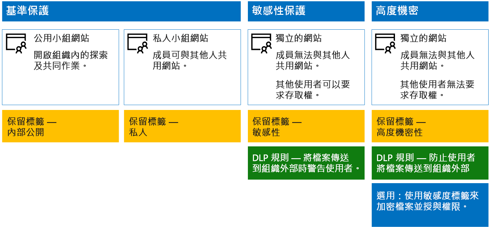

# 保護 SharePoint Online 網站與檔案

 **摘要：** 在 SharePoint Online 和 Office 365 中保護檔案的設定建議。
  
本文提供設定 SharePoint Online 小組網站和檔案保護的建議，以在安全性和順暢的共同作業間取得平衡。本文定義四種不同的設定，首先是組織內的公用網站，並搭配最開放的共用原則。每項額外設定均代表有意識的保護升級，但資源的存取和共同作業能力則會減少為只提供給相關使用者。使用建議作為起點，並且調整組態以符合您的組織的需求。 
  
本文的設定符合 Microsoft 針對資料、身分識別和裝置的下列三層保護建議：
  
- 基準保護
    
- 敏感性保護
    
- 高度機密保護
    
如需這些層級和每道層級的建議功能詳細資訊，請參閱下列資源。 
  
- [Office 365 的身分識別與裝置保護](https://docs.microsoft.com/office365/enterprise/microsoft-cloud-it-architecture-resources#BKMK_O365IDP)
    
- [Office 365 的檔案保護方案](https://docs.microsoft.com/office365/enterprise/microsoft-cloud-it-architecture-resources#BKMK_O365fileprotect)
    
## 功能概觀

建議的 SharePoint Online 小組網站依據各種不同 Microsoft 365 功能而定。 下圖顯示四種 SharePoint Online 小組網站的建議設定。

如圖例所示：
  
- 基準保護包括公用網站與私用網站這兩個 SharePoint Online 小組網站的選項。 公用網站可供組織中的任何人探索及存取。 私用網站則僅供網站成員探索及存取。 這兩個網站的設定都允許群組外部共用。 
    
- 設有敏感性與高度機密保護的網站為私用網站，其存取權僅限於特定群組的成員。
    
- [保留標籤](labels.md)提供一個方式來分類網站內的檔案。 系統會將每個 SharePoint Online 小組網站設為自動替文件庫中的檔案加上該網站的預設保留標籤。 此範例的標籤對應到這四種網站設定，分別是「內部公用」、「私用」、「敏感性」與「高度機密」。 使用者可以變更標籤，但這種設定可確保所有檔案都收到預設標籤。
    
- 系統會針對「敏感性」和「高度機密」的保留標籤設定[資料外洩防護](data-loss-prevention-policies.md) (DLP) 原則，以在使用者嘗試將這類檔案傳送到組織外部時，對他們發出警告或阻止此動作。
    
- 如果在您的案例中有需要，您可以使用[敏感度標籤](sensitivity-labels.md)以使用加密與權限來保護高度機密檔案。 針對 Azure 資訊保護客戶，您可以使用 Microsoft 365 合規性中心的 Azure 資訊保護標籤，而如果您選擇執行額外或進階組態，標籤就會與 Azure 入口網站同步處理。 Azure 資訊保護標籤與 Office 365 敏感度標籤完全彼此相容。 這表示，比方說，如果您有使用 Azure 資訊保護加上標籤的內容，則不需將內容重新分類或重新加上標籤。並非每位客戶都需要此層級的保護。 
    
## SharePoint Online 和商務用 OneDrive 的租用戶整體設定

SharePoint Online 和商務用 OneDrive 包含的租用戶整體設定會影響所有網站與使用者。 其中某些設定可以於網站層級進行調整，使其更加嚴格 (但不能更寬鬆)。 本節說明會影響安全性與共同作業的租用戶整體設定。 
  
### 共用

針對這個解決方案，我們建議下列的租用戶整體設定：
  
- 保留預設共用原則，以允許所有帳戶類型的共用作業，包括匿名共用。
    
- 您可視需要將匿名的連結設為過期。
    
- 將共用的預設連結類型變更為「內部」。 這有助於防止資料不慎洩漏到組織外部。
    
雖然允許外部共用似乎有悖常理，但相較於以電子郵件傳送檔案，此方法可以更充分地掌控檔案共用情況。 SharePoint Online 與 Outlook 一起運作，以提供安全的檔案共同作業。 
  
- 根據預設，Outlook 會共用檔案的連結，而非以電子郵件傳送檔案。 
    
- SharePoint Online 與商務用 OneDrive 可讓您輕易地與組織內外的參與者共用檔案連結
    
您也可以使用相關控制來協助控管外部共用。 例如，您可以：
  
- 停用匿名訪客的連結。
    
- 撤銷使用者的網站存取權。
    
- 查看誰具有特定網站或文件的存取權。
    
- 將匿名共用連結設為過期 (租用戶設定)。
    
- 限制可在組織外部共用的人員 (租用戶設定)。
    
### 搭配使用外部共用與資料外洩防護 (DLP)

如果您不允許外部共用，有業務需求的使用者就必須找到替代工具和方法。Microsoft 建議您結合外部共用與 DLP 原則來保護敏感性與高度機密檔案。
  
### 裝置存取設定

SharePoint Online 和商務用 OneDrive 的裝置存取設定可讓您決定要僅限瀏覽器存取 (無法下載檔案)，或是封鎖存取。 如需詳細資訊，請參閱[控制未受管理裝置的存取權](https://docs.microsoft.com/zh-TW/sharepoint/control-access-from-unmanaged-devices)。 

若要使用裝置存取設定搭配 Azure Active Directory 中建議的條件式存取原則，請參閱[保護 SharePoint 網站和檔案的原則建議](https://docs.microsoft.com/zh-TW/microsoft-365/enterprise/sharepoint-file-access-policies)。
  
### 商務用 OneDrive

請瀏覽這些設定，以決定是否要變更商務用 OneDrive 的網站預設設定。 目前，會複製 SharePoint Online 系統管理中心的共用和裝置存取設定，並套用到這兩個環境。
  
## SharePoint 小組網站設定

下表摘要說明本文稍早所述之每個小組網站的設定。 您可以使用這些設定作為建議的起點，並依據組織需求調整網站類型與設定。 並非每個組織都需要所有類型的網站。 只有少數的組織需要高度機密的保護。
  
||||||
|:-----|:-----|:-----|:-----|:-----|
||**基準保護 #1**   |**基準保護 #2**   |**敏感性保護**   |**高度機密**   |
|描述    |開啟組織內的探索及共同作業。    |私用網站和群組，其可在群組外部共用。    |隔離的網站，其存取層級會依據特定群組的成員資格而定義。 只允許網站的成員共用。 當使用者嘗試將檔案傳送到組織外部時，DLP 會對其發出警告。    |使用 Azure 資訊保護的隔離網站 + 檔案加密與權限。 DLP 可防止使用者將檔案傳送到組織外部。    |
|私用或公用的小組網站    |公用    |Private    |Private    |Private    |
|誰可以存取？    |組織中所有人，包括 B2B 使用者和訪客使用者。    |僅限網站的成員。 其他人可以要求存取權。    |僅限網站的成員。 其他人可以要求存取權。    |僅限成員。 其他人無法要求存取權。    |
|網站層級的共用控制    |允許與任何人共用。 預設設定。    |允許與任何人共用。 預設設定。    |成員無法共用網站的存取權。    非成員可以要求存取網站，但這些要求需要網站系統管理員處理。    |成員無法共用網站的存取權。    非成員無法要求存取網站或內容。    |
|網站層級的裝置存取控制    |無額外控制。    |無額外控制。    |防止使用者下載檔案到不相容或非加入網域的裝置。如此一來，所有其他裝置僅可進行瀏覽器存取。    |封鎖將檔案下載至不相容或非加入網域的裝置。    |
|保留標籤    |內部公用    |Private    |敏感性    |高度機密    |
|DLP 原則    |||當使用者將標記為「敏感性」的檔案傳送到組織外部時，會對其發出警告。    若要封鎖敏感性資料類型的外部共用，例如信用卡號碼或其他個人資料，您可以為這些資料類型 (包括您設定的自訂資料類型) 設定額外的 DLP 原則。    |封鎖使用者，使其無法將標示為高度機密的檔案傳送到組織外部。 允許使用者提供理由來覆寫這項預設，包括共用檔案的對象。    |
|敏感度標籤    ||||使用敏感度標籤可自動加密並授與檔案權限。 敏感度標籤會使用 Azure 資訊保護來加密檔案。 這項保護會與檔案一起移動，以免檔案外洩。    Office 365 無法讀取以 Azure 資訊保護加密的檔案。此外，DLP 原則僅會使用中繼資料 (包括標籤)，而不會使用這些檔案的內容 (例如檔案中的信用卡號碼)。    |
   
如需此解決方案中這四種不同類型 SharePoint Online 小組網站的部署步驟，請參閱[部署三層保護的 SharePoint Online 網站](deploy-sharepoint-online-sites-for-three-tiers-of-protection.md)。 
  
## Office 365 保留標籤

建議您在含有敏感性資料的環境中使用保留標籤。 設定並發佈保留標籤之後：
  
- 您可以將預設標籤套用至 SharePoint Online 小組網站的文件庫，以便讓該文件庫中的所有文件取得預設標籤。 
    
- 您可以自動將標籤套用到內容 (如果內容符合特定條件的話)。
    
- 您可以套用以保留標籤為基礎的 DLP 原則。
    
- 組織的人員可以手動套用標籤至 Outlook 網頁版、Outlook 2010 及更新版本、商務用 OneDrive、SharePoint Online 以及 Office 365 群組中的內容。使用者通常最清楚自己使用的內容類型，因此可以對其分類並套用適當的 DLP 原則。
    

  
如圖例所示，此解決方案包括建立下列保留標籤：
  
- 高度機密
    
- 敏感性
    
- Private
    
- 內部公用
    
這些標籤會對應到本文稍早的圖例與圖表中的建議網站。此解決方案建議您設定 DLP 原則，以協助避免標示為「敏感性」和「高度機密」的檔案外洩。
  
如需在此解決方案中設定保留標籤和 DLP 原則的步驟，請參閱[使用保留標籤與 DLP 來保護 SharePoint Online 檔案](protect-sharepoint-online-files-with-office-365-labels-and-dlp.md)。
  
## 敏感度標籤 

若您的安全性案例有需要，您可以使用敏感度標籤來套用可隨時追蹤檔案的保護。 Microsoft 365 合規性中心的敏感度標籤和 Azure 資訊保護標籤是相同的。 建議您為此解決方案使用限域的 Azure 資訊保護原則以及高度機密標籤的子標籤，來加密需要以最高安全性等級保護的檔案，和為其授予權限。 
  
請留意，若將 Azure 資訊保護套用至儲存於 Office 365 中的檔案，服務就無法處理這些檔案的內容。 共同撰寫、eDiscovery、搜尋、Delve 和其他共同作業功能無法運作。 此外，DLP 原則只可用於中繼資料 (包括保留標籤)，但不可用於這些檔案的內容 (例如檔案中的信用卡號碼)。

如需詳細資訊，請參閱[敏感度標籤概觀](sensitivity-labels.md)。

    
### 新增外部使用者的權限

您可以使用兩種方式，將 Azure 資訊保護所保護的檔案存取權授與外部使用者。在這兩種情況下，外部使用者皆必須擁有 Azure AD 帳戶。如果外部使用者不屬於使用 Azure AD 的組織成員，可以使用 [https://aka.ms/aip-signup](https://aka.ms/aip-signup) 這個註冊頁面，以個人身分取得 Azure AD 帳戶。
  
- 將外部使用者新增至用來設定保護標籤的 Azure AD 群組
    
     您必須先將帳戶新增為目錄中的 B2B 使用者。當 [Azure 版權管理進行群組成員資格的快取](https://docs.microsoft.com/information-protection/plan-design/prepare#group-membership-caching-by-azure-rights-management)時，可能需要花費數小時的時間。使用此方法時，會授與所有受標籤保護的現有檔案權限 (包括將使用者新增至 Azure AD 群組之前即受保護的檔案)。
    
- 將外部使用者直接新增至標籤保護。
    
     您可以從組織 (例如 Fabrikam.com)、Azure AD 群組 (例如組織內的財務部門) 或個別使用者，新增所有使用者。例如，您可以將外部的監理人員小組新增至標籤保護。使用此方法時，僅會授與在外部實體新增至保護之後受標籤保護的檔案權限。
    
### 部署並使用 Azure 資訊保護

如需在此解決方案中設定 Azure 資訊保護的步驟，請參閱[使用 Azure 資訊保護來保護 SharePoint Online 檔案](protect-sharepoint-online-files-with-azure-information-protection.md)。
  

## 下一步

使用[開發/測試環境中保護 SharePoint Online 網站的安全](secure-sharepoint-online-sites-in-a-dev-test-environment.md)將其構建為概念驗證。

## 另請參閱

[適用於政治活動、非營利組織和其他彈性組織的 Microsoft 安全性指南](microsoft-security-guidance-for-political-campaigns-nonprofits-and-other-agile-o.md)
  
[雲端採用和混合式解決方案](https://docs.microsoft.com/office365/enterprise/cloud-adoption-and-hybrid-solutions)
  
