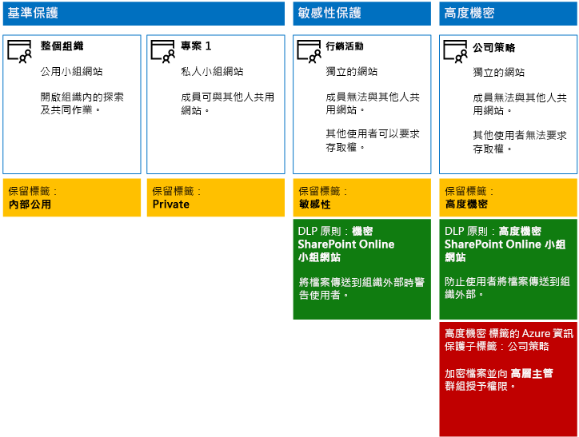

# <a name="secure-sharepoint-online-sites-in-a-devtest-environment"></a><span data-ttu-id="8c5ab-103">在開發/測試環境中保護 SharePoint Online 網站</span><span class="sxs-lookup"><span data-stu-id="8c5ab-103">Secure SharePoint Online sites in a dev/test environment</span></span>

 <span data-ttu-id="8c5ab-104">**摘要：** 在開發/測試環境中建立公用、私用、敏感性及高度機密的 SharePoint Online 小組網站。</span><span class="sxs-lookup"><span data-stu-id="8c5ab-104">**Summary:** Create public, private, sensitive, and highly confidential SharePoint Online team sites in a dev/test environment.</span></span>
  
<span data-ttu-id="8c5ab-105">本文提供建立開發/測試環境的逐步指示，以在環境中包含[保護 SharePoint Online 網站與檔案解決方案](secure-sharepoint-online-sites-and-files.md)所提之四種不同類型的 SharePoint Online 小組網站。</span><span class="sxs-lookup"><span data-stu-id="8c5ab-105">This article provides step-by-step instructions to create a dev/test environment that includes the four different types of SharePoint Online team sites for the [Secure SharePoint Online sites and files](secure-sharepoint-online-sites-and-files.md) solution.</span></span>
  

  
<span data-ttu-id="8c5ab-107">您可以先使用此開發/測試環境，來試驗資訊保護行為，並針對特定需求微調設定，然後再將 SharePoint Online 小組網站部署在生產環境中。</span><span class="sxs-lookup"><span data-stu-id="8c5ab-107">Use this dev/test environment to experiment with the information protection behaviors and fine-tune settings for your specific needs before deploying SharePoint Online team sites in production.</span></span>
  
## <a name="phase-1-create-your-devtest-environment"></a><span data-ttu-id="8c5ab-108">階段 1：建立開發/測試環境</span><span class="sxs-lookup"><span data-stu-id="8c5ab-108">Phase 1: Create your dev/test environment</span></span>

<span data-ttu-id="8c5ab-109">在這個階段中，您會為虛構組織取得 Office 365 與 Enterprise Mobility + Security (EMS) 試用訂閱。</span><span class="sxs-lookup"><span data-stu-id="8c5ab-109">In this phase, you obtain trial subscriptions for Office 365 and Enterprise Mobility + Security for a fictional organization.</span></span>
  
<span data-ttu-id="8c5ab-110">首先，請遵循 [Office 365 開發/測試環境](https://docs.microsoft.com/office365/enterprise/office-365-dev-test-environment)的**階段 2** 中的指示進行。</span><span class="sxs-lookup"><span data-stu-id="8c5ab-110">First, follow the instructions in **Phase 2** of the [Office 365 dev/test environment](https://docs.microsoft.com/office365/enterprise/office-365-dev-test-environment).</span></span>
  
<span data-ttu-id="8c5ab-111">接著，註冊 EMS 試用訂閱，並將它新增至與 Office 365 試用訂閱相同的組織。</span><span class="sxs-lookup"><span data-stu-id="8c5ab-111">Next, sign up for the EMS trial subscription and add it to the same organization as your Office 365 trial subscription.</span></span>
  
1. <span data-ttu-id="8c5ab-112">如果需要，請使用試用訂閱的全域管理員帳戶認證登入 [Microsoft 365 系統管理中心](https://admin.microsoft.com)。</span><span class="sxs-lookup"><span data-stu-id="8c5ab-112">If needed, sign in to the admin center with the credentials of the global administrator account of your trial subscription.</span></span>
    
2. <span data-ttu-id="8c5ab-113">按一下左導覽中的 [計費] > [購買服務]\*\*\*\*。</span><span class="sxs-lookup"><span data-stu-id="8c5ab-113">On the Office admin center tab, in the left navigation, click **Billing > Purchase services**.</span></span>
    
3. <span data-ttu-id="8c5ab-p101">在 [購買服務]\*\*\*\* 頁面上，尋找 **Enterprise Mobility + Security E5** 項目。將滑鼠指標停留在上面，並且按一下 [開始免費試用]\*\*\*\*。</span><span class="sxs-lookup"><span data-stu-id="8c5ab-p101">On the **Purchase services** page, find the **Enterprise Mobility + Security E5** item. Hover your mouse pointer over it and click **Start free trial**.</span></span>
    
4. <span data-ttu-id="8c5ab-116">在 [確認訂單]\*\*\*\* 頁面上，按一下 [立即試用]\*\*\*\*。</span><span class="sxs-lookup"><span data-stu-id="8c5ab-116">On the **Confirm your order** page, click **Try now**.</span></span>
    
5. <span data-ttu-id="8c5ab-117">在 [訂單收據]\*\*\*\* 頁面上，按一下 [繼續]\*\*\*\*。</span><span class="sxs-lookup"><span data-stu-id="8c5ab-117">On the **Order receipt** page, click **Continue**.</span></span>
    
<span data-ttu-id="8c5ab-118">接下來，啟用全域管理員帳戶的 Enterprise Mobility + Security E5 授權。</span><span class="sxs-lookup"><span data-stu-id="8c5ab-118">Next, enable the Enterprise Mobility + Security E5 license for your global administrator account.</span></span>
  
1. <span data-ttu-id="8c5ab-119">在瀏覽器的 [Microsoft 365 系統管理中心]\*\*\*\* 索引標籤上，按一下左導覽中的 [使用者] > [作用中使用者]\*\*\*\*。</span><span class="sxs-lookup"><span data-stu-id="8c5ab-119">On the **Microsoft 365 admin center** tab in your browser, in the left navigation, click **Users > Active users**.</span></span>
    
2. <span data-ttu-id="8c5ab-120">按一下您的全域系統管理員帳戶，然後按一下 [產品授權]\*\*\*\* 的 [編輯]\*\*\*\*。</span><span class="sxs-lookup"><span data-stu-id="8c5ab-120">Click your global administrator account, and then click **Edit** for **Product licenses**.</span></span>
    
3. <span data-ttu-id="8c5ab-121">在 [產品授權]\*\*\*\* 窗格中，將 [**Enterprise Mobility + Security E5**] 的產品授權設為 [開啟]\*\*\*\*，按一下 [儲存]\*\*\*\*，然後按兩次 [關閉]\*\*\*\*。</span><span class="sxs-lookup"><span data-stu-id="8c5ab-121">On the **Product licenses** pane, turn the product license for **Enterprise Mobility + Security E5** to **On**, click **Save,** and then click **Close** twice.</span></span>
    
## <a name="phase-2-create-and-configure-your-azure-active-directory-ad-groups-and-users"></a><span data-ttu-id="8c5ab-122">階段 2：建立和設定 Azure Active Directory (AD) 群組和使用者</span><span class="sxs-lookup"><span data-stu-id="8c5ab-122">Phase 2: Create and configure your Azure Active Directory (AD) groups and users</span></span>

<span data-ttu-id="8c5ab-123">在這個階段中，您會為虛構組織建立和設定 Azure AD 群組和使用者。</span><span class="sxs-lookup"><span data-stu-id="8c5ab-123">In this phase, you create and configure the Azure AD groups and users for your fictional organization.</span></span>
  
<span data-ttu-id="8c5ab-124">首先，利用 Azure 入口網站建立一組典型組織的群組。</span><span class="sxs-lookup"><span data-stu-id="8c5ab-124">First, create a set of groups for a typical organization with the Azure portal.</span></span>
  
1. <span data-ttu-id="8c5ab-p102">在瀏覽器中另外建立索引標籤，然後移至 Azure 入口網站 (網址為 [https://portal.azure.com](https://portal.azure.com))。若有需要，請使用 Office 365 E5 試用訂閱的全域管理員帳戶認證登入。</span><span class="sxs-lookup"><span data-stu-id="8c5ab-p102">Create a separate tab in your browser, and then go to the Azure portal at [https://portal.azure.com](https://portal.azure.com). If needed, sign in with the credentials of the global administrator account for your Office 365 E5 trial subscription.</span></span>
    
2. <span data-ttu-id="8c5ab-127">在 Azure 入口網站中，按一下 [Azure Active Directory] > [群組]\*\*\*\*。</span><span class="sxs-lookup"><span data-stu-id="8c5ab-127">In the Azure portal, click **Azure Active Directory > Groups**.</span></span>
    
3. <span data-ttu-id="8c5ab-128">在 [群組 - 所有群組]\*\*\*\* 刀鋒視窗中，按一下 [+ 新增群組]\*\*\*\*。</span><span class="sxs-lookup"><span data-stu-id="8c5ab-128">On the **Groups - All groups** blade, click **+ New group**.</span></span>
    
4. <span data-ttu-id="8c5ab-129">在 [群組]\*\*\*\* 刀鋒視窗中：</span><span class="sxs-lookup"><span data-stu-id="8c5ab-129">On the **Group** blade:</span></span>
    
  - <span data-ttu-id="8c5ab-130">選取 [群組類型]\*\*\*\* 中的 [Office 365]\*\*\*\*。</span><span class="sxs-lookup"><span data-stu-id="8c5ab-130">Select **Office 365** in **Group type**.</span></span>
    
  - <span data-ttu-id="8c5ab-131">在 [名稱]\*\*\*\* 中輸入**高階主管**。</span><span class="sxs-lookup"><span data-stu-id="8c5ab-131">Type **C-Suite** in **Name**.</span></span>
    
  - <span data-ttu-id="8c5ab-132">在 [成員資格類型]\*\*\*\* 中選取 [已指派]\*\*\*\*。</span><span class="sxs-lookup"><span data-stu-id="8c5ab-132">Select **Assigned** in **Membership type**.</span></span>
      
5. <span data-ttu-id="8c5ab-133">按一下 [建立]\*\*\*\*，然後關閉 [群組]\*\*\*\* 刀鋒視窗。</span><span class="sxs-lookup"><span data-stu-id="8c5ab-133">Click **Create**, and then close the **Group** blade.</span></span>
    
6. <span data-ttu-id="8c5ab-134">重複步驟 3-5，逐一設定下列群組名稱：</span><span class="sxs-lookup"><span data-stu-id="8c5ab-134">Repeat steps 3-5 for the following group names:</span></span>
    
  - <span data-ttu-id="8c5ab-135">IT 人員</span><span class="sxs-lookup"><span data-stu-id="8c5ab-135">IT staff</span></span>
    
  - <span data-ttu-id="8c5ab-136">研究人員</span><span class="sxs-lookup"><span data-stu-id="8c5ab-136">Research staff</span></span>
    
  - <span data-ttu-id="8c5ab-137">一般人員</span><span class="sxs-lookup"><span data-stu-id="8c5ab-137">Regular staff</span></span>
    
  - <span data-ttu-id="8c5ab-138">行銷人員</span><span class="sxs-lookup"><span data-stu-id="8c5ab-138">Marketing staff</span></span>
    
  - <span data-ttu-id="8c5ab-139">銷售人員</span><span class="sxs-lookup"><span data-stu-id="8c5ab-139">Sales staff</span></span>
    
7. <span data-ttu-id="8c5ab-140">瀏覽器中的 [Azure 入口網站] 索引標籤請保持開啟。</span><span class="sxs-lookup"><span data-stu-id="8c5ab-140">Keep the Azure portal tab in your browser open.</span></span>
    
<span data-ttu-id="8c5ab-141">接下來，設定自動授權，讓群組成員自動獲指派 Office 365 和 EMS 訂閱的授權。</span><span class="sxs-lookup"><span data-stu-id="8c5ab-141">Next, you configure automatic licensing so that members of your groups are automatically assigned licenses for your Office 365 and EMS subscriptions.</span></span>
  
1. <span data-ttu-id="8c5ab-142">在 Azure 入口網站中，按一下 [Azure Active Directory] > [授權] > [所有產品]\*\*\*\*。</span><span class="sxs-lookup"><span data-stu-id="8c5ab-142">In the Azure portal, click **Azure Active Directory > Licenses > All products**.</span></span>
    
2. <span data-ttu-id="8c5ab-143">在清單中，選取 [Enterprise Mobility + Security E5]\*\*\*\* 和 [Office 365 企業版 E5]\*\*\*\*，然後按一下 [指派]\*\*\*\*。</span><span class="sxs-lookup"><span data-stu-id="8c5ab-143">In the list, select **Enterprise Mobility + Security E5** and **Office 365 Enterprise E5**, and then click **Assign**.</span></span>
    
3. <span data-ttu-id="8c5ab-144">在 [指派授權]\*\*\*\* 刀鋒視窗中，按一下 [使用者和群組]\*\*\*\*。</span><span class="sxs-lookup"><span data-stu-id="8c5ab-144">In the **Assign license** blade, click **Users and groups**.</span></span>
    
4. <span data-ttu-id="8c5ab-145">在群組清單中，選取下列項目：</span><span class="sxs-lookup"><span data-stu-id="8c5ab-145">In the list of groups, select the following:</span></span>
    
  - <span data-ttu-id="8c5ab-146">高層主管</span><span class="sxs-lookup"><span data-stu-id="8c5ab-146">C-Suite</span></span>
    
  - <span data-ttu-id="8c5ab-147">IT 人員</span><span class="sxs-lookup"><span data-stu-id="8c5ab-147">IT staff</span></span>
    
  - <span data-ttu-id="8c5ab-148">研究人員</span><span class="sxs-lookup"><span data-stu-id="8c5ab-148">Research staff</span></span>
    
  - <span data-ttu-id="8c5ab-149">一般人員</span><span class="sxs-lookup"><span data-stu-id="8c5ab-149">Regular staff</span></span>
    
  - <span data-ttu-id="8c5ab-150">行銷人員</span><span class="sxs-lookup"><span data-stu-id="8c5ab-150">Marketing staff</span></span>
    
  - <span data-ttu-id="8c5ab-151">銷售人員</span><span class="sxs-lookup"><span data-stu-id="8c5ab-151">Sales staff</span></span>
    
5. <span data-ttu-id="8c5ab-152">按一下 [選取]\*\*\*\*，然後按一下 [指派]\*\*\*\*。</span><span class="sxs-lookup"><span data-stu-id="8c5ab-152">Click **Select**, and then click **Assign**.</span></span>
    
6. <span data-ttu-id="8c5ab-153">關閉瀏覽器的 Azure 入口網站索引標籤。</span><span class="sxs-lookup"><span data-stu-id="8c5ab-153">Close the Azure portal tab in your browser.</span></span>
    
<span data-ttu-id="8c5ab-154">接著，[與 Azure Active Directory PowerShell for Graph 模組連線](https://docs.microsoft.com/office365/enterprise/powershell/connect-to-office-365-powershell#connect-with-the-azure-active-directory-powershell-for-graph-module)。</span><span class="sxs-lookup"><span data-stu-id="8c5ab-154">Next, you [Connect with the Azure Active Directory V2 PowerShell module](https://docs.microsoft.com/office365/enterprise/powershell/connect-to-office-365-powershell#connect-with-the-azure-active-directory-powershell-for-graph-module).</span></span>
  
<span data-ttu-id="8c5ab-155">填寫組織名稱、位置和一般密碼，然後從 PowerShell 命令提示字元或整合指令碼環境 (ISE) 執行下列命令，以建立使用者帳戶，並將帳戶新增至其群組：</span><span class="sxs-lookup"><span data-stu-id="8c5ab-155">Fill in your organization name, your location, and a common password, and then run these commands from the PowerShell command prompt or Integrated Script Environment (ISE) to create user accounts and add them to their groups:</span></span>
  
```
$orgName="<organization name, such as contoso for the contoso.onmicrosoft.com trial subscription domain name>"
$location="<the ISO ALPHA2 country code, such as US for the United States>"
$commonPassword="<common password for all the new accounts>"

$PasswordProfile=New-Object -TypeName Microsoft.Open.AzureAD.Model.PasswordProfile
$PasswordProfile.Password=$commonPassword

$groupName="C-Suite"
$userNames=@("CEO","CFO","CIO") 
$groupID=(Get-AzureADGroup | Where { $_.DisplayName -eq $groupName }).ObjectID
ForEach ($element in $userNames){ 
New-AzureADUser -DisplayName $element -PasswordProfile $PasswordProfile -UserPrincipalName ($element + "@" + $orgName + ".onmicrosoft.com") -AccountEnabled $true -MailNickName $element -UsageLocation $location 
Add-AzureADGroupMember -RefObjectId (Get-AzureADUser | Where { $_.DisplayName -eq $element }).ObjectID -ObjectId $groupID
}
$groupName="IT staff"
$userNames=@("ITAdmin1","ITAdmin2") 
$groupID=(Get-AzureADGroup | Where { $_.DisplayName -eq $groupName }).ObjectID
ForEach ($element in $userNames){ 
New-AzureADUser -DisplayName $element -PasswordProfile $PasswordProfile -UserPrincipalName ($element + "@" + $orgName + ".onmicrosoft.com") -AccountEnabled $true -MailNickName $element -UsageLocation $location 
Add-AzureADGroupMember -RefObjectId (Get-AzureADUser | Where { $_.DisplayName -eq $element }).ObjectID -ObjectId $groupID
}
$groupName="Research staff"
$userNames=@("Researcher1") 
$groupID=(Get-AzureADGroup | Where { $_.DisplayName -eq $groupName }).ObjectID
ForEach ($element in $userNames){ 
New-AzureADUser -DisplayName $element -PasswordProfile $PasswordProfile -UserPrincipalName ($element + "@" + $orgName + ".onmicrosoft.com") -AccountEnabled $true -MailNickName $element -UsageLocation $location 
Add-AzureADGroupMember -RefObjectId (Get-AzureADUser | Where { $_.DisplayName -eq $element }).ObjectID -ObjectId $groupID
}
$groupName="Regular staff"
$userNames=@("Regular1", "Regular2") 
$groupID=(Get-AzureADGroup | Where { $_.DisplayName -eq $groupName }).ObjectID
ForEach ($element in $userNames){ 
New-AzureADUser -DisplayName $element -PasswordProfile $PasswordProfile -UserPrincipalName ($element + "@" + $orgName + ".onmicrosoft.com") -AccountEnabled $true -MailNickName $element -UsageLocation $location 
Add-AzureADGroupMember -RefObjectId (Get-AzureADUser | Where { $_.DisplayName -eq $element }).ObjectID -ObjectId $groupID
}
$groupName="Marketing staff"
$userNames=@("Marketing1", "Marketing2") 
$groupID=(Get-AzureADGroup | Where { $_.DisplayName -eq $groupName }).ObjectID
ForEach ($element in $userNames){ 
New-AzureADUser -DisplayName $element -PasswordProfile $PasswordProfile -UserPrincipalName ($element + "@" + $orgName + ".onmicrosoft.com") -AccountEnabled $true -MailNickName $element -UsageLocation $location 
Add-AzureADGroupMember -RefObjectId (Get-AzureADUser | Where { $_.DisplayName -eq $element }).ObjectID -ObjectId $groupID
}
$groupName="Sales staff"
$userNames=@("SalesPerson1") 
$groupID=(Get-AzureADGroup | Where { $_.DisplayName -eq $groupName }).ObjectID
ForEach ($element in $userNames){ 
New-AzureADUser -DisplayName $element -PasswordProfile $PasswordProfile -UserPrincipalName ($element + "@" + $orgName + ".onmicrosoft.com") -AccountEnabled $true -MailNickName $element -UsageLocation $location 
Add-AzureADGroupMember -RefObjectId (Get-AzureADUser | Where { $_.DisplayName -eq $element }).ObjectID -ObjectId $groupID
}
```

> [!NOTE]
> <span data-ttu-id="8c5ab-156">這裡會使用常見密碼，以便在開發/測試環境中能自動化並輕鬆進行設定。</span><span class="sxs-lookup"><span data-stu-id="8c5ab-156">The use of a common password here is for automation and ease of configuration for a dev/test environment.</span></span> <span data-ttu-id="8c5ab-157">當然，對於生產訂閱，這是非常不鼓勵的。</span><span class="sxs-lookup"><span data-stu-id="8c5ab-157">Obviously, this is highly discouraged for production subscriptions.</span></span> 
  
<span data-ttu-id="8c5ab-158">使用下列步驟來確認群組授權運作正常。</span><span class="sxs-lookup"><span data-stu-id="8c5ab-158">Use these steps to verify that group-based licensing is working correctly.</span></span>
  
1. <span data-ttu-id="8c5ab-159">從瀏覽器的 [Microsoft Office 的首頁]\*\*\*\* 索引標籤中，按一下 [管理]\*\*\*\* 磚。</span><span class="sxs-lookup"><span data-stu-id="8c5ab-159">From the **Microsoft Office Home** tab of your browser, click the **Admin** tile.</span></span>
    
2. <span data-ttu-id="8c5ab-160">從瀏覽器的新 [Office 系統管理中心]\*\*\*\* 索引標籤中，按一下 [使用者]\*\*\*\*。</span><span class="sxs-lookup"><span data-stu-id="8c5ab-160">From the new **Office Admin center** tab of your browser, click **Users**.</span></span>
    
3. <span data-ttu-id="8c5ab-161">在使用者清單中，按一下 [CEO]\*\*\*\*。</span><span class="sxs-lookup"><span data-stu-id="8c5ab-161">In the list of users, click **CEO**.</span></span>
    
4. <span data-ttu-id="8c5ab-162">在列出 **CEO** 使用者帳戶內容的窗格中，確認已獲指派 [Enterprise Mobility + Security E5]\*\*\*\* 和 [Office 365 Enterprise E5]\*\*\*\* 授權 (在 [Product licenses]\(產品授權)\*\*\*\* 中)。</span><span class="sxs-lookup"><span data-stu-id="8c5ab-162">In the pane that lists the properties of the **CEO** user account, verify that it has been assigned the **Enterprise Mobility + Security E5** and **Office 365 Enterprise E5** licenses (in **Product licenses**).</span></span>
    
## <a name="phase-3-create-office-365-retention-labels"></a><span data-ttu-id="8c5ab-163">階段 3：Office 365 保留標籤</span><span class="sxs-lookup"><span data-stu-id="8c5ab-163">Phase 3: Create Office 365 labels</span></span>

<span data-ttu-id="8c5ab-164">在這個階段中，您會為 SharePoint Online 小組網站的文件資料夾，建立不同安全性層級的保留標籤。</span><span class="sxs-lookup"><span data-stu-id="8c5ab-164">In this phase, you create the labels for the different levels of security for SharePoint Online team site documents folders.</span></span>


1. <span data-ttu-id="8c5ab-165">請使用您的全域系統管理員帳戶登入 [Microsoft 365 合規性入口網站](https://compliance.microsoft.com)。</span><span class="sxs-lookup"><span data-stu-id="8c5ab-165">Sign in to the Microsoft 365 admin center (  ) with your global administrator account.</span></span>
    
2. <span data-ttu-id="8c5ab-166">從瀏覽器的 [首頁 - Microsoft 365 合規性]\*\*\*\* 索引標籤，按一下 [分類] > [標籤]\*\*\*\*。</span><span class="sxs-lookup"><span data-stu-id="8c5ab-166">From the **Home - Microsoft 365 Security** tab of your browser, click **Classifications > Labels**.</span></span>
    
3. <span data-ttu-id="8c5ab-167">按一下 [保留標籤] > [建立標籤]\*\*\*\*。</span><span class="sxs-lookup"><span data-stu-id="8c5ab-167">Click **Retention labels > Create a label**.</span></span>
    
4. <span data-ttu-id="8c5ab-168">在 [命名您的標籤]\*\*\*\* 窗格中，在 [命名您的標籤]\*\*\*\* 中輸入 **內部公用**，然後按一下 [下一步]\*\*\*\*。</span><span class="sxs-lookup"><span data-stu-id="8c5ab-168">On the **Name your label** pane, type **Internal Public**, and then click **Next**.</span></span>

5. <span data-ttu-id="8c5ab-169">在 [檔案計畫描述元]\*\*\*\* 窗格中，按一下 [下一步]\*\*\*\*。</span><span class="sxs-lookup"><span data-stu-id="8c5ab-169">On the **File plan descriptors** pane, fill in as needed, and then click **Next**.</span></span>
    
6. <span data-ttu-id="8c5ab-170">在 [標籤設定]\*\*\*\* 窗格中，視需要將 [保留]\*\*\*\* 設定為 [開啟]\*\*\*\*，然後按一下 [下一步]\*\*\*\*。</span><span class="sxs-lookup"><span data-stu-id="8c5ab-170">On the Label settings pane, if needed, set Retention to On and configure retention settings.</span></span>
    
7. <span data-ttu-id="8c5ab-171">在 [檢閱您的設定]\*\*\*\* 窗格中，按一下 [建立標籤]\*\*\*\*。</span><span class="sxs-lookup"><span data-stu-id="8c5ab-171">On the **Review your settings** pane, click **Create the label**.</span></span>
    
8. <span data-ttu-id="8c5ab-172">對於其他標籤，按一下 [建立標籤]\*\*\*\*，然後重複步驟 3-7。</span><span class="sxs-lookup"><span data-stu-id="8c5ab-172">For your additional labels, click **Create a label**, and then repeat steps 4-7..</span></span>

9. <span data-ttu-id="8c5ab-173">針對以下名稱的標籤，重複步驟 3-8：</span><span class="sxs-lookup"><span data-stu-id="8c5ab-173">Repeat steps 3-8 for additional labels with these names:</span></span>
    
  - <span data-ttu-id="8c5ab-174">Private</span><span class="sxs-lookup"><span data-stu-id="8c5ab-174">Private</span></span>
    
  - <span data-ttu-id="8c5ab-175">敏感性</span><span class="sxs-lookup"><span data-stu-id="8c5ab-175">Sensitive</span></span>
    
  - <span data-ttu-id="8c5ab-176">高度機密</span><span class="sxs-lookup"><span data-stu-id="8c5ab-176">Highly Confidential</span></span>
  
10. <span data-ttu-id="8c5ab-177">從 [首頁] > [標籤]\*\*\*\* 窗格中，按一下 [Publish labels]\(發佈標籤)\*\*\*\*。</span><span class="sxs-lookup"><span data-stu-id="8c5ab-177">From the **Home > Labels** pane, click **Publish labels**.</span></span>
    
11. <span data-ttu-id="8c5ab-178">在 [選擇要發佈的標籤]\*\*\*\* 窗格中，按一下 [選擇要發佈的標籤]\*\*\*\*。</span><span class="sxs-lookup"><span data-stu-id="8c5ab-178">On the **Choose labels to publish** pane, click **Choose labels to publish**.</span></span>
    
12. <span data-ttu-id="8c5ab-179">在 [Choose labels]\(選擇標籤)\*\*\*\* 窗格中，按一下 [新增]\*\*\*\* 並選取所有四個標籤。</span><span class="sxs-lookup"><span data-stu-id="8c5ab-179">On the **Choose labels** pane, click **Add** and select all four labels.</span></span>
    
13. <span data-ttu-id="8c5ab-180">按一下 [完成]\*\*\*\*。</span><span class="sxs-lookup"><span data-stu-id="8c5ab-180">Click **Done**.</span></span>
    
14. <span data-ttu-id="8c5ab-181">在 [選擇要發佈的標籤]\*\*\*\* 窗格上，按一下 [下一步]\*\*\*\*。</span><span class="sxs-lookup"><span data-stu-id="8c5ab-181">On the **Choose labels to publish** pane, click **Next**.</span></span>
    
15. <span data-ttu-id="8c5ab-182">在 [選擇位置]\*\*\*\* 窗格中，按一下 [下一步]\*\*\*\*。</span><span class="sxs-lookup"><span data-stu-id="8c5ab-182">On the **Choose locations** pane, click **Next**.</span></span>
    
16. <span data-ttu-id="8c5ab-183">在 [命名您的原則]\*\*\*\* 窗格上，於 [名稱]\*\*\*\* 中輸入 **範例組織**，然後按一下 [下一步]\*\*\*\*。</span><span class="sxs-lookup"><span data-stu-id="8c5ab-183">On the **Name your policy** pane, type **Example organization** in **Name**, and then click **Next**.</span></span>
    
17. <span data-ttu-id="8c5ab-184">在 [檢閱您的設定]\*\*\*\* 窗格中，按一下 [發佈標籤]\*\*\*\*，然後按一下 [關閉]\*\*\*\*。</span><span class="sxs-lookup"><span data-stu-id="8c5ab-184">On the **Review your settings** pane, click **Publish labels**, and then click **Close**.</span></span>
    
## <a name="phase-4-create-your-sharepoint-online-team-sites"></a><span data-ttu-id="8c5ab-185">階段 4：建立 SharePoint Online 小組網站</span><span class="sxs-lookup"><span data-stu-id="8c5ab-185">Phase 4: Create your SharePoint Online team sites</span></span>

<span data-ttu-id="8c5ab-186">在這個階段中，您會為範例組織建立和設定四種類型的 SharePoint Online 小組網站。</span><span class="sxs-lookup"><span data-stu-id="8c5ab-186">In this phase, you create and configure the four types of SharePoint Online team sites for your example organization.</span></span>
  
### <a name="organization-wide-team-site"></a><span data-ttu-id="8c5ab-187">整個組織的小組網站</span><span class="sxs-lookup"><span data-stu-id="8c5ab-187">Organization wide team site</span></span>

<span data-ttu-id="8c5ab-188">若要建立公用的基準 SharePoint Online 小組網站，請執行下列作業：</span><span class="sxs-lookup"><span data-stu-id="8c5ab-188">To create a baseline public SharePoint Online team site, do the following:</span></span>
  
1. <span data-ttu-id="8c5ab-189">如果需要，請使用試用訂閱的全域管理員帳戶認證登入 [Office 365 入口網站](https://portal.office.com)。</span><span class="sxs-lookup"><span data-stu-id="8c5ab-189">If needed, sign in to the [Office 365 portal](https://portal.office.com) with the credentials of the global administrator account of your trial subscription.</span></span>
    
2. <span data-ttu-id="8c5ab-190">在磚清單中，按一下 [SharePoint]\*\*\*\*。</span><span class="sxs-lookup"><span data-stu-id="8c5ab-190">In the list of tiles, click **SharePoint**.</span></span>
    
3. <span data-ttu-id="8c5ab-191">在瀏覽器的新 [SharePoint]\*\*\*\* 索引標籤上，按一下 [+ 建立網站]\*\*\*\*。</span><span class="sxs-lookup"><span data-stu-id="8c5ab-191">On the new **SharePoint** tab in your browser, click **+ Create site**.</span></span>
    
4. <span data-ttu-id="8c5ab-192">在 [建立網站]\*\*\*\* 頁面上，按一下 [小組網站]\*\*\*\*。</span><span class="sxs-lookup"><span data-stu-id="8c5ab-192">On the **Create a site** page, click **Team site**.</span></span>
    
5. <span data-ttu-id="8c5ab-193">在 [網站名稱]\*\*\*\* 中，鍵入「整個組織」\*\*\*\*。</span><span class="sxs-lookup"><span data-stu-id="8c5ab-193">In **Site name**, type **Organization wide**.</span></span> 
    
6. <span data-ttu-id="8c5ab-194">在 [小組網站描述]\*\*\*\* 中輸入**整個組織的 SharePoint 網站**。</span><span class="sxs-lookup"><span data-stu-id="8c5ab-194">In **Team site description**, type **SharePoint site for the entire organization**.</span></span>
    
7. <span data-ttu-id="8c5ab-195">在 [隱私權設定]\*\*\*\* 中，選取 [公用 - 組織中的任何人都可以存取此網站]\*\*\*\*，然後按一下 [下一步]\*\*\*\*。</span><span class="sxs-lookup"><span data-stu-id="8c5ab-195">In **Privacy settings**, select **Public - anyone in the organization can access this site**, and then click **Next**.</span></span>
    
8. <span data-ttu-id="8c5ab-196">在 [您想要新增誰?]\*\*\*\* 窗格上，按一下 [完成]\*\*\*\*。</span><span class="sxs-lookup"><span data-stu-id="8c5ab-196">On the **Who do you want to add?** pane, click **Finish**.</span></span>
    
<span data-ttu-id="8c5ab-197">接下來，針對 [內部公用] 標籤設定整個組織的小組網站的文件資料夾。</span><span class="sxs-lookup"><span data-stu-id="8c5ab-197">Next, configure the documents folder of the Organization wide team site for the Internal Public label.</span></span>
  
1. <span data-ttu-id="8c5ab-198">在瀏覽器的 [整個組織 - 首頁]\*\*\*\* 索引標籤中，按一下 [文件]\*\*\*\*。</span><span class="sxs-lookup"><span data-stu-id="8c5ab-198">In the **Organization wide-Home** tab of your browser, click **Documents**.</span></span>
    
2. <span data-ttu-id="8c5ab-199">按一下設定圖示，然後按一下 [文件庫設定]\*\*\*\*。</span><span class="sxs-lookup"><span data-stu-id="8c5ab-199">Click the settings icon, and then click **Library settings**.</span></span>
    
3. <span data-ttu-id="8c5ab-200">在 [權限與管理]\*\*\*\* 下，按一下 [將標籤套用至此文件庫中的項目]\*\*\*\*。</span><span class="sxs-lookup"><span data-stu-id="8c5ab-200">Under **Permissions and Management**, click **Apply label to items in this library**.</span></span>
    
4. <span data-ttu-id="8c5ab-201">在 [設定 - 套用標籤]\*\*\*\* 中，選取 [內部公用]\*\*\*\*，然後按一下 [儲存]\*\*\*\*。</span><span class="sxs-lookup"><span data-stu-id="8c5ab-201">In **Settings-Apply Label**, select **Internal Public**, and then click **Save**.</span></span>
    
### <a name="project-1-team-site"></a><span data-ttu-id="8c5ab-202">專案 1 小組網站</span><span class="sxs-lookup"><span data-stu-id="8c5ab-202">Project 1 team site</span></span>

<span data-ttu-id="8c5ab-203">若要為組織內部的專案建立私用的基準 SharePoint Online 小組網站，請執行下列作業：</span><span class="sxs-lookup"><span data-stu-id="8c5ab-203">To create a baseline private SharePoint Online team site for a project within the organization, do the following:</span></span>
  
1. <span data-ttu-id="8c5ab-204">如果需要，請使用試用訂閱的全域管理員帳戶認證登入 [Office 365 入口網站](https://portal.office.com)。</span><span class="sxs-lookup"><span data-stu-id="8c5ab-204">If needed, sign in to the [Office 365 portal](https://portal.office.com) with the credentials of the global administrator account of your trial subscription.</span></span>
    
2. <span data-ttu-id="8c5ab-205">在磚清單中，按一下 [SharePoint]\*\*\*\*。</span><span class="sxs-lookup"><span data-stu-id="8c5ab-205">In the list of tiles, click **SharePoint**.</span></span>
    
3. <span data-ttu-id="8c5ab-206">在瀏覽器的新 [SharePoint]\*\*\*\* 索引標籤上，按一下 [+ 建立網站]\*\*\*\*。</span><span class="sxs-lookup"><span data-stu-id="8c5ab-206">On the new **SharePoint** tab in your browser, click **+ Create site**.</span></span>
    
4. <span data-ttu-id="8c5ab-207">在 [建立網站]\*\*\*\* 頁面上，按一下 [小組網站]\*\*\*\*。</span><span class="sxs-lookup"><span data-stu-id="8c5ab-207">On the **Create a site** page, click **Team site**.</span></span>
    
5. <span data-ttu-id="8c5ab-208">在 [網站名稱]\*\*\*\* 中輸入**專案 1**。</span><span class="sxs-lookup"><span data-stu-id="8c5ab-208">In **Site name**, type **Project 1**.</span></span> 
    
6. <span data-ttu-id="8c5ab-209">在 [小組網站描述]\*\*\*\* 中輸入**專案 1 的 SharePoint 網站**。</span><span class="sxs-lookup"><span data-stu-id="8c5ab-209">In **Team site description,** type **SharePoint site for Project 1**.</span></span>
    
7. <span data-ttu-id="8c5ab-210">在 [隱私權設定]\*\*\*\* 中，選取 [私人 - 只有成員可以存取此網站]\*\*\*\*，然後按一下 [下一步]\*\*\*\*。</span><span class="sxs-lookup"><span data-stu-id="8c5ab-210">In **Privacy settings**, select **Private - only members can access this site**, and then click **Next**.</span></span>
    
8. <span data-ttu-id="8c5ab-211">在 [您想要新增誰?]\*\*\*\* 窗格上，按一下 [完成]\*\*\*\*。</span><span class="sxs-lookup"><span data-stu-id="8c5ab-211">On the **Who do you want to add?** pane, click **Finish**.</span></span>
    
<span data-ttu-id="8c5ab-212">接下來，為「專案 1」小組網站的文件資料夾設定「私用」標籤。</span><span class="sxs-lookup"><span data-stu-id="8c5ab-212">Next, configure the documents folder of the Project 1 team site for the Private label.</span></span>
  
1. <span data-ttu-id="8c5ab-213">在瀏覽器的 [專案 1 - 首頁]\*\*\*\* 索引標籤中，按一下 [文件]\*\*\*\*。</span><span class="sxs-lookup"><span data-stu-id="8c5ab-213">In the **Project 1-Home** tab of your browser, click **Documents**.</span></span>
    
2. <span data-ttu-id="8c5ab-214">按一下設定圖示，然後按一下 [文件庫設定]\*\*\*\*。</span><span class="sxs-lookup"><span data-stu-id="8c5ab-214">Click the settings icon, and then click **Library settings**.</span></span>
    
3. <span data-ttu-id="8c5ab-215">在 [權限與管理]\*\*\*\* 下，按一下 [Apply label to items in this library]\(將標籤套用至此文件庫中的項目)\*\*\*\*。</span><span class="sxs-lookup"><span data-stu-id="8c5ab-215">Under **Permissions and Management**, click **Apply label to items in this library**.</span></span>
    
4. <span data-ttu-id="8c5ab-216">在 [設定 - 套用標籤]\*\*\*\* 中，選取 [私用]\*\*\*\*，然後按一下 [儲存]\*\*\*\*。</span><span class="sxs-lookup"><span data-stu-id="8c5ab-216">In **Settings-Apply Label**, select **Private**, and then click **Save**.</span></span>
    
### <a name="marketing-campaigns-team-site"></a><span data-ttu-id="8c5ab-217">行銷活動小組網站</span><span class="sxs-lookup"><span data-stu-id="8c5ab-217">Marketing campaigns team site</span></span>

<span data-ttu-id="8c5ab-218">若要為行銷活動資源建立敏感性層級的隔離 SharePoint Online 小組網站，請執行下列作業：</span><span class="sxs-lookup"><span data-stu-id="8c5ab-218">To create a sensitive-level isolated SharePoint Online team site for marketing campaign resources, do the following:</span></span>

 
1. <span data-ttu-id="8c5ab-219">如果需要，請使用試用訂閱的全域管理員帳戶認證登入 [Office 365 入口網站](https://portal.office.com)。</span><span class="sxs-lookup"><span data-stu-id="8c5ab-219">If needed, sign in to the [Office 365 portal](https://portal.office.com) with the credentials of the global administrator account of your trial subscription.</span></span>
    
2. <span data-ttu-id="8c5ab-220">在磚清單中，按一下 [SharePoint]\*\*\*\*。</span><span class="sxs-lookup"><span data-stu-id="8c5ab-220">In the list of tiles, click **SharePoint**.</span></span>
    
3. <span data-ttu-id="8c5ab-221">在瀏覽器的新 [SharePoint]\*\*\*\* 索引標籤上，按一下 [+ 建立網站]\*\*\*\*。</span><span class="sxs-lookup"><span data-stu-id="8c5ab-221">On the new **SharePoint** tab in your browser, click **+ Create site**.</span></span>
    
4. <span data-ttu-id="8c5ab-222">在 [建立網站]\*\*\*\* 頁面上，按一下 [小組網站]\*\*\*\*。</span><span class="sxs-lookup"><span data-stu-id="8c5ab-222">On the **Create a site** page, click **Team site**.</span></span>
    
5. <span data-ttu-id="8c5ab-223">在 [小組網站名稱]\*\*\*\* 中，鍵入「行銷活動」\*\*\*\*。</span><span class="sxs-lookup"><span data-stu-id="8c5ab-223">In **Team site name**, type **Marketing campaigns**.</span></span>
    
6. <span data-ttu-id="8c5ab-224">在 [小組網站描述]\*\*\*\* 中，輸入**行銷活動的 SharePoint 網站 (敏感性)**。</span><span class="sxs-lookup"><span data-stu-id="8c5ab-224">In **Team site description**, type **SharePoint site for marketing campaign resources (sensitive)**.</span></span>
    
7.  <span data-ttu-id="8c5ab-225">在 [隱私權設定]\*\*\*\* 中，選取 [私人 - 只有成員可以存取此網站]\*\*\*\*，然後按一下 [下一步]\*\*\*\*。</span><span class="sxs-lookup"><span data-stu-id="8c5ab-225">In **Privacy settings**, select **Private - only members can access this site**, and then click **Next**.</span></span>
    
8. <span data-ttu-id="8c5ab-226">在 [您想要新增誰?]\*\*\*\* 窗格上，按一下 [完成]\*\*\*\*。</span><span class="sxs-lookup"><span data-stu-id="8c5ab-226">On the **Who do you want to add?** pane, click **Finish**.</span></span>
    
9. <span data-ttu-id="8c5ab-227">在瀏覽器中新的 [行銷活動]\*\*\*\* 索引標籤上，在工具列中按一下設定圖示，然後按一下 [網站權限]\*\*\*\*。</span><span class="sxs-lookup"><span data-stu-id="8c5ab-227">On the new **Marketing campaigns** tab in your browser, in the tool bar, click the settings icon, and then click **Site permissions**.</span></span>
    
10. <span data-ttu-id="8c5ab-228">在 [網站權限]\*\*\*\* 窗格中，按一下 [進階權限設定]\*\*\*\*。</span><span class="sxs-lookup"><span data-stu-id="8c5ab-228">In the **Site permissions** pane, click **Advanced permissions settings**.</span></span>
    
11. <span data-ttu-id="8c5ab-229">在瀏覽器的新 [權限]\*\*\*\* 索引標籤中，按一下 [存取要求設定]\*\*\*\*。</span><span class="sxs-lookup"><span data-stu-id="8c5ab-229">In the new **Permissions** tab in your browser, click **Access Request Settings**.</span></span>
    
12. <span data-ttu-id="8c5ab-230">在 [存取要求設定]\*\*\*\* 對話方塊中，清除 [允許成員共用網站以及個別檔案和資料夾]\*\*\*\* 和 [允許成員邀請其他人加入網站成員群組]\*\*\*\* 核取方塊，在 [傳送存取的所有要求]\*\*\*\* 中輸入 **ITAdmin1@**\<your organization name>**.onmicrosoft.com**，然後按一下 [確定]\*\*\*\*。</span><span class="sxs-lookup"><span data-stu-id="8c5ab-230">In the **Access Request Settings** dialog box, clear the **Allow members to share the site and individual files and folders** and **Allow members to invite others to the site members group** check boxes, type **ITAdmin1@**\<your organization name>**.onmicrosoft.com** in **Send all requests for access**, and then click **OK**.</span></span>
    
13. <span data-ttu-id="8c5ab-231">按一下清單中的 [行銷活動成員]\*\*\*\*。</span><span class="sxs-lookup"><span data-stu-id="8c5ab-231">Click **Marketing campaigns Members** in the list.</span></span>
    
14. <span data-ttu-id="8c5ab-232">在 [人員與群組]\*\*\*\* 頁面上，按一下 [新增]\*\*\*\*。</span><span class="sxs-lookup"><span data-stu-id="8c5ab-232">On the **People and Groups** page, click **New**.</span></span>
    
15. <span data-ttu-id="8c5ab-233">在 [共用]\*\*\*\* 對話方塊中，輸入**行銷人員**並加以選取，然後按一下 [共用]\*\*\*\*。</span><span class="sxs-lookup"><span data-stu-id="8c5ab-233">In the **Share** dialog box, type **Marketing staff**, select it, and then click **Share**.</span></span>
    
16. <span data-ttu-id="8c5ab-234">針對 **Researcher1** 使用者帳戶，重複步驟 14 和 15。</span><span class="sxs-lookup"><span data-stu-id="8c5ab-234">Repeat steps 14 and 15 for the **Researcher1** user account.</span></span>
    
17. <span data-ttu-id="8c5ab-235">按一下瀏覽器上的 [上一頁] 按鈕。</span><span class="sxs-lookup"><span data-stu-id="8c5ab-235">Click the back button on your browser.</span></span>
    
18. <span data-ttu-id="8c5ab-236">按一下清單中的 [行銷活動擁有者]\*\*\*\*。</span><span class="sxs-lookup"><span data-stu-id="8c5ab-236">Click **Marketing campaigns Owners** in the list.</span></span>
    
19. <span data-ttu-id="8c5ab-237">在 [人員與群組]\*\*\*\* 頁面上，按一下 [新增]\*\*\*\*。</span><span class="sxs-lookup"><span data-stu-id="8c5ab-237">On the **People and Groups** page, click **New**.</span></span>
    
20. <span data-ttu-id="8c5ab-238">在 [共用]\*\*\*\* 對話方塊中，鍵入 **IT 人員**，並加以選取，然後按一下 [共用]\*\*\*\*。</span><span class="sxs-lookup"><span data-stu-id="8c5ab-238">In the **Share** dialog box, type **IT staff**, select it, and then click **Share**.</span></span>
    
21. <span data-ttu-id="8c5ab-239">按一下瀏覽器上的 [上一頁] 按鈕。</span><span class="sxs-lookup"><span data-stu-id="8c5ab-239">Click the back button on your browser.</span></span>
    
22. <span data-ttu-id="8c5ab-240">關閉瀏覽器中的 [人員與群組]\*\*\*\* 索引標籤，按一下瀏覽器中的 [行銷活動 - 首頁]\*\*\*\* 索引標籤，然後關閉 [網站權限]\*\*\*\* 窗格。</span><span class="sxs-lookup"><span data-stu-id="8c5ab-240">Close the **People and Groups** tab in your browser, click the **Marketing campaigns-Home** tab in your browser, and then close the **Site permissions** pane.</span></span>
    
<span data-ttu-id="8c5ab-241">以下是設定權限的結果：</span><span class="sxs-lookup"><span data-stu-id="8c5ab-241">Here are the results of configuring permissions:</span></span>
  
- <span data-ttu-id="8c5ab-242">「行銷活動 - 成員」\*\*\*\* 的 SharePoint 群組僅包含「行銷活動」\*\*\*\* 群組 (其中包含全域管理員使用者帳戶)、「行銷人員」\*\*\*\* 群組 (其中包含 Marketing1 和 Marketing2 使用者帳戶) 和 **Researcher1** 使用者帳戶。</span><span class="sxs-lookup"><span data-stu-id="8c5ab-242">The **Marketing campaigns-Members** SharePoint group contains only the **Marketing campaigns** group (which contains the global administrator user account), the **Marketing staff** group (which contains the Marketing1 and Marketing2 user accounts), and the **Researcher1** user account.</span></span>
    
- <span data-ttu-id="8c5ab-243">「行銷活動 - 擁有者」\*\*\*\* 的 SharePoint 群組僅包含「IT 人員」\*\*\*\* 群組 (其中僅包含 ITAdmin1 和 ITAdmin2 使用者帳戶)。</span><span class="sxs-lookup"><span data-stu-id="8c5ab-243">The **Marketing campaigns-Owners** SharePoint group contains only the **IT staff** group (which contains only the ITAdmin1 and ITAdmin2 user accounts).</span></span>
    
- <span data-ttu-id="8c5ab-244">「行銷活動 - 訪客」\*\*\*\* 的 SharePoint 群組未包含任何群組或使用者帳戶。</span><span class="sxs-lookup"><span data-stu-id="8c5ab-244">The **Marketing campaigns-Visitors** SharePoint group contains no groups or user accounts.</span></span>
    
- <span data-ttu-id="8c5ab-245">成員無法修改網站層級的權限 (這只能由**行銷活動 - 擁有者**群組成員來執行)。</span><span class="sxs-lookup"><span data-stu-id="8c5ab-245">Members cannot modify site-level permissions (this can only be done by members of the **Marketing campaigns-Owners** group).</span></span>
    
- <span data-ttu-id="8c5ab-246">其他使用者帳戶無法存取網站或其資源，但可以將電子郵件傳送至 ITAdmin1 使用者帳戶信箱，以要求存取網站。</span><span class="sxs-lookup"><span data-stu-id="8c5ab-246">Other user accounts cannot access the site or its resources, but can request access to the site, which will send an email to the ITAdmin1 user account mailbox.</span></span>
    
<span data-ttu-id="8c5ab-247">接下來，為「行銷活動」小組網站的文件資料夾設定「敏感性」標籤。</span><span class="sxs-lookup"><span data-stu-id="8c5ab-247">Next, configure the documents folder of the Marketing campaigns team site for the Sensitive label.</span></span>
  
1. <span data-ttu-id="8c5ab-248">在瀏覽器的 [行銷活動 - 首頁]\*\*\*\* 索引標籤中，按一下 [文件]\*\*\*\*。</span><span class="sxs-lookup"><span data-stu-id="8c5ab-248">In the **Marketing campaigns-Home** tab of your browser, click **Documents**.</span></span>
    
2. <span data-ttu-id="8c5ab-249">按一下設定圖示，然後按一下 [文件庫設定]\*\*\*\*。</span><span class="sxs-lookup"><span data-stu-id="8c5ab-249">Click the settings icon, and then click **Library settings**.</span></span>
    
3. <span data-ttu-id="8c5ab-250">在 [權限與管理]\*\*\*\* 下，按一下 [Apply label to items in this library]\(將標籤套用至此文件庫中的項目)\*\*\*\*。</span><span class="sxs-lookup"><span data-stu-id="8c5ab-250">Under **Permissions and Management**, click **Apply label to items in this library**.</span></span>
    
4. <span data-ttu-id="8c5ab-251">在 [設定 - 套用標籤]\*\*\*\* 中，選取 [敏感性]\*\*\*\*，然後按一下 [儲存]\*\*\*\*。</span><span class="sxs-lookup"><span data-stu-id="8c5ab-251">In **Settings-Apply Label**, select **Sensitive**, and then click **Save**.</span></span>
    
<span data-ttu-id="8c5ab-252">接下來，設定資料外洩防護 (DLP) 原則；當使用者在組織外部共用具「敏感性」標籤之 SharePoint Online 小組網站 (包含「行銷活動」網站) 上的文件時，即會通知使用者。</span><span class="sxs-lookup"><span data-stu-id="8c5ab-252">Next, configure a data loss prevention (DLP) policy that notifies users when they share a document on a SharePoint Online team site with the Sensitive label, which includes the Marketing campaigns site, outside the organization.</span></span>

1. <span data-ttu-id="8c5ab-253">請使用您的全域系統管理員帳戶登入 [Microsoft 365 合規性入口網站](https://compliance.microsoft.com/)。</span><span class="sxs-lookup"><span data-stu-id="8c5ab-253">Sign in to the Microsoft 365 admin center (  ) with your global administrator account.</span></span>
    
2. <span data-ttu-id="8c5ab-254">在瀏覽器的新 [Microsoft 365 合規性]\*\*\*\* 索引標籤上，按一下 [原則] > [資料外洩防護]\*\*\*\*。</span><span class="sxs-lookup"><span data-stu-id="8c5ab-254">On the new **Microsoft 365 compliance** tab in your browser, click **Policies > Data loss prevention**.</span></span>
    
3. <span data-ttu-id="8c5ab-255">在 [首頁] > [資料外洩防護]\*\*\*\* 窗格中，按一下 [建立原則]\*\*\*\*。</span><span class="sxs-lookup"><span data-stu-id="8c5ab-255">In the **Home > Data loss prevention** pane, click **Create a policy**.</span></span>
    
4. <span data-ttu-id="8c5ab-256">在 [從範本開始或建立自訂原則]\*\*\*\* 窗格中，按一下 [自訂]\*\*\*\*，然後按一下 [下一步]\*\*\*\*。</span><span class="sxs-lookup"><span data-stu-id="8c5ab-256">In the **Start with a template or create a custom policy** pane, click **Custom**, and then click **Next**.</span></span>
    
5. <span data-ttu-id="8c5ab-257">在 [命名您的原則]\*\*\*\* 窗格的 [名稱]\*\*\*\* 中，鍵入 **Sensitive label SharePoint Online team sites**，然後按一下 [下一步]\*\*\*\*。</span><span class="sxs-lookup"><span data-stu-id="8c5ab-257">In the **Name your policy** pane, type **Sensitive label SharePoint Online team sites** in **Name**, and then click **Next**.</span></span>
    
6. <span data-ttu-id="8c5ab-258">在 [選擇位置]\*\*\*\* 窗格中，按一下 [Let me choose specific locations]\(讓我選擇特定位置)\*\*\*\*，然後按一下 [下一步]\*\*\*\*。</span><span class="sxs-lookup"><span data-stu-id="8c5ab-258">In the **Choose locations** pane, click **Let me choose specific locations**, and then click **Next**.</span></span>
    
7. <span data-ttu-id="8c5ab-259">在位置清單中，停用 [Exchange 電子郵件]\*\*\*\*、[OneDrive 帳戶]\*\*\*\* 和 [Teams 聊天與通道訊息]\*\*\*\* 位置，然後按 [下一步]\*\*\*\*。</span><span class="sxs-lookup"><span data-stu-id="8c5ab-259">In the list of locations, disable the **Exchange email**, **OneDrive accounts**, and **Teams chat and channel messages** locations, and then click **Next**.</span></span>
    
8. <span data-ttu-id="8c5ab-260">在 [自訂您要保護的內容類型]\*\*\*\* 窗格中，按一下 [編輯]\*\*\*\*。</span><span class="sxs-lookup"><span data-stu-id="8c5ab-260">In the **Customize the type of content you want to protect** pane, click **Edit**.</span></span>
    
9. <span data-ttu-id="8c5ab-261">在 [選擇要保護的內容類型]\*\*\*\* 窗格中，從下拉式方塊按一下 [新增]\*\*\*\*，然後按一下 [保留標籤]\*\*\*\*。</span><span class="sxs-lookup"><span data-stu-id="8c5ab-261">In the **Choose the types of content to protect** pane, click **Add** in the drop-down box, and then click **Retention labels**.</span></span>
    
10. <span data-ttu-id="8c5ab-262">在 [保留標籤]\*\*\*\* 窗格中，按一下 [新增]\*\*\*\* 並選取 [敏感性]\*\*\*\* 標籤，然後依序按一下 [新增]\*\*\*\* 和 [完成]\*\*\*\*。</span><span class="sxs-lookup"><span data-stu-id="8c5ab-262">In the **Retention labels** pane, click **Add**, select the **Sensitive** label, click **Add**, and then click **Done**.</span></span>
    
11. <span data-ttu-id="8c5ab-263">在 [選擇要保護的內容類型]\*\*\*\* 窗格中，按一下 [儲存]\*\*\*\*。</span><span class="sxs-lookup"><span data-stu-id="8c5ab-263">In the **Choose the types of content to protect** pane, click **Save**.</span></span>
    
12. <span data-ttu-id="8c5ab-264">在 [Customize the type of content you want to protect] (自訂您要保護的內容類型)\*\*\*\* 窗格中，按一下 [下一步]\*\*\*\*。</span><span class="sxs-lookup"><span data-stu-id="8c5ab-264">In the **Customize the type of content you want to protect** pane, click **Next**.</span></span>

13. <span data-ttu-id="8c5ab-265">在 [What do you want to do if we detect sensitive info?]\(如果偵測到機密資訊要如何處理?)\*\*\*\* 窗格中，按一下 [Customize the tip and email]\(自訂提示和電子郵件)\*\*\*\*。</span><span class="sxs-lookup"><span data-stu-id="8c5ab-265">In the **What do you want to do if we detect sensitive info?** pane, click **Customize the tip and email**.</span></span>
    
14. <span data-ttu-id="8c5ab-266">在 [Customize policy tips and email notifications]\(自訂原則提示和電子郵件通知)\*\*\*\* 窗格中，按一下 [Customize the policy tip text]\(自訂原則提示文字)\*\*\*\*。</span><span class="sxs-lookup"><span data-stu-id="8c5ab-266">In the **Customize policy tips and email notifications** pane, click **Customize the policy tip text**.</span></span>
    
15. <span data-ttu-id="8c5ab-267">在文字方塊中，根據您是否實作 Azure 資訊保護來保護高度機密的檔案，以鍵入或貼上下列其中一個提示：</span><span class="sxs-lookup"><span data-stu-id="8c5ab-267">In the text box, type or paste in one of the following tips, depending on if you implemented Azure Information Protection to protect highly confidential files:</span></span>
    
  - <span data-ttu-id="8c5ab-p104">若要與組織外部的使用者共用，請下載檔案，然後將它開啟。 依序按一下 [檔案]、[保護文件] 和 [以密碼加密]，然後指定強式密碼。 以個別電子郵件或其他通訊方式傳送密碼。</span><span class="sxs-lookup"><span data-stu-id="8c5ab-p104">To share with a user outside the organization, download the file and then open it. Click File, then Protect Document, and then Encrypt with Password, and then specify a strong password. Send the password in a separate email or other means of communication.</span></span>
    
16. <span data-ttu-id="8c5ab-271">按一下 [確定]\*\*\*\*。</span><span class="sxs-lookup"><span data-stu-id="8c5ab-271">Click **OK**.</span></span>
    
17. <span data-ttu-id="8c5ab-272">在 [What do you want to do if we detect sensitive info?]\(如果偵測到機密資訊要如何處理?)\*\*\*\* 窗格中，按一下 [下一步]\*\*\*\*。</span><span class="sxs-lookup"><span data-stu-id="8c5ab-272">In the **What do you want to do if we detect sensitive info?** pane, click **Next**.</span></span>
    
18. <span data-ttu-id="8c5ab-273">在 [要先開啟原則或測試內容嗎?]\*\*\*\* 窗格中，按一下 [是]\*\*\*\* 立即將它開啟，然後按一下 [下一步]\*\*\*\*。</span><span class="sxs-lookup"><span data-stu-id="8c5ab-273">In the **Do you want to turn on the policy or test things out first?** pane, click **Yes, turn it on right away**, and then click **Next**.</span></span>
    
19. <span data-ttu-id="8c5ab-274">在 [檢閱您的設定]\*\*\*\* 窗格中，按一下 [建立]\*\*\*\*，然後按一下 [關閉]\*\*\*\*。</span><span class="sxs-lookup"><span data-stu-id="8c5ab-274">In the **Review your settings** pane, click **Create**, and then click **Close**.</span></span>
  
### <a name="company-strategy-team-site"></a><span data-ttu-id="8c5ab-275">公司策略小組網站</span><span class="sxs-lookup"><span data-stu-id="8c5ab-275">Company strategy team site</span></span>

<span data-ttu-id="8c5ab-276">若要為組織執行長的公司策略資源，建立高度機密層級的隔離 SharePoint Online 小組網站，請執行下列作業：</span><span class="sxs-lookup"><span data-stu-id="8c5ab-276">To create an isolated SharePoint Online team site at the highly confidential level for strategic company resources of the chief executives of the organization, do the following:</span></span>
  
1. <span data-ttu-id="8c5ab-277">如果需要，請使用試用訂閱的全域管理員帳戶認證登入 [Office 365 入口網站](https://portal.office.com)。</span><span class="sxs-lookup"><span data-stu-id="8c5ab-277">If needed, sign in to the [Office 365 portal](https://portal.office.com) with the credentials of the global administrator account of your trial subscription.</span></span>
    
2. <span data-ttu-id="8c5ab-278">在磚清單中，按一下 [SharePoint]\*\*\*\*。</span><span class="sxs-lookup"><span data-stu-id="8c5ab-278">In the list of tiles, click **SharePoint**.</span></span>
    
3. <span data-ttu-id="8c5ab-279">在瀏覽器的新 [SharePoint]\*\*\*\* 索引標籤上，按一下 [+ 建立網站]\*\*\*\*。</span><span class="sxs-lookup"><span data-stu-id="8c5ab-279">On the new **SharePoint** tab in your browser, click **+ Create site**.</span></span>
    
4. <span data-ttu-id="8c5ab-280">在 [建立網站]\*\*\*\* 頁面上，按一下 [小組網站]\*\*\*\*。</span><span class="sxs-lookup"><span data-stu-id="8c5ab-280">On the **Create a site** page, click **Team site**.</span></span>
    
5. <span data-ttu-id="8c5ab-281">在 [小組網站名稱]\*\*\*\* 中，鍵入「公司策略」\*\*\*\*。</span><span class="sxs-lookup"><span data-stu-id="8c5ab-281">In **Team site name**, type **Company strategy**.</span></span>
    
6. <span data-ttu-id="8c5ab-282">在 [小組網站描述]\*\*\*\* 中，輸入**公司策略的 SharePoint 網站 (高度機密)**。</span><span class="sxs-lookup"><span data-stu-id="8c5ab-282">In **Team site description**, type **SharePoint site for company strategy (highly confidential)**.</span></span>
    
7.  <span data-ttu-id="8c5ab-283">在 [隱私權設定]\*\*\*\* 中，選取 [私人 - 只有成員可以存取此網站]\*\*\*\*，然後按一下 [下一步]\*\*\*\*。</span><span class="sxs-lookup"><span data-stu-id="8c5ab-283">In **Privacy settings**, select **Private - only members can access this site**, and then click **Next**.</span></span>
    
8. <span data-ttu-id="8c5ab-284">在 [您想要新增誰?]\*\*\*\* 窗格上，按一下 [完成]\*\*\*\*。</span><span class="sxs-lookup"><span data-stu-id="8c5ab-284">On the **Who do you want to add?** pane, click **Finish**.</span></span>
    
9. <span data-ttu-id="8c5ab-285">在瀏覽器中新的 [活動策略]\*\*\*\* 索引標籤上，在工具列中按一下設定圖示，然後按一下 [網站權限]\*\*\*\*。</span><span class="sxs-lookup"><span data-stu-id="8c5ab-285">On the new **Company strategy** tab in your browser, in the tool bar, click the settings icon, and then click **Site permissions**.</span></span>
    
10. <span data-ttu-id="8c5ab-286">在 [網站權限]\*\*\*\* 窗格中，按一下 [進階權限設定]\*\*\*\*。</span><span class="sxs-lookup"><span data-stu-id="8c5ab-286">In the **Site permissions** pane, click **Advanced permissions settings**.</span></span>
    
11. <span data-ttu-id="8c5ab-287">在瀏覽器的新 [權限]\*\*\*\* 索引標籤中，按一下 [存取要求設定]\*\*\*\*。</span><span class="sxs-lookup"><span data-stu-id="8c5ab-287">In the new **Permissions** tab in your browser, click **Access Request Settings**.</span></span>
    
12. <span data-ttu-id="8c5ab-288">在 [存取要求設定]\*\*\*\* 對話方塊中，清除 [允許成員共用網站以及個別檔案和資料夾]\*\*\*\* 和 [允許成員邀請其他人加入網站成員群組]\*\*\*\* \(亦即清除所有三個核取方塊)，然後按一下 [確定]\*\*\*\*。</span><span class="sxs-lookup"><span data-stu-id="8c5ab-288">In the **Access Request Settings** dialog box, clear **Allow members to share the site and individual files and folders** and **Allow members to invite others to the site members group** (so that all three check boxes are cleared), and then click **OK**.</span></span>
    
13. <span data-ttu-id="8c5ab-289">按一下清單中的 [活動策略成員]\*\*\*\*。</span><span class="sxs-lookup"><span data-stu-id="8c5ab-289">Click **Company strategy Members** in the list.</span></span>
    
14. <span data-ttu-id="8c5ab-290">在 [人員與群組]\*\*\*\* 頁面上，按一下 [新增]\*\*\*\*。</span><span class="sxs-lookup"><span data-stu-id="8c5ab-290">On the **People and Groups** page, click **New**.</span></span>
    
15. <span data-ttu-id="8c5ab-291">在 [共用]\*\*\*\* 對話方塊中，輸入**高層主管**並加以選取，然後按一下 [共用]\*\*\*\*。</span><span class="sxs-lookup"><span data-stu-id="8c5ab-291">In the **Share** dialog box, type **C-Suite**, select it, and then click **Share**.</span></span>
    
16. <span data-ttu-id="8c5ab-292">按一下清單中的 [活動策略擁有者]\*\*\*\*。</span><span class="sxs-lookup"><span data-stu-id="8c5ab-292">Click **Company strategy Owners** in the list.</span></span>
    
17. <span data-ttu-id="8c5ab-293">在 [人員與群組]\*\*\*\* 頁面上，按一下 [新增]\*\*\*\*。</span><span class="sxs-lookup"><span data-stu-id="8c5ab-293">On the **People and Groups** page, click **New**.</span></span>
    
18. <span data-ttu-id="8c5ab-294">在 [共用]\*\*\*\* 對話方塊中，鍵入 **IT 人員**，並加以選取，然後按一下 [共用]\*\*\*\*。</span><span class="sxs-lookup"><span data-stu-id="8c5ab-294">In the **Share** dialog box, type **IT staff**, select it, and then click **Share**.</span></span>
    
19. <span data-ttu-id="8c5ab-295">按一下瀏覽器上的 [上一頁] 按鈕。</span><span class="sxs-lookup"><span data-stu-id="8c5ab-295">Click the back button on your browser.</span></span>
    
20. <span data-ttu-id="8c5ab-296">關閉瀏覽器中的 [人員與群組]\*\*\*\* 索引標籤，按一下瀏覽器中的 [活動策略 - 首頁]\*\*\*\* 索引標籤，然後關閉 [網站權限]\*\*\*\* 窗格。</span><span class="sxs-lookup"><span data-stu-id="8c5ab-296">Close the **People and Groups** tab in your browser, click the **Company strategy-Home** tab in your browser, and then close the **Site permissions** pane.</span></span>
    
<span data-ttu-id="8c5ab-297">以下是設定權限的結果：</span><span class="sxs-lookup"><span data-stu-id="8c5ab-297">Here are the results of configuring permissions:</span></span>
  
- <span data-ttu-id="8c5ab-298">「公司策略 - 成員」的 SharePoint 群組僅包含「高層主管」群組 (其中僅包含 CEO、CFO 和 CIO 使用者帳戶) 和「公司策略」群組 (其中僅包含全域管理員使用者帳戶)。</span><span class="sxs-lookup"><span data-stu-id="8c5ab-298">The **Company strategy-Members** SharePoint group contains only the **C-Suite** group (which contains only the CEO, CFO, and CIO user accounts) and the **Company strategy** group (which contains only the global administrator user account).</span></span>
    
- <span data-ttu-id="8c5ab-299">**公司策略 - 擁有者** SharePoint 群組僅包含 **IT 人員**群組 (其中僅包含 ITAdmin1 和 ITAdmin2 使用者帳戶)。</span><span class="sxs-lookup"><span data-stu-id="8c5ab-299">The **Company strategy-Owners** SharePoint group contains only the **IT staff** group (which contains only the ITAdmin1 and ITAdmin2 user accounts).</span></span>
    
- <span data-ttu-id="8c5ab-300">**公司策略 - 訪客** SharePoint 群組未包含任何群組或使用者帳戶。</span><span class="sxs-lookup"><span data-stu-id="8c5ab-300">The **Company strategy-Visitors** SharePoint group contains no groups or user accounts.</span></span>
    
- <span data-ttu-id="8c5ab-301">成員無法修改網站層級的權限 (這只能由「公司策略 - 擁有者」群組成員來執行)。</span><span class="sxs-lookup"><span data-stu-id="8c5ab-301">Members cannot modify site-level permissions (this can only be done by members of the **Company strategy-Owners** group).</span></span>
    
- <span data-ttu-id="8c5ab-p105">其他使用者帳戶無法存取網站或其資源，或要求存取網站。 網站的額外權限必須由全域管理員或「公司策略 - 擁有者」群組成員來執行。</span><span class="sxs-lookup"><span data-stu-id="8c5ab-p105">Other user accounts cannot access the site or its resources or request access to the site. Additional permissions to the site must be done by the global administrator or by a member of the **Company strategy-Owners** group.</span></span>
    
<span data-ttu-id="8c5ab-304">接下來，為「公司策略」小組網站的文件資料夾設定「高度機密」標籤。</span><span class="sxs-lookup"><span data-stu-id="8c5ab-304">Next, configure the documents folder of the Company strategy team site for the Highly Confidential label.</span></span>
  
1. <span data-ttu-id="8c5ab-305">在瀏覽器的 [公司策略 - 首頁]\*\*\*\* 索引標籤中，按一下 [文件]\*\*\*\*。</span><span class="sxs-lookup"><span data-stu-id="8c5ab-305">In the **Company strategy-Home** tab of your browser, click **Documents**.</span></span>
    
2. <span data-ttu-id="8c5ab-306">按一下設定圖示，然後按一下 [文件庫設定]\*\*\*\*。</span><span class="sxs-lookup"><span data-stu-id="8c5ab-306">Click the settings icon, and then click **Library settings**.</span></span>
    
3. <span data-ttu-id="8c5ab-307">在 [權限與管理]\*\*\*\* 下，按一下 [Apply label to items in this library]\(將標籤套用至此文件庫中的項目)\*\*\*\*。</span><span class="sxs-lookup"><span data-stu-id="8c5ab-307">Under **Permissions and Management**, click **Apply label to items in this library**.</span></span>
    
4. <span data-ttu-id="8c5ab-308">在 [設定 - 套用標籤]\*\*\*\* 中，選取 [高度機密]\*\*\*\*，然後按一下 [儲存]\*\*\*\*。</span><span class="sxs-lookup"><span data-stu-id="8c5ab-308">In **Settings-Apply Label**, select **Highly Confidential**, and then click **Save**.</span></span>
    
<span data-ttu-id="8c5ab-309">接下來，設定 DLP 原則；當使用者在組織外部共用具「高度機密」標籤之 SharePoint Online 小組網站 (包含「公司策略」網站) 上的文件時，即會封鎖使用者。</span><span class="sxs-lookup"><span data-stu-id="8c5ab-309">Next, configure a DLP policy that blocks users when they share a document on a SharePoint Online team site with the Highly Confidential label, which includes the Company strategy site, outside the organization.</span></span>
  
1. <span data-ttu-id="8c5ab-310">請使用您的全域系統管理員帳戶登入 [Microsoft 365 合規性入口網站](https://compliance.microsoft.com/)。</span><span class="sxs-lookup"><span data-stu-id="8c5ab-310">Sign in to the [Microsoft 365 compliance portal](https://compliance.microsoft.com/) with your global admin.</span></span>
    
2. <span data-ttu-id="8c5ab-311">在瀏覽器的新 [Microsoft 365 合規性]\*\*\*\* 索引標籤上，按一下 [原則] > [資料外洩防護]\*\*\*\*。</span><span class="sxs-lookup"><span data-stu-id="8c5ab-311">On the new **Microsoft 365 compliance** tab in your browser, click **Policies > Data loss prevention**.</span></span>
    
3. <span data-ttu-id="8c5ab-312">在 [首頁] > [資料外洩防護]\*\*\*\* 窗格中，按一下 [建立原則]\*\*\*\*。</span><span class="sxs-lookup"><span data-stu-id="8c5ab-312">In the **Home > Data loss prevention** pane, click **Create a policy**.</span></span>
    
4. <span data-ttu-id="8c5ab-313">在 [從範本開始或建立自訂原則]\*\*\*\* 窗格中，按一下 [自訂]\*\*\*\*，然後按一下 [下一步]\*\*\*\*。</span><span class="sxs-lookup"><span data-stu-id="8c5ab-313">In the **Start with a template or create a custom policy** pane, click **Custom**, and then click **Next**.</span></span>
    
5. <span data-ttu-id="8c5ab-314">在 [命名您的原則]\*\*\*\* 窗格的 [名稱]\*\*\*\* 中，鍵入 **Highly Confidential label SharePoint Online team sites**，然後按一下 [下一步]\*\*\*\*。</span><span class="sxs-lookup"><span data-stu-id="8c5ab-314">In the **Name your policy** pane, type **Highly Confidential label SharePoint Online team sites** in **Name**, and then click **Next**.</span></span>
    
6. <span data-ttu-id="8c5ab-315">在 [選擇位置]\*\*\*\* 窗格中，按一下 [Let me choose specific locations]\(讓我選擇特定位置)\*\*\*\*，然後按一下 [下一步]\*\*\*\*。</span><span class="sxs-lookup"><span data-stu-id="8c5ab-315">In the **Choose locations** pane, click **Let me choose specific locations**, and then click **Next**.</span></span>
    
7. <span data-ttu-id="8c5ab-316">在位置清單中，停用 [Exchange 電子郵件]\*\*\*\*、[OneDrive 帳戶]\*\*\*\* 和 [Teams 聊天與通道訊息]\*\*\*\* 位置，然後按 [下一步]\*\*\*\*。</span><span class="sxs-lookup"><span data-stu-id="8c5ab-316">In the list of locations, disable the **Exchange email**, **OneDrive accounts**, and **Teams chat and channel messages** locations, and then click **Next**.</span></span>
    
8. <span data-ttu-id="8c5ab-317">在 [自訂您要保護的內容類型]\*\*\*\* 窗格中，按一下 [編輯]\*\*\*\*。</span><span class="sxs-lookup"><span data-stu-id="8c5ab-317">In the **Customize the type of content you want to protect** pane, click **Edit**.</span></span>
    
9. <span data-ttu-id="8c5ab-318">在 [選擇要保護的內容類型]\*\*\*\* 窗格中，從下拉式方塊按一下 [新增]\*\*\*\*，然後按一下 [保留標籤]\*\*\*\*。</span><span class="sxs-lookup"><span data-stu-id="8c5ab-318">In the **Choose the types of content to protect** pane, click **Add** in the drop-down box, and then click **Retention labels**.</span></span>
    
10. <span data-ttu-id="8c5ab-319">在 [保留標籤]\*\*\*\* 窗格中，按一下 [新增]\*\*\*\*，並選取 [高度機密性]\*\*\*\* 標籤，然後依序按一下 [新增]\*\*\*\* 和 [完成]\*\*\*\*。</span><span class="sxs-lookup"><span data-stu-id="8c5ab-319">In the **Retention labels** pane, click **Add**, select the **Highly Confidential** label, click **Add**, and then click **Done**.</span></span>
    
11. <span data-ttu-id="8c5ab-320">在 [Choose the types of content to protect]\(選擇要保護的內容類型)\*\*\*\* 窗格中，按一下 [儲存]\*\*\*\*。</span><span class="sxs-lookup"><span data-stu-id="8c5ab-320">In the **Choose the types of content to protect** pane, click **Save**.</span></span>
    
12. <span data-ttu-id="8c5ab-321">在 [Customize the type of content you want to protect] (自訂您要保護的內容類型)\*\*\*\* 窗格中，按一下 [下一步]\*\*\*\*。</span><span class="sxs-lookup"><span data-stu-id="8c5ab-321">In the **Customize the type of content you want to protect** pane, click **Next**.</span></span>

13. <span data-ttu-id="8c5ab-322">在 [What do you want to do if we detect sensitive info?]\(如果偵測到機密資訊要如何處理?)\*\*\*\* 窗格中，按一下 [Customize the tip and email]\(自訂提示和電子郵件)\*\*\*\*。</span><span class="sxs-lookup"><span data-stu-id="8c5ab-322">In the **What do you want to do if we detect sensitive info?** pane, click **Customize the tip and email**.</span></span>
    
14. <span data-ttu-id="8c5ab-323">在 [Customize policy tips and email notifications]\(自訂原則提示和電子郵件通知)\*\*\*\* 窗格中，按一下 [Customize the policy tip text]\(自訂原則提示文字)\*\*\*\*。</span><span class="sxs-lookup"><span data-stu-id="8c5ab-323">In the **Customize policy tips and email notifications** pane, click **Customize the policy tip text**.</span></span>
    
15. <span data-ttu-id="8c5ab-324">在文字方塊中，根據您是否實作 Azure 資訊保護來保護高度機密的檔案，以鍵入或貼上下列其中一個提示：</span><span class="sxs-lookup"><span data-stu-id="8c5ab-324">In the text box, type or paste in one of the following tips, depending on if you implemented Azure Information Protection to protect highly confidential files:</span></span>
    
  - <span data-ttu-id="8c5ab-p106">若要與組織外部的使用者共用，請下載檔案，然後將它開啟。 依序按一下 [檔案]、[保護文件] 和 [以密碼加密]，然後指定強式密碼。 以個別電子郵件或其他通訊方式傳送密碼。</span><span class="sxs-lookup"><span data-stu-id="8c5ab-p106">To share with a user outside the organization, download the file and then open it. Click File, then Protect Document, and then Encrypt with Password, and then specify a strong password. Send the password in a separate email or other means of communication.</span></span>
    
16. <span data-ttu-id="8c5ab-328">按一下 [確定]\*\*\*\*。</span><span class="sxs-lookup"><span data-stu-id="8c5ab-328">Click **OK**.</span></span>
    
17. <span data-ttu-id="8c5ab-329">在 [What do you want to do if we detect sensitive info?]\(如果偵測到機密資訊要如何處理?)\*\*\*\* 窗格中，按一下 [下一步]\*\*\*\*。</span><span class="sxs-lookup"><span data-stu-id="8c5ab-329">In the **What do you want to do if we detect sensitive info?** pane, click **Next**.</span></span>
    
18. <span data-ttu-id="8c5ab-330">在 [要先開啟原則或測試內容嗎?]\*\*\*\* 窗格中，按一下 [是]\*\*\*\* 立即將它開啟，然後按一下 [下一步]\*\*\*\*。</span><span class="sxs-lookup"><span data-stu-id="8c5ab-330">In the **Do you want to turn on the policy or test things out first?** pane, click **Yes, turn it on right away**, and then click **Next**.</span></span>
    
19. <span data-ttu-id="8c5ab-331">在 [檢閱您的設定]\*\*\*\* 窗格中，按一下 [建立]\*\*\*\*，然後按一下 [關閉]\*\*\*\*。</span><span class="sxs-lookup"><span data-stu-id="8c5ab-331">In the **Review your settings** pane, click **Create**, and then click **Close**.</span></span>
   
    
<span data-ttu-id="8c5ab-332">接下來，遵循[使用 Office 365 系統管理中心啟用 Azure RMS](https://docs.microsoft.com/information-protection/deploy-use/activate-office365) 中的指示進行。</span><span class="sxs-lookup"><span data-stu-id="8c5ab-332">Next, follow the instructions in [Activate Azure RMS with the Microsoft 365 admin center](https://docs.microsoft.com/information-protection/deploy-use/activate-office365).</span></span>
  
<span data-ttu-id="8c5ab-333">接著，遵循下列步驟，設定新的 Azure 資訊保護原則和子標籤，為高階主管群組提供保護及權限：</span><span class="sxs-lookup"><span data-stu-id="8c5ab-333">Next, configure Azure Information Protection with a new policy and sub-label scoped for the C-Suite group for protection and permissions with the following steps:</span></span>
  
1. <span data-ttu-id="8c5ab-334">若需要，使用您的全域系統管理員帳戶登入 [Microsoft 365 系統管理中心](https://admin.microsoft.com)。</span><span class="sxs-lookup"><span data-stu-id="8c5ab-334">Sign in to the Microsoft 365 admin center (  ) with your global administrator account.</span></span>
    
2. <span data-ttu-id="8c5ab-335">在您瀏覽器的個別索引標籤中，移至 Azure 入口網站 ([https://portal.azure.com](https://portal.azure.com))。</span><span class="sxs-lookup"><span data-stu-id="8c5ab-335">In a separate tab of your browser, go to the Azure portal ([https://portal.azure.com](https://portal.azure.com)).</span></span>
    
3. <span data-ttu-id="8c5ab-336">如果這是您第一次設定 Azure 資訊保護，請參閱這些[指示](https://docs.microsoft.com/information-protection/deploy-use/configure-policy#to-access-the-azure-information-protection-blade-for-the-first-time)。</span><span class="sxs-lookup"><span data-stu-id="8c5ab-336">If this is the first time you are configuring Azure Information Protection, see these [instructions](https://docs.microsoft.com/information-protection/deploy-use/configure-policy#to-access-the-azure-information-protection-blade-for-the-first-time).</span></span>
    
4. <span data-ttu-id="8c5ab-337">在清單窗格中，按一下 [所有服務]\*\*\*\*，輸入**資訊**，然後按一下 [Azure 資訊保護]\*\*\*\*。</span><span class="sxs-lookup"><span data-stu-id="8c5ab-337">In the list pane, click **All services**, type **information**, and then click **Azure Information Protection**.</span></span>

5. <span data-ttu-id="8c5ab-338">按一下 [標籤]\*\*\*\*。</span><span class="sxs-lookup"><span data-stu-id="8c5ab-338">Click **Labels**.</span></span>
    
6. <span data-ttu-id="8c5ab-339">以滑鼠右鍵按一下 [高度機密]\*\*\*\* 標籤，然後再按一下 [新增子標籤]\*\*\*\*。</span><span class="sxs-lookup"><span data-stu-id="8c5ab-339">Right-click the **Highly Confidential** label, and then click **Add a sub-label**.</span></span>
    
7. <span data-ttu-id="8c5ab-340">在 [名稱]\*\*\*\* 與 [描述]\*\*\*\* 中輸入 **高階主管成員**。</span><span class="sxs-lookup"><span data-stu-id="8c5ab-340">Type **C-Suite members** in **Name** and **Description**.</span></span>
    
8. <span data-ttu-id="8c5ab-341">在 [為包含此標籤的文件與電子郵件設定權限]\*\*\*\* 中，按一下 [保護]\*\*\*\*。</span><span class="sxs-lookup"><span data-stu-id="8c5ab-341">In **Set permissions for documents and emails containing this label**, click **Protect**.</span></span>
    
9. <span data-ttu-id="8c5ab-342">在 [保護]\*\*\*\* 區段中，按一下 [Azure (雲端金鑰)]\*\*\*\*。</span><span class="sxs-lookup"><span data-stu-id="8c5ab-342">In the **Protection** section, click **Azure (cloud key)**.</span></span>
    
10. <span data-ttu-id="8c5ab-343">在 [保護]\*\*\*\* 刀鋒視窗中，按一下 [保護設定]\*\*\*\* 下的 [+ 新增權限]\*\*\*\*。</span><span class="sxs-lookup"><span data-stu-id="8c5ab-343">On the **Protection** blade, under **Protection settings**, click **+ Add permissions**.</span></span>
    
11. <span data-ttu-id="8c5ab-344">在 [新增權限]\*\*\*\* 刀鋒視窗中，按一下 [指定使用者與群組]\*\*\*\* 下的 [+ 瀏覽目錄]\*\*\*\*。</span><span class="sxs-lookup"><span data-stu-id="8c5ab-344">On the **Add permissions** blade, under **Specify users and groups**, click **+ Browse directory**.</span></span>
    
12. <span data-ttu-id="8c5ab-345">在 [AAD 使用者與群組]\*\*\*\* 窗格中，選取 [高階主管]\*\*\*\*，然後按一下 [選取]\*\*\*\*。</span><span class="sxs-lookup"><span data-stu-id="8c5ab-345">On the **AAD Users and Groups** pane, select **C-Suite**, and then click **Select**.</span></span>
    
13. <span data-ttu-id="8c5ab-346">在 [選擇預設的權限，或設定自訂]\*\*\*\* 下，按一下 [自訂]\*\*\*\*，然後選取 [檢視權限]\*\*\*\*、[編輯內容]\*\*\*\*、[儲存]\*\*\*\*、[回覆]\*\*\*\*、 [全部回覆]\*\*\*\* 核取方塊。</span><span class="sxs-lookup"><span data-stu-id="8c5ab-346">Under **Choose permissions from the preset or set custom**, click **Custom**, and then click the **View Rights**, **Edit Content**, **Save**, **Reply**, and **Reply all** check boxes.</span></span>
    
14. <span data-ttu-id="8c5ab-347">按兩次 [確定]\*\*\*\*。</span><span class="sxs-lookup"><span data-stu-id="8c5ab-347">Click **OK** twice.</span></span>
    
15. <span data-ttu-id="8c5ab-348">在 [子標籤]\*\*\*\* 刀鋒視窗中，按一下 [儲存]\*\*\*\*，然後按一下 [確定]\*\*\*\*。</span><span class="sxs-lookup"><span data-stu-id="8c5ab-348">On the **Sub-label** blade, click **Save**, and then click **OK**.</span></span>

16. <span data-ttu-id="8c5ab-349">在 [Azure 資訊保護]\*\*\*\* 刀鋒視窗中，按一下 [原則] > [+ 新增原則]\*\*\*\*。</span><span class="sxs-lookup"><span data-stu-id="8c5ab-349">On the **Azure Information protection** blade, click **Policies > + Add a new policy**.</span></span>
    
17. <span data-ttu-id="8c5ab-350">在 [原則名稱]\*\*\*\* 中輸入 **公司策略**，並在 [描述]\*\*\*\* 中輸入**公司策略小組網站中的文件**。</span><span class="sxs-lookup"><span data-stu-id="8c5ab-350">Type **CompanyStrategy** in **Policy name** and **Documents in the Company strategy team site** in **Description**.</span></span>
    
18. <span data-ttu-id="8c5ab-351">按一下 [選取取得此原則的使用者或群組] > [使用者/群組]\*\*\*\*，然後選取 [高階主管]\*\*\*\*。</span><span class="sxs-lookup"><span data-stu-id="8c5ab-351">Click **Select which users or groups get this policy > User/Groups**, and then select **C-Suite**.</span></span>
    
19. <span data-ttu-id="8c5ab-352">按一下 [選取] > [確定]\*\*\*\*。</span><span class="sxs-lookup"><span data-stu-id="8c5ab-352">Click **Select > OK**.</span></span>

20. <span data-ttu-id="8c5ab-p107">按一下 [新增或移除標籤]\*\*\*\*。在 [原則: 新增或移除標籤]\*\*\*\* 窗格中，按一下 [高階主管]\*\*\*\*，然後按一下 [確定]\*\*\*\*。</span><span class="sxs-lookup"><span data-stu-id="8c5ab-p107">Click **Add or remove labels**. In the **Policy: Add or remove labels** pane, click **C-Suite**, and then click **OK**.</span></span>   

21. <span data-ttu-id="8c5ab-355">按一下 [儲存]\*\*\*\*，然後按一下 [確定]\*\*\*\*。</span><span class="sxs-lookup"><span data-stu-id="8c5ab-355">Click **Save**, and then click **OK**.</span></span>
    
<span data-ttu-id="8c5ab-356">若要使用 Azure 資訊保護和這個新標籤來保護文件，您必須在測試電腦上[安裝 Azure 資訊保護用戶端](https://docs.microsoft.com/information-protection/rms-client/install-client-app)，並從系統管理中心安裝 Office，然後從 Microsoft Word 使用試用訂閱的**高階主管**群組中的帳戶登入。</span><span class="sxs-lookup"><span data-stu-id="8c5ab-356">To protect a document with Azure Information Protection and this new label, you must [install the Azure Information Protection client](https://docs.microsoft.com/information-protection/rms-client/install-client-app) on a test machine, install Office from the admin center, and then sign in from Microsoft Word with an account in the **C-Suite** group of your trial subscription.</span></span>
  
<span data-ttu-id="8c5ab-357">您現在準備好建立這四個網站中的文件，以及使用您試用訂用帳戶中的不同使用者帳戶來測試與其的存取。</span><span class="sxs-lookup"><span data-stu-id="8c5ab-357">You are now ready to create documents in these four sites and test access to them with various user accounts in your trial subscription.</span></span>
  
<span data-ttu-id="8c5ab-358">以下是所有四種 SharePoint Online 小組網站的整體設定。</span><span class="sxs-lookup"><span data-stu-id="8c5ab-358">Here is the overall configuration for all four SharePoint Online team sites.</span></span>
  

  
## <a name="next-step"></a><span data-ttu-id="8c5ab-360">下一步</span><span class="sxs-lookup"><span data-stu-id="8c5ab-360">Next step</span></span>

<span data-ttu-id="8c5ab-361">當您準備好進行安全的 SharePoint Online 網站的生產環境部署時，請參閱[保護 SharePoint Online 網站與檔案](secure-sharepoint-online-sites-and-files.md)，以取得詳細資訊及逐步部署文章的連結。</span><span class="sxs-lookup"><span data-stu-id="8c5ab-361">When you are ready for production deployment of secure SharePoint Online sites, see [Secure SharePoint Online sites and files](secure-sharepoint-online-sites-and-files.md) for detailed information and links to step-by-step deployment articles.</span></span>
  
## <a name="see-also"></a><span data-ttu-id="8c5ab-362">另請參閱</span><span class="sxs-lookup"><span data-stu-id="8c5ab-362">See Also</span></span>

[<span data-ttu-id="8c5ab-363">保護 SharePoint Online 網站與檔案</span><span class="sxs-lookup"><span data-stu-id="8c5ab-363">Secure SharePoint Online sites and files</span></span>](secure-sharepoint-online-sites-and-files.md)
  
[<span data-ttu-id="8c5ab-364">雲端採用和混合式解決方案</span><span class="sxs-lookup"><span data-stu-id="8c5ab-364">Cloud adoption and hybrid solutions</span></span>](https://docs.microsoft.com/office365/enterprise/cloud-adoption-and-hybrid-solutions)
  
[<span data-ttu-id="8c5ab-365">適用於政治活動、非營利組織和其他敏捷組織的 Microsoft 安全性指南</span><span class="sxs-lookup"><span data-stu-id="8c5ab-365">Microsoft Security Guidance for Political Campaigns, Nonprofits, and Other Agile Organizations</span></span>](microsoft-security-guidance-for-political-campaigns-nonprofits-and-other-agile-o.md)


