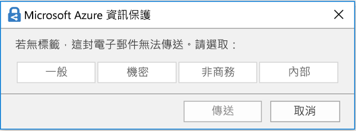

# 敏感度標籤概觀Overview of sensitivity labels

若要完成工作，組織中的人員需要與組織內外的其他人員共同合作。這表示內容不總是在防火牆後，它會漫遊在裝置、應用程式和服務的各處。您希望內容以安全、受保護的方式漫遊，以符合組織的商務及法規遵循原則。To get their work done, people in your organization need to collaborate with others both inside and outside the organization. This means that content no longer stays behind a firewall – it roams everywhere, across devices, apps, and services. And when it roams, you want it to do so in a secure, protected way that meets your organization’s business and compliance policies.

使用敏感度標籤，您可以分類並協助保護敏感內容，同時確保人員的生產力與共同作業能力不會受到阻礙。With sensitivity labels, you can classify and help protect your sensitive content, while making sure that your people’s productivity and ability to collaborate isn’t hindered.

您可以使用敏感度標籤來：You can use sensitivity labels to:
  
- **在標記的內容上強制執行保護設定，例如加密或浮水印。** 例如，使用者可以將「機密」標籤套用至文件或電子郵件，該標籤即可加密內容，並套用「機密」浮水印。**Enforce protection settings such as encryption or watermarks on labeled content.** For example, your users can apply a Confidential label to a document or email, and that label can encrypt the content and apply a Confidential watermark.    

- **在不同平台和裝置上保護 Office 應用程式中的內容。** 敏感度標籤可在 Windows、Mac、iOS 和 Android 的 Office 應用程式中使用。即將推出 Office Web 應用程式的支援。**Protect content in Office apps across different platforms and devices.** Sensitivity labels work in Office apps on Windows, Mac, iOS, and Android. Support for Office web apps is coming soon.
    
- **防止敏感內容離開組織執行 Windows 的裝置**，方式是使用 Microsoft Intune 的端點保護。敏感度標籤套用至位於 Windows 裝置上的內容後，端點保護可以防止該內容複製到協力廠商應用程式，例如 Twitter 或 Gmail，或複製到卸除式儲存空間，如 USB 磁碟機。**Prevent sensitive content from leaving your organization on devices running Windows**, by using endpoint protection in Microsoft Intune. After a sensitivity label has been applied to content that resides on a Windows device, endpoint protection can prevent that content from being copied to a third-party app, such as Twitter or Gmail, or being copied to removable storage, such as a USB drive.

- **使用 Microsoft Cloud App Security 保護協力廠商應用程式和服務中的內容。****Protect content in third-party apps and services**, by using Microsoft Cloud App Security. 使用 Cloud App Security，您可以偵測、分類、標記並保護協力廠商應用程式和服務中的內容，例如 SalesForce、Box 或 DropBox，即使協力廠商應用程式或服務無法讀取或支援敏感度標籤亦然。With Cloud App Security, you can detect, classify, label, and protect content in third-party apps and services, such as SalesForce, Box, or DropBox, even if the third-party app or service does not read or support sensitivity labels.

- **將敏感度標籤擴充至協力廠商應用程式和服務。** 使用 Microsoft 資訊保護 SDK，Windows、Mac 和 Linux 上的協力廠商應用程式可以讀取敏感度標籤，並且套用保護設定。iOS 和 Android 應用程式的支援即將推出。**Extend sensitivity labels to third-party apps and services.** With the Microsoft Information Protection SDK, third-party apps on Windows, Mac, and Linux can read sensitivity labels and apply protection settings. Support for apps on iOS and Android is coming soon.

- **將內容分類而不需使用任何保護設定。** 您只要將分類指派至內容 (就像貼紙)，分類就會在使用及共用內容時保留並跟隨內容。您可以使用此分類產生使用狀況報告，並查看敏感內容的活動資料。根據這項資訊，稍後您可以隨時選擇套用保護設定。**Classify content without using any protection settings.** You can also simply assign a classification to content (like a sticker) that persists and roams with the content as it's used and shared. You can use this classification to generate usage reports and see activity data for your sensitive content. Based on this information, you can always choose at a later time to apply protection settings.
    
在這些案例中，Office 365 中的敏感度標籤可以幫助您對正確的內容採取正確的動作。使用敏感度標籤，您可以分類整個組織中的資料，並根據該分類強制執行保護設定。In all of these cases, sensitivity labels in Office 365 can help you take the right actions on the right content. With sensitivity labels, you can classify data across your organization and enforce protection settings based on that classification.
  
您可以在 Microsoft 365 合規性中心、Microsoft 365 安全性中心，或 Office 365 安全性與合規性中心中建立敏感性標籤。Azure 資訊保護、Office App 和 Office 365 服務可以使用這些敏感性標籤。You create sensitivity labels in the Microsoft 365 compliance center, Microsoft 365 security center, or Office 365 Security & Compliance Center. These sensitivity labels can be used by Azure Information Protection, Office apps, and Office 365 services.

針對 Azure 資訊保護客戶，您可以使用其他系統管理中心的 Azure 資訊保護標籤，而如果您選擇執行額外或進階組態，標籤就會與 Azure 入口網站同步處理。For Azure Information Protection customers, you can use your Azure Information Protection labels in the other admin centers, and your labels will be synced with the Azure portal in case you choose to perform additional or advanced configuration. **Azure 資訊保護標籤與 Office 365 敏感度標籤完全彼此相容。****Azure Information Protection labels and Office 365 sensitivity labels are fully compatible with each other.** 這表示，比方說，如果您有使用 Azure 資訊保護加上標籤的內容，則不需將內容重新分類或重新加上標籤。This means, for example, if you have content labeled by Azure Information Protection, you won’t need to reclassify or relabel your content.

## 敏感度標籤是什麼What a sensitivity label is

當您將敏感度標籤指派至文件或電子郵件，它就像標記：When you assign a sensitivity label to a document or email, it’s simply like a tag that is:

- **可自訂。** 您可以為組織中不同等級的敏感內容建立類別，例如個人、公用、一般、機密、高度機密。**Customizable.** You can create categories for different levels of sensitive content in your organization, such as Personal, Public, General, Confidential, and Highly Confidential.

- **純文字。** 因為標籤是純文字，協力廠商應用程式和服務可以套用保護措施至已標示的內容。**Clear text.** Because the label is in clear text, it’s available for third-party apps and services to apply protective actions to labeled content.

- **持續性。** 敏感度標籤套用至內容後，會保留在該電子郵件或文件的中繼資料內。這表示標籤會跟隨內容，包括保護設定，並成為套用和強制執行原則的基礎。**Persistent.** After a sensitivity label is applied to content, it persists in the metadata of that email or document. This means the label roams with the content, including the protection settings, and becomes the basis for applying and enforcing policies.

在 Office 應用程式中，敏感度標籤在電子郵件或文件上只會顯示為標記。In the Office apps, a sensitivity label simply appears as a tag on an email or document.

內容中的每個項目皆可套用單一敏感度標籤。但請注意，項目可以同時套用單一敏感度標籤和單一[保留標籤](labels.md)。Each item of content can have a single sensitivity label applied to it. But note that an item can have both a single sensitivity label and a single [retention label](labels.md) applied to it.

## 敏感度標籤的功能What sensitivity labels can do

敏感度標籤套用至電子郵件或文件後，會對內容強制執行該標籤的保護設定。使用敏感度標籤，您可以：After a sensitivity label is applied to an email or document, the protection settings for that label are enforced on the content. With a sensitivity label, you can:

- 僅**加密**電子郵件，或同時加密電子郵件與文件。您可以選擇哪些使用者或群組擁有權限執行哪些動作和執行時間。比方說，您可以選擇讓組織外特定網域中的使用者僅在內容標示後的 7 天擁有權限檢閱內容。如需詳細資訊，請參閱[使用敏感度標籤中的加密來限制內容的存取](encryption-sensitivity-labels.md)**Encrypt** email only or both email and documents. You can choose which users or group have permissions to perform which actions and for how long. For example, you can choose to allow users in a specific domain outside your organization to have permissions to review the content for only 7 days after the content is labeled. For more information, see [Restrict access to content by using encryption in sensitivity labels](encryption-sensitivity-labels.md).

- **標記內容**的方法為在電子郵件或已套用標籤的文件上新增自訂浮水印、頁首或頁尾。請注意，浮水印僅適用於文件，不適用於電子郵件，並且限制為 255 個字元。此外，頁首和頁尾的限制為 1024 個字元 (除了在 Excel 中的限制為 255 個字元或更少，根據文件是否包含其他頁首或頁尾或其他因素而定。)**Mark the content** by adding custom watermarks, headers, or footers to email or documents that have the label applied. Note that watermarks are applied only to documents, not email, and they're limited to 255 characters. Also, headers and footers are limited to 1024 characters (except in Excel, where they're limited to 255 characters or fewer, depending on whether the document contains other headers or footers and other factors.)

    

- 
  \*\*防止資料遺失\*\*，方法是在 Intune 中開啟端點保護。如果下載了敏感內容，您可協助防止 Windows 裝置的資料遺失。比方說，您無法將已標示的內容複製到 Dropbox、Gmail 或 USB 磁碟機。在敏感度標籤可使用 Windows 資訊保護 (WIP) 之前，您需要先在 Azure 入口網站中建立應用程式保護原則。如需詳細資訊，請參閱 [Windows 資訊保護如何保護具有敏感度標籤的檔案](https://docs.microsoft.com/en-us/windows/security/information-protection/windows-information-protection/how-wip-works-with-labels?branch=vsts17546553)。**Prevent data loss** by turning on endpoint protection in Intune. If sensitive content gets downloaded, you can help prevent the loss of data from Windows devices. For example, you can’t copy labeled content into Dropbox, Gmail, or USB drive. Before your sensitivity labels can use Windows Information Protection (WIP), you first need to create an app protection policy in the Azure portal. For more information, see [How Windows Information Protection protects files with a sensitivity label](https://docs.microsoft.com/en-us/windows/security/information-protection/windows-information-protection/how-wip-works-with-labels?branch=vsts17546553).

- **自動將標籤套用到包含敏感性資訊的內容。** 您可以選擇想要將標籤套用到哪些類型的敏感性資訊，以及自動套用標籤或您建議使用者套用標籤的提示。如果您有建議的標籤，提示會顯示您選擇的任何文字。如需詳細資訊，請參閱[自動將敏感度標籤套用到內容](apply_sensitivity_label_automatically.md)。**Apply the label automatically to content that contains sensitive information.** You can choose what types of sensitive information that you want labeled, and the label can either be applied automatically, or you can prompt users to apply the label that you recommend. If you recommend a label, the prompt displays whatever text you choose. For more information, see [Apply a sensitivity label to content automatically](apply_sensitivity_label_automatically.md).

    

在您建立敏感性標籤時，這所有選項都可供使用。All of these options are available when you create a sensitivity label.

### 標籤優先順序 (順序很重要)Label priority (order matters)

建立敏感性標籤時，它們會顯示在 [標籤]\*\*\*\* 頁面的 [敏感度]\*\*\*\* 索引標籤上的清單中。When you create your sensitivity labels, they appear in a list on the **Sensitivity** tab on the **Labels** page. 在此清單中，標籤的順序很重要，因為它反映的是其優先順序。In this list, the order of the labels is important because it reflects their priority. 您想要讓最具限制性的敏感性標籤，例如 [高度機密性]，顯示在清單的最**底端**，以及最不具限制性的敏感性標籤，例如公用，顯示在最**上方**。You want your most restrictive sensitivity label, such as Highly Confidential, to appear at the **bottom** of the list, and your least restrictive sensitivity label, such as Public, to appear at the **top**.

文件或電子郵件只能套用單一敏感度標籤。如果您要求使用者提供將標籤變更為較低分類的理由，這份清單的順序可決定什麼是較低的分類。A document or email can have only a single sensitivity label applied to it. If you require your users to provide a justification for changing the label to a lower classification, the order of this list determines what's a lower classification.

### 子標籤 (分組標籤)Sublabels (grouping labels)

您可以使用子標籤將一或多個標籤分組在 Office 應用程式中的使用者可看到的上層標籤之下。With sublabels, you can group one or more labels below a parent label that a user sees in an Office app. 例如，在 [機密文件] 下，您的組織可能會使用不同的標籤來標示該分類的特定類型。For example, under Confidential, your organization might use several different labels for specific types of that classification. 在此範例中，上層標籤 [機密文件] 只是沒有任何保護設定的文字標籤，且因為它有子標籤，所以無法套用至內容。In this example, the parent label Confidential is simply a text label with no protection settings, and because it has sublabels, it can’t be applied to content. 相反地，使用者必須選擇 [機密文件] 來查看子標籤，然後再選擇要套用到內容的子標籤。Instead, users must choose Confidential to view the sublabels, and then they can choose a sublabel to apply to content.

子標籤是以邏輯群組方式向使用者呈現標籤的一個簡單方式。Sublabels are simply a way to present labels to users in logical groups. 子標籤不繼承其上層標籤的任何設定。Sublabels don’t inherit any settings from their parent label. 子標籤可套用至內容；但上層標籤不行。Sublabels can be applied to content; parent labels cannot.

(此外，您不應選擇上層標籤作為預設標籤 (請參閱下一節)，或將上層標籤設定為自動套用或建議選項，因為上層標籤無法套用到使用 Azure 資訊保護統一標籤用戶端的 Office 應用程式中的內容。)(Also, you should not choose a parent label as the default label (see next section), or configure a parent label to be auto-applied or recommended, because the parent label won't be applied to content in Office apps that use the Azure Information Protection unified labeling client.)

### 編輯或刪除敏感度標籤Editing or deleting a sensitivity label

如果您刪除敏感度標籤，請注意，標籤並未從內容中移除，且所有保護設定會繼續對內容強制執行。If you delete a sensitivity label, note that the label is not removed from content, and any protection settings continue to be enforced on the content.

如果您編輯敏感度標籤，則會對內容強制執行當初套用至內容的標籤版本。If you edit a sensitivity label, the version of the label that was applied to content is what’s enforced on that content.

## 標籤原則的功能What label policies can do

建立敏感度標籤後，您需要發佈標籤，以供組織中的人員使用，這些人員可以接著將標籤套用至內容。與發佈到位置 (例如所有 Exchange 信箱) 的保留標籤不同，敏感度標籤會發佈給使用者或群組。敏感度標籤接著會為這些使用者和群組顯示在 Office 應用程式中。After you create your sensitivity labels, you need to publish them, to make them available to people in your organization, who can then apply the labels to content. Unlike retention labels, which are published to locations, such as all Exchange mailboxes, sensitivity labels are published to users or groups. Sensitivity labels then appear in Office apps for those users and groups.

使用標籤原則，您可以：With a label policy, you can:

- **選擇哪些使用者和群組可以看見標籤。** 標籤可以發佈到任何電子郵件啟用的安全性群組、通訊群組、Office 365 群組或動態通訊群組。**Choose which users and groups see the labels.** Labels can be published to any email-enabled security group, distribution group, Office 365 group, or dynamic distribution group.

- **套用預設標籤**至所有新文件和電子郵件，這些是由標籤原則中包含的使用者和群組所建立。此預設標籤可以設定您想要套用到所有內容的基礎層級保護設定。**Apply a default label** to all new documents and email created by the users and groups included in the label policy. This default label can set a base level of protection settings that you want applied to all your content.

- **變更標籤需要理由。** 如果內容標示為「機密」，而使用者想要移除該標籤，或取代為較低的分類，如「公用」標籤，則您可以要求使用者在執行此動作時提供理由。這些理由可供系統管理員檢閱。我們目前正在處理系統管理員可在其中檢視使用者理由的報告。**Require a justification for changing a label.** If content is marked Confidential and a user wants to remove that label or replace it with a lower classification, such as a label named Public, you can require that the user provide a justification when performing this action. These justifications will be available for the admin to review. We’re currently working on a report where admins can view the user justifications.

    

- **要求使用者將標籤套用到他們的電子郵件和文件。** 如果您想要將所有使用者的內容套用標籤，您可以要求必須將標籤套用到所有已儲存的文件和傳送的電子郵件。基於自動或預設 (預設標籤選項如上所述) 指派的條件，使用者可以手動指派標籤。當使用者需要指派標籤時，Outlook 中會顯示提示。**Require users to apply a label to their email and documents.** If you want all of a user's content to be labeled, you can require that a label must be applied to all of their saved documents and sent emails. The label can be assigned manually by the user, automatically as a result of a condition, or be assigned by default (the default label option described above). Here's the prompt shown in Outlook when a user is required to assign a label.

    > [!NOTE]
    > 強制標籤功能需要有 Azure 資訊保護訂閱。若要使用此功能，您必須下載並安裝 [Azure 資訊保護用戶端](https://www.microsoft.com/en-us/download/details.aspx?id=53018)或更新的[ Azure 資訊保護統一標籤用戶端](https://docs.microsoft.com/zh-TW/azure/information-protection/rms-client/install-unifiedlabelingclient-app)。我們正在努力在 Office 應用程式中提供此功能的原生支援，讓此功能不需要 Azure 資訊保護用戶端。此外，用戶端只能在 Windows 上執行，因此 Mac、iOS 和 Android 尚未支援此功能。Mandatory labeling requires an Azure Information Protection subscription. To use this feature, you must download and install either the [Azure Information Protection client](https://www.microsoft.com/en-us/download/details.aspx?id=53018) or the later [Azure Information Protection unified labeling client](https://docs.microsoft.com/zh-TW/azure/information-protection/rms-client/install-unifiedlabelingclient-app). We're working on native support for this feature in Office apps, so that it won't require the Azure Information Protection client. Also, the client runs only on Windows, so this feature is not yet supported on Mac, iOS, and Android.

    

- **提供說明連結至自訂說明頁面。** 如果使用者不確定敏感度標籤代表的意義或使用方式，您可以提供「深入了解」URL，其顯示在 Office 應用程式中 [敏感度] 標籤功能表的底部。**Provide help link to a custom help page.** If your users aren’t sure what your sensitivity labels mean or how they should be used, you can provide a Learn More URL that appears at the bottom of the Sensitivity label menu in the Office apps.

    ![功能區中 [敏感度] 按鈕上的「深入了解」連結](media/Sensitivity_label_learn_more.png)

建立標籤原則並將敏感度標籤指派給使用者和群組之後，這些人會在一小時內在 Office 應用程式中看到這些標籤。After you create a label policy and assign sensitivity labels to users and groups, those people will see those labels available in the Office apps in an hour or less.

## 如何開始使用How to get started

開始使用敏感度標籤的程序很快：Getting started with sensitivity labels is a quick process:

1. **定義標籤。** 首先，您需要建立分類法，以用來定義不同層級的敏感內容。您應使用一般名稱或字詞，以便使用者了解。比方說，您可以從個人、公用、一般、機密，和高度機密等標籤開始。您可以使用子標籤依類別將相似的標籤分組。此外，建立標籤時，工具提示是必要的，當使用者將滑鼠指標停留在功能區上的標籤選項，提示會顯示在 Office 應用程式中。**Define the labels.** First, you want to establish your taxonomy for defining different levels of sensitive content. You should use common names or terms that make sense to your users. For example, you can start with labels such as Personal, Public, General, Confidential, and Highly Confidential. You can use sublabels to group similar labels by category. Also, when you create a label, a tool tip is required, which appears in the Office apps when a user hovers over a label option on the Ribbon.

1. **定義每個標籤的功能。** 然後設定與每個標籤相關聯的保護設定。比方說，較低的敏感度內容 (「一般」標籤) 可能只有套用頁首或頁尾，而較高敏感度內容 (「機密」標籤) 可能會套用浮水印、加密及 WIP，以協助確保只有特殊權限使用者可以存取。**Define what each label can do.** Then, configure the protection settings you want associated with each label. For example, lower sensitivity content (a “General” label) might simply have a header or footer applied to it, while higher sensitivity content (a “Confidential” label) may have a watermark, encryption, and WIP applied to it, to help ensure that only privileged users can access it.
 
1. **定義誰可以看到標籤。** 定義組織的標籤後，您會在標籤原則中發佈標籤，此原則可控制哪些使用者和群組會看到這些標籤。單一標籤可重複使用 – 定義一次後，即可將標籤包含在指派給不同使用者的數個標籤原則中。但為了讓標籤可指派給內容，您必須先發佈該標籤，才能在 Office 應用程式及其他服務中使用。剛開始時，您可以先指定給一小部分人員以試驗您的敏感度標籤。**Define who gets the labels.** After you define your organization’s labels, you publish them in a label policy that controls which users and groups see those labels. A single label is reusable – you define it once, and then you can include it in several label policies assigned to different users. But in order for a label to be assigned to content, you must first publish that label so that it’s available in Office apps and other services. When just starting out, you can pilot your sensitivity labels by assigning them to just a few people.

以下是系統管理員、使用者和 Office 應用程式執行項目以讓敏感度標籤運作的基本流程。Here’s the basic flow of what the admin, user, and Office app do to make sensitivity labels work.

## 敏感度標籤會顯示的位置Where sensitivity labels can appear

敏感度標籤會顯示在 Office 應用程式的 UI 中。若要檢視針對特定應用程式與平台目前的可用性，請參閱**[目前提供此功能的位置？](https://support.office.com/zh-TW/article/apply-sensitivity-labels-to-your-documents-and-email-within-office-2f96e7cd-d5a4-403b-8bd7-4cc636bae0f9?ad=US&ui=en-US&rs=en-US#bkmk_whereavailable)**Sensitivity labels appear in the UI of Office apps. To view the current availability for specific apps and platforms, see **[Where is the feature available today?](https://support.office.com/zh-TW/article/apply-sensitivity-labels-to-your-documents-and-email-within-office-2f96e7cd-d5a4-403b-8bd7-4cc636bae0f9?ad=US&ui=en-US&rs=en-US#bkmk_whereavailable)**

### Windows 上的 Office 應用程式Office apps on Windows

在執行 Windows 的裝置上 Office 應用程式中，敏感度標籤會顯示在功能區上 [常用]\*\*\*\* 索引標籤的 [敏感度]\*\*\*\* 按鈕中。套用的標籤也會顯示在視窗底部的狀態列中。In Office apps on devices running Windows, sensitivity labels appear on the **Sensitivity** button, on the **Home** tab on the Ribbon. The label applied also appears in the Status bar at the bottom of the window.

即將推出 Windows 中 Office 應用程式敏感度標籤的原生支援。Coming soon is native support for sensitivity labels in Office apps on Windows.

如果您是現有的 Azure 資訊保護客戶，您可以部署 Azure 資訊保護整合標籤用戶端，其支援敏感度標籤。如需下載用戶端的詳細資訊，請參閱 [Azure 資訊保護統一標籤客戶端：版本發行資訊](https://docs.microsoft.com/zh-TW/azure/information-protection/rms-client/unifiedlabelingclient-version-release-history)。我們目前正在處理 Windows 中 Office 應用程式敏感度標籤的原生支援，將不再需要 Azure 資訊保護整合標籤用戶端。If you're an existing Azure Information Protection customer, you can deploy the Azure Information Protection unified labeling client, which supports sensitivity labels. For more information about downloading the client, see [Azure Information Protection unified labeling client: Version release information](https://docs.microsoft.com/zh-TW/azure/information-protection/rms-client/unifiedlabelingclient-version-release-history). We’re currently working on native support for sensitivity labels in Office apps on Windows, so that the Azure Information Protection unified labeling client will no longer be required.

### Mac 上的 Office 應用程式Office apps on Mac

在 Mac 裝置上的 Office 應用程式中，敏感度標籤會顯示在功能區上 [常用]\*\*\*\* 索引標籤的 [敏感度]\*\*\*\* 按鈕中。套用的標籤也會顯示在視窗底部的狀態列中。In Office apps on Mac devices, sensitivity labels appear on the **Sensitivity** button, on the **Home** tab on the Ribbon. The label applied also appears in the Status bar at the bottom of the window.

### iOS 上的 Office 應用程式Office apps on iOS

在 iOS 裝置上的 Office 應用程式中，敏感度標籤會顯示在功能區上 [常用]\*\*\*\* 索引標籤的 [敏感度]\*\*\*\* 按鈕中。套用的標籤也會顯示在視窗底部的狀態列中。In Office apps on iOS devices, sensitivity labels appear on the **Sensitivity** button, on the **Home** tab on the Ribbon. The label applied also appears in the Status bar at the bottom of the window.

### Android 上的 Office 應用程式Office apps on Android

在 Android 裝置上的 Office 應用程式中，敏感度標籤會顯示在功能區上 [常用]\*\*\*\* 索引標籤的 [敏感度]\*\*\*\* 按鈕中。套用的標籤也會顯示在視窗底部的狀態列中。In Office apps on Android devices, sensitivity labels appear on the **Sensitivity** button, on the **Home** tab on the Ribbon. The label applied also appears in the Status bar at the bottom of the window.

### Office 應用程式中敏感度標籤的詳細資訊More information on sensitivity labels in Office apps

- [在 Office 中將敏感度標籤套用至您的文件和電子郵件Apply sensitivity labels to your documents and email within Office](https://support.office.com/zh-TW/article/apply-sensitivity-labels-to-your-documents-and-email-within-office-2f96e7cd-d5a4-403b-8bd7-4cc636bae0f9)
- [將敏感度標籤套用至 Office 檔案的已知問題Known issues when you apply sensitivity labels to your Office files](https://support.office.com/zh-TW/article/known-issues-when-you-apply-sensitivity-labels-to-your-office-files-b169d687-2bbd-4e21-a440-7da1b2743edc)

## 敏感度標籤如何搭配使用現有的 Azure 資訊保護標籤How sensitivity labels work with existing Azure Information Protection labels

Azure 資訊保護使用者目前可藉由使用 Azure 資訊保護整合標籤用戶端，在 Windows 上分類和標記內容。現有的 Azure 資訊保護標籤與新的敏感度標籤可順利搭配運作。這表示您可以：Azure Information Protection users are currently able to classify and label content on Windows by using the Azure Information Protection unified labeling client. Existing Azure Information Protection labels work seamlessly with new sensitivity labels. This means you can:

- 在文件和電子郵件上保留現有的 Azure 資訊保護標籤。Keep your existing Azure Information Protection labels on documents and email.
- 保留現有的 Azure 資訊保護標籤設定。Keep your existing Azure Information Protection label configuration.

如果您使用 Azure 資訊保護標籤，目前建議您避免在其他系統管理中心建立新的標籤，直到完成移轉為止。If you are using Azure Information Protection labels, for now we recommend that you avoid creating new labels in other admin centers until after you’ve completed your migration. [Azure 資訊保護移轉主題](https://docs.microsoft.com/zh-TW/azure/information-protection/configure-policy-migrate-labels)提供重要的資訊和一些特定的警告。The [Azure Information Protection migration topic](https://docs.microsoft.com/zh-TW/azure/information-protection/configure-policy-migrate-labels) has important information and some specific caveats. 如果您尚未準備好要將您的生產環境租用戶移轉到敏感性標籤，則無需擔心：目前，您的使用者可以繼續使用 Azure 資訊保護用戶端，而系統管理員可以繼續使用 Azure 入口網站來進行管理。If you are not yet ready to migrate your production tenants to sensitivity labels, there is no cause for concern: for the moment, your users can continue using the Azure Information Protection client, and admins can continue using the Azure portal for management.

## 使用 Microsoft Intune 中的端點保護來保護 Windows 裝置上的內容Protect content on Windows devices by using endpoint protection in Microsoft Intune

建立敏感度標籤時，您可以告知 Windows 具有此標籤的檔案為敏感且儲存在 Windows 裝置上時需要防止資料外洩。此選項可協助確保具有此標籤的內容只能共用或複製到批准的位置，即使是儲存在端點上。基本上，開啟敏感度標籤的此選項會告訴 Windows 這是非常重要的資料，並保證其他的使用限制。When you create a sensitivity label, you have the option to tell Windows that files with this label are sensitive and need to be protected against data leakage when stored on Windows devices. This option can help ensure that content with this label can be shared or copied only to sanctioned locations, even when it’s stored on an endpoint. In essence, turning on this option for a sensitivity label tells Windows that this is extra critical data that warrants additional usage constraints.

當您開啟此選項，Windows 可以讀取、了解及對文件中的敏感度標籤採取動作，並自動對內容套用 Windows 資訊保護 (WIP)，不論其如何觸及受管理的 Windows 裝置。在無論是否套用加密的情況下，這有助於防止標記的檔案發生意外洩漏。When you turn on this option, Windows can read, understand, and act on sensitivity labels in documents and automatically apply Windows Information Protection (WIP) on content, no matter how it reaches a managed Windows device. This helps protect labeled files from accidental leakage, with or without applying encryption.

比方說，Windows 可了解位於使用者電腦上的 Word 文件已套用「機密」標籤，且 WIP 可套用應用程式保護原則，以避免將資料複製或共用到該裝置的任何非工作位置 (例如個人 OneDrive、個人電子郵件帳戶、社群媒體或 USB 磁碟機)。For example, Windows can understand that a Word document residing on a user’s machine has a Confidential label applied to it, and WIP can apply an app protection policy to prevent the copying or sharing of the data to any non-work location from that device (such as a personal OneDrive, personal email accounts, social media, or USB drives).

如果使用者嘗試將已標記的內容上傳到個人 Gmail 帳戶，他們會看到這則訊息。If a user attempts to upload labeled content to a personal Gmail account, they see this message.

如果使用者嘗試將已標記的內容儲存到 USB 磁碟機，他們會看到這則訊息。And if a user attempts to save labeled content to a USB drive, they see this message.

### 重要的先決條件Important prerequisites

在敏感度標籤可使用 WIP 之前，您必須先執行下文所述的先決條件：[Windows 資訊保護如何保護具有敏感度標籤的檔案](https://docs.microsoft.com/en-us/windows/security/information-protection/windows-information-protection/how-wip-works-with-labels?branch=vsts17546553)。本主題將說明下列先決條件：Before your sensitivity labels can use WIP, you first need to do the prerequisites described here: [How Windows Information Protection protects files with a sensitivity label](https://docs.microsoft.com/en-us/windows/security/information-protection/windows-information-protection/how-wip-works-with-labels?branch=vsts17546553). This topic describes the following prerequisites:

- 請確定您執行的是 Windows 10，版本 1809 或更新版本。Make sure you're running Windows 10, version 1809 or later.
- [設定 Windows Defender 進階威脅防護 (WDATP)](https://docs.microsoft.com/zh-TW/windows/security/threat-protection/windows-defender-atp/get-started)，這會掃描內容以找出標籤，並套用對應的 WIP 保護。ATP 會在 WIP 之外獨立執行某些動作，例如報告異常狀況。[Set up Windows Defender Advanced Threat Protection (WDATP)](https://docs.microsoft.com/zh-TW/windows/security/threat-protection/windows-defender-atp/get-started), which scans content for a label and applies the corresponding WIP protection. ATP performs some actions independently from WIP, such as reporting anomalies.
- 建立可套用至端點裝置的 Windows 資訊保護 (WIP) 原則。您可以在下列任何位置執行此作業：Create a Windows Information Protection (WIP) policy that applies to endpoint devices. You can do this in either of these locations:
    - [為 Microsoft Intune 使用 Azure 入口網站透過 MDM 建立 Windows 資訊保護 (WIP) 原則Create a Windows Information Protection (WIP) policy with MDM using the Azure portal for Microsoft Intune](https://docs.microsoft.com/zh-TW/windows/security/information-protection/windows-information-protection/create-wip-policy-using-intune-azure)
    - [使用 System Center Configuration Manager 建立及部署 Windows 資訊保護 (WIP) 原則Create and deploy a Windows Information Protection (WIP) policy using System Center Configuration Manager](https://docs.microsoft.com/zh-TW/windows/security/information-protection/windows-information-protection/create-wip-policy-using-sccm)

## 使用 Microsoft Cloud App Security 保護協力廠商應用程式和服務中的內容Protect content in third-party apps and services by using Microsoft Cloud App Security

使用 Cloud App Security (CAS) 保護協力廠商應用程式和服務中的內容。Protect content in third-party apps and services by using Cloud App Security (CAS). 您可以使用 CAS 來偵測、分類、加標籤，以及保護內容的第三方服務和應用程式 (例如 SalesForce、Box 或 Dropbox) 中的內容。With CAS, you can detect, classify, label, and protect content in third-party services and apps, such as SalesForce, Box, or Dropbox. 例如，Dropbox 可能無法了解敏感度標籤，但 CAS 可以取得並保護該位置中加標籤的內容。For example, Dropbox might not understand a sensitivity label, but CAS can reach out and protect labeled content in that location.

如需詳細資訊，請參閱[自動套用 Azure 資訊保護分類標籤](https://docs.microsoft.com/zh-TW/cloud-app-security/use-case-information-protection)。For more information, see [Automatically apply Azure Information Protection classification labels](https://docs.microsoft.com/zh-TW/cloud-app-security/use-case-information-protection).

### 重要的先決條件Important prerequisites

在敏感度標籤可使用 CAS 之前，您必須先執行下文所述的先決條件：[自動套用 Azure 資訊保護分類標籤](https://docs.microsoft.com/zh-TW/cloud-app-security/use-case-information-protection)。Before your sensitivity labels can use CAS, you first need to do the prerequisites described here: [Automatically apply Azure Information Protection classification labels](https://docs.microsoft.com/zh-TW/cloud-app-security/use-case-information-protection). 本主題說明下列先決條件：This topic describes the following prerequisites:

- 為您的租用戶[啟用 Cloud App Security 和 Azure 資訊保護](https://docs.microsoft.com/zh-TW/cloud-app-security/azip-integration)。[Enable Cloud App Security and Azure Information Protection](https://docs.microsoft.com/zh-TW/cloud-app-security/azip-integration) for your tenant.
- [將應用程式連線](https://docs.microsoft.com/zh-TW/cloud-app-security/enable-instant-visibility-protection-and-governance-actions-for-your-apps)至 Cloud App Security。[Connect the app](https://docs.microsoft.com/zh-TW/cloud-app-security/enable-instant-visibility-protection-and-governance-actions-for-your-apps) to Cloud App Security.

## 使用 Microsoft 資訊保護 SDK 將敏感度標籤擴充至協力廠商應用程式和服務Extend sensitivity labels to third-party apps and services by using the Microsoft Information Protection SDK

由於敏感度標籤在文件的中繼資料內保存為純文字，協力廠商應用程式和服務可以選擇支援識別及保護含有這類標籤的內容。其他應用程式和服務的支援已展開。Because a sensitivity label is persisted as clear text in the metadata of a document, third-party apps and services can choose to support identifying and protecting content that contains such a label. Support in other apps and services is always expanding.

使用 [Microsoft 資訊保護 SDK](https://docs.microsoft.com/zh-TW/information-protection/develop/)，協力廠商應用程式和服務可以讀取並將敏感度標籤和保護套用至文件。SDK 支援 Windows、Mac 和 Linux 上的應用程式。iOS 和 Android 應用程式的支援即將推出。With the [Microsoft Information Protection SDK](https://docs.microsoft.com/zh-TW/information-protection/develop/), third-party apps and services can read and apply sensitivity labels and protection to documents. The SDK supports apps on Windows, Mac, and Linux. Coming soon is support for apps on iOS and Android.

使用 SDK，您可以標記及保護內容，並搭配其他 Microsoft 資訊保護應用程式和服務，如 Office 應用程式、Office 365 服務、Azure 資訊保護掃描器、Microsoft Cloud App Security，以及多種其他的合作夥伴解決方案。例如，深入了解 [Adobe Acrobat 中敏感度標籤的支援](https://techcommunity.microsoft.com/t5/Azure-Information-Protection/Starting-October-use-Adobe-Acrobat-Reader-for-PDFs-protected-by/ba-p/262738)。Using the SDK, you can label and protect content in a way that works with other Microsoft Information Protection apps and services, such as Office apps, Office 365 services, the Azure Information Protection scanner, Microsoft Cloud App Security, and several other partner solutions. For example, learn more about [support for sensitivity labels in Adobe Acrobat](https://techcommunity.microsoft.com/t5/Azure-Information-Protection/Starting-October-use-Adobe-Acrobat-Reader-for-PDFs-protected-by/ba-p/262738).

若要深入了解 Microsoft 資訊保護 SDK，請參閱[技術社群部落格上的公告](https://techcommunity.microsoft.com/t5/Microsoft-Information-Protection/Microsoft-Information-Protection-SDK-Now-Generally-Available/ba-p/263144)。您也可以了解[與 Microsoft 資訊保護整合的合作夥伴解決方案](https://techcommunity.microsoft.com/t5/Azure-Information-Protection/Microsoft-Information-Protection-showcases-integrated-partner/ba-p/262657)。To learn more about the Microsoft Information Protection SDK, see the [announcement on the Tech Community blog](https://techcommunity.microsoft.com/t5/Microsoft-Information-Protection/Microsoft-Information-Protection-SDK-Now-Generally-Available/ba-p/263144). You can also learn about [partner solutions that are integrated with Microsoft Information Protection](https://techcommunity.microsoft.com/t5/Azure-Information-Protection/Microsoft-Information-Protection-showcases-integrated-partner/ba-p/262657).

## 權限Permissions

您的法務小組中將建立敏感度標籤的成員必須具備安全性與合規性中心的權限。根據預設，租用戶管理員將可存取此位置，並且可直接讓法務人員與其他人存取安全性與合規性中心，而不需要為其提供租用戶管理員的所有權限。若要這麼做，我們建議您：移至安全性與合規性中心的 [權限]\*\*\*\* 頁面，編輯 [規範管理員]\*\*\*\* 角色群組，將該成員加入此角色群組。Members of your compliance team who will create sensitivity labels need permissions to the Security & Compliance Center. By default, your tenant admin will have access to this location and can give compliance officers and other people access to the Security & Compliance Center, without giving them all of the permissions of a tenant admin. To do this, we recommend that you go to the **Permissions** page of the Security & Compliance Center, edit the **Compliance Administrator** role group, and add members to that role group.

如需詳細資訊，請參閱[授與使用者存取 Office 365 安全性與合規性中心的權限](grant-access-to-the-security-and-compliance-center.md)。For more information, see [Give users access to the Office 365 Security & Compliance Center](grant-access-to-the-security-and-compliance-center.md).

需要這些權限才能建立及套用標籤和標籤原則。原則強制執行不需要內容的存取權。These permissions are required only to create and apply labels and a label policy. Policy enforcement does not require access to the content.
