# 敏感度標籤概觀

若要完成工作，組織中的人員需要與組織內外的其他人員共同合作。這表示內容不總是在防火牆後，它會漫遊在裝置、應用程式和服務的各處。您希望內容以安全、受保護的方式漫遊，以符合組織的商務及法規遵循原則。

使用 Office 365 的敏感度標籤，您可以分類並協助保護敏感內容，同時確保人員的生產力與共同作業能力不會受到阻礙。

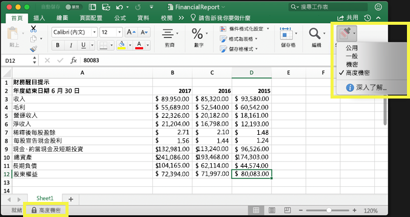

您可以使用敏感度標籤來：
  
- **在標記的內容上強制執行保護設定，例如加密或浮水印。** 例如，使用者可以將「機密」標籤套用至文件或電子郵件，該標籤即可加密內容，並套用「機密」浮水印。    

- **在不同平台和裝置上保護 Office 應用程式中的內容。** 敏感度標籤可在 Windows、Mac、iOS 和 Android 的 Office 應用程式中使用。即將推出 Office Web 應用程式的支援。
    
- **防止敏感內容離開組織執行 Windows 的裝置**，方式是使用 Microsoft Intune 的端點保護。敏感度標籤套用至位於 Windows 裝置上的內容後，端點保護可以防止該內容複製到協力廠商應用程式，例如 Twitter 或 Gmail，或複製到卸除式儲存空間，如 USB 磁碟機。

- **將敏感度標籤擴充至協力廠商應用程式和服務。** 使用 Microsoft 資訊保護 SDK，Windows、Mac 和 Linux 上的協力廠商應用程式可以讀取敏感度標籤，並且套用保護設定。iOS 和 Android 應用程式的支援即將推出。

- **將內容分類而不需使用任何保護設定。** 您只要將分類指派至內容 (就像貼紙)，分類就會在使用及共用內容時保留並跟隨內容。您可以使用此分類產生使用狀況報告，並查看敏感內容的活動資料。根據這項資訊，稍後您可以隨時選擇套用保護設定。
    
在這些案例中，Office 365 中的敏感度標籤可以幫助您對正確的內容採取正確的動作。使用敏感度標籤，您可以分類整個組織中的資料，並根據該分類強制執行保護設定。
  
您在 Office 365 安全性 &amp; 合規性中心建立敏感度標籤。安全性與合規性中心目前是在 Azure 資訊保護和 Office 365 中設定敏感度標籤和原則的單一位置。這些敏感度標籤可供 Azure 資訊保護、Office 應用程式和 Office 365 服務使用。

針對 Azure 資訊保護客戶，您可以使用安全性與合規性中心的 Azure 資訊保護標籤，且您的標籤會在 Azure 入口網站同步處理，以防您選擇執行額外或進階的設定。**Azure 資訊保護標籤和 Office 365 敏感度標籤完全互相相容。** 這表示，比方說，如果 Azure 資訊保護已標示內容，則您不需要重新分類或重新標示內容。

![安全性與合規性中心的 [標籤] 頁面上的 [敏感度] 索引標籤](media/Sensitivity_label_tab_on_Labels_page.png)

## 敏感度標籤是什麼

當您將敏感度標籤指派至文件或電子郵件，它就像標記：

- **可自訂。** 您可以為組織中不同等級的敏感內容建立類別，例如個人、公用、一般、機密、高度機密。

- **純文字。** 因為標籤是純文字，協力廠商應用程式和服務可以套用保護措施至已標示的內容。

- **持續性。** 敏感度標籤套用至內容後，會保留在該電子郵件或文件的中繼資料內。這表示標籤會跟隨內容，包括保護設定，並成為套用和強制執行原則的基礎。

在 Office 應用程式中，敏感度標籤在電子郵件或文件上只會顯示為標記。

內容中的每個項目皆可套用單一敏感度標籤。但請注意，項目可以同時套用單一敏感度標籤和單一[保留標籤](labels.md)。

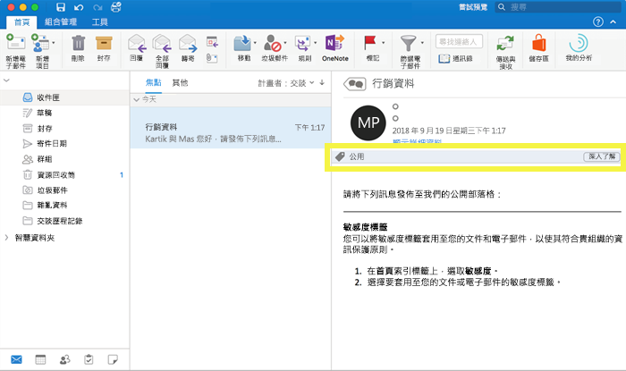

## 敏感度標籤的功能

敏感度標籤套用至電子郵件或文件後，會對內容強制執行該標籤的保護設定。使用敏感度標籤，您可以：

- 僅**加密**電子郵件，或同時加密電子郵件與文件。您可以選擇哪些使用者或群組擁有權限執行哪些動作和執行時間。比方說，您可以選擇讓組織外特定網域中的使用者僅在內容標示後的 7 天擁有權限檢閱內容。

- **標記內容**的方法為在電子郵件或已套用標籤的文件上新增自訂浮水印、頁首或頁尾。請注意，浮水印僅適用於文件，不適用於電子郵件，並且限制為 255 個字元。此外，頁首和頁尾的限制為 1024 個字元 (除了在 Excel 中的限制為 255 個字元或更少，根據文件是否包含其他頁首或頁尾或其他因素而定。)

    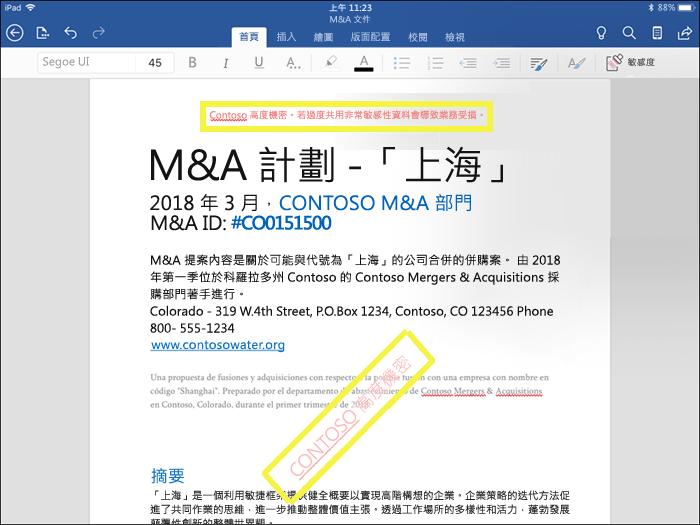

- 
  **防止資料遺失**，方法是在 Intune 中開啟端點保護。如果下載了敏感內容，您可協助防止 Windows 裝置的資料遺失。比方說，您無法將已標示的內容複製到 Dropbox、Gmail 或 USB 磁碟機。在敏感度標籤可使用 Windows 資訊保護 (WIP) 之前，您需要先在 Azure 入口網站中建立應用程式保護原則。如需詳細資訊，請參閱 [Windows 資訊保護如何保護具有敏感度標籤的檔案](https://docs.microsoft.com/en-us/windows/security/information-protection/windows-information-protection/how-wip-works-with-labels?branch=vsts17546553)。

在安全性與合規性中心建立標籤時，這些選項皆可使用。

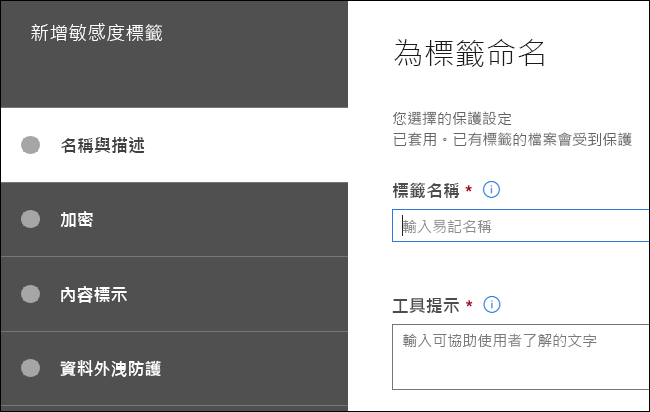

### 標籤優先順序 (順序很重要)

在安全性與合規性中心建立敏感度標籤時，會顯示在 [標籤]**** 頁面上 [敏感度]**** 索引標籤中的清單。在此清單中，標籤的順序非常重要，因為它會反映其優先順序。您可以讓限制最嚴苛的敏感度標籤，如「高度機密」，顯示在清單**底部**，限制最寬鬆的敏感度標籤，如「公用」，顯示在**頂端**。

文件或電子郵件只能套用單一敏感度標籤。如果您要求使用者提供將標籤變更為較低分類的理由，這份清單的順序可決定什麼是較低的分類。

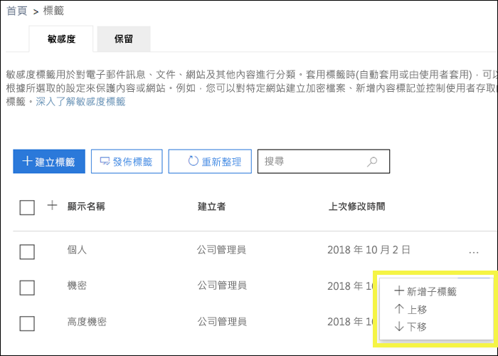

### 子標籤 (分組標籤)

使用子標籤，您可以將使用者在 Office 應用程式中看到的標題下一或多個標籤分組。比方說，在「機密」下方，您的組織可能針對該分類的特定類型使用數種不同標籤。在此範例中，標籤「機密」只是文字標籤而沒有保護設定，且因為其具有子標籤，所以不能套用至內容。使用者必須改為選擇「機密」才能檢視子標籤，接著可選擇子標籤套用至內容。

子標籤只是在邏輯群組中向使用者顯示標籤的方式。子標籤並不會繼承其上方標籤的任何設定。

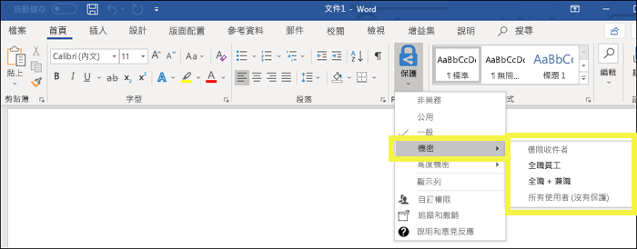

### 編輯或刪除敏感度標籤

如果您在安全性與合規性中心刪除敏感度標籤，請注意，標籤並未從內容中移除，且所有保護設定會繼續在內容上強制執行。

如果您在安全性與合規性中心編輯敏感度標籤，則當初套用至內容的標籤版本會在內容上強制執行。

## 標籤原則的功能

建立敏感度標籤後，您需要發佈標籤，以供組織中的人員使用，這些人員可以接著將標籤套用至內容。與發佈到位置 (例如所有 Exchange 信箱) 的保留標籤不同，敏感度標籤會發佈給使用者或群組。敏感度標籤接著會為這些使用者和群組顯示在 Office 應用程式中。

使用標籤原則，您可以：

- **選擇哪些使用者和群組可以看見標籤。** 標籤可以發佈到任何電子郵件啟用的安全性群組、通訊群組、Office 365 群組或動態通訊群組。

- **套用預設標籤**至所有新文件和電子郵件，這些是由標籤原則中包含的使用者和群組所建立。此預設標籤可以設定您想要套用到所有內容的基礎層級保護設定。

- **變更標籤需要理由。** 如果內容標示為「機密」，而使用者想要移除該標籤，或取代為較低的分類，如「公用」標籤，則您可以要求使用者在執行此動作時提供理由。這些理由可供系統管理員檢閱。我們目前正在處理系統管理員可在其中檢視使用者理由的報告。

    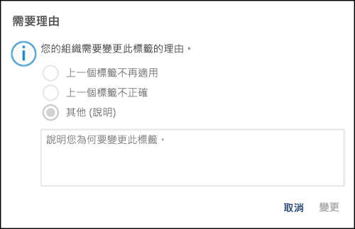

- **提供說明連結至自訂說明頁面。** 如果使用者不確定敏感度標籤代表的意義或使用方式，您可以提供「深入了解」URL，其顯示在 Office 應用程式中 [敏感度] 標籤功能表的底部。

    ![功能區中 [敏感度] 按鈕上的「深入了解」連結](media/Sensitivity_label_learn_more.png)

建立標籤原則並將敏感度標籤指派給使用者和群組之後，這些人會在一小時內在 Office 應用程式中看到這些標籤。

## 如何開始使用

開始使用敏感度標籤的程序很快：

1. **定義標籤。** 首先，您需要建立分類法，以用來定義不同層級的敏感內容。您應使用一般名稱或字詞，以便使用者了解。比方說，您可以從個人、公用、一般、機密，和高度機密等標籤開始。您可以使用子標籤依類別將相似的標籤分組。此外，建立標籤時，工具提示是必要的，當使用者將滑鼠指標停留在功能區上的標籤選項，提示會顯示在 Office 應用程式中。

1. **定義每個標籤的功能。** 然後設定與每個標籤相關聯的保護設定。比方說，較低的敏感度內容 (「一般」標籤) 可能只有套用頁首或頁尾，而較高敏感度內容 (「機密」標籤) 可能會套用浮水印、加密及 WIP，以協助確保只有特殊權限使用者可以存取。
 
1. **定義誰可以看到標籤。** 定義組織的標籤後，您會在標籤原則中發佈標籤，此原則可控制哪些使用者和群組會看到這些標籤。單一標籤可重複使用 – 定義一次後，即可將標籤包含在指派給不同使用者的數個標籤原則中。但為了讓標籤可指派給內容，您必須先發佈該標籤，才能在 Office 應用程式及其他服務中使用。剛開始時，您可以先指定給一小部分人員以試驗您的敏感度標籤。

以下是系統管理員、使用者和 Office 應用程式執行項目以讓敏感度標籤運作的基本流程。

## 敏感度標籤會顯示的位置

敏感度標籤會顯示在 Office 應用程式的 UI 中。若要檢視針對特定應用程式與平台目前的可用性，請參閱**[目前提供此功能的位置？](https://support.office.com/zh-TW/article/apply-sensitivity-labels-to-your-documents-and-email-within-office-2f96e7cd-d5a4-403b-8bd7-4cc636bae0f9?ad=US&ui=en-US&rs=en-US#bkmk_whereavailable)**

### Windows 上的 Office 應用程式

在執行 Windows 的裝置上 Office 應用程式中，敏感度標籤會顯示在功能區上 [常用]**** 索引標籤的 [敏感度]**** 按鈕中。套用的標籤也會顯示在視窗底部的狀態列中。

即將推出 Windows 中 Office 應用程式敏感度標籤的原生支援。

如果您是現有的 Azure 資訊保護客戶，您可以部署 Azure 資訊保護整合標籤用戶端，其支援敏感度標籤。如需下載用戶端的詳細資訊，請參閱 [Azure 資訊保護統一標籤客戶端：版本發行資訊](https://docs.microsoft.com/zh-TW/azure/information-protection/rms-client/unifiedlabelingclient-version-release-history)。我們目前正在處理 Windows 中 Office 應用程式敏感度標籤的原生支援，將不再需要 Azure 資訊保護整合標籤用戶端。

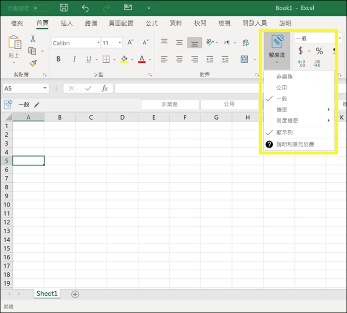

### Mac 上的 Office 應用程式

在 Mac 裝置上的 Office 應用程式中，敏感度標籤會顯示在功能區上 [常用]**** 索引標籤的 [敏感度]**** 按鈕中。套用的標籤也會顯示在視窗底部的狀態列中。

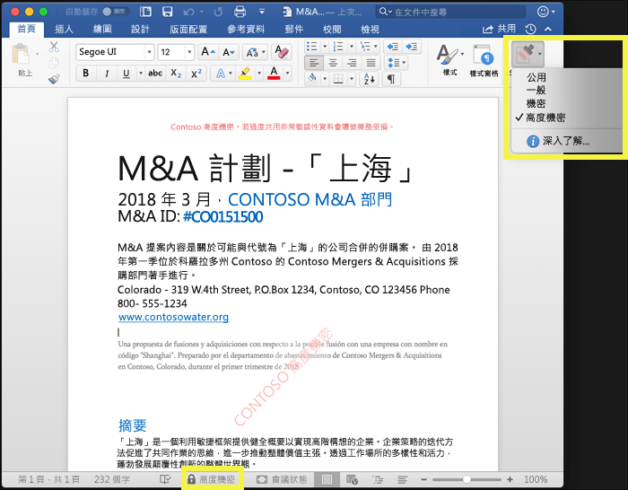

### iOS 上的 Office 應用程式

在 iOS 裝置上的 Office 應用程式中，敏感度標籤會顯示在功能區上 [常用]**** 索引標籤的 [敏感度]**** 按鈕中。套用的標籤也會顯示在視窗底部的狀態列中。

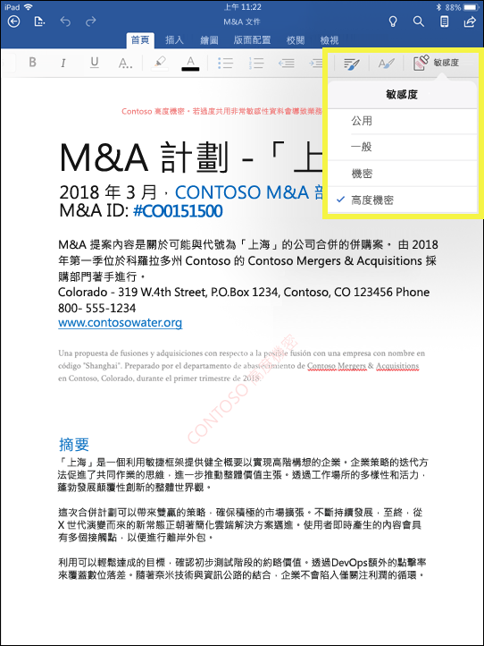

### Android 上的 Office 應用程式

在 Android 裝置上的 Office 應用程式中，敏感度標籤會顯示在功能區上 [常用]**** 索引標籤的 [敏感度]**** 按鈕中。套用的標籤也會顯示在視窗底部的狀態列中。

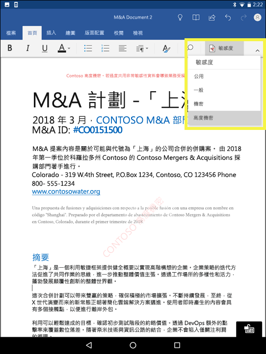

### Office 應用程式中敏感度標籤的詳細資訊

- [在 Office 中將敏感度標籤套用至您的文件和電子郵件](https://support.office.com/zh-TW/article/apply-sensitivity-labels-to-your-documents-and-email-within-office-2f96e7cd-d5a4-403b-8bd7-4cc636bae0f9)
- [將敏感度標籤套用至 Office 檔案的已知問題](https://support.office.com/zh-TW/article/known-issues-when-you-apply-sensitivity-labels-to-your-office-files-b169d687-2bbd-4e21-a440-7da1b2743edc)

## 敏感度標籤如何搭配使用現有的 Azure 資訊保護標籤

Azure 資訊保護使用者目前可藉由使用 Azure 資訊保護整合標籤用戶端，在 Windows 上分類和標記內容。現有的 Azure 資訊保護標籤與新的敏感度標籤可順利搭配運作。這表示您可以：

- 在文件和電子郵件上保留現有的 Azure 資訊保護標籤。
- 保留現有的 Azure 資訊保護標籤設定。

如果您使用 Azure 資訊保護標籤，現在我們建議您避免在安全性與合規性中心建立新的標籤，直到您完成移轉。[Azure 資訊保護移轉主題](https://docs.microsoft.com/zh-TW/azure/information-protection/configure-policy-migrate-labels)提供重要的資訊和一些特定警告。如果您尚未準備好移轉您的生產環境租用戶至敏感度標籤，您不須擔心：目前使用者可以繼續使用 Azure 資訊保護用戶端，且系統管理員可以繼續使用 Azure 入口網站進行管理。

## 使用 Microsoft Intune 中的端點保護來保護 Windows 裝置上的內容

建立敏感度標籤時，您可以告知 Windows 具有此標籤的檔案為敏感且儲存在 Windows 裝置上時需要防止資料外洩。此選項可協助確保具有此標籤的內容只能共用或複製到批准的位置，即使是儲存在端點上。基本上，開啟敏感度標籤的此選項會告訴 Windows 這是非常重要的資料，並保證其他的使用限制。

當您開啟此選項，Windows 可以讀取、了解及對文件中的敏感度標籤採取動作，並自動對內容套用 Windows 資訊保護 (WIP)，不論其如何觸及受管理的 Windows 裝置。在無論是否套用加密的情況下，這有助於防止標記的檔案發生意外洩漏。

比方說，Windows 可了解位於使用者電腦上的 Word 文件已套用「機密」標籤，且 WIP 可套用應用程式保護原則，以避免將資料複製或共用到該裝置的任何非工作位置 (例如個人 OneDrive、個人電子郵件帳戶、社群媒體或 USB 磁碟機)。

如果使用者嘗試將已標記的內容上傳到個人 Gmail 帳戶，他們會看到這則訊息。

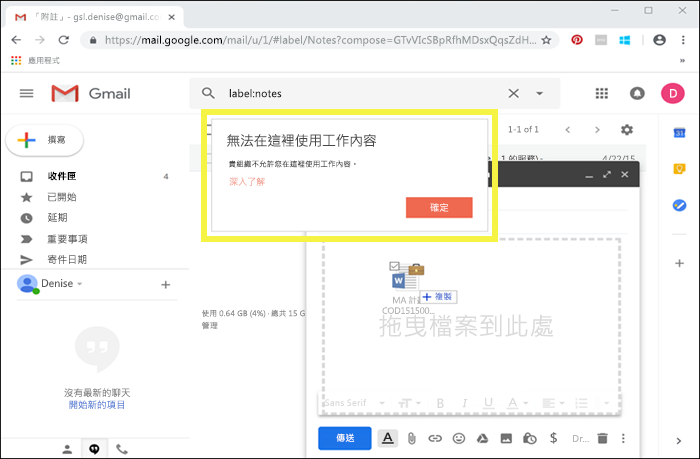

如果使用者嘗試將已標記的內容儲存到 USB 磁碟機，他們會看到這則訊息。

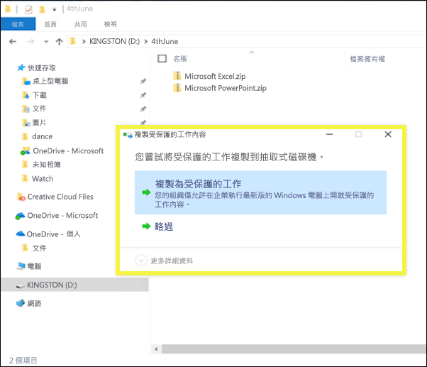

### 重要的先決條件

在敏感度標籤可使用 WIP 之前，您必須先執行下文所述的先決條件：[Windows 資訊保護如何保護具有敏感度標籤的檔案](https://docs.microsoft.com/en-us/windows/security/information-protection/windows-information-protection/how-wip-works-with-labels?branch=vsts17546553)。本主題將說明下列先決條件：

- 請確定您執行的是 Windows 10，版本 1809 或更新版本。
- [設定 Windows Defender 進階威脅防護 (WDATP)](https://docs.microsoft.com/zh-TW/windows/security/threat-protection/windows-defender-atp/get-started)，這會掃描內容以找出標籤，並套用對應的 WIP 保護。ATP 會在 WIP 之外獨立執行某些動作，例如報告異常狀況。
- 建立可套用至端點裝置的 Windows 資訊保護 (WIP) 原則。您可以在下列任何位置執行此作業：
    - [為 Microsoft Intune 使用 Azure 入口網站透過 MDM 建立 Windows 資訊保護 (WIP) 原則](https://docs.microsoft.com/zh-TW/windows/security/information-protection/windows-information-protection/create-wip-policy-using-intune-azure)
    - [使用 System Center Configuration Manager 建立及部署 Windows 資訊保護 (WIP) 原則](https://docs.microsoft.com/zh-TW/windows/security/information-protection/windows-information-protection/create-wip-policy-using-sccm)

## 使用 Microsoft 資訊保護 SDK 將敏感度標籤擴充至協力廠商應用程式和服務

由於敏感度標籤在文件的中繼資料內保存為純文字，協力廠商應用程式和服務可以選擇支援識別及保護含有這類標籤的內容。其他應用程式和服務的支援已展開。

使用 [Microsoft 資訊保護 SDK](https://docs.microsoft.com/zh-TW/information-protection/develop/)，協力廠商應用程式和服務可以讀取並將敏感度標籤和保護套用至文件。SDK 支援 Windows、Mac 和 Linux 上的應用程式。iOS 和 Android 應用程式的支援即將推出。

使用 SDK，您可以標記及保護內容，並搭配其他 Microsoft 資訊保護應用程式和服務，如 Office 應用程式、Office 365 服務、Azure 資訊保護掃描器、Microsoft Cloud App Security，以及多種其他的合作夥伴解決方案。例如，深入了解 [Adobe Acrobat 中敏感度標籤的支援](https://techcommunity.microsoft.com/t5/Azure-Information-Protection/Starting-October-use-Adobe-Acrobat-Reader-for-PDFs-protected-by/ba-p/262738)。

若要深入了解 Microsoft 資訊保護 SDK，請參閱[技術社群部落格上的公告](https://techcommunity.microsoft.com/t5/Microsoft-Information-Protection/Microsoft-Information-Protection-SDK-Now-Generally-Available/ba-p/263144)。您也可以了解[與 Microsoft 資訊保護整合的合作夥伴解決方案](https://techcommunity.microsoft.com/t5/Azure-Information-Protection/Microsoft-Information-Protection-showcases-integrated-partner/ba-p/262657)。

## 權限

您的法務小組中將建立敏感度標籤的成員必須具備安全性與合規性中心的權限。根據預設，租用戶管理員將可存取此位置，並且可直接讓法務人員與其他人存取安全性與合規性中心，而不需要為其提供租用戶管理員的所有權限。若要這麼做，我們建議您：移至安全性與合規性中心的 [權限]**** 頁面，編輯 [規範管理員]**** 角色群組，將該成員加入此角色群組。

如需詳細資訊，請參閱授與使用者存取 Office 365 安全性與合規性中心的權限。

需要這些權限才能建立及套用標籤和標籤原則。原則強制執行不需要內容的存取權。
