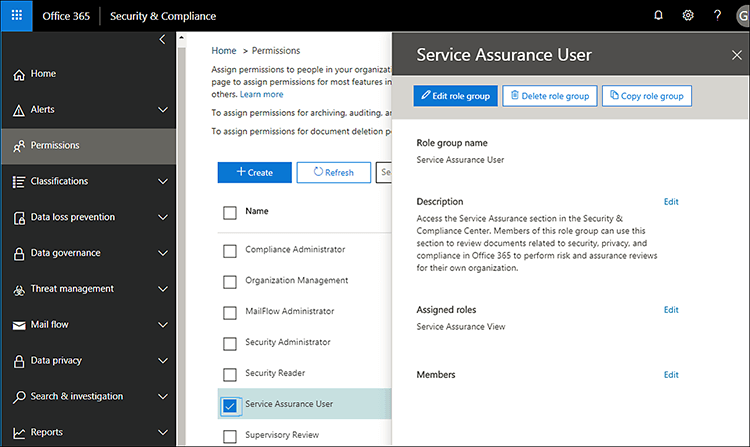

# 安全性 & 合規性中心中的服務保證Service assurance in the Security & Compliance Center

存取文件的說明主題，包括各種安全性 & 合規性中心中使用的服務保證：Use Service assurance in the Security & Compliance Center to access documents that describe a variety of topics, including: 
  
- Microsoft Office 365 中儲存的客戶資料的安全性作法。Microsoft security practices for customer data that is stored in Office 365. 
    
- Office 365 的獨立協力廠商稽核報告。Independent third-party audit reports of Office 365. 
    
- 實作和測試詳細資料安全性、 隱私權和相容性控制 Office 365 使用來保護您的資料。Implementation and testing details for security, privacy, and compliance controls that Office 365 uses to protect your data. 
    
您也可以了解 Office 365 如何協助客戶符合標準、 法律和法規產業，例如:You can also find out how Office 365 can help customers comply with standards, laws, and regulations across industries, such as the:
  
-  國際標準 (ISO) 27001 和 27018 組織International Organization for Standardization (ISO) 27001 and 27018 
    
- 1996 年美國醫療保險轉移與責任法案 (HIPAA)Health Insurance Portability and Accountability Act of 1996 (HIPAA)
    
- 聯邦風險與授權管理計劃 (FedRAMP)Federal Risk and Authorization Management Program (FedRAMP)
    
## 誰可以存取 Office 365 服務保證，以及如何？Who can access Office 365 Service assurance, and how?

 **新客戶及評估 Microsoft online services 客戶**可以存取服務保證這是隨附於 Office 365 企業版 E3 和 E5 方案 （試用版和付費訂閱）。**New customers, and customers evaluating Microsoft online services** can access Service assurance which is included with Office 365 Enterprise E3 and E5 plans (both trial and paid subscriptions). 如果您不具有其中一個方案，並想要再試的服務保證，您可以[註冊 Office 365 企業版 E5 的試用版](https://go.microsoft.com/fwlink/p/?LinkID=698279)。If you don't have one of these plans and want to try Service assurance, you can [sign-up for a trial of Office 365 Enterprise E5](https://go.microsoft.com/fwlink/p/?LinkID=698279). 
  
 **商務用 Office 365 的現有客戶**可以存取的服務保證。**Existing customers of Office 365 for business** can access Service assurance. 如果您是 （有時稱為 「 公司系統管理員） 的 Office 365 全域系統管理員為您的組織，您將已服務保證的存取，且您上架可以其他人。If you're the Office 365 global admin (sometimes called company administrator) for your organization, you'll already have access to Service assurance, and you can onboard others. 如果您沒有 Office 365 全域系統管理員為您的組織，且您需要的服務保證的存取，請詢問您的系統管理員將您新增至服務保證使用者角色群組。If you're not the Office 365 global admin for your organization, and you need access to Service assurance, ask your admin to add you to the Service Assurance User role group. 
  
 **O365 訂閱成員**可以存取 Office365 防護中心中的服務保證一節，根據預設，如果在您的訂閱尚未實作服務保證角色型存取。**O365 Subscription Members** can access the Service assurance section in the Office365 Protection Center by default if Service assurance roles-based access has not been implemented in your subscription. 服務保證提供報表及說明 Microsoft 的安全性作法，儲存在 Office 365 的客戶資料的文件。Service assurance provides reports and documents that describe Microsoft's security practices for customer data that's stored in Office 365. 它也會提供有關 Office 365 的獨立第三方稽核報告。It also provides independent third-party audit reports on Office 365. 
  
> [!NOTE]
> 附註： 如果貴公司已在您的 Office 365 訂閱 （這可能是如果您的組織提供了存取自訂報告），實作 Service Assurance Roles-Based 存取和您需要的存取權的服務保證但它不會納入左邊窗格中的安全性 & 合規性中心，要求您的 Office 365 系統管理員，將您新增至 [**權限**] 頁面上的服務保證使用者角色群組。Note: If your company has implemented Service Assurance Roles-Based Access in your Office 365 Subscription (which could be if your organization has been provided access to custom reports), and you need access to Service assurance but it is not included in the left pane of the Security & Compliance Center, ask your Office 365 administrator to add you to the Service Assurance User role group on the **Permissions** page. 如需詳細資訊，請參閱 Onboard 其他服務保證使用者或群組。For more information, see Onboard other Service assurance users or groups. 
  
 **服務保證角色型存取佈建使用者**如果貴公司已實作角色型存取保證服務，您可以提供服務保證的存取權給所有的安全性與合規性工作人員包括資訊安全性風險管理、 規範、 和稽核內的人員及小組您組織。**Service assurance roles-based access-provisioned users** If your company has implemented Service assurance roles-based access, you can provide Service assurance access to all security and compliance personnel including information security, risk management, compliance, and audit teams and personnel within your organization. 如需詳細資訊，請參閱[Onboard 其他服務保證使用者或群組](service-assurance.md#addother)。For details, see [Onboard other Service assurance users or groups](service-assurance.md#addother).
  
服務保證是可存取使用安全性 & 合規性中心。Service assurance is accessible by using the Security & Compliance Center. 以下是如何取得該處。Here's how to get to there.
  
1. 移至 [https://protection.office.com](https://protection.office.com)。Go to [https://protection.office.com](https://protection.office.com).
    
2. 使用公司或學校帳戶登入 Office 365。Sign in to Office 365 using your work or school account. 
    
3. 在左窗格中，選取 [**服務保證**。In the left pane, select **Service assurance**. 下一步]，[選擇您的企業和地區設定](service-assurance.md#Chooseyourindustryregional)與[Onboard 其他服務保證使用者或群組](service-assurance.md#addother)。Next, [Choose your industry and regional settings](service-assurance.md#Chooseyourindustryregional) and [Onboard other Service assurance users or groups](service-assurance.md#addother).
    
    > [!NOTE]
    > 如果您需要存取服務保證，它將不會包含安全性 & 合規性中心的左窗格中，要求您的 Office 365 系統管理員，將您新增至 [**權限**] 頁面上的服務保證使用者角色群組。If you need access to Service assurance, and it's not included in the left pane of the Security & Compliance Center, ask your Office 365 administrator to add you to the Service Assurance User role group on the **Permissions** page. 
  
## 選擇您的產業和地區設定Choose your industry and regional settings

當您存取服務保證第一次時，第一個步驟是設定您的產業和地區設定。When you access Service assurance for the first time, the first step is to configure your industry and regional settings. 您可以隨時變更這些設定。You can change these settings at any time. 設定這些設定可讓您提供內容，是貴組織最相關的服務保證。Configuring these settings enables Service assurance to provide you with content that is most relevant to your organization. 若要設定您的產業和地區設定：To configure your industry and region settings:
  
1. 存取服務保證後，請選取 [**設定**和區域及產業設定 」 頁面會顯示下列螢幕擷取畫面所示。After you access Service assurance, select **Settings** and the Region and industry settings page displays as shown in the following screenshot. 
    
    ![顯示 [防護中心設定] 頁面。](media/101716e8-9c0a-4839-a2c0-f6aacf64eb9d.png)
  
2. 在 [**設定**] 頁面上選取**區域**] 旁的向下箭號，並檢查為您的組織適當的區域。On the **Settings** page, select the down arrow next to **Region** and check the appropriate regions for your organization. 
    
3. 選取**產業**旁的向下箭號，並檢查組織的適當產業。Select the down arrow next to **Industry** and check the appropriate industries for your organization. 
    
4. 一旦您已選取區域及產業，選取 [**儲存**]。Once you have selected regions and industries, select **Save**.
    
## 找出、 檢閱並下載規範及信任的內容Find, review, and download compliance and trust content

若要檢閱並下載內容，請從功能窗格中選取選項：To review and download content, select an option from the navigation pane:
  
- 若要檢視獨立稽核和評估 Office 365 和其他 Microsoft 雲端服務，如下列螢幕畫面中所示的**規範符合性報告**擷取畫面。**Compliance reports** to view independent audits and assessments of Office 365 and other Microsoft cloud services as shown in the following screen shot. 
    
    
  
- [**信任的文件**] 以檢視 Microsoft 如何運作 Office 365，如下列螢幕畫面中所示的資訊擷取畫面。**Trust documents** to view information about how Microsoft operates Office 365 as shown in the following screen shot. 
    
    
  
- 若要檢視 Office 365 的控制的相關資訊的**稽核控制項**符合安全性、 規範和隱私權需求，如下列螢幕擷取畫面所示。**Audited controls** to view information about how Office 365 controls meet security, compliance, and privacy requirements, as shown in the following screen shot. 
    
    
  
選取您想要下載的報表，然後選取 [**儲存**] 以下載到您的電腦。Select the report you want to download, and select **Save** to download it to your computer. 稽核控制項，選取您想要然後選取 [**下載**報告。For Audited controls, select the report you want and then select **Download**. 下表說明您可以找到每個服務保證頁面上的報告。The table below describes the reports you can find on each Service assurance page. 
  
> [!NOTE]
> 服務保證報告和文件可供下載的至少有 12 個月發佈之後，或直到文件的新版本有空。Service assurance reports and documents are available to download for at least twelve months after publishing or until a new version of the document becomes available. 
  
|**服務保證頁面****Service assurance page**|**可用的內容****Content available**|**描述****Description**|
|:-----|:-----|:-----|
|規範符合性報告Compliance reports    | FedRampFedRamp     GRC 評估GRC Assessment     ISOISO     SOC/SSAESOC/SSAE    |使用服務合規性報告來檢閱所的 Office 365 服務傳遞作業的第三方獨立稽核員執行的稽核評估。Use service compliance reports to review audit assessments performed by third-party independent auditors of Office 365 Service Delivery Operations.    |
|信任文件Trust documents    | 常見問題集及白皮書FAQ and White Papers     風險管理報告Risk Management Reports    |使用白皮書、 常見問題集、 結束的年度報告和其他 Microsoft 機密文件的資源，供您檢閱的保密合約所授予 / 風險評定。Use white papers, FAQs, end-of-year reports and other Microsoft Confidential resources that are made available to you under non-disclosure agreement for your review / risk assessments.    |
|稽核的控制項Audited controls    |全球標準與法規已實作 Office 365。Global standards and regulations that Office 365 has implemented.    | 與風險評定時您正在評估、 上架，或使用 Office 365 服務說明。Help with risk-assessment when you're evaluating, onboarding, or using Office 365 services. 了解：Find out:     -如何 Office 365 控制符合安全性、 規範和隱私權需求。- How Office 365 controls meet security, compliance, and privacy requirements.   -關於測試 Office 365 中的控制項，就會產生這些測試，以及他們已完成。-  About testing of controls in Office 365, results of these tests, and when they were completed.    |
   
根據您特定的正確設定，包含在檢視中的選項可能會有一些差異。Depending on your specific set-up, options included in your view might have some differences.
  
## 上架其他服務保證使用者或群組Onboard other Service assurance users or groups

存取預設可用報告通常跨越所有的 Microsoft Cloud 訂閱，您不需要實作的服務保證角色型存取模型，您可以略過此步驟。For accessing default reports that are generally available across all Microsoft Cloud subscriptions, you don't need to implement the Service Assurance roles-based access model and you can skip this step. 不過，如果您的組織所提供的存取權的自訂報告然後請加入其他使用者或群組的服務保證角色。However, if your organization has been provided access to custom reports then please add other users or groups to the Service Assurance roles. 若要新增其他使用者或群組：To add other users or groups:
  
1. 在安全性 & 合規性中心中，選取**權限**的左窗格中，如下列螢幕擷取畫面所示。In the Security & Compliance Center, select **Permissions** in the left pane as shown in the following screenshot. 
    
    ![安全性&amp;符合性權限] 功能表](media/8b479ad4-5c91-4e4c-a1db-372d50526db6.png)
  
2. 在右窗格中，選取**服務保證使用者**，然後選取**編輯角色群組**，並在 [**成員**] 區段中，選取 [**編輯**] 以將成員新增至服務保證使用者角色，如下列螢幕擷取畫面所示。In the right pane, select **Service Assurance User**, and then select **Edit Role Group**, and under the **Members** section, select **Edit** to add members to the Service Assurance User role as shown in the following screenshot. 
    
    
  
3. 在下一步] 對話方塊中，搜尋並選擇 [個人或群組，需要檢視服務保證規範符合性報告與信任] 資源，然後選取 [**新增**您進行，然後按一下 [中] 窗格右上角的**X**每個選取範圍時完成作業後。In the next dialog box, search for and choose individuals or groups that need to view Service assurance compliance reports and trust resources, then select **Add** for each selection you make and click the **X** in the upper right corner of the pane when you're finished. 
    
    
  
4. 每個使用者或群組新增至服務保證使用者角色現在尋找服務保證和下載報告和其他安全性 & 合規性中心中的文件。Every user or group that you added to the Service Assurance User role can now find Service assurance and download reports and other documents in the Security & Compliance Center.
    
若要新增更多使用者隨時返回 [**權限**] 頁面上，或移除現有的。Return to the **Permissions** page at any time to add more users, or remove existing ones. 
  
## 取得服務保證的說明Get help with Service assurance

[商務版產品-系統管理說明連絡支援服務](https://support.office.com/article/32a17ca7-6fa0-4870-8a8d-e25ba4ccfd4b)。[Contact support for business products - Admin Help](https://support.office.com/article/32a17ca7-6fa0-4870-8a8d-e25ba4ccfd4b).
  
## 常見問題集Frequently Asked Questions

 **為什麼會收到錯誤訊息說明從服務保證的文件已損毀？****Why am I getting an error saying that documents from Service assurance are corrupted?**
  
大部分的服務保證文件是以 PDF 格式。Most Service assurance documents are in PDF format. 選擇 [**儲存**] 以儲存這些檔案，然後再開啟它們從本機電腦。Choose **Save** to save these files to, and then open them up from, your local computer. 
