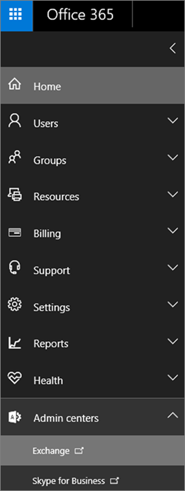

# <a name="set-up-an-archive-and-deletion-policy-for-mailboxes-in-your-office-365-organization"></a><span data-ttu-id="c12dc-103">設定 Office 365 組織中信箱的封存和刪除原則</span><span class="sxs-lookup"><span data-stu-id="c12dc-103">Set up an archive and deletion policy for mailboxes in your Office 365 organization</span></span>

 <span data-ttu-id="c12dc-104">在 Office 365 系統管理員可以建立封存與刪除原則會自動將項目移至使用者的封存信箱，自動從信箱中刪除項目。</span><span class="sxs-lookup"><span data-stu-id="c12dc-104">In Office 365, admins can create an archiving and deletion policy that automatically moves items to a user's archive mailbox and automatically deletes items from the mailbox.</span></span> <span data-ttu-id="c12dc-105">系統管理員會執行此動作所建立的保留原則指派給信箱，並將項目移至使用者的封存信箱之後一段時間，也會刪除項目從信箱後到達特定存留期限制。</span><span class="sxs-lookup"><span data-stu-id="c12dc-105">The admin does this by creating a retention policy that's assigned to mailboxes, and moves items to a user's archive mailbox after a certain period of time and that also deletes items from the mailbox after they reach a certain age limit.</span></span> <span data-ttu-id="c12dc-106">實際的規則，判斷哪些項目已移動或刪除，當發生這種情況時所呼叫的保留標記。</span><span class="sxs-lookup"><span data-stu-id="c12dc-106">The actual rules that determine what items are moved or deleted and when that happens are called retention tags.</span></span> <span data-ttu-id="c12dc-107">保留標記連結至保留原則，接著是指派給使用者的信箱。</span><span class="sxs-lookup"><span data-stu-id="c12dc-107">Retention tags are linked to a retention policy, that in turn is assigned to a user's mailbox.</span></span> <span data-ttu-id="c12dc-108">保留標記會將保留設定套用至個別郵件與使用者的信箱中的資料夾。</span><span class="sxs-lookup"><span data-stu-id="c12dc-108">A retention tag applies retention settings to individual messages and folders in a user's mailbox.</span></span> <span data-ttu-id="c12dc-109">它會定義多久一則訊息仍會保留在信箱，以及當郵件達到指定的保留時間時不會採取什麼動作。</span><span class="sxs-lookup"><span data-stu-id="c12dc-109">It defines how long a message remains in the mailbox and what action is taken when the message reaches the specified retention age.</span></span> <span data-ttu-id="c12dc-110">當郵件達到保留時間時，則可以移至使用者的封存信箱，或將它刪除。</span><span class="sxs-lookup"><span data-stu-id="c12dc-110">When a message reaches its retention age, it's either moved to the user's archive mailbox or it's deleted.</span></span> 
  
<span data-ttu-id="c12dc-111">本文中的步驟，將會設定名為 [高山屋虛構組織的封存和保留原則。</span><span class="sxs-lookup"><span data-stu-id="c12dc-111">The steps in this article will set up an archiving and retention policy for a fictitious organization named Alpine House.</span></span> <span data-ttu-id="c12dc-112">設定此原則包含下列工作：</span><span class="sxs-lookup"><span data-stu-id="c12dc-112">Setting up this policy includes the following tasks:</span></span>
  
- <span data-ttu-id="c12dc-113">讓組織中每個使用者的封存信箱。</span><span class="sxs-lookup"><span data-stu-id="c12dc-113">Enabling an archive mailbox for every user in the organization.</span></span> <span data-ttu-id="c12dc-114">這讓使用者可以新增信箱儲存空間，且需要使保留原則可以將項目移至封存信箱。</span><span class="sxs-lookup"><span data-stu-id="c12dc-114">This gives users addition mailbox storage, and is required so that a retention policy can move items to the archive mailbox.</span></span> <span data-ttu-id="c12dc-115">它也讓我們所移動的使用者存放區保存資訊項目到其封存信箱。</span><span class="sxs-lookup"><span data-stu-id="c12dc-115">It also let's a user store archival information by moving items to their archive mailbox.</span></span> 
    
- <span data-ttu-id="c12dc-116">建立三個自訂的保留標記，請執行下列動作：</span><span class="sxs-lookup"><span data-stu-id="c12dc-116">Creating three custom retention tags that do the following:</span></span> 
    
  - <span data-ttu-id="c12dc-117">會自動移至使用者的封存信箱 3 年的項目。</span><span class="sxs-lookup"><span data-stu-id="c12dc-117">Automatically moves items that are 3 years old to the user's archive mailbox.</span></span> <span data-ttu-id="c12dc-118">將項目移至封存信箱會釋放使用者的主要信箱中的空間。</span><span class="sxs-lookup"><span data-stu-id="c12dc-118">Moving items to the archive mailbox frees up space in a user's primary mailbox.</span></span>
    
  - <span data-ttu-id="c12dc-119">自動刪除舊的 5 年是從 [刪除的項目] 資料夾的項目。</span><span class="sxs-lookup"><span data-stu-id="c12dc-119">Automatically deletes items that are 5 years old from the Deleted Items folder.</span></span> <span data-ttu-id="c12dc-120">這也會釋放使用者的主要信箱中的空間。</span><span class="sxs-lookup"><span data-stu-id="c12dc-120">This also frees up space in the user's primary mailbox.</span></span> <span data-ttu-id="c12dc-121">使用者有機會復原這些項目，如有必要。</span><span class="sxs-lookup"><span data-stu-id="c12dc-121">User's will have the opportunity to recover these items if necessary.</span></span> <span data-ttu-id="c12dc-122">如需詳細資訊的[詳細資訊](#more-information)一節中的註腳，請參閱。</span><span class="sxs-lookup"><span data-stu-id="c12dc-122">See the footnote in the [More information](#more-information) section for more details.</span></span> 
    
  - <span data-ttu-id="c12dc-123">自動 （和永久） 會刪除 7 年舊從這兩個主要和封存信箱的項目。</span><span class="sxs-lookup"><span data-stu-id="c12dc-123">Automatically (and permanently) deletes items that are 7 years old from both the primary and archive mailbox.</span></span> <span data-ttu-id="c12dc-124">合規性法規，因為某些組織所需的一段時間保留電子郵件。</span><span class="sxs-lookup"><span data-stu-id="c12dc-124">Because of compliance regulations, some organization's are required to retain email for a certain period of time.</span></span> <span data-ttu-id="c12dc-125">這段時間逾期之後，組織可能會想要永久移除這些項目的使用者信箱。</span><span class="sxs-lookup"><span data-stu-id="c12dc-125">After this time period expires, an organization might want to permanently remove these items user mailboxes.</span></span> 
    
- <span data-ttu-id="c12dc-126">建立新的保留原則，並將新的自訂保留標籤加入至其中。</span><span class="sxs-lookup"><span data-stu-id="c12dc-126">Creating a new retention policy and adding the new custom retention tags to it.</span></span> <span data-ttu-id="c12dc-127">此外，您也會將內建的保留標記新增至新的保留原則。</span><span class="sxs-lookup"><span data-stu-id="c12dc-127">Additionally, you'll also add built-in retention tags to the new retention policy.</span></span> <span data-ttu-id="c12dc-128">這包括個人標記，使用者可以將指派給他們的信箱中的項目。</span><span class="sxs-lookup"><span data-stu-id="c12dc-128">This includes personal tags that users can assign to items in their mailbox.</span></span> <span data-ttu-id="c12dc-129">您也將新增將項目從使用者的主要信箱中的 [可復原的項目] 資料夾移到其封存信箱中 [可復原的項目] 資料夾的保留標記。</span><span class="sxs-lookup"><span data-stu-id="c12dc-129">You'll also add a retention tag that moves items from the Recoverable Items folder in the user's primary mailbox to the Recoverable Items folder in their archive mailbox.</span></span> <span data-ttu-id="c12dc-130">這可協助釋出空間使用者 [可復原的項目] 資料夾中他們的信箱處於保留狀態時。</span><span class="sxs-lookup"><span data-stu-id="c12dc-130">This helps free up space in a user's Recoverable Items folder when their mailbox is placed on hold.</span></span>
    
<span data-ttu-id="c12dc-131">您可以遵循部分或全部本篇文章以設定您的組織中信箱的封存和刪除原則] 中的步驟。</span><span class="sxs-lookup"><span data-stu-id="c12dc-131">You can follow some or all of the steps in this article to set up an archive and deletion policy for mailboxes in your own organization.</span></span> <span data-ttu-id="c12dc-132">我們建議您測試幾個信箱上的此程序，再實作您的組織中所有信箱。</span><span class="sxs-lookup"><span data-stu-id="c12dc-132">We recommend that you test this process on a few mailboxes before implementing it on all mailboxes in your organization.</span></span>
  
## <a name="before-you-begin"></a><span data-ttu-id="c12dc-133">開始之前</span><span class="sxs-lookup"><span data-stu-id="c12dc-133">Before you begin</span></span>

- <span data-ttu-id="c12dc-134">您必須是全域系統管理員在 Office 365 組織中執行本主題中的步驟。</span><span class="sxs-lookup"><span data-stu-id="c12dc-134">You have to be a global administrator in your Office 365 organization to perform the steps in this topic.</span></span> 
    
-  <span data-ttu-id="c12dc-135">當您在 Office 365 中建立新的使用者帳戶，並對使用者指派 Exchange Online 授權時，信箱會自動建立的使用者。</span><span class="sxs-lookup"><span data-stu-id="c12dc-135">When you create a new user account in Office 365 and assign the user an Exchange Online license, a mailbox is automatically created for the user.</span></span> <span data-ttu-id="c12dc-136">建立信箱時，它已自動指派預設保留原則，名為 「 預設 MRM 原則。</span><span class="sxs-lookup"><span data-stu-id="c12dc-136">When the mailbox is created, it's automatically assigned a default retention policy, named Default MRM Policy.</span></span> <span data-ttu-id="c12dc-137">在本文中，您會建立新的保留原則，並再將其指派給使用者的信箱，取代預設 MRM 原則。</span><span class="sxs-lookup"><span data-stu-id="c12dc-137">In this article, you will create a new retention policy and then assign it to user mailboxes, replacing the Default MRM policy.</span></span> <span data-ttu-id="c12dc-138">信箱只能有一個一次指派給它的保留原則。</span><span class="sxs-lookup"><span data-stu-id="c12dc-138">A mailbox can have only one retention policy assigned to it at any one time.</span></span>
    
- <span data-ttu-id="c12dc-139">若要深入了解保留標記和保留原則在 Exchange Online，請參閱[保留標記和保留原則](https://go.microsoft.com/fwlink/p/?LinkId=404424)。</span><span class="sxs-lookup"><span data-stu-id="c12dc-139">To learn more about retention tags and retention policies in Exchange Online, see [Retention tags and retention policies](https://go.microsoft.com/fwlink/p/?LinkId=404424).</span></span>
    
## <a name="step-1-enable-archive-mailboxes-for-users"></a><span data-ttu-id="c12dc-140">步驟 1： 啟用封存信箱的使用者</span><span class="sxs-lookup"><span data-stu-id="c12dc-140">Step 1: Enable archive mailboxes for users</span></span>

<span data-ttu-id="c12dc-141">第一個步驟是啟用組織中每位使用者的封存信箱。</span><span class="sxs-lookup"><span data-stu-id="c12dc-141">The first step is to enable the archive mailbox for each user in your organization.</span></span> <span data-ttu-id="c12dc-142">使用者的封存信箱已啟用，如此以 「 移到封存 」 保留動作的保留標記可以移動項目保留期間到期後。</span><span class="sxs-lookup"><span data-stu-id="c12dc-142">A user's archive mailbox has to be enabled so that a retention tag with a "Move to Archive" retention action can move the item after the retention age expires.</span></span> 
  
> [!NOTE]
> <span data-ttu-id="c12dc-143">可以啟用封存信箱在這過程中，任何時間只是，只要已加以啟用在某個時間點之前完成程序。</span><span class="sxs-lookup"><span data-stu-id="c12dc-143">You can enable archive mailboxes any time during this process, just as long as they're enabled at some point before you complete the process.</span></span> <span data-ttu-id="c12dc-144">如果未啟用封存信箱，在 [封存原則指派給它的任何項目會不採取任何動作。</span><span class="sxs-lookup"><span data-stu-id="c12dc-144">If an archive mailbox isn't enabled, no action is taken on any items that have an archive policy assigned to it.</span></span> 
  
1. <span data-ttu-id="c12dc-145">請移至 [https://protection.office.com](https://protection.office.com)。</span><span class="sxs-lookup"><span data-stu-id="c12dc-145">Go to [https://protection.office.com](https://protection.office.com).</span></span>
    
2. <span data-ttu-id="c12dc-146">Sign in to Office 365 using your global administrator account.</span><span class="sxs-lookup"><span data-stu-id="c12dc-146">Sign in to Office 365 using your global administrator account.</span></span>
    
    
3. <span data-ttu-id="c12dc-147">在 [安全性 & 合規性中心，移至 [**資料控管** \> **封存**。</span><span class="sxs-lookup"><span data-stu-id="c12dc-147">In the Security & Compliance Center, go to **Data governance** \> **Archive**.</span></span>
    
    <span data-ttu-id="c12dc-148">會顯示組織中信箱的清單及對應的封存信箱是否已啟用或停用。</span><span class="sxs-lookup"><span data-stu-id="c12dc-148">A list of the mailboxes in your organization is displayed and whether the corresponding archive mailbox is enabled or disabled.</span></span> 
    
4. <span data-ttu-id="c12dc-149">選取所有的信箱上的 [第一個在清單中，按住**Shift**鍵，然後按一下清單中的最後一個。</span><span class="sxs-lookup"><span data-stu-id="c12dc-149">Select all the mailboxes by clicking on the first one in the list, holding down the **Shift** key, and then clicking the last one in the list.</span></span> 
    
    > [!TIP]
    > <span data-ttu-id="c12dc-150">這個步驟假設沒有封存信箱已啟用。</span><span class="sxs-lookup"><span data-stu-id="c12dc-150">This step assumes that no archive mailboxes are enabled.</span></span> <span data-ttu-id="c12dc-151">如果您有任何信箱以啟用封存時，按住**Ctrl**鍵，然後按一下 [已停用的封存信箱每個信箱。</span><span class="sxs-lookup"><span data-stu-id="c12dc-151">If you have any mailboxes with the archive enabled, hold down the **Ctrl** key and click each mailbox that has a disabled archive mailbox.</span></span> <span data-ttu-id="c12dc-152">或者，您可以按一下 [**封存信箱**] 欄標題來排序根據是否啟用或停用，以方便選取信箱的封存信箱的資料列。</span><span class="sxs-lookup"><span data-stu-id="c12dc-152">Or you can click the **Archive mailbox** column header to sort the rows based on whether the archive mailbox is enabled or disabled to make it easier to select mailboxes.</span></span> 
  
5. <span data-ttu-id="c12dc-153">在詳細資料] 窗格中，[**大量編輯**，請按一下 [**啟用**。</span><span class="sxs-lookup"><span data-stu-id="c12dc-153">In the details pane, under **Bulk Edit**, click **Enable**.</span></span>
    
    <span data-ttu-id="c12dc-154">會顯示警告，指出超過兩年內的項目，將會移至新的封存信箱。</span><span class="sxs-lookup"><span data-stu-id="c12dc-154">A warning is displayed saying that items that are older than two years will be moved to the new archive mailbox.</span></span> <span data-ttu-id="c12dc-155">這是因為已指派新的使用者信箱，會在建立時的預設保留原則已有 2 年保留期限封存預設原則標記。</span><span class="sxs-lookup"><span data-stu-id="c12dc-155">This is because the default retention policy that's assigned a new user mailbox when it's created has an archive default policy tag that has a retention age of 2 years.</span></span> <span data-ttu-id="c12dc-156">您在步驟 2 中建立的自訂封存預設原則標記都有 3 年保留期限。</span><span class="sxs-lookup"><span data-stu-id="c12dc-156">The custom archive default policy tag that you'll create in Step 2 has a retention age of 3 years.</span></span> <span data-ttu-id="c12dc-157">這表示 3 年的項目或更舊版本將移至封存信箱。</span><span class="sxs-lookup"><span data-stu-id="c12dc-157">That means items that are 3 years or older will be moved to the archive mailbox.</span></span>
    
6. <span data-ttu-id="c12dc-158">按一下 [ **]** 關閉警告訊息，然後啟動程序，啟用每個選取的信箱的封存信箱。</span><span class="sxs-lookup"><span data-stu-id="c12dc-158">Click **Yes** to close the warning message and start the process to enable the archive mailbox for each selected mailbox.</span></span> 
    
7. <span data-ttu-id="c12dc-159">處理程序完成時，按一下 [**重新整理**來更新 [**封存**] 頁面上的清單。</span><span class="sxs-lookup"><span data-stu-id="c12dc-159">When the process is complete, click **Refresh**  to update the list on the **Archive** page.</span></span> 
    
    <span data-ttu-id="c12dc-160">所有使用者在組織中啟用封存信箱。</span><span class="sxs-lookup"><span data-stu-id="c12dc-160">The archive mailbox is enabled for all user's in your organization.</span></span>
    
    
  
8. <span data-ttu-id="c12dc-162">留下規範中心開啟安全性 &。</span><span class="sxs-lookup"><span data-stu-id="c12dc-162">Leave the Security & Compliance Center open.</span></span> <span data-ttu-id="c12dc-163">您將使用它在下一個步驟。</span><span class="sxs-lookup"><span data-stu-id="c12dc-163">You'll use it in the next step.</span></span>
    
## <a name="step-2-create-new-retention-tags-for-the-archive-and-deletion-policies"></a><span data-ttu-id="c12dc-164">步驟 2： 建立新的封存和刪除原則的保留標記</span><span class="sxs-lookup"><span data-stu-id="c12dc-164">Step 2: Create new retention tags for the archive and deletion policies</span></span>

<span data-ttu-id="c12dc-165">在此步驟中，您會建立先前所述的三個自訂的保留標記。</span><span class="sxs-lookup"><span data-stu-id="c12dc-165">In this step, you'll create the three custom retention tags that were previously described.</span></span>
  
- <span data-ttu-id="c12dc-166">高山屋 3 年移至封存 （自訂的封存原則）</span><span class="sxs-lookup"><span data-stu-id="c12dc-166">Alpine House 3 Year Move to Archive (custom archive policy)</span></span>
    
- <span data-ttu-id="c12dc-167">高山屋 7 年永久刪除 （自訂的刪除原則）</span><span class="sxs-lookup"><span data-stu-id="c12dc-167">Alpine House 7 Year Permanently Delete (custom deletion policy)</span></span>
    
- <span data-ttu-id="c12dc-168">高山屋刪除項目 5 年刪除並允許復原 （刪除項目] 資料夾的自訂標記）</span><span class="sxs-lookup"><span data-stu-id="c12dc-168">Alpine House Deleted Items 5 Years Delete and Allow Recovery (custom tag for the Deleted Items folder)</span></span>
    
<span data-ttu-id="c12dc-169">若要建立新的保留標記，您將 Exchange Online 組織中使用 Exchange 系統管理中心 (EAC)。</span><span class="sxs-lookup"><span data-stu-id="c12dc-169">To create new retention tags, you'll use the Exchange admin center (EAC) in your Exchange Online organization.</span></span>
  
1. <span data-ttu-id="c12dc-170">在安全性 & 合規性中心中，按一下 [應用程式啟動器中左上角，，然後按一下 [**管理**] 磚。</span><span class="sxs-lookup"><span data-stu-id="c12dc-170">In the Security & Compliance Center, click the app launcher  in the upper left corner, and then click the **Admin** tile .</span></span> 
    
2. <span data-ttu-id="c12dc-171">在 Microsoft 365 系統管理中心的左的功能窗格，按一下 [**系統管理中心**，，然後按一下 [ **Exchange]**。</span><span class="sxs-lookup"><span data-stu-id="c12dc-171">In the left navigation pane of the Microsoft 365 admin center, click **Admin centers**, and then click **Exchange**.</span></span>
    
    
  
3. <span data-ttu-id="c12dc-173">在 EAC 中，移至 [**規範管理** \> **保留標記**</span><span class="sxs-lookup"><span data-stu-id="c12dc-173">In the EAC, go to **Compliance management** \> **Retention tags**</span></span>
    
    <span data-ttu-id="c12dc-174">為您的組織的保留標記清單隨即顯示。</span><span class="sxs-lookup"><span data-stu-id="c12dc-174">A list of the retention tags for your organization is displayed.</span></span>
    
### <a name="create-a-custom-archive-default-policy-tag"></a><span data-ttu-id="c12dc-175">建立自訂封存預設原則標記</span><span class="sxs-lookup"><span data-stu-id="c12dc-175">Create a custom archive default policy tag</span></span>
  
<span data-ttu-id="c12dc-176">首先，您將建立的自訂封存預設原則標記 (DPT)，將會移到封存信箱的項目在之後 3 年。</span><span class="sxs-lookup"><span data-stu-id="c12dc-176">First, you'll create a custom archive default policy tag (DPT) that will move items to the archive mailbox after 3 years.</span></span> 
  
1. <span data-ttu-id="c12dc-177">在 [**保留標記**] 頁面上，按一下 [**新標籤**![[新增] 圖示](media/457cd93f-22c2-4571-9f83-1b129bcfb58e.gif)，然後選取 [**套用至整個信箱 （預設值） 會自動**。</span><span class="sxs-lookup"><span data-stu-id="c12dc-177">On the **Retention tags** page, click **New tag**, and then select **applied automatically to entire mailbox (default)**.</span></span> 
    
2. <span data-ttu-id="c12dc-178">在 [**套用至整個信箱 （預設值） 會自動的新標籤**] 頁面上，完成下列欄位：</span><span class="sxs-lookup"><span data-stu-id="c12dc-178">On the **New tag applied automatically to entire mailbox (default)** page, complete the following fields:</span></span> 
    
    
  
1. <span data-ttu-id="c12dc-180">**名稱**輸入新的保留標記的名稱。</span><span class="sxs-lookup"><span data-stu-id="c12dc-180">**Name** Type a name for the new retention tag.</span></span> 
    
2. <span data-ttu-id="c12dc-181">**保留動作**選取 [將項目移至封存信箱的保留期間到期時**將移至封存**]。</span><span class="sxs-lookup"><span data-stu-id="c12dc-181">**Retention action** Select **Move to Archive** to move items to the archive mailbox when the retention period expires.</span></span> 
    
3. <span data-ttu-id="c12dc-182">**保留期間**選取 [**當項目達到下列年齡 （天數）**]，然後輸入 [在保留期間的持續時間。</span><span class="sxs-lookup"><span data-stu-id="c12dc-182">**Retention period** Select **When the item reaches the following age (in days)**, and then enter the duration of the retention period.</span></span> <span data-ttu-id="c12dc-183">此案例中，項目將會移至封存信箱 1095 天 （3 年） 後。</span><span class="sxs-lookup"><span data-stu-id="c12dc-183">For this scenario, items will be moved to the archive mailbox after 1095 days (3 years).</span></span>
    
4. <span data-ttu-id="c12dc-184">**註解**（選用）輸入說明自訂保留標記的用途的註解。</span><span class="sxs-lookup"><span data-stu-id="c12dc-184">**Comment** (Optional) Type a comment that explains the purpose of the custom retention tag.</span></span> 
    
3. <span data-ttu-id="c12dc-185">按一下 [**儲存**] 以建立自訂的封存 DPT。</span><span class="sxs-lookup"><span data-stu-id="c12dc-185">Click **Save** to create the custom archive DPT.</span></span> 
    
    <span data-ttu-id="c12dc-186">新的封存 DPT 會顯示在清單中的保留標記。</span><span class="sxs-lookup"><span data-stu-id="c12dc-186">The new archive DPT is displayed in the list of retention tags.</span></span>
    
### <a name="create-a-custom-deletion-default-policy-tag"></a><span data-ttu-id="c12dc-187">建立自訂刪除預設原則標記</span><span class="sxs-lookup"><span data-stu-id="c12dc-187">Create a custom deletion default policy tag</span></span>
  
<span data-ttu-id="c12dc-188">接下來，您將建立另一個自訂 DPT，但是這樣將會永久刪除項目 7 年後刪除原則。</span><span class="sxs-lookup"><span data-stu-id="c12dc-188">Next, you'll create another custom DPT but this one will be a deletion policy that permanently deletes items after 7 years.</span></span>
  
1. <span data-ttu-id="c12dc-189">在 [**保留標記**] 頁面上，按一下 [**新標籤**![[新增] 圖示](media/457cd93f-22c2-4571-9f83-1b129bcfb58e.gif)，然後選取 [**套用至整個信箱 （預設值） 會自動**。</span><span class="sxs-lookup"><span data-stu-id="c12dc-189">On the **Retention tags** page, click **New tag**, and then select **applied automatically to entire mailbox (default)**.</span></span> 
    
2. <span data-ttu-id="c12dc-190">在 [**套用至整個信箱 （預設值） 會自動的新標籤**] 頁面上，完成下列欄位：</span><span class="sxs-lookup"><span data-stu-id="c12dc-190">On the **New tag applied automatically to entire mailbox (default)** page, complete the following fields:</span></span> 
    
    
  
1. <span data-ttu-id="c12dc-192">**名稱**輸入新的保留標記的名稱。</span><span class="sxs-lookup"><span data-stu-id="c12dc-192">**Name** Type a name for the new retention tag.</span></span> 
    
2. <span data-ttu-id="c12dc-193">**保留動作**選取 [**永久刪除**]，以清除信箱中的項目保留期間到期時。</span><span class="sxs-lookup"><span data-stu-id="c12dc-193">**Retention action** Select **Permanently Delete** to purge items from the mailbox when the retention period expires.</span></span> 
    
3. <span data-ttu-id="c12dc-194">**保留期間**選取 [**當項目達到下列年齡 （天數）**]，然後輸入 [在保留期間的持續時間。</span><span class="sxs-lookup"><span data-stu-id="c12dc-194">**Retention period** Select **When the item reaches the following age (in days)**, and then enter the duration of the retention period.</span></span> <span data-ttu-id="c12dc-195">此案例中，將 2555 天 （7 年） 後清除項目。</span><span class="sxs-lookup"><span data-stu-id="c12dc-195">For this scenario, items will be purged after 2555 days (7 years).</span></span>
    
4. <span data-ttu-id="c12dc-196">**註解**（選用）輸入說明自訂保留標記的用途的註解。</span><span class="sxs-lookup"><span data-stu-id="c12dc-196">**Comment** (Optional) Type a comment that explains the purpose of the custom retention tag.</span></span> 
    
3. <span data-ttu-id="c12dc-197">按一下 [**儲存**] 以建立自訂刪除 DPT。</span><span class="sxs-lookup"><span data-stu-id="c12dc-197">Click **Save** to create the custom deletion DPT.</span></span> 
    
    <span data-ttu-id="c12dc-198">新的刪除 DPT 會顯示在清單中的保留標記。</span><span class="sxs-lookup"><span data-stu-id="c12dc-198">The new deletion DPT is displayed in the list of retention tags.</span></span>
    
### <a name="create-a-custom-retention-policy-tag-for-the-deleted-items-folder"></a><span data-ttu-id="c12dc-199">建立自訂保留原則標記刪除項目] 資料夾</span><span class="sxs-lookup"><span data-stu-id="c12dc-199">Create a custom retention policy tag for the Deleted Items folder</span></span>
  
<span data-ttu-id="c12dc-200">您將建立的最後一個保留標記刪除項目] 資料夾是自訂保留原則標記 (RPT)。</span><span class="sxs-lookup"><span data-stu-id="c12dc-200">The last retention tag that you'll create is a custom retention policy tag (RPT) for the Deleted Items folder.</span></span> <span data-ttu-id="c12dc-201">此標記會 5 年後刪除 [刪除的項目] 資料夾中的項目，並提供時使用者可以使用復原刪除的項目工具來復原的項目復原期間。</span><span class="sxs-lookup"><span data-stu-id="c12dc-201">This tag will delete items in the Deleted Items folder after 5 years, and provides a recovery period when users can use the Recover Deleted Items tool to recover an item.</span></span>
  
1. <span data-ttu-id="c12dc-202">在 [**保留標記**] 頁面上，按一下 [**新的 tag** ![[新增] 圖示](media/457cd93f-22c2-4571-9f83-1b129bcfb58e.gif)，然後選取 [**自動套用預設資料夾**。</span><span class="sxs-lookup"><span data-stu-id="c12dc-202">On the **Retention tags** page, click **New tag** , and then select **applied automatically to a default folder**.</span></span> 
    
2. <span data-ttu-id="c12dc-203">在 [**新標籤自動套用預設資料夾**] 頁面上，完成下列欄位：</span><span class="sxs-lookup"><span data-stu-id="c12dc-203">On the **New tag applied automatically to a default folder** page, complete the following fields:</span></span> 
    
    ![若要建立新的保留原則標記刪除項目] 資料夾的設定](media/6f3104bd-5edb-48ac-884d-5fe13d81dd1d.png)
  
1. <span data-ttu-id="c12dc-205">**名稱**輸入新的保留標記的名稱。</span><span class="sxs-lookup"><span data-stu-id="c12dc-205">**Name** Type a name for the new retention tag.</span></span> 
    
2. <span data-ttu-id="c12dc-206">**套用這個標記，以下列的預設資料夾**在下拉式清單中，選取 [**刪除的項目**]。</span><span class="sxs-lookup"><span data-stu-id="c12dc-206">**Apply this tag to the following default folder** In the drop-down list, select **Deleted Items**.</span></span>
    
3. <span data-ttu-id="c12dc-207">**保留動作**選取 [**刪除並允許復原**刪除的項目保留期間到期，但允許使用者在刪除項目保留期間內 （其預設值是 14 天） 復原刪除的項目時。</span><span class="sxs-lookup"><span data-stu-id="c12dc-207">**Retention action** Select **Delete and Allow Recovery** to delete items when the retention period expires, but allow users to recover a deleted item within the deleted item retention period (which by default is 14 days).</span></span> 
    
4. <span data-ttu-id="c12dc-208">**保留期間**選取 [**當項目達到下列年齡 （天數）**]，然後輸入 [在保留期間的持續時間。</span><span class="sxs-lookup"><span data-stu-id="c12dc-208">**Retention period** Select **When the item reaches the following age (in days)**, and then enter the duration of the retention period.</span></span> <span data-ttu-id="c12dc-209">此案例中，將 1825 天 （5 年） 後刪除項目。</span><span class="sxs-lookup"><span data-stu-id="c12dc-209">For this scenario, items will be deleted after 1825 days (5 years).</span></span>
    
5. <span data-ttu-id="c12dc-210">**註解**（選用）輸入說明自訂保留標記的用途的註解。</span><span class="sxs-lookup"><span data-stu-id="c12dc-210">**Comment** (Optional) Type a comment that explains the purpose of the custom retention tag.</span></span> 
    
3. <span data-ttu-id="c12dc-211">按一下 [**儲存**] 以建立自訂 rpt，適用於已刪除的項目] 資料夾。</span><span class="sxs-lookup"><span data-stu-id="c12dc-211">Click **Save** to create the custom RPT for the Deleted Items folder.</span></span> 
    
    <span data-ttu-id="c12dc-212">新的 RPT 會顯示在清單中的保留標記。</span><span class="sxs-lookup"><span data-stu-id="c12dc-212">The new RPT is displayed in the list of retention tags.</span></span>

## <a name="step-3-create-a-new-retention-policy"></a><span data-ttu-id="c12dc-213">步驟 3： 建立新的保留原則</span><span class="sxs-lookup"><span data-stu-id="c12dc-213">Step 3: Create a new retention policy</span></span>

<span data-ttu-id="c12dc-214">您建立自訂保留標籤之後下, 一步是建立新的保留原則，並將新增保留標記。</span><span class="sxs-lookup"><span data-stu-id="c12dc-214">After you create the custom retention tags, the next step is to create a new retention policy and add the retention tags.</span></span> <span data-ttu-id="c12dc-215">您可以新增您在步驟 2 中建立的三個自訂的保留標記和所提及的第一個區段中的內建標記。</span><span class="sxs-lookup"><span data-stu-id="c12dc-215">You'll add the three custom retention tags that you created in Step 2, and the built-in tags that were mentioned in the first section.</span></span> <span data-ttu-id="c12dc-216">在步驟 4 中，您會將這個新的保留原則指派給使用者信箱。</span><span class="sxs-lookup"><span data-stu-id="c12dc-216">In Step 4, you'll assign this new retention policy to user mailboxes.</span></span>
  
1. <span data-ttu-id="c12dc-217">在 EAC 中，移至 [**規範管理** \> **保留原則**。</span><span class="sxs-lookup"><span data-stu-id="c12dc-217">In the EAC, go to **Compliance management** \> **Retention policies**.</span></span>
    
2. <span data-ttu-id="c12dc-218">在 [**保留原則**] 頁面上，按一下 [**新增** ![[新增] 圖示](media/457cd93f-22c2-4571-9f83-1b129bcfb58e.gif)。</span><span class="sxs-lookup"><span data-stu-id="c12dc-218">On the **Retention policies** page, click **New** .</span></span>
    
3. <span data-ttu-id="c12dc-219">在 [**名稱**] 方塊中，輸入新的保留原則; 名稱例如，**高山屋封存和刪除原則**。</span><span class="sxs-lookup"><span data-stu-id="c12dc-219">In the **Name** box, type a name for the new retention policy; for example, **Alpine House Archive and Deletion Policy**.</span></span> 
    
4. <span data-ttu-id="c12dc-220">[**保留標記**，按一下 [**新增** ![[新增] 圖示](media/457cd93f-22c2-4571-9f83-1b129bcfb58e.gif)。</span><span class="sxs-lookup"><span data-stu-id="c12dc-220">Under **Retention tags**, click **Add** .</span></span>
    
    <span data-ttu-id="c12dc-221">在您的組織中的保留標記清單隨即顯示。</span><span class="sxs-lookup"><span data-stu-id="c12dc-221">A list of the retention tags in your organization is displayed.</span></span> <span data-ttu-id="c12dc-222">請注意您在步驟 2 中建立的自訂標記會顯示。</span><span class="sxs-lookup"><span data-stu-id="c12dc-222">Note the custom tags that you created in Step 2 are displayed.</span></span>
    
5. <span data-ttu-id="c12dc-223">下列螢幕擷取畫面中 （更多[詳細資訊](#more-information)一節中詳細說明這些標記） 新增 9 保留標記的方式反白顯示。</span><span class="sxs-lookup"><span data-stu-id="c12dc-223">Add the 9 retention tags that are highlighted in the following screenshot (these tags are described in more detail in the [More information](#more-information) section).</span></span> <span data-ttu-id="c12dc-224">若要新增保留標記，加以選取，然後按一下 [**新增]**。</span><span class="sxs-lookup"><span data-stu-id="c12dc-224">To add a retention tag, select it and then click **Add**.</span></span> 
    
    
  
    > [!TIP]
    > <span data-ttu-id="c12dc-226">您可以按住**Ctrl**鍵，然後按一下 [每個索引標籤，以選取多個保留標記。</span><span class="sxs-lookup"><span data-stu-id="c12dc-226">You can select multiple retention tags by holding down the **Ctrl** key and then clicking each tag.</span></span> 
  
6. <span data-ttu-id="c12dc-227">您已新增保留標記之後，按一下 [**確定]**。</span><span class="sxs-lookup"><span data-stu-id="c12dc-227">After you've added the retention tags, click **OK**.</span></span>
    
7. <span data-ttu-id="c12dc-228">在 [**新的保留原則**] 頁面上，按一下 [**儲存**] 以建立新的原則。</span><span class="sxs-lookup"><span data-stu-id="c12dc-228">On the **New retention policy** page, click **Save** to create the new policy.</span></span> 
    
    <span data-ttu-id="c12dc-229">新的保留原則會顯示在清單中。</span><span class="sxs-lookup"><span data-stu-id="c12dc-229">The new retention policy is displayed in the list.</span></span> <span data-ttu-id="c12dc-230">選取 [以顯示連結至其詳細資料窗格中的保留標記。</span><span class="sxs-lookup"><span data-stu-id="c12dc-230">Select it to display the retention tags linked to it in the details pane.</span></span>
    
    
  
## <a name="step-4-assign-the-new-retention-policy-to-user-mailboxes"></a><span data-ttu-id="c12dc-232">步驟 4： 將新的保留原則指派給使用者信箱</span><span class="sxs-lookup"><span data-stu-id="c12dc-232">Step 4: Assign the new retention policy to user mailboxes</span></span>

<span data-ttu-id="c12dc-233">建立新的信箱時，名為 「 預設 MRM 原則的保留原則是預設指派給它。</span><span class="sxs-lookup"><span data-stu-id="c12dc-233">When a new mailbox is created, a retention policy named Default MRM policy is assigned to it by default.</span></span> <span data-ttu-id="c12dc-234">在此步驟中，您將會取代此保留原則 （因為信箱只能有一個保留原則指派給它） 透過指派新的保留原則，您在步驟 3 中的使用者信箱中建立您的組織。</span><span class="sxs-lookup"><span data-stu-id="c12dc-234">In this step, you'll replace this retention policy (because a mailbox can have only one retention policy assigned to it) by assigning the new retention policy that you created in Step 3 to the user mailboxes in your organization.</span></span> <span data-ttu-id="c12dc-235">這個步驟假設，您將組織中所有信箱指定新的原則。</span><span class="sxs-lookup"><span data-stu-id="c12dc-235">This step assumes that you'll assign the new policy to all mailboxes in your organization.</span></span>
  
1. <span data-ttu-id="c12dc-236">在 EAC 中，前往 [**收件者** \> **信箱**。</span><span class="sxs-lookup"><span data-stu-id="c12dc-236">In the EAC, go to **Recipients** \> **Mailboxes**.</span></span>
    
    <span data-ttu-id="c12dc-237">在您的組織中的所有使用者信箱清單隨即顯示。</span><span class="sxs-lookup"><span data-stu-id="c12dc-237">A list of all user mailboxes in your organization is displayed.</span></span> 
    
2. <span data-ttu-id="c12dc-238">選取所有的信箱上的 [第一個在清單中，按住**Shift**鍵，然後按一下清單中的最後一個。</span><span class="sxs-lookup"><span data-stu-id="c12dc-238">Select all the mailboxes by clicking on the first one in the list, holding down the **Shift** key, and then clicking the last one in the list.</span></span> 
    
3. <span data-ttu-id="c12dc-239">在 EAC 中，**大量編輯**] 右邊的詳細資料窗格中按一下 [**更多選項**]。</span><span class="sxs-lookup"><span data-stu-id="c12dc-239">In the details pane on the right side of the EAC, under **Bulk Edit**, click **More options**.</span></span>
    
4. <span data-ttu-id="c12dc-240">在 [保留原則]\*\*\*\* 下方，按一下 [更新]\*\*\*\*。</span><span class="sxs-lookup"><span data-stu-id="c12dc-240">Under **Retention Policy**, click **Update**.</span></span>
    
5. <span data-ttu-id="c12dc-241">在 [**大量指派保留原則**] 頁面上，**選取 [保留原則**] 下拉式清單中，選取您在步驟 3; 中建立的保留原則例如，**高山屋封存和保留原則**。</span><span class="sxs-lookup"><span data-stu-id="c12dc-241">On the **Bulk assign retention policy** page, in the **Select the retention policy** drop-down list, select the retention policy that you created in Step 3; for example, **Alpine House Archive and Retention Policy**.</span></span>
    
6. <span data-ttu-id="c12dc-242">按一下 [**儲存**] 以儲存新的保留原則指派]。</span><span class="sxs-lookup"><span data-stu-id="c12dc-242">Click **Save** to save the new retention policy assignment.</span></span> 
    
7. <span data-ttu-id="c12dc-243">若要確認新的保留原則已指派給信箱，您可以執行下列動作： 選取 [信箱] 頁面上的信箱，然後按一下 [編輯]。</span><span class="sxs-lookup"><span data-stu-id="c12dc-243">To verify that the new retention policy was assigned to mailboxes, you can do the following: select a mailbox on the Mailboxes page, and then click Edit.</span></span> 
    
1. <span data-ttu-id="c12dc-244">選取 [**信箱**] 頁面上的信箱，然後按一下 [**編輯**。</span><span class="sxs-lookup"><span data-stu-id="c12dc-244">Select a mailbox on the **Mailboxes** page, and then click **Edit** .</span></span> 
    
2. <span data-ttu-id="c12dc-245">在選取的使用者信箱內容頁面上，按一下 [**信箱功能**]。</span><span class="sxs-lookup"><span data-stu-id="c12dc-245">On the mailbox properties page for the selected user, click **Mailbox features**.</span></span>
    
    <span data-ttu-id="c12dc-246">新原則指派給信箱的名稱會顯示在 [**保留原則**] 下拉式清單中。</span><span class="sxs-lookup"><span data-stu-id="c12dc-246">The name of the new policy assigned to the mailbox is displayed in the **Retention policy** drop-down list.</span></span> 

## <a name="optional-step-5-run-the-managed-folder-assistant-to-apply-the-new-settings"></a><span data-ttu-id="c12dc-247">（選用）步驟 5： 執行受管理的資料夾助理員套用新的設定</span><span class="sxs-lookup"><span data-stu-id="c12dc-247">(Optional) Step 5: Run the Managed Folder Assistant to apply the new settings</span></span>

<span data-ttu-id="c12dc-248">您將新的保留原則套用至步驟 4 中的信箱之後，它可能需要 7 天在 Exchange Online 新的保留設定套用至信箱。</span><span class="sxs-lookup"><span data-stu-id="c12dc-248">After you apply the new retention policy to mailboxes in Step 4, it can take up to 7 days in Exchange Online for the new retention settings to be applied to the mailboxes.</span></span> <span data-ttu-id="c12dc-249">這是因為程序稱為 「 受管理的資料夾助理員處理信箱一次每隔 7 天。</span><span class="sxs-lookup"><span data-stu-id="c12dc-249">This is because a process called the Managed Folder Assistant processes mailboxes once every 7 days.</span></span> <span data-ttu-id="c12dc-250">而不是等待受管理的資料夾助理員執行，您可以強制此選項，即可執行**Start-managedfolderassistant**指令程式在 Exchange Online PowerShell，即會發生。</span><span class="sxs-lookup"><span data-stu-id="c12dc-250">Instead of waiting for the Managed Folder Assistant to run, you can force this to happen by running the **Start-ManagedFolderAssistant** cmdlet in Exchange Online PowerShell.</span></span> 
  
 **<span data-ttu-id="c12dc-251">當您執行受管理的資料夾助理員，會發生什麼事？</span><span class="sxs-lookup"><span data-stu-id="c12dc-251">What happens when you run the Managed Folder Assistant?</span></span>** <span data-ttu-id="c12dc-252">它會藉由檢查信箱中的項目，以及決定是否在受限於保留套用保留原則中的設定。</span><span class="sxs-lookup"><span data-stu-id="c12dc-252">It applies the settings in the retention policy by inspecting items in the mailbox and determining whether they're subject to retention.</span></span> <span data-ttu-id="c12dc-253">它再以適當的保留標記，戳記受限於保留的項目，然後超過保留時間的項目採取指定的保留動作。</span><span class="sxs-lookup"><span data-stu-id="c12dc-253">It then stamps items subject to retention with the appropriate retention tag, and then takes the specified retention action on items past their retention age.</span></span> 
  
<span data-ttu-id="c12dc-254">以下是連線至 Exchange Online PowerShell 中，然後執行您的組織中的每個信箱中的 [受管理的資料夾助理員的步驟。</span><span class="sxs-lookup"><span data-stu-id="c12dc-254">Here are the steps to connect to Exchange Online PowerShell, and then run the Managed Folder Assistant on every mailbox in your organization.</span></span>
  
1. <span data-ttu-id="c12dc-255">在您的本機電腦上開啟 Windows PowerShell，並執行下列命令。</span><span class="sxs-lookup"><span data-stu-id="c12dc-255">On your local computer, open Windows PowerShell and run the following command.</span></span>
    
    ```
    $UserCredential = Get-Credential
    ```

    <span data-ttu-id="c12dc-256">在 [ **Windows PowerShell 認證要求**] 對話方塊中，輸入使用者名稱與您的 Office 365 全域系統管理員帳戶的密碼，然後按一下 [**確定]**。</span><span class="sxs-lookup"><span data-stu-id="c12dc-256">In the **Windows PowerShell Credential Request** dialog box, type the user name and password for your Office 365 global admin account, and then click **OK**.</span></span>
    
2. <span data-ttu-id="c12dc-257">執行下列命令。</span><span class="sxs-lookup"><span data-stu-id="c12dc-257">Run the following command.</span></span>
    
    ```
    $Session = New-PSSession -ConfigurationName Microsoft.Exchange -ConnectionUri https://outlook.office365.com/powershell-liveid/ -Credential $UserCredential -Authentication Basic -AllowRedirection
    ```

3. <span data-ttu-id="c12dc-258">執行下列命令。</span><span class="sxs-lookup"><span data-stu-id="c12dc-258">Run the following command.</span></span>
    
    ```
    Import-PSSession $Session
    ```

4. <span data-ttu-id="c12dc-259">若要確認您已連線至 Exchange Online 組織，執行下列命令以取得貴組織中所有信箱的清單：</span><span class="sxs-lookup"><span data-stu-id="c12dc-259">To verify that you're connected to your Exchange Online organization, run the following command to get a list of all the mailboxes in your organization.</span></span>
    
    ```
    Get-Mailbox
    ```

    > [!NOTE]
    > <span data-ttu-id="c12dc-260">如需詳細資訊或如果您有無法連線到 Exchange Online 組織，請參閱 < <b0>Connect to Exchange Online PowerShell</b0>。</span><span class="sxs-lookup"><span data-stu-id="c12dc-260">For more information or if you have problems connecting to your Exchange Online organization, see [Connect to Exchange Online PowerShell](https://go.microsoft.com/fwlink/p/?LinkId=517283).</span></span> 
  
5. <span data-ttu-id="c12dc-261">執行下列兩個命令，以啟動受管理的資料夾助理員所有使用者信箱的組織中。</span><span class="sxs-lookup"><span data-stu-id="c12dc-261">Run the following two commands to start the Managed Folder Assistant for all user mailboxes in your organization.</span></span>
    
    ```
    $Mailboxes = Get-Mailbox -ResultSize Unlimited -Filter {RecipientTypeDetails -eq "UserMailbox"}
    ```

    ```
    $Mailboxes.Identity | Start-ManagedFolderAssistant
    ```

<span data-ttu-id="c12dc-262">這就對了！</span><span class="sxs-lookup"><span data-stu-id="c12dc-262">That's it!</span></span> <span data-ttu-id="c12dc-263">您已設定高山屋組織封存和刪除原則。</span><span class="sxs-lookup"><span data-stu-id="c12dc-263">You've set up an archive and deletion policy for the Alpine House organization.</span></span>
  
## <a name="optional-step-6-make-the-new-retention-policy-the-default-for-your-organization"></a><span data-ttu-id="c12dc-264">（選用）步驟 6： 將新的保留原則貴組織的預設值</span><span class="sxs-lookup"><span data-stu-id="c12dc-264">(Optional) Step 6: Make the new retention policy the default for your organization</span></span>

<span data-ttu-id="c12dc-265">在 [步驟 4 中，您必須將新的保留原則指派給現有信箱。</span><span class="sxs-lookup"><span data-stu-id="c12dc-265">In Step 4, you have to assign the new retention policy to existing mailboxes.</span></span> <span data-ttu-id="c12dc-266">但是，您可以設定 Exchange Online 讓新的保留原則指派給在未來建立的新信箱。</span><span class="sxs-lookup"><span data-stu-id="c12dc-266">But you can configure Exchange Online so that the new retention policy is assigned to new mailboxes that are created in the future.</span></span> <span data-ttu-id="c12dc-267">要這麼做，使用 Exchange Online PowerShell 來更新您的組織預設信箱計劃。</span><span class="sxs-lookup"><span data-stu-id="c12dc-267">You do this by using Exchange Online PowerShell to update your organization's default mailbox plan.</span></span> <span data-ttu-id="c12dc-268">*信箱計劃*是會自動在新的信箱設定屬性的範本。</span><span class="sxs-lookup"><span data-stu-id="c12dc-268">A *mailbox plan* is a template that automatically configures properties on new mailboxes.</span></span>  <span data-ttu-id="c12dc-269">在此選用的步驟中，您可以取代目前的保留原則指派給信箱計劃 （根據預設，預設 MRM 原則），與您在步驟 3 中建立的保留原則。</span><span class="sxs-lookup"><span data-stu-id="c12dc-269">In this optional step, you can replace the current retention policy that's assigned to the mailbox plan (by default, the Default MRM Policy) with the retention policy that you created in Step 3.</span></span> <span data-ttu-id="c12dc-270">更新信箱計劃之後，新的保留原則將指派給新的信箱。</span><span class="sxs-lookup"><span data-stu-id="c12dc-270">After you update the mailbox plan, the new retention policy will be assigned to new mailboxes.</span></span>

1. <span data-ttu-id="c12dc-271"><b0>PowerShell 連線到 Exchange Online</b0>或請參閱 < 步驟 5。</span><span class="sxs-lookup"><span data-stu-id="c12dc-271">[Connect to Exchange Online PowerShell](https://go.microsoft.com/fwlink/p/?LinkId=517283) or see Step 5.</span></span>

2. <span data-ttu-id="c12dc-272">執行下列命令，以顯示貴組織中的信箱計劃的相關資訊。</span><span class="sxs-lookup"><span data-stu-id="c12dc-272">Run the following command to display information about the mailbox plans in your organization.</span></span>

    ```
    Get-MailboxPlan | Format-Table DisplayName,RetentionPolicy,IsDefault
    ```
    <span data-ttu-id="c12dc-273">請注意設為預設信箱計劃。</span><span class="sxs-lookup"><span data-stu-id="c12dc-273">Note the mailbox plan that's set as the default.</span></span>

3. <span data-ttu-id="c12dc-274">執行下列命令，以將您在步驟 3 （例如，**高山屋封存和保留原則**） 中建立新保留原則指派到預設信箱計劃中。</span><span class="sxs-lookup"><span data-stu-id="c12dc-274">Run the following command to assign the new retention policy that you created in Step 3 (for example, **Alpine House Archive and Retention Policy**) to the default mailbox plan.</span></span> <span data-ttu-id="c12dc-275">本範例假設預設信箱計劃的名稱為**ExchangeOnlineEnterprise**。</span><span class="sxs-lookup"><span data-stu-id="c12dc-275">This example assumes the name of the default mailbox plan is **ExchangeOnlineEnterprise**.</span></span>

    ```
    Set-MailboxPlan "ExchangeOnlineEnterprise" -RetentionPolicy "Alpine House Archive and Retention Policy"
    ```
4. <span data-ttu-id="c12dc-276">您可以重新執行命令，在步驟 2 來確認已變更指派給預設信箱計劃的保留原則。</span><span class="sxs-lookup"><span data-stu-id="c12dc-276">You can re-run the command in step 2 to verify that the retention policy assigned to the default mailbox plan was changed.</span></span>

## <a name="more-information"></a><span data-ttu-id="c12dc-277">詳細資訊</span><span class="sxs-lookup"><span data-stu-id="c12dc-277">More information</span></span>

- <span data-ttu-id="c12dc-278">計算保留時間的方式</span><span class="sxs-lookup"><span data-stu-id="c12dc-278">How is retention age calculated?</span></span> <span data-ttu-id="c12dc-279">信箱項目保留時間自傳遞的日期或未傳送的草稿郵件等項目建立的日期開始計算，但是所建立的使用者。</span><span class="sxs-lookup"><span data-stu-id="c12dc-279">The retention age of mailbox items is calculated from the date of delivery or the date of creation for items such as draft messages that aren't sent but are created by the user.</span></span> <span data-ttu-id="c12dc-280">當受管理的資料夾助理員處理信箱中的項目時，它會針對其保留標記具有 [刪除並允許復原] 或 [永久刪除] 保留動作的所有項目，加上開始日期和到期日的戳記。</span><span class="sxs-lookup"><span data-stu-id="c12dc-280">When the Managed Folder Assistant processes items in a mailbox, it stamps a start date and an expiration date for all items that have retention tags with the Delete and Allow Recovery or Permanently Delete retention action.</span></span> <span data-ttu-id="c12dc-281">擁有封存標記的項目會加上移動日期。</span><span class="sxs-lookup"><span data-stu-id="c12dc-281">Items that have an archive tag are stamped with a move date.</span></span> 
    
- <span data-ttu-id="c12dc-282">下表提供每個新增至遵循本主題中的已建立的自訂保留原則的保留標記的詳細資訊。</span><span class="sxs-lookup"><span data-stu-id="c12dc-282">The following table provides more information about each retention tag that is added to the custom retention policy that was created by following the steps in this topic.</span></span>
    
    |**<span data-ttu-id="c12dc-283">保留標記</span><span class="sxs-lookup"><span data-stu-id="c12dc-283">Retention tag</span></span>**|**<span data-ttu-id="c12dc-284">此標記的用途</span><span class="sxs-lookup"><span data-stu-id="c12dc-284">What this tag does</span></span>**|**<span data-ttu-id="c12dc-285">內建或自訂嗎？</span><span class="sxs-lookup"><span data-stu-id="c12dc-285">Built-in or custom?</span></span>**|**<span data-ttu-id="c12dc-286">Type</span><span class="sxs-lookup"><span data-stu-id="c12dc-286">Type</span></span>**|
    |:-----|:-----|:-----|:-----|
    |<span data-ttu-id="c12dc-287">高山屋 3 年移至封存</span><span class="sxs-lookup"><span data-stu-id="c12dc-287">Alpine House 3 Year Move to Archive</span></span>  <br/> |<span data-ttu-id="c12dc-288">會移動 1095 天 （3 年） 至封存信箱的項目。</span><span class="sxs-lookup"><span data-stu-id="c12dc-288">Moves items that are 1095 days (3 years) old to the archive mailbox.</span></span>  <br/> |<span data-ttu-id="c12dc-289">自訂 (請參閱[步驟 2： 建立新的封存和刪除原則的保留標記](#step-2-create-new-retention-tags-for-the-archive-and-deletion-policies))</span><span class="sxs-lookup"><span data-stu-id="c12dc-289">Custom (See [Step 2: Create new retention tags for the archive and deletion policies](#step-2-create-new-retention-tags-for-the-archive-and-deletion-policies))</span></span>  <br/> |<span data-ttu-id="c12dc-290">預設原則標記 （封存）;此標籤自動套用至整個信箱。</span><span class="sxs-lookup"><span data-stu-id="c12dc-290">Default Policy Tag (archive); this tag is automatically applied to the entire mailbox.</span></span>  <br/> |
    |<span data-ttu-id="c12dc-291">高山屋 7 年永久刪除</span><span class="sxs-lookup"><span data-stu-id="c12dc-291">Alpine House 7 Year Permanently Delete</span></span>  <br/> |<span data-ttu-id="c12dc-292">在舊的 7 年時，永久刪除的主要信箱還是封存信箱中的項目。</span><span class="sxs-lookup"><span data-stu-id="c12dc-292">Permanently deletes items in the primary mailbox or the archive mailbox when they are 7 years old.</span></span>  <br/> |<span data-ttu-id="c12dc-293">自訂 (請參閱[步驟 2： 建立新的封存和刪除原則的保留標記](#step-2-create-new-retention-tags-for-the-archive-and-deletion-policies))</span><span class="sxs-lookup"><span data-stu-id="c12dc-293">Custom (See [Step 2: Create new retention tags for the archive and deletion policies](#step-2-create-new-retention-tags-for-the-archive-and-deletion-policies))</span></span>  <br/> |<span data-ttu-id="c12dc-294">預設原則標記 （刪除）;此標籤自動套用至整個信箱。</span><span class="sxs-lookup"><span data-stu-id="c12dc-294">Default Policy Tag (deletion); this tag is automatically applied to the entire mailbox.</span></span>  <br/> |
    |<span data-ttu-id="c12dc-295">高山屋刪除項目 5 年刪除並允許復原</span><span class="sxs-lookup"><span data-stu-id="c12dc-295">Alpine House Deleted Items 5 Years Delete and Allow Recovery</span></span>  <br/> |<span data-ttu-id="c12dc-296">會從舊的 5 年 [刪除的項目] 資料夾刪除項目。</span><span class="sxs-lookup"><span data-stu-id="c12dc-296">Deletes items from the Deleted Items folder that are 5 years old.</span></span> <span data-ttu-id="c12dc-297">使用者可以復原向上 14 天之後在被刪除這些項目。<sup>\*</sup></span><span class="sxs-lookup"><span data-stu-id="c12dc-297">Users can recover these items for up 14 days after they're deleted.<sup>\*</sup></span></span> <br/> |<span data-ttu-id="c12dc-298">自訂 (請參閱[步驟 2： 建立新的封存和刪除原則的保留標記](#step-2-create-new-retention-tags-for-the-archive-and-deletion-policies))</span><span class="sxs-lookup"><span data-stu-id="c12dc-298">Custom (See [Step 2: Create new retention tags for the archive and deletion policies](#step-2-create-new-retention-tags-for-the-archive-and-deletion-policies))</span></span>  <br/> |<span data-ttu-id="c12dc-299">保留原則標記 （刪除項目）;此標籤自動套用至已刪除的項目] 資料夾中的項目。</span><span class="sxs-lookup"><span data-stu-id="c12dc-299">Retention Policy Tag (Deleted Items); this tag is automatically applied to items in the Deleted items folder.</span></span>  <br/> |
    |<span data-ttu-id="c12dc-300">可復原的項目 14 天移至封存</span><span class="sxs-lookup"><span data-stu-id="c12dc-300">Recoverable Items 14 days Move to Archive</span></span>  <br/> |<span data-ttu-id="c12dc-301">移至封存信箱中 [可復原的項目] 資料夾的 14 天都已在 [可復原的項目] 資料夾中的項目。</span><span class="sxs-lookup"><span data-stu-id="c12dc-301">Moves items that have been in the Recoverable Items folder for 14 days to the Recoverable Items folder in the archive mailbox.</span></span>  <br/> |<span data-ttu-id="c12dc-302">內建</span><span class="sxs-lookup"><span data-stu-id="c12dc-302">Built-in</span></span>  <br/> |<span data-ttu-id="c12dc-303">保留原則標記 （可復原的項目）;此標籤自動套用至 [可復原的項目] 資料夾中的項目。</span><span class="sxs-lookup"><span data-stu-id="c12dc-303">Retention Policy Tag (Recoverable Items); this tag is automatically applied to items in the Recoverable Items folder.</span></span>  <br/> |
    |<span data-ttu-id="c12dc-304">垃圾郵件</span><span class="sxs-lookup"><span data-stu-id="c12dc-304">Junk Email</span></span>  <br/> |<span data-ttu-id="c12dc-305">永久刪除已在 [垃圾郵件] 資料夾 30 天的項目。</span><span class="sxs-lookup"><span data-stu-id="c12dc-305">Permanently deletes items that have been in the Junk Email folder for 30 days.</span></span> <span data-ttu-id="c12dc-306">使用者可以復原向上 14 天之後在被刪除這些項目。<sup>\*</sup></span><span class="sxs-lookup"><span data-stu-id="c12dc-306">Users can recover these items for up 14 days after they're deleted.<sup>\*</sup></span></span> <br/> |<span data-ttu-id="c12dc-307">內建</span><span class="sxs-lookup"><span data-stu-id="c12dc-307">Built-in</span></span>  <br/> |<span data-ttu-id="c12dc-308">保留原則標記 （垃圾郵件）;此標籤自動套用至垃圾郵件] 資料夾中的項目。</span><span class="sxs-lookup"><span data-stu-id="c12dc-308">Retention Policy Tag (Junk Email); this tag is automatically applied to items in Junk Email folder.</span></span>  <br/> |
    |<span data-ttu-id="c12dc-309">1 個月刪除</span><span class="sxs-lookup"><span data-stu-id="c12dc-309">1 Month Delete</span></span>  <br/> |<span data-ttu-id="c12dc-310">永久刪除 30 天的項目。</span><span class="sxs-lookup"><span data-stu-id="c12dc-310">Permanently deletes items that are 30 days old.</span></span> <span data-ttu-id="c12dc-311">使用者可以復原向上 14 天之後在被刪除這些項目。<sup>\*</sup></span><span class="sxs-lookup"><span data-stu-id="c12dc-311">Users can recover these items for up 14 days after they're deleted.<sup>\*</sup></span></span> <br/> |<span data-ttu-id="c12dc-312">內建</span><span class="sxs-lookup"><span data-stu-id="c12dc-312">Built-in</span></span>  <br/> |<span data-ttu-id="c12dc-313">個人;可以由使用者套用這個標記。</span><span class="sxs-lookup"><span data-stu-id="c12dc-313">Personal; this tag can be applied by users.</span></span>  <br/> |
    |<span data-ttu-id="c12dc-314">1 年刪除</span><span class="sxs-lookup"><span data-stu-id="c12dc-314">1 Year Delete</span></span>  <br/> |<span data-ttu-id="c12dc-315">永久刪除項目，365 天。</span><span class="sxs-lookup"><span data-stu-id="c12dc-315">Permanently deletes items that are 365 days old.</span></span> <span data-ttu-id="c12dc-316">使用者可以復原向上 14 天之後在被刪除這些項目。<sup>\*</sup></span><span class="sxs-lookup"><span data-stu-id="c12dc-316">Users can recover these items for up 14 days after they're deleted.<sup>\*</sup></span></span> <br/> |<span data-ttu-id="c12dc-317">內建</span><span class="sxs-lookup"><span data-stu-id="c12dc-317">Built-in</span></span>  <br/> |<span data-ttu-id="c12dc-318">個人;可以由使用者套用這個標記。</span><span class="sxs-lookup"><span data-stu-id="c12dc-318">Personal; this tag can be applied by users.</span></span>  <br/> |
    |<span data-ttu-id="c12dc-319">永不刪除</span><span class="sxs-lookup"><span data-stu-id="c12dc-319">Never Delete</span></span>  <br/> |<span data-ttu-id="c12dc-320">此標記防止項目依據保留原則遭到刪除。</span><span class="sxs-lookup"><span data-stu-id="c12dc-320">This tag prevent items from being deleted by a retention policy.</span></span>  <br/> |<span data-ttu-id="c12dc-321">內建</span><span class="sxs-lookup"><span data-stu-id="c12dc-321">Built-in</span></span>  <br/> |<span data-ttu-id="c12dc-322">個人;可以由使用者套用這個標記。</span><span class="sxs-lookup"><span data-stu-id="c12dc-322">Personal; this tag can be applied by users.</span></span>  <br/> |
    |<span data-ttu-id="c12dc-323">個人 1 年移至封存</span><span class="sxs-lookup"><span data-stu-id="c12dc-323">Personal 1 year move to archive</span></span>  <br/> |<span data-ttu-id="c12dc-324">1 年之後，將項目移至封存信箱。</span><span class="sxs-lookup"><span data-stu-id="c12dc-324">Moves items to the archive mailbox after 1 year.</span></span>  <br/> |<span data-ttu-id="c12dc-325">內建</span><span class="sxs-lookup"><span data-stu-id="c12dc-325">Built-in</span></span>  <br/> |<span data-ttu-id="c12dc-326">個人;可以由使用者套用這個標記。</span><span class="sxs-lookup"><span data-stu-id="c12dc-326">Personal; this tag can be applied by users.</span></span>  <br/> |
   
    > <span data-ttu-id="c12dc-327"><sup>\*</sup>使用者可以使用 Outlook 和網頁 （原先稱為 Outlook Web App） 上的 Outlook 中復原刪除的項目工具在刪除項目保留期間內，其預設值是 14 天在 Exchange Online 中復原已刪除的項目。</span><span class="sxs-lookup"><span data-stu-id="c12dc-327"><sup>\*</sup> Users can use the Recover Deleted Items tool in Outlook and Outlook on the web (formerly known as Outlook Web App) to recover a deleted item within the deleted item retention period, which by default is 14 days in Exchange Online.</span></span> <span data-ttu-id="c12dc-328">系統管理員可以使用 Windows PowerShell 來增加最大值為 30 天內刪除的項目保留期間。</span><span class="sxs-lookup"><span data-stu-id="c12dc-328">An administrator can use Windows PowerShell to increase the deleted item retention period to a maximum of 30 days.</span></span> <span data-ttu-id="c12dc-329">如需詳細資訊，請參閱：[復原已刪除的 Outlook for Windows 中的項目](https://support.office.com/article/49e81f3c-c8f4-4426-a0b9-c0fd751d48ce)和[變更 Exchange Online 信箱的刪除項目保留期間](https://go.microsoft.com/fwlink/p/?LinkId=286940)</span><span class="sxs-lookup"><span data-stu-id="c12dc-329">For more information, see: [Recover deleted items in Outlook for Windows](https://support.office.com/article/49e81f3c-c8f4-4426-a0b9-c0fd751d48ce) and [Change the deleted item retention period for a mailbox in Exchange Online](https://go.microsoft.com/fwlink/p/?LinkId=286940)</span></span>
  
- <span data-ttu-id="c12dc-330">使用 **[可復原的項目 14 天移至封存**保留標記可協助免費設定使用者的主要信箱中的 [可復原的項目] 資料夾中的儲存空間。</span><span class="sxs-lookup"><span data-stu-id="c12dc-330">Using the **Recoverable Items 14 days Move to Archive** retention tag helps free up storage space in the Recoverable Items folder in the user's primary mailbox.</span></span> <span data-ttu-id="c12dc-331">當使用者的信箱處於保留狀態，的表示沒有曾經永久刪除使用者的信箱時，這很有用。</span><span class="sxs-lookup"><span data-stu-id="c12dc-331">This is useful when a user's mailbox is placed on hold, which means nothing is ever permanently deleted the user's mailbox.</span></span> <span data-ttu-id="c12dc-332">沒有將項目移至封存信箱，就可能會達到主要信箱中 [可復原的項目] 資料夾的儲存配額。</span><span class="sxs-lookup"><span data-stu-id="c12dc-332">Without moving items to the archive mailbox, it's possible the storage quota for the Recoverable Items folder in the primary mailbox will be reached.</span></span> <span data-ttu-id="c12dc-333">如需此憑證與如何避免在它的詳細資訊，請參閱[增加可復原的項目配額的信箱保留](https://go.microsoft.com/fwlink/p/?LinkId=786479)。</span><span class="sxs-lookup"><span data-stu-id="c12dc-333">For more information about this and how to avoid it, see [Increase the Recoverable Items quota for mailboxes on hold](https://go.microsoft.com/fwlink/p/?LinkId=786479).</span></span>
