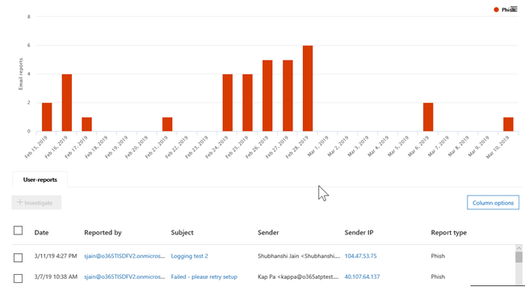

# 威脅總管] 和 [即時偵測的資訊中的檢視

[威脅總管](use-explorer-in-security-and-compliance.md)（與 [即時偵測] 報告） 是功能強大，接近即時的工具，以協助調查及回應安全性威脅的安全性作業小組&amp;合規性中心。 Explorer （並即時偵測] 報告） 會顯示您的組織可疑的惡意軟體和電子郵件中的釣魚程式和 Office 365 中的檔案，以及其他安全性威脅及風險的相關資訊。 

- 如果您有[Office 365 進階威脅防護](office-365-atp.md)(ATP) 計劃 2，您會有瀏覽器。
- 如果您有 Office 365 ATP 方案 1，您必須即時偵測的資訊。

當您首次開啟檔案總管] （或 [即時偵測] 報告） 時，預設的檢視中顯示電子郵件惡意程式碼偵測過去 7 天。 也可以將這份報告顯示 ATP 偵測，例如透過[安全連結](atp-safe-links.md)，偵測到的惡意 Url 和[安全附件](atp-safe-attachments.md)所偵測到的惡意檔案。 您可以修改這份報告顯示過去 30 天的資料 （除非使用試用版訂閱）。 試用訂閱會在過去七天只包含資料。

使用 [**檢視**] 功能表變更顯示的資訊。 工具提示協助您決定使用哪一種檢視。
  
![威脅總管檢視] 功能表](media/ThreatExplorerViewMenu.png)

一旦您已選取檢視，您可以套用篩選器，並設定查詢，以進行進一步分析。 下列各節提供中檔案總管] （或即時偵測） 可用的不同檢視的簡要概觀。  

## 電子郵件 > 惡意程式碼

若要檢視這份報告，在瀏覽器 （或即時偵測的資訊） 中，選擇 [**檢視** > **電子郵件** > **惡意程式碼**。 這個檢視顯示已識別為包含惡意程式碼的電子郵件的相關資訊。  

 

按一下 [**寄件者**若要開啟的檢視選項]。 使用此清單來檢視由寄件者、 收件者、 寄件者網域、 主旨、 偵測技術、 保護狀態，以及更多資料。 

例如，若要查看哪些動作是在偵測到的電子郵件訊息上，選擇清單中的 [**保護狀態**]。 選取一個選項，然後按一下 [重新整理] 按鈕，該篩選條件套用至您的報表。

![威脅總管] 中的威脅保護狀態選項](media/ThreatExplorerProtectionStatusOptions.png)

下方圖表，檢視特定郵件的相關詳細資料。 當您在清單中選取項目時，會開啟的飛出視窗窗格，其中您可以深入了解您所選取的項目。 

## 電子郵件 > Phish

若要檢視這份報告，在瀏覽器 （或即時偵測的資訊） 中，選擇 [**檢視** > **電子郵件** > **釣魚程式**。 這個檢視顯示電子郵件識別為網路釣魚嘗試次數。  

 

按一下 [**寄件者**若要開啟的檢視選項]。 使用此清單來檢視由寄件者、 收件者、 寄件者網域，寄件者 IP 資料的 URL 網域上，按一下 [verdict，等等。 

例如，若要查看哪些動作是人員按一下已識別為網路釣魚嘗試的 Url 時，選擇清單中的 [**按一下 verdict** 、 選取一或多個選項，然後按一下 [重新整理] 按鈕。

下方圖表中，檢視更多詳細資料特定郵件、 URL 點選、 Url 和電子郵件來源。 

當您選取的項目在清單中，例如已偵測到的 URL 會開啟的飛出視窗窗格，其中您可以深入了解您所選取的項目。 

## 電子郵件 > 使用者報告

若要檢視這份報告，在瀏覽器 （或即時偵測的資訊） 中，選擇 [**檢視** > **電子郵件** > **使用者報告**。 這個檢視顯示電子郵件使用者會回報為垃圾郵件、 非垃圾郵件或網路釣魚電子郵件。 

 

按一下 [**寄件者**若要開啟的檢視選項]。 使用此清單來檢視由寄件者、 收件者、 報表類型 （使用者的決定電子郵件是垃圾郵件、 非垃圾郵件或釣魚程式，） 和更多的資訊。 

例如，若要檢視已回報為網路釣魚嘗試的電子郵件的相關資訊，請按一下 [**寄件者** > **報表類型**，選取**釣魚程式**，然後再按一下 [重新整理] 按鈕。

下方圖表，檢視關於特定電子郵件，如主旨、 寄件者的 IP 位址、 回報郵件為垃圾郵件、 非垃圾郵件，或釣魚程式，等等的使用者詳細資料。 

若要檢視其他詳細資料] 清單中選取項目。

## 所有電子郵件的電子郵件 >

若要檢視此報告中，在檔案總管中，選擇 [**檢視** > **電子郵件** > **所有郵件**。 此檢視全面檢視顯示的電子郵件活動，包括電子郵件識別為惡意由於網路釣魚或惡意程式碼，以及所有非惡意的郵件 （一般的電子郵件、 垃圾郵件，以及大量郵件）。 

> [!NOTE]
> 如果您收到錯誤，可讀取**太多要顯示的資料**、 新增篩選器，如有必要，縮小您要檢視的日期範圍。 

若要套用篩選器，選擇 [**寄件者**、 在清單中，選取項目，然後按一下 [重新整理] 按鈕。 在我們的範例中，我們使用**偵測技術**作為篩選器 （有幾個選項可以使用）。 檢視依寄件者、 寄件者的網域、 收件者、 主旨、 附件檔名、 惡意程式碼系列、 保護狀態 （威脅保護功能和 Office 365 中的原則所採取的動作）、 （如何惡意程式碼偵測到），偵測技術的資訊和更多。 

 

下方圖表，檢視更多詳細資料特定的電子郵件，例如主旨行、 收件者、 寄件者、 狀態、 等等。 

## 內容 > 惡意程式碼

若要檢視這份報告，在瀏覽器 （或即時偵測的資訊） 中，選擇 [**檢視** > **內容** > **惡意程式碼**。 這個檢視顯示[Office 365 進階威脅](atp-for-spo-odb-and-teams.md)防護中 SharePoint Online、 商務用 OneDrive 和 Microsoft Teams 已識別為惡意的檔案。

檢視惡意程式碼 （如何惡意程式碼偵測到），家長監護，偵測技術的資訊和工作負載 （OneDrive、 SharePoint 或小組）。 

  

下方圖表中，檢視需有關特定的檔案，例如附件檔名，工作負載，檔案大小，最後修改的檔案，以及更多詳細資訊。 
  
## 按一下 [以篩選功能

Explorer （與即時偵測的資訊），您可以套用中按一下 [篩選器。 按一下圖例中的項目，該項目會成為報表的篩選器。 例如，假設我們要尋找在檔案總管中的惡意程式碼檢視：
  

  
在此圖表中的結果就像這樣的檢視中，按一下 [ **ATP 爆炸**： 
  

  
在此檢視中，我們現在要尋找在[Office 365 ATP Safe Attachments](atp-safe-attachments.md)已引爆的檔案的資料。 下方圖表中，我們可以看到關於有已偵測到由 ATP 安全附件的附件的特定電子郵件的詳細資訊。
  

  
選取一或多個項目會啟動 [**動作**] 功能表，它提供了數個選項可供選擇為選取的項目。 
  
![選取項目會啟動 [動作] 功能表](media/95f127a4-1b2a-4a76-88b9-096e3ba27d1b.png)
  
在按一下篩選及瀏覽至特定的詳細資訊的能力可讓您節省大量時間中調查潛在威脅。

## 查詢及篩選

Explorer （並即時偵測] 報告） 有數個功能強大的篩選器和查詢功能可讓您切入詳細資訊，例如頂端的目標使用者、 上方的惡意程式碼系列、 偵測技術等等。 每一種報表提供了許多方式可檢視和瀏覽資料。

> [!IMPORTANT]
> 請勿使用萬用字元，例如星號 （*） 或問號 （？），在瀏覽器 （或即時偵測的資訊） 的 [查詢] 列中。 當您搜尋電子郵件的主旨欄位時，檔案總管] （或即時偵測） 便會執行部分符合及收益結果類似萬用字元搜尋。
