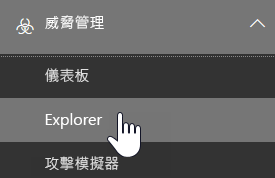
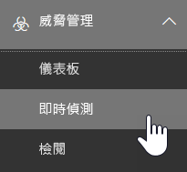

# 威脅總管和即時偵測Threat Explorer and real-time detections

如果貴組織具有 [Office 365 進階威脅防護](office-365-atp.md) (Office 365 ATP)，而且您具有[必要的權限](#required-licenses-and-permissions)，您具有**總管**或**即時偵測** (先前的*即時報告* — [查看新增功能](#new-features-in-real-time-detections)！)。If your organization has [Office 365 Advanced Threat Protection](office-365-atp.md) (Office 365 ATP), and you have the [necessary permissions](#required-licenses-and-permissions), you have either **Explorer** or **real-time detections** (formerly *real-time reports* — [see what's new](#new-features-in-real-time-detections)!). 在安全性與合規性中心， 移至**威脅管理**，然後選擇**總管**或**即時偵測**。In the Security & Compliance Center, go to **Threat management**, and then choose **Explorer** OR **Real-time detections**. 

|在 ATP 方案 2，您會看到：With ATP Plan 2, you see:  |在 ATP 方案 1，您會看到：With ATP Plan 1, you see:  |
|---------|---------|
|      |         |

總管 (或即時偵測) 提供您強大的報告，讓您的安全性作業小組以有效的方式調查及回應威脅，類似下圖：With Explorer (or real-time detections), you have a powerful report that enables your Security Operations team to investigate and respond to threats effectively and efficiently, and it resembles the following image: 

您可以使用此報告：With this new capability, you can:
- [查看 Office 365 安全性功能偵測到的惡意程式碼See malware detected by Office 365 security features](#see-malware-detected-in-email-by-technology)
- [檢視網路釣魚 URL 並按一下結果View data about phishing URLs and click verdict](#view-data-about-phishing-urls-and-click-verdict)
- [從總管中的檢視啟動自動化的調查和回應程序](#start-automated-investigation-and-response) (僅限 ATP 方案 2)[Start an automated investigation and response process from a view in Explorer](#start-automated-investigation-and-response) (ATP Plan 2 only)
- ... [調查惡意電子郵件等功能](#more-ways-to-use-explorer-or-real-time-detections)！... [Investigate malicious email, and more](#more-ways-to-use-explorer-or-real-time-detections)!

## 即時偵測的新功能New features in real-time detections

新增到威脅總管的三個新功能如下所列。Three new features added into Threat Explorer are outlined below.

第一，**電子郵件標頭預覽及下載電子郵件內文**為威脅總管的新功能。First, **email header preview, and download of the email body** are new features available in Threat Explorer. 系統管理員能分析下載的標頭/電子郵件的威脅。Admins will be able to analyse downloaded headers/emails for threats. 由於下載電子郵件可能讓資訊暴露於風險，因為此程序是由角色型存取控制 (RBAC) 控制。Because downloading emails can risk the exposure of information, this process is controlled by roles-based access control (RBAC). 稱為「預覽」的新角色必須新增至另一個 Office 365 角色群組 (例如，新增至安全性作業或安全性系統管理員) 以授與能力來下載郵件，並以所有電子郵件檢視來預覽標頭。A new role, called 'Preview' must be added into another Office 365 role group (for example into sec operations, or sec admin) to grant the ability to download mails and preview headers in all-emails view.

但總管 (和即時偵測) 也會新增新欄位，設計用於提供您更完整的電子郵件目標位置資訊。But Explorer (and real-time detections) also adds fresh new fields designed to give you a more complete picture of where your emails land. 這項變更的部分目標是讓安全性作業人員更容易搜捕，但最後的結果在於對問題電子郵件的位置一目了然。Part of the goal of this change is to make hunting easier for Security Ops people, but the net result is knowing the location of problem emails at a glance.

這是如何達成？How is this done? 傳遞狀態現在劃分為兩個資料行：Delivery Status is now broken out into two columns:

- **傳遞動作** - 這封電子郵件的狀態為何？**Delivery Action** - What is the status of this email?
- **傳遞位置** - 結果這封電子郵件是如何路由傳送？**Delivery Location** - Where was this email routed as a result?

「傳遞動作」是基於現有原則或偵測對電子郵件所採取的動作。Delivery Action is the action taken on an email due to existing policies or detections. 以下是電子郵件可能採取的動作：Here are the possible actions an email can take:

|已傳遞Delivered  |已標示為垃圾郵件Junked  |已封鎖Blocked processes  |已取代Replaced properties  |
|---------|---------|---------|---------|
|電子郵件已傳遞至 [收件匣] 或使用者的資料夾，使用者可以直接存取該電子郵件。Email was delivered to Inbox or folder of a user and the user can directly access it.    | 電子郵件已傳送到使用者的 [垃圾郵件] 資料夾或 [已刪除] 資料夾，使用者可以存取這些資料夾中的電子郵件。Email was sent to either user’s Junk folder or Deleted folder, and the user has access to emails in those folders.       | 任何已隔離、傳遞失敗或已中斷的電子郵件。Any emails that are quarantined, that  failed, or were dropped. 使用者完全無法存取這些電子郵件！This is completely inaccessible by the user!     | 任何由指出附件為惡意的 .txt 檔案取代惡意附件的電子郵件。Any email where malicious attachments are replaced by .txt files that state the attachment was malicious.     |

以下是使用者可以查看及無法查看的內容：And here is what the user can see, and what they can't:

|使用者可以存取Published to end users  |使用者無法存取 Published to end users  |
|---------|---------|
|已傳遞Delivered     | 已封鎖Blocked processes        |
|已標示為垃圾郵件Junked     | 已取代Replaced properties        |

傳遞位置顯示原則和執行傳遞後偵測的結果。Delivery location shows the results of policies and detections that run post-delivery. 其連結到「傳遞動作」。It's linked to a Delivery Action. 已新增此欄位，以深入了解找到問題電子郵件時所採取的動作。This field was added to give insight into the action taken when a problem mail is found. 以下是傳遞位置可能的值：Here are the possible values of delivery location:

1. 收件匣或資料夾 – 電子郵件在收件匣或資料夾中 (根據您的電子郵件規則)。Inbox or folder – The email is in inbox or a folder (according to your email rules).
2. 內部部署或外部 – 信箱不存在於雲端，而是內部部署。On-prem or external – The mailbox doesn’t exist on cloud but is on-premises.
3. [垃圾郵件] 資料夾 – 電子郵件在使用者的 [垃圾郵件] 資料夾中。Junk folder – The email in in the Junk folder of a user.
4. [刪除的郵件] 資料夾 – 電子郵件在使用者的 [刪除的郵件] 資料夾中。Deleted items folder – The email in the Deleted items folder of a user.
5. 隔離 – 電子郵件隔離中，不在使用者的信箱。Quarantine – The email in quarantine, and is not in a user’s mailbox.
6. 失敗 – 電子郵件無法傳遞至信箱。Failed – The email failed to reach the mailbox.
7. 已中斷 – 電子郵件在郵件流程的某處遺失。Dropped – The email gets lost somewhere in the Mailflow.

**電子郵件時刻表**是總管的另一個新功能，目標是讓系統管理員更容易搜捕。The **Email Timeline** is another new Explorer feature aimed at making the hunting experience better for admins. 這可減少不規則性，因為花較少的時間檢查不同位置以嘗試了解事件。It cuts down on randomization because there is less time spent checking different locations to try to understand the event. 當多個事件同時或接近同時發生在某電子郵件時，這些事件會出現在時刻表檢視。When multiple events happen at, or close to, the same time on an email, those events will show up in a timeline view. 事實上，某些在傳遞郵件後發生的事件會由「特殊動作」欄擷取。In fact, some events that happen post-delivery to your mail will be captured in the 'Special action' column. 透過結合該郵件在時刻表上的資訊和傳遞郵件後採取的特殊動作，能讓系統管理員了解其原則的運作方式，郵件最後路由傳送的位置，以及 (在某些情況下) 最後評估為何。Combining the information from the timeline of that mail with the special action taken on the mail post-delivery will give admins insight into how their policies work, where the mail was finally routed, and, in some cases, what the final assessment was.

如需調查惡意電子郵件的詳細討論，請參閱[尋找並調查在 Office 365 傳送的惡意電子郵件](https://docs.microsoft.com/zh-TW/office365/securitycompliance/investigate-malicious-email-that-was-delivered) (機器翻譯)。For more discussion about investigating malicious emails see [Find and investigate malicious email that was delivered in Office 365](https://docs.microsoft.com/zh-TW/office365/securitycompliance/investigate-malicious-email-that-was-delivered).

## 查看透過技術在電子郵件中偵測到的惡意程式碼See malware detected in email by technology

假設您想要查看 Office 365 技術在電子郵件中偵測到的惡意程式碼。Suppose you want to see malware detected in email, by Office 365 technology. 若要這麼做，請使用總管 (或即時偵測) 的 [[電子郵件] > [惡意程式碼]](threat-explorer-views.md#email--malware) 檢視。To do this, use the [Email > Malware](threat-explorer-views.md#email--malware) view of Explorer (or real-time detections).

1. 在安全性與合規性中心 ([https://protection.office.com](https://protection.office.com)) 選擇 **[威脅管理]** > **[總管]** (或 **[即時偵測]**)。In the Security & Compliance Center ([https://protection.office.com](https://protection.office.com)), choose **Threat management** > **Explorer** (or **Real-time detections**). (此範例使用總管。)(This example uses Explorer.)

2. 在 **[檢視]** 功能表中，選擇 **[電子郵件]** > **[惡意程式碼 ]**。In the **View** menu, choose **Email** > **Malware**.  

3. 按一下 **[寄件者]**，然後選擇 **[基本]** > **[偵測技術]**。Click **Sender**, and then choose **Basic** > **Detection technology**. 您的偵測技術現在可做為報告的篩選器。Your detection technologies are now available as filters for the report.   

4. 選取一個選項，然後按一下 **[重新整理]** 按鈕來套用該篩選器。Select an option, and then click the **Refresh** button to apply that filter.   

報告會使用您所選取的技術選項重新整理，以顯示在電子郵件中偵測到的惡意程式碼。The report refreshes to show the results malware detected in email, using the technology option you selected. 您可以從這裡進行進一步分析。From here, you can conduct further analysis.

## 檢視網路釣魚 URL 並按一下結果View data about phishing URLs and click verdict

假設您想要查看透過電子郵件中的 URL 進行的網路釣魚攻擊，包括允許、封鎖及覆寫的 URL 清單。Suppose that you want to see phishing attempts through URLs in email, including a list of URLs that were allowed, blocked, and overridden. 若要識別已按過的 URL，則必須設定 [ATP 安全連結](atp-safe-links.md)。Identifying URLs that were clicked requires [ATP Safe links](atp-safe-links.md) to be configured. 請確認您已針對點擊時保護和 ATP 安全連結的按一下結果記錄設定 [ATP 安全連結原則](set-up-atp-safe-links-policies.md)。Make sure that you have set up [ATP Safe Links policies](set-up-atp-safe-links-policies.md) for time-of-click protection and logging of click verdicts by ATP Safe Links. 

若要檢閱郵件中的網路釣魚 URL 和網路釣魚郵件中的 URL 點擊，請使用總管 (或即時偵測) 的 [[電子郵件] > [網路釣魚]](threat-explorer-views.md#email--phish) 檢視。To review phish URLs in messages and clicks on URLs in phish messages, use the [Email > Phish](threat-explorer-views.md#email--phish) view of Explorer (or real-time detections).

1. 在安全性與合規性中心 ([https://protection.office.com](https://protection.office.com)) 選擇 **[威脅管理]** > **[總管]** (或 **[即時偵測]**)。In the Security & Compliance Center ([https://protection.office.com](https://protection.office.com)), choose **Threat management** > **Explorer** (or **Real-time detections**). (此範例使用總管。)(This example uses Explorer.)

2. 在 **[檢視]** 功能表中，選擇 **[電子郵件]** > **[網路釣魚]**。In the **View** menu, choose **Email** > **Phish**.  

3. 按一下 **[寄件者]**，然後選擇 **[URL]** > **按一下結果**。Click **Sender**, and then choose **URLs** > **Click verdict**.

4. 選取一或多個選項，例如 **[已封鎖]** 和 **[封鎖覆寫]**，然後按一下要套用該篩選器的選項同一行上的 **[重新整理]** 按鈕。Select one or more options, such as **Blocked** and **Block overridden**, and then click the **Refresh** button that is on the same line as the options to apply that filter. (請勿重新整理瀏覽器視窗。)(Don't refresh your browser window.)  

    報告會重新整理以在報告下的 [URL] 索引標籤上顯示兩個不同的 URL 表格：The report refreshes to show two different URL tables on the URL tab under the report:

   - **[熱門 URL]** 為已篩選的郵件中的 URL，而電子郵件傳送動作會計算每個 URL。**Top URLs** are the URLs contained in the messages you have filtered down to, and the email delivery action counts for each URL. 在網路釣魚電子郵件檢視中，此清單通常會包含合法的 URL。In the phish email view, this list typically will contain legitimate URLs. 攻擊者會在這些郵件中混雜善意和惡意的 URL，以試圖傳遞這些郵件，但他們會讓惡意連結看起來更加有趣，以誘使使用者點擊。Attackers include a mix of good and bad URLs in their messages to try to get them delivered, but they will make the malicious links more interesting for the user to click. URL 表格是依電子郵件總數量排序 (注意：為了簡化檢視，不會顯示此欄)。The table of URLs is sorted by total email count (NOTE: This column is not shown to simplify the view).

   - **[熱門點擊]** 為點擊過的包含在安全連結中的 URL，並依總點擊數排序 (為了簡化檢視，此欄也不會顯示)。**Top clicks** are the Safe Links wrapped URLs that were clicked, sorted by total click count (this column is also not shown to simplify the view). 依資料行的總計數表示每個點擊過的 URL 的安全連結按一下結果計數。Total counts by column indicate the Safe Links click verdict count for each clicked URL. 在網路釣魚電子郵件檢視中，這些通常是可疑或惡意的 URL，但可能包含網路釣魚郵件中的無害 URL。In the phish email view, these are more often suspicious or malicious URLs, but could include clean URLs that are in phish messages. 已開啟的連結的 URL 點擊不會顯示在這裡。URL clicks on unwrapped links will not show up here.
   
   兩個 URL 表格依傳遞動作和位置顯示網路釣魚電子郵件熱門 URL，並顯示已封鎖的 URL 點擊 (或儘管已警告卻仍造訪的 URL)，讓您了解使用者接收到及互動的潛在惡意連結。The two URLs tables show top URLs in phishing emails by delivery action and location, and they show URL clicks that were blocked (or visited despite a warning) so that you can understand what potential bad links were received by users and interacted with by users. 您可以從這裡進行進一步分析。From here, you can conduct further analysis. 例如，在圖表的下方，您可以看到貴組織環境中封鎖的電子郵件熱門 URL。For example, below the chart, you can see the top URLs in emails that were blocked in your organization's environment.
   
   
   
   選取 URL 以檢視詳細資訊。Select a URL to view more detailed information. 請注意，URL 飛出對話方塊中，電子郵件篩選已移除，以讓您完整檢視暴露於您的環境中的 URL。Note that in the URL flyout dialog, the filtering on emails is removed to show you the full view of the URL's exposure in your environment. 這能讓您在總管中篩選出您擔心的電子郵件，找出具有潛在威脅的特定 URL，然後了解暴露於您的環境 (經由 URL 詳細資料對話方塊) 中的 URL，而不需要將 URL 篩選器新增至總管檢視本身。This lets you filter down emails in Explorer to ones you are concerned about, find specific URLs that are potential threats, then expand your understanding of the URL exposure in your environment (via the URL details dialog) without having to add URL filters to the Explorer view itself.

## 檢閱使用者回報的電子郵件Review email messages reported by users

假設您想透過使用 [Outlook 和 Outlook 網頁版的回報郵件增益集](enable-the-report-message-add-in.md)來查看貴組織使用者回報為「垃圾郵件」、「非垃圾郵件」或「網路釣魚」的電子郵件。Suppose that you want to see email messages that users in your organization have reported as Junk, Not Junk, or Phishing by using the [Report Message add-in for Outlook and Outlook on the web](enable-the-report-message-add-in.md). 若要這麼做，請使用總管 (或即時偵測) 的 [[電子郵件] > [提交]](threat-explorer-views.md#email--submissions) 檢視。To do this, use the [Email > Submissions](threat-explorer-views.md#email--submissions) view of Explorer (or real-time detections).

1. 在安全性與合規性中心 ([https://protection.office.com](https://protection.office.com)) 選擇 **[威脅管理]** > **[總管]** (或 **[即時偵測]**)。In the Security & Compliance Center ([https://protection.office.com](https://protection.office.com)), choose **Threat management** > **Explorer** (or **Real-time detections**). (此範例使用總管。)(This example uses Explorer.)

2. 在 **[檢視]** 功能表中，選擇 **[電子郵件]** > **[提交]**。In the **View** menu, choose **Email** > **Submissions**.  

3. 按一下 **[寄件者]**，然後選擇 **[基本]** > **[回報類型]**。Click **Sender**, and then choose **Basic** > **Report type**.

4. 選取一個選項，例如 **[網路釣魚]**，然後按一下 **[重新整理]** 按鈕。Select an option, such as **Phish**, and then click the **Refresh** button.    

報告會重新整理，顯示貴組織中的人員回報為網路釣魚攻擊的電子郵件相關資料。The report refreshes to show data about email messages that people in your organization have reported as a phishing attempt. 您可以使用此資訊來進行進一步分析，並視需要調整 [ATP 防網路釣魚原則](set-up-anti-phishing-policies.md)。You can use this information to conduct further analysis, and if necessary, adjust your [ATP anti-phishing policies](set-up-anti-phishing-policies.md).

## 啟動自動調查及回應Start automated investigation and response

> [!NOTE]
> **Office 365 ATP 方案 2** 和 **Office 365 E5** 提供自動化的事件回應功能。Automated incident response capabilities are available in **Office 365 ATP Plan 2** and **Office 365 E5**.

(新增！)[自動化的事件回應](automated-investigation-response-office.md)能為您的安全性作業小組節省許多時間和精力來調查及降低網路攻擊。(NEW!) [Automated incident response](automated-investigation-response-office.md) can save your security operations team much time and effort in investigating and mitigating cyberattacks. 除了設定會觸發安全性劇本的警示，您可以在總管中的檢視啟動自動化調查及回應程序。In addition to configuring alerts that can trigger a security playbook, you can start an automated investigation and response process from a view in Explorer. 

如需這方面的詳細資訊，請參閱[範例：安全性系統管理員從總管觸發調查](automated-investigation-response-office.md#example-a-security-administrator-triggers-an-investigation-from-threat-explorer)。For details on this, see [Example: A security administrator triggers an investigation from Explorer](automated-investigation-response-office.md#example-a-security-administrator-triggers-an-investigation-from-threat-explorer).

## 更多使用總管 (或即時偵測) 的方法More ways to use Explorer (or real-time detections)

除了這篇文章所述的案例，總管 (或即時偵測) 還有更多回報選項。In addition to the scenarios outlined in this article, you have many more reporting options available with Explorer (or real-time detections). 
- [尋找並調查傳送的惡意電子郵件Find and investigate malicious email that was delivered](investigate-malicious-email-that-was-delivered.md)
- [檢視在 SharePoint Online、OneDrive 和 Microsoft Teams 中偵測到的惡意檔案View malicious files detected in SharePoint Online, OneDrive, and Microsoft Teams](malicious-files-detected-in-spo-odb-or-teams.md)
- [取得威脅總管 (和即時偵測) 檢視的概觀Get an overview of the views in Threat Explorer (and real-time detections)](threat-explorer-views.md)

## 必要的授權和權限Required licenses and permissions

您必須具備 [Office 365 ATP](office-365-atp.md) 才能取得總管或即時偵測。You must have [Office 365 ATP](office-365-atp.md) to get Explorer or real-time detections.
- 總管會包含在 Office 365 ATP 方案 2。Explorer is included in Office 365 ATP Plan 2. 
- 即時偵測報告會包含在 Office 365 ATP 方案 1。The real-time detections report is included in Office 365 ATP Plan 1.
- 請計劃指派授權給所有應受 ATP 保護的使用者。Plan to assign licenses for all users who should be protected by ATP. (總管或即時偵測會為經過授權的使用者顯示偵測資料。)(Explorer or real-time detections will show detection data for licensed users.)

若要檢視及使用總管或即時偵測，您必須具有適當的權限，例如授與安全性系統管理員或安全性讀取者的權限。To view and use Explorer or real-time detections, you must have appropriate permissions, such as those granted to a security administrator or security reader. 

- 針對「安全性與合規性中心」，您必須受指派下列其中一個角色：For the Security &amp; Compliance Center, you must have one of the following roles assigned:
    - 組織管理Organization Management
    - 安全性系統管理員 (這可以在 Azure Active Directory 系統管理中心指派 ([https://aad.portal.azure.com](https://aad.portal.azure.com)))Security Administrator (this can be assigned in the Azure Active Directory admin center ([https://aad.portal.azure.com](https://aad.portal.azure.com)))
    - 安全性讀取者Security reader

- 針對 Exchange Online，您必須在 Exchange 系統管理中心 ([https://outlook.office365.com/ecp](https://outlook.office365.com/ecp)) 或 PowerShell Cmdlet (請參閱 [Exchange Online PowerShell](https://docs.microsoft.com/powershell/exchange/exchange-online/exchange-online-powershell?view=exchange-ps)) 受指派下列其中一個角色：For Exchange Online, you must have one of the following roles assigned in either the Exchange admin center ([https://outlook.office365.com/ecp](https://outlook.office365.com/ecp)) or with PowerShell cmdlets (See [Exchange Online PowerShell](https://docs.microsoft.com/powershell/exchange/exchange-online/exchange-online-powershell?view=exchange-ps)):
    - 組織管理Organization Management
    - 僅檢視組織管理View-only Organization Management
    - 僅檢視收件者角色View-Only Recipients role
    - 合規性管理Compliance Management

若要深入了解角色和權限，請參閱下列資源：To learn more about xl14short, see the following resources:

- [Office 365 安全性與合規性中心權限Permissions in the Office 365 Security &amp; Compliance Center](permissions-in-the-security-and-compliance-center.md)
- [Exchange Online 中的功能權限Feature permissions in Exchange Online](https://docs.microsoft.com/exchange/permissions-exo/feature-permissions)
  
## 威脅總管和即時偵測的一些差異Some differences between Threat Exporter and real-time detections

 - Office 365 ATP 方案 1 提供**即時偵測**報告，而 Office 365 ATP 方案 2 提供**威脅總管**。The **real-time detections** report is available in Office 365 ATP Plan 1, whereas **Threat Explorer** is available in Office 365 ATP Plan 2.
 - **即時偵測**報告可讓您即時檢視偵測。The **real-time detections** report allows you to view detections in real-time. **威脅總管**也有這個功能，但也能讓您檢視特定攻擊的其他詳細資料。**Threat Explorer** does this as well, but also allows you to view additional details for a given attack.
