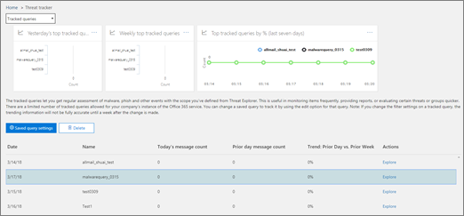
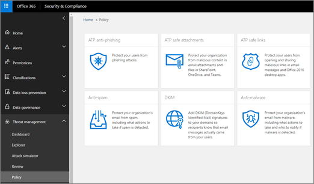

# 威脅追蹤器 - 新增和值得注意的功能

[Office 365 威脅調查及回應](office-365-ti.md)功能可讓您組織的安全性小組，以探索，並對 cybersecurity 威脅採取行動。 Office 365 威脅調查及回應能力包括威脅追蹤器功能，包括值得注意的追蹤器。 閱讀本篇文章以取得這些新功能和後續步驟的概觀。 

> [!IMPORTANT]
> Office 365 威脅情報現的 Office 365 進階威脅防護計劃 2，與其他威脅防護功能的一部分。 若要深入了解，請參閱[Office 365 進階威脅防護方案和價格](https://products.office.com/exchange/advance-threat-protection)和[Office 365 進階威脅防護服務說明](https://docs.microsoft.com/office365/servicedescriptions/office-365-advanced-threat-protection-service-description)。
  
## 威脅追蹤器是什麼？

威脅追蹤器是指 widget，並檢視可提供您在不同的 cybersecurity 智慧問題可能會影響您的公司。 例如，您可以檢視趨勢使用威脅追蹤器的惡意程式碼行銷活動的相關資訊。
  

  
大部分的追蹤器網頁包含趨勢的數字的定期更新，請以協助您了解哪些問題 widget 最大或最，已成長到，快速連結會帶您前往 [檔案總管中，您可以在其中檢視更詳細的 [**動作**] 欄中資訊。 
  

  
追蹤器都只是一些您取得[Office 365 進階威脅防護計劃 2](office-365-ti.md)許多好用的功能。 威脅追蹤器包括[值得注意的追蹤器](threat-trackers.md#notey)、[趨勢追蹤器](threat-trackers.md#trending)、[追蹤查詢](threat-trackers.md#trackedq)，以及[已儲存的查詢](threat-trackers.md#savedq)。
  
若要檢視，並為您的組織使用威脅追蹤器，移至 [安全性&amp;合規性中心 ([https://protection.office.com](https://protection.office.com))，然後選擇 [**威脅管理** \> **威脅追蹤器**。
  
> [!NOTE]
> 若要使用威脅追蹤器，您必須是 Office 365 全域系統管理員、 安全性系統管理員或安全性讀取者。 請參閱[中的 Office 365 安全性權限&amp;合規性中心](permissions-in-the-security-and-compliance-center.md)。 
  
### 值得注意的追蹤器

值得注意的追蹤器通常都可找到 big 及較小的威脅及風險，我們認為您應該了解。 值得注意的追蹤器協助您找出是否這些問題存在於您的 Office 365 環境，加上的情形 （像這樣） 提供您的詳細資訊項目上的文章連結，以及他們將會如何影響您的組織使用 Office 365。 很大的新威脅 （例如 Wannacry、 Petya），還是可能會建立一些新現有威脅挑戰 （就像我們其他我值得注意的項目-Nemucod），這是您可以在其中找到重要新項目您和您的安全性小組應該檢閱並檢查定期。
  
通常是值得注意的追蹤器會張貼的幾週我們時識別新的威脅，並考慮您可能需要這項功能提供額外可見性。 一旦已超過最大的風險的威脅，我們將會移除該值得注意的項目。 如此一來，我們可以保留清單全新及最新的其他相關的新項目。
  
### 趨勢追蹤器

趨勢 （以前稱為 「 行銷活動 」） 的追蹤器醒目提示新尚未在過去一週中看到您的組織電子郵件中的威脅。
  
![範例中的趨勢惡意程式碼行銷活動] 小工具](media/d2ccc1a0-2a1d-4e36-99b5-6766c207772f.png)
  
趨勢追蹤器可讓您概略了新的威脅，您應檢閱以確保您更廣泛的公司環境已備妥的攻擊。
  
### 追蹤的查詢

追蹤的查詢利用您已儲存的查詢，以定期評估貴組織中的 Office 365 活動。 這可以讓您趨勢，像是在接下來的月份中的更多有關的事件。 追蹤執行查詢，自動執行，而不必重新執行您的查詢，請記得提供最新狀態的資訊。
  

  
### 已儲存的查詢

已儲存的查詢也會追蹤器] 區段中找到。 您可以使用已儲存查詢，以儲存您想要取得上一步] 以更快速且重複，而不必重新建立搜尋每次常見總管搜尋。
  

  
您一律可以儲存值得注意的追蹤器查詢或任何您自己的瀏覽器查詢頂端的 [檔案總管] 頁面上使用 [**儲存查詢**] 按鈕。 儲存至該處的任何項目會顯示在 [追蹤器] 頁面上的 [**已儲存查詢**] 清單中。 
  
## 追蹤器] 及 [檔案總管

是否在檢閱電子郵件、 內容或 Office 活動 （即將推出），檔案總管] 及 [追蹤器共同運作來協助您調查並追蹤安全性風險和威脅。 所有在一起，追蹤器會為您提供，以醒目提示新、 值得注意，與常搜尋的問題-確保貴公司更妥善地受到移至雲端時保護您的 Office 365 使用者的資訊。
  
請記住，您可以永遠提供我們的意見反應這或其他 Office 365 安全性功能上按一下右上角的 [**意見反應**] 按鈕上的 [ [Overview of Office 365 Security&amp;合規性中心](https://support.office.com/article/a5f2fd18-b029-4257-b5a8-ae83e7768c85)。
  

  
## 追蹤器和 Office 365 進階的威脅防護

與我們我值得注意的威脅，我們正在反白顯示[Office 365 ATP 安全附件](atp-safe-attachments.md)所偵測到的進階惡意程式碼威脅。 如果您是 Office 365 企業版 E5 客戶，而且您不使用[Office 365 進階威脅防護](office-365-atp.md)(ATP)，您應該先-納入您的訂閱。 即使您有其他篩選與您的 Office 365 服務的電子郵件流程的安全性工具，ATP 會提供值。 不過，反垃圾郵件和[Office 365 ATP 安全連結](atp-safe-links.md)功能運作起來最順暢時您主要的電子郵件安全性解決方案是透過 Office 365。 
  

  
在現今的威脅處處世界中，執行只有傳統反惡意程式碼掃描的表示您不保護不夠好遭受攻擊。 今天的更複雜的攻擊者使用常用的工具來建立新的、 模糊化、 或延遲傳統簽章型反惡意程式碼引擎無法辨識的攻擊。 ATP 安全附件功能會採用電子郵件附件，並加以引爆來判斷其是否安全或惡意在虛擬環境中。 此爆炸程序在虛擬電腦環境中，開啟每個檔案，然後觀賞之後開啟檔案時，會發生什麼事。 它是 pdf 格式，並壓縮的檔，還是 Office 文件，惡意程式碼可以隱藏在檔案中，啟動一次受害者其電腦上開啟。 藉由 detonating 及分析中的電子郵件流程的檔案，Office 365 ATP 功能會找到根據行為、 檔案中的聲譽、 和啟發式規則數目這些威脅。
  
新的值得注意的潛在威脅篩選器醒目提示最近 ATP 安全附件透過偵測到的項目。 這些偵測代表新的惡意檔案，不先前找到 Office 365 電子郵件流程或其他客戶的電子郵件中的項目。 請注意到的項目中值得注意的潛在威脅追蹤器，請參閱人員其，圖文框及檢閱 （在檔案總管中的電子郵件的主旨，即可找到） 進階分析] 索引標籤上所顯示的爆炸詳細資料。 請注意您只可以找到此索引標籤上偵測到的 ATP 安全附件功能的電子郵件-此值得注意的追蹤器包含該篩選器，但您也可以使用該篩選器的其他瀏覽器中的搜尋。
  
## 後續步驟

- 如果您的組織尚未這些 Office 365 威脅調查及回應功能，請參閱[如何取得 Office 365 威脅調查及回應能力？](get-started-with-ti.md)。
    
- 請確定您的安全性小組具有正確的角色及指派權限。 您必須為 Office 365 的全域系統管理員，或具有安全性系統管理員或搜尋及清除角色指派安全性&amp;合規性中心。 請參閱[中的 Office 365 安全性權限&amp;合規性中心](permissions-in-the-security-and-compliance-center.md)。
    
- 監看的 Office 365 環境中顯示新的追蹤器。 若有的話，您會發現您追蹤器[以下](https://protection.office.com/)。 移至**威脅管理，** \> **威脅追蹤器**。
    
- 如果您尚未這麼做，進一步了解，並為您的組織，包括[Office 365 ATP safe links](atp-safe-links.md)和[Office 365 ATP 安全附件](atp-safe-attachments.md)設定[Office 365 進階威脅防護](office-365-atp.md)。
  

