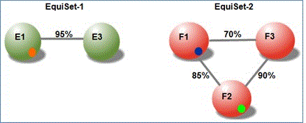

# 在 Office 365 進階電子文件探索中了解文件相似性

> [!NOTE]
> 進階的 eDiscovery 需要您組織與進階規範附加元件或 E5 訂閱 Office 365 E3。如果您不具有該對應並想要嘗試進階的 eDiscovery，您還可以[註冊 Office 365 企業版 E5 的試用版](https://go.microsoft.com/fwlink/p/?LinkID=698279)。 
  
進階 ediscovery 文件相似性是跟為接近重複項目必須考量兩個文件所需的最低層級。
  
> [!TIP]
> 大部分的商務應用程式的建議使用相似性值的 60%-75%。品質非常不佳光學字元辨識 (OCR) 材料] 可以套用較低的相似性值。 
  
> [!NOTE]
> 已設定並執行特定案例之後，就無法變更相似性值。 
  
內 Near duplicate (ND) 設定，則可能會以類似下方的相似性臨界值的層級的文件。文件加入 ND 設定，則必須有至少一個文件中使用超過相似性跟層級設定 ND。 
  
例如，假設相似性設為 80%、 文件 F1 的格式類似於文件 F2 85%的層級和文件 F2 的格式類似於文件 F3 90%以下層級。 
  
不過，文件 F1 可能類似文件 F3 層級的僅限 70%，這是低於臨界值。儘管如此，在本例中為文件 F1、 F2 及所有出現在一個 ND F3 設定。同樣地，使用相似性值的 80%，我們可能已建立兩組 EquiSet 1 和 EquiSet 2。EquiSet 1 包含 E1 和 E2 的文件。Equiset 2 包含 F1、 f2 鍵，與下 F3 的文件。 
  
層級的跟說明如下：
  

  
假設另一個文件、 X1、 立即插入。X1 及 E3 之間跟是 87%。同樣地，X1 和 F1 之間跟是 92%。因此，EquiSet-1、-2、 EquiSet 及 X1 會立即結合成一個 ND 設定。
  

  
> [!NOTE]
> 如果任何兩份文件或已指派給一 ND 組，會一起保持在相同的 ND 集中，即使額外的文件新增至集如果合併集。 
  
合併設定之後，[樞紐分析表文件可以變更新文件新增至集合時。 
  
## 另請參閱

[Office 365 進階電子文件探索](office-365-advanced-ediscovery.md)
  
[設定分析選項](set-analyze-options-in-advanced-ediscovery.md)
  
[設定搜尋時忽略的文字](set-ignore-text-in-advanced-ediscovery.md)
  
[設定分析進階設定](set-analyze-advanced-settings-in-advanced-ediscovery.md)
  
[檢視分析結果](view-analyze-results-in-advanced-ediscovery.md)

