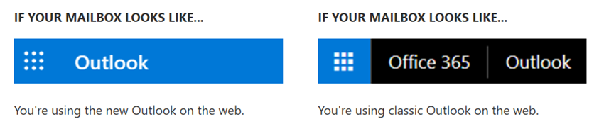

# 識別 Outlook.com 和網頁型 Outlook 中的可疑郵件Identify suspicious messages in Outlook.com and Outlook on the web

若要防止網路釣魚郵件送達您的信箱，Outlook.com 和網頁型 Outlook 確認寄件者是誰他們說他們且可疑的郵件標示為垃圾郵件。To prevent phishing messages from reaching your mailbox, Outlook.com and Outlook on the web verify that the sender is who they say they are and mark suspicious messages as junk email.

> [!IMPORTANT]
> 當郵件標示為網路釣魚詐騙、 Outlook.com 和 Outlook 網頁顯示一則警告] 頁面頂端，但仍然可以開啟任何郵件中的連結。When a message is marked as a phishing scam, Outlook.com and Outlook on the web display a warning at the top of the page, but any links in the message can still be opened.

## 如何識別我的收件匣中的可疑的郵件？How can I identify a suspicious message in my inbox?

Outlook.com 和網頁型 Outlook 顯示指標，當郵件的寄件者也無法識別或其身分識別為不同於從地址中看到的內容。Outlook.com and Outlook on the web show indicators when the sender of a message either can't be identified or their identity is different from what you see in the From address.

### 您會看到 '？ ' 中的寄件者影像You see a '?' in the sender image

當 Outlook.com 和網頁型 Outlook 無法驗證使用電子郵件驗證技術的寄件者的身分識別時，他們會顯示 '？ ' 中的寄件者相片。When Outlook.com and Outlook on the web can't verify the identity of the sender using email authentication techniques, they display a '?' in the sender photo.

若要驗證失敗不是每個訊息是惡意。Not every message that fails to authenticate is malicious. 不過，您應該謹慎互動與未驗證如果您不能辨識寄件者的郵件。However, you should be careful about interacting with messages that don't authenticate if you don't recognize the sender. 或者，如果您辨識通常沒有寄件者 '？ ' 寄件者的影像，但您突然開始看到它，可能會登寄件者詐騙。Or, if you recognize a sender that normally doesn't have a '?' in the sender image, but you suddenly start seeing it, that could be a sign the sender is being spoofed.

### 寄件者地址是不同的 From 地址中顯示的內容The sender's address is different than what appears in the From address

通常，您看到訊息中的電子郵件地址是不同於從地址中看到的內容。Frequently, the email address you see in a message is different than what you see in the From address. 有時網路釣客會嘗試誘騙寄件者是其他人以外人員它們確實是的想法。Sometimes phishers try to trick you into thinking that the sender is someone other than who they really are.

當 Outlook.com 和 outlook 網頁版偵測寄件者的實際地址與寄地址的地址之間的差異時，它們會顯示實際寄件者，並使用透過標記，這會加上底線。When Outlook.com and Outlook on the web detect a difference between the sender's actual address and the address on the From address, they show the actual sender using the via tag, which will be underlined.

在這個範例中，在傳送網域`suspicious.com`通過驗證，但寄件者放`unknown@contoso.com`From 地址。In this example, the sending domain `suspicious.com` is authenticated, but the sender put `unknown@contoso.com` in the From address.

不是每個郵件透過標記為可疑。Not every message with a via tag is suspicious. 不過，如果您不能辨識郵件透過標記，您應該謹慎與其互動。However, if you don't recognize a message with a via tag, you should be cautious about interacting with it.

在 Outlook.com 和新網頁型 Outlook 中，您可以將游標停留寄件者的名稱或郵件清單中，查看他們的電子郵件地址，而不需要開啟該郵件的地址。In Outlook.com and the new Outlook on the web, you can hover your cursor over a sender's name or address in the message list to see their email address, without needing to open the message.

如何知道是否您使用新的 Outlook web 上？How do you know if you're using the new Outlook on the web? 請參閱下列的範例：See the following examples:

## 常見問題集Frequently asked questions

### 查看準則沒有 Outlook.com 和網頁型 Outlook 使用新增 '？ ' 和 '透過' 屬性？What criteria does Outlook.com and Outlook on the web use to add the '?' and the 'via' properties?

為 '？ ' 中的寄件者影像： Outlook.com 需要郵件通過 SPF 或 DKIM 驗證。For the '?' in the sender image:  Outlook.com requires that the message pass either SPF or DKIM authentication. 如需詳細資訊，請參閱[設定 spf 以協助防止詐騙的 Office 365 中](set-up-spf-in-office-365-to-help-prevent-spoofing.md)和[使用 DKIM 驗證從您在 Office 365 中的自訂網域傳送的外寄電子郵件](use-dkim-to-validate-outbound-email.md)。For more details, see [Set up SPF in Office 365 to help prevent spoofing](set-up-spf-in-office-365-to-help-prevent-spoofing.md) and [Use DKIM to validate outbound email sent from your custom domain in Office 365](use-dkim-to-validate-outbound-email.md).

針對透過標記： Outlook.com 中自地址的網域不同網域的 DKIM 簽章或 SMTP MAIL FROM 中時，顯示在兩個欄位 （偏好的 DKIM 簽章） 的其中一個網域。For the via tag: If the domain in the From address is different from the domain in the DKIM signature or the SMTP MAIL FROM, Outlook.com displays the domain in one of those two fields (preferring the DKIM signature).

### 可以覆寫這些屬性與 IP 允許、 Exchange 傳輸規則可讓，或安全的寄件者？Can I override these properties with IP Allows, Exchange Transport Rule Allows, or safe senders?

您不能覆寫這些屬性。You can't override these properties.

### 如何移除這些內容？How do I remove these properties?

為 '？ ' 中的寄件者影像： 為寄件者，您應該驗證與 SPF 或 DKIM 郵件。For the '?' in the sender image: As a sender, you should authenticate your message with either SPF or DKIM.

針對透過標記： 為寄件者，您應該確定是在 DKIM 簽章的網域或 SMTP 郵件從相同，或是的在 [從地址的網域子網域。For the via tag: As a sender, you should ensure that either the domain in the DKIM signature or the SMTP MAIL FROM is the same as, or is a subdomain of, the domain in the From address.

### Outlook.com 和 Outlook 網頁顯示執行此動作不會通過驗證每個郵件嗎？Does Outlook.com and Outlook on the web show this for every message that doesn’t pass authentication?

不是一定。Not necessarily. Outlook.com 和網頁型 Outlook 可能已驗證寄件者的郵件內的其他屬性。Outlook.com and Outlook on the web may have other properties within the message to authenticate the sender.

## 相關主題Related topics

[協助保護您的 Outlook.com 電子郵件帳戶Help protect your Outlook.com email account](https://support.office.com/article/a4f20fc5-4307-4ece-8231-6d4d4bd8a9ba)

[處理濫用、 網路釣魚，或在 Outlook.com 中詐騙Deal with abuse, phishing, or spoofing in Outlook.com](https://support.office.com/article/0d882ea5-eedc-4bed-aebc-079ffa1105a3)

[篩選垃圾電子郵件和網頁型 Outlook 中的垃圾郵件Filter junk email and spam in Outlook on the web](https://support.office.com/article/db786e79-54e2-40cc-904f-d89d57b7f41d)
