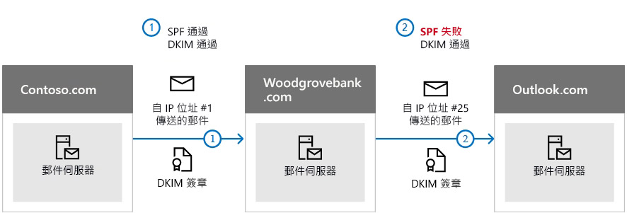

# <a name="use-dkim-to-validate-outbound-email-sent-from-your-custom-domain-in-office-365"></a><span data-ttu-id="e0164-103">使用 DKIM 驗證從您在 Office 365 中的自訂網域傳送的輸出電子郵件</span><span class="sxs-lookup"><span data-stu-id="e0164-103">Use DKIM to validate outbound email sent from your custom domain in Office 365</span></span>

 <span data-ttu-id="e0164-104">**摘要：** 本文將告訴您如何使用 DomainKeys 識別郵件 (DKIM) 與 Office 365 以確定目的地的電子郵件系統信任從自訂網域傳送的訊息。</span><span class="sxs-lookup"><span data-stu-id="e0164-104">**Summary:** This article describes how you use DomainKeys Identified Mail (DKIM) with Office 365 to ensure that destination email systems trust messages sent from your custom domain.</span></span> 
  
<span data-ttu-id="e0164-p101">您應該使用 DKIM 除了 SPF 和 DMARC 避免 spoofers 傳送看起來像它們來自您網域的郵件。DKIM 可讓您將數位簽章新增至郵件標頭中的電子郵件訊息。複雜的聲音，但其確實不是。當您設定 DKIM 時，您授權網域建立關聯，或登入電子郵件訊息使用密碼編譯驗證其名稱。從您的網域接收電子郵件的電子郵件系統可以使用此數位簽章可協助判斷其接收內送電子郵件是否合法。</span><span class="sxs-lookup"><span data-stu-id="e0164-p101">You should use DKIM in addition to SPF and DMARC to help prevent spoofers from sending messages that look like they are coming from your domain. DKIM lets you add a digital signature to email messages in the message header. Sounds complicated, but it's really not. When you configure DKIM, you authorize your domain to associate, or sign, its name to an email message by using cryptographic authentication. Email systems that receive email from your domain can use this digital signature to help determine if incoming email that they receive is legitimate.</span></span>
  
<span data-ttu-id="e0164-p102">基本上，您可使用私密金鑰來加密您的網域外寄電子郵件中的頁首。您可以發佈公開金鑰接收伺服器可以使用解碼簽章的網域的 DNS 記錄。他們使用公開金鑰來確認訊息會真正來自您並不來自詐騙網域某人。</span><span class="sxs-lookup"><span data-stu-id="e0164-p102">Basically, you use a private key to encrypt the header in your domain's outgoing email. You publish a public key to your domain's DNS records that receiving servers can then use to decode the signature. They use the public key to verify that the messages are really coming from you and not coming from someone spoofing your domain.</span></span>
  
<span data-ttu-id="e0164-p103">Office 365 自動會設定 DKIM 的初始網域。初始網域是當您使用的服務，例如 contoso.onmicrosoft.com 註冊為您建立 Office 365 的網域。您不需要執行任何動作來設定 DKIM 初始網域。如需網域的詳細資訊，請參閱 ＜[網域常見問題集](https://support.office.com/article/Domains-FAQ-1272bad0-4bd4-4796-8005-67d6fb3afc5a#bkmk_whydoihaveanonmicrosoft.comdomain)。</span><span class="sxs-lookup"><span data-stu-id="e0164-p103">Office 365 automatically sets up DKIM for initial domains. The initial domain is the domain that Office 365 created for you when you signed up with the service, for example, contoso.onmicrosoft.com. You don't need to do anything to set up DKIM for your initial domain. For more information about domains, see [Domains FAQ](https://support.office.com/article/Domains-FAQ-1272bad0-4bd4-4796-8005-67d6fb3afc5a#bkmk_whydoihaveanonmicrosoft.comdomain).</span></span>
  
<span data-ttu-id="e0164-p104">您可以選擇執行任何 DKIM 相關動作的自訂網域。若不要為您的自訂網域設定 DKIM、 Office 365 建立私密與公開金鑰組、 啟用 DKIM 簽署，並設定巡自訂網域的 Office 365 預設原則。雖然這是大部分的 Office 365 客戶的足夠涵蓋範圍，您應該以手動方式設定 DKIM 自訂網域在下列情況：</span><span class="sxs-lookup"><span data-stu-id="e0164-p104">You can choose to do nothing about DKIM for your custom domain too. If you do not set up DKIM for your custom domain, Office 365 creates a private and public key pair, enables DKIM signing, and then configures the Office 365 default policy for your custom domain. While this is sufficient coverage for most Office 365 customers, you should manually configure DKIM for your custom domain in the following circumstances:</span></span>
  
- <span data-ttu-id="e0164-120">您有多個自訂網域在 Office 365</span><span class="sxs-lookup"><span data-stu-id="e0164-120">You have more than one custom domain in Office 365</span></span>
    
- <span data-ttu-id="e0164-121">您要設定 DMARC 太 （建議）</span><span class="sxs-lookup"><span data-stu-id="e0164-121">You're going to set up DMARC too (recommended)</span></span>
    
- <span data-ttu-id="e0164-122">您想要控制您的私密金鑰</span><span class="sxs-lookup"><span data-stu-id="e0164-122">You want control over your private key</span></span>
    
- <span data-ttu-id="e0164-123">您要自訂 CNAME 記錄</span><span class="sxs-lookup"><span data-stu-id="e0164-123">You want to customize your CNAME records</span></span>
    
- <span data-ttu-id="e0164-124">您要設定 DKIM 機碼不在協力廠商網域，例如源自的電子郵件如果您使用協力廠商大量郵件處理程式。</span><span class="sxs-lookup"><span data-stu-id="e0164-124">You want to set up DKIM keys for email originating out of a third-party domain, for example, if you use a third-party bulk mailer.</span></span>
    
<span data-ttu-id="e0164-125">本文內容：</span><span class="sxs-lookup"><span data-stu-id="e0164-125">In this article:</span></span>
  
- [<span data-ttu-id="e0164-126">DKIM 優於 SPF 單獨以避免遭到惡意詐騙 Office 365 中運作的方式</span><span class="sxs-lookup"><span data-stu-id="e0164-126">How DKIM works better than SPF alone to prevent malicious spoofing in Office 365</span></span>](use-dkim-to-validate-outbound-email.md#HowDKIMWorks)
    
- [<span data-ttu-id="e0164-127">您需要手動設定 Office 365 中的 DKIM 執行動作</span><span class="sxs-lookup"><span data-stu-id="e0164-127">What you need to do to manually set up DKIM in Office 365</span></span>](use-dkim-to-validate-outbound-email.md#SetUpDKIMO365)
    
- [<span data-ttu-id="e0164-128">若要設定多個自訂網域在 Office 365 DKIM</span><span class="sxs-lookup"><span data-stu-id="e0164-128">To configure DKIM for more than one custom domain in Office 365</span></span>](use-dkim-to-validate-outbound-email.md#DKIMMultiDomain)
    
- [<span data-ttu-id="e0164-129">停用 DKIM 簽署 Office 365 中的自訂網域原則</span><span class="sxs-lookup"><span data-stu-id="e0164-129">Disabling the DKIM signing policy for a custom domain in Office 365</span></span>](use-dkim-to-validate-outbound-email.md#DisableDKIMSigningPolicy)
    
- [<span data-ttu-id="e0164-130">DKIM 與 Office 365 的預設行為</span><span class="sxs-lookup"><span data-stu-id="e0164-130">Default behavior for DKIM and Office 365</span></span>](use-dkim-to-validate-outbound-email.md#DefaultDKIMbehavior)
    
- <span data-ttu-id="e0164-131">[設定 DKIM 才能讓協力廠商服務可傳送] 或詐騙代表自訂網域的電子郵件](use-dkim-to-validate-outbound-email.md#SetUp3rdPartyspoof)</span><span class="sxs-lookup"><span data-stu-id="e0164-131">[Set up DKIM so that a third-party service can send, or spoof, email on behalf of your custom domain](use-dkim-to-validate-outbound-email.md#SetUp3rdPartyspoof)</span></span>
    
- [<span data-ttu-id="e0164-132">後續步驟： 您針對 Office 365 設定 DKIM 之後</span><span class="sxs-lookup"><span data-stu-id="e0164-132">Next steps: After you set up DKIM for Office 365</span></span>](use-dkim-to-validate-outbound-email.md#DKIMNextSteps)
    
## <a name="how-dkim-works-better-than-spf-alone-to-prevent-malicious-spoofing-in-office-365"></a><span data-ttu-id="e0164-133">DKIM 優於 SPF 單獨以避免遭到惡意詐騙 Office 365 中運作的方式</span><span class="sxs-lookup"><span data-stu-id="e0164-133">How DKIM works better than SPF alone to prevent malicious spoofing in Office 365</span></span>
<span data-ttu-id="e0164-134"><a name="HowDKIMWorks"> </a></span><span class="sxs-lookup"><span data-stu-id="e0164-134"></span></span>

<span data-ttu-id="e0164-p105">SPF 將資訊新增至郵件信封，但 DKIM 真的要加密的郵件標頭中的簽章。當您將郵件轉寄時，部分的郵件信封可以是已除去離開轉接伺服器。由於數位簽章保持電子郵件訊息由於電子郵件標頭的一部分，適用於 DKIM 即使當郵件已轉寄如下列範例所示。</span><span class="sxs-lookup"><span data-stu-id="e0164-p105">SPF adds information to a message envelope but DKIM actually encrypts a signature within the message header. When you forward a message, portions of that message's envelope can be stripped away by the forwarding server. Since the digital signature stays with the email message because it's part of the email header, DKIM works even when a message has been forwarded as shown in the following example.</span></span>
  

  
<span data-ttu-id="e0164-p106">在這個範例中，如果您僅有發佈的 SPF TXT 記錄您網域的收件者的郵件伺服器可能已標記為垃圾電子郵件並產生 false 正值的結果。在此案例中加入 DKIM 減少 false 正數垃圾郵件報告。因為 DKIM 依賴公開金鑰加密來驗證並不只是 IP 位址、 DKIM 會被視為多更有力表單驗證的 SPF 比。我們建議使用 SPF 並 DKIM，以及 DMARC 部署中。</span><span class="sxs-lookup"><span data-stu-id="e0164-p106">In this example, if you had only published an SPF TXT record for your domain, the recipient's mail server could have marked your email as spam and generated a false positive result. The addition of DKIM in this scenario reduces false positive spam reporting. Because DKIM relies on public key cryptography to authenticate and not just IP addresses, DKIM is considered a much stronger form of authentication than SPF. We recommend using both SPF and DKIM, as well as DMARC in your deployment.</span></span>
  
<span data-ttu-id="e0164-p107">講述至今： DKIM 使用的私密金鑰來加密的簽章插入郵件標頭。簽署網域或輸出網域插入的值為**d =** 在標頭] 欄位。確認網域，] 或 [收件者的網域，然後使用**d =** 從 DNS 查閱公開金鑰及驗證郵件] 欄位。如果已驗證的訊息，會傳遞 DKIM] 核取。</span><span class="sxs-lookup"><span data-stu-id="e0164-p107">The nitty gritty: DKIM uses a private key to insert an encrypted signature into the message headers. The signing domain, or outbound domain, is inserted as the value of the **d=** field in the header. The verifying domain, or recipient's domain, then use the **d=** field to look up the public key from DNS and authenticate the message. If the message is verified, the DKIM check passes.</span></span> 
  
## <a name="what-you-need-to-do-to-manually-set-up-dkim-in-office-365"></a><span data-ttu-id="e0164-147">您需要手動設定 Office 365 中的 DKIM 執行動作</span><span class="sxs-lookup"><span data-stu-id="e0164-147">What you need to do to manually set up DKIM in Office 365</span></span>
<span data-ttu-id="e0164-148"><a name="SetUpDKIMO365"> </a></span><span class="sxs-lookup"><span data-stu-id="e0164-148"></span></span>

<span data-ttu-id="e0164-149">若要設定 DKIM，您將會完成下列步驟：</span><span class="sxs-lookup"><span data-stu-id="e0164-149">To configure DKIM, you will complete these steps:</span></span>
  
- [<span data-ttu-id="e0164-150">在 DNS 中發佈兩個自訂網域的 CNAME 記錄</span><span class="sxs-lookup"><span data-stu-id="e0164-150">Publish two CNAME records for your custom domain in DNS</span></span>](use-dkim-to-validate-outbound-email.md#Publish2CNAME)
    
- [<span data-ttu-id="e0164-151">啟用 DKIM 簽署的自訂網域在 Office 365</span><span class="sxs-lookup"><span data-stu-id="e0164-151">Enable DKIM signing for your custom domain in Office 365</span></span>](use-dkim-to-validate-outbound-email.md#EnableDKIMinO365)
    
### <a name="publish-two-cname-records-for-your-custom-domain-in-dns"></a><span data-ttu-id="e0164-152">在 DNS 中發佈兩個自訂網域的 CNAME 記錄</span><span class="sxs-lookup"><span data-stu-id="e0164-152">Publish two CNAME records for your custom domain in DNS</span></span>
<span data-ttu-id="e0164-153"><a name="Publish2CNAME"> </a></span><span class="sxs-lookup"><span data-stu-id="e0164-153"></span></span>

<span data-ttu-id="e0164-p108">您要將 DKIM 簽章新增在 DNS 中每個的網域，您需要將發佈兩個 CNAME 記錄。CNAME 記錄的 DNS 用以指定網域的正式名稱是其他網域名稱的別名。</span><span class="sxs-lookup"><span data-stu-id="e0164-p108">For each domain for which you want to add a DKIM signature in DNS, you need to publish two CNAME records. A CNAME record is used by DNS to specify that the canonical name of a domain is an alias for another domain name.</span></span> 
  
 <span data-ttu-id="e0164-p109">Office 365 執行自動使用您所建立的兩個記錄的重要旋轉角度。如果您已佈建除了初始網域在 Office 365 中的自訂網域，您必須發佈兩個每個其他網域的 CNAME 記錄。因此，如果您有兩個網域，您必須發佈兩個額外的 CNAME 記錄，等等。</span><span class="sxs-lookup"><span data-stu-id="e0164-p109">Office 365 performs automatic key rotation using the two records that you establish. If you have provisioned custom domains in addition to the initial domain in Office 365, you must publish two CNAME records for each additional domain. So, if you have two domains, you must publish two additional CNAME records, and so on.</span></span> 
  
<span data-ttu-id="e0164-159">使用下列格式的 CNAME 記錄：</span><span class="sxs-lookup"><span data-stu-id="e0164-159">Use the following format for the CNAME records:</span></span>
  
```
Host name:          selector1._domainkey.<domain>
Points to address or value: selector1-<domainGUID>._domainkey.<initialDomain> 
TTL:                3600

Host name:          selector2._domainkey.<domain>
Points to address or value: selector2-<domainGUID>._domainkey.<initialDomain> 
TTL:                3600
```

<span data-ttu-id="e0164-160">其中：</span><span class="sxs-lookup"><span data-stu-id="e0164-160">Where:</span></span>
  
- <span data-ttu-id="e0164-161">Office 365 選取器一律是"selector1"或"selector2"。</span><span class="sxs-lookup"><span data-stu-id="e0164-161">For Office 365, the selectors will always be "selector1" or "selector2".</span></span> 
    
- <span data-ttu-id="e0164-p110">_domainGUID_是在自訂 MX 記錄的自訂網域出現之前 mail.protection.outlook.com _domainGUID_相同。例如，在網域 contoso.com 的下列 MX 記錄， _domainGUID_是 contoso com:</span><span class="sxs-lookup"><span data-stu-id="e0164-p110">_domainGUID_ is the same as the _domainGUID_ in the customized MX record for your custom domain that appears before mail.protection.outlook.com. For example, in the following MX record for the domain contoso.com, the _domainGUID_ is contoso-com:</span></span> 
    
    ```
    contoso.com.  3600  IN  MX   5 contoso-com.mail.protection.outlook.com
    ```

- <span data-ttu-id="e0164-p111">_initialDomain_是註冊 Office 365 時所使用的網域。如需決定在初始網域的資訊，請參閱 ＜[網域常見問題集](https://support.office.com/article/1272bad0-4bd4-4796-8005-67d6fb3afc5a#bkmk_whydoihaveanonmicrosoft.comdomain)。</span><span class="sxs-lookup"><span data-stu-id="e0164-p111">_initialDomain_ is the domain that you used when you signed up for Office 365. For information about determining your initial domain, see [Domains FAQ](https://support.office.com/article/1272bad0-4bd4-4796-8005-67d6fb3afc5a#bkmk_whydoihaveanonmicrosoft.comdomain).</span></span>
    
<span data-ttu-id="e0164-166">例如，如果您有 cohovineyardandwinery.onmicrosoft.com、 初始網域和兩個自訂網域 cohovineyard.com cohowinery.com，就必須設定兩個總共四個 CNAME 記錄的每個其他網域的 CNAME 記錄。</span><span class="sxs-lookup"><span data-stu-id="e0164-166">For example, if you have an initial domain of cohovineyardandwinery.onmicrosoft.com, and two custom domains cohovineyard.com and cohowinery.com, you would need to set up two CNAME records for each additional domain, for a total of four CNAME records.</span></span>
  
```
Host name:          selector1._domainkey.cohovineyard.com  
Points to address or value: selector1-cohovineyard-com._domainkey.cohovineyardandwinery.onmicrosoft.com
TTL:                3600

Host name:          selector2._domainkey.cohovineyard.com  
Points to address or value: selector2-cohovineyard-com._domainkey.cohovineyardandwinery.onmicrosoft.com
TTL:                3600

Host name:          selector1._domainkey.cohowinery.com
Points to address or value: selector1-cohowinery-com._domainkey.cohovineyardandwinery.onmicrosoft.com 
TTL:                3600
 
Host name:          selector2._domainkey.cohowinery.com
Points to address or value: selector2-cohowinery-com._domainkey.cohovineyardandwinery.onmicrosoft.com 
TTL:                3600
```

### <a name="enable-dkim-signing-for-your-custom-domain-in-office-365"></a><span data-ttu-id="e0164-167">啟用 DKIM 簽署的自訂網域在 Office 365</span><span class="sxs-lookup"><span data-stu-id="e0164-167">Enable DKIM signing for your custom domain in Office 365</span></span>
<span data-ttu-id="e0164-168"><a name="EnableDKIMinO365"> </a></span><span class="sxs-lookup"><span data-stu-id="e0164-168"></span></span>

<span data-ttu-id="e0164-p112">一旦您已經在 DNS 中發佈的 CNAME 記錄，您就可以啟用 DKIM 簽署透過 Office 365。透過 Office 365 系統管理中心或使用 PowerShell 您可以這麼做。</span><span class="sxs-lookup"><span data-stu-id="e0164-p112">Once you have published the CNAME records in DNS, you are ready to enable DKIM signing through Office 365. You can do this either through the Office 365 admin center or by using PowerShell.</span></span>
  
#### <a name="to-enable-dkim-signing-for-your-custom-domain-through-the-office-365-admin-center"></a><span data-ttu-id="e0164-171">若要啟用 DKIM 簽署的自訂網域透過 Office 365 系統管理中心</span><span class="sxs-lookup"><span data-stu-id="e0164-171">To enable DKIM signing for your custom domain through the Office 365 admin center</span></span>

1. <span data-ttu-id="e0164-172">使用您的 公司或學校帳戶[登入 Office 365](https://support.office.microsoft.com/article/e9eb7d51-5430-4929-91ab-6157c5a050b4)。</span><span class="sxs-lookup"><span data-stu-id="e0164-172">[Sign in to Office 365](https://support.office.microsoft.com/article/e9eb7d51-5430-4929-91ab-6157c5a050b4) with your work or school account.</span></span> 
    
2. <span data-ttu-id="e0164-173">選取左上角的應用程式啟動器圖示，然後選擇 [管理員]\*\*\*\*。</span><span class="sxs-lookup"><span data-stu-id="e0164-173">Select the app launcher icon in the upper-left and choose **Admin**.</span></span>
    
3. <span data-ttu-id="e0164-174">左下瀏覽窗格中展開 [**系統管理**，並選擇 [ **Exchange**。</span><span class="sxs-lookup"><span data-stu-id="e0164-174">In the lower-left navigation, expand **Admin** and choose **Exchange**.</span></span>
    
4. <span data-ttu-id="e0164-175">移至 [**保護** \> **dkim**。</span><span class="sxs-lookup"><span data-stu-id="e0164-175">Go to **Protection** \> **dkim**.</span></span>
    
5. <span data-ttu-id="e0164-p113">選取您要啟用 DKIM，然後**登 DKIM 簽章與這個網域的郵件**，選擇 [**啟用**的網域。針對每個自訂網域重複此步驟。</span><span class="sxs-lookup"><span data-stu-id="e0164-p113">Select the domain for which you want to enable DKIM and then, for **Sign messages for this domain with DKIM signatures**, choose **Enable**. Repeat this step for each custom domain.</span></span>
    
#### <a name="to-enable-dkim-signing-for-your-custom-domain-by-using-powershell"></a><span data-ttu-id="e0164-178">若要啟用 DKIM 簽署的自訂網域透過 PowerShell</span><span class="sxs-lookup"><span data-stu-id="e0164-178">To enable DKIM signing for your custom domain by using PowerShell</span></span>

1. <span data-ttu-id="e0164-179">[連線至 Exchange Online PowerShell](https://technet.microsoft.com/library/jj984289.aspx) (機器翻譯)。</span><span class="sxs-lookup"><span data-stu-id="e0164-179">[Connect to Exchange Online PowerShell](https://technet.microsoft.com/library/jj984289.aspx).</span></span>
    
2. <span data-ttu-id="e0164-180">執行下列命令：</span><span class="sxs-lookup"><span data-stu-id="e0164-180">Run the following command:</span></span>
    
    ```
    New-DkimSigningConfig -DomainName <domain> -Enabled $true
    ```

   <span data-ttu-id="e0164-181">其中_網域_是您想要啟用 DKIM 簽署的自訂網域名稱。</span><span class="sxs-lookup"><span data-stu-id="e0164-181">Where _domain_ is the name of the custom domain that you want to enable DKIM signing for.</span></span> 
    
   <span data-ttu-id="e0164-182">例如，網域 contoso.com 的：</span><span class="sxs-lookup"><span data-stu-id="e0164-182">For example, for the domain contoso.com:</span></span>
    
    ```
    New-DkimSigningConfig -DomainName contoso.com -Enabled $true
    ```

#### <a name="to-confirm-dkim-signing-is-configured-properly-for-office-365"></a><span data-ttu-id="e0164-183">若要確認 DKIM 簽署的設定正確的 Office 365</span><span class="sxs-lookup"><span data-stu-id="e0164-183">To Confirm DKIM signing is configured properly for Office 365</span></span>

<span data-ttu-id="e0164-p114">等候幾分鐘時間才能遵循這些步驟以確認您已正確設定 DKIM。這可讓散佈整個網路網域的 DKIM 資訊的時間。</span><span class="sxs-lookup"><span data-stu-id="e0164-p114">Wait a few minutes before you follow these steps to confirm that you have properly configured DKIM. This allows time for the DKIM information about the domain to be spread throughout the network.</span></span>
  
- <span data-ttu-id="e0164-186">將郵件從內啟用 Office 365 DKIM 的網域帳戶傳送到如 outlook.com 或還是其他電子郵件帳戶。</span><span class="sxs-lookup"><span data-stu-id="e0164-186">Send a message from an account within your Office 365 DKIM-enabled domain to another email account such as outlook.com or Hotmail.com.</span></span>
    
- <span data-ttu-id="e0164-p115">請勿使用 aol.com 帳戶針對測試用途。AOL 可能會略過 DKIM 檢查如果通過 SPF] 核取。這將會進行造成測試。</span><span class="sxs-lookup"><span data-stu-id="e0164-p115">Do not use an aol.com account for testing purposes. AOL may skip the DKIM check if the SPF check passes. This will nullify your test.</span></span>
    
- <span data-ttu-id="e0164-p116">開啟郵件並查看標頭。檢視郵件標頭指示目視郵件用戶端。如需在 Outlook 中檢視郵件標頭的指示，請參閱 ＜[檢視的電子郵件訊息標頭](https://support.office.com/article/CD039382-DC6E-4264-AC74-C048563D212C)。</span><span class="sxs-lookup"><span data-stu-id="e0164-p116">Open the message and look at the header. Instructions for viewing the header for the message will vary depending on your messaging client. For instructions on viewing message headers in Outlook, see [View e-mail message headers](https://support.office.com/article/CD039382-DC6E-4264-AC74-C048563D212C).</span></span>

  <span data-ttu-id="e0164-p117">DKIM 簽署郵件會包含的主機名稱與您定義發佈 CNAME 項目時的網域。郵件的外觀類似此範例會如下：</span><span class="sxs-lookup"><span data-stu-id="e0164-p117">The DKIM-signed message will contain the host name and domain you defined when you published the CNAME entries. The message will look something like this example:</span></span> 
    
    ```
    From: Example User <example@contoso.com> 
    DKIM-Signature: v=1; a=rsa-sha256; q=dns/txt; c=relaxed/relaxed; 
        s=selector1; d=contoso.com; t=1429912795; 
        h=From:To:Message-ID:Subject:MIME-Version:Content-Type; 
        bh=<body hash>; 
        b=<signed field>;
    ```

- <span data-ttu-id="e0164-p118">尋找驗證結果標頭。雖然每個接收服務使用內送郵件加上戳記稍有不同的格式，其結果應該包含類似如下**DKIM = 傳遞**或**DKIM = 確定**。</span><span class="sxs-lookup"><span data-stu-id="e0164-p118">Look for the Authentication-Results header. While each receiving service uses a slightly different format to stamp the incoming mail, the result should include something like **DKIM=pass** or **DKIM=OK**.</span></span> 
    
## <a name="to-configure-dkim-for-more-than-one-custom-domain-in-office-365"></a><span data-ttu-id="e0164-197">若要設定多個自訂網域在 Office 365 DKIM</span><span class="sxs-lookup"><span data-stu-id="e0164-197">To configure DKIM for more than one custom domain in Office 365</span></span>
<span data-ttu-id="e0164-198"><a name="DKIMMultiDomain"> </a></span><span class="sxs-lookup"><span data-stu-id="e0164-198"></span></span>

<span data-ttu-id="e0164-p119">如果在某些未來您決定要新增另一個自訂的網域且您想要啟用 DKIM 為新的網域，您必須完成本文中的每個網域中的步驟。尤其是完成中[必須執行手動設定 DKIM Office 365 中](use-dkim-to-validate-outbound-email.md#SetUpDKIMO365)的所有步驟。</span><span class="sxs-lookup"><span data-stu-id="e0164-p119">If at some point in the future you decide to add another custom domain and you want to enable DKIM for the new domain, you must complete the steps in this article for each domain. Specifically, complete all steps in [What you need to do to manually set up DKIM in Office 365](use-dkim-to-validate-outbound-email.md#SetUpDKIMO365).</span></span>
  
## <a name="disabling-the-dkim-signing-policy-for-a-custom-domain-in-office-365"></a><span data-ttu-id="e0164-201">停用 DKIM 簽署 Office 365 中的自訂網域原則</span><span class="sxs-lookup"><span data-stu-id="e0164-201">Disabling the DKIM signing policy for a custom domain in Office 365</span></span>
<span data-ttu-id="e0164-202"><a name="DisableDKIMSigningPolicy"> </a></span><span class="sxs-lookup"><span data-stu-id="e0164-202"></span></span>

<span data-ttu-id="e0164-p120">停用簽署原則不會不會完全停用 DKIM。在一段時間內，Office 365 會自動套用預設的 Office 365 原則為您的網域。如需詳細資訊，請參閱[預設 DKIM 與 Office 365 的行為](use-dkim-to-validate-outbound-email.md#DefaultDKIMbehavior)。</span><span class="sxs-lookup"><span data-stu-id="e0164-p120">Disabling the signing policy does not completely disable DKIM. After a period of time, Office 365 will automatically apply the default Office 365 policy for your domain. For more information, see [Default behavior for DKIM and Office 365](use-dkim-to-validate-outbound-email.md#DefaultDKIMbehavior).</span></span>
  
### <a name="to-disable-the-dkim-signing-policy-by-using-windows-powershell"></a><span data-ttu-id="e0164-206">若要停用 DKIM 簽署原則使用 Windows PowerShell</span><span class="sxs-lookup"><span data-stu-id="e0164-206">To disable the DKIM signing policy by using Windows PowerShell</span></span>

1. <span data-ttu-id="e0164-207">[連線至 Exchange Online PowerShell](https://technet.microsoft.com/library/jj984289.aspx) (機器翻譯)。</span><span class="sxs-lookup"><span data-stu-id="e0164-207">[Connect to Exchange Online PowerShell](https://technet.microsoft.com/library/jj984289.aspx).</span></span>
    
2. <span data-ttu-id="e0164-208">執行下列命令為您要停用 DKIM 簽署每個網域。</span><span class="sxs-lookup"><span data-stu-id="e0164-208">Run one of the following commands for each domain for which you want to disable DKIM signing.</span></span>
    
    ```
    $p=Get-DkimSigningConfig -identity <domain>
    $p[0] | set-DkimSigningConfig -enabled $false
    ```

   <span data-ttu-id="e0164-209">例如：</span><span class="sxs-lookup"><span data-stu-id="e0164-209">For example:</span></span>
    
    ```
    $p=Get-DkimSigningConfig -identity contoso.com
    $p[0] | set-DkimSigningConfig -enabled $false
    ```

   <span data-ttu-id="e0164-210">或者</span><span class="sxs-lookup"><span data-stu-id="e0164-210">Or</span></span>
    
    ```
    Set-DkimSigningConfig -identity $p[<number>].identity -enabled $false
    ```

    <span data-ttu-id="e0164-p121">其中_號碼_是原則的索引。例如：</span><span class="sxs-lookup"><span data-stu-id="e0164-p121">Where _number_ is the index of the policy. For example:</span></span> 
    
    ```
    Set-DkimSigningConfig -identity $p[0].identity -enabled $false
    ```

## <a name="default-behavior-for-dkim-and-office-365"></a><span data-ttu-id="e0164-213">DKIM 與 Office 365 的預設行為</span><span class="sxs-lookup"><span data-stu-id="e0164-213">Default behavior for DKIM and Office 365</span></span>
<span data-ttu-id="e0164-214"><a name="DefaultDKIMbehavior"> </a></span><span class="sxs-lookup"><span data-stu-id="e0164-214"></span></span>

<span data-ttu-id="e0164-p122">如果您不要啟用 DKIM、 Office 365 會自動建立 1024年位元 DKIM 公開金鑰的自訂網域和相關聯的私密金鑰的我們內部儲存在我們的資料中心。根據預設，Office 365 使用簽署備妥沒有原則的網域設定為預設。這表示如果您不需要設定 DKIM 自行、 Office 365 將會使用其預設原則和以啟用 DKIM 網域建立的機碼。</span><span class="sxs-lookup"><span data-stu-id="e0164-p122">If you do not enable DKIM, Office 365 automatically creates a 1024-bit DKIM public key for your custom domain and the associated private key which we store internally in our datacenter. By default, Office 365 uses a default signing configuration for domains that do not have a policy in place. This means that if you do not set up DKIM yourself, Office 365 will use its default policy and keys it creates in order to enable DKIM for your domain.</span></span>
  
<span data-ttu-id="e0164-218">此外，如果您停用 DKIM 簽署之後，啟用一段時間之後，Office 365 將自動套用您網域的 Office 365 預設原則。</span><span class="sxs-lookup"><span data-stu-id="e0164-218">Also, if you disable DKIM signing after enabling it, after a period of time, Office 365 will automatically apply the Office 365 default policy for your domain.</span></span>
  
<span data-ttu-id="e0164-p123">在下列範例中，假設已啟用為 fabrikam.com 的 DKIM 時由 Office 365 中，而不是依之網域的系統管理員。這表示需要的 Cname 不要在 DNS 中存在。從這個網域的電子郵件的 DKIM 簽章看起來會類似：</span><span class="sxs-lookup"><span data-stu-id="e0164-p123">In the following example, suppose that DKIM for fabrikam.com was enabled by Office 365, not by the administrator of the domain. This means that the required CNAMEs do not exist in DNS. DKIM signatures for email from this domain will look something like this:</span></span>
  
```
From: Second Example <second.example@fabrikam.com> 
DKIM-Signature: v=1; a=rsa-sha256; q=dns/txt; c=relaxed/relaxed; 
    s=selector1-fabrikam-com; d=contoso.onmicrosoft.com; t=1429912795; 
    h=From:To:Message-ID:Subject:MIME-Version:Content-Type; 
    bh=<body hash>; 
    b=<signed field>;
```

<span data-ttu-id="e0164-p124">在此範例中的主機名稱與網域包含要 CNAME 會指向如果 fabrikam.com DKIM 簽署鎖網域系統管理員所啟用的值。最後，從 Office 365 傳送每一個單一訊息將會 DKIM 簽署。如果您自行啟用 DKIM，網域將會在 [從網域相同： 位址，在此案例的 fabrikam.com。如果您未將不會對齊並將改用貴組織的初始網域。如需決定在初始網域的資訊，請參閱 ＜[網域常見問題集](https://support.office.com/article/1272bad0-4bd4-4796-8005-67d6fb3afc5a#bkmk_whydoihaveanonmicrosoft.comdomain)。</span><span class="sxs-lookup"><span data-stu-id="e0164-p124">In this example, the host name and domain contain the values to which the CNAME would point if DKIM-signing for fabrikam.com had been enabled by the domain administrator. Eventually, every single message sent from Office 365 will be DKIM-signed. If you enable DKIM yourself, the domain will be the same as the domain in the From: address, in this case fabrikam.com. If you don't, it will not align and instead will use your organization's initial domain. For information about determining your initial domain, see [Domains FAQ](https://support.office.com/article/1272bad0-4bd4-4796-8005-67d6fb3afc5a#bkmk_whydoihaveanonmicrosoft.comdomain).</span></span>
  
## <a name="set-up-dkim-so-that-a-third-party-service-can-send-or-spoof-email-on-behalf-of-your-custom-domain"></a><span data-ttu-id="e0164-227">設定 DKIM 才能讓協力廠商服務可傳送] 或詐騙代表自訂網域的電子郵件</span><span class="sxs-lookup"><span data-stu-id="e0164-227">Set up DKIM so that a third-party service can send, or spoof, email on behalf of your custom domain</span></span>
<span data-ttu-id="e0164-228"><a name="SetUp3rdPartyspoof"> </a></span><span class="sxs-lookup"><span data-stu-id="e0164-228"></span></span>

<span data-ttu-id="e0164-p125">某些大量電子郵件服務提供者或軟體為-a-服務提供者可讓您設定電子郵件來自其服務 DKIM 機碼。這需要自行與協力廠商之間協調才能設定所需的 DNS 記錄。沒有兩個組織必須進行完全相同的方式。而是程序取決於整個組織。</span><span class="sxs-lookup"><span data-stu-id="e0164-p125">Some bulk email service providers, or software-as-a-service providers, let you set up DKIM keys for email that originates from their service. This requires coordination between yourself and the third-party in order to set up the necessary DNS records. No two organizations do it exactly the same way. Instead, the process depends entirely on the organization.</span></span>
  
<span data-ttu-id="e0164-233">顯示為 contoso.com 和 bulkemailprovider.com 正確設定的 DKIM 範例訊息可能看起來如下：</span><span class="sxs-lookup"><span data-stu-id="e0164-233">An example message showing a properly configured DKIM for contoso.com and bulkemailprovider.com might look like this:</span></span>
  
```
Return-Path: <communication@bulkemailprovider.com>
 From: <sender@contoso.com>
 DKIM-Signature: s=s1024; d=contoso.com
 Subject: Here is a message from Bulk Email Provider's infrastructure, but with a DKIM signature authorized by contoso.com
```

<span data-ttu-id="e0164-234">在這個範例中，以達到此結果：</span><span class="sxs-lookup"><span data-stu-id="e0164-234">In this example, in order to achieve this result:</span></span>
  
1. <span data-ttu-id="e0164-235">大量電子郵件供應商授與 Contoso DKIM 公開金鑰。</span><span class="sxs-lookup"><span data-stu-id="e0164-235">Bulk Email Provider gave Contoso a public DKIM key.</span></span>
    
2. <span data-ttu-id="e0164-236">Contoso 發佈 DKIM 金鑰及其 DNS 記錄。</span><span class="sxs-lookup"><span data-stu-id="e0164-236">Contoso published the DKIM key to its DNS record.</span></span>
    
3. <span data-ttu-id="e0164-p126">時傳送電子郵件、 大量電子郵件供應商簽署金鑰與對應的私密金鑰。如此一來，大量電子郵件供應商附加 DKIM 簽章的郵件標頭。</span><span class="sxs-lookup"><span data-stu-id="e0164-p126">When sending email, Bulk Email Provider signs the key with the corresponding private key. By doing so, Bulk Email Provider attached the DKIM signature to the message header.</span></span>
    
4. <span data-ttu-id="e0164-p127">接收的電子郵件系統來執行 DKIM] 核取驗證 DKIM 簽章 d =\<網域\>針對在 [從網域的值： (5322.From) 之郵件的地址。在此範例中的值符合：</span><span class="sxs-lookup"><span data-stu-id="e0164-p127">Receiving email systems perform a DKIM check by authenticating the DKIM-Signature d=\<domain\> value against the domain in the From: (5322.From) address of the message. In this example, the values match:</span></span>
    
    <span data-ttu-id="e0164-241">寄件者 @**contoso.com**</span><span class="sxs-lookup"><span data-stu-id="e0164-241">sender@**contoso.com**</span></span>
    
    <span data-ttu-id="e0164-242">d =**contoso.com**</span><span class="sxs-lookup"><span data-stu-id="e0164-242">d=**contoso.com**</span></span>
    
## <a name="next-steps-after-you-set-up-dkim-for-office-365"></a><span data-ttu-id="e0164-243">後續步驟： 您針對 Office 365 設定 DKIM 之後</span><span class="sxs-lookup"><span data-stu-id="e0164-243">Next steps: After you set up DKIM for Office 365</span></span>
<span data-ttu-id="e0164-244"><a name="DKIMNextSteps"> </a></span><span class="sxs-lookup"><span data-stu-id="e0164-244"></span></span>

<span data-ttu-id="e0164-p128">雖然 DKIM 專門設計來協助防止詐騙、 DKIM 適用於更妥善地 SPF 和 DMARC。一旦您已設定好 DKIM，如果您已經不已經設定 SPF 您應達成。快速介紹 SPF 以及要取得其快速地設定，請參閱[Set up SPF 避免詐騙的 Office 365 中](set-up-spf-in-office-365-to-help-prevent-spoofing.md)。更深入了解 Office 365 如何使用 SPF，或者例如混合部署的疑難排解或非標準部署開始使用[Office 365 如何使用寄件者原則架構 (SPF) 若要防止詐騙](how-office-365-uses-spf-to-prevent-spoofing.md)。接下來，請參閱[使用 DMARC 來驗證 Office 365 中的電子郵件](use-dmarc-to-validate-email.md)。[反垃圾郵件郵件標頭](anti-spam-message-headers.md)包含 DKIM 檢查 Office 365 所使用的語法和標頭欄位。</span><span class="sxs-lookup"><span data-stu-id="e0164-p128">Although DKIM is designed to help prevent spoofing, DKIM works better with SPF and DMARC. Once you have set up DKIM, if you have not already set up SPF you should do so. For a quick introduction to SPF and to get it configured quickly, see [Set up SPF in Office 365 to help prevent spoofing](set-up-spf-in-office-365-to-help-prevent-spoofing.md). For a more in-depth understanding of how Office 365 uses SPF, or for troubleshooting or non-standard deployments such as hybrid deployments, start with [How Office 365 uses Sender Policy Framework (SPF) to prevent spoofing](how-office-365-uses-spf-to-prevent-spoofing.md). Next, see [Use DMARC to validate email in Office 365](use-dmarc-to-validate-email.md). [Anti-spam message headers](anti-spam-message-headers.md) includes the syntax and header fields used by Office 365 for DKIM checks.</span></span> 
  

