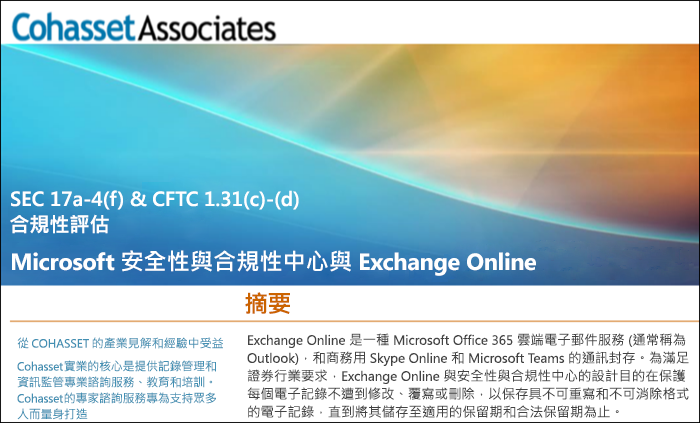

# 使用 Exchange Online 和安全性與合規性中心以符合 SEC Rule 17a-4

如果貴組織需要符合保留資料的法規標準，Office 365 安全性與合規性中心可提供多項功能，讓您管理 Exchange Online 中的資料的生命週期。其中包括保留、稽核、搜尋和匯出資料的功能。這些功能足以滿足大多數組織的需求。

不過，有些組織是受高度管制的產業，且須受更嚴格的法規要求拘束。例如，銀行或證券經紀公司等金融機構須受美國證券交易委員會 (SEC) 頒佈的 Rule 17a-4 拘束。Rule 17a-4 針對電子資料儲存有特定的要求，包括記錄管理的許多層面，例如持續時間、格式、品質、可用性，以及記錄保留的責任歸屬。

為協助組織更了解如何運用安全性與合規性中心來符合其 Exchange Online 法規義務 (具體而言是與 Rule 17a-4 要求有關)，我們已與 Cohasset Associates 合作發佈評估。

Cohasset 已驗證當 Exchange Online 和安全性與合規性中心依建議設定時，則會符合 CFTC Rule 1.31(c)-(d)、FINRA Rule 4511 和 SEC Rule 17a-4 的相關儲存要求。我們將目標鎖定在這組規則，因為它們代表全球最適用於金融機構記錄保留的規定指導方針。

## 下載 Cohasset 評估

您可以[在這裡下載 Cohasset 評估](https://servicetrust.microsoft.com/ViewPage/TrustDocuments?command=Download&downloadType=Document&downloadId=9fa8349d-a0c9-47d9-93ad-472aa0fa44ec&docTab=6d000410-c9e9-11e7-9a91-892aae8839ad_FAQ_and_White_Papers)。

## 這項評估是針對 Exchange Online

請注意，這項評估是針對 Exchange Online。這項評估不包含其他 Office 365 服務 (例如 SharePoint Online 或商務用 OneDrive)，儘管我們正在規劃未來在這些服務中提供 SEC 17a-4 的相關支援。

請務必了解商務用 Skype for Business 和 Teams 也會將資料儲存在 Exchange Online 中。因此，這項評估確實會包含來自商務用 Skype 的訊息，以及來自 Teams 的頻道和聊天訊息。

## 使用保留鎖定是建議設定的關鍵

受高度管制的產業通常必須儲存電子通訊內容，以符合 WORM (單寫多讀) 要求。在 WORM 要求指定的儲存解決方案中，記錄必須：

- 保留一段要求的保留期間，該期間無法縮短，只能增加。
- 固定，也就是說，在要求的保留期間內，記錄無法覆寫、清除或變更。

在 Exchange Online 中，將[保留原則](retention-policies.md)套用到使用者的信箱時，該使用者的所有內容都會根據原則的準則保留。事實上，如果使用者嘗試刪除或修改電子郵件，會將進行變更前的電子郵件複本保存在使用者信箱中的安全、隱藏的位置。保留原則可確保組織保留電子通訊內容，但可以修改這些原則。

組織可以透過在保留原則上設定保留鎖定的方式，確保無法修改原則。事實上，保留鎖定套用到保留原則之後，下列動作會受到限制：

- 原則的保留期間只能增加，無法縮短。
- 可將使用者新增到原則中，但無法移除任何使用者。
- 系統管理員無法刪除保留原則。

保留鎖定可協助您符合 SEC 17a-4 法規要求。

## 如何設定保留鎖定

您可以使用 PowerShell 鎖定保留原則。如需詳細資訊，請參閱[鎖定保留原則](retention-policies.md#locking-a-retention-policy)。

## 已知限制

我們已發現 Exchange Online 中有一些限制。我們正在積極解決這些限制，預計將於 2019 年 7 月推出下列案例的支援：

- 無法在 Office 365 群組信箱中使用項目層級稽核。
- 無法在 Teams 聊天和頻道訊息中使用通訊對話。
- 無法保留 Teams 聊天和頻道訊息中的讚。
