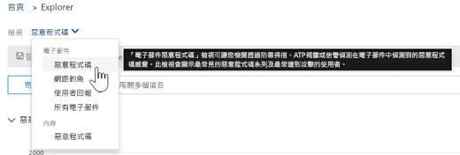
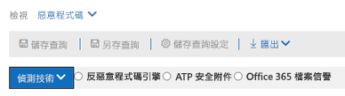
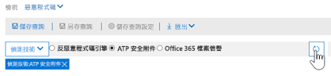
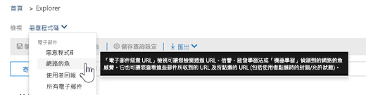
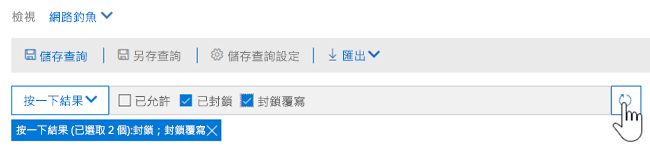
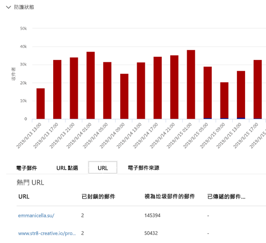
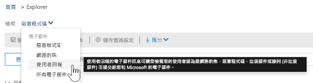
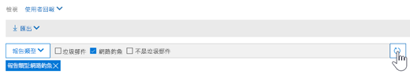

# 使用中的安全性威脅總管&amp;合規性中心Use Threat Explorer in the Security &amp; Compliance Center

如果您的組織有[Office 365 進階威脅防護計劃 2](office-365-ti.md) (ATP)，而且您具有必要權限，您可以使用威脅總管 （也稱為總管） 來識別和分析潛在威脅。If your organization has [Office 365 Advanced Threat Protection Plan 2](office-365-ti.md) (ATP), and you have the necessary permissions, you can use Threat Explorer (also referred to as Explorer) to identify and analyze threats. (使用檔案總管中，安全性&amp;合規性中心，移至**威脅管理** \> **總管**。)(To use Explorer, in the Security &amp; Compliance Center, go to **Threat management** \> **Explorer**.)

瀏覽器是功能強大，接近即時的工具，以協助調查及回應安全性威脅的安全性作業小組&amp;合規性中心。Explorer is a powerful, near real-time tool to help Security Operations teams investigate and respond to threats in the Security &amp; Compliance Center. 以下是一些您可以執行的事項：Here are some of the things you can do:
- [請參閱 Office 365 安全性功能所偵測到的惡意程式碼See malware that was detected by Office 365 security features](#see-malware-detected-in-email-by-technology)
- [檢視網路釣魚 Url 相關資料，並按一下 verdictView data about phishing URLs and click verdict](#view-data-about-phishing-urls-and-click-verdict)
- [從瀏覽器中檢視啟動自動的調查及回應程序Start an automated investigation and response process from a view in Explorer](#start-automated-investigation-and-response)
- ...[以及更多](#more-ways-to-use-explorer)！... [and more](#more-ways-to-use-explorer)!

## 請參閱技術電子郵件中偵測到的惡意程式碼See malware detected in email by technology

假設您想要查看電子郵件，並在 Office 365 技術偵測到的惡意程式碼。Suppose you want to see malware that was detected in email, and by what technology in Office 365. 若要這麼做，請使用檔案總管的[電子郵件 > 惡意程式碼](threat-explorer-views.md#email--malware)檢視。To do this, use the [Email > Malware](threat-explorer-views.md#email--malware) view of Explorer.

1. 在安全性 & 合規性中心 ([https://protection.office.com](https://protection.office.com))，選擇 [**威脅管理** > **總管**。In the Security & Compliance Center ([https://protection.office.com](https://protection.office.com)), choose **Threat management** > **Explorer**.
2. 在 [**檢視**] 功能表中，選擇 [**電子郵件** > **惡意程式碼**。In the **View** menu, choose **Email** > **Malware**. ![瀏覽器的 [檢視] 功能表](media/ExplorerViewEmailMalwareMenu.png) 
3. 按一下 [**寄件者**，，然後選擇 [**基本** > **偵測技術**。Click **Sender**, and then choose **Basic** > **Detection technology**. 偵測技術現在可做為報表的篩選。Your detection technologies are now available as filters for the report.   
4. 選取一個選項，，，然後按一下 [重新整理] 按鈕，以套用該篩選器。Select an option, and then click the Refresh button to apply that filter.   

若要顯示在電子郵件，使用您所選取的技術選項中偵測到的結果惡意程式碼會重新整理報表。The report refreshes to show the results malware detected in email, using the technology option you selected. 從這裡開始，您可以進行進一步分析。From here, you can conduct further analysis.

## 檢視網路釣魚 Url 相關資料，並按一下 verdictView data about phishing URLs and click verdict

假設您想要查看網路釣魚電子郵件，包括允許、 封鎖，並覆寫的 Url 清單中嘗試透過 Url。Suppose you want to see phishing attempts through URLs in email, including a list of URLs that were allowed, blocked, and overridden.  識別已按下的 Url 需要[ATP 安全連結](atp-safe-links.md)。Identifying URLs that were clicked requires [ATP Safe links](atp-safe-links.md). (請確定您已設定並套用至您的使用者，按一下 [時間的[ATP 安全連結原則](set-up-atp-safe-links-policies.md)保護和記錄按一下由 ATP 安全連結的結果。)若要檢閱郵件及釣魚程式訊息中的按 Url 中的釣魚程式 Url，請使用檔案總管的[電子郵件 > 釣魚程式](threat-explorer-views.md#email--phish)檢視。(Make sure you have set up and applied [ATP Safe Links policies](set-up-atp-safe-links-policies.md) to your users for click-time protection and logging of click verdicts by ATP Safe Links.) To review phish URLs in messages and clicks on URLs in phish messages, use the [Email > Phish](threat-explorer-views.md#email--phish) view of Explorer.

1. 在安全性 & 合規性中心 ([https://protection.office.com](https://protection.office.com))，選擇 [**威脅管理** > **總管**。In the Security & Compliance Center ([https://protection.office.com](https://protection.office.com)), choose **Threat management** > **Explorer**.
2. 在 [**檢視**] 功能表中，選擇 [**電子郵件** > **釣魚程式**。In the **View** menu, choose **Email** > **Phish**. ![瀏覽器的 [檢視] 功能表](media/ExplorerViewEmailPhishMenu.png) 
3. 按一下 [**寄件者**，，然後選擇 [ **Url** > **按一下 verdict**。Click **Sender**, and then choose **URLs** > **Click verdict**.
4. 選取一或多個選項，例如**封鎖**及**封鎖覆寫**]，然後按一下 [**重新整理**] 按鈕，以套用該篩選器。Select one or more options, such as **Blocked** and **Block overridden**, and then click the **Refresh** button to apply that filter.  

報表會重新整理以顯示兩個不同的 URL 資料表上的 [URL] 索引標籤下：The report refreshes to show two different URL tables on the URL tab below:
1. **Top Url**是 Url 包含在郵件中您有篩選向下，和電子郵件傳遞巨集指令會計算每個 URL。**Top URLs** are the URLs contained in the messages you have filtered down to, and the email delivery action counts for each URL. 在釣魚程式的電子郵件檢視中，這份清單通常會包含合法的 Url。In the phish email view, this list typically will contain legitimate URLs. 攻擊者嘗試以協助他們傳遞，其郵件中包括混合的良好且不正確的 Url，但會進行更有趣的使用者按一下惡意連結。Attackers include a mix of good and bad URLs in their messages to try to get them delivered, but they'll make the malicious links more interesting for the user to click. 總數的電子郵件計數排序表格的 Url (請注意： 此資料行不會顯示以簡化檢視)。The table of URLs is sorted by total email count (NOTE: This column is not shown to simplify the view).
2. **按一下頂端**是安全連結進行三重包裝 Url 所按下，排序總計按一下的計數 （此資料行也不會顯示以簡化檢視）。**Top clicks** are the Safe Links wrapped URLs that were clicked, sorted by total click count (this column is also not shown to simplify the view). 依欄的總計數指出安全連結按一下 verdict 計數的每個已按選的 URL。Total counts by column indicate the Safe Links click verdict count for each clicked URL. 在釣魚程式的電子郵件檢視中，這些會更常是可疑或惡意連結，但可能包含位於釣魚程式的郵件，即會發生的全新 Url。In the phish email view, these will more often be suspicious or malicious links, but could include clean URLs that happen to be in phish messages. 這裡不會顯示 URL 按包裝的連結。URL clicks on unwrapped links will not show up here.

兩個 Url 資料表網路釣魚電子郵件中顯示上方的 Url 所傳遞狀態，以及他們顯示 URL 點選已封鎖 （或瀏覽儘管警告） 連結，讓您可以了解哪些可能會損毀使用者收到且使用者互動。The two URLs tables show top URLs in phishing emails by delivery status, and they show URL clicks that were blocked (or visited despite a warning) so that you can understand what potential bad links were received by users and interacted with by users. 從這裡開始，您可以進行進一步分析。From here, you can conduct further analysis. 比方說，下方圖表，您可以看到已封鎖您組織的環境中的電子郵件中的頂端 Url。For example, below the chart, you can see the top URLs in emails that were blocked in your organization's environment. 

 

選取要檢視的詳細的資訊的 URL。Select a URL to view more detailed information. 請注意，在 URL 彈出式視窗] 對話方塊中，以顯示您環境中的 URL 的曝光度的完整檢視會移除在電子郵件篩選。Note that in the URL flyout dialog, the filtering on emails is removed in order to show you the full view of the URL's exposure in your environment. 這可讓您篩選下電子郵件中檔案總管和擔心，找出潛在威脅，然後展開 （透過 URL 的詳細資料] 對話方塊） 環境中的 URL 公開您了解，而不必新增 URL 篩選器以特定 Url總管檢視本身。This lets you filter down emails in Explorer to ones you are concerned about, find specific URLs that are potential threats, then expand your understanding of the URL exposure in your environment (via the URL details dialog) without having to add URL filters to the Explorer view itself.

## 檢閱報告的使用者的電子郵件訊息Review email messages reported by users

假設您想要查看您組織中的使用者會回報的電子郵件為垃圾郵件、 不是垃圾郵件或網路釣魚使用[報告訊息增益集以進行 Outlook 和 outlook 網頁版](enable-the-report-message-add-in.md)。Suppose you want to see email messages that users in your organization have reported as Junk, Not Junk, or Phishing by using the [Report Message add-in for Outlook and Outlook on the web](enable-the-report-message-add-in.md). 若要這麼做，請使用[電子郵件 > 使用者回報](threat-explorer-views.md#email--user-reported)檔案總管檢視。To do this, use the [Email > User-reported](threat-explorer-views.md#email--user-reported) view of Explorer.

1. 在安全性 & 合規性中心 ([https://protection.office.com](https://protection.office.com))，選擇 [**威脅管理** > **總管**。In the Security & Compliance Center ([https://protection.office.com](https://protection.office.com)), choose **Threat management** > **Explorer**.
2. 在 [**檢視**] 功能表中，選擇 [**電子郵件** > **使用者報告**。In the **View** menu, choose **Email** > **User-reported**. ![瀏覽器的 [檢視] 功能表](media/ExplorerViewMenuEmailUserReported.png) 
3. 按一下 [**寄件者**，，然後選擇 [**基本** > **報表類型**。Click **Sender**, and then choose **Basic** > **Report type**.
4. 選取一個選項，例如**釣魚程式**，，然後按一下 [**重新整理**] 按鈕。Select an option, such as **Phish**, and then click the **Refresh** button.    

報表會重新整理以顯示您組織中的人員已回報為網路釣魚嘗試的電子郵件的相關資料。The report refreshes to show data about email messages that people in your organization have reported as a phishing attempt. 您可以使用此資訊來進一步進行分析，並如有必要，調整您的[ATP 防網路釣魚原則](set-up-anti-phishing-policies.md)。You can use this information to conduct further analysis, and if necessary, adjust your [ATP anti-phishing policies](set-up-anti-phishing-policies.md).

## 啟動自動化的調查及回應Start automated investigation and response

（新 ！）[自動化調查及回應](automated-investigation-response-office.md)，最近新增至 ATP 計劃 2，可以儲存您的安全性作業小組很多時間和精力中調查，並減輕網路攻擊。(NEW!) [Automated investigation and response](automated-investigation-response-office.md), recently added to ATP Plan 2, can save your security operations team a lot of time and effort in investigating and mitigating cyber attacks. 除了設定可以觸發安全性 playbook 的提醒，您可以從瀏覽器中檢視啟動自動的調查及回應程序。In addition to configuring alerts that can trigger a security playbook, you can start an automated investigation and response process from a view in Explorer. 

如需這的詳細資訊，請參閱[範例： 安全性系統管理員會觸發從威脅總管調查](automated-investigation-response-office.md#example-a-security-administrator-triggers-an-investigation-from-threat-explorer)。For details on this, see [Example: A security administrator triggers an investigation from Threat Explorer](automated-investigation-response-office.md#example-a-security-administrator-triggers-an-investigation-from-threat-explorer).

## 若要使用檔案總管的更多方法More ways to use Explorer

除了本文中所述的案例，您有許多詳細報告選項隨附於瀏覽器。In addition to the scenarios outlined in this article, you have many more reporting options available with Explorer. 
- [尋找並調查傳送的惡意電子郵件Find and investigate malicious email that was delivered](investigate-malicious-email-that-was-delivered.md)
- [檢視 SharePoint Online、 OneDrive 及 Microsoft Teams 中偵測到的惡意檔案View malicious files detected in SharePoint Online, OneDrive, and Microsoft Teams](malicious-files-detected-in-spo-odb-or-teams.md)
- [在威脅總管] 中，取得檢視的概觀](threat-explorer-views.md)[Get an overview of the views in Threat Explorer](threat-explorer-views.md)

## 所需的授權和權限Required licenses and permissions

Explorer 隨附於[Office 365 進階威脅防護計劃 2](office-365-ti.md)。Explorer is included in [Office 365 Advanced Threat Protection Plan 2](office-365-ti.md). 

若要檢視並使用檔案總管，您必須具有適當的權限，例如授與安全性系統管理員或安全性讀取者。To view and use Explorer, you must have appropriate permissions, such as those granted to a security administrator or security reader. 

- Security&amp;合規性中心，您必須有一個指派的下列角色：For the Security &amp; Compliance Center, you must have one of the following roles assigned:
    - 組織管理Organization Management
    - 安全性系統管理員 (這可以在 Azure Active Directory 系統管理中心中指派 ([https://aad.portal.azure.com](https://aad.portal.azure.com)))Security Administrator (this can be assigned in the Azure Active Directory admin center ([https://aad.portal.azure.com](https://aad.portal.azure.com)))
    - 安全性讀取者Security Reader

- 若是 Exchange Online 中，您必須安裝下列其中一個在 Exchange 系統管理中心中指派下列角色 ([https://outlook.office365.com/ecp](https://outlook.office365.com/ecp)) 或使用 PowerShell cmdlet (請參閱[Exchange Online PowerShell](https://docs.microsoft.com/powershell/exchange/exchange-online/exchange-online-powershell?view=exchange-ps)):For Exchange Online, you must have one of the following roles assigned in either the Exchange admin center ([https://outlook.office365.com/ecp](https://outlook.office365.com/ecp)) or with PowerShell cmdlets (See [Exchange Online PowerShell](https://docs.microsoft.com/powershell/exchange/exchange-online/exchange-online-powershell?view=exchange-ps)):
    - 組織管理Organization Management
    - 僅檢視組織管理View-only Organization Management
    - 僅檢視收件者角色View-Only Recipients role
    - 合規性管理Compliance Management

若要深入了解角色和權限，請參閱下列資源：To learn more about roles and permissions, see the following resources:

- [Permissions in the Office 365 Security &amp; Compliance CenterPermissions in the Office 365 Security &amp; Compliance Center](permissions-in-the-security-and-compliance-center.md)

- [Exchange Online 中的功能權限Feature permissions in Exchange Online](https://docs.microsoft.com/exchange/permissions-exo/feature-permissions)
  
