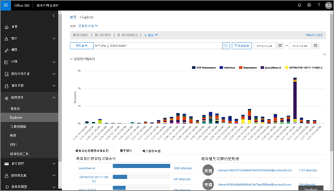

# 使用中的安全性威脅總管&amp;合規性中心Use Threat Explorer in the Security &amp; Compliance Center

如果您的組織有[Office 365 進階威脅防護計劃 2](office-365-ti.md)，而且您具有必要權限，您可以使用威脅總管來識別和分析潛在威脅。If your organization has [Office 365 Advanced Threat Protection Plan 2](office-365-ti.md), and you have the necessary permissions, you can use Threat Explorer to identify and analyze threats. 例如，您可以識別並刪除惡意電子郵件已傳遞，或請參閱 Office 365 安全性功能所攔截惡意程式碼。For example, you can identify and delete malicious email that was delivered, or see malware that was caught by Office 365 security features. 威脅總管 （也稱為 Explorer）] 是功能強大的接近即時的工具，以協助調查及回應安全性威脅的安全性作業小組&amp;合規性中心。Threat Explorer (also referred to as Explorer) is a powerful near real-time tool to help Security Operations teams investigate and respond to threats in the Security &amp; Compliance Center.
  

  
若要使用檔案總管中，安全性&amp;合規性中心，移至**威脅管理** \> **總管**。To use Explorer, in the Security &amp; Compliance Center, go to **Threat management** \> **Explorer**.

> [!IMPORTANT]
> Office 365 威脅情報現在是 Office 365 進階威脅防護計劃 2，以及其他威脅保護功能。Office 365 Threat Intelligence is now Office 365 Advanced Threat Protection Plan 2, along with additional threat protection capabilities. 若要深入了解，請參閱[Office 365 進階威脅防護方案和價格](https://products.office.com/exchange/advance-threat-protection)和[Office 365 進階威脅防護服務說明](https://docs.microsoft.com/office365/servicedescriptions/office-365-advanced-threat-protection-service-description)。To learn more, see [Office 365 Advanced Threat Protection plans and pricing](https://products.office.com/exchange/advance-threat-protection) and the [Office 365 Advanced Threat Protection Service Description](https://docs.microsoft.com/office365/servicedescriptions/office-365-advanced-threat-protection-service-description).
      
## Explorer 概觀Explorer overview

檔案總管] 會顯示組織資訊可疑的惡意軟體和電子郵件中的釣魚程式和 Office 365 中的檔案，以及其他安全性威脅及風險。Explorer displays information about suspected malware and phish in email and files in Office 365, as well as other security threats and risks to your organization. 當您首次開啟檔案總管時的預設檢視中顯示電子郵件惡意程式碼偵測在過去 7 天。When you first open Explorer, the default view shows email malware detections for the past 7 days. 瀏覽器也可以顯示安全性保護功能在 Office 365 中，包括[安全連結](atp-safe-links.md)和[安全附件](atp-safe-attachments.md)，您可以修改顯示過去 30 天的資料。Explorer can also show security protection features in Office 365, including [Safe Links](atp-safe-links.md) and [Safe Attachments](atp-safe-attachments.md) and can be modified to show data for the past 30 days. 如果您有 Office 365 進階威脅防護方案 2 或 Office 365 E5 試用訂閱，只會針對在過去 7 天看到偵測和電子郵件資料。If you have a trial subcription for Office 365 Advanced Threat Protection Plan 2 or Office 365 E5, you will only see detections and email data for the past 7 days.
  

  
使用 [檢視] 功能表變更顯示的資訊。Use the View menu to change what information is displayed.
  
![瀏覽器的 [檢視] 功能表](media/2bb34f58-555f-4967-ba55-740334ef1f8e.png)
  
Explorer 有數個篩選和查詢功能可讓您切入詳細資訊，例如頂端的目標使用者、 上方的惡意程式碼系列、 偵測技術等等。Explorer has several filtering and querying capabilities that enable you to drill into details, such as top targeted users, top malware families, detection technology and more. 每一種報表提供了許多方式可檢視和瀏覽資料。Each kind of report offers a variety of ways to view and explore data.

> [!IMPORTANT]
> 請勿使用萬用字元，例如星號 （\*） 或問號 （？） 與檔案總管。Do not use wildcard characters, such as an asterisk (\*) or a question mark (?), with Explorer. 當您搜尋電子郵件的主旨欄位時，Explorer 便會執行部分符合及收益結果類似萬用字元搜尋。When you search on the Subject field for email messages, Explorer will perform partial matching and yield results similar to a wildcard search.

## 電子郵件\>惡意程式碼Email \> Malware

這個檢視顯示電子郵件被識別為包含惡意程式碼。This view shows email messages identified as containing malware.  

檢視惡意程式碼系列、 寄件者網域、 寄件者 IP、 保護狀態 （所採取的動作威脅保護功能和 Office 365 中的原則），並偵測技術 （如何惡意程式碼偵測到） 圖表中的資訊。View information in the chart by malware family, sender domain, sender IP, protection status (actions taken by your threat protection features and policies in Office 365), and detection technology (how the malware was detected).  

         

下方圖表中，檢視上方的惡意程式碼系列的詳細資料的使用者，以及特定郵件的詳細，目標對象頂端。Below the chart, view details about top malware families, top targeted users, and more details about specific messages. 

## 電子郵件\>PhishEmail \> Phish

這個檢視顯示電子郵件識別為網路釣魚嘗試次數。This view shows email messages identified as phishing attempts.  

檢視由寄件者網域、 寄件者 IP 和保護狀態 （威脅保護功能和 Office 365 中的原則所採取的動作） 的資訊。View information by sender domain, sender IP, and protection status (actions taken by your threat protection features and policies in Office 365). 

 

下方圖表，檢視特定郵件的相關詳細資料。Below the chart, view more details about specific messages. 

## 電子郵件\>使用者報告Email \> User-reported

這個檢視顯示電子郵件使用者會回報為垃圾郵件、 非垃圾郵件或網路釣魚電子郵件。This view shows email that users have reported as junk, not junk, or phishing email.  

檢視資訊報告類型 （使用者的決定電子郵件是垃圾郵件、 非垃圾郵件或釣魚程式，） 以與傳遞原因 （原因電子郵件至特定位置，例如垃圾郵件篩選原則、 郵件流程規則、 封鎖的寄件者清單、 安全的寄件者] 清單中，發生的原因等）。View information by report type (the user's determination that the email was junk, not junk, or phish), and by delivery reason (reasons why email went to a specific location, such as a spam filter policy, a mail flow rule, a blocked-senders list, a safe-senders list, etc.).  

  

下方圖表，檢視關於特定電子郵件，如主旨、 寄件者的 IP 位址、 回報郵件為垃圾郵件、 非垃圾郵件，或釣魚程式，等等的使用者詳細資料。Below the chart, view more details about specific email messages, such as subject line, the sender's IP address, the user that reported the message as junk, not junk, or phish, and more. 

## 電子郵件\>所有郵件Email \> All mail

此檢視全面檢視顯示的電子郵件活動，包括電子郵件識別為惡意由於網路釣魚或惡意程式碼，以及所有非惡意的郵件 （一般的電子郵件、 垃圾郵件，以及大量郵件）。This views shows an all-up view of email activity, including email identified as malicious due to phishing or malware, as well all non-malicious mail (normal email, spam, and bulk mail). 

> [!NOTE]
> 如果您收到錯誤，可讀取**太多要顯示的資料**、 新增篩選器，如有必要，縮小您要檢視的日期範圍。If you get an error that reads **Too much data to display**, add a filter and, if necessary, narrow the date range you're viewing. 

若要套用篩選器，選擇 [**寄件者**、 在清單中，選取項目，然後按一下 [重新整理] 按鈕。To apply a filter, choose **Sender**, select an item in the list, and then click the Refresh button. 在我們的範例中，我們使用**偵測技術**作為篩選器 （有幾個選項可以使用）。In our example, we used **Detection technology** as a filter (there are several options available). 檢視依寄件者、 寄件者的網域、 收件者、 主旨、 附件檔名、 惡意程式碼系列、 保護狀態 （威脅保護功能和 Office 365 中的原則所採取的動作）、 （如何惡意程式碼偵測到），偵測技術的資訊和更多。View information by sender, sender's domain, recipients, subject, attachment filename, malware family, protection status (actions taken by your threat protection features and policies in Office 365), detection technology (how the malware was detected), and more. 

 

下方圖表，檢視更多詳細資料特定的電子郵件，例如主旨行、 收件者、 寄件者、 狀態、 等等。Below the chart, view more details about specific email messages, such as subject line, recipient, sender, status, and so on. 

## 內容\>惡意程式碼Content \> Malware

這個檢視顯示已由 Office 365 進階威脅防護中 SharePoint Online、 OneDrive for Business 和 Microsoft Teams 識別為惡意的檔案。This view shows files that were identified as malicious by Office 365 Advanced Threat Protection in SharePoint Online, OneDrive for Business, and Microsoft Teams.

檢視惡意程式碼 （如何惡意程式碼偵測到），家長監護，偵測技術的資訊和工作負載 （OneDrive、 SharePoint 或小組）。View information by malware family, detection technology (how the malware was detected), and workload (OneDrive, SharePoint, or Teams). 

  

下方圖表中，檢視需有關特定的檔案，例如附件檔名，工作負載，檔案大小，最後修改的檔案，以及更多詳細資訊。Below the chart, view more details about specific files, such as attachment filename, workload, file size, who last modified the file, and more. 
  
## （新 ！）按一下 [以篩選功能(New!) Click-to-filter capabilities

新瀏覽器是按一下 [以篩選的能力。New to Explorer is the ability to click to filter. 當您按一下圖例中的項目時，該項目會成為報表的篩選器。When you click an item in the legend, that item becomes a filter for the report. 例如，假設我們要尋找在檔案總管中的惡意程式碼檢視：For example, suppose we are looking at the Malware view in Explorer:
  

  
在此圖表中的結果就像這樣的檢視中，按一下 [ **ATP 爆炸**：Clicking **ATP Detonation** in this chart results in a view like this: 
  

  
在此檢視中，我們現在要尋找在[Office 365 ATP Safe Attachments](atp-safe-attachments.md)已引爆的檔案的資料。In this view, we are now looking at data for files that were detonated by [Office 365 ATP Safe Attachments](atp-safe-attachments.md). 下方圖表中，我們可以看到關於有已偵測到由 ATP 安全附件的附件的特定電子郵件的詳細資訊。Below the chart, we can see details about specific email messages that had attachments that were detected by ATP Safe Attachments.
  

  
選取一或多個項目會啟動 [**動作**] 功能表，它提供了數個選項可供選擇為選取的項目。Selecting one or more items activates the **Actions** menu, which offers several choices from which to choose for the selected item(s). 
  
![選取項目會啟動 [動作] 功能表](media/95f127a4-1b2a-4a76-88b9-096e3ba27d1b.png)
  
在按一下篩選及瀏覽至特定的詳細資訊的能力可讓您節省大量時間中調查潛在威脅。The ability to filter in a click and navigate to specific details can save you a lot of time in investigating threats.
  
## 如何取得總管？How do I get Explorer?

Explorer 隨附於[Office 365 進階威脅防護計劃 2](office-365-ti.md)。Explorer is included in [Office 365 Advanced Threat Protection Plan 2](office-365-ti.md). 

您必須具有適當的權限，例如授與安全性系統管理員或安全性讀取者，才能檢視及使用檔案總管。You must have appropriate permissions, such as those granted to a security administrator or security reader, in order to view and use Explorer. 若要深入了解，請參閱[中 Office 365 安全性權限&amp;合規性中心](permissions-in-the-security-and-compliance-center.md)。To learn more, see [Permissions in the Office 365 Security &amp; Compliance Center](permissions-in-the-security-and-compliance-center.md).
  
## 相關主題Related topics

[報告和 Office 365 安全性的深入解析&amp;合規性中心Reports and insights in the Office 365 Security &amp; Compliance Center](reports-and-insights-in-security-and-compliance.md)
  
[尋找並調查惡意電子郵件已傳遞 （Office 365 威脅 Invesitgation 和回應）Find and investigate malicious email that was delivered (Office 365 Threat Invesitgation and Response)](investigate-malicious-email-that-was-delivered.md)
  
[Office 365 中的反垃圾郵件和反惡意程式碼保護Anti-spam and anti-malware protection in Office 365](anti-spam-and-anti-malware-protection.md)
  

