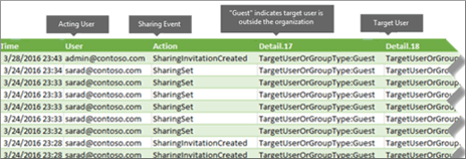

# 稽核共用來找出與外部使用者共用的資源

共用是主要活動 SharePoint Online 和 OneDrive for Business，並加以廣泛使用在 Office 365 組織中。管理員可以立即使用共用的 Office 365 稽核記錄中的稽核來判斷如何共用所要使用其組織中。 
  
## SharePoint 共用結構描述

主要的其中一個方法位於不同檔案和資料夾相關的事件 （不共用原則和共用連結事件） 的共用事件： 一位使用者正在進行一些影響另一位使用者的動作。例如，使用者 A 可以讓使用者 B 存取檔案。在這個範例中，使用者 A 是*代表使用者*和使用者 B 是*目標使用者*。在 SharePoint 檔結構描述中影響之使用者的巨集指令只會影響檔案本身。當使用者 A 開啟檔案， **FileAccessed**事件中所需的唯一資訊會影響之使用者。為了處理這個差異，有不同的結構描述，稱為*SharePoint 共用的結構描述*，來擷取共用事件的詳細資訊。這可確保系統管理員才有更深入之共用資源與使用者之資源的形式共用與。 
  
Sharing 架構提供兩個額外的欄位與共用事件相關的稽核記錄檔中： 
  
- **TargetUserOrGroupName** -儲存 UPN 或目標使用者或群組資源已共用與 (上述範例中的 「 使用者 B 」) 的名稱。 
    
- **TargetUserOrGroupType** -識別是否目標使用者或群組成員、 訪客、 群組或協力廠商。 
    
例如使用者驗證、 作業及日期可以分清*哪個*使用者共用*哪些*資源與*對象**時*的相關完整本文這兩個欄位，以及其他屬性從 Office 365 的稽核記錄檔結構描述。 
  
有另一個很重要的共用本文的結構描述屬性。**EventData**屬性儲存共用事件的額外資訊。例如，當使用者與其他使用者共用網站，這被藉由將目標使用者新增至 SharePoint 群組。**EventData**屬性擷取此系統管理員提供內容的其他資訊。 

## SharePoint 共用模型和共用事件

共用實際上定義三個不同的事件： **SharingSet**、 **SharingInvitationCreated**，以及**SharingInvitaitonAccepted**。以下方式共用事件的工作流程會記錄在 Office 365 稽核記錄檔。 
  

  
當使用者 （影響之使用者） 想要與另一位使用者 （目標使用者） 共用資源時，SharePoint （或 OneDrive for Business） 先檢查是否已與組織目錄中的使用者帳戶相關聯之目標使用者的電子郵件地址。如果目標使用者位於組織目錄中，SharePoint 會執行下列動作：
  
-  立即指派存取資源的目標使用者權限。 
    
- 目標使用者的電子郵件地址傳送共用通知。
    
- **SharingSet**事件記錄。 
    
 如果目標使用者的使用者帳戶不是組織的目錄中，SharePoint 會執行下列動作： 
  
- 會建立共用邀請，並將它傳送至目標使用者的電子郵件地址。
    
- **SharingInvitationCreated**事件記錄。 
    
    > [!NOTE]
    > **SharingInvitationCreated**事件相關聯最一律外部或來賓共用時的目標使用者沒有存取權的形式共用的資源。 
  
當目標使用者接受已經傳送給他們 （依序按一下 [邀請中的連結)，SharePoint 共用邀請**SharingInvitationAccepted**事件記錄並指派以存取資源的目標使用者權限。也登目標使用者的其他資訊，例如邀請傳送給使用者和實際接受邀請之使用者的身分識別。在某些情況下，這些使用者 （或電子郵件地址） 可能會不同。 
  

  
## 如何識別與外部使用者共用的資源

系統管理員的一般需求會建立已與組織外部的使用者共用的所有資源的清單。藉由使用共用 Office 365 中的稽核，系統管理員可以立即產生此清單。以下是如何。
  
### 步驟 1： 搜尋共用事件並將結果匯出至 CSV 檔案

第一個步驟是搜尋共用事件的 Office 365 稽核記錄。如需詳細資訊 （包括必要的權限） 的相關搜尋稽核記錄，請參閱[Office 365 安全性搜尋稽核記錄&amp;規範中心](search-the-audit-log-in-security-and-compliance.md)。
  
1. 移至 [https://protection.office.com](https://protection.office.com)。
    
2. 使用公司或學校帳戶登入 Office 365。
    
3. 在 [安全性] 的左窗格中&amp;規範中心按一下**搜尋&amp;調查**，然後按一下 [**稽核記錄搜尋**。
    
    會顯示 [**稽核記錄搜尋**] 頁面。 
    
4. [**活動**，按一下 [**共用活動**搜尋僅共用事件。 
    
    ![在 [活動] 下選取 [共用活動](media/46bb25b7-1eb2-4adf-903a-cc9ab58639f9.png)
  
5.  選取 [尋找共用所發生事件的期間內的日期和時間範圍。 
    
6. 按一下 [**搜尋**] 執行搜尋。 
    
7. 完成搜尋會顯示執行和結果、 按一下 [**匯出結果** \> **下載所有結果**。
    
    您選取 [匯出] 選項後，會提示您開啟或儲存 CSV 檔案的視窗底部顯示訊息。
    
8. 按一下 [**儲存** \> **另存為**CSV 檔案將本機電腦上的資料夾。 
    

  
### 步驟 2： 篩選與外部使用者共用的資源的 CSV 檔案

下一步是篩選 CSV **SharingSet**和**SharingInvitationCreated**事件，並顯示這些事件其中**TargetUserOrGroupType**屬性是**來賓**。您將在 Excel 中使用 Power 查詢功能為達成此目的。在 Excel 2016 中執行下列程序。 
  
1. 在 Excel 2016 開啟空白的活頁簿。
    
2. 按一下 [資料]**** 索引標籤。 
    
3. 按一下 [**新增查詢** \> **從檔案** \> **從 CSV**。
    
    ![在 [資料] 索引標籤上選取 [新增查詢、 選取從檔案，然後選取從 CSV](media/5170ab34-b449-40ea-bd3f-f1432c1c5973.png)
  
4. 在步驟 1 中開啟您下載的 CSV 檔案。
    
    在 [查詢編輯器] 中開啟 CSV 檔案。請注意有四欄：**時間**、**使用者**、**動作**和**詳細資料**。[**詳細資料**] 欄是多重屬性欄位。下一步是建立新欄的每個 [**詳細資料**] 欄中的屬性。 
    
5. 選取 [**詳細**資料行] 和 [**首頁**] 索引標籤上 [**分割資料行** \> **的分隔字元**。
    
    ![在 [常用] 索引標籤上 [分割] 欄中，和 [依分隔符號](media/aeb503e8-565b-42ea-91e2-9f127a74c00c.png)
  
6. 在 [**分割資料行來分隔字元**] 視窗中，執行下列動作： 
    
      - 在 [**選取或輸入分隔字元**，請選取**逗點**。
    
      - [**分割**] 下選取 [**在分隔符號的每個項目**。
    
7. 按一下 [確定]****。
    
    [**詳細資料**] 欄會分割成多個資料欄。每個新的資料行名稱為**Detail.1**、 **Detail.2**、 **Detail.3**、 等等。您會發現**Detail.n**資料行中的每一個儲存格中的值以屬性的名稱例如，**作業： SharingSet**、**作業： SharingInvitationAccepted**、 和**作業： SharingInvitationCreated**。
    
    ![[詳細資料] 欄中分割成多個資料欄，其中每個屬性](media/4b104ead-0313-4bd4-b2a9-f143ccb378ac.png)
  
8. 在 [**檔案**] 索引標籤上按一下 [**關閉&amp;負載**以關閉 [查詢編輯器並開啟 Excel 活頁簿中的檔案。 
    
    下一步是以篩選要只顯示**SharingSet**和**SharingInvitationCreated**事件的檔案。 
    
9. 移至 [**首頁**] 索引標籤，然後選取 [**動作**] 欄。 
    
10. 在**排序&amp;篩選**下拉式清單中，清除所有選項，然後選取 [ **SharingSet**和**SharingInvitationCreated**，並按一下 [**確定]**。
    
    Excel 會顯示**SharingSet**和**SharingInvitationCreated**事件的資料列。 
    
11. 移至名為**Detail.17** （或無論資料行包含**TargetUserOrGroupType**屬性） 的資料行並加以選取。 
    
12. 在**排序&amp;篩選**下拉式清單中，清除所有選項，然後選取 [ **TargetUserOrGroupType:Guest**，並按一下 [**確定]**。
    
    現在 Excel 因為外部使用者識別值**TargetUserOrGroupType:Guest**會顯示**SharingInvitationCreated**和**SharingSet**事件與您的組織外部的目標使用者所在的列。 
    
下表顯示指定的日期範圍內的來賓使用者與共用資源組織中所有使用者。
  

  
雖然它不包含在上一個表格中， **Detail.10**資料行 （或無論資料行包含**ObjectId**屬性） 會識別與目標使用者 ； 的形式共用的資源例如`ObjectId:https:\/\/contoso-my.sharepoint.com\/personal\/sarad_contoso_com\/Documents\/Southwater Proposal.docx`。
  
> [!TIP]
> 如果您想要找出時來賓使用者已實際上指派資源的存取權 (而非只是資源的位置與這些共用)、 重複步驟 10、 11 和 12、 及篩選**SharingInvitationAccepted**及**SharingSet**事件的步驟 10。 
