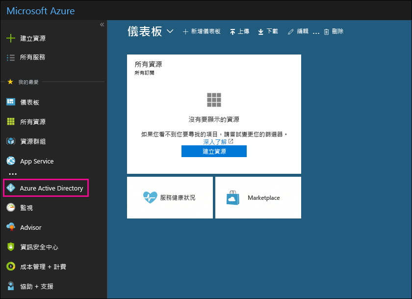

# 使用 Office 365 中免費的 Azure Active Directory 訂閱

如果貴組織有 Office 365、Microsoft Dynamics CRM Online、Enterprise Mobility Suite 或其他 Microsoft 服務的付費訂閱，則您有 Microsoft Azure Active Directory 的免費訂閱。您和其他系統管理員可以使用 Azure AD，來建立並管理使用者和群組帳戶。若要使用 Azure AD，只需移至 Azure 入口網站，並使用您的 Office 365 帳戶登入。
  
## 開始之前

使用私人瀏覽工作階段 (不是一般工作階段) 來存取 Azure 入口網站 (下面步驟 1)，因為這會防止您目前登入所用的認證傳遞至 Azure。若要在 Internet Explorer 開啟 InPrivate 瀏覽工作階段，或在 Mozilla FireFox 開啟私人瀏覽工作階段，只需按 CTRL+SHIFT+P。若要在 Google Chrome (稱為無痕視窗) 中開啟私人瀏覽工作階段，請按 CTRL+SHIFT+N。
  
## 存取 Azure Active Directory

1. 移至 [portal.azure.com](https://portal.azure.com)，並使用您的 Office 365 工作或學生帳戶登入。 
    
2. 在 Azure 入口網站的左導覽窗格中，按一下 [Azure Active Directory]****。
    
    
  
    即會顯示 [Azure Active Directory]**** 系統管理中心。 
    
## 詳細資訊

- 您也可以從 Office 365 系統管理中心存取 **Azure Active Directory** 系統管理中心。在 Office 365 系統管理中心的左導覽窗格中，按一下 [系統管理中心]**** \> [Azure Active Directory]****。
    
- 如需管理使用者和群組以及執行其他目錄管理工作的詳細資訊，請參閱[管理 Azure AD 目錄](https://docs.microsoft.com/azure/active-directory/active-directory-administer)。
