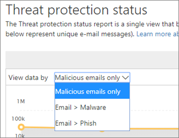
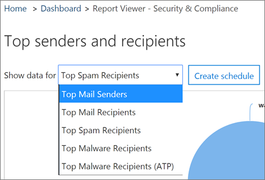
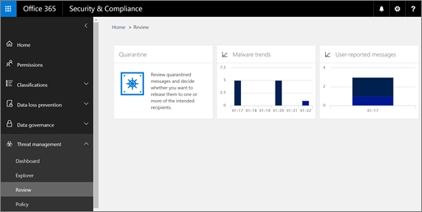

# 在 [安全性] 中檢視電子郵件安全性報表&amp;規範中心

提供各種電子郵件安全性報告所[安全性&amp;規範中心](https://security.microsoft.com)可協助您查看如何在 Office 365 中的反垃圾郵件和反惡意程式碼功能會保護您的組織。如果您有[必要的權限](#what-permissions-are-needed-to-view-these-reports)，您可以檢視這些報告安全性&amp;移至**報表**的規範中心\>**儀表板**。
  

  
您的電子郵件安全性報告包含下列各項：
  
- [威脅保護狀態報表](view-email-security-reports.md#tps) 
    
- [惡意程式碼偵測] 報告](view-email-security-reports.md#maldet)
    
- [最常用的惡意程式碼報告](#top-malware-report)
    
- [上方的寄件者和收件者的報表](view-email-security-reports.md#topsenders)
    
- [詐騙郵件報告](#spoof-mail-report)
    
- [垃圾郵件偵測] 報告](#spam-detections-report)
    
- [傳送和接收的電子郵件報告](view-email-security-reports.md#sentreceivedemail)
    
- [使用者報告的郵件報告](view-email-security-reports.md#userreported)（新增 ！） 
    
## 威脅保護狀態報表

新的**威脅保護狀態**報表是智慧顯示已偵測到並封鎖的 Exchange Online Protection 的惡意電子郵件。這份報告顯示電子郵件會被識別為惡意程式碼或網路釣魚嘗試的相關資訊。 

> [!NOTE]
> 威脅保護狀態報表是供使用者具有[Office 365 ATP](office-365-atp.md)或[Exchange Online Protection](eop/exchange-online-protection-eop.md) (EOP);不過，ATP 客戶的威脅保護狀態報表中所顯示的資訊可能會包含超過 EOP 客戶可以看到不同的資料。例如，EOP 客戶可以檢視電子郵件、 但不是[在 SharePoint Online、 OneDrive 或 Microsoft 小組中偵測到惡意檔案](atp-for-spo-odb-and-teams.md)的相關資訊、 ATP 特定功能中偵測到惡意程式碼的相關資訊。（[解更多關於 ATP 報告](view-reports-for-atp.md)）。
  
若要檢視中的這份報告，[安全性&amp;規範中心](https://protection.office.com)、 移至 [**報表** \> **儀表板** \> **威脅保護狀態**。
  

  
當您首次開啟威脅保護狀態報告時，報告會顯示資料過去 7 天預設;不過，您可以按一下 [**篩選**及多達 90 天的詳細資料變更的日期範圍。這份報告 」 很適合用來檢視的效益與您組織的 Exchange Online Protection 功能的影響長期趨勢。 
  

  
您也可以選擇是否要檢視的電子郵件會被識別為惡意的資料，識別為網路釣魚嘗試、 電子郵件或電子郵件被識別為包含惡意程式碼。
  

  
## 惡意程式碼偵測] 報告

**惡意程式碼偵測**] 報告顯示為包含您的組織的惡意程式碼偵測多少的內送和外寄郵件。 
  
若要檢視中的這份報告，[安全性&amp;規範中心](https://protection.office.com)、 移至 [**報表** \> **儀表板** \> **惡意程式碼偵測**。
  
![惡意程式碼偵測] 報告範例](media/a1ba61a3-565a-46d6-b0d5-6a6cff6b31d7.png)
  
類似像威脅保護狀態報表的其他報表會顯示資料過去 7 天的預設。不過，您可以選擇要變更的日期範圍**篩選器**。 
  
## 最常用的惡意程式碼報告

**前惡意程式碼**」 報告顯示各種類型的 Exchange Online 會利用偵測到惡意程式碼。 
  
若要檢視中的這份報告，[安全性&amp;規範中心](https://protection.office.com)、 移至 [**報表** \> **儀表板** \> **前惡意程式碼**。
  

  
當您將滑鼠停留在圓形圖扇形擴展時，您可以看到種類的惡意程式碼和多少訊息所偵測到為具有該惡意程式碼的名稱。
  
按一下 （或點選） 以新的瀏覽器視窗，可取得更詳細的報表檢視中開啟報表。
  

  
圖表下方您會看到偵測到惡意程式碼和多少訊息所偵測到為具有該惡意程式碼的清單。
  
## 上方的寄件者和收件者的報表

**Top 寄件者和收件者**報表是顯示在上方的電子郵件寄件者的圓形圖。 
  
若要檢視中的這份報告，[安全性&amp;規範中心](https://protection.office.com)、 移至 [**報表** \> **儀表板** \> **頂端的寄件者和收件者**。
  

  
當您將滑鼠停留在圓形圖扇形擴展時，您可以看到傳送或接收的郵件計數。
  
按一下 （或點選） 以新的瀏覽器視窗，可取得更詳細的報表檢視中開啟報表。
  
用於**顯示資料的**清單中選擇是否要檢視的主要寄件者、 接收器、 垃圾郵件收件者] 及惡意程式碼收件者的資料。您也可以參閱者接收到的進階威脅保護偵測到惡意程式碼。 
  

  
圖表下方您會看見誰上方的電子郵件的寄件者或收件者已，以及郵件傳送或接收特定的時段進行計數。
  
## 詐騙郵件報告

**詐騙郵件**報告顯示偵測多少詐騙郵件訊息，並的那些、 哪些已被視為 「 良好 」 （完成所需的合法的商業原因詐騙郵件）。 
  
若要檢視中的這份報告，[安全性&amp;規範中心](https://protection.office.com)、 移至 [**報表** \> **儀表板** \> **詐騙郵件**。
  

  
當您將滑鼠停留在一天圖表中，您可以看到哪個多少詐騙郵件訊息。
  
按一下 （或點選） 以新的瀏覽器視窗，可取得更詳細的報表檢視中開啟報表。
  
## 垃圾郵件偵測] 報告

[**垃圾郵件偵測**] 報告顯示封鎖的 Exchange Online 中的垃圾郵件內容。 
  
若要檢視中的這份報告，[安全性&amp;規範中心](https://protection.office.com)、 移至 [**報表** \> **儀表板** \> **垃圾郵件偵測**。
  

  
當您將滑鼠停留在一天圖表中，您可以看到多少個項目已封鎖那天，以及如何分類的項目。例如，您可以看到多少垃圾郵件已篩選，而且多少個項目來自封鎖的網際網路通訊協定 (IP) 位址。
  
按一下 （或點選） 以新的瀏覽器視窗，可取得更詳細的報表檢視中開啟報表。
  
![[垃圾郵件偵測] 報告會告訴您如何許多垃圾郵件被封鎖或篩選掉](media/370ec67d-eb30-4863-bfcf-68a41be02295.png)
  
圖表下方您會看到所偵測到的垃圾郵件項目清單。選取要檢視其他資訊，例如垃圾郵件項目已輸入或輸出、 其訊息識別碼，以及其收件者的項目。
  
## 傳送和接收的電子郵件報告

**已傳送及接收之電子郵件**報表是智慧來顯示資訊關於內送和外寄電子郵件，包括垃圾郵件偵測和惡意程式碼、 電子郵件會被識別為 [好]。 
  
若要檢視中的這份報告，[安全性&amp;規範中心](https://protection.office.com)、 移至 [**報表** \> **儀表板** \> **傳送與接收之電子郵件**。
  

  
當您將滑鼠停留在一天圖表中，您會看見多少訊息哪個，及其那些郵件分類的方式。例如，您會看見多少訊息所偵測到為包含惡意程式碼、 及其多少已識別為垃圾郵件。
  
按一下 （或點選） 以新的瀏覽器視窗，可取得更詳細的報表檢視中開啟報表。
  
您可以使用**會自動換行向下的**清單檢視類型或方向 （內送和外寄） 的資訊。 
  

  
圖表下方您會看到的電子郵件類別，例如**GoodMail**、 **SpamContentFiltered**、 等等的清單。選取要檢視其他資訊，例如的惡意程式碼、 所採取的動作和是否電子郵件類別是傳入或傳出。
  

  
## 使用者報告的郵件報告 （新增 ！）

**使用者報告的郵件**報告顯示使用者具有回報為垃圾郵件、 網路釣魚嘗試或良好郵件使用[報告郵件增益集](enable-the-report-message-add-in.md)的電子郵件訊息的相關資訊。
  
詳細資料可供每則訊息，包括傳遞原因、 這類垃圾郵件原則例外狀況或設定您的組織的郵件流程規則。若要檢視的詳細資訊，請在使用者報告] 清單中選取項目，然後**摘要**及**詳細資料**] 索引標籤上檢視的資訊。 
  

  
若要檢視中的這份報告，[安全性&amp;規範中心](https://protection.office.com)，執行下列其中一個動作：
  
- 移至 [ **Threat management** \> **儀表板** \> **使用者報告的郵件**。
    
- 移至 [ **Threat management** \> **檢閱** \> **使用者報告的郵件**。
    

  
> [!IMPORTANT]
> 在順序使用者報告的郵件報告正確運作，**必須開啟稽核記錄功能**會針對 Office 365 環境。這通常是由某人具有 「 稽核記錄 」 角色指派 Exchange Online。如需詳細資訊，請參閱[開啟 Office 365 稽核記錄搜尋開啟或關閉](turn-audit-log-search-on-or-off.md)。 
  
## 若要檢視這些報告需要哪些權限？

若要檢視和使用本文所述的報告**您必須具有適當的角色指派給這兩種安全性&amp;規範中心及 Exchange 系統管理中心**。

- Security&amp;規範中心，您必須具備一個指派的下列角色：
    - 組織管理
    - 安全性管理員 (這可被指派在 Azure Active Directory 系統管理中心 ([https://aad.portal.azure.com](https://aad.portal.azure.com))
    - 安全性讀者

- Exchange online，您必須具備一個指派 Exchange 系統管理中心中的下列角色 ([https://outlook.office365.com/ecp](https://outlook.office365.com/ecp)) 或使用 PowerShell cmdlet (請參閱[Exchange Online PowerShell](https://docs.microsoft.com/powershell/exchange/exchange-online/exchange-online-powershell?view=exchange-ps))：
    - 組織管理
    - 僅檢視組織管理
    - 僅檢視收件者角色
    - 合規性管理

若要深入了解，請參閱下列資源：

- [Office 365 安全性權限&amp;規範中心](permissions-in-the-security-and-compliance-center.md)

- [Exchange Online 中的功能權限](https://docs.microsoft.com/exchange/permissions-exo/feature-permissions)
   
   
## 如果報表不顯示資料吗？

如果您看不見的資料在報告中，再次檢查您的原則已正確設定。若要深入了解，請參閱[Office 365 中的反垃圾郵件和反惡意程式碼保護](anti-spam-and-anti-malware-protection.md)。
  
## 相關主題

[Office 365 電子郵件的反垃圾郵件保護](anti-spam-protection.md)
  
[報告與 Office 365 安全性前瞻&amp;規範中心](reports-and-insights-in-security-and-compliance.md)
  
[在 [安全性] 中建立報表的排程&amp;規範中心](create-a-schedule-for-a-report.md)
  
[設定並下載安全性的自訂報告&amp;規範中心](set-up-and-download-a-custom-report.md)
  

