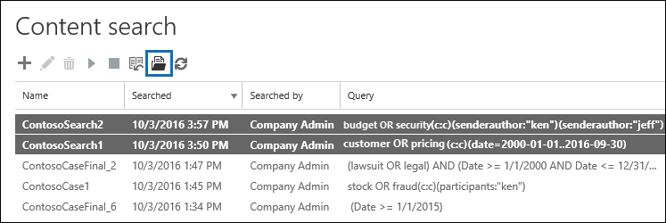

# 檢視內容搜尋結果的關鍵字統計資料

建立並執行內容的搜尋後，您可以檢視有關預估的搜尋結果的統計資料。這包括摘要 （類似於詳細資料窗格中顯示預估的搜尋結果的摘要） 的搜尋結果，例如內容的位置與符合搜尋查詢的項目數目及內容的位置名稱的查詢統計資料具有最符合的項目。您可以顯示一或多個內容搜尋統計的資料。這可讓您快速比較的多個搜尋結果，並進行搜尋查詢的效益的相關決策。
  
此外，您可以設定新的和現有搜尋以傳回在搜尋查詢中的每個關鍵字的統計資料。這可讓您比較每個關鍵字查詢中並比較從多個搜尋的關鍵字統計資料的結果數目。
  
您也可以下載到 CSV 檔案的搜尋統計資料和關鍵字統計資料。這可讓您在 Excel 中使用的篩選和排序的功能比較結果，並準備您的搜尋結果中的報告。
  
## 取得統計資料的內容搜尋

若要顯示的統計資料內容的搜尋：
  
1. Office 365 安全性&amp;規範管理中心，移至**搜尋&amp;調查** \> **內容搜尋**。
    
2. 在 [搜尋] 清單中選取一或多個搜尋，，然後按一下 [**搜尋統計資料**![搜尋統計資料] 按鈕](media/9bf56d43-25bf-4f53-a4be-f4d55102310c.png)。
    
    
  
3. **搜尋統計資料**] 索引標籤上按一下下列連結之一以顯示所選的搜尋相關的統計資料。 
    
    **摘要**
    
    此頁面會顯示類似於在**內容搜尋**] 頁面上的 [詳細資料] 窗格中顯示的統計資料。會顯示所選的所有搜尋的統計資料。請注意您也可以重新執行選取的搜尋從此頁面來更新統計資料。 
    
    
  
    a.名稱之內容的搜尋。先前所述，您可以顯示及比較的多個搜尋統計資料。
    
    b.類型所搜尋的內容位置。每個資料列會顯示信箱、 網站及來自指定搜尋的公用資料夾統計的資料。
    
    c.數目包含符合搜尋查詢的項目內容的位置。信箱，此統計資料也包括封存信箱包含符合搜尋查詢的項目數目。
    
    d.總數的所有項目指定符合搜尋查詢的內容位置。項目類型的範例包括電子郵件、 行事曆項目和文件。如果項目包含多個執行個體的搜尋關鍵字，它會只計算一次中的項目總數。例如，如果您搜尋的單字"stock"或"詐騙"和電子郵件訊息包含三個執行個體的"stock"這個字，其是只計算一次 [**項目**] 欄中。 
    
    e.總大小的所有項目在指定的內容位置中找到符合搜尋查詢。 
    
    **查詢**
    
    此頁面上顯示搜尋查詢的相關的統計資料。
    
    
  
    a.名稱之內容的搜尋列包含查詢統計資料。
    
    b.類型是適用於查詢統計資料的內容位置。
    
    c.此欄會指出哪一部分的統計資料會適用於搜尋查詢。**主要**表示整個搜尋查詢。如果您建立或編輯搜尋查詢時使用關鍵字] 清單中，為查詢的每個元件的統計資料會包含在此表格中。請參閱[取得內容的搜尋關鍵字統計資料](#get-keyword-statistics-for-content-searches)] 區段中的詳細資訊的本文。 
    
    d.此資料行包含實際的搜尋查詢的內容搜尋工具來執行。請注意工具自動將一些其他元件新增至您建立的查詢。 

    - 搜尋所有的內容中的信箱 （藉由未指定任何關鍵字），實際的關鍵字查詢時為`size>=0`如此會傳回所有的項目。 
    
     - 當您搜尋 SharePoint Online 和 OneDrive 商務網站時，會新增兩個下列元件：
    
          **不 IsExternalContent:1** -從內部部署 SharePoint 組織排除任何內容。 
    
          因為這些是任何符合搜尋查詢的文件的重複項目**不 IsOneNotePage:1** -會排除所有 OneNote 檔案。 

    
    e.的內容位置數 (所指定 * * 位置類型 * * 欄) 且包含符合搜尋查詢所列在 [**查詢**] 欄中的項目。 
    
    f.數目 （從指定的內容位置） 符合搜尋查詢所列在 [**查詢**] 欄中的項目。如先前所述，如果項目包含多個執行個體的搜尋關鍵字其只計算一次在此欄。 
    
    g.總大小 （以指定的內容位置） 所找到的所有項目會比對 [**查詢**] 欄中的搜尋查詢。 
    
    **上方的位置**
    
    此頁面會顯示關於符合搜尋查詢中每個所搜尋的內容位置的項目數目的統計資料。會顯示前 1000 個位置。如果您檢視多個搜尋的統計資料，會顯示每個搜尋的最佳 1000 位置。請注意內容位置無法在此頁面上如果它不包含任何符合搜尋查詢的項目。
    
    
  
    a.名稱之內容的位置。
    
    b.類型的位置統計資料所適用的內容位置。
    
    c.有顯示的統計資料則每次搜尋的欄。此欄位會顯示符合搜尋查詢中每個內容位置的項目數目 （與總大小）。請注意當您要顯示的多個搜尋統計資料，此資料行中的"NA"表示的內容位置未包含在搜尋。 

## 取得內容的搜尋關鍵字統計資料

為舊清楚、 [**查詢**] 頁面上顯示搜尋查詢和數字 （與大小） 符合查詢的項目。如果您建立或編輯搜尋查詢時使用關鍵字] 清單中，您可以取得增強顯示多少個項目比對每個關鍵字或關鍵字文句的統計資料。這可協助您快速識別出哪些組件的查詢是最 （且至少） 有效。例如，如果關鍵字傳回大量的項目，您可能會選擇調整來縮小搜尋結果的關鍵字查詢。您可以設定關鍵字清單時建立或編輯內容的搜尋。 

  
若要建立關鍵字清單並檢視內容的搜尋關鍵字統計資料：
  
1. Office 365 安全性&amp;規範管理中心，移至**搜尋&amp;調查** \> **內容搜尋**。
    
2. 清單中的內容搜尋、 按一下 [及搜尋，然後按一下 [**編輯**。
    
3. 按一下 [**查詢**]，然後執行下列作業： 
    
    ![按一下 [顯示關鍵字清單] 核取方塊並在每一列中輸入關鍵字](media/73ef46dd-3d5c-415d-b5e7-c3559caaafe2.png)
  
    a.按一下 [**顯示關鍵字清單**] 核取方塊。 
    
    b.輸入關鍵字或關鍵字階段表格列中的關鍵字。例如，在第一列中輸入**預算**，然後輸入的第二列的 [**安全性**。 
    
4. 新增您想要搜尋並取得統計資料的關鍵字之後, 按一下 [**搜尋**來執行修訂的 [搜尋]。 
    
5. 搜尋完成時，選取清單中的搜尋，並再按一下 [**搜尋統計資料**![搜尋統計資料] 按鈕](media/9bf56d43-25bf-4f53-a4be-f4d55102310c.png)。您也可以顯示及比較多個搜尋的關鍵字統計資料。
    
6. 在 [**搜尋統計資料**] 頁面上按一下 [**查詢**以顯示所選的搜尋的關鍵字統計資料。 
    
    
  
    如先前的螢幕擷取畫面所示，會顯示每個關鍵字的統計資料 ；這包括： 
    
    - 每個位置類型的內容包含在搜尋關鍵字統計資料。
    
    - 每個關鍵字，其中包含搜尋查詢從任何條件實際的搜尋查詢。 
    
    - （識別為**主要****組件**] 欄中） 的完整的搜尋查詢和完整的查詢的統計資料。請注意以下是顯示在 [**摘要**] 頁面上的相同統計資料。 

> [!NOTE]
> 若要協助減少大型關鍵字清單所導致的問題，現在是限制最大值為 20 列在 [關鍵字] 清單中的搜尋查詢。
