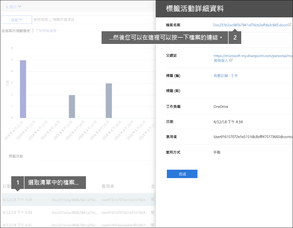
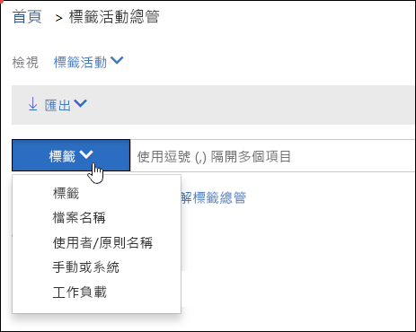

# 檢視文件的標籤活動View label activity for documents

在建立您的標籤之後，您想要驗證它們是否如您想要的方式套用至內容。使用 Office 365 安全性與合規性中心的標籤活動總管，您可以跨 SharePoint 和商務用 OneDrive 快速搜尋和檢視過去 30 天所有內容的標籤活動。這是即時資料，可讓您清楚檢視租用戶發生什麼情況。After you create your labels, you'll want to verify that they're being applied to content as you intended. With the Label Activity Explorer in the Office 365 Security &amp; Compliance Center, you can quickly search and view label activity for all content across SharePoint and OneDrive for Business over the past 30 days. This is real-time data that gives you a clear view into what's happening in your tenant.
  
例如，使用標籤活動總管，您可以：For example, with the Label Activity Explorer, you can:
  
- 檢視每天 (最多 30 天) 套用每個標籤的次數。View how many times each label was applied on each day (up to 30 days).
    
- 查看誰已確切標示哪個日期上的哪個檔案，以及該檔案所在之網站的連結。See who labeled exactly which file on which date, along with a link to the site where that file resides.
    
- 檢視哪些檔案具有已變更或已移除標籤、舊標籤和新標籤是什麼，以及誰做了變更。View which files had labels changed or removed, what the old and new labels are, and who made the change.
    
- 篩選資料以查看特定標籤、檔案或使用者的所有標籤活動。您也可以依位置 (SharePoint 或商務用 OneDrive)，以及標籤是手動套用還是自動套用，來篩選標籤活動。Filter the data to see all the label activity for a specific label, file, or user. You can also filter label activity by location (SharePoint or OneDrive for Business) and whether the label was applied manually or auto-applied.
    
- 檢視資料夾以及個別文件的標籤活動。即將推出的能力是顯示由於標示資料夾，該資料夾內有多少檔案可以取得此標籤。View label activity for folders as well as individual documents. Coming soon is the ability to show how many files inside that folder got labeled as a result of the folder getting labeled.
    
您可以在 [安全性與合規性中心] > [資料控管]\*\*\*\* > [標籤活動總管]\*\*\*\* 中找到標籤活動總管。You can find the Label Activity Explorer in the Security &amp; Compliance Center > **Data governance** > **Label Activity Explorer**.
  
請注意，標籤活動總管需要 Office 365 企業版 E5 訂閱。Note that the Label Activity Explorer requires an Office 365 Enterprise E5 subscription.
  

  
## 檢視檔案或資料夾的標籤活動View label activities for files or folders

在標籤活動總管的頂端，您可以選擇是否要檢視檔案或資料夾的活動。請注意，資料夾活動只包含資料夾本身，不包含資料夾內的檔案。At the top of the Label Activity Explorer, you can choose whether to view activities for files or folders. Note that folder activity includes only the folder itself, not the files inside the folder.
  
您可能想要看到資料夾的標籤活動，因為若您標示資料夾，該資料夾內的所有檔案也會得到該標籤 (但已有標籤明確地套用至其中的檔案除外)。因此，標示資料夾可能會影響大量的檔案。如需詳細資訊，請參閱[將預設保留標籤套用至 SharePoint 文件庫、資料夾或文件集中的所有內容](labels.md#applying-a-default-retention-label-to-all-content-in-a-sharepoint-library-folder-or-document-set)。You might want to see label activity for folders because if you label a folder, all files inside that folder also get that label (except for files that have had a label applied explicitly to them). Therefore, labeling folders might affect a significant number of files. For more information, see [Applying a default retention label to all content in a SharePoint library, folder, or document set](labels.md#applying-a-default-retention-label-to-all-content-in-a-sharepoint-library-folder-or-document-set).
  

  
### 標籤活動Label activities

 **標籤活動**包含所有標籤動作：**新增**、**移除**或**變更**標籤。您可以使用此檢視，全面查看每個標籤每天已套用至多少個檔案。**Label activities** includes all label actions: **adding**, **removing**, or **changing** a label. You can use this view to get a comprehensive look at how many files each label's been applied to per day. 
  
### 標籤變更Label changes

 **標籤變更**包含**移除**或**變更**標籤的潛在風險動作。您可以使用此檢視，快速查看這類風險動作和執行它們的使用者。在圖表下方的活動清單中，您可以選取檔案，然後在右邊的詳細資料窗格中按一下該檔案的連結。**Label changes** includes the potentially risky actions of **removing** or **changing** a label. You can use this view to quickly see such risky actions and the user who performed them. In the activity list below the chart, you can select a file, and then click a link to that file in the details pane on the right. 
  

  
## 篩選標籤活動Filter label activity

您可以快速篩選資料以查看特定標籤、檔案或使用者的所有標籤活動。您也可以依位置 (SharePoint 或商務用 OneDrive)，以及標籤是手動套用還是自動套用，來篩選標籤活動。You can quickly filter the data to see all the label activity for a specific label, file, or user. You can also filter label activity by location (SharePoint or OneDrive for Business) and whether the label was applied manually or auto-applied.
  

  

