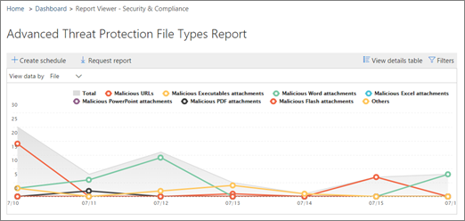

# 檢視 Office 365 進階威脅防護報告View reports for Office 365 Advanced Threat Protection

如果您的組織有[Office 365 進階威脅防護](office-365-atp.md)(ATP)，而且您具有[必要權限](#what-permissions-are-needed-to-view-the-atp-reports)，您可以使用數個 ATP 報告中的安全性&amp;合規性中心。If your organization has [Office 365 Advanced Threat Protection](office-365-atp.md) (ATP) and you have the [necessary permissions](#what-permissions-are-needed-to-view-the-atp-reports), you can use several ATP reports in the Security &amp; Compliance Center. (前往**報告** \> **儀表板**。)(Go to **Reports** \> **Dashboard**.)
  

  
ATP 報告包含[威脅保護狀態報表](#threat-protection-status-report)、 [ATP 檔案類型的報告](#atp-file-types-report)和[ATP 郵件處理報表](#atp-message-disposition-report)。ATP reports include the [Threat Protection Status report](#threat-protection-status-report), the [ATP File Types report](#atp-file-types-report), and the [ATP Message Disposition report](#atp-message-disposition-report). 本文說明 ATP 報告，並包含[若要檢視其他報告](#additional-reports-to-view)的連結。This article describes the ATP reports and includes links to [additional reports to view](#additional-reports-to-view).
  
## 威脅保護狀態報表Threat Protection Status report

**威脅保護狀態**報表是整合在一起惡意內容和惡意電子郵件偵測並封鎖由[Exchange Online Protection](eop/exchange-online-protection-overview.md) (EOP) 和[Office 365 ATP](office-365-atp.md)的相關資訊的單一檢視。The **Threat Protection Status** report is a single view that brings together information about malicious content and malicious email detected and blocked by [Exchange Online Protection](eop/exchange-online-protection-overview.md) (EOP) and [Office 365 ATP](office-365-atp.md). 報表會提供唯一的電子郵件與惡意內容 （檔案或網站位址 (Url)） 封鎖的反惡意程式碼引擎、[零時差自動清除 (ZAP)](zero-hour-auto-purge.md)，和 ATP 功能，例如[ATP 安全連結](atp-safe-links.md)、 [ATP 安全彙總的計數附件](atp-safe-attachments.md)，和[ATP 防網路釣魚功能](atp-anti-phishing.md)。The report provides an aggregated count of unique email messages with malicious content (files or website addresses (URLs)) blocked by the anti-malware engine, [zero-hour auto purge (ZAP)](zero-hour-auto-purge.md), and ATP features, such as [ATP Safe Links](atp-safe-links.md), [ATP Safe Attachments](atp-safe-attachments.md), and [ATP anti-phishing capabilities](atp-anti-phishing.md).

> [!NOTE]
> 威脅保護狀態報表是適用於擁有[Office 365 ATP](office-365-atp.md)或[Exchange Online Protection](eop/exchange-online-protection-eop.md) (EOP); 客戶然而，ATP 客戶威脅保護狀態報表中顯示的資訊可能會包含不同資料比 EOP 客戶可能會看到的內容。A Threat Protection Status report is available to customers who have either [Office 365 ATP](office-365-atp.md) or [Exchange Online Protection](eop/exchange-online-protection-eop.md) (EOP); however, the information that is displayed in the Threat Protection Status report for ATP customers will likely contain different data than what EOP customers might see. 例如，ATP 客戶威脅保護狀態報表將包含[SharePoint Online、 OneDrive 或 Microsoft Teams 中偵測到惡意檔案](atp-for-spo-odb-and-teams.md)的相關資訊。For example, the Threat Protection Status report for ATP customers will contain information about [malicious files detected in SharePoint Online, OneDrive, or Microsoft Teams](atp-for-spo-odb-and-teams.md). 這類資訊是專屬於 ATP，，因此 EOP，但不是 ATP 的客戶將不會看到其威脅保護狀態報表中的這些詳細資料。Such information is specific to ATP, so customers who have EOP but not ATP will not see those details in their Threat Protection Status report.
  
若要檢視中的威脅保護狀態報表，[安全性&amp;合規性中心](https://protection.office.com)，請移至**報表** \> **儀表板** \> **威脅保護狀態**。To view the Threat Protection Status report, in the [Security &amp; Compliance Center](https://protection.office.com), go to **Reports** \> **Dashboard** \> **Threat Protection Status**.
  

  
若要取得一天的詳細的狀態，將游標置於上方圖形。To get detailed status for a day, hover over the graph.
  

  
根據預設，威脅保護狀態報告顯示過去 7 天的資料。By default, the Threat Protection Status report shows data for the past seven days. 不過，您可以選擇 [**篩選器**，並變更日期範圍，以檢視最多為 90 天的資料。However, you can choose **Filters** and change the date range to view data for up to 90 days. 
  

  
您也可以使用 [**檢視資料**] 功能表來變更報表中顯示的資訊。You can also use the **View data by** menu to change what information is displayed in the report. 
  

  
## ATP 檔案類型的報告ATP File Types report

**ATP 檔案類型**的報告顯示[ATP 安全附件](atp-safe-attachments.md)所偵測到視為惡意的檔案的類型。The **ATP File Types** report shows you the type of files detected as malicious by [ATP Safe Attachments](atp-safe-attachments.md).
  
若要檢視此報告中，在[安全性&amp;合規性中心](https://protection.office.com)，請移至**報表** \> **儀表板** \> **ATP 檔案類型**。To view this report, in the [Security &amp; Compliance Center](https://protection.office.com), go to **Reports** \> **Dashboard** \> **ATP File Types**.
  

  
當您將游標的特定一天時，您可以看到分解為由[ATP 安全附件](atp-safe-attachments.md)所偵測到的惡意檔案的類型和[反垃圾郵件&amp;Office 365 中的反惡意程式碼保護](anti-spam-and-anti-malware-protection.md)。When you hover over a particular day, you can see the breakdown of types of malicious files that were detected by [ATP Safe Attachments](atp-safe-attachments.md) and [anti-spam &amp; anti-malware protection in Office 365](anti-spam-and-anti-malware-protection.md).
  

  
## ATP 郵件處理報表ATP Message Disposition report

**ATP 郵件處理**報告會顯示您針對已偵測到具有惡意內容的電子郵件所採取的動作。The **ATP Message Disposition** report shows you the actions that were taken for email messages that were detected as having malicious content. 
  
若要檢視此報告中，在[安全性&amp;合規性中心](https://protection.office.com)，請移至**報表** \> **儀表板** \> **ATP 郵件處理**。To view this report, in the [Security &amp; Compliance Center](https://protection.office.com), go to **Reports** \> **Dashboard** \> **ATP Message Disposition**.
  

  
當您將滑鼠停留在圖表中的列時，您可以看到哪些動作是偵測到的電子郵件的那一天。When you hover over a bar in the chart, you can see what actions were taken for detected email for that day.
  

  
## 若要檢視其他報告Additional reports to view

除了本文所述的 ATP 報告下, 表所述，都可以使用、 數個其他報告：In addition to the ATP reports described in this article, several other reports are available, as described in the following table:

|報告Report(s)  |詳細資料Details  |
|---------|---------|
|**ATP 安全連結 URL 追蹤**（這是您藉由使用 PowerShell 產生報表）。這份報告顯示過去七 （7） 天 ATP 安全連結動作的結果。**ATP Safe Links URL trace** (This is a report you generate by using PowerShell.) This report shows the results of ATP Safe Links actions over the past seven (7) days. |[Get-urltrace cmdlet 參照Get-UrlTrace cmdlet reference](https://docs.microsoft.com/powershell/module/exchange/advanced-threat-protection/get-urltrace?view=exchange-ps) |
|**電子郵件安全性報告**，例如頂端寄件者和收件者報告、 詐騙郵件] 報告和垃圾郵件偵測] 報告。**Email security reports**, such as a Top Senders and Recipients report, a Spoof Mail report, and a Spam Detections report. | [檢視安全性中的電子郵件安全性報告&amp;合規性中心View email security reports in the Security &amp; Compliance Center](view-email-security-reports.md)        |
|**檔案總管**（也稱為威脅總管] 中，這包含在[Office 365 進階威脅防護計劃 2](office-365-ti.md)）**Explorer** (also referred to as Threat Explorer, this is included in [Office 365 Advanced Threat Protection Plan 2](office-365-ti.md))     | [使用檔案總管中的安全性&amp;合規性中心Use Explorer in the Security &amp; Compliance Center](use-explorer-in-security-and-compliance.md)        |
|**透過 EOP 和 ATP 的結果**（這是您藉由使用 PowerShell 產生自訂報告）。**EOP and ATP results** (This is a custom report you generate by using PowerShell). 此報告中包含的資訊，例如網域、 日期、 事件類型、 方向、 巨集指令，以及訊息計數。This report contains information, such as Domain, Date, Event Type, Direction, Action, and Message Count.  | [取得 MailTrafficATPReport cmdlet 參照Get-MailTrafficATPReport cmdlet reference](https://docs.microsoft.com/powershell/module/exchange/advanced-threat-protection/get-mailtrafficatpreport?view=exchange-ps) |
|**EOP 和 ATP 偵測**（這是您藉由使用 PowerShell 產生自訂報告）。**EOP and ATP detections** (This is a custom report you generate by using PowerShell). 這份報告包含詳細惡意檔案或 Url、 網路釣魚嘗試、 模擬，以及其他電子郵件或檔案中的潛在威脅。This report contains details about malicious files or URLs, phishing attempts, impersonation, and other potential threats in email or files.   | [取得 MailDetailATPReport cmdlet 參照Get-MailDetailATPReport cmdlet reference](https://docs.microsoft.com/powershell/module/exchange/advanced-threat-protection/get-maildetailatpreport?view=exchange-ps)        |

  
## 若要檢視 ATP 報告需要哪些權限？What permissions are needed to view the ATP reports?

若要檢視及使用本文中所述的報告**您必須具有適當的角色指派給這兩種安全性&amp;規範中心和 Exchange 系統管理中心**。In order to view and use the reports described in this article, **you must have an appropriate role assigned for both the Security &amp; Compliance Center and the Exchange admin center**.

- Security&amp;合規性中心，您必須有一個指派的下列角色：For the Security &amp; Compliance Center, you must have one of the following roles assigned:
    - 組織管理Organization Management
    - 安全性系統管理員 (這可以在 Azure Active Directory 系統管理中心中指派 ([https://aad.portal.azure.com](https://aad.portal.azure.com)))Security Administrator (this can be assigned in the Azure Active Directory admin center ([https://aad.portal.azure.com](https://aad.portal.azure.com)))
    - 安全性讀取者Security Reader

- 若是 Exchange Online 中，您必須安裝下列其中一個在 Exchange 系統管理中心中指派下列角色 ([https://outlook.office365.com/ecp](https://outlook.office365.com/ecp)) 或使用 PowerShell cmdlet (請參閱[Exchange Online PowerShell](https://docs.microsoft.com/powershell/exchange/exchange-online/exchange-online-powershell?view=exchange-ps)):For Exchange Online, you must have one of the following roles assigned in either the Exchange admin center ([https://outlook.office365.com/ecp](https://outlook.office365.com/ecp)) or with PowerShell cmdlets (See [Exchange Online PowerShell](https://docs.microsoft.com/powershell/exchange/exchange-online/exchange-online-powershell?view=exchange-ps)):
    - 組織管理Organization Management
    - 僅檢視組織管理View-only Organization Management
    - 僅檢視收件者角色View-Only Recipients role
    - 合規性管理Compliance Management

若要深入了解，請參閱下列資源：To learn more, see the following resources:

- [Permissions in the Office 365 Security &amp; Compliance CenterPermissions in the Office 365 Security &amp; Compliance Center](permissions-in-the-security-and-compliance-center.md)

- [Exchange Online 中的功能權限Feature permissions in Exchange Online](https://docs.microsoft.com/exchange/permissions-exo/feature-permissions)
   
## 如果報表不顯示資料？What if the reports aren't showing data?

如果您不 ATP 報告中看到的資料，請仔細檢查您的原則已正確設定。If you are not seeing data in your ATP reports, double-check that your policies are set up correctly. 您的組織必須有[ATP 安全連結原則](set-up-atp-safe-links-policies.md)，並定義 ATP 保護的順序中的[ATP 安全附件原則](set-up-atp-safe-attachments-policies.md)就地。Your organization must have [ATP Safe Links policies](set-up-atp-safe-links-policies.md) and [ATP Safe Attachments policies](set-up-atp-safe-attachments-policies.md) defined in order for ATP protection to be in place. 請參閱[在 Office 365 中的反垃圾郵件和反惡意程式碼保護](anti-spam-and-anti-malware-protection.md)。Also see [Anti-spam and anti-malware protection in Office 365](anti-spam-and-anti-malware-protection.md).
  
## 相關主題Related topics

[報告和 Office 365 安全性的深入解析&amp;合規性中心Reports and insights in the Office 365 Security &amp; Compliance Center](reports-and-insights-in-security-and-compliance.md)
  
[建立報表排程安全性&amp;合規性中心Create a schedule for a report in the Security &amp; Compliance Center](create-a-schedule-for-a-report.md)
  
[設定及下載自訂報告中的安全性&amp;合規性中心Set up and download a custom report in the Security &amp; Compliance Center](set-up-and-download-a-custom-report.md)
  

