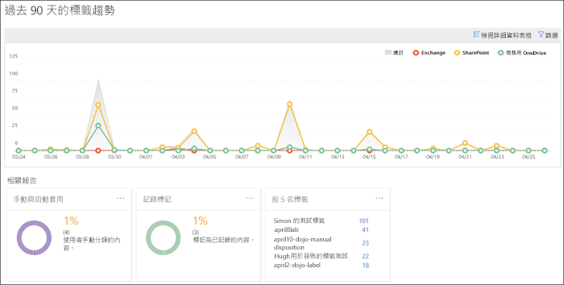
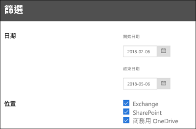

# 檢視資料控管報告View the data governance reports

在建立您的標籤之後，您想要驗證它們是否如您預期一般套用到內容。使用 Office 365 安全性與合規性中心的資料控管報告，您可以快速檢視：After you create your labels, you'll want to verify that they're being applied to content as you intended. With the data governance reports in the Office 365 Security &amp; Compliance Center, you can quickly view:
  
- **前 5 名標籤** 這份報告會顯示已套用到內容之前 5 名標籤的計數。按一下這份報告來檢視最近已套用到內容之所有標籤的清單。您可以看到每一個標籤的計數、位置、套用方式、其保留動作、其是否為記錄，以及其配置類型。**Top 5 labels** This report shows the count of the top 5 labels that have been applied to content. Click this report to view a list of all labels that have been recently applied to content. You can see each label's count, location, how it was applied, its retention actions, whether it's a record, and its disposition type. 
    
- **手動與自動套用** 這份報告會顯示已手動或自動標示之所有內容的計數，以及已手動標示與自動標示之內容的百分比。**Manual vs Auto apply** This report shows the count of all content that's been labeled manually or automatically, and the percentage of content that's been labeled manually vs automatically. 
    
- **記錄標記** 這份報告會顯示已標記為記錄或非記錄之所有內容的計數，以及已標記為記錄與非記錄之內容的百分比。**Records tagging** This report shows the count of all content that's been tagged as a record or non-record, and the percentage of content that's been tagged as a record vs. non-record. 
    
- **過去 90 天的標籤趨勢** 這份報告會顯示過去 90 天已套用之所有標籤的計數和位置。**Labels trend over the past 90 days** This report shows the count and location of all labels that have been applied in the last 90 days. 
    
所有這些報告都會顯示來自 Exchange、SharePoint 和商務用 OneDrive 的已標示內容。All these reports show labeled content from Exchange, SharePoint, and OneDrive for Business.
  
您可以在 [安全性與合規性中心] \> [資料控管]\*\*\*\* [儀表板]\> \*\*\*\* 中找到這些報告。You can find these reports in the Security &amp; Compliance Center \> **Data Governance** \> **Dashboard**.
  

  
您可以依日期 (最多 90 天) 和位置 (Exchange、SharePoint 和商務用 OneDrive) 篩選資料控管報告。最新的資料最多可能需要 24 小時才會出現在報告中。You can filter the data governance reports by date (up to 90 days) and location (Exchange, SharePoint, and OneDrive for Business). The most recent data can take up to 24 hours to appear in the reports.
  

  

