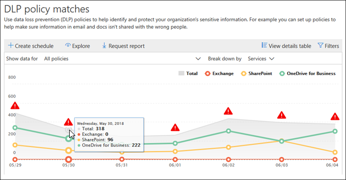

# 檢視資料外洩防護報告

您可以建立您的資料遺失防護 (DLP) 原則之後，您會想確認他們正在為您預期，並協助您符合規範。 使用 DLP 報告中 Office 365 安全性&amp;合規性中心，您可以快速檢視：
  
- **DLP 原則比對**這份報告顯示一段時間的 DLP 原則相符項目計數。 您可以依日期、 位置、 原則或動作篩選報告。 您可以使用此報告來： 
    
  - 調整或調整您的 DLP 原則，當您在測試模式中執行。 您可以檢視符合內容的特定規則。
    
  - 將重點放在特定時段，以了解尖峰和趨勢的原因。
    
  - 探索違反貴組織的 DLP 原則的商務程序。
    
  - 藉由查看哪些動作會套用到內容，了解 DLP 原則的任何業務影響。
    
  - 顯示該原則的任何符合項目來驗證是否符合特定 DLP 原則的規範。
    
  - 檢視的主要使用者清單，然後重複使用者參與您組織中的事件。
    
  - 在您的組織中檢視上方的敏感資訊類型清單。
    
- **DLP 事件**這份報告也會顯示原則相符項目經過一段時間，如原則相符項目報告。 不過，此原則會比對報表顯示相符項目層級規則;例如，若一封電子郵件符合三個不同的規則，原則會比對報表顯示三個不同列項目。 相反地，事件報告 」 可顯示相符項目層級項目;例如，若一封電子郵件符合三個不同的規則，事件報告顯示該份內容單一列項目。 
    
  因為報告計數彙總不同，原則相符項目報告是用來識別與特定規則的相符項目及正常調整 DLP 原則。 事件報告是內容的較適合用來識別會有問題的 DLP 原則的特定部分。
    
- **DLP 誤判和覆寫**如果您的 DLP 原則允許使用者覆寫它，或回報] 誤判，這份報告顯示這類的執行個體計數一段時間。 您可以依日期、 位置或原則篩選報告。 您可以使用此報告來： 
    
  - 調整或調整您的 DLP 原則所看見的原則可能會形成誤判較大數目。
    
  - 檢視他們所覆寫原則以解析原則秘訣時，使用者所提交的理由。
    
  - 探索其中 DLP 原則衝突有效商務程序所產生大量的使用者會覆寫。
    
所有的 DLP 報告可以顯示最近的四個月的時間期間內的資料。 最新的資料可能需要最多 24 小時才會出現在報告。
  
您可以在安全性中找到這些報告&amp;合規性中心\>**報表** \> **儀表板**。
  

  
## 檢視覆寫使用者所提交的理由

如果您的 DLP 原則允許使用者覆寫它，您可以使用誤判和覆寫報告] 來檢視提交的原則提示的文字。
  

  
## 採取動作的見解和建議

報告可以顯示見解和建議您將可以按一下 [請參閱潛在問題的詳細資料，並採取可能的補救措施的紅色警告圖示。
  

  
## 尋找 DLP 報告的 cmdlet

若要使用之 cmdlet 的大部分 security&amp;合規性中心，您需要：
  
1. [使用遠端 PowerShell 連線到 Office 365 安全性與合規性中心](http://go.microsoft.com/fwlink/?LinkID=799771&amp;clcid=0x409)
    
2. 使用下列任何一這些[Office 365 安全性&amp;合規性中心 cmdlet](http://go.microsoft.com/fwlink/?LinkID=799772&amp;clcid=0x409)
    
不過，DLP 報告需要提取資料從 Office 365，包括 Exchange Online。 基於這個理由，DLP 報告指令程式可供 Exchange Online Powershell 中，而不是以安全性&amp;合規性中心 Powershell。 因此，若要使用 cmdlet 的 DLP 報告，您必須：
  
1. [使用遠端 PowerShell 連線到 Exchange Online](http://go.microsoft.com/fwlink/?LinkID=799773&amp;clcid=0x409)
    
2. 使用這些 cmdlet 的任何 DLP 報告：
    
      - [Get-dlpdetectionsreport](http://go.microsoft.com/fwlink/?LinkID=799774&amp;clcid=0x409)
    
      - [Get-dlpdetailreport](http://go.microsoft.com/fwlink/?LinkID=799775&amp;clcid=0x409)
    

