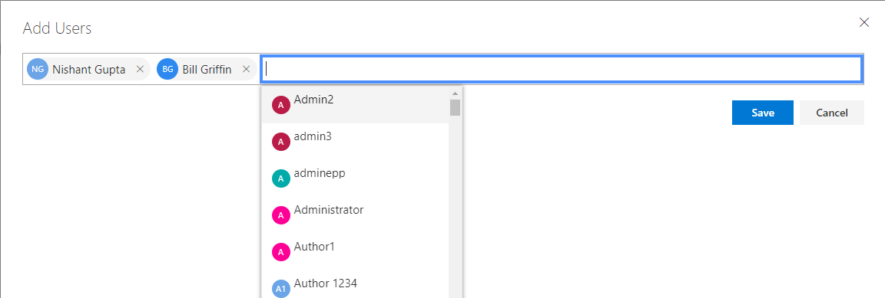

# <a name="work-with-microsoft-compliance-manager-preview"></a>搭配使用 Microsoft Compliance Manager （預覽）

> [!IMPORTANT]
> Microsoft Compliance Manager 是提供資料保護和合規性成長與建議，以提升資料保護和合規性的摘要儀表板和管理工具。 提供合規性管理員中的客戶動作是建議;它是由您的組織來評估在其各自的法規環境之前實作這些建議的有效性。 找到合規性管理員中的建議不應該解譯成保證郵件可以合規性。

## <a name="access-compliance-manager"></a>存取合規性管理員

您可以從服務信任入口網站存取合規性管理員。任何人只要有 Microsoft 帳戶或 Azure Active Directory 組織帳戶都可以存取合規性管理員。
  
1. 請移至 [https://servicetrust.microsoft.com](https://servicetrust.microsoft.com/)。

2. 使用您的 Microsoft 服務帳戶登入。 這是您 Office 365、 Microsoft 365 或 Azure Active Directory (Azure AD) 的使用者帳戶。

3. 在服務信任入口網站中，選取 [**合規性管理員**]。 這是合規性管理員的預覽版本。 **合規性管理員 （傳統）** 是舊版合規性管理員的連結。

4. 顯示非洩漏合約時，讀取它，然後選取 [**同意**才能繼續。 您必須同意一次，則會顯示在合規性管理員儀表板。

若要取得您快速上手，ISO/IEC 27001:2103 運作的 Office 365 評定，預設會出現為您的組織。

## <a name="administration"></a>系統管理

有特定的系統管理功能，而只提供給租用戶系統管理員時全域系統管理員帳戶登入時，只顯示。 不過，直到系統管理員會將合規性管理員角色指派給使用者，資料合規性管理員中會顯示組織中的所有使用者。 我們建議您實作來決定誰可以存取並執行動作合規性管理員中的角色型存取控制。
  
### <a name="assigning-compliance-manager-roles-to-users"></a>將合規性管理員角色指派給使用者

每個合規性管理員角色具有稍有不同的權限。 您可以檢視指派給每個角色的權限，請參閱哪些使用者位於哪些角色，並從新增或移除使用者在服務信任入口網站透過該角色。 選取 [**系統管理**功能表項目，然後選擇 [**設定**]，以檢視。
  

  
若要新增使用者或從合規性管理員角色中移除使用者。
  
1. 請移至 [https://servicetrust.microsoft.com](https://servicetrust.microsoft.com)。

2. 使用您的 Azure Active Directory 全域系統管理員帳戶登入。

3. 在服務信任入口網站上方的功能表列中，選取 [**系統管理員**，然後選擇**設定**。

4. 在 [**選取角色**] 下拉式清單中，選取您想要管理的角色。

5. 新增至每個角色的使用者會列在 [**選取角色**] 頁面上。

6. 將使用者新增至這個角色，選取 [**新增]**。 在 [**新增使用者**] 對話方塊中，選取 [使用者] 欄位。 您可以逐一捲動查看可用的使用者清單，或開始輸入使用者名稱來篩選清單，根據您的搜尋字詞。 選取使用者，將該帳戶新增至該角色使用佈建的 [**新增使用者**] 清單。 如果您想要新增多個使用者同時，開始輸入使用者名稱，以篩選] 清單中，，，然後選取要新增至清單的使用者。 選取 [**儲存**] 以佈建到這些使用者選取的角色。 

    
  
7. 若要移除此角色的使用者，請選取的使用者，然後選取 [**刪除**]。

    

## <a name="groups"></a>群組

群組可讓您以邏輯方式組織評估以及該共用一般資訊及工作流程工作之間具有相同或相關客戶管理控制項的評定。 若要協助降低客戶管理動作組織內，您可以藉由年、 標準、 服務、 小組、 部門或行政機關群組評估：
  
- **FFIEC 是評估 2019**
  - Office 365 + FFIEC IS
  - Intune + FFIEC IS
- **資料安全性與隱私權評估**
  - Office 365 + ISO 27001:2013
  - Office 365 + ISO 27018:2014

當您建立新的 「 評估時，您必須建立新的群組評估或指派給現有群組的評估。 群組無法被建立為獨立的實體。 建議您判斷的群組策略，針對您的組織*之前*新增新的評估。 根據預設，名為 「 預設群組 」 的群組是供您初始評估。 群組沒有任何安全性屬性。 評估與所有的權限相關聯。

當您使用的群組時，請記得：
  
- 當完成時，自動更新中相同群組中的不同評估相關的評估控制項。
- 當您建立新的 「 評估新的群組可以從現存的 group 複製資訊。 在新從 「 評估 」 新增至實作詳細資料和客戶管理控制措施的測試計劃和管理回應] 欄位中的群組，您要複製的任何資訊複製到相同 （或相關） 客戶管理控制評量。 如果您正在加入新的 「 評估至現有的群組，請從評估中該群組的一般資訊複製到新的評估。
- 群組名稱 （也稱為 「*群組 Id*」） 必須是唯一組織內。
- 群組可以為相同的憑證/規定，包含 「 評估 」，但每個群組僅能包含一個評估為特定的雲端服務/憑證配對。 例如，群組不能包含兩個 Office 365 和 NIST CSF 評估。 只有在相對應的每一個憑證/規定為不同的群組可以包含多個評定之相同雲端服務。
- 一旦評估已新增至評估群組中，無法變更群組。 您可以重新命名評估群組，將變更的群組該群組相關聯的所有 「 評估 」 的 「 評估名稱。 您可以建立評估及新的評估群組並複製資訊從現有的評估，有效地暗該評定的不同評估群組中。
- 封存評估會中斷該評估及群組之間的關係。 其他相關的 「 評估 」 的任何進一步更新不再會反映在封存的評估。

## <a name="tenant-management"></a>租用戶管理

合規性管理員 （預覽） 包含管理呼叫**租用戶管理**新的資料元素的新介面。 此介面可讓您管理租用戶整體設定：

- **維度：** 檢視、 新增並自訂的中繼資料的範本、 評估以及動作項目，可讓您建立自訂的樞紐分析表的篩選器。
- **擁有者：** 指定每個動作項目擁有者。
- **客戶動作：** 管理動作項目包含在合規性管理員 （預覽） 的完整清單，並啟用/停用安全分數監視整合在一起安全分數的動作。

選取**租用戶管理**]，以開啟管理介面，並使用下列步驟來管理**維度**、**擁有者**，以及**客戶動作**。

### <a name="dimensions"></a>Dimensions

維度都是中繼資料集提供範本、 評估或動作項目相關資訊。 維度使用機碼和值，其中維度索引鍵代表屬性，而維度值代表屬性的有效值的概念。 例如，合規性管理員中有三種類型的動作。 這些是由維度按鍵的**動作類型**和**文件**、**操作**，以及**技術**的維度值定義。 您可以修改現有的維度，或新增您自己。 新增維度時，通常需要匯入自訂的範本。

#### <a name="add-a-dimension"></a>新增維度

1. 開啟 [**租用戶管理**]，然後選取 [**尺寸**。
2. 選取 [ **+ 新增維度**]。
3. **索引鍵**欄位中輸入唯一的名稱。
4. （選用） 啟用同時使用相同的機碼，以**允許多重選取範圍的維度**滑切換開啟多個值。
5. 選取 [ **+ 新增**若要將值新增提供唯一的名稱，然後按一下 [儲存] 圖示。
6. 針對您想要新增的每個值重複步驟 5。
7. 選取 [**儲存**] 以儲存新的維度。

#### <a name="edit-a-dimension"></a>編輯維度

您可以重新命名為維度索引鍵，但您可以修改自訂維度中的值。

1. 開啟 [**租用戶管理**]，然後選取 [**尺寸**。
2. 找出您想要編輯、 選取它旁的省略符號 （...），選取 [**編輯**的維度。
3. 選取 [ **+ 新增**若要將值新增提供唯一的名稱，然後按一下 [儲存] 圖示或選取您想要編輯或刪除，然後選取 [**移除**或**編輯**的值。
4. 當您完成進行變更時，請選取 [**儲存**]。

#### <a name="delete-a-dimension"></a>刪除維度

如有需要您可以刪除自訂的維度。

1. 開啟 [**租用戶管理**]，然後選取 [**尺寸**。
2. 找出您想要刪除，請選取其，旁邊的省略符號 （...），然後選取 [**刪除**的維度。
3. 出現確認訊息時，選取 [**刪除**]。

### <a name="owners"></a>擁有者

擁有者用來識別每個控制項負責合作對象。 Microsoft、 客戶，或是兩者都擁有所有內建的控制項。 您可以建立自訂值的擁有者可以用來指定組織內更細微的責任。 例如，您可以建立代表特定群組、 小組或組織內的業務單位的擁有者。

#### <a name="add-an-owner"></a>新增擁有者

1. 開啟 [**租用戶管理**]，然後選取 [**擁有者**。
2. 選取 [ **+ 新增擁有者**]。
3. 提供的名稱和描述的擁有者，並選取 [**儲存**]。 描述會顯示在 [擁有者] 欄位。

#### <a name="edit-an-owner"></a>編輯擁有者

您無法編輯擁有者名稱，但您可以修改 [擁有者] 欄中顯示的描述。

1. 開啟 [**租用戶管理**]，然後選取 [**擁有者**。
2. 找出您想要編輯、 選取它旁的省略符號 （...），選取 [**編輯**擁有的者。
3. 視需要修改描述，並選取 [**儲存**]。

#### <a name="delete-an-owner"></a>刪除擁有者

1. 開啟 [**租用戶管理**]，然後選取 [**擁有者**。
2. 找出您想要刪除，請選取其，旁邊的省略符號 （...），然後選取 [**刪除**的擁有者。
3. 出現確認訊息時，選取 [**刪除**]。

### <a name="customer-actions"></a>客戶動作

客戶動作區域顯示所有客戶的所有範本及評估動作合規性管理員中 （預覽）。


在快速，您可以請參閱巨集指令的標題、 擁有者、 類別、 強制執行 >，以及分數，並判斷是否它整合安全分數。 您可以依序展開 [巨集指令，然後選取 [**更多讀取**閱讀動作的描述，並存取任何說明中的連結。 啟用及停用安全分數整合，根據每個巨集指令，以及新增自訂動作，您也可以使用此介面。 具有安全分數整合功能的動作有這些 （請注意，自訂動作也會有旁邊的省略符號） 旁的省略符號 （...）。

#### <a name="enable-or-disable-secure-score-integration"></a>啟用或停用安全分數整合

1. 選取您要修改，然後選取 [**編輯**巨集的指令的省略符號 （...）。
2. 切換開啟或關閉安全分數連續更新的參數來啟用或停用連續監視透過安全分數。
3. 選取**儲存**。

#### <a name="add-a-customer-action"></a>新增客戶巨集指令

1. 選取 [ **+ 新增客戶巨集指令**。
2. 提供在 [**標題**] 欄位中的巨集指令重複的標題。
3. 提供 「 合規性分數 （這可以是任何介於 1-99） 的**最大的合規性分數**欄位中的巨集指令。
4. 使用 [**巨集指令類型**] 下拉式清單來指定您要新增的動作類型。 如果不存在的動作類型，您可以將它新增將值新增至的動作類型維度索引鍵。
5. 使用 [**維度**] 下拉式清單來指定或巨集指令新增維度機碼和值。
6. 使用 [**擁有者**] 下拉式清單來指定巨集指令的擁有者。
7. 選取 [**+** 新增描述和說明，標題巨集指令。
8. 選取**X** ] 來關閉 [說明] 刀鋒視窗。
9. 選取 [**儲存**] 以儲存客戶巨集指令。

#### <a name="edit-a-customer-action"></a>編輯客戶巨集指令

1. 選取您要修改，然後選取 [**編輯**巨集的指令的省略符號 （...）。
2. 編輯視，巨集指令，然後選取 [**儲存**]。

#### <a name="delete-a-customer-action"></a>刪除客戶巨集指令

1. 選取您要修改，然後選取 [**刪除**的巨集指令的省略符號 （...）。
2. 出現確認訊息時，選取 [**刪除**]。

## <a name="assessments"></a>「 評估 」

### <a name="add-an-assessment"></a>新增評估
  
1. 在評估儀表板中，選取 [ **+ 新增評估**]。

2. [] 刀鋒視窗開啟時，請輸入下列資訊：

    - **標題 （必要）：** 輸入您的評估的標題
    - **請選取範本 （必要）：** 選取標準或自訂範本
    - **請選取群組或加入新的群組 （必要）：** 選取現有的群組，或選擇新增新的群組，並提供唯一的群組名稱
    - **您想要將資料複製從現有的群組？（選用）：** 切換要啟用群組複本的控制項，然後：
        - **選取群組 （選用）：** 如果啟用群組複本時，選取要複製之群組
            - **實作詳細資料 （選用）：** 選取 [將實作詳細資料複製到新的群組
            - **測試計劃 & 其他資訊 （選用）：** 選取 [複製測試計劃及其他資訊詳細資料] 以新的群組
            - **文件 （選用）：** 選取 [將文件複製到新的群組

3. 選取 [**儲存**] 以建立評估。

 新的評估會出現在評估儀表板上，並顯示下列資訊：

- 評估的標題。
- 評估，包括憑證、 環境及用於評估產品的尺寸。
- 上次修改的日期和它的建立的日期。
- 顯示百分比評估分數。
- 顯示 Microsoft 受管理] 和 [客戶所管理的評估控制項的數字的進度指標。

### <a name="copying-information-from-existing-assessments"></a>從現有「評估」複製資訊

當您建立評估時，您必須從現存的 group 複製資訊的選項。 這可讓您可以套用至相同的控制項中新的 「 評估複製評估輸入的資訊。 例如，如果您有一組所有 FFIEC 相關評估貴組織中，您可以從現有 「 評估 」 複製下列資訊：

- 實作詳細資料
- 測試計劃 & 其他資訊
- 文件

#### <a name="copy-information-from-an-existing-assessment-to-a-new-assessment"></a>將資訊從現有評估複製到新的 「 評估
  
1. 在評估儀表板中，選取 [ **+ 新增評估**]。
    
2. 在 [**新增評估**] 視窗中，完成下列的資訊

    - **標題 （必要）：** 輸入您的評估的標題。
    - **請選取範本 （必要）：** 選取一個標準或自訂的範本。
    - **請選取群組或加入新的群組 （必要）：** 選擇 [**加入新的群組**，並提供唯一的群組名稱。
    - **您想要將資料複製從現有的群組？（選用）：** 切換入啟用群組複製到控制項，然後:-**選取群組 （選用）：** 如果啟用群組複本時，選取要複製之群組。
            - **實作詳細資料 （選用）：** 選取 [將實作詳細資料複製到新的群組。
            - **測試計劃 & 其他資訊 （選用）：** 選取 [複製測試計劃及其他資訊詳細資料] 以新的群組。
            - **文件 （選用）：** 選取 [將文件複製到新的群組。

3. 選取 [**儲存**] 以建立評估。

### <a name="viewing-assessments"></a>檢視評估

#### <a name="view-an-assessment"></a>檢視評估
  
1. 在評估儀表板中，選取評估名稱以開啟它，檢視動作項目和控制項資訊。

以下是 Office 365 和 ISO 27001 評估的範例。 第一個檢視說明新的動作項目檢視合規性管理員中 （預覽）。


動作會依字母順序列出和每個巨集指令會指派分數以及擁有者。 選取**更多讀取**連結至讀取每個動作的詳細資料。 


選取來管理、 指派、 實作和測試巨集指令的 [**檢閱**] 連結。 以下是範例巨集指令。


在舊版的合規性管理員中，實作需求的工作流程執行控制層級。 法務人員會指派給某人實作控制項的控制項。 有了這兩個缺點：

- 控制項通常有多個動作，以及向誰控制項已指派，可能無法適當人員來完成實作控制項所需的所有動作的使用者相關聯
- 將個別工作結合成單一動作禁止的訊號和遙測用來自動記錄在合規性管理員 （預覽） 租用戶組態變更的集合。

合規性管理員中 （預覽），工作流程程序已經從 「 控制層級的巨集指令層級。 當檢閱巨集指令，下列欄位可用於管理巨集指令的工作流程：

- **指派給使用者：** 選取 [選擇或輸入應該要指派此巨集指令的使用者名稱此欄位。 您可以捲動清單，或輸入要尋找它的名稱，然後選取它。
- **管理文件：** 您可以上傳 Office 文件、 影像檔和螢幕擷取畫面，在 CSV 或 TXT，與 Pdf PowerShell 輸出的表單中實作的證據。
- **實作狀態：** 用來指出目前實作狀態的巨集指令。 可能的值為不實作、 Implemented、 替代實作、 計劃，而不是在範圍。
- **實作日期：** 採取動作時的日期。
- **測試結果：** 用來表示實作驗證的結果。 可能的值為不評估、 Passed、 失敗低風險、 失敗中度風險、 失敗高風險，而不是在範圍。
- **測試日期：** 發生驗證日期。
- **實作附註：** 輸入您的組織，以及您想要包含任何備忘稿實作詳細資料。
- **測試計劃：** 輸入此巨集指令，以及您想要包含任何備忘稿的測試計劃詳細資料。
- **的其他資訊：** 輸入此巨集指令或如何實作您的組織，以及任何您想要包含的附註中的任何其他資訊。

合規性管理員 （預覽） 也會包含在舊版中找到控制項為基礎的樞紐分析表。 選取 [檢視它的**控制項資訊**儀表板]。 您可以檢視在評估與範本的層級的控制項的資訊。 以下是範例控制項資訊儀表板的 「 評估 」。


針對評估，會顯示在控制項資訊儀表板：

- 若要選取的群組，以檢視 （當使用多個群組） 的 [**群組**] 下拉式清單。
- 選取要檢視哪些評估**評估**] 下拉式清單中。
- 有關所選的評估、 中繼資料包括：
    - **評估控制項**顯示控制項的總數透過評估控制項數目進度列指示器。
    - 評估，以百分比來顯示目前**合規性分數**。
    - **憑證**和用於評估**產品**詳細資料。
    - 目前**狀態**和評估的上次**修改**日期。
- 評估**範圍 Services 中**的清單。
- 依據控制項系列，客戶動作和 Microsoft 實作詳細資料的連結，將控制項的詳細資料：
    - **您的動作**會顯示您可以執行以滿足某些或所有控制項的需求的客戶動作。 多個控制項都有與其，相關聯的多個動作和控制項相關聯的所有動作都顯示在此處。 以下的動作有相同 UI 中的以動作儀表板中所列。
    - **Microsoft 動作**會顯示來自 Microsoft 的內部架構套用至選取的憑證控制項的控制項的清單。 針對每個內部的控制項，選取 [ **Implemented**查看 Microsoft 的實作和測試詳細資料，以及測試結果和測試的日期，如下所示。


### <a name="export-an-assessment"></a>匯出評估

您的組織中的符合性專案關係人或外部稽核者及管理者，您可以評估匯出至 Excel 檔案。 報表會建立報告的時間與日期起評估的快照集。 報表包含所有的 Microsoft 和客戶管理控制措施詳細資料，評估，控制項實作狀態] 控制項測試日期、 測試結果，並提供連結上傳的辨識項的文件。 您應該匯出評估報告之前封存評估，因為封存的評估不會保留上傳的文件的連結。
  
### <a name="export-an-assessment-report"></a>匯出評估報告
  
1. 合規性管理員儀表板上選取**控制項資訊**] 索引標籤。
2. **群組**及**評估**在下拉式功能表中選取您想要匯出的評估。
3. 選取 [**匯出**] 按鈕。

評估報告是在您的瀏覽器工作階段中下載為 Excel 檔案。 Excel 檔案的檔案名稱預設為評估的標題。

### <a name="archive-a-template-or-an-assessment"></a>封存的範本或評估

當您完成與範本或評估，不再需要以便符合規範時，您就可以進行封存。 保存的範本或評估時，則會從預設檢視，移除，您必須檢查顯示已封存] 核取方塊以顯示它。


  
> [!IMPORTANT]
> 封存的評估不會保留其上傳的辨識項文件的連結。 強烈建議您將匯出的評估封存之前保留在報表中的辨識項文件的連結。
  
#### <a name="archive-a-template"></a>封存的範本

1. 開啟**範本**儀表板。
2. 找出您想要選取 [封存] 圖示與封存的範本。
3. 當您看到確認訊息時，選取 [**封存**。

#### <a name="archive-an-assessment"></a>封存評估

1. 開啟 [**評估**儀表板]。
2. 從包含您想要封存評估] 下拉式清單中選取的**群組**。
3. 找出您想要選取 [封存] 圖示與封存的評估。
4. 當您看到確認訊息時，選取 [**封存**。

#### <a name="view-archived-assessments"></a>檢視封存的評估
  
1. 開啟 [**評估**儀表板] 索引標籤，然後檢查**顯示已封存**] 核取方塊。
2. 封存的評估會出現在 [**封存評估**] 區段中。
3. 選取要開啟並檢視評估的評估名稱。

#### <a name="activate-an-archived-assessment"></a>啟用封存的評估

1. 在**評估**] 索引標籤，然後選取 [**顯示已封存**] 核取方塊。
2. 封存的評估會出現在 [**封存評估**] 區段中。
3. 找出您想要啟動，然後選取 [啟動] 圖示的評估。
4. 當您看到確認訊息時，選取 [**啟動**。

## <a name="controls-and-actions"></a>控制項和動作

控制項和動作都是使用合規性管理員中 （預覽） 主要資料樞紐分析表。 控制項樞紐分析表，存在於舊版合規性管理員中，已增強，可以在相同的控制項系列中顯示 [Microsoft] 和 [客戶控制項。 此合併的檢視讓您更容易查看完整共同分擔每個控制項為基礎。 巨集指令樞紐分析表的新合規性管理員中 （預覽），其設計旨在提供簡化的檢視所有 Microsoft 建議的動作。

### <a name="controls"></a>控制項

控制項可以從控制項資訊儀表板檢視。 控制項代表從標準、 憑證、 規定或架構的需求。 若要將這些需求對應跨多個標準、 法規等等，並關聯動作，每個項目都會被視為是控制項架構。 例如，控制架構，例如] 區段中，由已細分規定，例如 HIPAA，並用 HIPAA 控制項合規性管理員中相同的編號配置為那些] 區段中，如下所示：


有三種類型的控制項。 兩個 Microsoft 提供的內建的範本] 中，第三個是所建立和管理自訂範本中的客戶。 這三種類型包括：

1. **Microsoft 管理控制措施 （公釐）：** 這些都是控制項，只有 Microsoft 具有責任。 它們會出現在方塊中的範本，並由 Microsoft 所加入到合規性管理員。
2. **客戶管理控制措施 （公分）：** 這些都是控制項，僅客戶有責任。 它們會出現在方塊中的範本，並由 Microsoft 或客戶新增到合規性管理員。 客戶也可以編輯或停用 Microsoft 提供的客戶管理控制措施。
3. **共用控制項 (SM):** 這些是控制項責任 Microsoft 與客戶之間的共用位置。 這些會出現在方塊中的範本，並由 Microsoft 新增到合規性管理員。

### <a name="actions-items"></a>動作項目

動作項目是建議的工作的實作需求的標準或法規，或若要測試，確認，請確定並記錄貴組織的實作需求。 一或多個控制項與動作相關聯。 每個控制項都有一或多個動作相關聯，以及每個動作可與一或多個控制項相關聯。 動作是核心工作流程在合規性管理員 （預覽） 的一部分，因為它們是已指派、 追蹤，並驗證您的組織的物件。

#### <a name="assign-action-items"></a>指派動作項目
  
1. 在**動作項目**儀表板中，選取包含您想要指派其動作評估工作的**群組**。
2. 在 [**評估**] 下拉式清單中，選取您想要指派，其巨集指令的評估或從若要查看所有可用的動作] 下拉式清單中選取 [**全部]** 。
3. 找出您想要指派，巨集的指令，在 [**擁有者**] 欄中，選取 [**檢閱**、 **Implemented**或**測試**的連結。
4. 選取 [**指派的使用者**] 欄位中，並會出現在組織中的使用者清單。 捲動清單，並選取使用者或篩選來選取使用者所輸入的使用者名稱的清單。
5. 在實作附註] 欄位中，輸入您想要傳達指派的使用者任何附註。
6. 選取 [**儲存**] 以指派巨集指令。

#### <a name="reassign-action-items"></a>重新指派動作項目

此函數可讓組織能夠移除任何使用中或未完成相依性的使用者帳戶，只要重新指派給新的使用者動作。

1. 在**動作項目**儀表板中，選取包含您想要重新指派其動作評估工作的**群組**。
2. 在 [**評估**] 下拉式清單中，選取您想要重新指派，其巨集指令的評估或從 [若要查看所有可用的動作] 下拉式清單中選取 [**所有**。
3. 找出您想要重新指派，巨集的指令，在 [**擁有者**] 欄中，選取 [**檢閱**、 **Implemented**，或**測試**的連結。
4. 從**指派的使用者**] 欄位中，刪除現有的使用者與 [從使用者的清單中選擇不同的使用者或篩選來選取使用者所輸入的使用者名稱的清單。
5. 在實作附註] 欄位中，輸入您要向使用者傳達任何附註。
6. 選取 [**儲存**] 以重新指派動作。

## <a name="templates"></a>範本

範本為基礎物件合規性管理員中 （預覽） 相關聯的產品與憑證 （例如標準、 法規、 控制項 framework 等等）。 範本可檢視及新增範本儀表板。


 
儀表板會顯示每個範本，以及憑證並產品與相關聯範本，的日期所在範本建立以及上次修改日期，客戶及 Microsoft 管理的控制措施，最大合規性分數的數目範本，以及範本 （例如，已核准擱置核准、 匯入） 的狀態。

內建的範本每個具有內建評估與其相關聯，但您可以建立其他內建範本為基礎的 「 評估 」 和您可以匯入您自己的範本，並建立自訂關閉這些基礎的 「 評估 」。

### <a name="create-a-template"></a>建立範本

藉由複製現有的範本或匯入自訂的範本，您可以建立範本。 沒有特定的格式和範本的資料，必須使用的結構描述或其不會匯入到合規性管理員。 可以在此處下載與正確的結構描述及資料範例檔案。
每個自訂的範本應為個別 Excel 中的活頁簿 （.xls 或.xlsx 格式），其中包含五個索引標籤：

1. 範本評估
2. ControlFamily
3. 動作
4. 擁有權
5. Dimensions

下面會使用每個索引標籤內的結構描述。

#### <a name="template-assessment-tab"></a>範本評估] 索引標籤

此索引標籤具有單一資料行：

- **inScopeServices**： 產品或服務範圍內的逗號分隔的清單範本。

#### <a name="controlfamily-tab"></a>ControlFamily] 索引標籤

此索引標籤包含定義對應至列在 [動作] 索引標籤上的動作控制項的資料行，並包含像是控制項名稱、 系列、 標題和描述的詳細資訊。  此索引標籤的順序必須 Excel 內下方所列順序，資料行是： 

- **controlName:** 從憑證/標準/規定] 等的控制項名稱。
- **controlFamily:** 從憑證/標準、 規定等控制項系列。
- **controlTitle:** 從憑證/標準/規定等控制項標題。
- **controlDescription:** 控制從憑證/標準/規定等等的描述。
- **controlVersion:** 選用的控制項的版本資訊。  範例： NIST 800-53 的目前值是反轉 4，因此 controlVersion 為 4。  對於 CSA CCM，通常是 3.0.1。
- **isDisabled:** 使用 TRUE 或 FALSE，指出是否已停用控制項。
- **controlType:** 使用公分表示這些是客戶管理控制措施。
- **controlComplianceScore:** 指派給控制項的所有動作的分數的總和。
- **controlActionTitle:** 雙 semi colon 分隔清單的所有 actionTitles 此所列在 [動作] 索引標籤上的控制項。 

#### <a name="actions-tab"></a>動作] 索引標籤

此索引標籤包含定義個別的動作，資料行，其包含巨集指令標題、 擁有權和維度等的詳細資訊。 此索引標籤的順序必須 Excel 內下方所列順序，資料行是： 

- **actionTitle:** 巨集指令的標題。 每個標題必須是唯一的並建議使用 Pascal 案例。
- **actionRelatedODVs:** 雙以分號分隔的清單是父項 actionTitle] 欄中列出的子系的 actionTitles。 在父/子關聯性，父項會代表高浮水印。 因此，如果您完成父巨集指令時，您也完成所有的子系動作。 例如，當您有類似的需求，但不同標準定義的值，例如密碼長度] 中，其中的 15 個字元，至少需要一個標準/規定，而另一個需要至少要有 12 或 10。 15 是在這個範例中，父，如果您設定最少的 15 個字元，您也可以滿足建議中其他評估 12 或 10 個字元的動作。

    > [!NOTE]
    > ActionRelatedODVs 欄是必要的資料行結構描述。不過，不提供在合規性管理員 （預覽） 功能 （相關動作）。  它已排定在後續版本中新增。

- **actionDimensionValues:** 雙以分號分隔的清單適用維度的維度] 索引標籤上，使用下列格式：

    ```
    Dimension Key::Dimension Value;;Dimension Key::Dimension Value.
    ```
    
    例如：

    ```
    Product::Office 365;;Certification::NIST CSF
    ```

    即使已列出維度儀表板上，必須匯入檔案中，[維度] 索引標籤上列出所有的自訂範本中所使用的維度。 如果您要新增新的維度索引鍵或值，您必須將其新增至維度儀表板的第一次。
- **actionScore:** 每個巨集指令，代表該動作的分數的數值。 我們建議的下列計分模型使用內建的評估，根據每個巨集指令的用途和強制執行。
- **actionOwnership:** 雙以分號分隔的清單擁有人。 在 [擁有權] 索引標籤上都必須包含所有列出的擁有者。
- **actionDescription:** 每個動作，這必須是唯一的文字。 此欄位支援 Markdown 語言，如下所示。

#### <a name="ownership-tab"></a>擁有權] 索引標籤

此索引標籤包含定義每個動作的擁有者的欄。  此索引標籤的順序必須 Excel 內下方所列順序，資料行是：

- **ownershipName:** 擁有者/負責廠商唯一名稱。
- **ownershipDescription:** 擁有者/負責廠商的描述。

#### <a name="dimensions-tab"></a>維度] 索引標籤

此索引標籤包含定義可與動作相關聯的維度的欄。  此索引標籤的順序必須 Excel 內下方所列順序，資料行是：

- **dimensionKey:** 用於維度的金鑰的清單。 例如，產品，憑證，等等。
- **dimensionValue:** 每個維度機碼的唯一值。 例如，Office 365、 Intune、 Azure、 自訂的產品，等等。
- **allowMultiSelect:** 多個維度值表示可以選取單一維度機碼中使用 TRUE 或 FALSE。

#### <a name="using-markdown-language-in-description-fields"></a>描述欄位中使用 Markdown 語言

範本和評估支援 Markdown 語言使用的一些文字項目和格式設定。  有三種格式的項目 Markdown 語言使用合規性管理員中：

- 項目符號及編號清單
- Hyperlinks
- 粗體

項目符號被當成星號，而不是 Word 或 Excel 項目符號。 例如：

```
* Item A
* Item B
* Item C
```

以數字，但有空格的縮排 （每層級的三個空格） 及僅用於所有子層級 （例如，沒有字母） 的數字表示數字。  例如：
   1. 項目 A
   2. 項目 B
      1. 子項目 A
      2. 子項目 B
   3. 項目 C
   4. 項目 D
      1. 子項目 A
      2. 子項目 B
   5. 項目 E

超連結所建構方式置於立即旁 close 括號括號括住的超連結文字和本身的超連結。  例如：

```
Click [here](https://www.microsoft.com) to go to Microsoft’s home page.
```
這段文字轉譯，如下所示： 按一下[這裡](https://www.microsoft.com)以移至 Microsoft 的首頁。
在上述範例所示，合規性管理員中不會呈現 Url 與底線。

粗體文字是設為粗體文字的每一邊僅由兩個星號。  例如：

```
**This text will render in bold**
```
**此文字會以粗體顯示呈現**

### <a name="create-a-template"></a>建立範本

藉由複製現有的範本，或藉由從 Excel 匯入範本資料，您可以建立範本。 當從 Excel 匯入資料，範本會需要兩個不同的合規性管理員中系統管理員，若要發佈的資料 （若要發行，其中並核准一個）。

#### <a name="create-a-template-by-copying-an-existing-template"></a>藉由複製現有的範本建立範本

1. 開啟**範本**儀表板，然後選取 [ **+ 新增範本**。
2. 在 [**輸入範本名稱**] 欄位中，提供範本的唯一名稱。
3. 檢查**複製從現有的範本**] 核取方塊，然後選取您想要複製從下拉式清單的範本。
4. 選擇性地新增任何其他的維度。
5. 選取 [**新增至儀表板**]。

#### <a name="create-a-template-by-importing-data"></a>建立範本匯入資料

1. 開啟**範本**儀表板，然後選取 [ **+ 新增範本**。
2. 在 [**輸入範本名稱**] 欄位中，提供範本的唯一名稱。
3. 新增一或多個維度。 即使您使用的維度列出維度儀表板上，他們必須仍列在匯入檔案。
4. 選取 [**瀏覽]** 以瀏覽至匯入檔案的位置，加以選取，然後選取 [**開啟**]。
5. 匯入檔案將會進行驗證，並指出控制項和已偵測到的控制項系列的數目。 如果沒有錯誤，連結會提供給已修改的舊版匯入檔案，其中包含錯誤的詳細資料。 將匯入資料之前，必須先解決所有錯誤。
6. 一旦資料會通過驗證，請選取 [**新增至儀表板**。
7. 匯入的範本會出現在 [**範本**儀表板上，且其具有**匯入**的狀態。 選取的省略符號 （...），然後選取 [**發佈**到發佈範本。 出現確認訊息時，選取 [**發行**。 **等待核准**範本狀態變更。
8. 合規性管理員中系統管理員角色與另一位使用者必須核准的範本儀表板中的範本。 他們必須選取省略符號 （...），然後選取 [**核准**。 出現確認訊息時，選取 [**核准**]。 範本現已可供使用。

### <a name="customize-a-template"></a>自訂範本

可透過其他自訂控制項的自訂範本。 所有自訂控制項視為客戶管理控制措施。

#### <a name="add-a-custom-control-to-a-template"></a>將自訂控制項新增至範本。

1. 開啟您要修改的**範本**。
2. 選取 [ **+ 新增**自訂控制項。
3. 從下拉式清單選取**控制項系列**，或如果它不存在，請輸入新的控制項系列。
4. 提供唯一的名稱或 ID 的**控制項識別碼**] 欄位中的控制項。
5. 提供在 [**標題**] 欄位中的控制項標題。
6. 提供需求和在 [**描述**] 欄位中的控制項的其他資訊。
7. 選取 [**指派客戶**巨集指令。
8. 找出您想要指派給控制項的動作：
    - 使用**篩選維度**可使用指派給動作的維度，找出，並列出。
    - 使用**篩選擁有者**可使用指派給動作而後，找出，並列出。
    - 清單類型的動作，從下拉式清單選取**動作類型**。
    - 輸入動作來找出，並將它的標題。
9. 步驟 8 中使用的準則，會出現的**比對的動作**清單。 選取您想要指派給控制項的第一個巨集指令。
10. 動作的詳細資料會出現。 選取您想要使用並選取 [**完成**] 的**描述**。
11. 針對您想要指派每個額外動作重複步驟 9 到 10。
12. 當已選取所有適用的動作，請選取 [**指派**。
13. 選取 [**儲存**] 以儲存新的控制項。

### <a name="export-a-template-to-json"></a>將範本匯出至 JSON

合規性管理員 （預覽） 也支援將範本匯出至 JavaScript Object Notation (JSON) 格式。 這可讓您的 exchange 支援 JSON 其他系統的合規性管理員資料。

## <a name="reports"></a>報表

您的組織中的符合性專案關係人或外部稽核者及管理者，您可以評估匯出至 Excel 檔案。 報表是日期起評估的快照集與匯出的時間。 報表會包含 Microsoft 和客戶管理控制措施詳細資料，如評估、 控制項實作狀態、 日期控制項測試、 測試結果與上傳的辨識項文件的連結。 封存它們，因為封存的評估不會保留到連結上傳文件之前，您應將匯出的評估。

### <a name="export-an-assessment"></a>匯出評估

1. 合規性管理員儀表板上選取**控制項資訊**] 索引標籤。
2. 評估與群組] 下拉式清單功能表中選取您想要匯出的評估。
3. 選取 [匯出]。 評估匯出為 Excel 檔案下載。


## <a name="permissions"></a>權限

下表說明每個合規性管理員權限，並可讓使用者執行。 表也會指出每個權限指派的角色。

||**合規性管理員讀取者**|**合規性參與者**|**合規性管理員評估者**|**合規性管理員管理者**|**入口網站管理員**|
|:-----|:-----|:-----|:-----|:-----|:-----|
|**讀取資料：** 使用者可以讀取但無法編輯資料 （但不包括範本資料和租用戶管理）。  <br> | X | X | X | X  | X |
|**編輯資料：** 使用者可以編輯除了 （但不包括範本資料和租用戶管理） 的測試結果] 和 [測試日期欄位以外的所有欄位。  <br> || X | X  | X | X |
|**編輯測試結果：** 使用者可以編輯 [測試結果和測試日期] 欄位。  <br> ||| X | X | X |
|**管理評估：** 使用者可以建立、 封存和刪除 「 評估 」。  <br> |||| X | X |
|**管理主要資料：** 使用者可以檢視、 編輯和刪除範本資料和承租人管理資料。  <br> |||| X | X |
|**管理使用者：** 使用者可以將其他使用者新增至 「 助讀程式、 參與者、 評估者，與系統管理員角色其組織中。 只有那些與您的組織中的全域系統管理員角色的使用者可以新增或移除入口網站系統管理員角色的使用者。  <br> ||||| X |

### <a name="guest-access"></a>來賓存取
  
設定合規性管理員存取後，任何沒有佈建的角色的使用者就會處於預設 （這也是像個人 Microsoft 帳戶的任何非組織提供帳戶的經驗） 的**來賓存取**角色。 來賓存取使用者不需要的完整存取權合規性管理員中的所有功能。 它們不能看到任何組織的合規性評估資料，不過，它們是可以使用合規性管理員來檢視 Microsoft 的相容性評估報告及 Service 信任的文件。