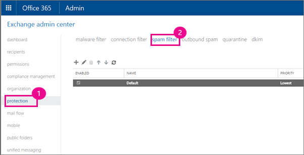

# <a name="zero-hour-auto-purge---protection-against-spam-and-malware"></a><span data-ttu-id="c3ffc-104">零時差自動清除 - 防範垃圾郵件和惡意程式碼</span><span class="sxs-lookup"><span data-stu-id="c3ffc-104">Zero-hour auto purge - protection against spam and malware</span></span>

<span data-ttu-id="c3ffc-p102">零小時自動清除 (ZAP) 是電子郵件保護功能，可偵測到的郵件垃圾郵件或惡意程式碼中已被傳送到使用者的收件匣，並再轉譯無害惡意的內容。如何 ZAP 執行此動作而定的偵測到惡意內容類型。</span><span class="sxs-lookup"><span data-stu-id="c3ffc-p102">Zero-hour auto purge (ZAP) is an email protection feature that detects messages with spam or malware that have already been delivered to your users' inboxes, and then renders the malicious content harmless. How ZAP does this depends on the type of malicious content detected.</span></span>
  
<span data-ttu-id="c3ffc-107">ZAP 皆可使用的預設值是包含任何包含 Exchange Online 信箱的 Office 365 訂閱的 Exchange Online Protection。</span><span class="sxs-lookup"><span data-stu-id="c3ffc-107">ZAP is available with the default Exchange Online Protection that is included with any Office 365 subscription that contains Exchange Online mailboxes.</span></span>
  
## <a name="how-does-zap-work"></a><span data-ttu-id="c3ffc-108">ZAP 如何運作？</span><span class="sxs-lookup"><span data-stu-id="c3ffc-108">How does ZAP work?</span></span>

<span data-ttu-id="c3ffc-p103">Office 365 更新反垃圾郵件引擎和惡意程式碼中的簽章即時每天。不過，您的使用者可能仍屬惡意郵件傳遞至其收件匣的各種包括當內容 weaponized 一次之後先傳遞給使用者的原因。ZAP 這持續監視更新至 Office 365 垃圾郵件和惡意程式碼簽章的地址與因此尋找和收件匣中已移除先前已傳遞的郵件。已識別為垃圾郵件的郵件，ZAP 會將未讀取的郵件移至使用者的垃圾郵件] 資料夾。針對新偵測到惡意程式碼、 ZAP 會移除電子郵件，不論郵件是否已讀取的附件。反向是已不正確地歸類為惡意的郵件，則為 true。</span><span class="sxs-lookup"><span data-stu-id="c3ffc-p103">Office 365 updates anti-spam engine and malware signatures in real-time on a daily basis. However, your users might still get malicious messages delivered to their inboxes for a variety of reasons, including when the content was weaponized at a time after it was first delivered to users. ZAP addresses this by continually monitoring updates to the Office 365 spam and malware signatures, and can therefore find and remove previously delivered messages already in inboxes. For mail that was already identified as spam, ZAP moves unread messages to the user's Junk mail folder. For newly detected malware, ZAP removes the attachments from the email message, regardless of whether the mail was read or not. The reverse is true for messages that were incorrectly classified as malicious.</span></span>
  
<span data-ttu-id="c3ffc-115">信箱使用者、 他就不通知郵件已經移動 ZAP 動作是相當順暢。</span><span class="sxs-lookup"><span data-stu-id="c3ffc-115">The ZAP action is seamless for the mailbox user, he or she is not notified the mail has been moved.</span></span>
  
<span data-ttu-id="c3ffc-116">允許清單、[郵件流程規則](https://go.microsoft.com/fwlink/p/?LinkId=722755)及使用者的規則或其他篩選器優先於 ZAP。</span><span class="sxs-lookup"><span data-stu-id="c3ffc-116">Allow lists, [mail flow rules](https://go.microsoft.com/fwlink/p/?LinkId=722755), and end user rules or additional filters take precedence over ZAP.</span></span>
  
 <span data-ttu-id="c3ffc-117">**本文內容：**</span><span class="sxs-lookup"><span data-stu-id="c3ffc-117">**In this article:**</span></span>
  
> [<span data-ttu-id="c3ffc-118">設定垃圾郵件篩選器原則</span><span class="sxs-lookup"><span data-stu-id="c3ffc-118">Set spam filter policy</span></span>](zero-hour-auto-purge.md#BK_SetSpam)
    
> [<span data-ttu-id="c3ffc-119">請參閱 ZAP 是否移動郵件</span><span class="sxs-lookup"><span data-stu-id="c3ffc-119">See if ZAP moved your message</span></span>](zero-hour-auto-purge.md#BK_DidZAPMove)
    
> [<span data-ttu-id="c3ffc-120">停用 ZAP</span><span class="sxs-lookup"><span data-stu-id="c3ffc-120">Disable ZAP</span></span>](zero-hour-auto-purge.md#BK_Posh)
    
> [<span data-ttu-id="c3ffc-121">常見問題集</span><span class="sxs-lookup"><span data-stu-id="c3ffc-121">FAQ</span></span>](zero-hour-auto-purge.md#BK_FAQ)
    
## <a name="working-with-zap"></a><span data-ttu-id="c3ffc-122">使用 ZAP</span><span class="sxs-lookup"><span data-stu-id="c3ffc-122">Working with ZAP</span></span>

<span data-ttu-id="c3ffc-123">ZAP 會開啟依預設，但您必須確認符合條件一些：</span><span class="sxs-lookup"><span data-stu-id="c3ffc-123">ZAP is turned on by default, but you do have to make sure a couple of conditions are met:</span></span>
  
- <span data-ttu-id="c3ffc-124">垃圾郵件篩選器原則設為[移至 [垃圾郵件] 資料夾的郵件](zero-hour-auto-purge.md#BK_SetSpam)。</span><span class="sxs-lookup"><span data-stu-id="c3ffc-124">Spam filter policy is set to [Move message to Junk Email folder](zero-hour-auto-purge.md#BK_SetSpam).</span></span>
    
    <span data-ttu-id="c3ffc-125">您也可以建立新的垃圾郵件篩選器原則只套用一組使用者如果您不想要 ZAP 所篩選的所有信箱。</span><span class="sxs-lookup"><span data-stu-id="c3ffc-125">You can also create a new spam filter policy that applies only to a set of users if you don't want all mailboxes to be screened by ZAP.</span></span>
    
- <span data-ttu-id="c3ffc-126">使用者的[選項\>垃圾郵件](https://support.office.com/article/068FA430-F8D7-4518-A8DA-8BC74958F05F)。</span><span class="sxs-lookup"><span data-stu-id="c3ffc-126">The user's [Options \> Junk Email](https://support.office.com/article/068FA430-F8D7-4518-A8DA-8BC74958F05F).</span></span>
    
<span data-ttu-id="c3ffc-127">如果您想[要查看 ZAP 如果移動郵件](zero-hour-auto-purge.md#BK_DidZAPMove)，您可以使用 Exchange Online 的郵件追蹤工具。</span><span class="sxs-lookup"><span data-stu-id="c3ffc-127">If you want [to see if ZAP moved your message](zero-hour-auto-purge.md#BK_DidZAPMove), you can use the Exchange Online message trace tool.</span></span>
  
<span data-ttu-id="c3ffc-128">系統管理員也可以[停用 ZAP](zero-hour-auto-purge.md#BK_Posh)使用 PowerShell。</span><span class="sxs-lookup"><span data-stu-id="c3ffc-128">Admins can also [disable ZAP](zero-hour-auto-purge.md#BK_Posh) by using PowerShell.</span></span> 
  
 <span data-ttu-id="c3ffc-129">**若要設定垃圾郵件篩選器原則**</span><span class="sxs-lookup"><span data-stu-id="c3ffc-129">**To set spam filter policy**</span></span>
  
1. <span data-ttu-id="c3ffc-130">登入[登入 Office 365 企業版位置](https://support.office.com/article/e9eb7d51-5430-4929-91ab-6157c5a050b4)並且選擇 [**保護** \> **垃圾郵件篩選器**。</span><span class="sxs-lookup"><span data-stu-id="c3ffc-130">Sign in to the [Where to sign in to Office 365 for business](https://support.office.com/article/e9eb7d51-5430-4929-91ab-6157c5a050b4) and choose **protection** \> **spam filter**.</span></span> 
    
    
  
2. <span data-ttu-id="c3ffc-132">[選擇您要調整的篩選器原則或選擇 [**新增**來建立新的專案。</span><span class="sxs-lookup"><span data-stu-id="c3ffc-132">Either choose the filter policy you want to adjust, or choose **add** to create a new one.</span></span> 
    
    <span data-ttu-id="c3ffc-p104">在舊版的螢幕擷取畫面，原則名為"Default"，但如果您建立額外的垃圾郵件篩選器原則您可以授與不同的名稱。您也可以將原則套用至只有一組有限的使用者。</span><span class="sxs-lookup"><span data-stu-id="c3ffc-p104">In the previous screen shot, the policy is named "Default", but if you create additional spam filter policies you can give them a different name. You can also apply the policy to only a limited set of users.</span></span>
    
3. <span data-ttu-id="c3ffc-135">在 [原則] 視窗中，選擇 [**垃圾郵件和大量動作**]，然後確定**垃圾郵件**設定為**將郵件移至 [垃圾郵件] 資料夾**。</span><span class="sxs-lookup"><span data-stu-id="c3ffc-135">In the policy window, choose **spam and bulk actions**, and make sure that **Spam** is set to **Move message to Junk Email folder**.</span></span> 
    
    <span data-ttu-id="c3ffc-136">如果您選擇**儲存**此時，原則可套用至 Office 365 租用戶。</span><span class="sxs-lookup"><span data-stu-id="c3ffc-136">If you choose **Save** at this point, the policy applies to your Office 365 tenant.</span></span> 
    
    ![設定垃圾郵件和大量 Mpve 郵件至垃圾郵件] 資料夾的動作](media/4332cfb3-89e1-48ba-8da8-9286f2fa1089.PNG)
  
4. <span data-ttu-id="c3ffc-p105">如果您建立新的原則，而您想要將原則套用至只有一組使用者，捲動至 [**套用至**] 區段中原則篩選器] 視窗中，與功能表控制項中選擇 [**收件者**、**網域**或**群組的成員資格**您要套用之原則。您也可以設定其他條件和例外狀況。</span><span class="sxs-lookup"><span data-stu-id="c3ffc-p105">If you created a new policy, and you want to apply the policy to only a set of users, scroll to the **Applied To** section in the policy filter window, and in the menu controls choose the **recipients**, **domain**, or **group memberships** you want to apply the policy to. You can also set additional conditions and exceptions.</span></span> 
    
    ![在 [套用] 區段中選擇 [收件者](media/19ca10db-c0f4-432c-b3de-ad4101a23de6.PNG)
  
    <span data-ttu-id="c3ffc-141">選擇 [**儲存**] 以將原則套用至選取的使用者。</span><span class="sxs-lookup"><span data-stu-id="c3ffc-141">Choose **Save** to apply the policy to the selected users.</span></span> 
    
 <span data-ttu-id="c3ffc-142">**若要查看 ZAP 是否移動郵件**</span><span class="sxs-lookup"><span data-stu-id="c3ffc-142">**To see if ZAP moved your message**</span></span>
  
- <span data-ttu-id="c3ffc-143">您可以使用[找出並修正為商務系統的 Office 365 的電子郵件傳遞問題](https://support.office.com/article/e7758b99-1896-41db-bf39-51e2dba21de6)來決定 ZAP 已移動郵件：</span><span class="sxs-lookup"><span data-stu-id="c3ffc-143">You can use the [Find and fix email delivery issues as an Office 365 for business admin](https://support.office.com/article/e7758b99-1896-41db-bf39-51e2dba21de6) to determine if the message was moved by ZAP:</span></span> 
    
    <span data-ttu-id="c3ffc-144">尋找您追蹤詳細資料] 以找出 ZAP 已移動郵件中的文字"零小時自動清除 (ZAP)"。</span><span class="sxs-lookup"><span data-stu-id="c3ffc-144">Look for the text "Zero-Hour Auto Purge (ZAP)" in your trace details to identify a message that was moved by ZAP.</span></span>
    
 <span data-ttu-id="c3ffc-145">**若要停用 ZAP**</span><span class="sxs-lookup"><span data-stu-id="c3ffc-145">**To disable ZAP**</span></span>
  
- <span data-ttu-id="c3ffc-146">如果您想要停用您的 Office 365 租用戶的 ZAP 或一組使用者，使用[Set-hostedcontentfilterpolicy](https://go.microsoft.com/fwlink/p/?LinkId=722758)、 EOP 指令程式的**ZapEnabled**參數。</span><span class="sxs-lookup"><span data-stu-id="c3ffc-146">If you want to disable ZAP for your Office 365 tenant, or a set of users, use the **ZapEnabled** parameter of [Set-HostedContentFilterPolicy](https://go.microsoft.com/fwlink/p/?LinkId=722758), an EOP cmdlet.</span></span>
    
    <span data-ttu-id="c3ffc-147">在下列範例中，ZAP 已停用名為"Test"的內容篩選原則。</span><span class="sxs-lookup"><span data-stu-id="c3ffc-147">In the following example, ZAP is disabled for a content filter policy named "Test".</span></span>
    
||
|:-----|
|
```
  Set-HostedContentFilterPolicy -Identity Test -ZapEnabled $false
```

|
   
## <a name="faq"></a><span data-ttu-id="c3ffc-148">常見問題集</span><span class="sxs-lookup"><span data-stu-id="c3ffc-148">FAQ</span></span>
<span data-ttu-id="c3ffc-149"><a name="BK_FAQ"> </a></span><span class="sxs-lookup"><span data-stu-id="c3ffc-149"></span></span>

 <span data-ttu-id="c3ffc-150">**如果合法的訊息移至 [垃圾郵件] 資料夾發生什麼情況？**</span><span class="sxs-lookup"><span data-stu-id="c3ffc-150">**What happens if a legitimate message is moved to the junk mail folder?**</span></span>
  
<span data-ttu-id="c3ffc-p106">您應該遵循 false 測的標準報表程序。郵件會從收件匣移至垃圾郵件資料夾的唯一原因是因為此服務已決定郵件是垃圾郵件或惡意。</span><span class="sxs-lookup"><span data-stu-id="c3ffc-p106">You should follow the normal reporting process for false-positives. The only reason the message would be moved from the inbox to the junk mail folder would be because the service has determined that the message was spam or malicious.</span></span>
  
 <span data-ttu-id="c3ffc-153">**如果使用 Office 365 隔離而不是垃圾郵件資料夾吗？**</span><span class="sxs-lookup"><span data-stu-id="c3ffc-153">**What if I use the Office 365 quarantine instead of the junk mail folder?**</span></span>
  
<span data-ttu-id="c3ffc-154">ZAP 不會將郵件移至隔離區從收件匣這一次。</span><span class="sxs-lookup"><span data-stu-id="c3ffc-154">ZAP doesn't move messages into quarantine from the Inbox at this time.</span></span>
  
 <span data-ttu-id="c3ffc-155">**如果我有自訂郵件流程規則 （封鎖 / 允許規則） 吗？**</span><span class="sxs-lookup"><span data-stu-id="c3ffc-155">**What If I have a custom mail flow rule (Block/ Allow Rule)?**</span></span>
  
<span data-ttu-id="c3ffc-p107">由系統管理員 （郵件流程規則） 或封鎖及允許規則建立的規則優先採用。這類郵件會排除功能準則。</span><span class="sxs-lookup"><span data-stu-id="c3ffc-p107">Rules created by admins (mail flow rules) or Block and Allow rules take precedence. Such messages are excluded from the feature criteria.</span></span>
  
## <a name="related-topics"></a><span data-ttu-id="c3ffc-158">相關主題</span><span class="sxs-lookup"><span data-stu-id="c3ffc-158">Related Topics</span></span>
<span data-ttu-id="c3ffc-159"><a name="BK_FAQ"> </a></span><span class="sxs-lookup"><span data-stu-id="c3ffc-159"></span></span>

[<span data-ttu-id="c3ffc-160">Office 365 電子郵件反垃圾郵件保護</span><span class="sxs-lookup"><span data-stu-id="c3ffc-160">Office 365 Email Anti-Spam Protection</span></span>](anti-spam-protection.md)
  
[<span data-ttu-id="c3ffc-161">利用 Office 365 垃圾郵件篩選器封鎖電子郵件垃圾郵件以避免誤判正常</span><span class="sxs-lookup"><span data-stu-id="c3ffc-161">Block email spam with the Office 365 spam filter to prevent false negative issues</span></span>](block-email-spam-to-prevent-false-negatives.md)
  

